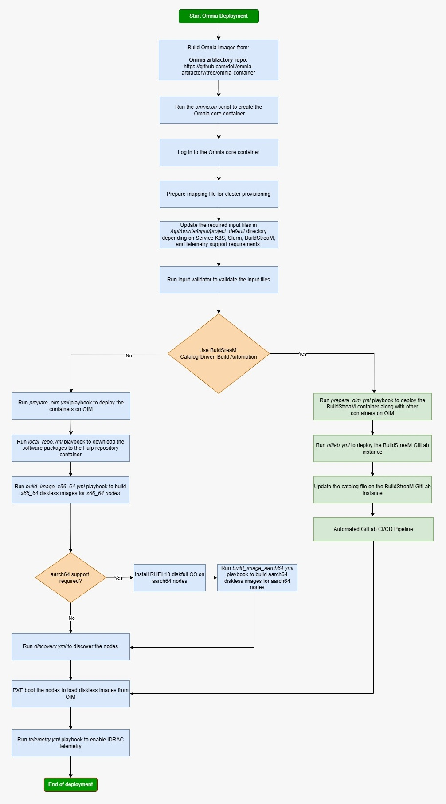

Dell Omnia 

Get Started 

 "Share")

 * [ Home ](../index.html)

 Dell Omnia 

 * [ Home ](../index.html)

Overview 
 * [ Architecture ](../Overview/architecture.html)

Get Started 
 * [ Prerequisites Checklist ](prerequisites_checklist.html)

How-to Guides 
 * Setup Setup 
 * [ Prepare OIM ](../HowTo/Setup/prepare_oim.html)
 * Slurm Slurm 
 * [ Set Up Slurm ](../HowTo/Slurm/setup_slurm.html)
 * Kubernetes Kubernetes 
 * [ Set Up Kubernetes ](../HowTo/Kubernetes/setup_service_k8s.html)
 * Storage Storage 
 * [ Configure NFS ](../HowTo/Storage/configure_nfs.html)
 * Networking Networking 
 * [ Configure InfiniBand ](../HowTo/Networking/configure_infiniband.html)
 * Authentication Authentication 
 * [ Set Up OpenLDAP ](../HowTo/Authentication/setup_openldap.html)
 * Telemetry Telemetry 
 * [ Set Up Telemetry ](../HowTo/Telemetry/setup_telemetry.html)
 * Containers Containers 
 * [ Use Apptainer ](../HowTo/Containers/use_apptainer.html)
 * BuildStreaM BuildStreaM 
 * [ Deploy GitLab ](../HowTo/BuildStreaM/deploy_gitlab.html)

Reference 
 * Support Matrix Support Matrix 
 * [ Servers ](../Reference/SupportMatrix/servers.html)
 * Configuration Configuration 
 * [ Omnia Config ](../Reference/Configuration/omnia_config.html)
 * Sample Files Sample Files 
 * [ PXE Mapping File ](../Reference/SampleFiles/pxe_mapping_file.html)
 * Cluster Requirements Cluster Requirements 
 * [ Minimum Nodes ](../Reference/ClusterRequirements/minimum_nodes.html)
 * Playbooks Playbooks 
 * [ Playbook Reference ](../Reference/Playbooks/playbook_reference.html)
 * Metrics Metrics 
 * [ iDRAC Metrics ](../Reference/Metrics/idrac_metrics.html)
 * Appendices Appendices 
 * [ Hostname Requirements ](../Reference/Appendices/hostname_requirements.html)

Operations 
 * [ Add / Remove Nodes ](../Operations/add_remove_nodes.html)

Troubleshooting 
 * [ General ](../Troubleshooting/general.html)

Contributing 
 * [ Pull Requests ](../Contributing/pull_requests.html)

Table of contents 

 * [ Deployment Paths at a Glance ](#deployment-paths-at-a-glance)

 1. [ Home ](../index.html)
 2. [ Get Started ](index.html)

# Get Started[¶](#get-started "Permanent link")

Choose your deployment path based on your cluster requirements, available hardware, and desired workload. Each path is a self-contained, end-to-end tutorial that takes you from a bare set of PowerEdge servers to a fully operational cluster.

Note

Before selecting a path, complete the [Prerequisites Checklist](prerequisites_checklist.html) to ensure your hardware, networking, and software environment are ready.

## Deployment Paths at a Glance[¶](#deployment-paths-at-a-glance "Permanent link")

Path | Name | Workload | Nodes | Time | Description 
---|---|---|---|---|--- 
**A** | [Slurm Quickstart](slurm_quickstart.html) | Traditional HPC (Slurm) | 4 | ~2 hrs | Fastest way to stand up a Slurm cluster. Deploys 1 OIM (management), 1 Slurm head node, 1 compute node, and 1 login node. No Kubernetes or telemetry. Ideal for first-time users and small-scale HPC workloads. 
**B** | [Full Deployment](full_deployment.html) | Slurm + Service K8s + Telemetry | 8 | ~4 hrs | Production-grade deployment with Slurm scheduling, a highly available 3-node Kubernetes service cluster, LDAP/FreeIPA authentication, and full telemetry (iDRAC, Grafana, VictoriaMetrics). Best for teams running mixed HPC/AI workloads with monitoring requirements. 
**C** | [K8S Telemetry Only](k8s_telemetry_only.html) | Kubernetes + Telemetry (no Slurm) | 5 | ~2 hrs | Deploys a 3-control-plane + 1-worker Kubernetes cluster with the complete telemetry pipeline (iDRAC metrics, LDMS, Kafka, VictoriaMetrics, Grafana). No Slurm. Use this when you need infrastructure monitoring without a job scheduler. 
**D** | [Buildstream Deployment](buildstream_deployment.html) | BuildStreaM (Catalog-Driven CI/CD) | 8+ | ~6 hrs | Automated, catalog-driven deployment using GitLab CI/CD pipelines. BuildStreaM reads a declarative catalog to provision and configure the entire cluster. Best for organizations with GitOps workflows or repeated, reproducible deployments at scale. 
 
## Which Path Should I Choose?[¶](#which-path-should-i-choose "Permanent link")

**"I just want Slurm running as fast as possible."** Start with [Slurm Quickstart](slurm_quickstart.html) (Path A). You can always add Kubernetes and telemetry later.

**"I need a production cluster with monitoring and authentication."** Go with [Full Deployment](full_deployment.html) (Path B). This is the canonical Omnia deployment that exercises every major subsystem.

**"I only need telemetry dashboards -- no job scheduler."** Choose [K8S Telemetry Only](k8s_telemetry_only.html) (Path C). This gives you iDRAC-to-Grafana visibility without the overhead of Slurm.

**"I want CI/CD-driven, repeatable infrastructure."** Use [Buildstream Deployment](buildstream_deployment.html) (Path D). BuildStreaM automates the entire lifecycle through GitLab pipelines and a declarative catalog.

## Before You Begin[¶](#before-you-begin "Permanent link")

Every path assumes you have completed the items in [Prerequisites Checklist](prerequisites_checklist.html). That page covers:

 * Supported hardware and firmware versions
 * OIM (management node) requirements (RAM, OS, Podman, NICs)
 * Network switch configuration (admin + BMC VLANs)
 * NFS / storage preparation
 * BIOS and iDRAC settings on target nodes
 * Required RHEL subscriptions and Docker credentials

Tip

Print or bookmark the [Prerequisites Checklist](prerequisites_checklist.html) \-- it doubles as a day-of-deployment runbook you can hand to a datacenter technician.

Back to top [ Previous Glossary ](../Overview/glossary.html) [ Next Prerequisites Checklist ](prerequisites_checklist.html)

Copyright © 2025 Dell Technologies. All rights reserved. 

