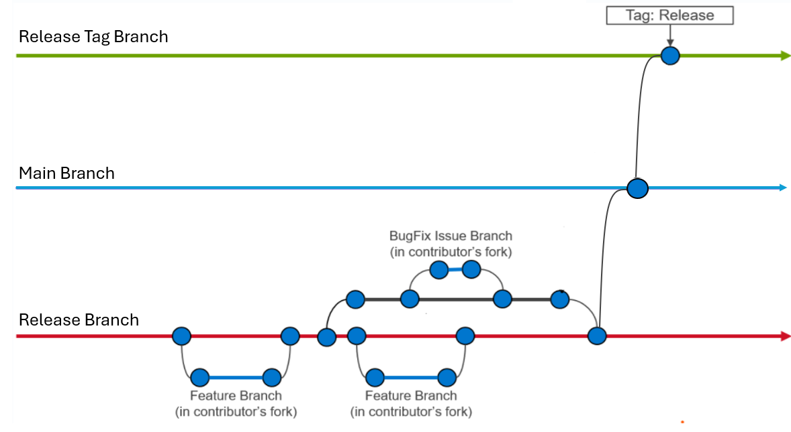

# Pull Requests

This guide outlines the requirements and review process for contributing changes to Omnia.

## Before Creating a PR

* Search existing [GitHub issues](https://github.com/dell/omnia/issues) and [Pull requests](https://github.com/dell/omnia/pulls) to avoid duplicate work.
* For significant changes, open an issue first and align with maintainers on the proposed approach.
* Review the [Architecture](../Overview/architecture.md) and [Overview](../Overview/index.md) documentation.



## Development Setup

1. Fork and clone the repository:
   ```bash
   git clone https://github.com/<your_username>/omnia.git
   cd omnia
   ```

2. Add the upstream repository:
   ```bash
   git remote add upstream https://github.com/dell/omnia.git
   ```

3. Synchronize with the latest `main` branch:
   ```bash
   git fetch upstream
   git checkout main
   git merge upstream/main
   ```

4. Create a feature branch:
   ```bash
   git checkout -b feature/<descriptive-name>
   ```

## Contribution Standards

### Code Quality

* Follow established project conventions and language-specific best practices.
* Format and lint code before submitting:
  * Python: PEP 8, `black`, `flake8`
  * Shell: `shellcheck`
  * Ansible: Ansible best practices with clear task and variable names
* Maintain consistency with existing documentation structure and style.

### Testing

* Add or update tests for all functional changes.
* Update Molecule tests for Ansible roles where applicable.
* Use `pytest` for Python unit tests.
* Ensure all existing and new tests pass.

## Developer Certificate of Origin (DCO)

All contributions must be signed off in accordance with the <https://developercertificate.org/>.

```bash
git commit -s
```

## Submitting a Pull Request

1. Push your branch:

```bash
git push origin feature/<descriptive-name>
```

2. Create a PR targeting `dell/omnia:main`.

3. Include the following information in the PR description:

```text
## Summary
Brief description of the change.

## Related Issue
Fixes #<issue_number>

## Changes
- Change 1
- Change 2

## Validation
- Test environment
- Validation steps
- Results

## Checklist
- [ ] Coding standards followed
- [ ] Tests added/updated
- [ ] Documentation updated (if required)
- [ ] All tests passing
```

4. Request review from project maintainers.

## Review Process

1. **Automated validation** – CI checks, linting, and automated tests must pass.
2. **Maintainer review** – Reviewers assess correctness, maintainability, testing, documentation, security, and compatibility.
3. **Feedback resolution** – Address review comments with incremental commits. Avoid force-pushes during active review unless requested.
4. **Merge** – Approved PRs with passing CI are merged by a maintainer.

### Review Criteria

* Functional correctness
* Code quality and maintainability
* Test coverage
* Documentation completeness
* Security considerations
* Compatibility across supported platforms

## Recommendations

To expedite reviews:

* Keep PRs focused on a single logical change.
* Provide a clear problem statement and validation evidence.
* Include relevant test results and documentation updates.

!!! info

```
- [Contribution Overview](index.md) – Contribution overview
- [Omnia GitHub Repository](https://github.com/dell/omnia/pulls) – Source code and issue tracker
```


