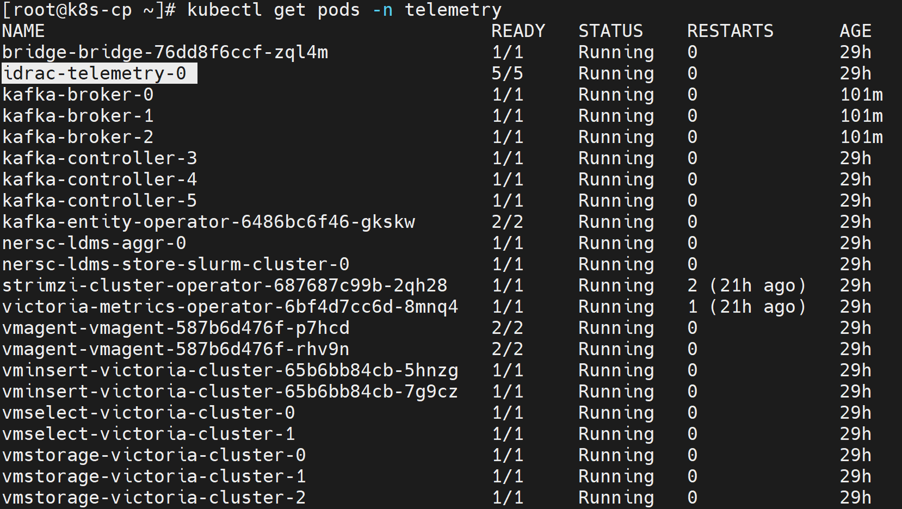
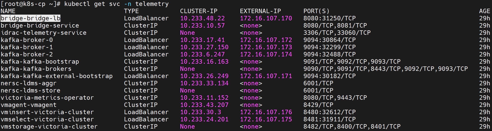
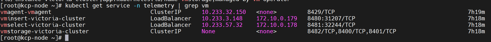

# Configure iDRAC Telemetry


Configure iDRAC Telemetry to collect out-of-band hardware metrics from Dell PowerEdge servers via the Redfish API.

## Overview


iDRAC Telemetry collects hardware metrics from Dell servers using the integrated Dell Remote Access Controller (iDRAC). iDRAC Telemetry includes the following components:

### Components

- **iDRAC Collector** -- Polls each server's Redfish endpoint for hardware metrics. Runs as a Kubernetes pod in the telemetry namespace.
- **ActiveMQ** -- Internal message broker used by the iDRAC collector to decouple metric collection from downstream routing.
- **KafkaPump** -- Routes iDRAC metrics from ActiveMQ to the Kafka `idrac` topic.
- **VictoriaPump** -- Routes iDRAC metrics from ActiveMQ to VictoriaMetrics via VMAgent.
- **VMAgent** -- Forwards metrics to VictoriaMetrics cluster (vminsert).
- **MySQL Database** -- Stores iDRAC telemetry metadata. Storage size is configurable via `telemetry_storage_config.yml`.

### Data Flow

```
iDRAC (BMC) → iDRAC Collector → Kafka
iDRAC (BMC) → iDRAC Collector → VMAgent → VictoriaMetrics
```

### Supported Metrics

| Category | Metrics Collected |
| --- | --- |
| Thermal | Inlet temperature, exhaust temperature, CPU temperature, fan speeds |
| Power | System power consumption, PSU input/output power, power capping status |
| Storage Health | Physical disk status, virtual disk health, controller health, SMART data |
| CPU/Memory | Correctable/uncorrectable ECC errors, CPU utilization, DIMM health |
| System Events | Hardware alerts, lifecycle events, firmware status |

For the complete list of iDRAC telemetry metrics, see [Dell iDRAC Telemetry Reference Guide](https://dl.dell.com/content/manual43363890-dell-idrac-telemetry-reference-guide.pdf?language=en-us) and [iDRAC Telemetry Reference Tools](https://github.com/dell/iDRAC-Telemetry-Reference-Tools).


## Prerequisites

Complete the following before you configure iDRAC telemetry. Provisioning the cluster happens **after** this configuration, as part of the deployment sequence.

- The [Setup the OIM](../main/setup_oim.md) procedure is complete (main domain setup is complete)
- The [Initialize Domains](../main/initialize_domains.md) procedure is complete (telemetry domain is initialized)
- The [Deploy Kubernetes](../orchestrator/deploy_kubernetes.md) procedure is complete (kube_vip cluster is running)
- The mapping file (`pxe_mapping_file.csv`) is created. See [Create Mapping File](../discovery/../discovery/create_mapping_file.md).
- Redfish must be enabled in iDRAC.
- iDRAC firmware must be updated to the latest version.
- **Datacenter license** must be installed on the nodes. Enterprise license is not sufficient for streaming telemetry.
- The correct node service tags are displayed on the iDRAC interface. Otherwise, telemetry data cannot be collected by the iDRAC collector.
- All BMC (iDRAC) IPs must be reachable from the Kubernetes worker nodes hosting telemetry pods.

    | Network Topology | Action Required |
    |---|---|
    | Flat network — all BMC subnets are directly reachable from the worker node admin/PXE network | No additional configuration needed. |
    | Multi-subnet — one or more BMC subnets are not reachable from the worker node admin/PXE network | Configure VLAN tagging and static routes on all worker nodes. See [Worker Node VLAN Configuration for iDRAC Telemetry](worker_node_vlan_configuration.md). |

!!! note
    If there is a dedicated setup and BMC IPs are not reachable, enable masquerading (after the cluster is provisioned) to make BMC IPs reachable:

    ```bash title="Run on: K8s control plane"
    iptables -t nat -A POSTROUTING -o "<external interface which has internet>" -j MASQUERADE
    iptables -A FORWARD -i "<local interface which has internet>" -o "<external interface which has internet>" -j ACCEPT
    iptables -A FORWARD -i "<external interface which has internet>" -o "<local interface which has internet>" -m state --state RELATED,ESTABLISHED -j ACCEPT
    ```

    These commands set up Network Address Translation (NAT) and packet forwarding to allow devices on one network interface to access the internet through another interface.

!!! note "iDRAC metric limitation on AMD processors"

    For servers powered by AMD processors, `CPUUsage` is currently the only supported system utilization metric available through iDRAC telemetry. For additional details, see the [iDRAC Telemetry Reference Guide](https://dl.dell.com/content/manual43363890-dell-idrac-telemetry-reference-guide.pdf?language=en-us).


## Procedure


### Step 1: Add Required Software to software_config.json

iDRAC telemetry runs on the service Kubernetes cluster. Ensure the `service_k8s`
entry is present in `software_config.json`. Include an `aarch64` entry only if you
have aarch64 nodes.

```json title="software_config.json -- required for iDRAC telemetry"
{
    "softwares": [
        {"name": "service_k8s", "version": "1.35.1", "arch": ["x86_64"]}
    ]
}
```

For the full file structure, see the
[software_config.json reference](../../Reference/Configuration/software_config.md).

### Step 2: Add Required Nodes to the Mapping File

iDRAC telemetry requires a service Kubernetes cluster. In `pxe_mapping_file.csv`,
ensure the following functional groups are present:

- `service_kube_control_plane` (three control plane nodes)
- `service_kube_node` (at least one worker node)

The `BMC_IP` column must be populated for every node whose iDRAC telemetry you want
to collect. Ensure the service tag of the `service_kube_node` is set as the
`PARENT_SERVICE_TAG` for the Slurm nodes.

```text title="pxe_mapping_file.csv -- example service K8s rows"
FUNCTIONAL_GROUP_NAME,GROUP_NAME,SERVICE_TAG,PARENT_SERVICE_TAG,HOSTNAME,ADMIN_MAC,ADMIN_IP,BMC_MAC,BMC_IP,IB_NIC_NAME,IB_IP
service_kube_control_plane_x86_64,grp4,H94M8F3,,kcp1,BC:97:E1:F0:94:F0,172.16.107.96,b0:7b:25:d8:4a:f4,100.10.1.99,,
service_kube_control_plane_x86_64,grp5,2LXT933,,kcp2,BC:97:E1:F0:95:10,172.16.107.97,b0:7b:25:d8:4b:04,100.10.1.100,,
service_kube_control_plane_x86_64,grp7,8X697C3,,kcp3,BC:97:E1:F0:95:30,172.16.107.98,b0:7b:25:d8:4b:14,100.10.1.101,,
service_kube_node_x86_64,grp6,GZF6ZS3,,kn,EC:2A:72:32:C6:98,172.16.107.95,ec:2a:72:3b:a8:52,100.10.0.209,,
```

For the full format, see the
[PXE mapping file reference](../../Reference/SampleFiles/pxe_mapping_file.md).

### Step 3: Enable iDRAC in telemetry_config.yml

Configure iDRAC telemetry settings in `telemetry_config.yml`. For details on all parameters, see the [telemetry_config.yml reference](../../Reference/Configuration/telemetry_config.md).

```yaml title="telemetry_config.yml -- iDRAC"
telemetry_sources:
  idrac:
    metrics_enabled: true
    collection_targets:
      - "victoria_metrics"
      - "kafka"

idrac_telemetry_configurations:
  mysqldb_storage: "1Gi"
```

| Parameter | Description |
| --- | --- |
| `metrics_enabled` | Enable or disable iDRAC metrics collection (`true` or `false`) |
| `collection_targets` | Where iDRAC data is sent. Supported: `victoria_metrics`, `kafka`. You can specify both |
| `mysqldb_storage` | Storage size for the iDRAC telemetry MySQL metadata database |

### Step 4: Deploy the Cluster

Deploy the cluster by running the full playbook sequence
(`prepare_oim.yml` -> `local_repo.yml` -> `build_image` -> `provision.yml`).
`provision.yml` deploys the iDRAC telemetry infrastructure to the service K8s
cluster. See [Deploy the Telemetry Stack](deploy_telemetry.md).

iDRAC telemetry requires one **additional** step after provisioning. Run
`telemetry.yml` to validate the BMC IPs and initiate iDRAC telemetry collection:

```bash title="Run on OIM host"
cd /omnia/telemetry
ansible-playbook telemetry.yml
```

!!! note

    - `telemetry.yml` validates iDRAC BMC IPs, generates the service cluster metadata, and triggers the iDRAC telemetry collection.
    - Service cluster metadata automatically captures the service cluster kube control plane virtual IP. As a result, `telemetry.yml` is executed against the VIP rather than an individual control plane node.

!!! important

    If you enable iDRAC telemetry on an already-provisioned cluster, re-run `provision.yml`, execute the `telemetry.sh` script on the K8s control plane, and then run `telemetry.yml`. See [Update Telemetry on a Running Cluster](deploy_telemetry.md#update-telemetry-on-a-running-cluster).

    ```bash title="Run on K8s control plane"
    <K8s_NFS_mount_point>/telemetry/telemetry.sh
    ```


### Step 5: Collect Telemetry from External Nodes (Optional)

To collect iDRAC telemetry from servers that are not part of the Omnia-managed cluster:

1. Update the BMC IP of the external nodes in `/opt/omnia/telemetry/bmc_group_data.csv`. The `GROUP_NAME` and `PARENT` fields must be left blank.

    ```text title="Sample bmc_group_data.csv"
    BMC_IP,GROUP_NAME,PARENT
    10.3.0.101,,
    10.3.0.102,,
    ```
2. Run the telemetry playbook:

    ```bash title="Run on OIM host"
    cd /omnia/telemetry
    ansible-playbook telemetry.yml
    ```


## Verification


### Verify iDRAC Telemetry Pods

1. Verify that the iDRAC telemetry pod is running:

    ```bash title="Run on K8s control plane"
    kubectl get pods -n telemetry
    ```

    

!!! note

    The `idrac-telemetry-0` pod is a StatefulSet that collects telemetry data from all management nodes (`oim`, `service_kube_control_plane_x86_64`, `service_kube_node_x86_64`, `login_node_x86_64`, etc.). The number of `idrac-telemetry` pod replicas is determined by the number of unique `PARENT_SERVICE_TAG` values in the mapping file. Each replica collects telemetry from the iDRAC interfaces of the nodes that share the same parent service tag.


### Verify iDRAC Messages in Kafka

To verify that iDRAC telemetry data is being successfully published to the `idrac` Kafka topic:

1. Log in to the Service Kubernetes control plane.

2. List the telemetry services to identify the `bridge-bridge-lb` external IP:

    ```bash title="Run on K8s control plane"
    kubectl get svc -n telemetry
    ```

    

3. Set the required variables:

    ```bash title="Run on K8s control plane"
    KAFKA_LB_IP=<external IP of bridge-bridge-lb service>
    TOPIC=idrac
    GROUP=idrac-consumer-group
    INSTANCE=idrac-consumer-1
    ```

4. Create a Kafka consumer:

    ```bash title="Run on K8s control plane"
    curl -X POST http://$KAFKA_LB_IP:8080/consumers/idrac-consumer-group \
    -H 'content-type: application/vnd.kafka.v2+json' \
    -d '{
            "name": "idrac-consumer-1",
            "format": "json",
            "auto.offset.reset": "earliest"
        }'
    ```

5. View the list of iDRAC Kafka topics configured:

    ```bash title="Run on K8s control plane"
    curl -s -X GET "http://$KAFKA_LB_IP:8080/topics" | jq '.'
    ```

6. Subscribe the consumer to the telemetry topic:

    ```bash title="Run on K8s control plane"
    curl -X POST http://$KAFKA_LB_IP:8080/consumers/idrac-consumer-group/instances/idrac-consumer-1/subscription \
    -H 'content-type: application/vnd.kafka.v2+json' \
    -d '{"topics": ["idrac"]}'
    ```

7. Consume messages from the topic:

    ```bash title="Run on K8s control plane"
    while true; do curl -X GET http://$KAFKA_LB_IP:8080/consumers/idrac-consumer-group/instances/idrac-consumer-1/records \
    -H 'accept: application/vnd.kafka.json.v2+json' | jq '.' ;  sleep 2; done
    ```

If telemetry metrics are collected correctly, the output contains JSON-formatted iDRAC telemetry records.

### Verify TLS Connectivity

**VictoriaMetrics TLS**

1. Run the VictoriaMetrics TLS test job:

    ```bash title="Run on K8s control plane"
    cd /<nfs client mount path of the service k8s cluster>/telemetry/deployments/test
    kubectl apply -f victoria-tls-test-job.yaml
    ```

2. After the job completes, check the logs to confirm that the TLS connection is successful:

    ```bash title="Run on K8s control plane"
    kubectl logs victoria-tls-test-xxx -n telemetry
    ```

**Kafka TLS**

1. Run the Kafka TLS test job:

    ```bash title="Run on K8s control plane"
    cd /<nfs client mount path of the service k8s cluster>/telemetry/deployments/test
    kubectl apply -f kafka.tls_test_job.yaml
    ```

2. After the job completes, check the logs to confirm that the TLS connection is successful:

    ```bash title="Run on K8s control plane"
    kubectl logs kafka-tls-test-xxx -n telemetry
    ```

### View iDRAC Metrics in VictoriaMetrics UI (VMUI)

Use the VMUI to validate that iDRAC telemetry data is being collected and stored successfully.

1. Verify that the VictoriaMetrics pods are running:

    ```bash title="Run on K8s control plane"
    kubectl get pods -n telemetry -o wide | grep vm
    ```

    

2. Verify that the VictoriaMetrics service is running:

    ```bash title="Run on K8s control plane"
    kubectl get service -n telemetry | grep vm
    ```

    

3. Note the **External IP** and **port number** of the VictoriaMetrics service.

4. Access the VMUI in a web browser:

    ```
    https://<external vmselect loadbalancer IP>:8481/select/0/vmui
    ```

5. Verify that metrics are reaching VictoriaMetrics by querying the VMUI. For example, the following query displays iDRAC-related metrics:

    ```
    {__name__=~"PowerEdge_.*"}
    ```

    


### Access the MySQL Database

After `telemetry.yml` has been executed for the service cluster, you can check the MySQL database inside the `mysqldb` container.

1. Get the names of all the telemetry pods:

    ```bash title="Run on K8s control plane"
    kubectl get pods -n telemetry -l app=idrac-telemetry
    ```

    !!! note

        The `idrac-telemetry-0` pod will always be responsible for collecting the telemetry data of the management nodes (`oim`, `service_kube_control_plane_x86_64`, `service_kube_node_x86_64`, `login_node_x86_64`, etc.).

2. Execute the following command:

    ```bash title="Run on K8s control plane"
    kubectl exec -it -n telemetry <iDRAC_telemetry_pod_name> -c mysqldb -- mysql -u <MYSQL_USER> -p
    ```

3. When prompted, enter the MySQL password to log in.

4. To enter into the `idrac_telemetry_db`:

    ```sql
    use idrac_telemetrydb;
    ```

5. To access the services table:

    ```sql
    select * from services;
    ```


## Next Steps


- [Setup Telemetry](setup_telemetry.md) -- Overview of all telemetry sources.


## Troubleshooting

### iDRAC telemetry — no metrics reaching VictoriaMetrics / Kafka

???+ note "Symptom"

    iDRAC metrics (power, thermal, fan, CPU) do not appear in Grafana or VictoriaMetrics, or data is stale. The iDRAC telemetry receiver pods restart repeatedly or remain in `0/1 Ready` state. New nodes do not appear as telemetry sources after provisioning.

    Example errors in VictoriaPump / KafkaPump container logs:

    - `ERROR failed to subscribe to Redfish event service: 401 Unauthorized`
    - `ERROR redfish: event subscription rejected (SubscriptionLimitExceeded)`
    - `WARN activemq: connection refused tcp 127.0.0.1:61616`
    - `ERROR victoriapump: post to vmagent failed: dial tcp <vmagent-svc>:8429: connect: connection refused`

    !!! note

        The `401 Unauthorized` error may occur due to credential drift — when iDRAC credentials are changed on the iDRAC side after a successful deployment. Omnia stores credentials in mysqldb at insert-time and does not continuously re-validate them against the iDRAC appliance.

??? note "Cause"

    - Incorrect or expired iDRAC credentials in the vault (`idrac_username` / `idrac_password`), resulting in `401 Unauthorized` errors.
    - Redfish subscription limit reached on iDRAC (stale subscriptions from prior runs).
    - iDRAC firmware does not support Redfish Telemetry/EventService.
    - Pipeline component failure (ActiveMQ, KafkaPump, or VictoriaPump not ready).
    - Collection type misconfiguration (`telemetry_sources.idrac.collection_targets` does not include the expected sink).
    - Network or firewall blocking OIM from reaching iDRAC on port 443, or receiver from reaching vmagent for scraping `victoria-pump:2112/metrics` or Kafka on port 9093 (TLS).

??? note "Resolution"

    **Diagnostics:**

    ```bash title="Run on: K8s control plane"
    kubectl get pods -A | grep -Ei 'telemetry|idrac|victoria|kafka'
    ```

    Inspect iDRAC telemetry receiver pod (contains mysqldb, activemq, idrac-telemetry-receiver, kafka-pump, victoria-pump, plus initContainer cleanup-mysql-locks):

    ```bash title="Run on: K8s control plane"
    kubectl -n telemetry describe pod <idrac-telemetry-pod>
    kubectl -n telemetry logs <idrac-telemetry-pod> -c victoria-pump --tail=100
    kubectl -n telemetry logs <idrac-telemetry-pod> -c kafka-pump --tail=100
    ```

    Verify Redfish reachability and credentials:

    ```bash title="Run on: OIM host"
    curl -sk -u "$IDRAC_USER:$IDRAC_PASS" https://<idrac-ip>/redfish/v1/EventService | head
    ```

    List and delete stale Redfish subscriptions:

    ```bash title="Run on: OIM host"
    curl -sk -u "$IDRAC_USER:$IDRAC_PASS" https://<idrac-ip>/redfish/v1/EventService/Subscriptions
    ```

    Confirm metrics landed in VictoriaMetrics:

    ```bash title="Run on: K8s control plane"
    curl -s 'https://<vmselect-svc>:8481/select/0/prometheus/api/v1/query?query=up' | head
    ```

    **Resolution steps:**

    1. Correct `idrac_username` / `idrac_password` in `omnia_config_credentials.yml`, then run `ansible-playbook provision/provision.yml`, SSH to kube_vip and manually re-run `bash <k8s_client_mount_path>/telemetry/telemetry.sh`, then run `telemetry.yml`. Verify with the curl command above (expect 200).
    2. Delete orphaned Redfish subscriptions using `curl -X DELETE ...`, then allow the receiver to re-subscribe.
    3. Update iDRAC firmware to a version that supports Redfish EventService/Telemetry, then re-run telemetry.
    4. If ActiveMQ/KafkaPump/VictoriaPump is unhealthy, check container logs and restart the receiver pod (`kubectl delete pod <pod>`) after confirming the root cause.
    5. Set `telemetry_sources.idrac.collection_targets` to `["victoria_metrics"]`, `["kafka"]`, or `["victoria_metrics", "kafka"]` to match where you expect data, then run `ansible-playbook provision/provision.yml`, SSH to kube_vip and re-run `bash <k8s_client_mount_path>/telemetry/telemetry.sh`, then run `telemetry.yml`.
    6. Ensure OIM can reach iDRAC on port 443 and the receiver can reach vmagent for scraping `victoria-pump:2112/metrics` and Kafka on port 9093 (TLS).

    !!! note

        iDRAC telemetry is enabled by `telemetry_sources.idrac.metrics_enabled: true` and routed per `telemetry_sources.idrac.collection_targets` in `input/telemetry_config.yml`. The receiver (mysqldb + activemq + idrac-telemetry-receiver + kafka-pump conditional + victoria-pump conditional, plus initContainer cleanup-mysql-locks) is a generated StatefulSet — modify inputs and re-run rather than editing the pod. Manifests (VMCluster, VLCluster, Kafka, iDRAC StatefulSet) are generated by `provision.yml` into `telemetry/deployments/` on the NFS share, then applied by `telemetry.sh`, which cloud-init runs automatically only when a new control-plane node is provisioned. For an already-running cluster, after editing `telemetry_config.yml`, run `ansible-playbook provision/provision.yml`, SSH to kube_vip and manually re-run `bash <k8s_client_mount_path>/telemetry/telemetry.sh`, then run `telemetry.yml` only if the change involves iDRAC (credentials, collection_targets, BMC list).

For additional telemetry issues (Kafka, VictoriaMetrics, VictoriaLogs), see [Troubleshooting Telemetry](../../Troubleshooting/telemetry.md).


