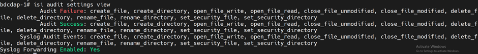
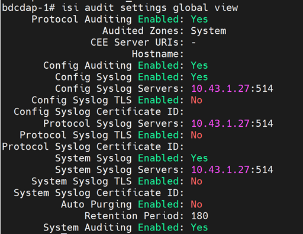
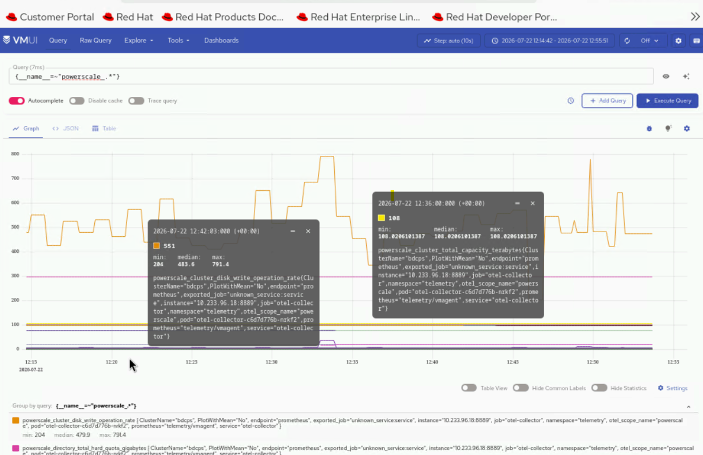

# Configure PowerScale Telemetry


Configure deployment of PowerScale Telemetry to collect storage performance metrics and logs from Dell PowerScale storage nodes.

## Overview


PowerScale Telemetry collects storage performance metrics and logs. PowerScale Telemetry includes the following components:

### Components

- **CSM Metrics for PowerScale** -- Queries the OneFS API and emits metrics to an OpenTelemetry Collector.
- **OpenTelemetry Collector** -- Receives metrics from CSM Metrics and exposes a Prometheus endpoint for scraping.
- **vmagent** -- Scrapes the OpenTelemetry Collector Prometheus endpoint over TLS and forwards metrics to VictoriaMetrics.
- **VLAgent** -- Receives PowerScale syslog events and forwards them to VictoriaLogs.
- **CSI Driver for Dell PowerScale** -- Required for Omnia-orchestrated deployment mode.
- **cert-manager** -- Required for TLS certificate management in Omnia-orchestrated mode.

### Data Flow

```
PowerScale Nodes → CSM Metrics PowerScale → OTEL Collector → vmagent (shared) → VictoriaMetrics
PowerScale Nodes → syslog → VLAgent → VictoriaLogs
```

### Supported Metrics and Logs

**Metrics:**

| Category | Metrics Collected |
| --- | --- |
| Performance | Protocol-level IOPS (NFS, SMB, S3), throughput (bytes/s), read/write latency |
| Capacity | Total cluster capacity, used capacity, available capacity, per-node capacity |
| Health | Node online/offline status, disk health, cluster rebalance status, protection group status |
| Topology | Cluster node membership, node roles, interconnect layout, protection domain mapping |

For the complete list of PowerScale telemetry metrics, see [PowerScale Metrics Reference](../../Reference/Metrics/powerscale_metrics.md) and [Supported PowerScale Metrics](https://dell.github.io/csm-docs/docs/concepts/observability/metrics/powerscale/).

**Logs:**

| Category | Logs Collected |
| --- | --- |
| System Events | Capacity warnings, disk failures, node state changes, protocol errors |
| Labels | Events are labeled with host/cluster, severity, and facility |

### Health Monitor Metrics

When the CSI PowerScale health monitor is enabled (`controller > healthMonitor > enabled: true` and `node > healthMonitor > enabled: true` in the CSI PowerScale values.yaml), Omnia collects the following additional health metrics:

**PV Metrics:**

- `powerscale_volume_status` - PV phase (1=Bound, 0=Other) [pv_name, phase]
- `powerscale_volume_count` - Total PowerScale PVs by phase [phase]
- `powerscale_volume_capacity_bytes` - PV capacity in bytes [pv_name]
- `powerscale_volume_info` - PV metadata [pv_name, phase, storage_class, reclaim_policy, access_modes, volume_handle, pvc_name, pvc_namespace]
- `powerscale_volume_age_seconds` - Seconds since PV creation [pv_name]

**PVC Metrics:**

- `powerscale_pvc_status_phase` - PVC phase (1=Bound, 0=Other) [pvc_name, pvc_namespace, phase]
- `powerscale_pvc_requested_bytes` - PVC requested storage in bytes [pvc_name, pvc_namespace]
- `powerscale_pvc_count` - Total PowerScale PVCs by phase [phase]

**Health Event Metrics:**

- `powerscale_volume_health_abnormal` - Volume condition abnormal (1=abnormal, 0=healthy) [pvc_name, pvc_namespace, pv_name]
- `powerscale_volume_abnormal_events_total` - Total VolumeConditionAbnormal events [pvc_name, pvc_namespace]
- `powerscale_node_failure_events_total` - Total node failure events [node]

**Node Metrics:**

- `powerscale_node_ready` - Node Ready condition (1=True, 0=False) [node]

**Storage Class Metrics:**

- `powerscale_storageclass_info` - StorageClass metadata [storageclass, provisioner, reclaim_policy, volume_binding_mode, allow_volume_expansion]

**Aggregate Summary:**

- `powerscale_total_capacity_bytes` - Total capacity of all PowerScale PVs in bytes


### TLS and Authentication

All metric scraping between the OpenTelemetry Collector and VictoriaMetrics uses TLS encryption. Authentication uses Kubernetes service-account tokens. Mutual TLS (mTLS) is not required — the connection is encrypted but the PowerScale-side endpoint does not validate client identity via certificate exchange. TLS is enforced for all off-cluster communications.


## Prerequisites


Complete the following before you configure PowerScale telemetry. Provisioning the
cluster happens **after** this configuration, as part of the deployment sequence.

- The [Setup the OIM](../main/setup_oim.md) procedure is complete (main domain setup is complete)
- The [Initialize Domains](../main/initialize_domains.md) procedure is complete (telemetry domain is initialized)
- The [Deploy Kubernetes](../orchestrator/deploy_kubernetes.md) procedure is complete (kube_vip cluster is running)
  [Deploy Omnia Core](https://github.com/dell/omnia).
- The mapping file (`pxe_mapping_file.csv`) is created. See
  [Create Mapping File](../discovery/../discovery/create_mapping_file.md).
- A Dell PowerScale (OneFS) cluster is reachable from the service Kubernetes cluster.
- The CSM Observability (Karavi) values.yaml file is available.
- Network connectivity between the PowerScale cluster and the Omnia log agent for syslog integration.


## Procedure


### Step 1: Add Required Software to software_config.json

PowerScale telemetry runs on the service Kubernetes cluster and uses the CSI driver
for Dell PowerScale. Add the `service_k8s` and `csi_driver_powerscale` entries to
`software_config.json`. Include an `aarch64` entry only if you have aarch64 nodes.

```json title="software_config.json -- required for PowerScale telemetry"
{
    "softwares": [
        {"name": "service_k8s", "version": "1.35.1", "arch": ["x86_64"]},
        {"name": "csi_driver_powerscale", "version": "v2.17.0", "arch": ["x86_64"]}
    ]
}
```

!!! note

    These entries must be present when `telemetry_sources > powerscale > metrics_enabled` is set to `true` in the `telemetry_config.yml` file. For the full file structure, see the [software_config.json reference](../../Reference/Configuration/software_config.md).

### Step 2: Add Required Nodes to the Mapping File

PowerScale telemetry requires a service Kubernetes cluster. In
`pxe_mapping_file.csv`, ensure the following functional groups are present:

- `service_kube_control_plane` (three control plane nodes)
- `service_kube_node` (at least one worker node)

```csv title="pxe_mapping_file.csv -- example service K8s rows"
FUNCTIONAL_GROUP_NAME,GROUP_NAME,SERVICE_TAG,PARENT_SERVICE_TAG,HOSTNAME,ADMIN_MAC,ADMIN_IP,BMC_MAC,BMC_IP,IB_NIC_NAME,IB_IP
service_kube_control_plane_x86_64,grp4,H94M8F3,,kcp1,BC:97:E1:F0:94:F0,172.16.107.96,b0:7b:25:d8:4a:f4,100.10.1.99,,
service_kube_control_plane_x86_64,grp5,2LXT933,,kcp2,BC:97:E1:F0:95:10,172.16.107.97,b0:7b:25:d8:4b:04,100.10.1.100,,
service_kube_control_plane_x86_64,grp7,8X697C3,,kcp3,BC:97:E1:F0:95:30,172.16.107.98,b0:7b:25:d8:4b:14,100.10.1.101,,
service_kube_node_x86_64,grp6,GZF6ZS3,,kn,EC:2A:72:32:C6:98,172.16.107.95,ec:2a:72:3b:a8:52,100.10.0.209,,
```

For the full format, see the
[PXE mapping file reference](../../Reference/SampleFiles/pxe_mapping_file.md).

### Step 3: Enable PowerScale in telemetry_config.yml

Configure PowerScale telemetry settings in `telemetry_config.yml`. For details on all parameters, see the [telemetry_config.yml reference](../../Reference/Configuration/telemetry_config.md).

```yaml title="telemetry_config.yml -- PowerScale section"
telemetry_sources:
  powerscale:
    metrics_enabled: true
    logs_enabled: true
    collection_targets:
      - "victoria_metrics"
      - "victoria_logs"

powerscale_configurations:
  otel_collector_storage_size: "5Gi"
  csm_observability_values_file_path: ""
```

| Parameter | Description |
| --- | --- |
| `metrics_enabled` | Enable or disable PowerScale metric collection (`true` or `false`) |
| `logs_enabled` | Enable or disable PowerScale log collection (`true` or `false`) |
| `collection_targets` | Where PowerScale data is sent. Supported: `victoria_metrics`, `victoria_logs` |
| `otel_collector_storage_size` | Persistent storage size for the OpenTelemetry Collector |
| `csm_observability_values_file_path` | Path to the CSM Observability (Karavi) values.yaml file |

!!! note

    PowerScale Telemetry supports independent feature flags for metric collection and log collection. You can enable or disable each independently.

### Step 4: Configure the CSM Observability Values File

- Provide the path to the CSM Observability (Karavi Observability) values.yaml file in `telemetry_config.yml`.
- Reference: [karavi-observability values.yaml](https://raw.githubusercontent.com/dell/helm-charts/refs/heads/release-v1.17.1/charts/karavi-observability/values.yaml){target="_blank"}
- **Important**: In the values.yaml file, only set `karaviMetricsPowerscale > enabled: true`. Set the following parameters to `false`: `karaviMetricsPowerflex > enabled`, `karaviMetricsPowerstore > enabled`, `karaviMetricsPowerscale.authorization > enabled`, `karaviMetricsPowermax > enabled`.
- **Health Metrics**: For CSI PowerScale health metrics, enable `controller > healthMonitor > enabled: true` and `node > healthMonitor > enabled: true` in the [CSI PowerScale values.yaml](https://raw.githubusercontent.com/dell/helm-charts/csi-isilon-2.17.0/charts/csi-isilon/values.yaml).

!!! note

    The karavi-metrics-powerscale pod may go into CrashLoopBackOff state when CSM is enabled with Basic authentication. To check the current authentication type on PowerScale:

    ```bash title="Run on PowerScale CLI"
    isi http settings view
    ```

    If Basic authentication is enabled, update the `isiAuthType` in the CSM Observability values.yaml file to use session-based authentication.

### Step 5: Configure PowerScale Log Forwarding (Optional)

To collect PowerScale logs, configure syslog forwarding on the PowerScale cluster:

1. Enable syslog forwarding from PowerScale:

    ```bash title="Run on PowerScale CLI"
    isi audit setting modify --syslog-forwarding-enabled true
    ```

    

2. Enable for required zones:

    ```bash title="Run on PowerScale CLI"
    isi audit settings global modify --add-audited-zones=<comma separated zone names>
    ```

3. Configure the VLAgent LoadBalancer IP address for log delivery:

    ```bash title="Run on PowerScale CLI"
    isi audit settings global modify --config-syslog-enabled=1 --config-syslog-servers=<vlagent loadbalancer ip>:514 --config-syslog-tls-enabled=0
    isi audit settings global modify --protocol-syslog-servers=<vlagent loadbalancer ip>:514 --protocol-syslog-tls-enabled=0
    isi audit settings global modify --system-syslog-enabled=1 --system-syslog-servers=<vlagent loadbalancer ip>:514 --system-syslog-tls-enabled=0
    ```

    

### Step 6: Deploy the Cluster

Deploy the cluster by running the full playbook sequence
(`prepare_oim.yml` -> `local_repo.yml` -> `build_image` -> `provision.yml`).
`provision.yml` deploys the PowerScale telemetry stack (CSM Metrics, OTEL
Collector, CSI driver) to the service K8s cluster. See
[Deploy the Telemetry Stack](deploy_telemetry.md).

**(Optional) Configure dual-destination delivery**: Specify the external VictoriaMetrics endpoint in `telemetry_config.yml`. Metrics will be delivered to both the internal time-series database and the external endpoint independently.

!!! important

    If you enable PowerScale telemetry on an already-provisioned cluster, re-run `provision.yml` and then execute the `telemetry.sh` script on the K8s control plane. See [Update Telemetry on a Running Cluster](deploy_telemetry.md#update-telemetry-on-a-running-cluster).

    ```bash title="Run on K8s control plane"
    <K8s_NFS_mount_point>/telemetry/telemetry.sh
    ```


### Enable and Disable PowerScale Telemetry


**To disable PowerScale telemetry:**

```bash title="Run on OIM host"
ansible-playbook telemetry/telemetry_disable.yml --tags powerscale
```

**To enable PowerScale telemetry again after disabling:**

```bash title="Run on OIM host"
ansible-playbook telemetry/telemetry_enable.yml --tags powerscale
```

!!! note

    - Set `powerscale.metrics_enabled` to `true` or `false` in the `telemetry_config.yml` file.
    - The `powerscale` tag is mandatory to perform the action.

**To disable PowerScale logs:**

```bash title="Run on PowerScale CLI"
isi audit settings global modify --config-syslog-enabled=0 --clear-config-syslog-servers
isi audit settings global modify --system-syslog-enabled=0 --clear-system-syslog-servers
isi audit settings global modify --clear-protocol-syslog-servers
isi audit setting modify --syslog-forwarding-enabled false
```

**To enable PowerScale logs again after disabling:**

```bash title="Run on PowerScale CLI"
isi audit setting modify --syslog-forwarding-enabled true
isi audit settings global modify --config-syslog-enabled=1 --config-syslog-servers=<vlagent loadbalancer ip>:514 --config-syslog-tls-enabled=0
isi audit settings global modify --protocol-syslog-servers=<vlagent loadbalancer ip>:514 --protocol-syslog-tls-enabled=0
isi audit settings global modify --system-syslog-enabled=1 --system-syslog-servers=<vlagent loadbalancer ip>:514 --system-syslog-tls-enabled=0
```


## Verification


### Verify PowerScale Telemetry Pods

1. Verify that the VictoriaMetrics pods are running:

    ```bash title="Run on K8s control plane"
    kubectl get pods -n telemetry -o wide | grep vm
    ```

    

2. Verify that the VictoriaMetrics service is running:

    ```bash title="Run on K8s control plane"
    kubectl get service -n telemetry -o wide | grep vm
    ```

    


### View PowerScale Metrics in VictoriaMetrics UI (VMUI)

Use the VMUI to validate that PowerScale telemetry data is being collected and stored successfully.

1. Note the **External IP** and **port number** of the VictoriaMetrics service.

2. Access the VMUI in a web browser:

    ```
    https://<external vmselect loadbalancer IP>:8481/select/0/vmui
    ```

3. Filter and view telemetry metrics using queries in VMUI. For example, the following query displays detailed PowerScale metrics for each hardware component:

    ```
    {__name__=~"powerscale_.*"}
    ```

    

### View PowerScale Logs in VictoriaLogs

Use the VictoriaLogs UI to validate that PowerScale log data is being collected.

1. Verify that the VictoriaLogs pods are running:

    ```bash title="Run on K8s control plane"
    kubectl get pods -n telemetry -o wide | grep vl
    ```

    

2. Verify that the VictoriaLogs service is running:

    ```bash title="Run on K8s control plane"
    kubectl get service -n telemetry -o wide | grep vl
    ```

    

3. Note the **External IP** and **port number** of the VictoriaLogs service.

4. Access the VictoriaLogs UI in a web browser:

    ```
    https://<external vlselect loadbalancer IP>:9471/select/vmui
    ```

5. Filter and view PowerScale logs using queries in VictoriaLogs UI. For example, use the `*` query to display all logs.

    


## Next Steps


- [Setup Telemetry](setup_telemetry.md) -- Overview of all telemetry sources.


## Troubleshooting


For common telemetry issues and resolutions, see [Troubleshooting Telemetry](../../Troubleshooting/telemetry.md).


