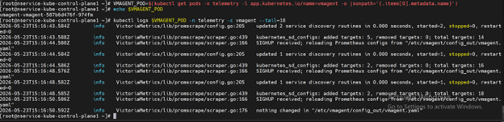
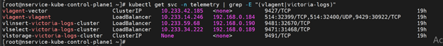
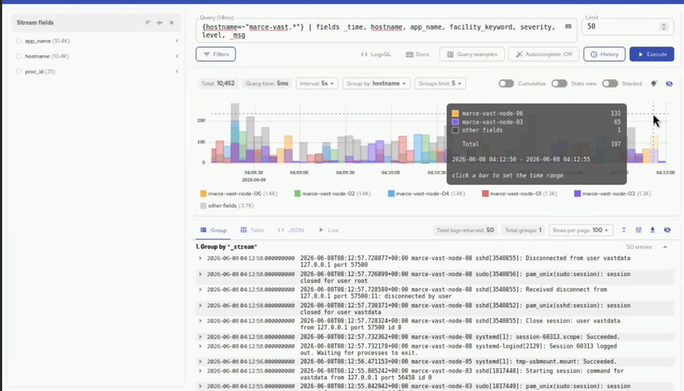

# Configure VAST (VAST Storage) Telemetry


Configure VAST Storage to securely stream telemetry metrics and logs to the Service Kubernetes cluster.

## Overview


VAST Telemetry collects storage metrics and logs. VAST Telemetry includes the following components:

### Components

- **VAST Prometheus Exporter** -- Exposes storage metrics on a Prometheus-compatible HTTPS endpoint (default port 443).
- **vmagent (shared)** -- Scrapes the VAST Prometheus exporter endpoint over TLS and forwards metrics to VictoriaMetrics.
- **VMServiceScrape CR** -- Kubernetes custom resource that declares the VAST scrape target for the VictoriaMetrics operator.
- **VLAgent** -- Receives VAST syslog events (RFC 3164/5424) and forwards them to VictoriaLogs.
- **Kubernetes Service + Endpoints** -- Abstracts the external VAST appliance as a discoverable Kubernetes service for vmagent.

### Data Flow

```
VAST Storage Appliances → OTEL Collector → vmagent (shared) → VictoriaMetrics
VAST Storage Appliances → syslog → VLAgent → VictoriaLogs
```

### Supported Metrics and Logs

**Metrics:**

| Category | Metrics Collected |
| --- | --- |
| Storage Performance | Read/write throughput (bytes/sec), IOPS per volume, latency metrics |
| Capacity | Total capacity, used capacity, available capacity, thin provisioning ratios |
| Volume | Volume state, volume performance counters, snapshot metrics |
| Device | Device health status, device performance, device error counters |
| Cluster Health | Node status, cluster connectivity, replication status |
| Telemetry Health | Scrape success rate, scrape duration, ingest latency |

For the complete list of VAST telemetry metrics, see [VAST Metrics Reference](../../Reference/Metrics/vast_metrics.md).

**Logs:**

| Category | Logs Collected |
| --- | --- |
| Storage Events | Volume creation/deletion events, snapshot events, capacity threshold alerts |
| System Events | Node health events, cluster state changes, replication events |
| Alarm Events | Critical alarms, warning alarms, informational events |
| Labels | Events are labeled with hostname, severity, and facility |

!!! note

    VAST Telemetry supports independent feature flags for metric collection and log collection. You can enable or disable each independently.


## Prerequisites


Complete the following before you configure VAST telemetry. Provisioning the
cluster happens **after** this configuration, as part of the deployment sequence.

- The [Setup the OIM](../main/setup_oim.md) procedure is complete (main domain setup is complete)
- The [Initialize Domains](../main/initialize_domains.md) procedure is complete (telemetry domain is initialized)
- The [Deploy Kubernetes](../orchestrator/deploy_kubernetes.md) procedure is complete (kube_vip cluster is running)
  [Deploy Omnia Core](https://github.com/dell/omnia).
- The mapping file (`pxe_mapping_file.csv`) is created. See
  [Create Mapping File](../discovery/../discovery/create_mapping_file.md).
- Ensure that `provision.yml` has been executed successfully with
  `service_kube_control_plane` and `service_kube_node` in the mapping file.
- Ensure the service Kubernetes cluster has sufficient resources to run vmagent (shared instance) and VLAgent.
- Network connectivity between the service Kubernetes cluster and the VAST Storage appliance.
- A running VAST Data cluster (Omnia does not deploy VAST itself).
- Ensure that `telemetry_config.yml` has VAST telemetry entries enabled. For details on configuring `telemetry_config.yml`, see the telemetry configuration reference.


## Procedure


### Step 1: Add Required Software to software_config.json

VAST telemetry runs on the service Kubernetes cluster (Omnia configures the shared
vmagent to scrape the VAST Prometheus endpoint). Ensure the `service_k8s` entry is
present in `software_config.json`. Include an `aarch64` entry only if you have
aarch64 nodes.

```json title="software_config.json -- required for VAST telemetry"
{
    "softwares": [
        {"name": "service_k8s", "version": "1.35.1", "arch": ["x86_64"]}
    ]
}
```

For the full file structure, see the
[software_config.json reference](../../Reference/Configuration/software_config.md).

### Step 2: Add Required Nodes to the Mapping File

VAST telemetry requires a service Kubernetes cluster. In `pxe_mapping_file.csv`,
ensure the following functional groups are present:

- `service_kube_control_plane` (three control plane nodes)
- `service_kube_node` (at least one worker node)

```csv title="pxe_mapping_file.csv -- example service K8s rows"
FUNCTIONAL_GROUP_NAME,GROUP_NAME,SERVICE_TAG,PARENT_SERVICE_TAG,HOSTNAME,ADMIN_MAC,ADMIN_IP,BMC_MAC,BMC_IP,IB_NIC_NAME,IB_IP
service_kube_control_plane_x86_64,grp4,H94M8F3,,kcp1,BC:97:E1:F0:94:F0,172.16.107.96,b0:7b:25:d8:4a:f4,100.10.1.99,,
service_kube_control_plane_x86_64,grp5,2LXT933,,kcp2,BC:97:E1:F0:95:10,172.16.107.97,b0:7b:25:d8:4b:04,100.10.1.100,,
service_kube_control_plane_x86_64,grp7,8X697C3,,kcp3,BC:97:E1:F0:95:30,172.16.107.98,b0:7b:25:d8:4b:14,100.10.1.101,,
service_kube_node_x86_64,grp6,GZF6ZS3,,kn,EC:2A:72:32:C6:98,172.16.107.95,ec:2a:72:3b:a8:52,100.10.0.209,,
```

For the full format, see the
[PXE mapping file reference](../../Reference/SampleFiles/pxe_mapping_file.md).

### Step 3: Configure the VAST Appliance

Verify that the VAST Prometheus exporter endpoints are accessible:

```
https://<vast_ip>:443/api/prometheusmetrics/all
https://<vast_ip>:443/api/prometheusmetrics/views
https://<vast_ip>:443/api/prometheusmetrics/devices
https://<vast_ip>:443/api/prometheusmetrics/alarms
```

**(Optional) Configure SSL certificates** -- If using CA-signed TLS, set up SSL and CA certificates. For details, see [VAST Data Documentation - Security Configuration](https://support.vastdata.com/s/).

### Step 4: Configure VAST Log Forwarding (Optional)

To collect VAST logs, configure syslog forwarding on the VAST appliance. First, retrieve the VLAgent LoadBalancer IP:

```bash title="Run on K8s control plane"
kubectl get svc -n telemetry | grep vlagent
```

1. From the left navigation menu, select **Settings > Notifications**.
2. Select **Syslog Setup** and complete the fields:
    - **Syslog Host**: Enter the VLAgent LoadBalancer IP address
    - **Syslog Port**: Enter 514 (default)
    - **Syslog Protocol**: Select UDP or TCP based on your requirements
3. Click **Save**.

For detailed information on VAST syslog configuration parameters, see [VAST Data Documentation - Default Notification Actions](https://kb.vastdata.com/documentation/docs/default-notification-actions-6).

### Step 5: Enable VAST in telemetry_config.yml

Configure the VAST telemetry settings in `telemetry_config.yml`. For details on all parameters, see the [telemetry_config.yml reference](../../Reference/Configuration/telemetry_config.md).

```yaml title="telemetry_config.yml -- VAST section"
telemetry_sources:
  vast:
    metrics_enabled: true
    logs_enabled: true
    collection_targets:
      - "victoria_metrics"
      - "victoria_logs"

vast_configuration:
  vast_endpoint: ""
  vast_metrics_port: 443
  metrics_path: "/api/prometheusmetrics/all"
  scrape_interval: "30s"
  scrape_timeout: "15s"
  tls_mode: "self_signed"
  vast_ca_cert_path: ""
  auth_mode: "basic"
```

| Parameter | Description |
| --- | --- |
| `metrics_enabled` | Enable or disable VAST metric collection (`true` or `false`) |
| `logs_enabled` | Enable or disable VAST log collection (`true` or `false`) |
| `collection_targets` | Where VAST data is sent. Supported: `victoria_metrics`, `victoria_logs` |
| `vast_endpoint` | IP address or hostname of the VAST Storage appliance |
| `vast_metrics_port` | Port for the VAST Prometheus exporter (default: `443`) |
| `metrics_path` | URL path for Prometheus metrics endpoint |
| `scrape_interval` / `scrape_timeout` | How often and how long to scrape VAST metrics |
| `tls_mode` | TLS verification mode: `self_signed` or `ca_signed` |
| `vast_ca_cert_path` | Path to the CA certificate (required when `tls_mode` is `ca_signed`) |
| `auth_mode` | Authentication mode for VAST API: `basic` |

### Step 6: Deploy the Cluster

Deploy the cluster by running the full playbook sequence
(`prepare_oim.yml` -> `local_repo.yml` -> `build_image` -> `provision.yml`).
`provision.yml` configures the shared vmagent to scrape the VAST Prometheus
endpoint. See [Deploy the Telemetry Stack](deploy_telemetry.md).

!!! important

    If you enable VAST telemetry on an already-provisioned cluster, re-run `provision.yml` and then execute the `telemetry.sh` script on the K8s control plane. See [Update Telemetry on a Running Cluster](deploy_telemetry.md#update-telemetry-on-a-running-cluster).

    ```bash title="Run on K8s control plane"
    <K8s_NFS_mount_point>/telemetry/telemetry.sh
    ```


## Verification


### Verify VAST Telemetry Pods

1. Verify that the VictoriaMetrics pods are running:

    ```bash title="Run on K8s control plane"
    kubectl get pods -n telemetry -o wide | grep vm
    ```

    

2. Verify that the VictoriaMetrics service is running:

    ```bash title="Run on K8s control plane"
    kubectl get service -n telemetry -o wide | grep vm
    ```

    
    

3. Verify VMagent logs for VAST scraping to view recent logs:

    ```bash title="Run on K8s control plane"
    VMAGENT_POD=$(kubectl get pods -n telemetry -l app.kubernetes.io/name=vmagent -o jsonpath='{.items[0].metadata.name}')
    kubectl logs $VMAGENT_POD -n telemetry -c vmagent --tail=10
    ```

    


### View VAST Metrics in VictoriaMetrics UI (VMUI)

Use the VMUI to validate that VAST telemetry data is being collected.

1. Note the **External IP** and **port number** of the VictoriaMetrics service:

    ```bash title="Run on K8s control plane"
    kubectl get svc -n telemetry | grep vmselect
    ```

    

2. Access the VMUI in a web browser:

    ```
    https://<external vmselect loadbalancer IP>:8481/select/0/vmui
    ```

    

### View VAST Logs in VictoriaLogs

1. Retrieve the VLAgent LoadBalancer IP and configure it on the VAST appliance:

    ```bash title="Run on K8s control plane"
    kubectl get svc -n telemetry | grep -E "(vlagent|victoria-logs)"
    ```

    

2. Retrieve the external IP and port of the vlselect service:

    ```bash title="Run on K8s control plane"
    kubectl get svc -n telemetry | grep vlselect
    ```

    

3. Access the VictoriaLogs UI in a web browser:

    ```
    https://<external vlselect loadbalancer IP>:9471/select/vmui
    ```

    


## Next Steps


- [Setup Telemetry](setup_telemetry.md) -- Overview of all telemetry sources.


## Troubleshooting


For common telemetry issues and resolutions, see [Troubleshooting Telemetry](../../Troubleshooting/telemetry.md).


