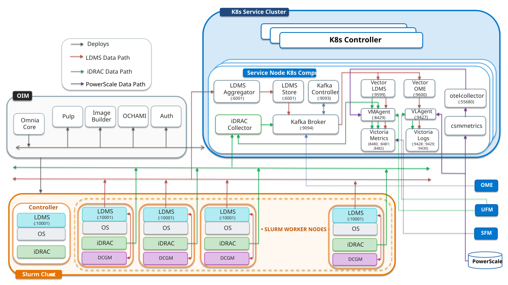

# Setup Telemetry

## Overview

Omnia deploys a telemetry pipeline to collect, aggregate, and store hardware, OS-level, and storage telemetry data from across the cluster using VictoriaMetrics, VictoriaLogs, and Kafka.

For a summary of all supported telemetry sources, bridges and their sinks, see [Supported Telemetry Sources, Bridges and Sinks](../../Reference/Configuration/telemetry_config.md#supported-telemetry-sources-bridges-and-sinks).

!!! note

    To enable any telemetry and log collections (iDRAC, LDMS, PowerScale, DCGM, UFM, VAST), ensure that the `service_k8s` entry is present in the `software_config.json` file and the corresponding telemetry source fields are set to `true` in the `telemetry_config.yml` file.

### Telemetry Architecture


The following diagram illustrates the telemetry services deployed by Omnia and the data flow between the components:



### Telemetry Components

**OIM (Omnia Infrastructure Manager)** -- Central management node that deploys and configures all telemetry services across the cluster.

**Service Kubernetes Cluster** -- Hosts telemetry collection and storage services:

- **iDRAC Collector** -- Collects hardware telemetry via Redfish API
- **LDMS Aggregator / Store** -- Receives and stores aggregated LDMS data
- **Kafka Broker** -- Streams telemetry data via Strimzi operator
- **VMAgent** -- Forwards metrics to VictoriaMetrics
- **VictoriaMetrics Cluster** -- Time-series database (vminsert, vmstorage, vmselect)
- **VictoriaLogs Cluster** -- Distributed log storage (vlinsert, vlstorage, vlselect)
- **VLAgent** -- Platform-managed log collection agent that receives logs from external sources
- **Vector-LDMS / Vector-OME** -- Kafka consumers that route data to Victoria stack via dedicated vmagent-vector and vlagent-vector instances
- **karavi-metrics-powerscale** -- Collects PowerScale metrics via CSM Observability
- **otel-collector** -- Forwards metrics to VictoriaMetrics and VictoriaLogs

**Slurm Cluster** -- Each Slurm compute node runs:

- **LDMS Sampler** -- Collects OS metrics (CPU, memory, network, and I/O)
- **iDRAC** -- Provides hardware health data (temperature, power, and fans)

For detailed data flow diagrams, see the respective configuration pages below.

## Prerequisites

- The [Initialize Domains](../main/initialize_domains.md) procedure is complete (telemetry domain is initialized)
- The [Deploy Kubernetes](../orchestrator/deploy_kubernetes.md) procedure is complete (kube_vip cluster is running)
- The desired telemetry sources are enabled in `telemetry_config.yml`

## Procedure

1. Configure one or more telemetry sources using the guides listed in **Next Steps**.
2. Deploy the cluster using the end-to-end playbook sequence described in [Deploy the Telemetry Stack](deploy_telemetry.md).

## Verification

After deployment, verify that telemetry pods are running:

```bash title="Run on: service_kube_control_plane node"
kubectl get pods -n telemetry -o wide
```

All pods should show `Running` status. Use the source-specific verification pages for detailed checks.

## Next Steps


Configure one or more telemetry sources, then deploy the cluster to bring up the
telemetry stack. For the end-to-end playbook sequence, see
[Deploy the Telemetry Stack](deploy_telemetry.md).

- [Configure iDRAC Telemetry](configure_idrac.md)
- [Configure LDMS Telemetry](configure_ldms.md)
- [Configure PowerScale Telemetry](configure_powerscale.md)
- [Configure UFM Telemetry](configure_ufm.md)
- [Configure VAST Telemetry](../Telemetry/configure_vast.md)
- [Configure OpenManage Enterprise Telemetry (OME)](telemetry_from_ome.md)
- [Configure SFM Telemetry](configure_sfm.md)
- [External Kafka](configure_external_kafka.md)
- [External VictoriaMetrics](configure_external_victoria.md)


## Troubleshooting

No troubleshooting information is currently available for this procedure.


