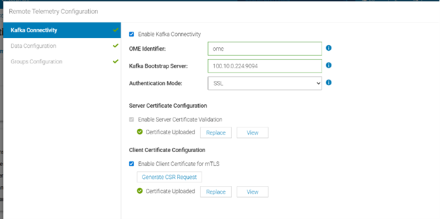
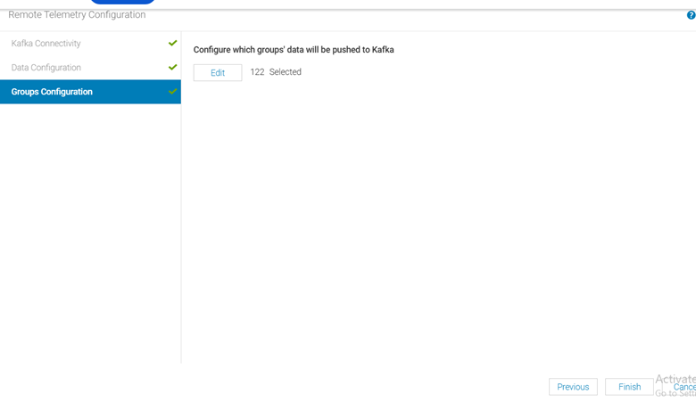
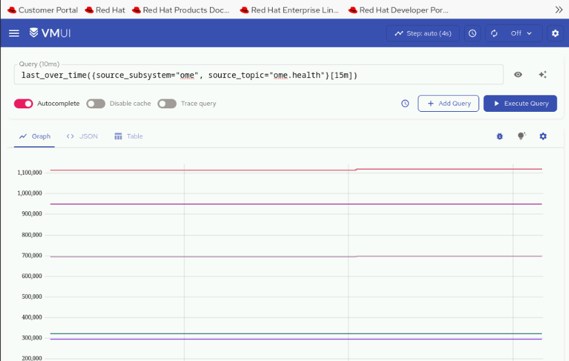
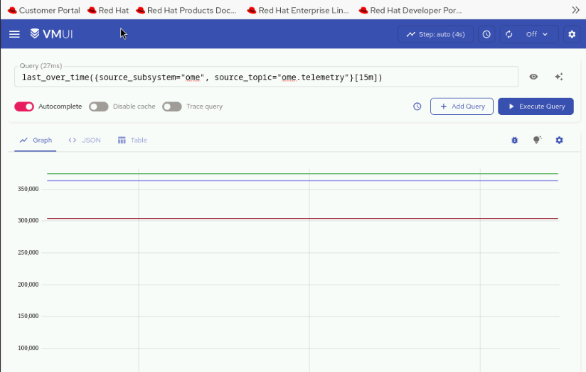

# Integrate OME (OpenManage Enterprise) with Kafka for Telemetry Streaming


Configure OpenManage Enterprise (OME) to securely stream telemetry data to the Omnia Kafka pipeline using mutual TLS (mTLS).

## Overview


This procedure describes how to integrate OpenManage Enterprise (OME) with the Omnia Kafka pipeline for secure telemetry data streaming. OME connects to the Kafka external mTLS listener (port 9094) and publishes telemetry data (inventory, health, alerts, audit logs) to Kafka topics. To route OME telemetry from Kafka to VictoriaMetrics and VictoriaLogs, enable the [Vector-OME bridge](#step-3-enable-ome-and-vector-ome-in-telemetry_configyml).


## Prerequisites


Complete the following before you configure OME telemetry. The OME source and the
Vector-OME bridge must be enabled **before** you provision the cluster, so that
Omnia creates the OME Kafka topics, ACLs, and the `vector-ome-user` KafkaUser. You
then connect the OME appliance to Kafka **after** the cluster is provisioned.

- The [Setup the OIM](../main/setup_oim.md) procedure is complete (main domain setup is complete)
- The [Initialize Domains](../main/initialize_domains.md) procedure is complete (telemetry domain is initialized)
- The [Deploy Kubernetes](../orchestrator/deploy_kubernetes.md) procedure is complete (kube_vip cluster is running)
  [Deploy Omnia Core](https://github.com/dell/omnia).
- The mapping file (`pxe_mapping_file.csv`) is created. See
  [Create Mapping File](../discovery/../discovery/create_mapping_file.md).
- A running OpenManage Enterprise (OME) instance with nodes already discovered.
- Ensure that the `pod_external_ip_range` parameter is set in `omnia_config.yml` for the Service Kubernetes cluster and it is reachable from the OpenManage Enterprise appliance network.
- Ensure that the nodes are discovered in OpenManage Enterprise before configuring telemetry streaming.
- Ensure that OpenManage Enterprise Advanced License is installed on the OME discovered nodes. This license is required to retrieve OME telemetry.


## Procedure


### Step 1: Add Required Software to software_config.json

OME telemetry uses the Kafka and Vector pipeline on the service Kubernetes cluster.
Ensure the `service_k8s` entry is present in `software_config.json`. Include an
`aarch64` entry only if you have aarch64 nodes.

```json title="software_config.json -- required for OME telemetry"
{
    "softwares": [
        {"name": "service_k8s", "version": "1.35.1", "arch": ["x86_64"]}
    ]
}
```

For the full file structure, see the
[software_config.json reference](../../Reference/Configuration/software_config.md).

### Step 2: Add Required Nodes to the Mapping File

OME telemetry requires a service Kubernetes cluster with Kafka exposed over a
MetalLB LoadBalancer. In `pxe_mapping_file.csv`, ensure the following functional
groups are present:

- `service_kube_control_plane` (control plane nodes; three for an HA cluster)
- `service_kube_node` (at least one worker node)

```csv title="pxe_mapping_file.csv -- example service K8s rows"
FUNCTIONAL_GROUP_NAME,GROUP_NAME,SERVICE_TAG,PARENT_SERVICE_TAG,HOSTNAME,ADMIN_MAC,ADMIN_IP,BMC_MAC,BMC_IP,IB_NIC_NAME,IB_IP
service_kube_control_plane_x86_64,grp4,H94M8F3,,kcp1,BC:97:E1:F0:94:F0,172.16.107.96,b0:7b:25:d8:4a:f4,100.10.1.99,,
service_kube_node_x86_64,grp6,GZF6ZS3,,kn,EC:2A:72:32:C6:98,172.16.107.95,ec:2a:72:3b:a8:52,100.10.0.209,,
```

Ensure `pod_external_ip_range` is set in `omnia_config.yml` so MetalLB can assign
an external IP to the Kafka mTLS listener. For the full mapping file format, see the
[PXE mapping file reference](../../Reference/SampleFiles/pxe_mapping_file.md).

### Step 3: Enable OME and Vector-OME in telemetry_config.yml

Enable the OME source and the Vector-OME bridge in `telemetry_config.yml`. OME
publishes to Kafka `ome.*` topics; the Vector-OME bridge consumes from Kafka and
routes metrics to VictoriaMetrics and logs to VictoriaLogs via dedicated
vmagent-vector and vlagent-vector instances.

```yaml title="telemetry_config.yml -- OME source and Vector-OME bridge"
telemetry_sources:
  ome:
    metrics_enabled: true
    logs_enabled: true
    collection_targets:
      - "kafka"

telemetry_bridges:
  vector_ome:
    metrics_enabled: true
    logs_enabled: true
```

For details on all parameters, see the [telemetry_config.yml reference](../../Reference/Configuration/telemetry_config.md).

The following components are deployed based on the configured feature flags:

- **vmagent-vector** -- Deployed when `vector_ome > metrics_enabled` is `true`.
- **Vector-OME** -- Deployed when `vector_ome > metrics_enabled = true` or `vector_ome > logs_enabled = true`.
- **vlagent-vector** -- Deployed when `vector_ome > logs_enabled = true`.
- **Kafka topics and ACLs** -- For OME topics.
- **KafkaUser resources** -- For Vector-OME mTLS credentials (`vector-ome-user`).

!!! note

    Vector-OME requires a new KafkaUser (`vector-ome-user`) because OME is an external producer with a different security domain.

### Step 4: Deploy the Cluster

Deploy the cluster by running the full playbook sequence
(`prepare_oim.yml` -> `local_repo.yml` -> `build_image` -> `provision.yml`).
`provision.yml` deploys Kafka, the Vector-OME bridge, the OME Kafka topics/ACLs,
and the `vector-ome-user` KafkaUser. See
[Deploy the Telemetry Stack](deploy_telemetry.md).

!!! important

    If you enable OME telemetry on an already-provisioned cluster, re-run `provision.yml` and then execute the `telemetry.sh` script on the K8s control plane. See [Update Telemetry on a Running Cluster](deploy_telemetry.md#update-telemetry-on-a-running-cluster).

    ```bash title="Run on K8s control plane"
    <K8s_NFS_mount_point>/telemetry/telemetry.sh
    ```

Once the cluster is provisioned and the telemetry stack is running, connect the OME
appliance to Kafka using the following steps.

### Step 5: Retrieve Kafka Connection Details and Configure OME

**Extract Kafka connection details and TLS certificates**

1. Run the following playbook to retrieve the Kafka connection details and TLS certificates from the Service Kubernetes cluster:

    ```bash title="Run on OIM host"
    cd /omnia/utils
    ansible-playbook external_kafka_connect_details.yml
    ```

    The `external_kafka_connect_details.yml` playbook does the following:

    - Retrieves the Kafka LoadBalancer external IP.
    - Extracts the server CA certificate and client certificates/keys from the `telemetry` namespace.
    - Writes the Kafka endpoint and TLS file locations to `/opt/omnia/telemetry/external_kafka_connect_details.yml`.
    - Saves the TLS files in `/opt/omnia/telemetry/external_kafka/`:
        - `ca.crt` (server certificate)
        - `user.crt` (client certificate)
        - `user.key` (client key)

    !!! note

        If OpenManage Enterprise is installed on a different system than the OIM host, copy `ca.crt` to that system before uploading it in the UI.

2. Create a client certificate in `.pfx` format for mTLS by running the following command. Provide a passphrase when prompted:

    ```bash title="Run on OIM host"
    cd /opt/omnia/telemetry/external_kafka/
    openssl pkcs12 -export -out user.pfx -inkey user.key -in user.crt
    ```

    

**Configure OME Kafka connectivity**

3. In OpenManage Enterprise, navigate to **Configuration > Remote Connectivity**, and select **Enable**.

    

4. In the Kafka Connectivity wizard, select the **Enable Kafka Connectivity** check box to turn on Kafka integration.

5. In the **OME Identifier** field, enter a unique identifier to be used as the topic prefix for publishing OpenManage Enterprise metrics.

6. In the **Kafka Bootstrap Server** field, enter the Kafka external endpoint displayed by the playbook, along with the port number. Example: `<Kafka LoadBalancer External IP>:<Port Number>`

7. From the **Authentication Mode** list, select **SSL**.

8. Under **Server Certificate Validation**, select the **Enable Server Certificate Validation** check box, and upload `ca.crt` from `/opt/omnia/telemetry/external_kafka/`.

9. Under **Client Certificate Configuration**, select the **Enable Client Certificate for mTLS** check box, and upload the client certificate (`user.pfx`) generated in sub-step 2. Enter the password or passphrase used to generate the certificate, and click **Next**.

    

10. On the **Data Configuration** page, select the metrics to stream to the Omnia Service Kubernetes cluster, and click **Next**.

    

11. On the **Group Configuration** page, select the devices and device groups from which metrics should be collected, and click **Next**.

    

12. Navigate to **Configuration > Remote Connectivity** and verify the following:

    - Under **Connectivity**, a green check mark next to **Connected since** indicates successful connectivity between OpenManage Enterprise and the Omnia Service Kubernetes cluster.
    - Under **Transfer status**, green check marks next to each metric indicate that the selected metrics are being successfully transmitted without errors.

    

## Verification


### Verify OME Messages in Kafka

To verify that OME telemetry data is being successfully published to the OME Kafka topics:

1. Log in to the Service Kubernetes control plane.

2. Set the required variables:

    ```bash title="Run on K8s control plane"
    KAFKA_LB_IP=<external IP of bridge-bridge-lb service>
    TOPIC=<OME Topic Name>
    GROUP=ome-consumer-group
    INSTANCE=ome-consumer
    ```

3. Create a Kafka consumer:

    ```bash title="Run on K8s control plane"
    curl -s -X POST "http://$KAFKA_LB_IP:8080/consumers/$GROUP" \
      -H 'content-type: application/vnd.kafka.v2+json' \
      -d '{"name": "ome-consumer", "format": "json", "auto.offset.reset": "earliest"}'
    ```

4. View the list of OME Kafka topics configured:

    ```bash title="Run on K8s control plane"
    curl -s -X GET "http://$KAFKA_LB_IP:8080/topics" | jq '.'
    ```

5. Subscribe the consumer to the telemetry topic:

    ```bash title="Run on K8s control plane"
    curl -s -X POST "http://$KAFKA_LB_IP:8080/consumers/$GROUP/instances/$INSTANCE/subscription" \
      -H 'content-type: application/vnd.kafka.v2+json' \
      -d '{"topics": ["'"$TOPIC"'"]}'
    ```

6. Consume messages from the topic:

    ```bash title="Run on K8s control plane"
    while true; do
      curl -s -X GET "http://$KAFKA_LB_IP:8080/consumers/$GROUP/instances/$INSTANCE/records" \
        -H 'accept: application/vnd.kafka.json.v2+json' | jq '.'
      sleep 2
    done
    ```

7. (Optional) Cleanup the consumer:

    ```bash title="Run on K8s control plane"
    curl -s -X DELETE "http://$KAFKA_LB_IP:8080/consumers/$GROUP/instances/$INSTANCE"
    ```

!!! note

    - **From beginning**: Ensure `"auto.offset.reset": "earliest"` when creating the consumer if you want existing data.
    - **Message format**: Use `"format": "json"` only if producers publish JSON. Otherwise use `"binary"` and decode base64 payloads.
    - **Throughput**: Adjust polling interval; bridge returns empty array when no new records.
    - **404/409 errors**: 404 usually means wrong group/instance name; 409 means already subscribed.

### View OME Metrics in VictoriaMetrics UI (VMUI)

To verify that OME telemetry data is being successfully routed from Kafka to VictoriaMetrics using Vector:

1. Access the VMUI in a web browser:

    ```
    https://<external vmselect loadbalancer IP>:8481/select/0/vmui
    ```

2. Navigate to the **Explore** tab.

3. Run the following appropriate query to retrieve metrics from OME.

    - **Retrieve health metrics from OME**

      ```
      last_over_time({source_subsystem="ome", source_topic="ome.health"}[15m])
      ```

      

    - **Retrieve telemetry metrics from OME**

      ```
      last_over_time({source_subsystem="ome", source_topic="ome.telemetry"}[15m])
      ```

      

!!! note

    `source_subsystem=ome` comes from the `ome_identifier` that the user has given in the `telemetry_config.yml` input file and the suffix after the dot (i.e., health, inventory, telemetry) is coming from OME.

### View OME Logs in VictoriaLogs

To verify that OME telemetry data is being successfully routed from Kafka to VictoriaLogs using Vector:

1. Access the VictoriaLogs UI in a web browser:

    ```
    https://<external vlselect loadbalancer IP>:9471/select/vmui
    ```

2. Navigate to the **Select** tab.

3. In the query field, run the following query to filter for OME logs:

    ```
    _msg_topic:ome.auditlogs
    ```

    

4. Verify that OME-related logs are displayed in the results.

!!! note

    Ensure that the Vector-OME bridge is enabled in `telemetry_config.yml` (`telemetry_bridges > vector_ome > logs_enabled: true`) for logs data to flow from Kafka to VictoriaLogs.


## Next Steps


- [Setup Telemetry](setup_telemetry.md) -- Overview of all telemetry sources.


## Troubleshooting


For common telemetry issues and resolutions, see [Troubleshooting Telemetry](../../Troubleshooting/telemetry.md).


