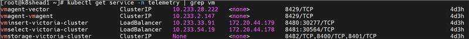
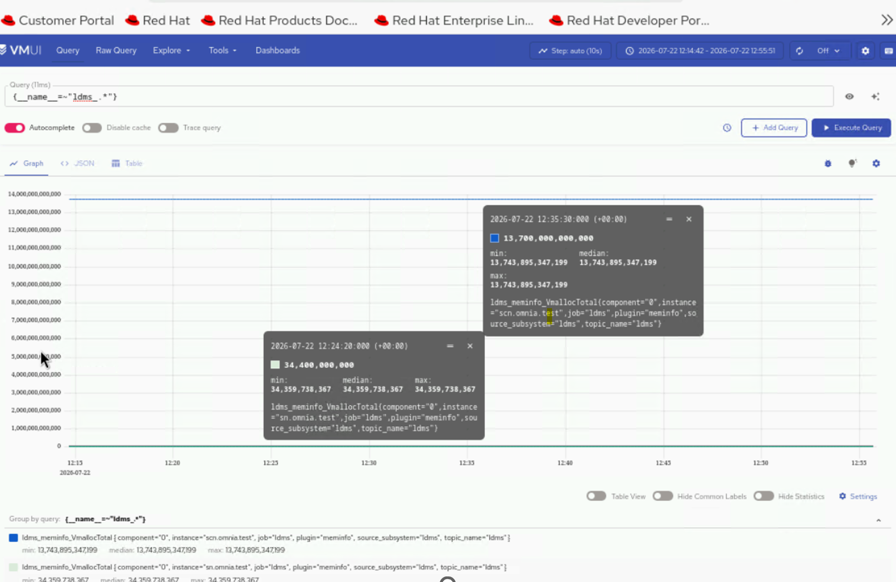

# Verify Vector-LDMS Pipeline

## Overview

This page provides verification steps for the Vector-LDMS pipeline that routes LDMS metrics from Kafka to VictoriaMetrics.

## Prerequisites


- The [Configure LDMS Telemetry](configure_ldms.md) procedure is complete, with [Vector-LDMS bridge](configure_ldms.md#step-5-enable-vector-ldms-bridge-optional) enabled.
- LDMS telemetry is configured and the `store_avro_kafka` plugin is producing to the Kafka `ldms` topic.


## Verify Vector-LDMS Telemetry Pods

1. Verify that the Vector-LDMS pod is running:

    ```bash title="Run on K8s control plane"
    kubectl get pods -n telemetry | grep vector-ldms
    ```

    

2. Verify that the vmagent-vector pod is running:

    ```bash title="Run on K8s control plane"
    kubectl get pods -n telemetry | grep vmagent-vector
    ```

    

3. Verify that the VictoriaMetrics service is running:

    ```bash title="Run on K8s control plane"
    kubectl get service -n telemetry | grep vm
    ```

    

## View LDMS Metrics in VictoriaMetrics UI (VMUI)

1. Note the **External IP** of the `vmselect` service from the output of the previous command. The VMUI uses the vmselect service's external IP.

2. Access the VMUI in a web browser:

    ```
    https://<vmselect service external IP>:8481/select/0/vmui
    ```

    !!! note

        The VMUI URL uses the external IP of the `vmselect` service, not vminsert or other VictoriaMetrics services.

3. Verify that metrics are reaching VictoriaMetrics by querying the VMUI. For example, the following query displays LDMS-related metrics:

    ```
    {__name__=~"ldms_.*"}
    ```

    


