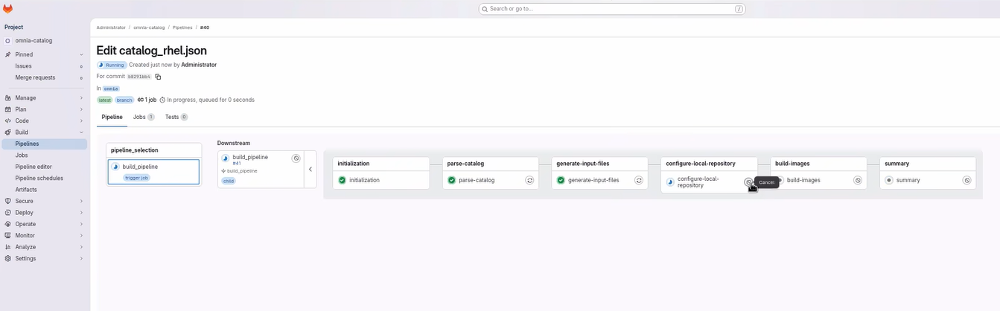
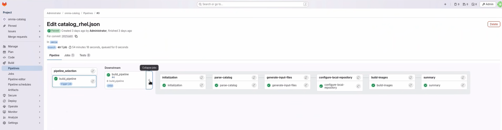

# Execute Build Pipeline

Update the `catalog_rhel.json` file and execute the Build Stream build pipeline through GitLab. This procedure covers catalog modifications, pipeline triggering (automatic and manual), and verification of pipeline status.

## Overview

The Build Stream build pipeline automates the creation of diskless images based on catalog specifications. The pipeline consists of four sequential stages:

- **parse-catalog**: Parses and validates the catalog file for build requirements
- **generate-input-files**: Generates input files and configuration data for image building
- **create-local-repository**: Creates and configures the local repository for build artifacts
- **build-image**: Builds the diskless images based on catalog specifications

The build pipeline is automatically triggered when you update the `catalog_rhel.json` file in the GitLab repository, or can be manually initiated through the GitLab interface.

!!! warning

    **Pipeline Retry Behavior**: If a pipeline fails partially (e.g., one architecture succeeds while another fails), retrying the pipeline may result in INTERNAL_ERROR for previously completed image builds. Build Stream currently does not skip or reuse already-successful builds during retry operations. If you encounter this issue, consider starting a fresh pipeline rather than retrying the failed one. Ensure adequate system resources (including 200 GB free disk space on OIM / partition) before initial pipeline execution to minimize the risk of partial failures.

!!! warning

    Do not cancel a running GitLab pipeline or stage. Cancellation prevents some pipeline steps from executing, which leaves the Build Stream job in an intermediate, inconsistent state.

!!! note

    Build Stream does not support execution of multiple pipelines in parallel. Only one pipeline can be executed at a time. Attempting to run multiple pipelines simultaneously may result in unexpected behavior or failures.

!!! note

    Build Stream does not support execution of multiple pipelines in parallel. Only one pipeline can be executed at a time.

## Prerequisites

- Build Stream container is deployed on the OIM node
- GitLab deployment for Build Stream is completed (see [Deploy GitLab](deploy_gitlab.md))
- You can access the GitLab project repository
- **200 GB free disk space** on the OIM **/ partition** before triggering the build pipeline
  - This requirement applies to the OIM root partition before pipeline execution
  - Insufficient disk space can cause pipeline failures during image builds
  - Monitor disk usage during pipeline execution, especially for multi-architecture builds

## Procedure

### Trigger Build Pipeline Automatically

1. Go to the GitLab project URL:

    ```text title="GitLab project URL"
    https://<gitlab_host>:<gitlab_https_port>/root/<gitlab_project_name>
    ```

2. Navigate to **Code** → **Repository**.

3. Locate the catalog file `catalog_rhel.json`.

4. Modify the `catalog_rhel.json` file to define your build requirements.

    !!! note

        Ensure that the catalog file is updated with valid values. The pipeline fails if invalid details are provided.

        Supported values:

        - **Functional group names**: `slurm_control_node_x86_64`, `slurm_node_x86_64`, `slurm_node_aarch64`, `service_kube_control_plane_x86_64`, `service_kube_node_x86_64`, `login_node_x86_64`, `login_node_aarch64`, `login_compiler_node_x86_64`, `login_compiler_node_aarch64`, `os_x86_64`, `os_aarch64`
        - **Architecture type**: `x86_64` and `aarch64`
        - **OS type**: `RHEL`
        - **OS version**: `10.0`
        - **Package types**: `rpm`, `rpm_repo`, `image`, `iso`, `tarball`, `pip_module`, `git`, `manifest`

5. Commit the catalog changes. The pipeline triggers automatically.

    

6. Monitor the pipeline progress.

    

### Trigger Build Pipeline Manually

1. Navigate to **Build** → **Pipelines**.

2. Click **New Pipeline**.

3. In the **Run new pipeline** dialog box, enter the variable name as **PIPELINE_TYPE** and enter the value as **build**.

    

4. Click **Run Pipeline** to execute the build pipeline.

### Monitor Build Pipeline Progress

1. Navigate to **Build** → **Pipelines**.

2. Click on the running pipeline to view details.

3. Monitor each stage as it progresses:

    - **parse-catalog**: Parses and validates the catalog file
    - **create-local-repository**: Creates and configures the local repository
    - **generate-input-files**: Generates input files for image building
    - **build-image**: Builds the diskless images

4. Review the stage status indicators:

    - **Green checkmark**: Stage completed successfully
    - **Red X**: Stage failed (click for error details)
    - **Blue circle**: Stage currently running

5. If any stage fails, review the error logs by clicking on the failed job.

### Update Input Configuration Files

To update the input configuration files before a manual build:

1. Navigate to the `input/` folder in the GitLab repository.

2. Edit the relevant configuration file.

3. Commit and push the changes.

## Verification

After the pipeline completes:

1. Navigate to **Build** → **Pipelines**.

2. Review the job list and status.

3. Click on individual jobs to view execution logs, resource usage, and error messages.

## Next Steps

- [Execute Deploy Pipeline](execute_deploy_pipeline.md) -- Deploy the built images to cluster nodes
- [Cleanup Operations](cleanup_operations.md) -- Remove old Image Groups

## Troubleshooting

- **Parse-Catalog stage failing**: Ensure the JSON is aligned with the expected schema. See catalog examples at [https://github.com/dell/omnia/tree/pub/build_stream/examples/catalog](https://github.com/dell/omnia/tree/pub/build_stream/examples/catalog).
- **Create-Local-Repo stage failing**: Check the log path from the API response and verify `local_repo_config.yml` settings.
- **Build-Image stage failing**: Ensure the catalog has valid functional groups.
- For additional issues, see [Build Stream Troubleshooting](../../Troubleshooting/build_stream.md).


