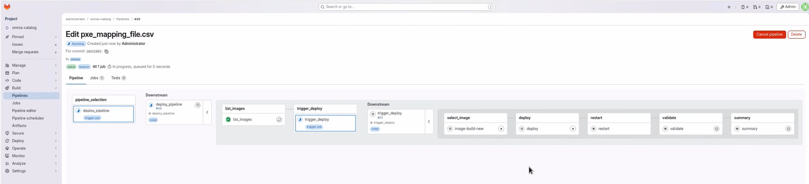
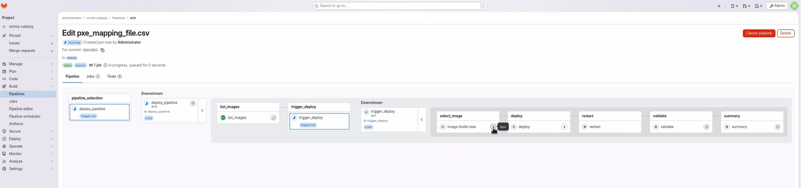
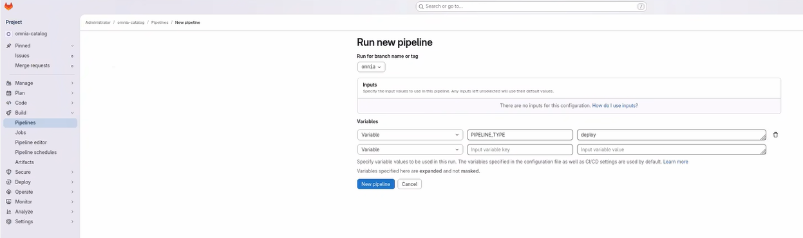
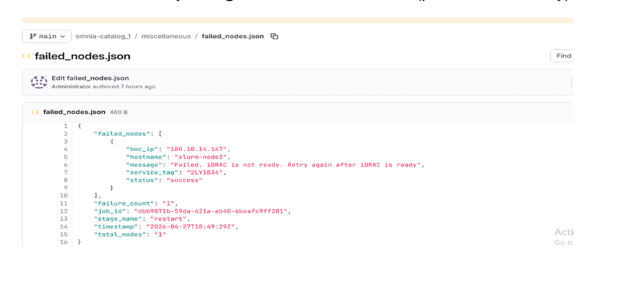
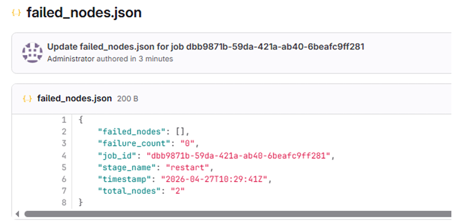

# Execute Deploy Pipeline

Execute the Build Stream deploy pipeline to deploy built images to cluster nodes. This procedure covers the three deploy stages, manual execution, monitoring, handling partial failures, and adding new nodes.

## Overview

The Build Stream deploy pipeline automates the deployment of built images to target cluster nodes. The pipeline consists of three sequential stages:

- **deploy**: Deploys the built images to the target nodes
- **restart**: PXE-boots the target nodes to load the deployed images
- **validate**: Executes Molecule-based infrastructure tests to verify cluster deployment, network connectivity, and service health

The deploy pipeline is automatically triggered when you update the PXE mapping file (`pxe_mapping_file.csv`) in the GitLab repository, or can be manually initiated through the GitLab interface.

!!! warning

    Do not cancel a running GitLab pipeline or stage. Cancellation prevents some pipeline steps from executing, which leaves the Build Stream job in an intermediate, inconsistent state.

!!! note

    Build Stream does not support execution of multiple pipelines in parallel. Only one pipeline can be executed at a time. Attempting to run multiple pipelines simultaneously may result in unexpected behavior or failures.

## Prerequisites

- Build pipeline has completed successfully and images are available
- Target nodes are powered on and accessible via BMC
- PXE mapping file (`pxe_mapping_file.csv`) is correctly configured with target node information
- PXE mapping file is present in the GitLab repository `input/` folder for automatic triggering

## Procedure

### Trigger Deploy Pipeline Automatically

1. Navigate to the GitLab project URL:

    ```text title="GitLab project URL"
    https://<gitlab_host>:<gitlab_https_port>/root/<gitlab_project_name>
    ```

2. Update the `pxe_mapping_file.csv` file in the GitLab repository and commit the changes. The deploy pipeline triggers automatically.

    

3. In the deploy pipeline, select the image from the `select_image` stage and click **Play**.

    

4. Click **Play** on the `deploy` stage to deploy the image.

    

5. Monitor the pipeline progress.

### Trigger Deploy Pipeline Manually

1. Navigate to **Build** → **Pipelines**.

2. Click **New Pipeline**.

3. In the **Run new pipeline** dialog box, enter the variable name as **PIPELINE_TYPE** and enter the value as **deploy**.

    

4. Click **Run Pipeline** to execute the deploy pipeline.

    

### Monitor Deploy Pipeline Progress

1. Click on the running pipeline to view details.

2. Monitor each stage as it progresses:

    - **deploy**: Deploys images to target nodes based on catalog specifications
    - **restart**: PXE-boots the nodes to load the deployed images
    - **validate**: Executes Molecule-based infrastructure tests to verify cluster deployment, network connectivity, and service health

3. Review the stage status indicators:

    - **Green checkmark**: Stage completed successfully
    - **Red X**: Stage failed (click for error details)
    - **Blue circle**: Stage currently running

4. If any stage fails, review the error logs by clicking on the failed job.

!!! note

    The deploy pipeline uses the PXE mapping file to determine which nodes receive which images based on functional group assignments.

### Handle Deploy Failures During Restart Stage

When the restart stage encounters partial failures (some nodes PXE booted successfully while others fail), Build Stream provides a `failed_nodes.json` mechanism to enable efficient retry operations.

`failed_nodes.json` is a structured JSON file that tracks which nodes failed to PXE boot. This file enables you to:

- Track failed nodes with detailed error messages
- Manually fix the failed nodes and update their entries as successful
- Retry only the failed nodes instead of the entire inventory
- Maintain accurate state across pipeline runs

### Sample failed_nodes.json

```json title="failed_nodes.json"
{
  "job_id": "018f3c4b-7b5b-7a9d-b6c4-9f3b4f9b2c10",
  "stage_name": "restart",
  "timestamp": "2026-04-10T16:32:15Z",
  "total_nodes": 5,
  "failure_count": 2,
  "failed_nodes": [
    {
      "bmc_ip": "172.17.107.44",
      "hostname": "slurm-node2",
      "service_tag": "79WWJ93",
      "status": "failed",
      "message": "Failed. iDRAC is not ready. Retry again after iDRAC is ready"
    },
    {
      "bmc_ip": "172.17.107.45",
      "hostname": "slurm-node3",
      "service_tag": "79WWJ94",
      "status": "failed",
      "message": "iDRAC is unreachable. pxe boot might be set. Please check the host reboot status manually"
    }
  ]
}
```

### Retry Procedure for Partial Failures

1. During the first run, the restart stage attempts to PXE boot all nodes automatically.

2. If all nodes succeed, the stage is marked successful and proceeds to the validation stage.

3. In case of partial failure, only failed nodes are recorded in `failed_nodes.json` in a directory called `miscellaneous` in GitLab. The file contains failed node details along with corresponding error messages.

    

4. Analyze failures and perform corrective actions:

    - Check iDRAC readiness
    - Verify BMC network connectivity
    - Validate PXE boot configuration

5. After resolving issues, retry the restart stage for failed nodes.

6. If automated retry is not feasible (for example, VM or manual dependency), manually PXE boot the affected nodes.

7. After manual boot of the nodes, update the node status as `success` in `failed_nodes.json` and click the **Retry downstream pipeline** icon to retry the failed pipeline. Updated nodes are excluded from further PXE attempts and are automatically added to the booted nodes list.

    

    The restart stage completes successfully only when all nodes are successful (automated or manual). Upon completion, the workflow proceeds to the validation stage.

    

8. To view detailed logs for a validate stage, click on the Validate stage in the pipeline. Within the logs, the corresponding log file path is provided. Navigate to this path on the OIM to access the detailed test report.

## Verification

After the deploy pipeline completes:

1. Check the overall pipeline status in GitLab to ensure all stages passed.

2. Verify that the target nodes have restarted and are accessible.

3. Log in to a sample of deployed nodes to verify the correct image is loaded.

4. Check the Build Stream API for deployment status and image group information.

## Next Steps

- [Add Nodes to Cluster](../orchestrator/add_nodes.md) -- Deploy images to new nodes without affecting existing nodes
- [Cleanup Operations](cleanup_operations.md) -- Remove old Image Groups

## Troubleshooting

- **Deploy stage failing**: Check the log path from the API response. Ensure the functional groups in the PXE mapping file match the `catalog_rhel.json`.
- **Restart stage failing**: Verify iDRAC readiness and BMC network connectivity.
- For additional issues, see [Build Stream Troubleshooting](../../Troubleshooting/build_stream.md).


