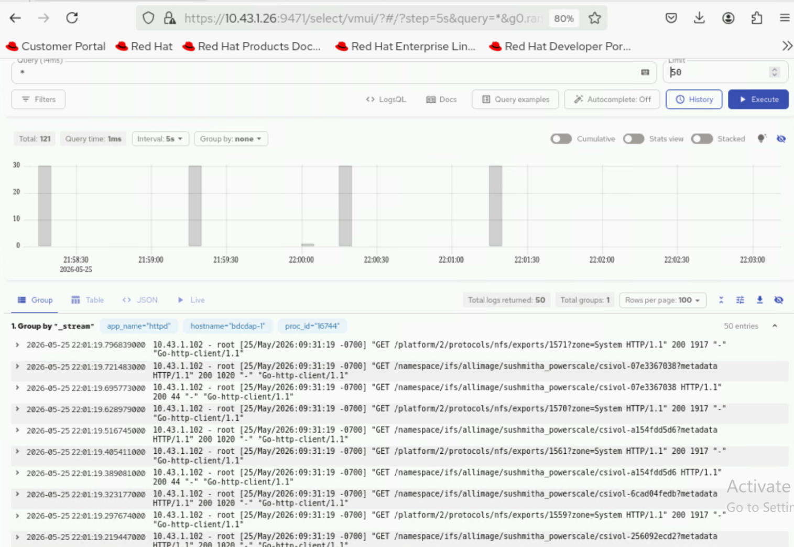
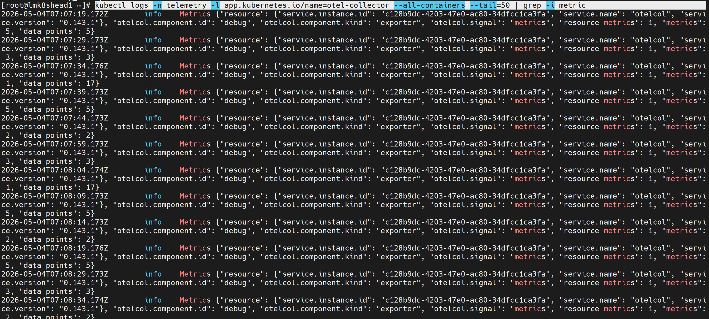

# Initialize and Verify Telemetry

Initialize telemetry services for monitoring the cluster and verify data collection. This procedure covers iDRAC telemetry setup, external node collection, Kafka message validation, TLS connectivity tests, and VictoriaMetrics/VictoriaLogs verification.

## Overview

Telemetry collection enables you to gather performance metrics and system health data from cluster nodes. Build Stream does not automate telemetry invocation and data collection. You must perform all steps in this guide manually on the OIM.

## Prerequisites

- Deploy pipeline has completed successfully and nodes are powered on
- Nodes are accessible via BMC
- Service cluster is deployed with Kubernetes running

## Procedure

### Run the Telemetry Playbook

1. Run the telemetry domain deploy tag to initiate the iDRAC telemetry service on the service cluster:

    ```bash title="Run on: OIM host"
    ./omnia.sh --run telemetry --tags deploy
    ```

!!! note

    Service cluster metadata automatically captures the service cluster kube control plane virtual IP. The `telemetry.yml` playbook is executed against the VIP rather than an individual control plane node.

!!! note

    You do not need to run `telemetry.yml` if the service cluster is configured only for LDMS. By default, LDMS begins collecting data after the nodes are deployed with the appropriate configuration.

### Collect Telemetry from External Nodes

To collect telemetry from external nodes:

1. Update the BMC IP of the external nodes in `/opt/omnia/telemetry/input/project_default/bmc_group_data.csv`. Leave the `GROUP_NAME` and `PARENT` fields blank.

    ```text title="File: bmc_group_data.csv"
    BMC_IP,GROUP_NAME,PARENT
    <IP Address>,,
    ```

2. Run the telemetry domain deploy tag:

    ```bash title="Run on: OIM host"
    ./omnia.sh --run telemetry --tags deploy
    ```

## Verification

### Verify Telemetry Pods Are Running

1. Run the following command:

    ```bash title="Run on: Service Kubernetes Control plane"
    kubectl get pods -n telemetry
    ```

2. Ensure the following pods are in a running state:

    - iDRAC Telemetry pods
    - Kafka broker, controller, and operator pods
    - LDMS aggregator and store pods
    - VictoriaMetrics and vmagent pods
    - VictoriaLogs pods
    - PowerScale Telemetry pods

    

### Verify Kubernetes Telemetry Services

1. Run the following command:

    ```bash title="Run on: Service Kubernetes Control plane"
    kubectl get svc -n telemetry
    ```

2. Ensure the following service entries exist:

    - iDRAC Telemetry service
    - Kafka broker, controller (bootstrap), and bridge services
    - LDMS aggregator and store services
    - VictoriaMetrics service
    - VictoriaLogs service
    - PowerScale Telemetry service

    

### Verify iDRAC Telemetry Messages in Kafka

1. Log in to the Service Kubernetes Control plane.

2. Create a Kafka consumer:

    ```bash title="Run on: Service Kubernetes Control plane"
    KAFKA_LB_IP=<external load balancer IP of the bridge-bridge-lb service>
    curl -X POST http://$KAFKA_LB_IP:8080/consumers/idrac-consumer-group \
    -H 'content-type: application/vnd.kafka.v2+json' \
    -d '{
            "name": "idrac-consumer-1",
            "format": "json",
            "auto.offset.reset": "earliest"
        }'
    ```

3. Subscribe the consumer to the telemetry topic:

    ```bash title="Run on: Service Kubernetes Control plane"
    curl -X POST http://$KAFKA_LB_IP:8080/consumers/idrac-consumer-group/instances/idrac-consumer-1/subscription \
    -H 'content-type: application/vnd.kafka.v2+json' \
    -d '{"topics": ["idrac"]}'
    ```

4. Consume messages from the topic:

    ```bash title="Run on: Service Kubernetes Control plane"
    while true; do curl -X GET http://$KAFKA_LB_IP:8080/consumers/idrac-consumer-group/instances/idrac-consumer-1/records \
    -H 'accept: application/vnd.kafka.json.v2+json' | jq '.' ;  sleep 2; done
    ```

If telemetry metrics are collected correctly, the output contains JSON-formatted iDRAC telemetry records.

### Verify LDMS Messages in Kafka

1. Log in to the Service Kubernetes Control plane.

2. Create a Kafka consumer:

    ```bash title="Run on: Service Kubernetes Control plane"
    KAFKA_LB_IP=<external load balancer IP of the bridge-bridge-lb service>
    curl -X POST http://$KAFKA_LB_IP:8080/consumers/ldms-consumer-group \
    -H 'content-type: application/vnd.kafka.v2+json' \
    -d '{
            "name": "ldms-consumer-1",
            "format": "json",
            "auto.offset.reset": "latest",
            "enable.auto.commit": true
        }'
    ```

3. Subscribe the consumer to the LDMS topic:

    ```bash title="Run on: Service Kubernetes Control plane"
    curl -X POST http://$KAFKA_LB_IP:8080/consumers/ldms-consumer-group/instances/ldms-consumer-1/subscription \
    -H 'content-type: application/vnd.kafka.v2+json' \
    -d '{"topics": ["ldms"]}'
    ```

4. Consume messages from the topic:

    ```bash title="Run on: Service Kubernetes Control plane"
    while true; do curl -X GET http://$KAFKA_LB_IP:8080/consumers/ldms-consumer-group/instances/ldms-consumer-1/records \
    -H 'accept: application/vnd.kafka.json.v2+json' | jq '.' ;  sleep 2; done
    ```

If telemetry is flowing correctly, the output contains JSON-formatted LDMS telemetry records.

!!! note

    When new nodes are added, ensure the nodes are up and cloud-init has completed successfully (check `/var/log/cloud-init-output.log` on each node). Then, create a new Kafka consumer group with a unique name to verify metrics from the newly added nodes. Wait 2-3 minutes after discovery completes before checking.

### Verify Kafka TLS Connectivity

Run the Kafka TLS test job to verify that certificates, truststores, keystores, and mTLS communication are functioning correctly:

```bash title="Run on: Service Kubernetes Control plane"
cd /<nfs client mount path of the service k8s cluster>/telemetry/deployments/test
kubectl apply -f kafka.tls_test_job.yaml
```

After the job completes, check the logs to confirm TLS connection:

```bash title="Run on: Service Kubernetes Control plane"
kubectl logs kafka-tls-test-xxx -n telemetry
```

### Verify VictoriaMetrics TLS Connectivity

Run the VictoriaMetrics TLS test job to verify certificates and secure connectivity:

```bash title="Run on: Service Kubernetes Control plane"
cd /<nfs client mount path of the service k8s cluster>/telemetry/deployments/test
kubectl apply -f victoria-tls-test-job.yaml
```

After the job completes, check the logs:

```bash title="Run on: Service Kubernetes Control plane"
kubectl logs victoria-tls-test-xxx -n telemetry
```

### View Logs Using VictoriaLogs Query Interface

After applying `telemetry.yml` with `idrac_telemetry_collection_type` set to `victoria`:

1. Verify the VictoriaLogs vlselect pod is running:

    ```bash title="Run on: Service Kubernetes Control plane"
    kubectl get pods -n telemetry -o wide | grep vlselect
    ```

2. Verify the VictoriaLogs vlselect service is running:

    ```bash title="Run on: Service Kubernetes Control plane"
    kubectl get service -n telemetry -o wide | grep vlselect
    ```

3. Note the **External IP** and **port number** of the VictoriaLogs vlselect service.

4. Access the VictoriaLogs query interface:

    ```text title="VictoriaLogs query interface URL"
    https://<external vlselect loadbalancer IP>:9471/select/vmui
    ```

5. Filter and view logs using LogsQL queries. For example:

    ```text title="Example LogsQL query"
    * | sort by time desc
    ```

### View iDRAC Telemetry Data Using VictoriaMetrics UI (VMUI) - Cluster Mode Deployment

After applying `telemetry.yml` with VictoriaMetrics deployment mode as `cluster`:

1. Verify the VictoriaMetrics pod is running:

    ```bash title="Run on: Service Kubernetes Control plane"
    kubectl get pods -n telemetry -o wide | grep vm
    ```

    

2. Verify the VictoriaMetrics service is running:

    ```bash title="Run on: Service Kubernetes Control plane"
    kubectl get service -n telemetry -o wide | grep vm
    ```

    

3. Note the **External IP** and **port number** of the VictoriaMetrics service.

4. Access the VMUI:

    ```text title="VMUI URL"
    https://<external vmselect loadbalancer IP>:8481/select/0/vmui
    ```

5. Filter and view telemetry metrics. For example:

    ```text title="Example PromQL query"
    {__name__=~"PowerEdge_.*"}
    ```

    

### View PowerScale Telemetry Data Using VMUI (Cluster Mode)

After applying `telemetry.yml` with VictoriaMetrics deployment mode as `cluster`:

1. Verify the VictoriaMetrics pod is running:

    ```bash title="Run on: Service Kubernetes Control plane"
    kubectl get pods -n telemetry -o wide | grep vm
    ```

2. Verify the VictoriaMetrics service is running:

    ```bash title="Run on: Service Kubernetes Control plane"
    kubectl get service -n telemetry -o wide | grep vm
    ```

3. Verify the OTEL collector is receiving telemetry data:

    ```bash title="Run on: Service Kubernetes Control plane"
    kubectl logs -n telemetry -l app.kubernetes.io/name=otel-collector --all-containers --tail=50 | grep -i metric
    ```

    

4. Note the **External IP** and **port number** of the VictoriaMetrics service.

5. Access the VMUI:

    ```text title="VMUI URL"
    https://<external vmselect loadbalancer IP>:8481/select/0/vmui
    ```

6. Filter and view telemetry metrics. For example:

    ```text title="Example PromQL query"
    {source=~"powerscale"}
    ```

    

### Access the MySQL Database

After `telemetry.yml` has been executed, you can check the MySQL database inside the `mysqldb` container:

1. Get the names of all telemetry pods:

    ```bash title="Run on: Service Kubernetes Control plane"
    kubectl get pods -n telemetry -l app=idrac-telemetry
    ```

    !!! note

        The `idrac-telemetry-0` pod is always responsible for collecting telemetry data of the management nodes (`oim`, `service_kube_control_plane_x86_64`, `service_kube_node_x86_64`, `login_node_x86_64`, etc.).

2. Execute the following command:

    ```bash title="Run on: Service Kubernetes Control plane"
    kubectl exec -it -n telemetry <iDRAC_telemetry_pod_name> -c mysqldb -- mysql -u <MYSQL_USER> -p
    ```

3. When prompted, enter the MySQL password to log in.

4. Enter the `idrac_telemetry_db`:

    ```bash title="Run on: Service Kubernetes Control plane"
    use idrac_telemetrydb;
    ```

5. Access the services table:

    ```bash title="Run on: Service Kubernetes Control plane"
    select * from services;
    ```

## Next Steps

- [Execute Build Pipeline](execute_build_pipeline.md) -- Update catalog and trigger the build pipeline
- [Execute Deploy Pipeline](execute_deploy_pipeline.md) -- Deploy built images to cluster nodes

## Troubleshooting

- **Telemetry pods not running**: Verify that the service cluster is deployed and Kubernetes is running. Check pod logs with `kubectl logs -n telemetry <pod-name>`.
- **No Kafka messages**: Verify that iDRAC telemetry is enabled and nodes are accessible. Wait 2-3 minutes after discovery before checking.
- For additional issues, see [Build Stream Troubleshooting](../../Troubleshooting/build_stream.md).


