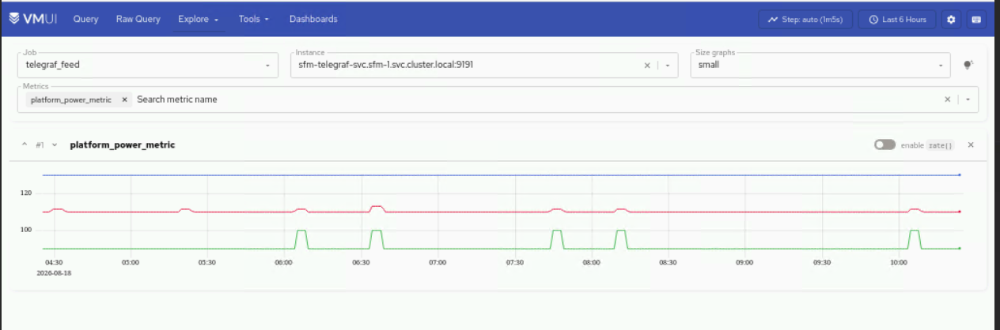

# SFM Metrics

This page catalogs the network telemetry metrics collected by the Smart Fabric
Manager (SFM) via Prometheus Remote Write. These metrics are ingested into
VictoriaMetrics through the vminsert endpoint.

## Collection Method

| Property | Value |
| --- | --- |
| **Collection Tool** | SFM Telegraf Agent |
| **Protocol** | Prometheus Remote Write over TLS |
| **Ingestion Endpoint** | vminsert (port 8480) |
| **Storage** | VictoriaMetrics time-series database |
| **Scrape Job** | `telegraf_feed` |
| **SFM Instance** | `sfm-telegraf-svc.sfm-1.svc.cluster.local:9191` |
| **Format** | Prometheus text exposition format |

## Transceiver DOM Metrics

**Category**: Optical transceiver diagnostics  
**Purpose**: Monitor optical power levels, temperature, voltage, and laser bias current

### Receive Power Metrics (Per-Lane)

| Metric | Unit | Description |
| --- | --- | --- |
| `transceiver_dom_rx1_power_value` | dBm | Lane 1 receive optical power |
| `transceiver_dom_rx2_power_value` | dBm | Lane 2 receive optical power |
| `transceiver_dom_rx3_power_value` | dBm | Lane 3 receive optical power |
| `transceiver_dom_rx4_power_value` | dBm | Lane 4 receive optical power |

### Transmit Power Metrics (Per-Lane)

| Metric | Unit | Description |
| --- | --- | --- |
| `transceiver_dom_tx1_power_value` | dBm | Lane 1 transmit optical power |
| `transceiver_dom_tx2_power_value` | dBm | Lane 2 transmit optical power |
| `transceiver_dom_tx3_power_value` | dBm | Lane 3 transmit optical power |
| `transceiver_dom_tx4_power_value` | dBm | Lane 4 transmit optical power |

### Laser Bias Current Metrics (Per-Lane)

| Metric | Unit | Description |
| --- | --- | --- |
| `transceiver_dom_tx1_bias_value` | mA | Lane 1 laser bias current |
| `transceiver_dom_tx2_bias_value` | mA | Lane 2 laser bias current |
| `transceiver_dom_tx3_bias_value` | mA | Lane 3 laser bias current |
| `transceiver_dom_tx4_bias_value` | mA | Lane 4 laser bias current |

### Temperature Metrics

| Metric | Unit | Description |
| --- | --- | --- |
| `transceiver_dom_temperature_value` | Celsius | Module temperature |
| `transceiver_dom_temperature_alarm_hi_value` | Flag | High temperature alarm (1=active, 0=normal) |
| `transceiver_dom_temperature_alarm_lo_value` | Flag | Low temperature alarm (1=active, 0=normal) |
| `transceiver_dom_temperature_warning_hi_value` | Flag | High temperature warning (1=active, 0=normal) |
| `transceiver_dom_temperature_warning_lo_value` | Flag | Low temperature warning (1=active, 0=normal) |

### Voltage Metrics

| Metric | Unit | Description |
| --- | --- | --- |
| `transceiver_dom_voltage_value` | Volts | Supply voltage |
| `transceiver_dom_voltage_alarm_hi_value` | Flag | High voltage alarm (1=active, 0=normal) |
| `transceiver_dom_voltage_alarm_lo_value` | Flag | Low voltage alarm (1=active, 0=normal) |
| `transceiver_dom_voltage_warning_hi_value` | Flag | High voltage warning (1=active, 0=normal) |
| `transceiver_dom_voltage_warning_lo_value` | Flag | Low voltage warning (1=active, 0=normal) |

### Additional Transceiver Metrics

| Metric | Unit | Description |
| --- | --- | --- |
| `transceiver_dom_wavelength_value` | nm | Optical wavelength |

## Interface Counter Metrics

**Category**: Interface traffic statistics  
**Purpose**: Monitor interface throughput, packet counts, and utilization

### Receive Metrics

| Metric | Unit | Description |
| --- | --- | --- |
| `ifcounters_in_octets` | Bytes | Total bytes received (cumulative) |
| `ifcounters_in_octets_per_second` | Bytes/sec | Receive rate |
| `ifcounters_in_pkts` | Count | Total packets received (cumulative) |
| `ifcounters_in_pkts_per_second` | Packets/sec | Receive packet rate |
| `ifcounters_in_bits_per_second` | Bits/sec | Receive bit rate |
| `ifcounters_in_unicast_pkts` | Count | Unicast packets received |
| `ifcounters_in_multicast_pkts` | Count | Multicast packets received |
| `ifcounters_in_broadcast_pkts` | Count | Broadcast packets received |
| `ifcounters_in_utilization` | Percent | Receive link utilization (0-100%) |
| `ifcounters_in_errors` | Count | Receive errors (cumulative) |
| `ifcounters_in_discards` | Count | Receive discards (cumulative) |

### Transmit Metrics

| Metric | Unit | Description |
| --- | --- | --- |
| `ifcounters_out_octets` | Bytes | Total bytes transmitted (cumulative) |
| `ifcounters_out_octets_per_second` | Bytes/sec | Transmit rate |
| `ifcounters_out_pkts` | Count | Total packets transmitted (cumulative) |
| `ifcounters_out_pkts_per_second` | Packets/sec | Transmit packet rate |
| `ifcounters_out_bits_per_second` | Bits/sec | Transmit bit rate |
| `ifcounters_out_unicast_pkts` | Count | Unicast packets transmitted |
| `ifcounters_out_multicast_pkts` | Count | Multicast packets transmitted |
| `ifcounters_out_broadcast_pkts` | Count | Broadcast packets transmitted |
| `ifcounters_out_utilization` | Percent | Transmit link utilization (0-100%) |
| `ifcounters_out_errors` | Count | Transmit errors (cumulative) |
| `ifcounters_out_discards` | Count | Transmit discards (cumulative) |

### Management Metrics

| Metric | Unit | Description |
| --- | --- | --- |
| `ifcounters_last_clear` | Timestamp | Timestamp of last counter clear |

## Ethernet Error Counter Metrics

**Category**: Ethernet frame errors and distribution  
**Purpose**: Monitor frame errors and size distribution

### Receive Error Counters

| Metric | Unit | Description |
| --- | --- | --- |
| `ifethcounters_in_crc_errors` | Count | CRC errors received (cumulative) |
| `ifethcounters_in_fragment_frames` | Count | Fragmented frames received |
| `ifethcounters_in_jabber_frames` | Count | Jabber frames received |
| `ifethcounters_in_oversize_frames` | Count | Oversize frames received |
| `ifethcounters_in_undersize_frames` | Count | Undersize frames received |

### Receive Frame Size Distribution

| Metric | Unit | Description |
| --- | --- | --- |
| `ifethcounters_in_distribution_in_frames_64_octets` | Count | Frames of exactly 64 bytes received |
| `ifethcounters_in_distribution_in_frames_65_127_octets` | Count | Frames of 65-127 bytes received |
| `ifethcounters_in_distribution_in_frames_128_255_octets` | Count | Frames of 128-255 bytes received |
| `ifethcounters_in_distribution_in_frames_256_511_octets` | Count | Frames of 256-511 bytes received |
| `ifethcounters_in_distribution_in_frames_512_1023_octets` | Count | Frames of 512-1023 bytes received |
| `ifethcounters_in_distribution_in_frames_1024_1518_octets` | Count | Frames of 1024-1518 bytes received |
| `ifethcounters_in_distribution_in_frames_1519_2047_octets` | Count | Frames of 1519-2047 bytes received |
| `ifethcounters_in_distribution_in_frames_2048_4095_octets` | Count | Frames of 2048-4095 bytes received |
| `ifethcounters_in_distribution_in_frames_4096_9216_octets` | Count | Frames of 4096-9216 bytes received |
| `ifethcounters_in_distribution_in_frames_9217_16383_octets` | Count | Frames of 9217-16383 bytes received |

### Transmit Frame Size Distribution

| Metric | Unit | Description |
| --- | --- | --- |
| `ifethcounters_out_distribution_out_frames_64_octets` | Count | Frames of exactly 64 bytes transmitted |
| `ifethcounters_out_distribution_out_frames_65_127_octets` | Count | Frames of 65-127 bytes transmitted |
| `ifethcounters_out_distribution_out_frames_128_255_octets` | Count | Frames of 128-255 bytes transmitted |
| `ifethcounters_out_distribution_out_frames_256_511_octets` | Count | Frames of 256-511 bytes transmitted |
| `ifethcounters_out_distribution_out_frames_512_1023_octets` | Count | Frames of 512-1023 bytes transmitted |
| `ifethcounters_out_distribution_out_frames_1024_1518_octets` | Count | Frames of 1024-1518 bytes transmitted |
| `ifethcounters_out_distribution_out_frames_1519_2047_octets` | Count | Frames of 2047-2047 bytes transmitted |
| `ifethcounters_out_distribution_out_frames_2048_4095_octets` | Count | Frames of 2048-4095 bytes transmitted |
| `ifethcounters_out_distribution_out_frames_4096_9216_octets` | Count | Frames of 4096-9216 bytes transmitted |
| `ifethcounters_out_distribution_out_frames_9217_16383_octets` | Count | Frames of 9217-16383 bytes transmitted |
| `ifethcounters_out_oversize_frames` | Count | Oversize frames transmitted |

## Queue Statistics Metrics

**Category**: Queue depth and congestion  
**Purpose**: Monitor queue performance and buffer utilization

| Metric | Unit | Description |
| --- | --- | --- |
| `queue_tx_pkts` | Count | Queue transmit packets (cumulative) |
| `queue_tx_bits_per_second` | Bits/sec | Queue transmit rate |
| `queue_drop_pkts` | Count | Queue dropped packets (cumulative) |
| `queue_watermark_value` | Bytes | Queue watermark value (peak buffer usage) |
| `queue_watermark_percent_value` | Percent | Queue watermark percentage (0-100%) |

**Label**: `QueueName` - Identifies the specific queue (e.g., `MC11`, `UC0`, `UC1`)

## Priority Group (PG) Watermark Metrics

**Category**: Priority group buffer management  
**Purpose**: Monitor priority group buffer usage and headroom

| Metric | Unit | Description |
| --- | --- | --- |
| `pg_watermark_value` | Bytes | Priority group watermark value |
| `pg_shared_watermark_value` | Bytes | Shared PG watermark value |
| `pg_headroom_watermark_value` | Bytes | Headroom PG watermark value |
| `pg_shared_watermark_percent_value` | Percent | Shared PG watermark percentage (0-100%) |
| `pg_headroom_watermark_percent_value` | Percent | Headroom PG watermark percentage (0-100%) |

**Label**: `PGName` - Identifies the priority group (e.g., `0`, `4`, `7`)

## PFC (Priority Flow Control) Statistics

**Category**: Priority Flow Control monitoring  
**Purpose**: Track PFC frame transmission and reception

| Metric | Unit | Description |
| --- | --- | --- |
| `pfc_statistics_pfc_rx` | Count | PFC frames received (cumulative) |
| `pfc_statistics_pfc_tx` | Count | PFC frames transmitted (cumulative) |

**Label**: `PfcName` - Identifies the PFC priority (e.g., `PFC0`, `PFC4`, `PFC7`)

## PFC Watchdog Statistics

**Category**: PFC storm detection and mitigation  
**Purpose**: Monitor PFC storm events and watchdog actions

| Metric | Unit | Description |
| --- | --- | --- |
| `pfc_wd_statistics_pfc_storm_detected` | Count | PFC storm detected events (cumulative) |
| `pfc_wd_statistics_pfc_storm_restored` | Count | PFC storm restored events (cumulative) |
| `pfc_wd_statistics_rx_drop` | Count | PFC watchdog receive drops (cumulative) |
| `pfc_wd_statistics_tx_drop` | Count | PFC watchdog transmit drops (cumulative) |

**Label**: `PfcName` - Identifies the PFC priority being monitored

## WRED ECN Statistics

**Category**: Weighted Random Early Detection and ECN marking  
**Purpose**: Monitor congestion notification and WRED drops

| Metric | Unit | Description |
| --- | --- | --- |
| `wred_ecn_statistics_ecn_marked_pkts` | Count | ECN marked packets (cumulative) |
| `wred_ecn_statistics_ecn_marked_octets` | Bytes | ECN marked octets (cumulative) |
| `wred_ecn_statistics_wred_dropped_pkts` | Count | WRED dropped packets (cumulative) |

**Label**: `QueueName` - Identifies the queue (e.g., `0`, `3`, `7`)

## PHY Counters

**Category**: Physical layer counters  
**Purpose**: Monitor PHY-level errors and statistics

| Metric | Unit | Description |
| --- | --- | --- |
| `phy_counters_value` | Count | PHY counter value (type specified by `counter_name` label) |

## Platform Metrics

**Category**: Switch platform health  
**Purpose**: Monitor power, temperature, energy, and carbon emissions

| Metric | Unit | Description |
| --- | --- | --- |
| `platform_power_metric` | Watts | Power consumption (via `category` and `sensor_name` labels) |
| `platform_thermal_metric` | Celsius | Thermal readings (via `category` and `sensor_name` labels) |
| `platform_energy_metric` | kWh | Energy consumption (via `category` and `sensor_name` labels) |
| `platform_carbon_emission_metric` | kg CO₂ | Carbon emissions (via `category` and `sensor_name` labels) |

*Example: Platform power metrics visualization*

## Switch Metadata

**Category**: Switch configuration and status  
**Purpose**: Expose switch metadata and configuration flags

| Metric | Unit | Description |
| --- | --- | --- |
| `switch_metadata_value` | Flag | Switch metadata and configuration flags |

## Memory Metrics

**Category**: Switch memory usage  
**Purpose**: Monitor switch memory utilization

| Metric | Unit | Description |
| --- | --- | --- |
| `memory_state_physical` | Bytes | Physical memory usage |
| `memory_state_buff_cache` | Bytes | Buffer/cache memory usage |
| `memory_state_reserved` | Bytes | Reserved memory |
| `memory_state_unused` | Bytes | Unused/free memory |

!!! info

    - [Telemetry Config](../Configuration/telemetry_config.md) -- SFM telemetry
      configuration parameters.
    - [SmartFabric Manager User Guide, Release 2.2.1](https://www.dell.com/support/manuals/en-us/smartfabric-manager-release-2.2.1-user-guide) - Dell SmartFabric Manager documentation.
    - [NVIDIA UFM Enterprise User Manual](https://docs.nvidia.com/networking/display/ufmenterpriseumv6242/) - UFM documentation.
    - [Idrac Metrics](idrac_metrics.md) -- Hardware-level metrics from iDRAC.
    - [Ldms Metrics](ldms_metrics.md) -- OS-level metrics from LDMS.

