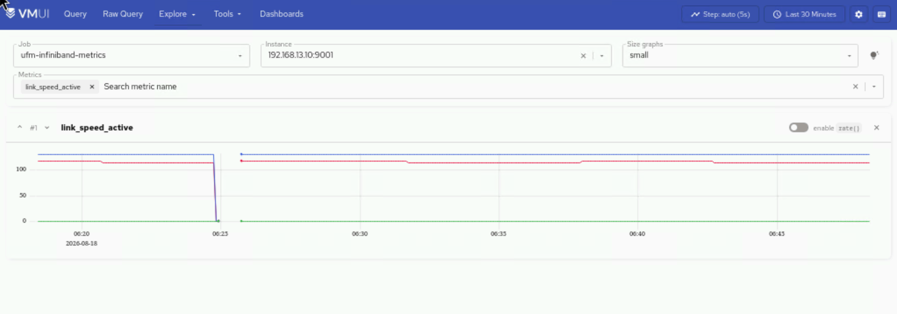

# UFM Metrics

This page catalogs the InfiniBand fabric metrics collected by the NVIDIA
Unified Fabric Manager (UFM) Prometheus exporter. These metrics are scraped
by vmagent and stored in VictoriaMetrics.

## Collection Method

| Property | Value |
| --- | --- |
| **Collection tool** | UFM Prometheus Exporter |
| **Protocol** | Prometheus scrape over HTTPS |
| **Default port** | 9001 |
| **Default interval** | 30 seconds (configurable via `scrape_interval` in `telemetry_config.yml`) |
| **Storage** | VictoriaMetrics time-series database |

## UFM Telemetry Metrics Endpoint

### Endpoint Overview

| Property | Detail |
| --- | --- |
| **URL** | `https://<ufm-telemetry-host>:9001/metrics` |
| **Format** | Prometheus text exposition over HTTPS |
| **Purpose** | Exposes InfiniBand fabric telemetry counters across all monitored ports |

### Sample Metrics

| Metric | Description |
| --- | --- |
| `PortXmitDataExtended` | Cumulative count of bytes sent |
| `PortRcvDataExtended` | Cumulative count of bytes received |
| `PortRcvErrorsExtended` | Cumulative count of inbound error packets |
| `PortXmitDiscardExtended` | Cumulative count of outbound packets discarded |
| `phy_state` | Current physical state of the port |
| `link_speed_active` | Presently active link speed |
| `temperature` | Module or ASIC temperature reading (°C) |

*Example: `link_speed_active` metric visualization*

## References

- [UFM Telemetry Manager Plugin](https://docs.nvidia.com/networking/display/ufmenterpriseumv6242/) - UFM Telemetry Manager (UTM) Plugin documentation
- [NVIDIA UFM Enterprise - Telemetry](https://docs.nvidia.com/networking/display/ufmenterpriseumv6242/) - Telemetry configuration and usage

!!! info

    - [Telemetry Config](../Configuration/telemetry_config.md) -- UFM telemetry
      configuration parameters.
    - [NVIDIA UFM Enterprise User Manual](https://docs.nvidia.com/networking/display/ufmenterpriseumv6242/) - UFM documentation.
    - [Idrac Metrics](idrac_metrics.md) -- Hardware-level metrics from iDRAC.
    - [Ldms Metrics](ldms_metrics.md) -- OS-level metrics from LDMS.

