# BuildStreaM High-Level Design (HLD) — v1.0

High Level Design (HLD) Document

|  |  |
|---|---|
| Template Version | 2.46 |
| Current Version | 1.0 |
| Approved By |  |
| Approval Date |  |

### `<BuildStreaM>`

---
This document contains information of a proprietary nature.  **ALL INFORMATION CONTAINED HEREIN SHALL BE KEPT IN CONFIDENCE.** None of this information shall be divulged to persons other than Dell employees authorized by the nature of their duties to receive such information, or individuals or organizations authorized by Dell research and development in accordance with existing policy regarding the release of company information

---

## Revision History

| Version | Date | Description | Author(s) |
|---|---|---|---|
| 1.0 | December 2025 | Initial | Venugopal Puttaraju\nvenugopal.p1@dell.com\nRajeshkumar S\nRajeshkumar.S2@dell.com |

---

# 1. Glossary

| Term | Definition |
|---|---|
| BuildStreaM (BSM) | Build and validation automation solution that provides a catalog-driven, policy-enforced lifecycle to build, validate, and promote Omnia-compatible images. |
| Omnia | Authoritative build/deploy backend integrated by BuildStreaM for image build and validation workflows. |
| OpenCHAMI | Backend capability referenced by BuildStreaM for build/deploy operations where applicable (invoked via adapters/integrations). |
| Catalog | Source-of-truth input that defines roles, packages, architectures, and validation dependencies used to drive the lifecycle. |
| Role | Named configuration unit in the Catalog representing a target node persona (e.g., OS + drivers + cluster stack + validation suites). |
| Package | Versioned software component referenced by roles (OS, drivers, Kubernetes, Slurm, etc.) used to construct images. |
| Validation dependency | Declared dependency that determines which validations must run (and in what closure) for a given role or change. |
| Stage | Discrete lifecycle step enforced by the Workflow Orchestrator (e.g., ParseCatalog, GenerateInputFiles, PrepareRepos, BuildImage, ValidateImage, ValidateImageOnTest, Promote). |
| Stage-gated flow | Enforcement that stages must execute in the defined order; out-of-order requests are rejected. |
| Workflow Orchestrator | Central component that enforces stage gating, idempotency, admission control, async task dispatch, and consistent error handling. |
| API Facade | Single external entry point providing request validation and AuthN (OAuth 2.0 Client Credentials / Bearer token) and routing to internal modules. |
| Domain module | Logical internal module implementing domain logic (Catalog/Build/Validate/Promote), invoked by the Orchestrator. |
| Job | Logical lifecycle execution instance created from a request and tracked end-to-end across stages. |
| `jobId` | Unique identifier used to correlate a job across stages, logs, and persistent state. |
| Correlation ID | Identifier propagated across request handling and logs to link related events/operations. |
| Idempotency key | Client-supplied key used to deduplicate retries and ensure repeated calls do not create duplicate work. |
| Candidate | Image/artifact set produced by build and validation that is eligible for promotion. |
| Baseline | Approved image/artifact set used as the reference for subsequent pipelines and deployments. |
| Promote | Stage that marks a validated candidate as the approved baseline. |
| Artifact Repository | Immutable storage for large artifacts (images, SBOMs, manifests, validation reports). |
| Metadata Store | Durable structured store for job/candidate/baseline state and audit metadata (e.g., PostgreSQL). |
| Cache | Best-effort cache for derived/temporary data; must be safe to lose and must not contain secrets. |
| Testbed | Production-like environment where images are deployed/booted and validation suites are executed. |
| ValidateImage | Stage that performs static image validation for correctness (e.g., structure/format, metadata consistency, basic sanity checks); not security scanning. |
| ValidateImageOnTest | Stage that deploys/boots images on testbeds and runs validation suites; produces validation results. |
| PrepareRepos | Umbrella terminology used to describe repo-preparation activities; in R1 this is represented as separate external stage APIs: `CreateLocalRepo`/`UpdateLocalRepo` and `CreateImageRepo`. |
| `CreateLocalRepo` / `UpdateLocalRepo` | Repository operations that create or update a local repository required for builds. |
| `CreateImageRepo` | Repository operation that creates an image repository destination for build artifacts. |
| Diskless | Operating mode supported in R1; images are prepared for diskless boot workflows. |
| OAuth 2.0 Client Credentials | Machine-to-machine authentication model used by external clients to obtain access tokens for BuildStreaM APIs. |
| Bearer token | `Authorization: Bearer <token>` header presented by clients to authenticate API requests. |
| JWT | Token format used to convey claims in access tokens. |
| Secrets Store (R1) | OS-protected encrypted secrets file with memory-only access after decrypt; secrets must never appear in logs or artifacts. |
| Audit event | Immutable record emitted for privileged operations and stage transitions with identity and correlation information. |
| Telemetry (R1) | Logging-based telemetry: structured logs capturing key events, errors, and workflow transitions (metrics/traces are not required in R1). |
| SBOM | Software Bill of Materials produced for images to support compliance and traceability. |
| CVE | Common Vulnerabilities and Exposures identifier used to track known vulnerabilities in packages/components. |
| License policy | Rules that enforce allowed/blocked licenses for included packages and artifacts. |
| Signing / Attestation | Optional mechanisms (roadmap/optional) to provide cryptographic integrity and provenance evidence for artifacts. |
| Admission control | Orchestrator controls that enforce concurrency caps and reject overload instead of queueing (baseline behavior). |
| `[R1]` | In-scope for Release-1. |
| `[NOT R1]` | Out of scope for Release-1; roadmap/future capability. |

---

# 2. Introduction

BuildStreaM (BSM) is an automation solution designed to complement and extend Omnia’s capabilities. It replaces manual, file‑based image configuration with a catalog‑driven, policy‑enforced, and CI/CD‑integrated (details in Section 4.2) workflow. BSM provides a single source of truth for OS, drivers, Kubernetes, Slurm and other related packages.
It automates the lifecycle from build → validate → promote.

**Key features:**

- Catalog as single source of truth: Regularly updated package metadata, dependency rules, and role configurations.
- End‑to‑end test automation: Stage‑gated workflows and service APIs for build, validation and promotion.
- Compliance & policy gates: SBOM generation, CVE/license checks, and optional signing/attestation to block non‑compliant releases.
- Multi‑arch: Images for x86_64, aarch64, etc.
- Observability: Structured logs for each stage.

By introducing these capabilities, BuildStreaM significantly reduces deployment effort, complexity, accelerates time-to-production, and enhances the reliability of HPC and AI clusters managed by Omnia. Omnia gains a standardized, Catalog‑driven image pipeline with promotion channels, deployment deltas, and operational telemetry.

## 2.1 Scope

- Catalog ingestion and validation.
- Input generation adapters for Omnia.
- Image build service (Omnia/OpenCHAMI integration).
- Validation on testbeds (full/subset with dependency closure).
- Release creation and promotion to channels.
- Deployment (delta‑aware, blue/green) with restore point creation.
- Metadata in database; artifacts/manifests in S3; RBAC; audit; telemetry.


### Release-1 scope legend

- **<span style="color:#16a34a"><b>[R1]</b></span>** Release‑1 scope
- **<span style="color:#dc2626"><b>[NOT R1]</b></span>** Not in Release‑1 scope (roadmap / future)


### 2.1.1 Release 1.0

#### 2.1.1.1 Statement of Work / Product Backlog / ERS for Release 1.0

**Features**

- Catalog ingestion and validation.
- Input generation adapters for Omnia.
- Image build service (Omnia/OpenCHAMI integration).
- Validation on testbeds (static image validation & pxe boot).
- Single user. No RBAC.
- Metadata in database; artifacts in S3


**External API contract summary (Release‑1)**

- **<span style="color:#16a34a"><b>[R1]</b></span>** Base URI: `https://<HOST_ADDRESS>:<PORT_NUM>/api/v1/`
- **<span style="color:#16a34a"><b>[R1]</b></span>** OAuth 2.0 Client Credentials endpoints (implemented by BuildStreaM):
  - `POST /register`
  - `POST /auth/token`
- **<span style="color:#16a34a"><b>[R1]</b></span>** Functional endpoints:
  - `POST /jobs`
  - `GET /jobs/{jobId}`
  - `DELETE /jobs/{jobId}`
  - `POST /jobs/{jobId}/stages/parse-catalog`
  - `POST /jobs/{jobId}/stages/generate-input-files`
  - `POST /jobs/{jobId}/stages/create-image-repository`
  - `POST /jobs/{jobId}/stages/build-image`
  - `GET /jobs/{jobId}/catalog/roles`
  - `GET /jobs/{jobId}/catalog/roles/packages`
  - `POST /jobs/{jobId}/stages/create-local-repository`
  - `POST /jobs/{jobId}/stages/update-local-repository`
  - `POST /jobs/{jobId}/stages/validate-image`
  - `POST /jobs/{jobId}/stages/validate-image-on-test`


## 2.2      References

The following documents are included for reference.

| LOB | Type | Document Name (Document Link) | Document Description |
|---|---|---|---|
| Global Large Enterprise | Agile | Related MRD(s) | Upstream requirements and business drivers that motivate BuildStreaM scope and priorities. |
| BuildStreaM | Template | [HLD Template](https://dell.sharepoint.com/:w:/s/HPCEngineeringDevelopment/IQAs84FT_KlQS7KTK3r6E_CiAZhKcN_zce1bRu2BywsB1kQ?e=BX8lvu) | High Level Design (HLD) template. |
| BuildStreaM | Statement of Work | TBD | Release scope agreement capturing deliverables, milestones, assumptions, and acceptance criteria for BuildStreaM. |
| BuildStreaM | Behavior Specification | [BuildStreaM Behavior Specification Document](https://dell.sharepoint.com/:w:/r/sites/HPCEngineeringDevelopment/Shared%20Documents/General/Omnia%202.1/Behaviour%20Specification/AutomatedSystem4ProvisioningBSpec%20Guide.docx?d=w7d602388dd014bd69fa2fc2cc448ed67&csf=1&web=1&e=M1e6fn) | Authoritative description of externally observable behavior: API semantics, stage preconditions, response codes, and workflow expectations. |
| BuildStreaM | API Specification | [Omnia API Specification Document](https://confluence.cec.lab.emc.com/spaces/~Rajeshkumar_S2/pages/2546967566/Omnia+API+Specification+Document#imagevalidation) | Authoritative external API specification referenced by BuildStreaM API Facade. |
| BuildStreaM | OpenAPI Specification | TBD | Machine-readable OpenAPI contract for BuildStreaM external endpoints, used for client generation and contract testing. |

# 3. Solution Architecture

## Overview

BuildStreaM (BSM) implements a **modular monolith** architecture where domain capabilities are exposed as API endpoints backed by Python modules. All modules are co-deployed and share the same process/runtime while maintaining strict logical boundaries and well-defined interfaces.

### Architectural Style

| Aspect | Description |
|--------|-------------|
| **Pattern** | Modular Monolith |
| **Deployment** | Single deployable unit; modules co-located in same process |
| **Communication** | In-process function calls between modules; HTTPS for external clients |
| **Boundaries** | Strict logical separation via interfaces; shared state only through Orchestrator and data stores |

#### Solution Context

<!-- Diagram-3-01 -->
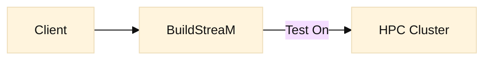
<!-- Diagram-3-01 -->
Diagram-3-01 Solution Context

#### Primary Workflow

<!-- Diagram-3-02 -->
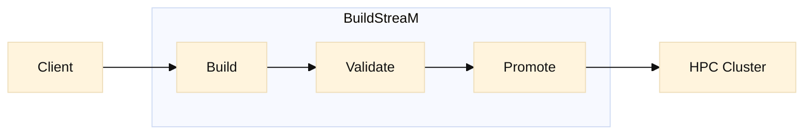
<!-- Diagram-3-02 -->
Diagram-3-02 Primary Workflow

### High-Level Architecture

<p align="center">
  
</p>

> [!NOTE]
> “These boxes represent modules within a single deployable (modular monolith). They are not independently deployed microservices.”


<!-- Diagram-3-03 -->
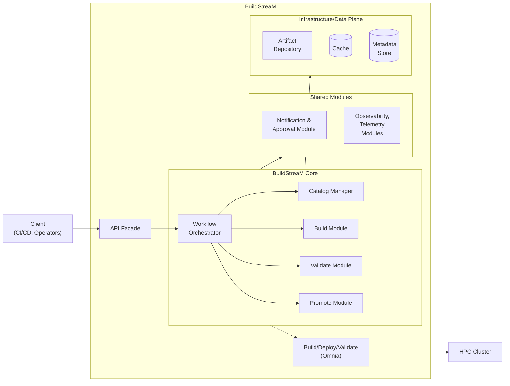
<!-- Diagram-3-03 -->
Diagram-3-03 High-Level Architecture

> **Legend:** Green modules (Build, Validate) are wrappers invoking OMNIA for build and validation operations.
> **Note:** API Gateway is not included in baseline architecture. API Facade handles authentication directly.

### Architectural Layers

| Layer | Components | Responsibility |
|-------|------------|----------------|
| **Edge** | API Facade | External access, authentication (OAuth 2.0 Client Credentials), routing, request normalization |
| **Orchestration** | Workflow Orchestrator | Stage guards, idempotency, async task management, error handling |
| **Core Modules** | Catalog Manager, Build Module, Validate Module, Promote Module | Domain logic implementation |
| **Shared Modules** | <span style="color:#dc2626"><b>[NOT R1]</b></span> Notification & Approval Module, <span style="color:#dc2626"><b>[NOT R1]</b></span> Observability & Telemetry Modules | Cross-cutting capabilities |
| **Infrastructure/Data Plane** | Artifact Repository, Metadata Store, <span style="color:#dc2626"><b>[NOT R1]</b></span> Cache | Artifacts, metadata, caching |
| **External** | OMNIA, HPC Cluster | Build/validation execution via OMNIA; HPC target environment |

### Component Interactions

- **Clients** interact via the **API Facade**; all external access is routed through this single entry point which handles authentication
- **API Facade** provides edge security (AuthN), request normalization, and forwards to the Orchestrator
- **Workflow Orchestrator** centralizes orchestration, stage guarding, idempotency enforcement, and error handling
- **Core Modules** implement domain logic:
  - **Catalog Manager** — Catalog parsing, normalization, input generation. Workflow and stages: ParseCatalog, GenerateInputFiles
  - **Build Module** — Wrapper invoking OMNIA for image building and artifact publishing.Workflow and stages: PrepareRepos, BuildImage; repo preparation: PrepareRepos covers CreateLocalRepo/UpdateLocalRepo + CreateImageRepo
  - **Validate Module** — Wrapper invoking OMNIA for image correctness checks, test suite execution, report generation.Workflow and stages: ValidateImage, ValidateImageOnTest
  - **Promote Module** — [NOT R1] Policy enforcement, [NOT R1] approval gates, promotion (validated images tagged as promoted)
- **Shared Modules** provide cross-cutting capabilities:
  - <span style="color:#dc2626"><b>[NOT R1]</b></span> **Notification & Approval Module** — Approval workflows, notifications
  - <span style="color:#dc2626"><b>[NOT R1]</b></span> **Observability & Telemetry Modules** — Logs, metrics, traces
- **Infrastructure/Data Plane** houses:
  - **Artifact Repository** — Immutable storage for images, given catalog, generated artifacts,  <span style="color:#dc2626"><b>[NOT R1]</b></span> SBOMs, <span style="color:#dc2626"><b>[NOT R1]</b></span> manifests
  - **Metadata Store** — Persistent metadata
  - <span style="color:#dc2626"><b>[NOT R1]</b></span> **Cache** — Optional generic cache for derived/recomputable data (e.g., catalog-derived metadata, dependency-closure results, and other repeated reads/computations). Must not store secrets.
- **OMNIA** executes build and validation logic; provisions images to **HPC** target environment

---
### Gateway Decision

Given the single-client, OAuth 2.0 Client Credentials authentication model, a dedicated API Gateway **does not deliver additional security or operational value in the baseline architecture**. Authentication and transport security are enforced at the **API Facade**. A gateway may be introduced later if multi-tenant access, external exposure, or advanced traffic management becomes a requirement.

| Aspect | Baseline Architecture | Future (if needed) |
|--------|----------------------|-------------------|
| **Entry Point** | API Facade | API Gateway → API Facade |
| **AuthN** | API Facade (OAuth 2.0 Bearer token) | API Gateway |
| **Use Case Trigger** | Single client, on-prem, trusted | Multi-tenant, external exposure, advanced traffic mgmt |

### Rate Limiting Decision

- **<span style="color:#16a34a"><b>[R1]</b></span>** BSM does not implement traditional API rate limiting. The system serves a single trusted automation client within a secure trust boundary using OAuth 2.0 Bearer token authentication. Resource protection is achieved through **workflow-level admission control**, concurrency caps, and idempotency enforcement within the Orchestrator. This approach prevents resource exhaustion while preserving correct semantics for long-running operations.
- **<span style="color:#dc2626"><b>[NOT R1]</b></span>** Introduce blanket rate limits across all endpoints with SlowAPI middleware for FastAPI. Use a per-user/client key derived from the access token / client credentials; fall back to IP for anonymous endpoints (if any). Enforce 30 requests / 10 seconds (burst), 300 requests / 5 minutes (sustained), and 10,000 requests / day per client. Return HTTP 429 with `Retry-After` and optional `X-RateLimit-*` headers. Reverse proxy is N/A (R1 is single-instance FastAPI); retries and concurrency caps at the API boundary are N/A.

#### Admission Control Configuration (baseline defaults)

| Parameter | Default | Description |
|-----------|---------|-------------|
| `max_concurrent_builds` | 1 | Maximum number of concurrent build jobs |
| `max_parallel_validations` | 1 | Maximum number of parallel validation tasks |
| <span style="color:#dc2626"><b>[NOT R1]</b></span> `max_active_deploys_per_env` | 1 | Only 1 active deploy per environment at a time |
| `promotion_requires_stage_completion` | true | Promotion requires previous stage completion |

---

## 3.1 Architecture Constraints and Assumptions

This section defines the architectural constraints (must be true and enforced), assumptions (expected to hold), operational and non-functional requirements (NFRs), limitations (current solution boundaries), and operational constraints that govern the BuildStreaM solution.

---

### 3.1.1 Constraints

#### Security & Trust

 - **On-prem trust boundary:** All internal module traffic remains inside the enterprise network; external access is only via the API Facade.
 - **Authentication:** OAuth 2.0 Client Credentials is enforced at the API boundary via BuildStreaM-managed token issuance (`POST /api/v1/register`, `POST /api/v1/auth/token`) and `Authorization: Bearer <token>` on protected endpoints.
 - **API Facade protections:** Request validation is enforced at the API Facade.
 - **Admission control:** Resource protection is achieved through workflow-level admission control in the Orchestrator (see Rate Limiting Decision in Section 3).
 - **Auditability:** Every stage transition (parse, generate, build, validate) must emit immutable audit events with correlation IDs (`jobId`).
 - **Least privilege:** Scoped credentials per runtime role (API vs background workers); store ACLs enforce role-based access with audit.
 - **Error sanitization:** External error messages must not reveal sensitive details; verbose logs routed to secure backends.

#### Identifiers and correlation

- **`jobId`:** Stable identifier for a workflow execution across all stages.
- **Correlation ID:** Identifier used to correlate logs/events for a specific request/operation; it is propagated end-to-end and returned in responses.
- **Idempotency key:** Client-supplied key used to deduplicate retries for long-running stage requests.

#### Data Governance

 - **Single Source of Truth (SSoT):** The Catalog defines roles, packages, architectures, and validation dependencies; The pipeline must only use configuration defined in the Catalog and must not supply extra settings from scripts, variables, or manual edits.
 - **Schema conformance:** Catalog payloads must pass schema validation (v1.0 baseline); requests failing schema checks are rejected.
 - **Artifact immutability:** Published images, SBOMs, and manifests in the Artifact Repository are immutable; superseded artifacts are marked but not altered.
 - **PII/secrets handling:** Logs must be structured (JSON) with redaction rules; secrets stored only in an OS-protected encrypted secrets file (memory-only access), never in logs or artifacts.

#### Lifecycle & Orchestration

 - **Stage-gated flow (<span style="color:#16a34a"><b>[R1]</b></span>):** Operations must follow: ParseCatalog → GenerateInputFiles → PrepareRepos → BuildImage → ValidateImage → ValidateImageOnTest → Promote (internal). Out-of-order calls return `412 Precondition Failed`.
 - **Promote invocation (<span style="color:#16a34a"><b>[R1]</b></span>):** `Promote` is executed as an internal stage transition after successful `ValidateImageOnTest` and is not exposed as an external endpoint in R1.
 - <span style="color:#dc2626"><b>[NOT R1]</b></span> **External Promote endpoint:** A public `/Promote` endpoint may be added in future for explicit promotion workflows.
 - **Repo preparation stage terminology:** `PrepareRepos` is an abstract umbrella term. In R1, repo preparation is represented as separate external stage APIs (`CreateLocalRepo`/`UpdateLocalRepo` and `CreateImageRepo`) and is idempotent (no-op if already satisfied).
 - <span style="color:#dc2626"><b>[NOT R1]</b></span> **Future lifecycle:** Create Release / Deploy stages are roadmap items.
 - **Idempotency:** Long-running operations (Build, Validate) require idempotency keys to prevent duplicates; repeated calls with the same key must be safe.

#### Platform & Runtime

 - **OS baseline:** Control plane modules run on RPM-based Linux (RHEL family) hosts.
 - **Technology stack:** Modules are implemented in Python/Ansible where applicable; Omnia/OpenCHAMI are the authoritative build/deploy backends.
 - **Multi-arch outputs:** The Catalog schema supports target image architecture identifiers provided by users (e.g., `x86_64`, `aarch64`); effective support is determined by available build/deploy adapters and backend capabilities. Unsupported architectures are rejected at validation/build time unless corresponding adapter/backend support is added.

 #### Observability & Operations

 - **Telemetry (<span style="color:#16a34a"><b>[R1]</b></span>):** Logging-based telemetry is implemented in the API Facade, Orchestrator, and all modules. Logs capture key events, errors, and workflow transitions and are used for monitoring, debugging, and audit support. Structured logging (JSON) is used to enable log correlation and analysis.
 - **Centralized logs (<span style="color:#16a34a"><b>[R1]</b></span>):** An NFS share is mounted/attached to the container and logs are written directly to the mounted path. Rotate at 50 MB per file. Retention policy is defined by the user.
 - <span style="color:#dc2626"><b>[NOT R1]</b></span> **Metrics/traces:** Not required in R1 due to the simple architecture (Prometheus/OpenTelemetry can be added later if needed).
 - <span style="color:#dc2626"><b>[NOT R1]</b></span> **Dashboards & alerts:** Grafana dashboards and alert routing.

---

### 3.1.2 Assumptions

#### Catalog & Validation

 - **Catalog v1.0 backward compatibility:** Minor changes (new fields/defaults) do not break existing consumers; otherwise, versioning will be used.
 - **Validation dependencies:** Roles declare explicit validation dependencies in Catalog (or sidecar) enabling subset validation to compute dependency closure.
 - **Default test suites:** A baseline set of per-role validation suites exists and is extensible (functional/basic perf/integration).

#### Environments & Testbeds

 - **Testbed parity:** Testbeds represent production-like conditions sufficiently to catch regressions; drift is monitored and corrected. VMs can be used in case it mimics the production environment.
 - **Network & storage capacity:** Sufficient bandwidth and storage exist for baseline build/validation runs (single in-flight build and validation), artifact pushes, and test execution.

#### CI/CD & Approvals

 - <span style="color:#dc2626"><b>[NOT R1]</b></span> **Approval availability:** Deployment approvals are available through enterprise tooling (GitHub checks, webhooks, chatops).
 - <span style="color:#dc2626"><b>[NOT R1]</b></span> **Policy configuration:** SBOM/CVE/license/signing thresholds are defined by Security/Compliance teams and accessible to Promote Module gating.

---

### 3.1.3 Operational and Non-Functional Requirements (NFRs)

This section describes cross-cutting operational behaviors and quality attributes that influence the implementation and day-to-day operations. These items are implemented through clear ownership across the API Facade, Workflow Orchestrator, domain modules, and the persistence layers.

#### Reliability & Execution

 - **Job lifecycle state model:** The Workflow Orchestrator owns the job lifecycle state machine and is the single authority for job transitions. Job state, timestamps, and step outcomes are persisted in the Metadata Store and updated as each stage completes. Domain modules report stage outcomes back to the Orchestrator, which maintains a consistent end-to-end view of the job.
 - **Retries & backoff:** Reliability for external integrations is mediated by the Orchestrator and the relevant module/adapters (repositories, HPC Cluster interactions, OMNIA). Transient failures are handled via a bounded retry strategy with backoff and are surfaced as structured outcomes in job history so that operators can distinguish transient instability from hard failures.
 - **Concurrency safety:** Shared resources (repositories, artifact publishing, testbeds, and mutable metadata) are protected through Orchestrator-controlled admission control, idempotency enforcement, and stage gating. The architecture prioritizes deterministic outcomes by constraining parallelism where shared state is involved.

   Non-goals:
   - BuildStreaM does not aim to maximize parallel throughput in baseline deployments at the expense of determinism.
   - The system does not attempt to guarantee completion under persistent external outages.

#### Interface Quality

 - **Contract-first interfaces:** The API Facade is the owner of the external interface contract. External endpoints are defined and versioned as part of the published contract and behavior specification, and the Facade mediates backward-compatible evolution to avoid breaking automation clients.
 - **Consistent error model:** The API Facade provides a consistent external error surface. Internally, domain modules and adapters map backend failures into Orchestrator-understood outcomes, and the Orchestrator returns structured failure information (error code, message, context, and correlation identifiers) suitable for CI/CD gating and troubleshooting.
 - **Input validation:** Request and payload validation is anchored at the API boundary and reinforced within domain logic. The API Facade validates request shape and authentication context, the Catalog Manager validates catalog/schema conformance, and the Orchestrator enforces stage preconditions to prevent partial or out-of-order mutations. Invalid requests fail fast and do not advance job state.

   Non-goals:
   - The system does not expose internal stack traces or backend-specific error details to external clients.

#### Compliance Evidence & Integrity

 - **Provenance & integrity:** The Orchestrator establishes traceability between a job and its produced artifacts by recording identifiers and integrity metadata (URI + digest) in the Metadata Store. Downstream stages verify referenced artifact digests before use. The Artifact Repository provides immutable storage for produced artifacts and reports so that a promoted outcome can be traced back to the exact build/validation execution.
 - **Retention & evidence:** Operational evidence is captured through structured logs and persisted job metadata, alongside artifact/report retention in the Artifact Repository. Retention policies are treated as an operational concern and are enforced through platform operations rather than embedded as hard-coded behavior in the pipeline.

#### CI/CD Operations

 - <span style="color:#dc2626"><b>[NOT R1]</b></span> **Multi-environment gating:** Cross-environment promotion is modeled as a gated control point owned by the Promote and Notification/Approval capabilities, with the Orchestrator enforcing that required quality signals and approvals exist before proceeding. Approval evidence (who/when/what) is recorded as part of the promotion metadata.
 - <span style="color:#dc2626"><b>[NOT R1]</b></span> **Rollback readiness:** Rollback is treated as an orchestration capability that relies on persistent history (jobs, candidates, baselines) and immutable artifacts. The Orchestrator supports re-running from a known-good promoted baseline without requiring operators to recreate inputs.

#### Maintainability

 - **API stability:** Compatibility is managed at the API boundary. The API Facade is responsible for versioning and controlled rollout of external changes, while the Orchestrator and modules preserve stable execution semantics across stage transitions.
 - **Documentation:** Operational guidance is maintained alongside the architecture: changes affecting stages, policies, or integrations are reflected in this HLD and in implementation runbooks so that operators and engineers have a single consistent source of truth.

---

### 3.1.4 Limitations (Current Architecture Boundaries)

#### Functional Scope

 - **No multi-user support:** Baseline supports a single client/user; multi-tenant or multi-user access is a roadmap item.
 - **No full self-service UI:** Baseline is API/notification driven for status, approvals, and restore.
 - **No cloud image targets:** Baseline does not produce cloud images.
 - **No production deployment:** Baseline focuses on build and validation; production deployment is a roadmap item.
 - **No step-level resume/restart (<span style="color:#16a34a"><b>[R1]</b></span>):** Baseline does not guarantee resumability from an arbitrary stage after failure; creating a new job and re-running the workflow is the primary recovery mechanism.
 - **No HA/DR guarantee:** Baseline does not provide high availability or disaster recovery guarantees; availability/backup/restore are operational/platform concerns.

#### Performance & Scalability

 - **Build concurrency cap:** Default max 1 concurrent build in baseline; configurable via `max_concurrent_builds`.
 - **Build overflow behavior:** Overflow not allowed in baseline (no queueing); requests beyond concurrency limits are rejected. Queueing is a roadmap item.
 - **Validation parallelism:** Default max 1 parallel validation in baseline; <span style="color:#dc2626"><b>[NOT R1]</b></span>  configurable via `max_parallel_validations`.
 - **Validation overflow behavior:** Overflow not allowed in baseline (no queueing); requests beyond concurrency limits are rejected. Queueing is a roadmap item.
 - <span style="color:#dc2626"><b>[NOT R1]</b></span> **Deploy concurrency:** Only 1 active deploy per environment; configurable via `max_active_deploys_per_env`.
 - **SLO baseline:** Parse→Validate typically ≤ 1 hour under normal load; large catalogs may exceed without caching.

#### | <span style="color:#dc2626"><b>[NOT R1]</b></span> Policy & Compliance

 - **Signing/attestation defaults:** Signing/attestation optional in baseline (cosign/in-toto hooks exist but not enforced by default).
 - **Policy tuning:** Default deny lists and CVE severity caps may need tuning; false positives possible until thresholds stabilize.

#### Observability

 - **Logs-only telemetry (R1):** Baseline relies on structured logs; metrics/traces and automated SLO alerting are not provided by BuildStreaM in R1.

#### Architecture Boundaries

 - **Build/Validate delegation boundary:** BuildStreaM orchestrates the lifecycle and records outcomes, but delegates the execution of image build and validation to OMNIA running against the HPC Cluster. BuildStreaM’s Build and Validate modules act as adapters/wrappers around these external execution capabilities.
 - **Execution authority boundary:** Cluster capacity/scheduling, node health, and testbed availability/drift are controlled outside BuildStreaM; BuildStreaM surfaces outcomes but does not govern the runtime execution environment.
 - **Repository boundary:** Source repositories, package mirrors, and registries are external dependencies; BuildStreaM detects and reports availability/integrity failures but does not provide mirroring/HA.
 - **Notification/approval delegation boundary:** Approval workflows and notification delivery are not owned by BuildStreaM; BuildStreaM integrates with an external Notification / Approval System (e.g., GitHub checks, ServiceNow, chat/email) to request approvals and publish status.
 - **Observability delegation boundary:** BuildStreaM emits logs (R1) and can integrate with centralized observability backends for aggregation/dashboards/alerts; the collection and visualization platforms are external capabilities and not owned by BuildStreaM.

#### Data & Storage

 - **Artifact sizes:** Artifacts are typically 1–3 GB.
 - **Retention / cleanup responsibility:** BuildStreaM provides explicit per-job cleanup via `DELETE /jobs/{jobId}` to remove job-scoped JSONs, generated input files, and other intermediate artifacts and to invalidate the `jobId`. Separately, platform/artifact-repository retention policies are required to ensure eventual cleanup of failed/abandoned intermediates (e.g., if cleanup is not invoked) and to prevent unbounded storage growth.

---

### 3.1.5 Operational Constraints

#### Access & Roles

 - <span style="color:#dc2626"><b>[NOT R1]</b></span> **Authorization matrix:** Role-based restrictions (e.g., Promote) are implemented via RBAC in future.
 - <span style="color:#dc2626"><b>[NOT R1]</b></span> **Change management:** Promotions require explicit approval references (ticket or GitHub check ID).

#### Reliability & Recovery

 - **Baseline tracking:** Each promotion marks the validated images as the approved baseline for future iterations.
 - **Overload protection:** Long-running tasks support backoff and retry; overload protection via concurrency caps.

#### Compatibility & Upgrades

 - **Omnia version alignment:** Build/Validate integrations must align with declared Omnia versions; breaking changes require adapter updates.
 - **Schema evolution:** Non-backward-compatible catalog changes require a new `schemaVersion` and service support for migration/version negotiation.

---

### 3.1.6 Risks & Mitigations

 - **Test-bed drift → false validation results:** Mitigation: standardized test-beds, baseline snapshots, drift monitoring.
 - **OMNIA/HPC unavailability → stalled or failed runs:** Mitigation: bounded retries/backoff; clear failure classification; capacity checks and scheduled windows; operational runbooks for cluster incidents.
 - **Repository health issues → build failures:** Mitigation: mirror monitoring, checksums, fallback mirrors, cache pre-warm.
 - **Artifact Repository outage/corruption → lost deliverables:** Mitigation: immutable writes with digests; repository health monitoring and backups; fail-safe behavior that prevents marking a job successful without confirmed publish.
 - **Metadata Store outage → inconsistent job state:** Mitigation: treat the Metadata Store as the system-of-record; reject state transitions when persistence is unavailable; backup/restore procedures and schema migration discipline.
 - **Resource contention → long build times/flakiness:** Mitigation: concurrency caps (baseline rejects overflow), scheduled windows, caches, scale workers (roadmap).
 - **Orphaned intermediates → unbounded storage growth:** Mitigation: enforce `DELETE /jobs/{jobId}` usage; repository retention policies for abandoned/failed artifacts; periodic audits against job state.

---

### 3.1.7 Cross-cutting security verification

- **SAST (Python):** Run `bandit -r .` in CI or any other Dell approved scanning tool and fail builds on any `HIGH` findings in BuildStreaM code.
- **Dependency vulnerability scanning:** Run `pip-audit` in CI and fail builds on `HIGH`/`CRITICAL` vulnerabilities in runtime dependencies.
- **Secrets scanning:** Run `gitleaks` in CI and fail builds if any high-confidence secrets are detected.
 - **Secure deserialization verification (<span style="color:#16a34a"><b>[R1]</b></span>):** Accept only safe, explicitly supported data formats for request/inputs (JSON; YAML only if explicitly required and only via safe loader); explicitly forbid unsafe serialization mechanisms (e.g., pickle/native object graphs); validate deserialized data into typed models/schemas before any downstream use; enforce strict input bounds (size, depth/nesting) and reject malformed or excessive payloads; validate data integrity for structured inputs persisted or fetched by reference (verify digest/signature before parsing/deserializing); add automated negative tests for hostile payload patterns (e.g., deep nesting, recursive structures, type confusion).
- **Path traversal defenses verification (<span style="color:#16a34a"><b>[R1]</b></span>):** Canonicalize filesystem paths and enforce base-directory confinement; reject path separators and `..` in user-derived identifiers; add automated negative tests for traversal patterns (e.g., `../`, `%2e%2e/`, `..\\`, absolute paths).
- **Deployment verification (<span style="color:#16a34a"><b>[R1]</b></span>):** Verify Orchestrator admission control/concurrency caps are configured, TLS policy and HSTS are enabled, log redaction is active, and logs are centralized with an NFS share.
- **Documented access, service access limits, and secure defaults verification (<span style="color:#16a34a"><b>[R1]</b></span>):** Maintain an inventory of API resources/routes (authoritative OpenAPI + behavior specification alignment); document all user/system accounts and access interfaces (API clients, service accounts, SSH identities, DB users, storage identities, and exposed ports); document maintenance aids and service access interfaces/accounts (diagnostic endpoints, admin/breakglass procedures) in a Secure Serviceability Letter; disable unused services and interfaces from integrated dependencies (no inbound SSH, no debug/admin endpoints or extra listeners in production); change default credentials (no shared/default secrets; installation-unique credentials and rotation guidance in a Security Configuration Guide).

## Appendix A — Architecture Gate Checklist

 - **Security:** OAuth 2.0 Client Credentials enforced at API Facade; secrets sourced from OS-protected encrypted secrets file (R1); audit-relevant fields captured; secrets never written to logs or artifacts.
 - **Data governance:** Catalog schema validated; SSoT enforced; job/candidate/baseline metadata is the system-of-record; artifacts and reports are treated as immutable outputs.
 - **Lifecycle:** Stage-gated orchestration enforced; idempotency keys supported; `DELETE /jobs/{jobId}` available to remove job-scoped intermediates and invalidate the `jobId`.
 - **Observability (R1):** Structured logs emitted with correlation IDs; integration to an external log backend is supported, but dashboards/alerts are owned outside BuildStreaM.
 - **Performance:** Concurrency caps and rejection-on-overflow behavior documented; baseline SLO expectations documented.
 - <span style="color:#dc2626"><b>[NOT R1]</b></span> **Policy / approvals:** SBOM/CVE/license/signing gates and approval flows are external/roadmap capabilities; when enabled, they must be auditable.

---

## 3.2 Architecture control flow

This section defines how execution control transitions through the BuildStreaM architecture for the end-to-end image lifecycle. Diagrams include error conditions and are **individually numbered** to enable precise reviewer feedback.

---

### 3.2.1 Control-flow overview (stage gated)

The Workflow Orchestrator enforces a stage-gated lifecycle:

- <span style="color:#16a34a"><b>[R1]</b></span> ParseCatalog → GenerateInputFiles → PrepareRepos → BuildImage → ValidateImage → ValidateImageOnTest  → Promote
- <span style="color:#dc2626"><b>[NOT R1]</b></span> Create Release → Deploy (roadmap)

Requests that violate the expected stage order are rejected with a precondition error and **must not** mutate persistent state.

#### 3.2.1.1 Stage flow (pipeline view)

This diagram is a pipeline-level view of the main lifecycle stages. It intentionally hides internal components and focuses on the required stage order.

<!-- Diagram-3.2.1.1-01 -->

<!-- Diagram-3.2.1.1-01 -->
Diagram-3.2.1.1-01 Stage flow (pipeline view)

**Legend (DOCX-friendly fallback)**

| ID | Meaning |
|---|---|
| P1 | Client initiating the lifecycle (CI/CD pipeline or operator) |
| P2 | ParseCatalog creates jobId and intermediate JSONs |
| P3 | GenerateInputFiles produces Omnia-compliant input files |
| P4 | PrepareRepos ensures required local/image repositories exist (idempotent) |
| P5 | BuildImage builds stateless images |
| P6 | ValidateImage performs static image correctness checks |
| P7 | ValidateImageOnTest performs testbed deployment and validation  |
| P8 | Promote marks a validated image candidate as the approved baseline |

| Flow | Meaning |
|---|---|
| PF1 | Trigger pipeline start (ParseCatalog) |
| PF2 | Trigger repo preparation after GenerateInputFiles |
| PF3 | Trigger build + validation + promotion steps (BuildImage → ValidateImage → ValidateImageOnTest  → Promote) |

**Interpretation**

- **ParseCatalog (P2):** Fetches and validates catalog and creates `jobId` + intermediate JSONs.
- **GenerateInputFiles (P3):** Produces Omnia-compliant input files.
- **PrepareRepos (P4):** Ensures required local/image repositories exist via CreateLocalRepo/UpdateLocalRepo + CreateImageRepo.
- **BuildImage (P5):** Creates stateless image artifacts.
- **ValidateImage (P6):** Performs static image validation for correctness (e.g., structure/format and metadata sanity checks).
- **ValidateImageOnTest (P7):** Deploys and validates images on testbed using minimal tests.
- **Promote (P8):** Marks validated images as the approved baseline (invoked internally in R1).


## Flow-chart

This flowchart shows the numbered sequence of operations in the main lifecycle stages, with annotated error paths.


<!-- Diagram-3.2.1.1-02 -->
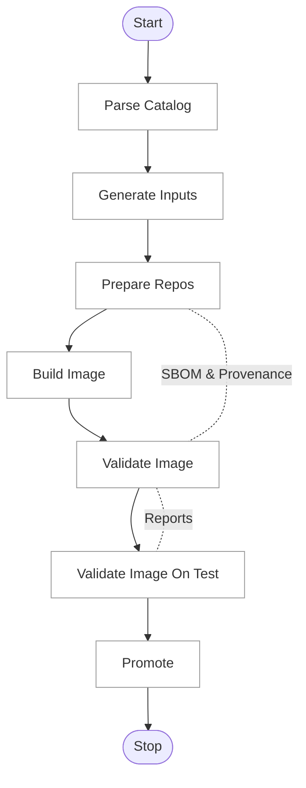
<!-- Diagram-3.2.1.1-02 -->
Diagram-3.2.1.1-02 Flow-chart

---

### 3.2.2 High-level control-flow (flow chart)

> Note: the background submission is only for APIs where async is required else it will be blocking.

#### 3.2.2.1 Major flow (happy path)

<!-- Diagram-3.2.2.1-01 -->
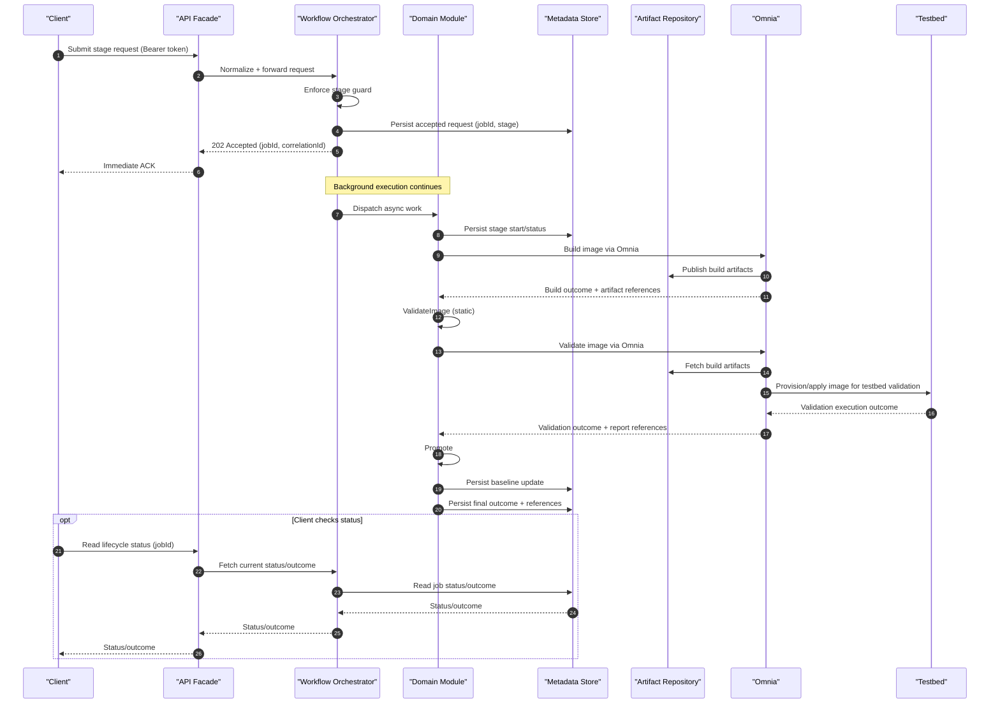
<!-- Diagram-3.2.2.1-01 -->
Diagram-3.2.2.1-01 Major flow (happy path)

### 3.2.2.2 Detailed flow (including error paths)

<!-- Diagram-3.2.2.2-01 -->
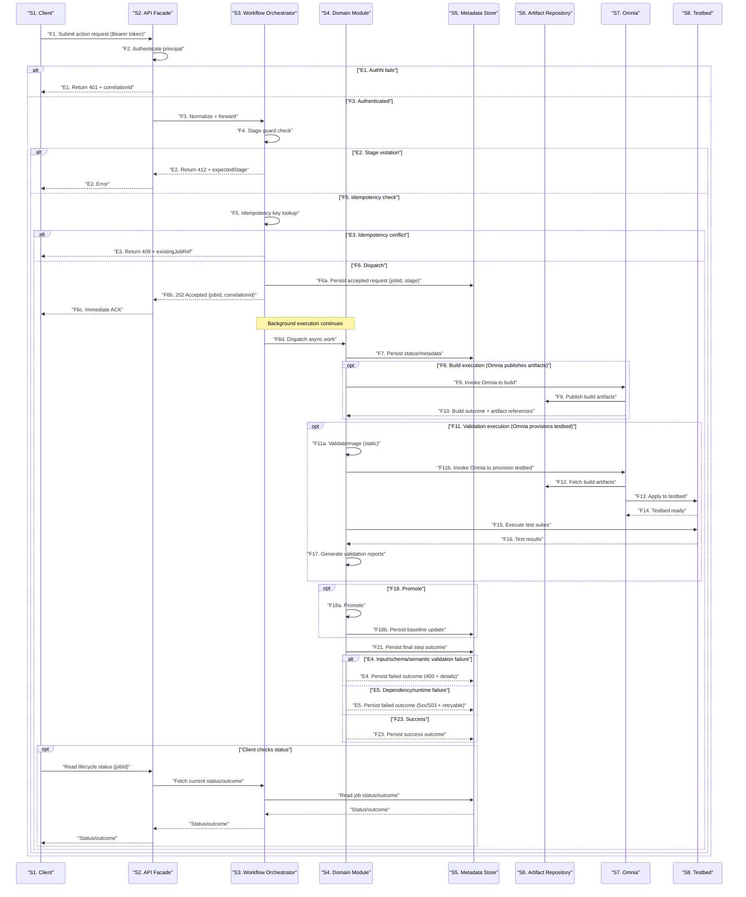
<!-- Diagram-3.2.2.2-01 -->
Diagram-3.2.2.2-01 Detailed flow (including error paths)

---

### 3.2.4 Task model

BuildStreaM is implemented as a **modular monolith**. Each lifecycle request is mediated by the API Facade and Workflow Orchestrator, and is executed either inline (for bounded work) or as an asynchronous job (for long-running work), while maintaining a single authoritative state in the Metadata Store.

#### 3.2.4.1 Execution model

- **Single logical application** hosting:
  - **API Facade** as the entry point for externally initiated lifecycle actions.
  - **Workflow Orchestrator** as the control point that coordinates stage progression, idempotency, and admission control.
  - **Domain modules (Catalog/Build/Validate/Promote)** as the units that perform stage-specific work and interact with Omnia, repositories, and the Metadata Store.
  - <span style="color:#dc2626"><b>[NOT R1]</b></span> **Integration adapters** for external systems (Notification/Approval, Observability), which are not owned as platform capabilities by BuildStreaM.

### 3.2.4.2 Concurrency and threading

- **Front-door request handling:**
  - Short, bounded operations (authentication/authorization checks, stage guards, idempotency checks, metadata reads, and lightweight input validation) are handled inline to keep request latency bounded.
  - Long-running operations (for example: builds and testbed validation) are executed as asynchronous jobs after the request is accepted.
  - Throughput is bounded by both BuildStreaM admission control and external capacity (Omnia scheduling and testbed availability).

- **Worker pools:**
  - Asynchronous job execution is managed by the Workflow Orchestrator. For each job type (e.g., build, validate), the Orchestrator maintains a bounded in‑memory task queue and a dedicated worker pool. The Orchestrator is the single authority for job state transitions and persists job metadata (state, timestamps, step outcomes).
  - Concurrency caps are applied per job type (e.g., build vs validate) to reduce contention on shared dependencies (artifact repositories, Omnia, and testbeds).
  - In baseline, overflow is handled by rejection rather than unbounded queueing (no internal queue-as-a-service behavior in R1).

- **Durability and scaling path:**
   - In the baseline, task queues are in‑process and non‑durable; job state and outcomes are persisted by the Orchestrator. If durability, horizontal scale, or richer scheduling/monitoring are required, the system can adopt a broker‑backed worker model (e.g., Redis + RQ or Celery + Redis/RabbitMQ) behind the same dispatch abstraction, without changing Orchestrator responsibilities.

### 3.2.4.3 Memory and state model

- **Stateless application instances:**
  - Runtime instances should be treated as stateless; durable state is persisted in the Metadata Store and Artifact Repository.
  - Any in-memory caches must be treated as best-effort and safe to lose.

- **Idempotency and deduplication:**
  - Idempotency keys ensure that retries and duplicate submissions do not create duplicate work.

---

## 3.2.5 Scalability and performance

### 3.2.5.1 Scaling approach

- **Horizontal scaling (<span style="color:#dc2626"><b>[NOT R1]</b></span>):**
  - Horizontal scaling of the API Facade and Workflow Orchestrator behind a load balancer is not part of R1.
  - R1 runs as a single Orchestrator instance using an in-process, non-durable task queue.
  - When horizontal scaling is introduced, task dispatch must move to a durable coordination mechanism (e.g., broker-backed workers and/or DB-leased execution) to avoid duplicate execution.

- **Asynchronous execution scaling:**
  - Long-running throughput is scaled by increasing job execution capacity (worker pool sizing and/or adding worker instances, depending on the selected task execution model).
  - The Workflow Orchestrator remains the control point for admission control and state transitions, independent of how workers are provisioned.

- **External capacity scaling:**
  - End-to-end throughput is bounded by external capacity that BuildStreaM does not control directly (artifact repository bandwidth/IOPS, Omnia scheduling, and testbed availability).
  - Scaling plans therefore include coordinated capacity management across these dependencies, not only BuildStreaM instance count.

### 3.2.5.2 Performance controls

- **Bounded concurrency:**
  - Concurrency is enforced by the Workflow Orchestrator using admission control and per-job-type limits to prevent overload on shared dependencies (artifact repositories, Omnia, and testbeds).

- **Backpressure:**
  - When configured capacity limits are reached, the system applies backpressure by rejecting new long-running work rather than allowing unbounded internal queue growth.
  - Queue-based buffering is treated as a deliberate scaling decision (roadmap) and is not assumed in the baseline.

- **Caching:**
  - Caching is treated as an optimization and is applied only to derived/recomputable data (e.g., repeated metadata reads, dependency closure results).
  - Cached entries are safe to lose and must not be required for correctness.

### 3.2.5.3 Failure handling and recovery

- **Fail-fast on validation errors:**
  - The API Facade and Workflow Orchestrator reject invalid inputs early (authentication/authorization failures, stage violations, and input/schema errors) to avoid consuming expensive build/testbed capacity.

- **Retryable dependency failures:**
  - Transient failures in external dependencies (repositories, Omnia, testbed) are handled via bounded retries coordinated by the Workflow Orchestrator, while persisting intermediate status to the Metadata Store.

- **Deterministic rollback/restore behavior:**
  - Restore transitions are mediated through stage-gated control flow to converge on a specified known-good release/image snapshot.

---

## 3.3 Architecture Data Flow Diagram

This section provides the Data Flow Diagram (DFD) for the BuildStreaM high-level architecture.

The DFDs below are included as embedded Mermaid diagrams for review and implementation guidance. If the Microsoft Threat Modeling Tool is used, paste the exported diagram image(s) alongside or in place of the Mermaid diagrams.

---

### 3.3.1 Architecture DFD diagram(s)

#### 3.3.1.1 DFD-1: System context (Level 0)

<!-- Diagram-3.3.1.1-01 -->
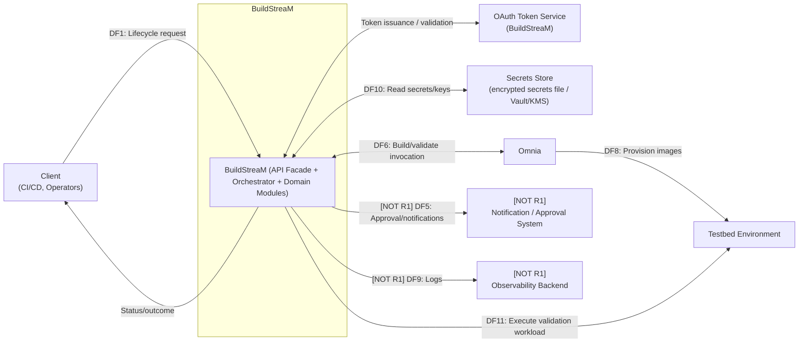
<!-- Diagram-3.3.1.1-01 -->
Diagram-3.3.1.1-01 DFD-1: System context (Level 0)

#### 3.3.1.2 DFD-2: BuildStreaM core + data plane (Level 1)

<!-- Diagram-3.3.1.2-01 -->
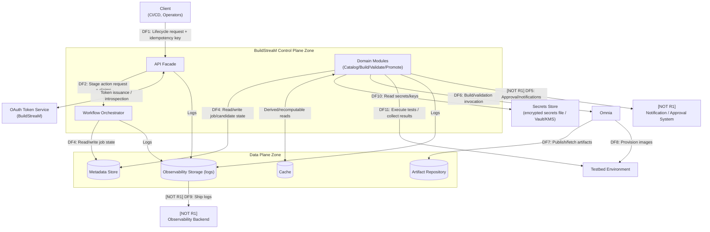
<!-- Diagram-3.3.1.2-01 -->
Diagram-3.3.1.2-01 DFD-2: BuildStreaM core + data plane (Level 1)

---

### 3.3.2 DFD element inventory (authoritative list)

The tables below define the entities, processes, and data stores that must be represented in the DFD.

### External entities

| External Entity | Description | Trust Boundary Notes |
|---|---|---|
| Client (CI/CD, Operators) | Initiates lifecycle actions (parse/generate/build/validate); promotion is an internal stage transition in R1. | Outside BuildStreaM trust boundary; may be outside enterprise network depending on environment. |
| OAuth Token Service (BuildStreaM) | Issues access tokens and supports token validation/introspection for BuildStreaM APIs. | Part of BuildStreaM control plane; treat as a separate trust zone if deployed as a distinct service/module. |
| Secrets Store (encrypted secrets file / Vault/KMS) | Provides secrets and key material required by BuildStreaM services (DB creds, repo tokens, signing keys). | R1: OS-protected encrypted secrets file with memory-only access. Future: external Vault/KMS. Never store secrets in logs or artifacts. |
| <span style="color:#dc2626"><b>[NOT R1]</b></span> Notification / Approval System | Approval decisions and notification delivery (e.g., GitHub checks, ServiceNow, email/chat). | External system; approvals must be authenticated, authorized, and auditable. |
| <span style="color:#dc2626"><b>[NOT R1]</b></span> Observability Backend | Central log/metric/trace aggregation and dashboards (e.g., Prometheus/Grafana/ELK/Otel Collector). | Separate platform/service; write-only from BuildStreaM components is preferred. |
| Testbed Environment | Production-like validation environment used to execute test suites and smoke tests; receives images provisioned by Validate Module via Omnia. | Separate environment; treated as a distinct trust zone from control plane. |

### Processes (DFD "process" nodes)

| Process | Description |
|---|---|
| API Facade | Front door for all externally initiated requests; performs AuthN (OAuth 2.0 Client Credentials), request validation, and normalization before forwarding to the Workflow Orchestrator. |
| Workflow Orchestrator | Enforces stage-gated control flow, idempotency, async job coordination, and consistent error handling. |
| Domain Modules (Catalog/Build/Validate/Promote) | Implements domain logic and reads/writes state via data stores and integrations. |
| Omnia | Executes build operations and provisions images to the Testbed for validation. |

### Data stores

| Data Store | Description | Primary Data |
|---|---|---|
| Metadata Store | Durable system-of-record for job/candidate/baseline state (PostgreSQL). | Job state, stage transitions, approvals, references/digests, audit metadata. |
| Artifact Repository | Immutable storage for images, manifests, SBOMs, validation reports. | Large binary artifacts and associated metadata. |
| Cache | Best-effort cache for repeated reads and computed results. | Derived metadata, dependency closure results, build inputs/outputs as appropriate. |
| Observability Storage (logs) | Potentially very high depending on verbosity and retention. | High ingest; indexing may stress storage (wear) on SSD-backed log platforms. | Write-only from BuildStreaM services; read restricted to authorized operators/auditors. | Use sampling and retention policies; redact secrets and sensitive fields. |
| Secrets Store (encrypted secrets file / Vault/KMS) | Low to moderate. | Low, but availability is critical. | R1: OS-protected encrypted secrets file with memory-only access. Future: BuildStreaM service identities with narrowly scoped Vault/KMS policies (per secret path/key). | Secrets must not be stored in Metadata Store or Artifact Repository. |

---

### 3.3.3 High-level data flows

| ID | Source | Destination | Data | Security Controls (minimum) |
|---|---|---|---|---|
| DF1 | Client | API Facade | Lifecycle request + idempotency key | AuthN via OAuth 2.0 Bearer token; request validation; admission control. |
| DF2 | API Facade | Workflow Orchestrator | Stage action request + principal claims | In-process module call (R1); propagate correlation IDs and claims; enforce input validation. |
| DF4 | Workflow Orchestrator / Domain Modules | Metadata Store | Read/write job/candidate state | Require TLS for DB connections (e.g., verify server cert / no plaintext credentials on the wire); DB auth via dedicated service account; least privilege (schema/role scoped); network ACL allowlists; audit fields on writes. |
| <span style="color:#dc2626"><b>[NOT R1]</b></span> DF5 | Domain Modules | Notification / Approval System | Approval request + status notifications | Signed callbacks/webhooks; replay protection; audit approver identity. |
| DF6 | Domain Modules | Omnia | Build/validation invocation + parameters + command output/status returned over the same SSH session | Outbound-only from BuildStreaM to Omnia/OIM (Omnia/OIM do not initiate inbound SSH into BuildStreaM); inbound SSH to BuildStreaM is disabled/blocked. Require strong mutual authentication on the invocation channel (R1: SSH key-based auth with host key verification; password auth disabled; least-privilege account). Allowlist actions; scoped service identity; restrict network paths via ACLs. |
| DF7 | Omnia | Artifact Repository | Publish/fetch artifacts | Repo auth token/service principal; immutable write policies; integrity digests. |
| DF8 | Omnia | Testbed Environment | Provision images for validation | Strong auth between Omnia and testbed; scoped access. |
| <span style="color:#dc2626"><b>[NOT R1]</b></span> DF9 | All components | Observability Backend | Logs | Redact secrets; write-only access; retention enforced. |
| DF10 | BuildStreaM components | Secrets Store (encrypted secrets file / Vault/KMS) | Read secrets/keys (tokens, credentials, signing keys) | R1: in-memory only (no plaintext persistence) after decrypt; OS ACLs protect the encrypted file. Future: short-lived credentials; least privilege policies; audit access. |
| DF11 | Validate Module | Testbed Environment | Execute test suites + collect results | Strong auth; scoped access; treat results as untrusted input. |

---

### 3.3.4 Data share constraints and authorization requirements

This subsection answers:

- Do any of the data shares have wear or size constraints?
- What authorization is needed to access a given data store?

| Data Store / Share | Size constraints | Wear / throughput constraints | Authorization required | Notes |
|---|---|---|---|---|
| Artifact Repository | High: artifacts are typically 1–3 GB per image; retention can grow quickly with builds. | High sustained throughput during build publish and validation fetch; ensure bandwidth and IOPS. | Write: Build/Promote service identity (via Omnia or direct adapter). Read: Validate service identity. Admin: repo administrators only. | Enforce immutability; apply retention/GC policy for failed/intermediate artifacts. |
| Metadata Store (PostgreSQL) | Moderate: mostly structured metadata; growth driven by job history and audit/event retention. | Write-heavy during job execution; ensure connection pooling and IOPS headroom. | Service account(s) for BuildStreaM components; schema-level least privilege; no direct end-user access. | All privileged transitions (promote) must write approver identity and timestamps. |
| Cache | Bounded by configured memory/disk. | High churn; eviction expected; do not treat as durable. | Service identity only; no end-user access. | Data must be safe to lose; avoid caching secrets. |
| Observability Storage (logs) | Potentially very high depending on verbosity and retention. | High ingest; indexing may stress storage (wear) on SSD-backed log platforms. | Write-only from BuildStreaM services; read restricted to authorized operators/auditors. | Use sampling and retention policies; redact secrets and sensitive fields. |
| Secrets Store (encrypted secrets file / Vault/KMS) | Low to moderate. | Low, but availability is critical. | R1: OS-protected encrypted secrets file with memory-only access. Future: BuildStreaM service identities with narrowly scoped Vault/KMS policies (per secret path/key). | Secrets must not be stored in Metadata Store or Artifact Repository. |

---

### 3.3.5 Trust boundaries (to represent in the DFD)

| Trust Boundary | Description |
|---|---|
| External to Enterprise / Client Zone → API Facade | Requests originate outside the BuildStreaM trust boundary and must be authenticated at the API Facade. |
| BuildStreaM Control Plane Zone | API Facade, Workflow Orchestrator, and modules; internal communication may be in-process. |
| Data Plane Zone | Metadata Store, Artifact Repository, Cache; strict network ACLs and service identities required. |
| Testbed / Validation Zone | Validation environment with separate operational controls; image provisioning must be authorized and auditable. |

---

## 3.4 Actor / Action Matrix

This matrix defines the actions permitted for different external actors (or, in other cases, the privilege). All external identities in the Architecture Data Flow Diagram (DFD) are represented as actors in the table below.

---

### 3.4.1 Actors (external identities)

| Actor | Description |
|---|---|
| Client (CI/CD, Operators) | Human operators and/or CI/CD pipelines that initiate lifecycle requests and read status. |
| OAuth Token Service (BuildStreaM) | Token issuance and validation/introspection used by BuildStreaM APIs. |
| Secrets Store (encrypted secrets file / Vault/KMS) | R1: OS-protected encrypted secrets file with memory-only access. Future: enterprise secret and key management system used by BuildStreaM services. |
| Omnia | External execution plane used by BuildStreaM to execute build operations and provision images to the Testbed for validation. |
| <span style="color:#dc2626"><b>[NOT R1]</b></span> Notification / Approval System | External system used to send notifications and capture approvals (e.g., GitHub checks, ServiceNow, chat/email). |
| <span style="color:#dc2626"><b>[NOT R1]</b></span> Observability Backend | Central platform receiving logs and serving dashboards/queries. |
| Testbed Environment | Environment used to receive provisioned images, execute validation suites, and report validation results. |

---

### 3.4.2 Action definitions

| Action | Description |
|---|---|
| A1. Submit lifecycle request | Submit API requests to initiate parse/generate/build/validate workflows. |
| A2. Read lifecycle status | Read job/candidate/baseline status and outcomes. |
| A3. Provide authentication assertions | Provide tokens/claims/identity validation to support AuthN at the API Facade. |
| A4. Provide secrets / key material | Provide credentials, tokens, certificates, or signing keys to authorized BuildStreaM service identities. |
| <span style="color:#dc2626"><b>[NOT R1]</b></span> A5. Receive approval requests and notifications | Receive approval/notification requests about workflow state changes via external tooling (e.g., chat/email/ticketing). |
| <span style="color:#dc2626"><b>[NOT R1]</b></span> A6. Provide approval / gate decision | Provide an approval decision (approve/deny) for deployment or future gated stages. |
| <span style="color:#dc2626"><b>[NOT R1]</b></span> A7. Receive telemetry (logs) | Receive and store telemetry emitted by BuildStreaM components. |
| A8. Receive provisioned images | Receive images provisioned by Validate Module via Omnia for validation. |
| A9. Execute validation workload | Execute test suites/workloads and return validation results. |
| A10. Provide operational feedback | Return health/status/result signals after validation activities. |
| A11. Execute build/provision operations | Execute build operations and provision images to the Testbed for validation when invoked by BuildStreaM. |

---

### 3.4.3 Actor / Action Matrix

| Actions | Client (CI/CD, Operators) | OAuth Token Service (BuildStreaM) | Secrets Store (encrypted secrets file / Vault/KMS) | Omnia | Notification / Approval System | Observability Backend | Testbed Environment |
|---|---|---|---|---|---|---|---|
| A1. Submit lifecycle request | Allowed | Not Allowed | Not Allowed | Not Allowed | Not Allowed | Not Allowed | Not Allowed |
| A2. Read lifecycle status | Allowed | Not Allowed | Not Allowed | Not Allowed | Not Allowed | Not Allowed | Not Allowed |
| A3. Provide authentication assertions | Not Allowed | Allowed | Not Allowed | Not Allowed | Not Allowed | Not Allowed | Not Allowed |
| A4. Provide secrets / key material | Not Allowed | Not Allowed | Allowed | Not Allowed | Not Allowed | Not Allowed | Not Allowed |
| A5. Receive approval requests and notifications | Not Allowed | Not Allowed | Not Allowed | Not Allowed | Allowed | Not Allowed | Not Allowed |
| A6. Provide approval / gate decision | Not Allowed | Not Allowed | Not Allowed | Not Allowed | Allowed | Not Allowed | Not Allowed |
| A7. Receive telemetry (logs) | Not Allowed | Not Allowed | Not Allowed | Not Allowed | Not Allowed | Allowed | Not Allowed |
| A8. Receive provisioned images | Not Allowed | Not Allowed | Not Allowed | Not Allowed | Not Allowed | Not Allowed | Allowed |
| A9. Execute validation workload | Not Allowed | Not Allowed | Not Allowed | Not Allowed | Not Allowed | Not Allowed | Allowed |
| A10. Provide operational feedback | Not Allowed | Not Allowed | Not Allowed | Not Allowed | Not Allowed | Not Allowed | Allowed |
| A11. Execute build/provision operations | Not Allowed | Not Allowed | Not Allowed | Allowed | Not Allowed | Not Allowed | Not Allowed |

---

### 3.4.4 Notes (authorization expectations)

| Topic | Expectation |
|---|---|
| Authentication for A1/A2 | Enforced at the API Facade. |
| Separation of duties | <span style="color:#dc2626"><b>[NOT R1]</b></span> Approvals (A6) require a distinct approver role and are recorded with identity and timestamp. |
| Secrets handling | Only BuildStreaM service identities access the encrypted secrets file (R1) / Vault/KMS (future) (A4). External users must not directly access secrets through BuildStreaM. |
| Telemetry access | <span style="color:#dc2626"><b>[NOT R1]</b></span> BuildStreaM services emit logs (A7); human read access is restricted to authorized operators/auditors per enterprise policy. |
| Execution plane boundary | Omnia executes build/provision operations (A11) when invoked by BuildStreaM and is treated as an external dependency with its own scheduling and capacity constraints. |
| Testbed feedback | Results returned from Testbed (A10) must be treated as untrusted input and validated before influencing gates. |

---

## 3.5 Technology Choices (R1)

### Runtime & API

- Python 3.11+ runtime; Asynchronous Server Gateway Interface (ASGI)-based service using Uvicorn.
- External HTTP API uses FastAPI and defined contract-first adhering to OpenAPI 3.x, with request validation and structured errors.

### Workflow Execution

- Long-running stages are executed asynchronously by the Workflow Orchestrator using a bounded, in-process, non-durable in-memory task queue and worker pool.
- R1 does not use an external broker/result backend; overflow is handled by rejection (no queueing beyond configured concurrency).
- Job state and outcomes are persisted in the Metadata Store; idempotency keys ensure safe retries without duplicate work.
- <span style="color:#dc2626"><b>[NOT R1]</b></span> When durability and/or horizontal scaling is required, a broker-backed worker model (e.g., Celery + Redis/RabbitMQ or Redis + RQ) can be introduced behind the same Orchestrator dispatch abstraction.

### Persistence

- Domain logic depends on a MetadataStore port; Relational DB for durable workflow/job state; initial adapter uses PostgreSQL.
- An ORM is used to abstract database access (like SQLAlchemy).
- A controlled migration mechanism is used to evolve the schema.(like Alembic)

### Authentication

- OAuth 2.0 Client Credentials is enforced at the API Facade for all external access (like ).
- JWT tokens convey claims; token issuance and verification endpoints are provided.
- Internal components operate within a trusted in‑process runtime boundary.

### Architecture Threat Model

N/A.

---

# 4 High Level Design of Architectural Components

In this section, list each component represented in the solution architecture above. Unless otherwise noted, if a section does not apply, do not remove the section, simply N/A the section with an explanation of why that section is not required.

---

## 4.1 Design Component API Facade

This is the first order drill down into the solution architecture for the **API Facade**.

### 4.1.1 Component API Facade Description / Purpose

The **API Facade** is the **single external entry point** into the BuildStreaM control plane in the baseline architecture. It exposes the external REST endpoints **as defined in the authoritative behavior/API specification** (https://confluence.cec.lab.emc.com/spaces/~Rajeshkumar_S2/pages/2546967566/Omnia+API+Specification+Document#imagevalidation) and mediates all inbound client interactions into the orchestration layer.

In addition to lifecycle endpoints, the API Facade owns the authentication entry points required for OAuth 2.0 Client Credentials:

- **One-time client registration** (`POST /api/v1/register`) to establish client credentials.
- **Token issuance** (`POST /api/v1/auth/token`) used by registered clients to obtain access tokens.

#### API Versioning (Baseline)

The platform exposes versioned external APIs to enable safe evolution of the interface without breaking existing consumers.

- API major versions are expressed in the URI path (e.g., `/api/v1`).
- The baseline release supports a single version (`v1`).
- API version parsing and routing are owned by the API Facade.
- Internal components operate on version-agnostic canonical models.
- Backward-incompatible changes require a new major API version.

Advanced version lifecycle management (multiple concurrent versions, deprecation policies) is out of scope for the baseline release.

> **Note:** In the baseline architecture (single-client), the API Facade handles all edge responsibilities. If an API Gateway is introduced in the future, some responsibilities (AuthN, rate limiting) would shift to the gateway.

**Primary responsibilities (baseline architecture)**

- **External API surface** is provided as a contract-first interface owned by the Facade; lifecycle endpoints are implemented per the behavior spec and forwarded to the Workflow Orchestrator.
- **Client registration** is handled via `POST /api/v1/register` and results in issuance of client credentials suitable for OAuth 2.0 Client Credentials.
- **Authentication (AuthN)** for protected endpoints is enforced via OAuth 2.0 bearer token validation.
- **Request normalization** is performed for internal consumption (headers, claims, correlation ID, idempotency key).
- **Input validation** is applied at the boundary to reject malformed or out-of-contract requests before they reach orchestration.
- **Routing/dispatch** is performed only to the Workflow Orchestrator for lifecycle endpoints.
- **Response normalization** and error mapping provides a stable error model while avoiding leakage of internal details.
- **Correlation** is established and propagated for audit and logs.

**How it relates to the overall design**

- The API Facade is the **Edge layer** entry point in the baseline architecture.
- It is the preferred entry point for all external requests:
  - OAuth onboarding requests (`/api/v1/register`, `/api/v1/auth/token`).
  - Lifecycle stage requests defined by the behavior spec, routed to the Workflow Orchestrator.
- It is the control point that enforces the edge concerns described in section **3.1** (transport security, auditability, least privilege, error sanitization).

**Requirements fulfilled (partially or fully)**

- External access is mediated via a single entry point.
- OAuth 2.0 Client Credentials is supported through registration and token issuance endpoints.
- Request validation and sanitization are enforced at the boundary.
- A stable external contract is owned at the Facade, allowing internal module evolution without breaking clients.

### 4.1.2 Component API Facade Design Constraints and Assumptions

#### 4.1.2.1 Constraints

- **Single front door:** External requests are accepted only through the API Facade; internal components are not directly exposed.
- **Identity integration:** OAuth 2.0 Client Credentials is the boundary authentication model. `/api/v1/register` establishes client credentials; `/api/v1/auth/token` issues access tokens.
- **Context propagation:** The Facade normalizes and propagates correlation identifiers, authenticated principal claims, and idempotency keys (where applicable) into the Orchestrator boundary.
- **Error sanitization:** The Facade returns a stable error model and prevents exposure of secrets, stack traces, internal hostnames/topology, or sensitive metadata.
- **Auditability:** Externally initiated lifecycle actions are attributable to an authenticated identity and are correlated for audit/logs.

#### 4.1.2.2 Assumptions

- Client registration is treated as a controlled, one-time onboarding action executed by trusted automation/administrators in the baseline environment.
- Token issuance and token validation are available within the BuildStreaM control plane.
- In the baseline architecture, the API Facade handles all edge security; if an API Gateway is introduced, some responsibilities may shift upstream.

### 4.1.3 Component API Facade Design

#### High-level design blocks

<!-- Diagram-4.1.3-01 -->
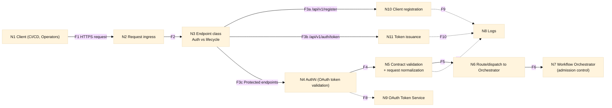
<!-- Diagram-4.1.3-01 -->
Diagram-4.1.3-01 High-level design blocks

- **New threads/processes** — Runs as part of control plane runtime; in baseline architecture, Facade runs as its own process(es) handling edge security.
- **Communication methods** — External: HTTPS; internal: invokes the Workflow Orchestrator via in-process calls (R1).
- **Shared data protection** — N/A at this design level. If shared caches/state are used, ensure concurrency-safe access.
- **Persistent new files/partitions** — N/A. Facade should not create persistent storage.
- **Debug logs in production** — Structured logs; must not log secrets or tokens.

#### 4.1.3.1 Control flow of Component API Facade

Each box, flow, and item is individually numbered.

<!-- Diagram-4.1.3.1-01 -->
```mermaid
%%{init: {'theme':'base','themeVariables': { 'fontFamily':'Arial', 'fontSize':'14px', 'primaryTextColor':'#111111', 'lineColor':'#111111' }}}%%
flowchart TD
    N1["N1 Client sends request"] -->|"F1"| N2["N2 Request ingress"]
    N2 -->|"F2"| N3["N3 Determine endpoint class"]

    N3 -->|"F3a /api/v1/register"| N4["N4 Client registration"]
    N4 -->|"F4"| N13["N13 Emit audit/telemetry event"]

    N3 -->|"F3b /api/v1/auth/token"| N5["N5 Token issuance"]
    N5 -->|"F5"| N13

    N3 -->|"F3c Protected endpoint"| N6["N6 Authenticate principal (OAuth token validation)"]
    N6 -->|"F6 AuthN failure"| N7["N7 Reject (401) + correlationId"]
    N6 -->|"F7"| N8["N8 Validate contract + normalize request (see Section **3.1.7**)]
    N8 -->|"F8 Invalid request"| N9["N9 Reject (4xx) with sanitized error"]
    N8 -->|"F9"| N10["N10 Normalize request<br/>- correlationId<br/>- principal claims<br/>- idempotency"]
    N10 -->|"F10"| N11["N11 Route to Workflow Orchestrator handler"]
    N11 -->|"F11"| N12["N12 Invoke orchestrator operation"]
    N12 -->|"F12 Downstream error"| N14["N14 Map error to stable API response"]
    N12 -->|"F13"| N15["N15 Return response to client"]
    N15 -->|"F14"| N13
```
<!-- Diagram-4.1.3.1-01 -->
Diagram-4.1.3.1-01 Control flow of Component API Facade

##### Sequence Diagram

<!-- Diagram-4.1.3.1-02 -->
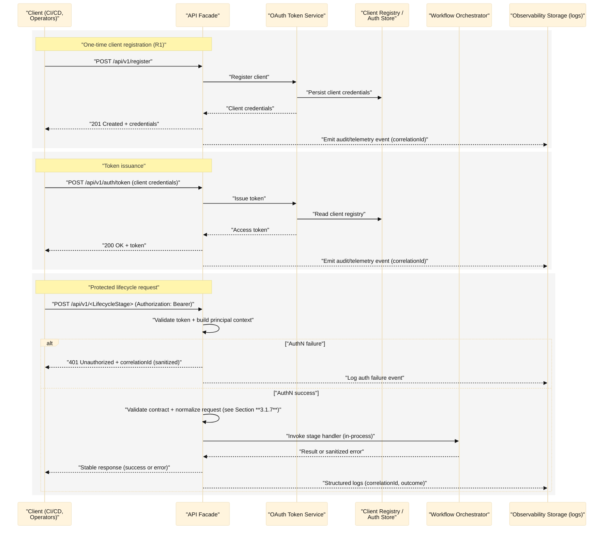
<!-- Diagram-4.1.3.1-02 -->
Diagram-4.1.3.1-02 Sequence Diagram

**Task model**

- **Multi-request concurrent service**.
- Concurrency model depends on runtime (async I/O and/or multi-worker).

#### 4.1.3.2 Data Flow Diagram for Component API Facade

This DFD focuses on the API Facade boundary and its immediate upstream/downstream flows (client onboarding, token validation, lifecycle request forwarding, and log emission).

<!-- Diagram-4.1.3.2-01 -->
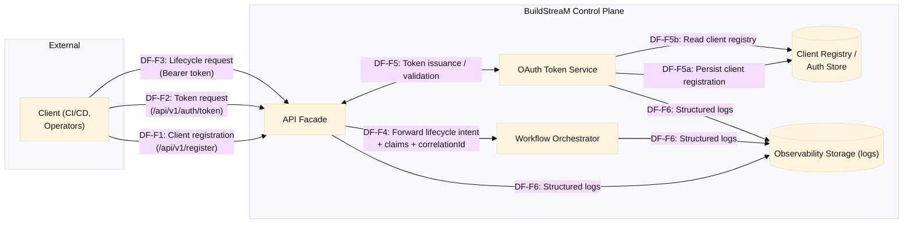
<!-- Diagram-4.1.3.2-01 -->
Diagram-4.1.3.2-01 Data Flow Diagram for Component API Facade

**Notes**

- The API Facade does not directly mutate workflow state or artifacts; lifecycle state transitions are owned by the Workflow Orchestrator.
- Token issuance and validation are represented as an interaction with the OAuth Token Service.
- Registered-client persistence is owned by the OAuth Token Service and is backed by a durable Client Registry/Auth Store within the BuildStreaM control plane trust boundary. The Facade does not store client credentials; it brokers onboarding requests and enforces boundary checks.

#### 4.1.3.3 Actor / Action Matrix

This matrix captures the primary actors and the externally observable actions that are mediated by the API Facade.

| Actions | Client (CI/CD, Operators) | OAuth Token Service | Workflow Orchestrator | Observability Storage (logs) |
|---|---|---|---|---|
| Submit one-time client registration request (`POST /api/v1/register`) | Allowed | Allowed | Not Allowed | Not Allowed |
| Request access token (`POST /api/v1/auth/token`) | Allowed | Allowed | Not Allowed | Not Allowed |
| Submit lifecycle stage request (Bearer token) | Allowed | Not Allowed | Allowed | Not Allowed |
| Query lifecycle status (Bearer token) | Allowed | Not Allowed | Allowed | Not Allowed |
| Emit structured logs (correlationId, outcome) | Not Allowed | Not Allowed | Not Allowed | Allowed |

Rationale: Domain modules are not directly reachable from the Facade; lifecycle requests are mediated via the Workflow Orchestrator.

#### 4.1.3.4 Component Threat Modeling

See the Architecture Threat Model in section 3.5. If the architecture threat modeling does not fully represent the data flow diagram for this component, a component-specific threat model export from the Microsoft Threat Modeling Tool must be linked here.

#### 4.1.3.5 Interfaces

**Provided Interfaces**

- External HTTPS endpoints defined in the API spec, including:
  - Client onboarding and token entry points (`POST /api/v1/register`, `POST /api/v1/auth/token`).
  - Lifecycle stage endpoints for workflow execution and status.

**Input validation mechanisms to prevent injection**

- Schema/contract validation
- Strict header allowlists
- Reject unknown fields where appropriate

**Return codes / error conditions**

- 4xx for request contract violations
- 5xx for downstream failures (sanitized)

**Consumed Interfaces**

- Workflow Orchestrator APIs (in-process)
- Observability/telemetry sink

### 4.1.4 Security Checklist for Component

| Topic | Summary (what the API Facade is responsible for) |
|---|---|
| Authentication boundary | Owns `/api/v1/register` (client onboarding) and `/api/v1/auth/token` (token issuance) and enforces OAuth bearer token validation for protected endpoints. |
| Input validation | Validates request shape/headers and rejects malformed/out-of-contract payloads before reaching orchestration. |
| Error sanitization | Provides a stable external error model; prevents leaking internal topology, stack traces, or sensitive metadata. |
| Sensitive data handling | Avoids logging secrets/tokens; redacts sensitive fields; maintains correlation IDs for auditability. |
| Abuse/overload protection | Admission control is enforced by the Orchestrator; the Facade does not implement traditional API rate limiting. |
| Verification | Covered through contract tests, negative tests, and end-to-end validation of critical endpoints. |

#### 4.1.4.1 Security Considerations and Test Plan

##### 4.1.4.1.1 Security Design Objectives

| SDL 7.3 control | Applicable? | Mitigations |
|---|---|---|
| Ensure Authorization and Access Controls | Applicable | Implemented as an auth middleware/policy gate: bearer token is validated (local JWT verification using token-service trust material and/or token introspection), claims are mapped into an internal principal context, and each request is checked against an allowlisted endpoint policy before forwarding; internal downstream calls originate only from authenticated service identities within the control-plane network. |
 | Apply least privilege | Applicable | Implemented by design separation and deployment constraints: Facade has no direct access to workflow state/artifact stores, runs as a stateless process, and is granted only the minimum network routes required (OAuth Token Service, Workflow Orchestrator, telemetry sink) with no additional platform privileges. |
 | Limit and Document Service Access | Applicable | Implemented as a single external ingress + explicit route registration: only documented endpoints are bound/exposed; maintain a versioned inventory of API resources/routes (OpenAPI contract) and ensure deployed routes match it; disable unused framework/service interfaces in production (e.g., interactive docs/admin routes if not required); all internal control-plane services are not reachable from outside the trusted network segment (enforced via firewall/ACLs), and the Facade does not provide generic proxying to arbitrary internal paths. |
 | Secure Defaults and Configuration | Applicable | Implemented via secure-by-default runtime posture: only HTTPS/TLS ingress is accepted (TLS terminated in the FastAPI/Uvicorn process), bounded request parsing (max request body 5 MB; header limit 16 KB; request read timeout 10s; overall request timeout 30s) with fail-closed validation; do not ship with default/shared credentials (installation-unique bootstrap and documented rotation guidance; see Section 3.1.7). |
| Secure handling of Errors, Logging and Auditing | Applicable | Implemented via centralized exception handling + structured JSON logging: stable external errors (no stack traces/topology), correlationId end-to-end, and security-relevant events (auth failures, policy denials, stage submits) written directly to the NFS mount path attached to the container. |
| Ensure Data protection and Privacy | Applicable | Implemented by minimizing sensitive data exposure: the Facade does not persist tokens/credentials, applies log-redaction filters for headers/body fields, and returns token-related responses with no-store caching semantics; sensitive payload fields are treated as opaque and forwarded only as required to the Orchestrator. |
| Secure File Upload | Applicable | Implemented via strict handling of catalog uploads (e.g., ParseCatalog): enforce content-type allowlists, bounded request sizes/timeouts, schema/contract validation, fail-closed parsing, and deterministic rejection of malformed payloads; avoid writing untrusted content to disk (or use restricted temp locations + server-generated names + cleanup); ensure uploads are logged safely without persisting sensitive content. |
| Ensure Proper Authentication | Applicable | Implemented as separate auth entry points + protected resource endpoints: onboarding/token endpoints are restricted by deployment policy (e.g., limited admin/client networks) and strict input validation; all lifecycle endpoints require a validated bearer token and fail closed when auth context is missing/invalid. |
 | Follow best practices for cryptography and security protocols | Applicable | Implemented with HTTPS-only and explicit TLS policy: TLS 1.2+ (prefer 1.3), disable TLS 1.0/1.1 and protocol fallback, and allow only strong cipher suites (no NULL/EXPORT/RC4/3DES); see Section 3.1.7. |
| Prepare for post-quantum cryptography | Reviewed N/A | The Facade does not implement custom cryptography. |
| Protect Hardware Debug Ports | Reviewed N/A |  |
| Secure Use of Artificial Intelligence | Reviewed N/A | The API Facade does not implement or invoke AI/ML features. |

###### Manual Security Unit Testing Plan

- Verify `/api/v1/register` and `/api/v1/auth/token` enforce expected request validation and do not leak secrets in responses.
- Verify bearer-token validation rejects expired/invalid tokens and produces sanitized errors.
- Verify lifecycle endpoints cannot be called without a valid token.
- Verify correlationId is generated/propagated consistently and is present in error responses.
 - Verify error mapping does not leak internal topology, stack traces, or sensitive metadata.
 - Verify request-size limits and content-type handling for endpoints that accept request bodies.
 - Verify ParseCatalog rejects oversize catalogs and malformed payloads deterministically (bounded parsing/timeouts) and does not write untrusted content to unrestricted locations.
 - Verify SlowAPI rate limits return 429 with `Retry-After` (and optional `X-RateLimit-*`) and use per-client keys derived from token/client credentials.

###### Automation Security Unit Testing Plan

- Automated negative tests for malformed payloads, header injection, and invalid content-types.
- Automated auth tests: missing token, expired token, invalid signature, wrong audience/issuer.
- Automated fuzz tests on request parsing for key endpoints (register/token/lifecycle).
 - Automated tests for correlationId/idempotency propagation (where applicable) under retries.
 - Automated regression tests for stable error codes/messages (sanitized) across failure modes.
 - Automated abuse tests for ParseCatalog catalog upload: oversize payloads (413/4xx), wrong content-type, invalid JSON/schema, and repeated submissions asserting stable errors and no resource exhaustion.
 - Automated tests asserting SlowAPI burst/sustained/quota limits are enforced per client_id and return deterministic 429 responses.

##### 4.1.4.1.2 Protect Sensitive Information

| SDL 7.3 control | Applicable? | Mitigations |
|---|---|---|
| Support and encourage manufactured-unique or installation-unique secrets | Applicable | Implemented by issuing unique client credentials per registered consumer: the registration flow returns a client-specific credential set and the Facade never provisions or accepts a shared default secret across installations/clients. |
| Support changeable secrets or rekey ability | Applicable | Implemented via OAuth Token Service ownership of the client registry: credential rotation/replacement is performed by updating/reissuing credentials in the registry; the Facade remains stateless and immediately honors updated/rotated credentials without local migration steps. |
| Store secrets securely | Applicable | Implemented by strict separation of responsibilities: the Facade does not store client secrets or tokens at rest; registered-client secrets are persisted only in the OAuth Token Service’s Client Registry/Auth Store, and in the Facade they exist only as request-scoped values during validation/forwarding. |
| Do not display secrets in plaintext | Applicable | Implemented via response schemas + logging policy: only designated token/registration responses include credential material, error responses are sanitized, and logging middleware redacts/omits authorization headers and other sensitive fields by default before shipping to the observability sink. |
| Transmit secrets securely | Applicable | Implemented by requiring TLS on all hops where secrets/tokens traverse (client→Facade, Facade→OAuth Token Service, Facade→Orchestrator where applicable) and disabling plaintext listeners; internal service-to-service links may be additionally protected by platform network segmentation. |
| Protect against brute force attacks | Applicable | Implemented by concentrating brute-force defenses at the auth boundary: ingress and/or token service applies request throttling/backoff on token/registration endpoints, repeated failures are logged as auditable security events, and the Facade enforces bounded parsing/timeouts to reduce abuse impact. |

###### Manual Security Unit Testing Plan

- Verify `Authorization` headers, access tokens, and client secrets are never present in Facade logs (success and failure paths).
- Verify registration/token error responses do not echo secrets/tokens and remain sanitized.
- Verify token/credential material is not present in error responses and is not echoed in error responses.
- Verify sensitive request fields are redacted/omitted in observability events.
- Verify repeated auth failures are observable as security events (without leaking credential material).

###### Automation Security Unit Testing Plan

- Automated tests that inject `Authorization`/secret-like fields and assert structured logs/telemetry contain redacted values.
- Automated regression tests asserting error payloads never include token/secret fields even when downstream fails.
- Automated contract tests for token/registration responses asserting cache-control behavior and absence of sensitive echoes.
- Automated tests for log/telemetry redaction (no tokens/secrets) and correlationId presence.
- Automated fuzz tests for request parsing on key endpoints asserting stable 4xx (no crashes/5xx).

##### 4.1.4.1.3 Secure Web Interfaces

| SDL 7.3 control | Applicable? | Mitigations |
|---|---|---|
| Prevent Cross-site scripting | Reviewed N/A |  |
| Prevent HTTP splitting and smuggling | Applicable | Strict header parsing; reject malformed requests; restrict hop-by-hop header forwarding; rely on hardened server/proxy defaults. |
| Prevent Cross-site request forgery | Reviewed N/A |  |
| Prevent Clickjacking | Reviewed N/A |  |
| Prevent Open Redirects | Reviewed N/A |  |
 | Secure Headers or HTTP Security Headers | Applicable | Set `Strict-Transport-Security: max-age=31536000; includeSubDomains`; explicit content-type handling; cache-control/no-store where needed (e.g., token flows); restrictive CORS only if required; allowlist forwarded headers. |
| Secure Container and Orchestration Solutions | Reviewed N/A |  |
| Session Management | Reviewed N/A |  |

###### Manual Security Unit Testing Plan

- Verify the Facade rejects malformed/ambiguous HTTP requests (duplicate `Content-Length`, invalid `Transfer-Encoding`, header folding anomalies).
- Verify hop-by-hop headers are not forwarded downstream and only an allowlisted header set is propagated.
 - Verify default response headers match the API posture (content-type correctness, no-store for token-like responses, no unintended redirects).
 - Verify browser-accessible API responses include `Strict-Transport-Security: max-age=31536000; includeSubDomains` and never redirect to HTTP.
 - Verify timeouts and maximum payload sizes behave as designed (fast 4xx/413 rather than resource exhaustion).

###### Automation Security Unit Testing Plan

- Automated header-smuggling test cases (CL/TE variants) asserting deterministic 4xx rejection.
- Automated tests validating request/response header allowlists (no unapproved headers forwarded to Orchestrator).
 - Automated tests asserting cache-control/no-store for sensitive endpoints and stable content-type on all responses.
 - Automated negative tests for oversize payloads/timeouts to ensure bounded parsing and stable error codes.

##### 4.1.4.1.4 Prevent Injection

| SDL 7.3 control | Applicable? | Mitigations |
|---|---|---|
| Prevent path traversal | Applicable | Implemented by design: the Facade does not accept arbitrary file paths; any temporary file creation uses server-generated names in a restricted directory; any path-like inputs (if present) are canonicalized/validated and never used to access files outside the allowed sandbox. |
| Do not mix code and unvalidated data | Applicable | Implemented via strict request parsing + typed contracts (schema validation) and allowlisted transformations only; downstream routing targets are fixed (no dynamic URL/command construction from user input); logs use structured fields with redaction rather than string concatenation of raw input. |
| Prevent OS command injection | Reviewed N/A |  |
| Enable memory protection mechanisms | Reviewed N/A |  |
| Perform input validation | Applicable | Implemented by request models + validation middleware: schema/contract validation for body/query/path, strict header allowlists, bounded parsing (size/timeouts), and fail-closed handling for unknown/extra fields where appropriate before calling Orchestrator. |
| Prevent Insecure Deserialization | Applicable | Implemented by restricting accepted content types to safe formats (JSON; YAML only if explicitly required and only via safe loader) and using safe parsers; explicitly forbids unsafe serialization mechanisms (e.g., pickle/native object graphs); validates payloads into typed models before any downstream use; enforce strict bounds (size/depth) and reject malformed payloads deterministically; see Section 3.1.7. |
| Address Power and Clock Concerns | Reviewed N/A |  |

###### Manual Security Unit Testing Plan

- Verify path traversal strings (e.g., `../`, `%2e%2e%2f`) in any identifier-like fields are rejected and do not influence file access.
- Verify uploaded content (if supported) is stored only under the controlled temp location, with server-generated names, and is always cleaned up.
- Verify invalid/malformed JSON and unknown fields are rejected as 4xx before any downstream call.
- Verify non-JSON / unsafe serialization formats are rejected (content-type enforcement) and do not reach internal processing.
- Verify logs remain structured and do not embed raw unvalidated input in a way that could be interpreted downstream.

###### Automation Security Unit Testing Plan

- Automated property-based tests generating traversal payloads across path/query/body fields asserting deterministic 4xx and no filesystem interaction.
- Automated fuzzing of JSON bodies and headers for key endpoints asserting stable 4xx (no crashes/5xx).
- Automated tests enforcing content-type and deserialization constraints (reject non-JSON and unsafe formats).
- Automated contract tests asserting strict schema validation and unknown-field handling across endpoints.

#### 4.1.4.2 Resource Utilization and Scalability

- Scales horizontally with stateless instances.
- Resource drivers: request parsing, routing, downstream latency.

#### 4.1.4.3 Open Source

Open-source dependencies used by the API Facade implementation (versions pinned in the build/dependency manifest):

- FastAPI (external HTTP API framework)
- Uvicorn (ASGI server)
- Pydantic (request/response validation)
- HTTP client library for internal calls (e.g., HTTPX/Requests)
- JWT/OAuth helper library (e.g., Python JOSE / PyJWT)
- Cryptography (TLS/JWT crypto primitives used by dependencies)

#### 4.1.4.4 Component Test

- Unit tests for routing, request contract validation, and policy gates (auth/header allowlists).
- Unit tests for error mapping (sanitized external contract) and correlationId generation/propagation.
- Unit tests for sensitive-data handling (redaction and no-secret logging) and content-type enforcement.
- Integration tests with Workflow Orchestrator (success/failure/timeout) validating stable external outcomes.
- Integration tests with OAuth Token Service for onboarding/token flows and auth failure handling.
- Integration tests for observability event emission (security-relevant events + correlation).

##### Manual Unit Testing Plan

- Validate critical endpoints end-to-end in staging (register, token, lifecycle, status).
- Validate auth boundary behavior (missing/expired/invalid token) returns sanitized 4xx and does not call Orchestrator.
- Validate correlationId is returned and consistently propagated to downstream calls and logs.
- Validate schema validation and header allowlists reject malformed/out-of-contract requests with stable 4xx.
- Validate token/credential material is not present in logs and is not echoed in error responses.

##### Automation Unit Testing Plan

- Automated API contract tests for all endpoints (request/response schema + stable error model).
- Automated negative tests for auth boundary (missing token, invalid token, wrong audience/issuer) asserting fail-closed behavior.
- Automated tests for header allowlists/hop-by-hop header stripping and deterministic rejection of malformed requests.
- Automated tests for log/telemetry redaction (no tokens/secrets) and correlationId presence.
- Automated fuzz tests for request parsing on key endpoints asserting stable 4xx (no crashes/5xx).

#### 4.1.4.5 Module API Sharing within Dell ISG Organizations

N/A. Rationale: The Facade is a product-specific integration layer.

#### 4.1.4.6 New API Conformance within Dell ISG Organizations

N/A. Rationale: API conformance applies to the external API; the internal facade contract is governed by the product architecture.

#### 4.1.4.7 Unresolved Issues

- Microsoft Threat Modeling Tool export link is pending.

---

## 4.2 Design Component Workflow Orchestrator

This is the first order drill down into the solution architecture for the **Workflow Orchestrator**.

### 4.2.1 Component Workflow Orchestrator Description / Purpose

The **Workflow Orchestrator** coordinates BuildStreaM workflows across stages (ParseCatalog → GenerateInputFiles → PrepareRepos → BuildImage → ValidateImage → ValidateImageOnTest → Promote) with **stage guards**, **idempotency**, **admission control**, and **async task management**. In R1, `Promote` is invoked internally by the control plane after successful validation and is not initiated by external clients.

**Primary responsibilities**

- Stage orchestration and state transitions
- Admission control: Enforce concurrency caps and resource limits (see Rate Limiting Decision in Section 3)
- Guard conditions and approvals (as required by policy)
- Idempotency handling and deduplication of retries
- Async task lifecycle management (dispatch/run, retry, cancel)
- Error handling and failure state normalization


**Admission Control Configuration**
| Parameter | Default | Description |
|-----------|---------|-------------|
| `max_concurrent_builds` | 1 | Maximum concurrent build jobs |
| `max_parallel_validations` | 1 | Maximum parallel validation tasks |
| `max_active_deploys_per_env` | 1 | Only 1 active deploy per environment |
| <span style="color:#dc2626"><b>[NOT R1]</b></span> `promotion_requires_stage_completion` | true | Promotion requires previous stage completion |

**How it relates to the overall design**

- Receives high-level lifecycle intents via the API Facade.
- Invokes core modules to perform domain work.
- Emits state changes and telemetry for observability and audit.

### 4.2.2 Component Workflow Orchestrator Design Constraints and Assumptions

#### 4.2.2.1 Constraints

- Must provide stable workflow semantics under retries and partial failures.
- Must ensure stage transitions are auditable and correlated.
- Must avoid running privileged actions without explicit authorization/approval gates.
- Must canonicalize filesystem paths and enforce base-directory confinement for any filesystem operations during stages (see Section **3.1.7**).

#### 4.2.2.2 Assumptions

- Requests arrive with a correlation identifier and an authenticated principal context from the API Facade.
- A metadata store exists for workflow state persistence (component documented separately).

### 4.2.3 Component Workflow Orchestrator Design

#### High-level design blocks

<!-- Diagram-4.2.3-01 -->
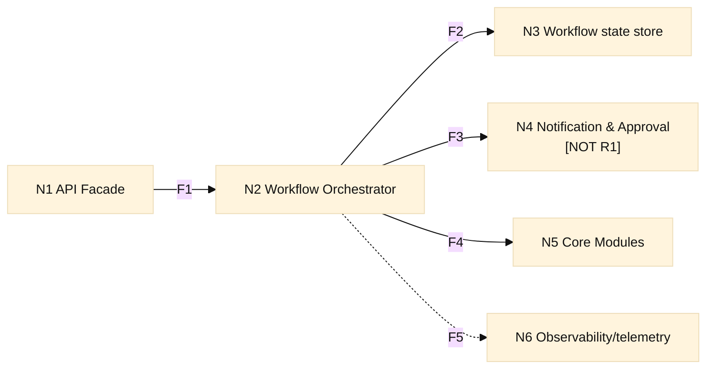
<!-- Diagram-4.2.3-01 -->
Diagram-4.2.3-01 High-level design blocks

- **New threads/processes** — Orchestrator may maintain background workers for async tasks (implementation dependent).
- **Communication methods** — Called by API Facade (in-process in R1); invokes core modules and interacts with the metadata store.
- **Shared data protection** — Must protect workflow state updates with concurrency-safe operations (optimistic locking or transactional updates).
- **Persistent new files/partitions** — N/A. Persistent workflow state lives in the metadata store.
- **Debug logs in production** — Structured logs with correlation IDs; no secrets.

#### 4.2.3.1 Control flow of Component Workflow Orchestrator

Each box, flow, and item is individually numbered.

<!-- Diagram-4.2.3.1-01 -->
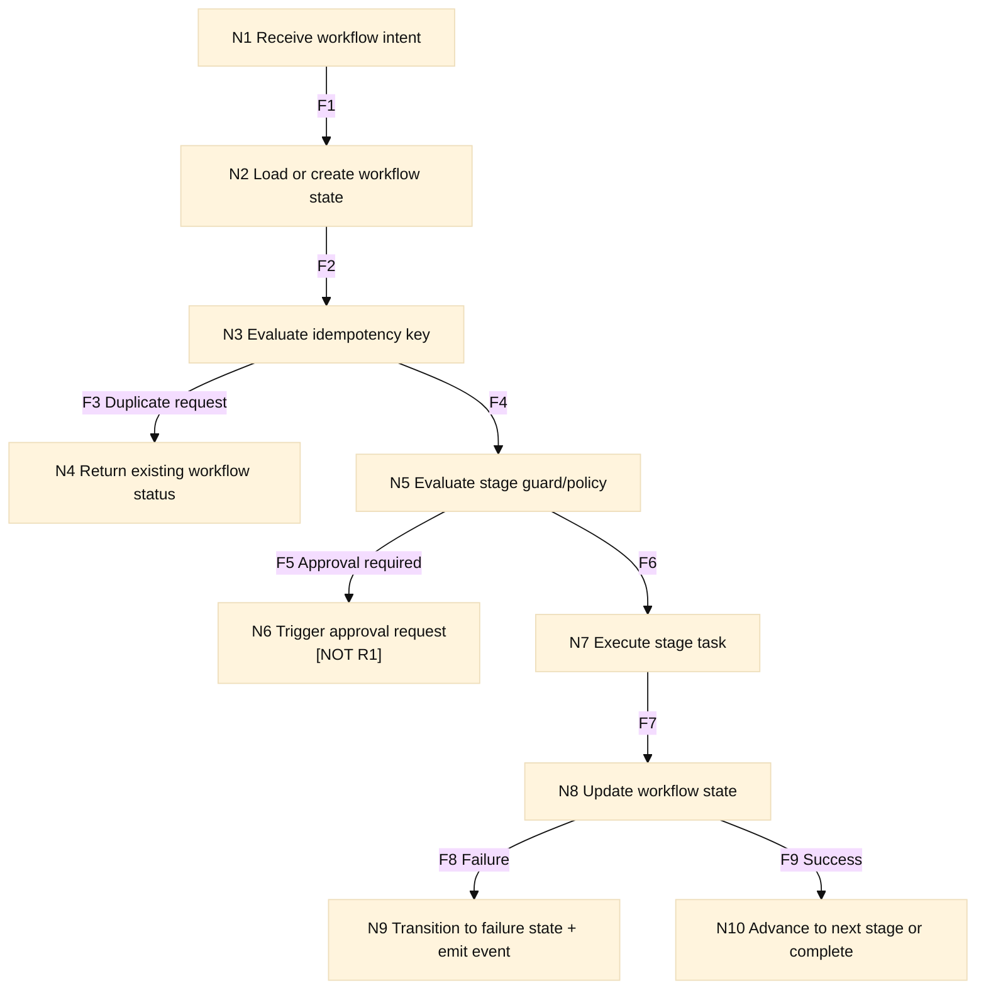
<!-- Diagram-4.2.3.1-01 -->
Diagram-4.2.3.1-01 Control flow of Component Workflow Orchestrator

**API Facade and Workflow Orchestrator Interaction**

<!-- Diagram-4.2.3.1-02 -->
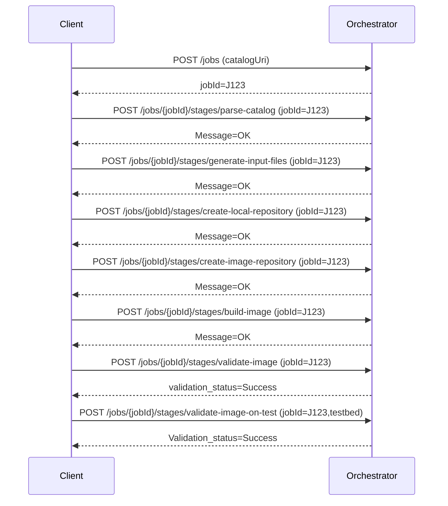
<!-- Diagram-4.2.3.1-02 -->
Diagram-4.2.3.1-02 Control flow of Component Workflow Orchestrator

##### Sequence Diagram

<!-- Diagram-4.2.3.1-03 -->
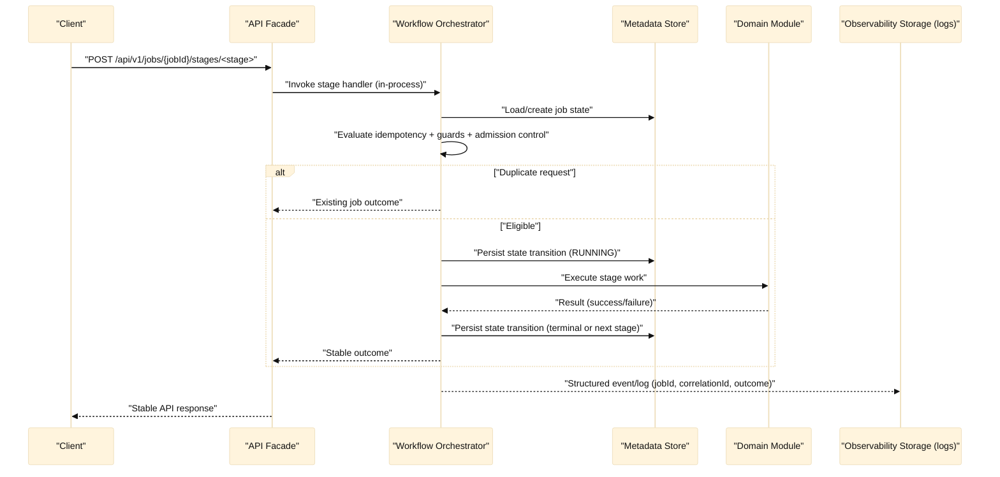
<!-- Diagram-4.2.3.1-03 -->
Diagram-4.2.3.1-03 Sequence Diagram

**Task model**

- The Orchestrator executes as a **multi-request control-plane component**.
- Long-running stage work may be mediated through internal workers; admission control bounds parallelism per stage and/or workflow.

#### 4.2.3.2 Workflow Model & Job Lifecycle

##### 4.2.3.2.1 Job Concept and Ownership

A **Job** is the unit of work representing a complete BuildStreaM workflow execution. Each job encompasses the full lifecycle from catalog parsing through deployment.

| Attribute | Description |
|-----------|-------------|
| `jobId` | Unique identifier (UUID); serves as correlation ID across all stages, logs, and events |
| `catalogRef` | Reference to the catalog version being processed |
| `initiator` | Principal identity that created the job |
| `createdAt` | Timestamp of job creation |
| `currentStage` | Current stage in the workflow |
| `state` | Overall job state |

**Ownership**: Single client/automation initiates and owns the job. No multi-user handoff in baseline.

##### 4.2.3.2.2 Stage Model and Execution States

Jobs progress through a sequence of **stages**, each with its own execution state.

**Stage Sequence**

```
ParseCatalog → GenerateInputFiles → PrepareRepos → BuildImage → ValidateImage → ValidateImageOnTest → Promote
```

In R1, `Promote` is invoked internally by the control plane after successful validation and is not initiated by external clients.

**Stage Execution States**

<!-- Diagram-4.2.3.2.2-01 -->
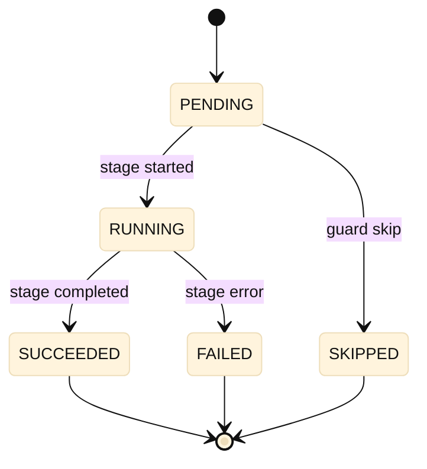
<!-- Diagram-4.2.3.2.2-01 -->
Diagram-4.2.3.2.2-01 Stage Model and Execution States

| State | Description |
|-------|-------------|
| `PENDING` | Stage not yet started; awaiting preconditions |
| `RUNNING` | Stage execution in progress |
| `SUCCEEDED` | Stage completed successfully |
| `FAILED` | Stage failed; job may terminate or allow retry |
| `SKIPPED` | Stage skipped due to policy or guard condition |

##### 4.2.3.2.3 Lifecycle State Transitions

**Job Lifecycle States**

<!-- Diagram-4.2.3.2.3-01 -->
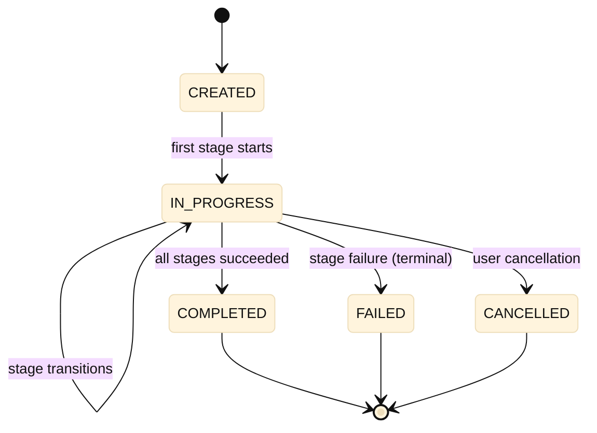
<!-- Diagram-4.2.3.2.3-01 -->
Diagram-4.2.3.2.3-01 Lifecycle State Transitions

| State | Description |
|-------|-------------|
| `CREATED` | Job created; no stages executed yet |
| `IN_PROGRESS` | One or more stages executing or completed |
| `COMPLETED` | All stages succeeded; terminal state |
| `FAILED` | A stage failed; terminal state (unless resume enabled) |
| `CANCELLED` | Job cancelled by user; terminal state |

**Invariants**
- State transitions are **atomic** and **auditable**
- Terminal states (`COMPLETED`, `FAILED`, `CANCELLED`) are **immutable**
- Each transition emits an audit event with `jobId`, timestamp, and actor

##### 4.2.3.2.4 Stage Guards and Precondition Enforcement

Each stage can have **guards** (preconditions) that must pass before execution begins.

| Guard Type | Description | Example |
|------------|-------------|---------|
| **Validation gate** | Previous stage must succeed | BUILD requires VALIDATE.SUCCEEDED |
| **Approval gate** | Explicit approval required | DEPLOY requires manual approval |
| **Policy gate** | Policy condition must be satisfied | `promotion_requires_stage_completion` |
| **Resource gate** | Resource availability check | Admission control limits |

**Guard Evaluation Flow**

<!-- Diagram-4.2.3.2.4-01 -->
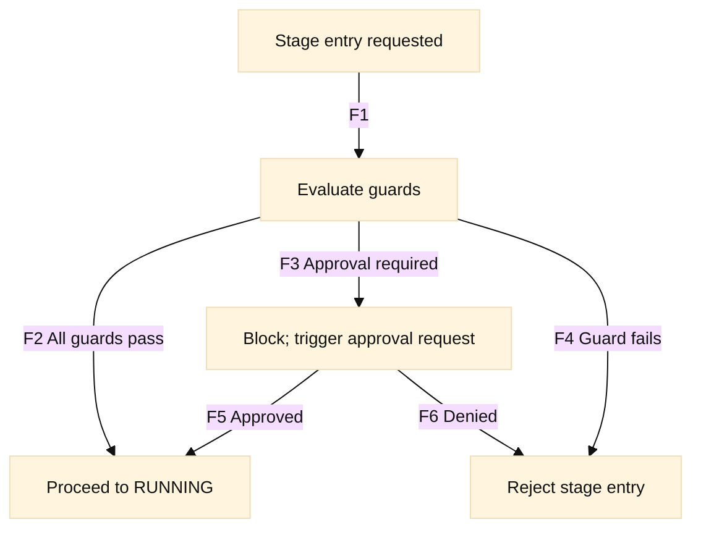
<!-- Diagram-4.2.3.2.4-01 -->
Diagram-4.2.3.2.4-01 Stage Guards and Precondition Enforcement

##### 4.2.3.2.5 Job Identity, Idempotency, and Correlation

| Concept | Implementation |
|---------|----------------|
| **Job Identity** | `jobId` (UUID) uniquely identifies the job across the system |
| **Correlation** | All logs, events, and downstream calls carry `jobId` for end-to-end traceability |
| **Idempotency Key** | Client-provided key prevents duplicate job creation from retried requests |

**Idempotency Behavior**
- If a request arrives with an idempotency key matching an existing job, return the existing job status
- Idempotency keys are scoped to the initiator principal
- Keys expire after a configurable TTL (default: 24 hours)

##### 4.2.3.2.6 Failure, Retry, and Resume Semantics

| Scenario | Behavior |
|----------|----------|
| **Stage Failure** | Stage transitions to `FAILED`; job transitions to `FAILED` (terminal) |
| **Transient Failure** | Orchestrator may auto-retry within stage (bounded retries, exponential backoff) |
| **Retry (explicit)** | Client can request retry of a failed job; restarts from failed stage if idempotent |
| **Resume** | Jobs can be resumed from last successful stage (if policy allows) |

**Retry/Resume Flow**

<!-- Diagram-4.2.3.2.6-01 -->
```mermaid
%%{init: {'theme':'base','themeVariables': { 'fontFamily':'Arial', 'fontSize':'14px', 'primaryTextColor':'#111111', 'lineColor':'#111111' }}}%%
flowchart TD
    N1["Job in FAILED state"] -->|"F1 Retry request"| N2["Check retry policy"]
    N2 -->|"F2 Retry allowed"| N3["Reset failed stage to PENDING"]
    N2 -->|"F3 Retry not allowed"| N4["Reject retry"]
    N3 -->|"F4"| N5["Re-evaluate guards"]
    N5 -->|"F5"| N6["Resume execution"]
```
<!-- Diagram-4.2.3.2.6-01 -->
Diagram-4.2.3.2.6-01 Failure, Retry, and Resume Semantics

**Failure Preservation**
- Partial results from successful stages are preserved
- Failure metadata (error details, logs) is persisted for diagnostics
- Failed jobs remain queryable for audit purposes

##### 4.2.3.2.7 Workflow State Persistence Strategy (Baseline)

The Workflow Orchestrator persists job and stage state via the **Metadata Store** (through a `MetadataStore` interface). The baseline persistence strategy is designed to support **auditable transitions**, **idempotency**, and **concurrency-safe updates**.

**Persisted state (HLD-level)**

- **Job record**: `jobId`, initiator identity context, `createdAt`, current job lifecycle state (`CREATED`, `IN_PROGRESS`, terminal), current stage, and timestamps.
- **Stage outcome record(s)**: stage name, stage execution state (`PENDING`, `RUNNING`, terminal), normalized outcome, and sanitized error metadata suitable for diagnostics.
- **Idempotency mapping**: idempotency key + initiator context mapped to `jobId`, enabling deterministic deduplication across retries.
- **Auditability**: transitions are recorded in a form that supports audit queries (e.g., transition log entries or equivalent auditable history maintained by the store).

**Consistency and concurrency (baseline)**

- **Atomic transitions**: state transitions are persisted as atomic updates (read-check-write) so a stage cannot be observed as `RUNNING` without the corresponding persisted transition.
- **Single-writer per job**: concurrent requests targeting the same `jobId` are serialized logically through concurrency-safe persistence (optimistic versioning or transactional updates).
- **Fail-closed on conflicts**: if a conflicting update is detected, the Orchestrator does not advance the workflow and instead returns a stable conflict outcome to the API Facade.

##### 4.2.3.2.8 Task Execution / Worker Runtime Model (Baseline)

The Workflow Orchestrator uses a consumed **Task Execution / Worker Runtime** interface to execute long-running stage work while enforcing admission control and guarding state transitions.

**R1 baseline (in-process)**

- **In-process execution**: stage work is executed under the Orchestrator process boundary (e.g., via an internal worker pool), invoked only after guards and admission control pass.
- **Bounded concurrency**: the Orchestrator enforces configured concurrency caps and rejects/defers work rather than accepting unbounded in-flight execution.
- **Deterministic outcomes**: stage start/completion are reflected in persisted workflow state, and module errors are normalized into stable workflow outcomes.

**Future evolution (broker-backed workers)**

- When higher durability or horizontal scale is required, the Task Execution / Worker Runtime interface can be implemented using a broker-backed worker model.
- The Orchestrator remains the system-of-record for workflow state and continues to apply the same guard/admission/idempotency rules before dispatching work.

#### 4.2.3.3 Data Flow Diagram for Component Workflow Orchestrator

This component’s primary data flows are captured at the architecture level in **3.3.3 High-level data flows**.

#### 4.2.3.4 Actor / Action Matrix

This matrix captures the internal actors and the orchestration actions that the Orchestrator owns.

| Actions | API Facade | Workflow Orchestrator | Domain Modules | Metadata Store | Observability Storage (logs) |
|---|---|---|---|---|---|
| Submit workflow intent (stage request) | Allowed | Allowed | Not Allowed | Not Allowed | Not Allowed |
| Query workflow status | Allowed | Allowed | Not Allowed | Not Allowed | Not Allowed |
| Enforce guards/admission control and advance workflow state | Not Allowed | Allowed | Not Allowed | Not Allowed | Not Allowed |
| Execute domain stage work | Not Allowed | Not Allowed | Allowed | Not Allowed | Not Allowed |
| Persist job/stage state | Not Allowed | Allowed | Not Allowed | Allowed | Not Allowed |
| Emit structured logs/events (jobId, correlationId, outcome) | Not Allowed | Allowed | Allowed | Not Allowed | Allowed |

#### 4.2.3.5 Component Threat Modeling

See the Architecture Threat Model in section 3.5.

#### 4.2.3.6 Interfaces

**Provided Interfaces**

- The Workflow Orchestrator exposes an internal (in-process in R1) orchestration interface that is invoked only by the API Facade.

| Orchestrator operation (invoked by API Facade) | Primary purpose |
|---|---|
| Submit stage request: `ParseCatalog` | Create a new job (or return existing job outcome under idempotency) and begin workflow execution. |
| Submit stage request: `GenerateInputFiles` | Advance an existing job to input-generation when guards/policy allow. |
| Submit stage request: `CreateLocalRepo` | Create required local repository state for the job when guards/policy allow. |
| Submit stage request: `UpdateLocalRepo` | Update required local repository state for the job when guards/policy allow. |
| Submit stage request: `CreateImageRepo` | Create/ensure the image repository destination for build artifacts when guards/policy allow. |
| Submit stage request: `BuildImage` | Advance an existing job to image build execution when guards/policy allow. |
| Submit stage request: `ValidateImage` | Advance an existing job to static validation when guards/policy allow. |
| Submit stage request: `ValidateImageOnTest` | Advance an existing job to testbed validation when guards/policy allow. |
| Query job status (by `jobId`) | Provide the current workflow state and per-stage outcomes for polling and auditability. |
| Cancel job (by `jobId`) | Best-effort cancellation that transitions the job to a terminal cancelled outcome when permitted. |

Note: In R1, `Promote` is an internal transition performed by the control plane and is not invoked as a client-initiated operation.

**Input validation mechanisms to prevent injection**

- Validate workflow identifiers, stage names, and requested transitions against allowlists and the current workflow state.
- Validate request shape against the expected contract before invoking any domain module.
- Fail closed on unknown/unsupported stage intents to prevent unintended module invocation.

**Return codes / error conditions**

- 4xx for invalid workflow requests
- 409 for state conflicts (if exposed)
- 5xx for internal failures (sanitized)

**Consumed Interfaces**

| Downstream interface | Used for |
|---|---|
| Metadata Store | Load/create job state; persist state transitions; idempotency deduplication; record stage outcomes and audit-relevant fields. |
| Task Execution / Worker Runtime | Dispatch and manage long-running stage work under Orchestrator control; supports in-process execution in R1 and a broker-backed worker model when durability/horizontal scale is introduced. |
| Catalog Manager | Stage execution for `ParseCatalog` and `GenerateInputFiles`. |
| Build Module | Stage execution for `CreateLocalRepo`, `UpdateLocalRepo`, `CreateImageRepo`, and `BuildImage`. |
| Validate Module | Stage execution for `ValidateImage` and `ValidateImageOnTest`. |
| Observability Storage (logs) / Telemetry sinks | Emit structured logs and audit/telemetry events (jobId, correlationId, stage, outcome). |
| <span style="color:#dc2626"><b>[NOT R1]</b></span> Notification & Approval Module | Approval-gated transitions and notification routing. |
| <span style="color:#dc2626"><b>[NOT R1]</b></span> Release Module | Promotion/release handling when external release semantics are introduced. |

### 4.2.4 Security Checklist for Component

| Topic | Summary (what the Workflow Orchestrator is responsible for) |
|---|---|
| Authentication boundary | Not an external authentication boundary; invoked by the API Facade. Validates that an authenticated principal context is present on incoming requests and rejects requests that lack required identity/correlation context. |
| Authorization / policy | Enforces stage gating, guard conditions, and admission control. Ensures only allowed transitions execute for the caller and current workflow state. |
| Input validation | Validates `jobId`, stage requests, and transition eligibility; fail-closed on unknown/unsupported stage intents. |
| Error sanitization | Normalizes module errors into stable workflow outcomes; avoids leaking internal topology/stack traces; returns deterministic outcomes for the API Facade to map into the external contract. |
| Sensitive data handling | Avoids persisting or logging secrets/tokens; ensures structured logging with redaction; propagates correlationId/jobId for auditability. |
| Abuse/overload protection | Owns admission control and limits in-flight work; prevents duplicate work via idempotency semantics. |
| Verification | Covered through state-machine invariant tests, concurrency tests, negative tests for guard/policy enforcement, and end-to-end workflow regression testing. |

#### 4.2.4.1 Security Considerations and Test Plan

##### 4.2.4.1.1 Security Design Objectives

| SDL 7.3 control | Applicable? | Mitigations |
|---|---|---|
| Apply least privilege | Applicable | Implemented through component boundaries: the Orchestrator holds only workflow-control responsibilities; it invokes modules through internal interfaces and persists state via the metadata store, without direct access to external ingress or token issuance capabilities. |
| Ensure Authorization and Access Controls | Applicable | Implemented as orchestrator-owned guard enforcement: stage requests are evaluated against stage order, policy gates, and the authenticated principal context provided by the API Facade; disallowed transitions are rejected before any module invocation. |
| Ensure Data protection and Privacy | Applicable | Implemented by minimizing sensitive material in persisted workflow context and ensuring any payload fields deemed sensitive are redacted from logs and telemetry before emission. |
| Ensure Proper Authentication | Applicable | Implemented by requiring an authenticated principal context from the API Facade; requests that lack required identity/correlation context are rejected and do not progress workflow state. |
| Follow best practices for cryptography and security protocols | Reviewed N/A | Transport security and crypto protocol configuration are owned by the API Facade/ingress and platform libraries; the Orchestrator does not implement or configure bespoke cryptography. |
 | Limit and Document Service Access | Applicable | Implemented by a single internal entry path: the Orchestrator is invoked only by the API Facade (in-process in R1) and is not directly reachable as an external service; document the internal invocation interface and the service identities permitted to trigger workflow intents; disable any maintenance/debug interfaces not required in production (see Section 3.1.7). |
| Prepare for post-quantum cryptography | Reviewed N/A | The Orchestrator does not implement custom cryptography. |
| Protect Hardware Debug Ports | Reviewed N/A |  |
 | Secure Defaults and Configuration | Applicable | Implemented via fail-closed execution: unknown stages/transitions are rejected; stage execution is permitted only when explicit guards pass; default behavior is to deny out-of-order or policy-violating transitions. |
| Secure File Upload | Reviewed N/A | The Orchestrator does not accept file uploads; catalog upload handling is enforced at the API Facade boundary and only validated/normalized data reaches the Orchestrator. |
| Secure handling of Errors, Logging and Auditing | Applicable | Implemented via normalized state transitions and structured audit/telemetry events: jobId/correlationId are recorded with stage outcomes; errors are mapped into stable, sanitized outcomes without stack traces. |
| Secure Use of Artificial Intelligence | Reviewed N/A | The Orchestrator does not implement or invoke AI/ML features in the baseline architecture. |

###### Manual Security Unit Testing Plan

- Validate that stage requests without authenticated principal context are rejected and do not mutate workflow state.
- Validate stage gating (out-of-order stage submissions) returns deterministic precondition failures.
- Validate guard/policy failures reject execution before invoking any downstream module.
- Validate idempotency behavior under retries returns stable outcomes and prevents duplicate work.
- Validate correlationId/jobId is present in logs/events for success and failure paths.
- Validate error normalization does not leak internal module errors/stack traces to the API Facade.

###### Automation Security Unit Testing Plan

- Automated negative tests for out-of-order stage submissions asserting fail-closed behavior.
- Automated tests for idempotency under retries and replay (same request returns same outcome).
- Automated concurrency tests asserting state-transition invariants under parallel requests.
- Automated tests asserting stable error normalization across representative downstream failures.
- Automated tests for correlationId/jobId propagation into logs/telemetry events.

##### 4.2.4.1.2 Protect Sensitive Information

| SDL 7.3 control | Applicable? | Mitigations |
|---|---|---|
| Do not display secrets in plaintext | Applicable | Implemented through logging and error policies: structured logging is used with redaction/omission rules for sensitive fields; error normalization does not echo sensitive request material. |
| Protect against brute force attacks | Reviewed N/A | Brute-force protection is owned at the external auth boundary (API Facade / OAuth Token Service); the Orchestrator is not directly exposed to unauthenticated clients. |
| Store secrets securely | Applicable | Implemented via responsibility separation: the Orchestrator does not store credentials/tokens as part of workflow state; any required service secrets are sourced from the platform secrets mechanism rather than persisted in workflow records. |
| Support and encourage manufactured-unique or installation-unique secrets | Reviewed N/A | The Orchestrator does not issue secrets; unique credentials/tokens are handled by the API Facade / OAuth Token Service and platform secret mechanisms. |
| Support changeable secrets or rekey ability | Reviewed N/A | Secret rotation/rekey is handled by the platform secrets mechanism and OAuth Token Service; the Orchestrator remains stateless with respect to secrets and does not persist secret material in workflow state. |
| Transmit secrets securely | Applicable | Implemented by limiting secret material propagation: the Orchestrator does not forward bearer tokens; it uses internal principal context and service identities for downstream calls within the control-plane trust boundary. |

###### Manual Security Unit Testing Plan

- Verify secret-like fields (tokens, credentials) are not written to metadata store records.
- Verify logs and telemetry never include secrets/tokens even on failure paths.
- Verify sanitized errors do not echo sensitive payload fields.
- Verify correlation fields are present without including sensitive data.

###### Automation Security Unit Testing Plan

- Automated tests that inject secret-like fields into requests and assert stored state/logs are redacted.
- Automated regression tests asserting error payloads never include token/secret fields.
- Automated tests asserting only identity/claims context (not raw tokens) is propagated to modules.

##### 4.2.4.1.3 Secure Web Interfaces

| SDL 7.3 control | Applicable? | Mitigations |
|---|---|---|
| Prevent Cross-site scripting | Reviewed N/A |  |
| Prevent HTTP splitting and smuggling | Reviewed N/A |  |
| Prevent Cross-site request forgery | Reviewed N/A |  |
| Prevent Clickjacking | Reviewed N/A |  |
| Prevent Open Redirects | Reviewed N/A |  |
| Secure Headers or HTTP Security Headers | Reviewed N/A |  |
| Secure Container and Orchestration Solutions | Reviewed N/A |  |
| Session Management | Reviewed N/A |  |

###### Manual Security Unit Testing Plan

- Validate the Orchestrator is not directly reachable externally and is invoked only via the API Facade boundary.

###### Automation Security Unit Testing Plan

- N/A.

##### 4.2.4.1.4 Prevent Injection

| SDL 7.3 control | Applicable? | Mitigations |
|---|---|---|
| Address Power and Clock Concerns | Reviewed N/A |  |
| Do not mix code and unvalidated data | Applicable | Implemented via deterministic routing and allowlisted stage intents: stage names and transitions are treated as allowlisted identifiers and are never used to dynamically construct code paths or execution targets. |
| Enable memory protection mechanisms | Reviewed N/A |  |
| Perform input validation | Applicable | Implemented by validating `jobId`, stage requests, and state transition eligibility before any module invocation; unknown stages and invalid transitions are rejected (fail-closed). |
| Prevent Insecure Deserialization | Applicable | Implemented by restricting accepted request formats to safe, validated payloads and parsing inputs into validated models before any downstream use; reject unsupported formats and malformed payloads deterministically; see Section 3.1.7. |
| Prevent OS command injection | Reviewed N/A |  |
| Prevent path traversal | Reviewed N/A |  |

###### Manual Security Unit Testing Plan

- Verify invalid stage names and unknown transitions are rejected deterministically.
- Verify malformed payloads are rejected before any module call and do not mutate workflow state.
- Verify logs remain structured and do not embed raw unvalidated payloads.

###### Automation Security Unit Testing Plan

- Automated fuzzing of stage request payloads asserting stable 4xx outcomes and no crashes.
- Automated tests asserting allowlist enforcement for stage names and transitions.
- Automated tests for safe parsing of inputs and rejection of unsupported formats.

#### 4.2.4.2 Resource Utilization and Scalability

- Resource drivers: workflow concurrency, queue depth, state store latency.
- Scalability: horizontal scaling with partitioning by workflow ID (Not in R1).

#### 4.2.4.3 Open Source

Open-source dependencies likely required for the Workflow Orchestrator implementation (versions pinned in the build/dependency manifest):

- Python runtime libraries aligned to the platform runtime.
- Task execution/backing worker mechanism for long-running stages:
  - In-process task execution primitives (e.g., Python `asyncio`, `queue`, `threading`, `concurrent.futures`).
  - <span style="color:#dc2626"><b>[NOT R1]</b></span> Broker-backed worker options (e.g., Celery + Redis/RabbitMQ, Redis + RQ) when durability/horizontal scaling is introduced.
- Persistence integration stack for the Metadata Store adapter (the Orchestrator depends on a `MetadataStore` interface; the baseline adapter targets PostgreSQL as documented in the HLD):
  - PostgreSQL database driver (baseline adapter)
  - SQLAlchemy (ORM / persistence abstraction)
  - Alembic (schema migration management)
- Validation and structured data handling:
  - Pydantic (or equivalent) for request/state validation at internal boundaries
- Logging and telemetry:
  - Python structured logging stack (standard logging with JSON formatter or equivalent)

#### 4.2.4.4 Component Test

- Unit tests for state transitions and guard enforcement (fail-closed behavior).
- Unit tests for admission control behavior under concurrent submissions.
- Unit tests for idempotency handling and deterministic outcomes under retries.
- Unit tests for error normalization (stable outcomes, no internal leakage).
- Integration tests with core modules verifying success/failure normalization and stable workflow state.
- Integration tests with metadata store validating atomic state updates and auditable persistence.

##### Manual Unit Testing Plan

- Execute a full happy-path workflow in a staging environment and validate:
  - Stage order enforcement and expected transitions
  - Persisted job/stage state matches observed outcomes
  - CorrelationId/jobId are present and consistent in logs and responses
- Execute out-of-order stage submissions and confirm fail-closed behavior:
  - No module invocation
  - No persistent state mutation
- Induce representative downstream failures (catalog/build/validate) and confirm:
  - Stable error normalization
  - Correct terminal state recording
  - Diagnostics captured without leaking sensitive fields
- Simulate duplicate/retry requests (same idempotency intent) and confirm:
  - No duplicate work is started
  - The same job outcome is returned deterministically

##### Automation Unit Testing Plan

- Automated workflow regression tests across all stage transitions, including negative (out-of-order) paths.
- Automated tests for idempotency semantics under retries/replays.
- Automated concurrency tests validating atomic state transitions and absence of lost updates.
- Automated tests for admission control behavior under load (reject overflow rather than queue unbounded work in baseline).
- Automated tests for failure normalization consistency across downstream failure modes.

#### 4.2.4.5 Module API Sharing within Dell ISG Organizations

N/A.

Rationale: Orchestrator logic is product-specific.

#### 4.2.4.6 New API Conformance within Dell ISG Organizations

N/A.

Rationale: External API conformance is handled at the API Gateway/API Facade boundary.

#### 4.2.4.7 Unresolved Issues

- Component-level DFD + Microsoft Threat Modeling Tool export link is pending.

---

## 4.3 Design Component Catalog Manager

This is the first order drill down into the solution architecture for the **Catalog Manager**.

### 4.3.1 Component Catalog Manager Description / Purpose

The **Catalog Manager** is the internal component responsible for ingesting BuildStreaM catalogs, validating them, and producing normalized, versioned outputs that downstream modules can safely consume. It is invoked by internal components (primarily the Workflow Orchestrator) and acts as the source of truth for catalog-derived configuration artifacts used by build and validation stages.

At a high level it contains two logical capabilities:

1. **Catalog parsing and normalization** — Validate and transform incoming catalogs into a canonical representation.
2. **Adapter policy transformation** — Apply policy-driven transforms to produce target Omnia configuration outputs.

**Primary responsibilities**

- Own catalog ingestion and validation boundaries (schema/contract validation and fail-closed parsing).
- Normalize catalogs into a canonical representation suitable for deterministic downstream consumption.
- Version and persist catalog inputs/outputs to support reproducibility and auditability.
- Apply adapter policy rules to generate target Omnia configuration outputs (deterministic transforms).
- Provide lookup/query access for catalog versions and generated outputs to internal components.
- Emit structured telemetry (jobId/correlationId, catalog version, outcome) without logging sensitive payloads.

**Non-goals / out of scope (baseline)**

- Not an external-facing API surface; invoked only by internal components.
- Not responsible for workflow state transitions (owned by the Workflow Orchestrator).
- Not responsible for executing build/validate actions (owned by Build/Validate modules).
- <span style="color:#dc2626"><b>[NOT R1]</b></span> Large artifact/attachment ingestion and storage policies beyond catalog metadata.

### 4.3.2 Component Catalog Manager Design Constraints and Assumptions

#### 4.3.2.1 Constraints

- Catalog parsing and transformation must be **deterministic** for a given catalog version and policy set.
- Input handling must be **fail-closed**: malformed catalogs or invalid policy inputs are rejected without producing partial outputs.
- Parsing and validation must be **resource-bounded** (size limits, bounded parsing cost) to prevent resource exhaustion.
- Must support **versioning and reproducibility**, including the ability to reference immutable catalog versions and their derived outputs.
- Persisted results must be **auditable** and correlate to the owning job/workflow (`jobId` / correlationId).
- Sensitive content (if present in catalogs) must not be emitted in logs; only structured summaries and identifiers are logged.
- Adapter policy inputs must be validated and treated as untrusted configuration at the Catalog Manager boundary.

#### 4.3.2.2 Assumptions

- The Workflow Orchestrator invokes the Catalog Manager with an authenticated principal context and correlation identifiers.
- A Metadata Store exists and is available for catalog version metadata and derived-output references.
- An Artifact Repository exists and is used to persist immutable catalog content and derived artifacts (e.g., catalog payload, root JSONs, and Omnia-compliant configuration outputs). The Metadata Store holds only identifiers, minimal metadata, and content references (URI/digest).
- Adapter policy definitions are provided via controlled configuration and are versioned/managed per deployment process.
- Downstream modules consume Catalog Manager outputs by reference (catalog version / output reference), not by re-parsing raw catalog inputs.
- <span style="color:#dc2626"><b>[NOT R1]</b></span> If large catalog attachments beyond the baseline catalog model are introduced, they are persisted as immutable artifacts; only references/digests are stored in the Metadata Store.

### 4.3.3 Component Catalog Manager Design

#### 4.3.3.1 High-level design blocks

<!-- Diagram-4.3.3.1-01 -->
```mermaid
%%{init: {'theme':'base','themeVariables': { 'fontFamily':'Arial', 'fontSize':'14px', 'primaryTextColor':'#111111', 'lineColor':'#111111' }}}%%
flowchart LR
    N1["N1 Workflow Orchestrator"] -->|"F1"| N2["N2 Catalog Manager"]
    
    subgraph CatalogManager["Catalog Manager"]
        N3["N3 Catalog Parser"]
        N4["N4 Adapter Policy Engine"]
        subgraph AdapterEngine["Adapter Policy Engine"]
            N4a["Load/Parse Policy"]
            N4b["Apply Transforms"]
            N4c["Generate Target Omnia Configs"]
        end
    end
    
    N2 --> N3
    N3 -->|"F2 Catalog + Root JSON artifacts"| N7["N7 Artifact Repository"]
    N3 -->|"F2 Metadata + refs"| N5["N5 Metadata Store"]
    N3 -->|"F3 Root JSONs"| N4
    N4a --> N4b --> N4c
    N4c -->|"F4 Target config artifacts"| N7
    N4c -->|"F4 Metadata + refs"| N5
    N2 -.->|"F5"| N6["N6 Observability/telemetry"]
    
```
<!-- Diagram-4.3.3.1-01 -->
Diagram-4.3.3.1-01 High-level design blocks

**Flow Legend**

| Flow | Description |
|------|-------------|
| F1 | Catalog submission/query request |
| F2 | Catalog flow: Parse catalog → generate root JSONs → persist |
| F3 | Adapter flow: Root JSONs → Adapter Policy Engine |
| F4 | Adapter flow: Generate target Omnia configs → persist |
| F5 | Emit telemetry/audit events |

- **New threads/processes** — N/A at this design level; execution may be concurrent per request.
- **Communication methods** — Invoked by the Workflow Orchestrator via an internal (in-process in R1) interface; persists metadata to the Metadata Store; provides output references to downstream modules.
- **Shared data protection** — Catalog versions are immutable; persistence uses concurrency-safe operations to prevent duplicate version creation under retries.
- **Persistent new files/partitions** — Immutable catalog artifacts (catalog payload, root JSONs, generated configs) are persisted in the Artifact Repository; the Metadata Store persists catalog version metadata and content references (URI/digest).
- **Debug logs in production** — Structured logs with jobId/correlationId and catalog version; no raw catalog/policy payload logging.

#### 4.3.3.2 Control flow of Component Catalog Manager

This control flow represents both ingestion (catalog parsing/normalization) and derived-output generation (adapter policy transforms) as a single deterministic pipeline.

<!-- Diagram-4.3.3.2-01 -->
```mermaid
%%{init: {'theme':'base','themeVariables': { 'fontFamily':'Arial', 'fontSize':'14px', 'primaryTextColor':'#111111', 'lineColor':'#111111' }}}%%
flowchart TD
    N1["N1 Receive catalog submission"] -->|"F1"| N2["N2 Validate catalog format/schema"]
    N2 -->|"F2 Invalid"| N3["N3 Reject with errors"]
    N2 -->|"F3"| N4["N4 Parse and normalize catalog"]
    N4 -->|"F4"| N5["N5 Generate root JSONs"]
    N5 -->|"F5"| N6["N6 Persist catalog + root JSON artifacts"]
    N6 -->|"F6"| N7["N7 Persist version metadata + refs"]
    N7 -->|"F7"| N8["N8 Return catalog ID/version"]
```
<!-- Diagram-4.3.3.2-01 -->
Diagram-4.3.3.2-01 Control flow of Component Catalog Manager

**Flow 2: Adapter Flow** (Root JSONs → Target Omnia configs)

<!-- Diagram-4.3.3.2-02 -->
```mermaid
%%{init: {'theme':'base','themeVariables': { 'fontFamily':'Arial', 'fontSize':'14px', 'primaryTextColor':'#111111', 'lineColor':'#111111' }}}%%
flowchart TD
    N1["N1 Load root JSONs"] -->|"F1"| N2["N2 Load/Parse adapter policy"]
    N2 -->|"F2 Invalid policy"| N3["N3 Reject with errors"]
    N2 -->|"F3"| N4["N4 Apply transforms"]
    N4 -->|"F4"| N5["N5 Generate target Omnia configs"]
    N5 -->|"F5"| N6["N6 Persist target config artifacts"]
    N6 -->|"F6"| N7["N7 Persist version metadata + output refs"]
    N7 -->|"F7"| N8["N8 Return config references"]
```
<!-- Diagram-4.3.3.2-02 -->
Diagram-4.3.3.2-02 Control flow of Component Catalog Manager

**Task model**

- **Multi-request concurrent service**.
- Catalog parsing/validation is bounded to prevent resource exhaustion.
- Output generation is deterministic and idempotent for a given catalog version and policy set.

#### 4.3.3.3 Data Flow Diagram for Component Catalog Manager

<!-- Diagram-4.3.3.3-01 -->
```mermaid
%%{init: {'theme':'base','themeVariables': { 'fontFamily':'Arial', 'fontSize':'14px', 'primaryTextColor':'#111111', 'lineColor':'#111111' }}}%%
flowchart LR
    U1["U1 Workflow Orchestrator"] -->|"F1 Catalog intent"| C1["C1 Catalog Manager"]
    C1 -->|"F2 Persist/read metadata + refs"| D1["D1 Metadata Store"]
    C1 -->|"F3 Persist/read immutable artifacts"| D2["D2 Artifact Repository"]
    C1 -->|"F3 Catalog version + output refs"| U1
    C1 -.->|"F4 Telemetry"| O1["O1 Observability/telemetry"]
    U1 -->|"F5 Handover output refs"| M1["M1 Build/Validate modules"]
    M1 -->|"F6 Fetch immutable artifacts<br/>(by URI/digest)"| D2

    subgraph Boundary["Trust boundary: internal control plane"]
        U1
        C1
        D1
        O1
        M1
    end
```
<!-- Diagram-4.3.3.3-01 -->
Diagram-4.3.3.3-01 Data Flow Diagram for Component Catalog Manager

#### 4.3.3.4 Actor / Action Matrix

| Actions | Workflow Orchestrator | Catalog Manager | Build/Validate modules | Metadata Store | Artifact Repository | Observability/telemetry |
|---|---|---|---|---|---|---|
| Submit catalog intent (ingest/validate) | Allowed | Allowed | Not Allowed | Not Allowed | Not Allowed | Not Allowed |
| Generate derived outputs from policy | Allowed | Allowed | Not Allowed | Not Allowed | Not Allowed | Not Allowed |
| Query catalog version / output references | Allowed | Allowed | Not Allowed | Not Allowed | Not Allowed | Not Allowed |
| Persist/read catalog metadata + refs | Not Allowed | Allowed | Not Allowed | Allowed | Not Allowed | Not Allowed |
| Persist/read catalog artifacts (immutable content by reference) | Not Allowed | Allowed | Allowed | Not Allowed | Allowed | Not Allowed |
| Emit structured telemetry/audit | Not Allowed | Allowed | Allowed | Not Allowed | Not Allowed | Allowed |

#### 4.3.3.5 Component Threat Modeling

See the Architecture Threat Model in section 3.5.

#### 4.3.3.6 Interfaces

**Provided Interfaces**

| Interface / operation | Primary purpose |
|---|---|
| Submit catalog for ingestion/validation | Validate and normalize catalogs at the Catalog Manager boundary; fail-closed on invalid inputs. |
| Generate catalog version (immutable) | Create a versioned catalog record and derived output references for deterministic downstream consumption. |
| Query catalog version metadata | Provide catalog version state and minimal metadata for traceability and audit. |
| Retrieve derived output references | Return references to generated configuration outputs for the Workflow Orchestrator to record and hand over to downstream modules. |
| Apply adapter policy transforms | Generate target Omnia configuration outputs deterministically from canonical catalog inputs and policy rules. |

**Input validation mechanisms to prevent injection**

- Schema validation for catalog and adapter policy files
- Strict parsing and allowlists for catalog fields

**Return codes / error conditions**

- 4xx for invalid catalog
- 5xx for storage/parsing failures (sanitized)

**Consumed Interfaces**

| Downstream interface | Used for |
|---|---|
| Metadata Store | Persist and retrieve catalog versions, derived-output references, and audit-relevant metadata. |
| Artifact Repository | Persist and retrieve immutable catalog content and derived artifacts; return stable content references (URI/digest) for downstream consumption. |
| Observability/telemetry sinks | Emit structured logs/telemetry for ingestion, transform, and persistence outcomes (correlated by jobId/correlationId). |

### 4.3.4 Security Checklist for Component

| Topic | Summary (what the Catalog Manager is responsible for) |
|---|---|
| Authentication boundary | Not an external authentication boundary; invoked by internal components. Validates that an authenticated principal context is present (as provided by the caller) and rejects requests that do not include required identity/correlation context. |
| Authorization / policy | Enforces internal-only access expectations (invoked by Workflow Orchestrator / internal control plane only). Applies allowlists for supported operations and fail-closed behavior for unsupported intents. |
| Input validation | Owns schema/contract validation and bounded parsing for catalogs and policy inputs; rejects malformed or out-of-contract inputs before any persistence or output generation. |
| Error sanitization | Normalizes parser/transform/storage errors into stable outcomes; avoids leaking internal parsing details or raw payload content in error paths. |
| Sensitive data handling | Avoids logging full catalog/policy payloads; emits structured summaries and identifiers only; applies redaction when diagnostics are required. |
| Abuse/overload protection | Applies bounded parsing and input size limits to prevent resource exhaustion; protects dependent systems (metadata store) via backpressure and stable rejection outcomes. |
| Verification | Covered through schema/contract tests, negative tests for malformed payloads, parser fuzzing, and regression tests for deterministic transforms and persistence behavior. |

#### 4.3.4.1 Security Considerations and Test Plan

##### 4.3.4.1.1 Security Design Objectives

| SDL 7.3 control | Applicable? | Mitigations |
|---|---|---|
| Apply least privilege | Applicable | Runs with least-privileged runtime identity and minimal access rights required for catalog persistence and telemetry emission; no direct access to build/testbed credentials. |
| Ensure Authorization and Access Controls | Applicable | Enforced by internal-only invocation: Catalog Manager is reachable only through internal control plane calls; requests are rejected if required identity/correlation context is missing; supported operations are allowlisted. |
| Ensure Data protection and Privacy | Applicable | Treat catalog/policy content as potentially sensitive; persist only what is required for reproducibility/audit and avoid unnecessary duplication; apply redaction in diagnostics. |
| Ensure Proper Authentication | Reviewed N/A | Not an external auth boundary; invoked by internal control plane components and relies on the caller to authenticate the principal. |
| Follow best practices for cryptography and security protocols | Reviewed N/A | Transport security and crypto protocol configuration are owned by the API Facade/ingress and platform libraries; Catalog Manager does not implement bespoke cryptography. |
| Limit and Document Service Access | Applicable | Documented internal consumers only (Workflow Orchestrator and approved internal modules); no external exposure; control plane network policies restrict access paths. |
| Prepare for post-quantum cryptography | Reviewed N/A | The component does not implement custom cryptography; PQC readiness is owned by platform TLS/crypto libraries and configuration. |
| Protect Hardware Debug Ports | Reviewed N/A |  |
| Secure Defaults and Configuration | Applicable | Secure-by-default input bounds (size limits, bounded parsing) and fail-closed behavior for unknown formats/fields; configuration changes are controlled and auditable. |
| Secure File Upload | Reviewed N/A | The component does not provide a file-upload interface; it performs bounded parsing of catalog/policy payloads received over internal control plane calls. |
| Secure handling of Errors, Logging and Auditing | Applicable | Deterministic error normalization; sanitized error responses; structured logs/telemetry correlated by jobId/correlationId; no raw payload logging. |
| Secure Use of Artificial Intelligence | Reviewed N/A | The component does not implement or invoke AI/ML features in the baseline architecture. |

###### Manual Security Unit Testing Plan

- Execute catalog ingestion with missing/invalid identity or correlation context and verify fail-closed rejection.
- Submit malformed catalogs and confirm stable 4xx outcomes with no persistence side effects.
- Submit oversized/expensive-to-parse inputs and verify bounded parsing behavior (stable rejection) without service instability.
- Induce metadata store failure (unavailable/timeouts) and verify deterministic sanitized failure outcomes.
- Verify logs/telemetry contain only identifiers and summaries (no raw catalog/policy payloads).

###### Automation Security Unit Testing Plan

- Automated contract tests for catalog ingestion and query operations asserting stable outcomes and error normalization.
- Automated negative tests for missing identity/correlation context asserting fail-closed behavior.
- Automated tests enforcing bounded parsing constraints (size limits, rejection outcomes).
- Automated tests validating deterministic transforms for the same catalog version + policy inputs.
- Automated tests asserting no secret/raw payload logging (redaction expectations).

##### 4.3.4.1.2 Protect Sensitive Information

| SDL 7.3 control | Applicable? | Mitigations |
|---|---|---|
| Do not display secrets in plaintext | Applicable | Catalog/policy payloads are not logged; only stable identifiers and redacted summaries are emitted; error paths do not echo raw inputs. |
| Protect against brute force attacks | Reviewed N/A | Not externally exposed; abuse protection is handled via internal admission control and bounded parsing rather than credential brute-force protection. |
| Store secrets securely | Reviewed N/A | The component does not own long-lived secrets; any service credentials (if required) are supplied via the platform secrets mechanism and are not stored in catalog metadata. |
| Support and encourage manufactured-unique or installation-unique secrets | Reviewed N/A | The component does not issue secrets; identity and credential management is handled by the API Facade / OAuth Token Service and platform mechanisms. |
| Support changeable secrets or rekey ability | Reviewed N/A | Secret rotation/rekey is handled by platform secrets and identity systems; the component does not persist secret material. |
| Transmit secrets securely | Reviewed N/A | The component does not transmit bearer tokens; internal calls use trusted control-plane transport and caller-provided identity context. |

###### Manual Security Unit Testing Plan

- Submit catalogs containing synthetic secret-like values and verify they never appear in logs, telemetry, or error responses.
- Trigger parsing errors on inputs containing secret-like fields and verify sanitized error messages.
- Verify only catalog version identifiers and output references are persisted/returned (no unnecessary sensitive duplication).

###### Automation Security Unit Testing Plan

- Automated log/telemetry scanning tests ensuring secret-like patterns are not present in emitted events.
- Automated negative tests asserting error payloads do not echo request bodies.
- Automated tests validating only expected fields are persisted/returned for catalog version metadata.

##### 4.3.4.1.3 Secure Web Interfaces

| SDL 7.3 control | Applicable? | Mitigations |
|---|---|---|
| Prevent Cross-site scripting | Reviewed N/A |  |
| Prevent HTTP splitting and smuggling | Reviewed N/A |  |
| Prevent Cross-site request forgery | Reviewed N/A |  |
| Prevent Clickjacking | Reviewed N/A |  |
| Prevent Open Redirects | Reviewed N/A |  |
| Secure Headers or HTTP Security Headers | Reviewed N/A |  |
| Secure Container and Orchestration Solutions | Applicable | Run with least privilege and hardened runtime defaults (non-root where supported, restricted network access paths, controlled configuration deployment). |
| Session Management | Reviewed N/A |  |

###### Manual Security Unit Testing Plan

- Validate the component is not externally reachable and is accessible only via internal control plane paths.
- Validate configuration changes impacting parsing/policy inputs are controlled and auditable (no ad-hoc runtime mutation).

###### Automation Security Unit Testing Plan

- Automated deployment/policy checks asserting internal-only exposure (no public ingress) and expected network policy constraints.
- Automated tests validating secure defaults remain enabled (bounds/fail-closed) across configuration profiles.

##### 4.3.4.1.4 Prevent Injection

| SDL 7.3 control | Applicable? | Mitigations |
|---|---|---|
| Address Power and Clock Concerns | Reviewed N/A |  |
| Do not mix code and unvalidated data | Applicable | Catalog and policy inputs are treated as data only; transformations are deterministic and driven by allowlisted policy constructs rather than dynamic code paths. |
| Enable memory protection mechanisms | Reviewed N/A |  |
| Perform input validation | Applicable | Schema/contract validation plus bounded parsing; reject unknown formats/fields where appropriate; validate policy inputs before applying transforms. |
| Prevent Insecure Deserialization | Applicable | Accept only safe, validated input formats; parse into validated models before use; unsafe serialization mechanisms are not accepted; verify digest/integrity for any persisted/fetched structured inputs before parsing/deserializing; see Section 3.1.7. |
| Prevent OS command injection | Reviewed N/A |  |
| Prevent path traversal | Applicable | Treat any path-like fields as untrusted data; allowlist acceptable path patterns where file access is required; reject traversal patterns (e.g., `../`) before any filesystem interaction. |

###### Manual Security Unit Testing Plan

- Verify malformed/hostile catalogs (invalid types, unexpected nesting) are rejected deterministically with stable 4xx.
- Verify traversal payloads in any path-like field are rejected and do not influence file access.
- Verify invalid or unsupported policy constructs are rejected before transforms execute.
- Verify logs remain structured and do not embed raw unvalidated payload fragments.

###### Automation Security Unit Testing Plan

- Automated fuzzing of catalog and policy payloads asserting stable 4xx outcomes and no crashes.
- Automated property-based tests generating traversal-like inputs asserting deterministic rejection.
- Automated tests enforcing content-type/format restrictions and safe parsing constraints.
- Automated regression tests asserting transform determinism for the same catalog version + policy inputs.

#### 4.3.4.2 Resource Utilization and Scalability

- Resource drivers: parsing CPU/memory, metadata store IO/latency, artifact repository IO/latency, and policy transform cost.
- Bounded parsing: enforce size limits and bounded parse/validation effort to prevent resource exhaustion.
- Backpressure: reject or defer requests when dependent resources (CPU/metadata store) are at configured capacity.

#### 4.3.4.3 Open Source

Open-source dependencies likely required for the Catalog Manager implementation (versions pinned in the build/dependency manifest):

- Validation and structured data handling: Pydantic (or equivalent) for schema/contract validation.
- Safe parsing libraries for supported catalog/policy formats (TBD based on finalized formats).
- Persistence integration stack for the Metadata Store adapter (Catalog Manager depends on a `MetadataStore` interface; the baseline adapter targets PostgreSQL as documented in the HLD).
- Artifact Repository client library/adapter (technology depends on the selected repository; Catalog Manager depends on an abstract Artifact Repository interface).
- Python structured logging stack (standard logging with JSON formatter or equivalent).

Rationale: The above list reflects the component responsibilities (validation/parsing, deterministic transforms, and persistence via the Metadata Store). Final parsing library selection is pinned when the catalog and policy formats are finalized.

#### 4.3.4.4 Component Test

- Unit tests for schema/contract validation and fail-closed parsing behavior.
- Unit tests for deterministic policy transforms (same inputs produce the same outputs).
- Unit tests for error normalization (stable outcomes, no raw payload leakage).
- Unit tests for bounded parsing behavior (size/shape constraints).
- Integration tests with Metadata Store validating version immutability and auditable persistence.
- Integration tests with Artifact Repository validating immutable writes (by digest) and reference integrity.
- Integration tests validating structured telemetry emission and correlation.

##### Manual Unit Testing Plan

- Execute catalog ingestion end-to-end and validate: stable catalog version creation, query/retrieval by reference, and correlationId/jobId presence.
- Submit malformed catalogs and confirm stable 4xx errors with no persisted catalog version.
- Induce metadata store failure and confirm deterministic sanitized outcomes.
- Induce artifact repository failure and confirm deterministic sanitized outcomes and no inconsistent version publication.
- Validate logs/telemetry contain identifiers only (no raw catalog/policy bodies).

##### Automation Unit Testing Plan

- Automated regression tests for supported catalog formats and schema versions.
- Automated fuzzing/property-based tests for parser robustness asserting stable 4xx (no crashes/5xx).
- Automated tests for deterministic transform outputs and stable output reference generation.
- Automated tests for persistence invariants (immutable versions, no duplicate versions under retries, and stable artifact references by digest).
- Automated tests asserting redaction/no-secret logging and correlationId/jobId propagation.

#### 4.3.4.5 Module API Sharing within Dell ISG Organizations

N/A.

Rationale: Catalog interpretation and transforms are product-specific.

#### 4.3.4.6 New API Conformance within Dell ISG Organizations

N/A.

Rationale: External API conformance is handled at the API Gateway/API Facade boundary.

#### 4.3.4.7 Unresolved Issues

- Microsoft Threat Modeling Tool export link is pending.

---

## 4.4 Design Component Build Module

This is the first order drill down into the solution architecture for the **Build Module**.

### 4.4.1 Component Build Module Description / Purpose

The **Build Module** is the internal domain component responsible for executing build-side lifecycle work under control of the Workflow Orchestrator. It translates catalog-derived references and stage intent into Omnia build operations, publishes build outputs as immutable artifacts, and persists the build execution outcome and provenance metadata for audit and downstream stage consumption.

**Primary responsibilities**

- Own the internal boundary for build-stage input validation (fail-closed) prior to invoking Omnia.
- Prepare build-time repository prerequisites as orchestrator-directed, idempotent operations: `CreateLocalRepo`, `UpdateLocalRepo`, and `CreateImageRepo` (invoked via Omnia).
- Invoke Omnia build operations for image construction using catalog-derived references provided by the Workflow Orchestrator.
- Publish build outputs (e.g., image artifacts and build reports) as immutable artifacts in the Artifact Repository.
- Persist build outcome metadata, artifact references (URI/digest), and traceability identifiers in the Metadata Store.
- Normalize Omnia/build failures into deterministic outcomes consumable by the Workflow Orchestrator.
- Emit structured telemetry correlated by jobId/correlationId without leaking secrets.

**Non-goals / out of scope (baseline)**

- Not a workflow state machine; stage gating, retries, and job lifecycle are owned by the Workflow Orchestrator.
- Not an external API surface; invoked only through internal control plane calls.
- Not responsible for catalog parsing or policy transforms (owned by Catalog Manager).
- Not responsible for validation/testbed execution (owned by Validate Module).

### 4.4.2 Component Build Module Design Constraints and Assumptions

#### 4.4.2.1 Constraints

- Build execution must be delegated through Omnia integration; Build Module does not implement build logic directly.
- Input validation is fail-closed: invalid/missing catalog-derived references or unsupported intents are rejected before invoking Omnia.
- Build operations must be idempotent at the stage level as mediated by the Workflow Orchestrator (replays do not publish duplicate artifacts).
- Published artifacts are immutable and must be addressable by stable content references (URI/digest) for provenance.
- Errors returned to the Workflow Orchestrator must be deterministic and sanitized (no secret or internal path leakage).
- Persistent writes (artifact publish and metadata updates) must complete before the stage can be considered successful.

#### 4.4.2.2 Assumptions

- Omnia build integration is available, configured, and reachable from the internal control plane.
- Workflow Orchestrator provides jobId/correlationId, stage intent, and catalog-derived output references required for build.
- Metadata Store is available as the system-of-record for build execution outcomes and artifact references.
- Artifact Repository is available for immutable artifact publish and later retrieval by downstream stages.

### 4.4.3 Component Build Module Design

#### 4.4.3.1 High-level design blocks

<!-- Diagram-4.4.3.1-01 -->
```mermaid
%%{init: {'theme':'base','themeVariables': { 'fontFamily':'Arial', 'fontSize':'14px', 'primaryTextColor':'#111111', 'lineColor':'#111111' }}}%%
flowchart LR
    U1["U1 Workflow Orchestrator"] -->|"F1 Stage intent<br/>+ catalog refs"| B1["B1 Build Module"]
    B1 -->|"F2 Build execution"| O1["O1 Omnia"]
    B1 -->|"F3 Persist build metadata<br/>+ artifact refs"| D1["D1 Metadata Store"]
    B1 -->|"F4 Publish immutable artifacts"| A1["A1 Artifact Repository"]
    B1 -.->|"F5"| T1["T1 Observability/telemetry"]
```
<!-- Diagram-4.4.3.1-01 -->
Diagram-4.4.3.1-01 High-level design blocks

- **New threads/processes** — N/A at this design level; long-running execution is orchestrator-mediated.
- **Communication methods** — Internal control plane call from Orchestrator; Omnia integration invocation; metadata persistence; artifact publish.
- **Shared data protection** — Orchestrator mediates idempotency and stage gating; Build Module performs conflict-aware persistence for build records.
- **Persistent new files/partitions** — Immutable build outputs stored in Artifact Repository; structured metadata stored in Metadata Store.
- **Debug logs in production** — Structured logs with jobId/correlationId; no secret or raw credential logging.

#### 4.4.3.2 Control flow of Component Build Module

<!-- Diagram-4.4.3.2-01 -->
```mermaid
%%{init: {'theme':'base','themeVariables': { 'fontFamily':'Arial', 'fontSize':'14px', 'primaryTextColor':'#111111', 'lineColor':'#111111' }}}%%
flowchart TD
    N1["N1 Receive stage intent"] -->|"F1"| N2["N2 Validate inputs<br/>(refs + bounds)"]
    N2 -->|"F2 Invalid"| N3["N3 Reject<br/>stable error"]
    N2 -->|"F3"| N4["N4 Prepare repo prerequisites<br/>(idempotent)"]
    N4 -->|"F4"| N5["N5 Invoke Omnia build"]
    N5 -->|"F5 Failure"| N6["N6 Persist failure outcome<br/>+ provenance"]
    N5 -->|"F6 Success"| N7["N7 Publish build artifacts<br/>(immutable)"]
    N7 -->|"F7"| N8["N8 Persist success outcome<br/>+ artifact refs"]
    N6 -->|"F8"| N9["N9 Return normalized failure"]
    N8 -->|"F9"| N10["N10 Return normalized success"]
```
<!-- Diagram-4.4.3.2-01 -->
Diagram-4.4.3.2-01 Control flow of Component Build Module

**Sequence diagram — PrepareRepos (CreateLocalRepo / UpdateLocalRepo / CreateImageRepo)**

Describes the repository prerequisite stage, which runs as an orchestrator-directed operation and invokes Omnia for repository operations.

<!-- Diagram-4.4.3.2-02 -->
```mermaid
sequenceDiagram
    participant WO as Workflow Orchestrator
    participant BM as Build Module
    participant OM as Omnia
    participant MS as Metadata Store

    WO->>BM: Start PrepareRepos (jobId, correlationId, intent)
    BM->>BM: Validate inputs (fail-closed)
    alt Invalid inputs
        BM-->>WO: Reject (stable error)
    else Valid inputs
        Note over BM,OM: Operations are idempotent (no-op if already satisfied)
        opt CreateLocalRepo required
            BM->>OM: CreateLocalRepo
        end
        opt UpdateLocalRepo required
            BM->>OM: UpdateLocalRepo
        end
        opt CreateImageRepo required
            BM->>OM: CreateImageRepo
        end
        alt Repo operation failure
            BM->>MS: Persist failure outcome + provenance
            BM-->>WO: Return normalized failure
        else Repo operations succeeded
            BM->>MS: Persist success outcome
            BM-->>WO: Return normalized success
        end
    end
```
<!-- Diagram-4.4.3.2-02 -->
Diagram-4.4.3.2-02 Control flow of Component Build Module

**Sequence diagram — BuildImage**

Describes image build execution after repository prerequisites have been satisfied.

<!-- Diagram-4.4.3.2-03 -->
```mermaid
sequenceDiagram
    participant WO as Workflow Orchestrator
    participant BM as Build Module
    participant OM as Omnia
    participant AR as Artifact Repository
    participant MS as Metadata Store

    WO->>BM: Start BuildImage (jobId, correlationId, intent)
    BM->>BM: Validate inputs (fail-closed)
    alt Invalid inputs
        BM-->>WO: Reject (stable error)
    else Valid inputs
        BM->>OM: BuildImage
        alt Build failure
            BM->>MS: Persist failure outcome + provenance
            BM-->>WO: Return normalized failure
        else Build success
            BM->>AR: Publish build artifacts (immutable)
            BM->>MS: Persist success outcome + artifact refs
            BM-->>WO: Return normalized success
        end
    end
```
<!-- Diagram-4.4.3.2-03 -->
Diagram-4.4.3.2-03 Control flow of Component Build Module

#### 4.4.3.3 Data Flow Diagram for Component Build Module

<!-- Diagram-4.4.3.3-01 -->
```mermaid
%%{init: {'theme':'base','themeVariables': { 'fontFamily':'Arial', 'fontSize':'14px', 'primaryTextColor':'#111111', 'lineColor':'#111111' }}}%%
flowchart LR
    U1["U1 Workflow Orchestrator"] -->|"F1 Build stage intent<br/>+ catalog refs"| B1["B1 Build Module"]
    B1 -->|"F2 Build invocation"| O1["O1 Omnia"]
    B1 -->|"F3 Publish artifacts"| A1["A1 Artifact Repository"]
    B1 -->|"F4 Persist metadata + refs"| D1["D1 Metadata Store"]
    B1 -.->|"F5 Telemetry"| T1["T1 Observability/telemetry"]

    subgraph Boundary["Trust boundary: internal control plane"]
        U1
        B1
        O1
        A1
        D1
        T1
    end
```
<!-- Diagram-4.4.3.3-01 -->
Diagram-4.4.3.3-01 Data Flow Diagram for Component Build Module

#### 4.4.3.4 Actor / Action Matrix

| Actions | Workflow Orchestrator | Build Module | Omnia | Artifact Repository | Metadata Store | Observability/telemetry |
|---|---|---|---|---|---|---|
| Invoke build stage | Allowed | Allowed | Not Allowed | Not Allowed | Not Allowed | Not Allowed |
| Execute build | Not Allowed | Allowed | Allowed | Not Allowed | Not Allowed | Not Allowed |
| Publish build artifacts (immutable) | Not Allowed | Allowed | Not Allowed | Allowed | Not Allowed | Not Allowed |
| Persist build outcome + artifact refs | Not Allowed | Allowed | Not Allowed | Not Allowed | Allowed | Not Allowed |
| Emit telemetry/audit | Not Allowed | Allowed | Not Allowed | Not Allowed | Not Allowed | Allowed |

#### 4.4.3.5 Component Threat Modeling

See the Architecture Threat Model in section 3.5.

#### 4.4.3.6 Interfaces

**Provided Interfaces**

| Interface / operation | Primary purpose |
|---|---|
| Prepare repos for build | Perform idempotent repository prerequisites required by build stages (`CreateLocalRepo`, `UpdateLocalRepo`, `CreateImageRepo`) via Omnia. |
| Build image | Invoke Omnia build execution and publish immutable build outputs. |
| Query build outcome | Provide build outcome and artifact references for orchestration/audit. |

**Consumed Interfaces**

| Downstream interface | Used for |
|---|---|
| Omnia | Execute build operations and return execution outcomes. |
| Artifact Repository | Publish immutable build outputs and retrieve them by reference when required. |
| Metadata Store | Persist build outcomes, provenance, and artifact references. |
| Observability/telemetry sinks | Emit structured logs/telemetry correlated by jobId/correlationId. |

### 4.4.4 Security Checklist for Component

| Topic | Summary (what the Build Module is responsible for) |
|---|---|
| Authentication boundary | Not an external authentication boundary; invoked by the Workflow Orchestrator in the internal control plane. Ensures required identity/correlation context is present for auditability. |
| Authorization / policy | Enforces allowlisted internal operations and rejects unsupported stage intents; relies on Orchestrator for stage gating and policy decisions. |
| Input validation | Validates catalog-derived references and stage parameters before invoking Omnia; enforces bounds to prevent abuse and misconfiguration. |
| Artifact publishing safety | Publishes artifacts using server-controlled keys and immutable semantics; records digests/references for provenance. |
| Secrets handling | Prevents secrets from being logged or persisted; handles Omnia credentials via secure configuration/secret delivery mechanisms owned by platform operations. |
| Error sanitization | Normalizes Omnia/build errors into deterministic outcomes with sanitized details. |
| Verification | Validated through negative tests, idempotency/replay tests, artifact immutability/reference integrity tests, and audit correlation checks. |

#### 4.4.4.1 Security Considerations and Test Plan

##### 4.4.4.1.1 Security Design Objectives

| SDL 7.3 control | Applicable? | Mitigations |
|---|---|---|
| Apply least privilege | Applicable | Build Module uses least-privileged service identity for metadata writes and artifact publish; Omnia credentials are scoped and not reused across components. |
| Ensure Authorization and Access Controls | Applicable | Internal-only invocation by Orchestrator; allowlisted operations; reject missing/invalid identity/correlation context. |
| Ensure Data protection and Privacy | Applicable | Treat build inputs/outputs as potentially sensitive; store only required metadata in Metadata Store; artifacts go to Artifact Repository with access controls. |
| Ensure Proper Authentication | Reviewed N/A | Not an external authentication boundary; invoked by Orchestrator and relies on the caller-provided authenticated context for auditability. |
| Follow best practices for cryptography and security protocols | Reviewed N/A | Transport security and crypto protocol configuration are owned by the API Facade/ingress and platform libraries; the module does not implement bespoke cryptography. |
| Limit and Document Service Access | Applicable | Documented internal consumers only (Workflow Orchestrator); no external ingress. |
| Prepare for post-quantum cryptography | Reviewed N/A | The module does not implement custom cryptography; PQC readiness is owned by platform TLS/crypto libraries and configuration. |
| Protect Hardware Debug Ports | Reviewed N/A |  |
| Secure Defaults and Configuration | Applicable | Fail-closed validation and bounded inputs; safe defaults for artifact publish behavior (immutable by digest). |
| Secure File Upload | Applicable | Artifact publish uses server-controlled keys, content bounds, digesting, and immutable writes; verify publish success before returning refs. |
| Secure handling of Errors, Logging and Auditing | Applicable | Deterministic error normalization; structured logs with correlationId/jobId; redact secrets and avoid raw Omnia outputs when sensitive. |
| Secure Use of Artificial Intelligence | Reviewed N/A | The module does not implement or invoke AI/ML features in the baseline architecture. |

###### Manual Security Unit Testing Plan

- Execute build stage with missing/invalid correlation context and verify fail-closed rejection.
- Submit invalid/malformed stage parameters and verify stable rejection before Omnia invocation.
- Trigger Omnia failure paths and verify sanitized errors and absence of secrets in logs.
- Validate artifact publish keys are not user-controlled and that published artifacts are immutable (digest-stable).

###### Automation Security Unit Testing Plan

- Automated negative tests for invalid inputs asserting no Omnia calls and stable errors.
- Automated tests asserting no-secret logging and redaction invariants.
- Automated tests verifying artifact publish integrity (digest recorded, retrievable by ref).
- Automated replay/idempotency tests ensuring no duplicate artifact publish for the same stage intent.

##### 4.4.4.1.2 Protect Sensitive Information

| SDL 7.3 control | Applicable? | Mitigations |
|---|---|---|
| Support and encourage manufactured-unique or installation-unique secrets | Reviewed N/A |  |
| Support changeable secrets or rekey ability | Reviewed N/A |  |
| Store secrets securely | Reviewed N/A | The module does not persist secrets in Metadata Store or artifacts; Omnia credentials are delivered via the platform secrets mechanism and not stored in workflow records. |
| Do not display secrets in plaintext | Applicable | Redact secrets from logs; do not persist raw Omnia outputs if they may contain secrets; avoid including secrets in metadata fields. |
| Transmit secrets securely | Reviewed N/A | The module does not forward bearer tokens; internal calls use trusted control-plane transport and service identities. |
| Protect against brute force attacks | Reviewed N/A | Not externally exposed; external brute-force defenses are enforced at the API Facade / OAuth Token Service boundary. |

###### Manual Security Unit Testing Plan

- Induce failure outputs containing secret-like tokens and verify they are not emitted in logs/telemetry.

###### Automation Security Unit Testing Plan

- Automated scanning tests ensuring secret-like patterns are absent from structured logs and error payloads.

##### 4.4.4.1.3 Secure Web Interfaces

| SDL 7.3 control | Applicable? | Mitigations |
|---|---|---|
| Prevent Cross-site scripting | Reviewed N/A |  |
| Prevent HTTP splitting and smuggling | Reviewed N/A |  |
| Prevent Cross-site request forgery | Reviewed N/A |  |
| Prevent Clickjacking | Reviewed N/A |  |
| Prevent Open Redirects | Reviewed N/A |  |
| Secure Headers or HTTP Security Headers | Reviewed N/A |  |
| Secure Container and Orchestration Solutions | Applicable | Hardened runtime defaults, internal-only networking, and least-privileged service identity for dependencies. |
| Session Management | Reviewed N/A |  |

###### Manual Security Unit Testing Plan

- Validate Build Module is not externally reachable and is invoked only within the internal control plane.

###### Automation Security Unit Testing Plan

- Automated checks validating internal-only exposure and hardened runtime defaults are present.

##### 4.4.4.1.4 Prevent Injection

| SDL 7.3 control | Applicable? | Mitigations |
|---|---|---|
| Address Power and Clock Concerns | Reviewed N/A |  |
| Do not mix code and unvalidated data | Applicable | Treat catalog refs and parameters as data only; validate and normalize before constructing Omnia invocation. |
| Enable memory protection mechanisms | Reviewed N/A |  |
| Perform input validation | Applicable | Schema/contract validation plus bounds checking for stage parameters and refs. |
| Prevent Insecure Deserialization | Reviewed N/A |  |
| Prevent OS command injection | Applicable | Omnia/Ansible invocation is injection-safe: no shell concatenation, allowlist playbooks/actions and parameters, and pass arguments as structured values; see Section 3.1.7. |
| Prevent path traversal | Applicable | Artifact keys are server-controlled; reject traversal-like payloads in any path-like fields before any file operations. |

###### Manual Security Unit Testing Plan

- Submit malicious path-like values and verify deterministic rejection.
- Verify build parameter normalization does not allow injection into Omnia invocation semantics.

###### Automation Security Unit Testing Plan

- Automated fuzzing/property-based tests for build parameter handling asserting stable errors and no crashes.
- Automated unit tests asserting Omnia invocation uses arg lists (no shell) and rejects metacharacter payloads.

#### 4.4.4.2 Resource Utilization and Scalability

- Resource drivers: Omnia execution time, artifact repository upload throughput, metadata store write rate, and repository preparation cost.
- Backpressure: Orchestrator admission control prevents unbounded in-flight builds; Build Module rejects work when downstream dependencies are unavailable.

#### 4.4.4.3 Open Source

Open-source dependencies likely required for the Build Module implementation (versions pinned in the build/dependency manifest):

- Persistence integration stack for the Metadata Store adapter (Build Module depends on a `MetadataStore` interface; baseline adapter targets PostgreSQL).
- Artifact Repository client library/adapter (Build Module depends on an abstract Artifact Repository interface).
- Structured logging stack (JSON logs) with redaction support.

#### 4.4.4.4 Component Test

- Unit tests for input validation and parameter normalization.
- Unit tests for deterministic error normalization.
- Integration tests with Omnia adapter validating success/failure classification.
- Integration tests with Artifact Repository validating immutable publish and reference integrity.
- Integration tests with Metadata Store validating provenance persistence and audit correlation.

##### Manual Unit Testing Plan

- Execute a representative build job and validate artifact publish + recorded refs in Metadata Store.
- Induce Omnia failure and validate sanitized error outcomes and no secrets in logs.
- Induce Artifact Repository failure and validate the job is not marked successful without confirmed publish.

##### Automation Unit Testing Plan

- Automated regression tests for build stage execution paths.
- Automated idempotency/replay tests ensuring no duplicate artifact publish under retries.
- Automated tests validating correlationId/jobId propagation into persisted build metadata.

#### 4.4.4.5 Module API Sharing within Dell ISG Organizations

N/A.

Rationale: Product-specific domain component.

#### 4.4.4.6 New API Conformance within Dell ISG Organizations

N/A.

Rationale: External API conformance is handled at the API Gateway/API Facade boundary.

#### 4.4.4.7 Unresolved Issues

N/A

---

## 4.5 Design Component Validate Module

This is the first order drill down into the solution architecture for the **Validate Module**.

### 4.5.1 Component Validate Module Description / Purpose

The **Validate Module** is the internal domain component responsible for executing validation lifecycle stages under control of the Workflow Orchestrator. It performs deterministic validation against a candidate image/artifact set produced by build, optionally provisions a testbed environment via Omnia, executes validation tests, publishes validation reports as immutable artifacts, and persists validation outcomes and provenance for downstream audit and gating.

**Primary responsibilities**

- Validate build outputs for correctness and readiness for promotion using orchestrator-directed stages.
- Resolve validation inputs (candidate refs, policy refs) provided by the Workflow Orchestrator and enforce fail-closed input validation.
- Provision and configure a testbed environment via Omnia when required for on-test validation.
- Execute validation tests (static and on-test), producing reports and machine-readable outcomes.
- Publish validation reports and artifacts (e.g., logs, reports) to the Artifact Repository using immutable references.
- Persist validation outcomes, references (URI/digest), and traceability metadata in the Metadata Store.
- Return deterministic pass/fail gating outcomes to the Workflow Orchestrator.

**Non-goals / out of scope (baseline)**

- Not an external API surface; invoked only through internal control plane calls.
- Not responsible for stage gating, retries, or job lifecycle (owned by the Workflow Orchestrator).
- Not responsible for building artifacts (owned by Build Module) or catalog parsing/transforms (owned by Catalog Manager).

### 4.5.2 Component Validate Module Design Constraints and Assumptions

#### 4.5.2.1 Constraints

- Validation must be deterministic and auditable: outcomes must be tied to specific immutable inputs (candidate refs) and recorded with provenance.
- Input validation is fail-closed: invalid/missing references, unsupported stage intent, or missing policy configuration is rejected before any execution.
- For on-test validation, testbed preparation must complete successfully before test execution begins.
- Validation reports must be published immutably and referenced from the Metadata Store for audit and downstream consumption.
- Failures must be normalized and sanitized (no secrets, credentials, or internal-only details leaked).

#### 4.5.2.2 Assumptions

- Workflow Orchestrator provides jobId/correlationId, stage intent, and the candidate artifact references to validate.
- Artifact Repository is available to retrieve candidate artifacts and to store validation outputs immutably.
- Metadata Store is available as the system-of-record for validation outcomes and references.
- Omnia deploy integration is available for testbed provisioning and configuration.
- Testbed resources are available under the internal control plane and can be provisioned/allocated per policy.

### 4.5.3 Component Validate Module Design

#### 4.5.3.1 High-level design blocks

<!-- Diagram-4.5.3.1-01 -->
```mermaid
%%{init: {'theme':'base','themeVariables': { 'fontFamily':'Arial', 'fontSize':'14px', 'primaryTextColor':'#111111', 'lineColor':'#111111' }}}%%
flowchart LR
    U1["U1 Workflow Orchestrator"] -->|"F1 Stage intent<br/>+ candidate refs"| V1["V1 Validate Module"]
    V1 -->|"F2 Retrieve candidate inputs"| A1["A1 Artifact Repository"]
    V1 -->|"F3 Provision/configure testbed"| O1["O1 Omnia"]
    O1 -->|"F4"| T1["T1 Testbed"]
    V1 -->|"F5 Execute tests"| T1
    V1 -->|"F6 Publish validation reports"| A1
    V1 -->|"F7 Persist validation outcome<br/>+ refs"| D1["D1 Metadata Store"]
    V1 -.->|"F8"| X1["X1 Observability/telemetry"]
```
<!-- Diagram-4.5.3.1-01 -->
Diagram-4.5.3.1-01 High-level design blocks

- **New threads/processes** — N/A at this design level; long-running execution is orchestrator-mediated.
- **Communication methods** — Internal control plane call from Orchestrator; artifact fetch/publish; Omnia-backed testbed provisioning; test execution.
- **Shared data protection** — Orchestrator mediates stage gating and idempotency; Validate Module performs conflict-aware persistence for validation records.
- **Persistent new files/partitions** — Validation reports stored as immutable artifacts; outcomes and references stored in Metadata Store.
- **Debug logs in production** — Structured logs with jobId/correlationId; redact secrets and avoid credential leakage.

#### 4.5.3.2 Control flow of Component Validate Module

<!-- Diagram-4.5.3.2-01 -->
```mermaid
%%{init: {'theme':'base','themeVariables': { 'fontFamily':'Arial', 'fontSize':'14px', 'primaryTextColor':'#111111', 'lineColor':'#111111' }}}%%
flowchart TD
    N1["N1 Receive stage intent"] -->|"F1"| N2["N2 Validate inputs<br/>(refs + bounds)"]
    N2 -->|"F2 Invalid"| N3["N3 Reject<br/>stable error"]
    N2 -->|"F3"| N4["N4 Retrieve candidate artifacts<br/>(by ref)"]
    N4 -->|"F4 Retrieval failure"| N5["N5 Persist failure outcome"]
    N4 -->|"F5"| N6["N6 Prepare testbed<br/>(if required)"]
    N6 -->|"F6 Testbed prep failure"| N5
    N6 -->|"F7"| N7["N7 Execute validation tests"]
    N7 -->|"F8 Validation failure"| N8["N8 Publish failure reports"]
    N7 -->|"F9 Validation success"| N9["N9 Publish success reports"]
    N8 -->|"F10"| N10["N10 Persist fail outcome<br/>+ report refs"]
    N9 -->|"F11"| N11["N11 Persist pass outcome<br/>+ report refs"]
    N10 -->|"F12"| N12["N12 Return fail gate"]
    N11 -->|"F13"| N13["N13 Return pass gate"]
```
<!-- Diagram-4.5.3.2-01 -->
Diagram-4.5.3.2-01 Control flow of Component Validate Module

**Sequence diagram — ValidateImage (static validation checks)**

Describes the static validation stage, which performs deterministic checks without testbed provisioning.

<!-- Diagram-4.5.3.2-02 -->
```mermaid
sequenceDiagram
    participant WO as Workflow Orchestrator
    participant VM as Validate Module
    participant AR as Artifact Repository
    participant MS as Metadata Store

    WO->>VM: Start ValidateImage (jobId, correlationId, candidate refs)
    VM->>VM: Validate inputs (fail-closed)
    alt Invalid inputs
        VM-->>WO: Reject (stable error)
    else Valid inputs
        VM->>AR: Retrieve candidate artifacts (by ref)
        alt Artifact retrieval failure
            VM->>MS: Persist failure outcome
            VM-->>WO: Return fail gate
        else Artifacts retrieved
            VM->>VM: Execute static validation checks
            alt Validation failure
                VM->>AR: Publish failure reports
                VM->>MS: Persist fail outcome + report refs
                VM-->>WO: Return fail gate
            else Validation success
                VM->>AR: Publish success reports
                VM->>MS: Persist pass outcome + report refs
                VM-->>WO: Return pass gate
            end
        end
    end
```
<!-- Diagram-4.5.3.2-02 -->
Diagram-4.5.3.2-02 Control flow of Component Validate Module

**Sequence diagram — ValidateImageOnTest (prepare testbed + deploy + run validation)**

Describes the on-test validation stage, including testbed preparation via Omnia and validation execution on the testbed.

<!-- Diagram-4.5.3.2-03 -->
```mermaid
sequenceDiagram
    participant WO as Workflow Orchestrator
    participant VM as Validate Module
    participant AR as Artifact Repository
    participant OM as Omnia
    participant TB as Testbed
    participant MS as Metadata Store

    WO->>VM: Start ValidateImageOnTest (jobId, correlationId, candidate refs)
    VM->>VM: Validate inputs (fail-closed)
    alt Invalid inputs
        VM-->>WO: Reject (stable error)
    else Valid inputs
        VM->>AR: Retrieve candidate artifacts (by ref)
        alt Artifact retrieval failure
            VM->>MS: Persist failure outcome
            VM-->>WO: Return fail gate
        else Artifacts retrieved
            VM->>OM: Prepare testbed (deploy)
            OM->>TB: Provision/configure
            alt Testbed prep failure
                VM->>MS: Persist failure outcome
                VM-->>WO: Return fail gate
            else Test execution
                VM->>TB: Run validation on testbed
                alt Validation failure
                    VM->>AR: Publish failure reports
                    VM->>MS: Persist fail outcome + report refs
                    VM-->>WO: Return fail gate
                else Validation success
                    VM->>AR: Publish success reports
                    VM->>MS: Persist pass outcome + report refs
                    VM-->>WO: Return pass gate
                end
            end
        end
    end
```
<!-- Diagram-4.5.3.2-03 -->
Diagram-4.5.3.2-03 Control flow of Component Validate Module

**Task model**

- Stage execution is orchestrator-driven.
- Testbed preparation via Omnia deploy integration is a prerequisite for on-test validation.
- Test execution may be long-running; orchestration is responsible for timeouts/retries.

#### 4.5.3.3 Data Flow Diagram for Component Validate Module

<!-- Diagram-4.5.3.3-01 -->
```mermaid
%%{init: {'theme':'base','themeVariables': { 'fontFamily':'Arial', 'fontSize':'14px', 'primaryTextColor':'#111111', 'lineColor':'#111111' }}}%%
flowchart LR
    U1["U1 Workflow Orchestrator"] -->|"F1 Validate stage intent<br/>+ candidate refs"| V1["V1 Validate Module"]
    V1 -->|"F2 Fetch candidate inputs"| A1["A1 Artifact Repository"]
    V1 -->|"F3 Provision/configure"| O1["O1 Omnia"]
    O1 -->|"F4"| T1["T1 Testbed"]
    V1 -->|"F5 Execute tests"| T1
    V1 -->|"F6 Publish reports"| A1
    V1 -->|"F7 Persist outcome + refs"| D1["D1 Metadata Store"]
    V1 -.->|"F8 Telemetry"| X1["X1 Observability/telemetry"]

    subgraph Boundary["Trust boundary: internal control plane"]
        U1
        V1
        O1
        T1
        A1
        D1
        X1
    end
```
<!-- Diagram-4.5.3.3-01 -->
Diagram-4.5.3.3-01 Data Flow Diagram for Component Validate Module

#### 4.5.3.4 Actor / Action Matrix

| Actions | Workflow Orchestrator | Validate Module | Omnia | Testbed | Artifact Repository | Metadata Store | Observability/telemetry |
|---|---|---|---|---|---|---|---|
| Invoke validation stage | Allowed | Allowed | Not Allowed | Not Allowed | Not Allowed | Not Allowed | Not Allowed |
| Provision/configure testbed | Not Allowed | Allowed | Allowed | Allowed | Not Allowed | Not Allowed | Not Allowed |
| Execute validation tests | Not Allowed | Allowed | Not Allowed | Allowed | Not Allowed | Not Allowed | Not Allowed |
| Fetch candidate artifacts | Not Allowed | Allowed | Not Allowed | Not Allowed | Allowed | Not Allowed | Not Allowed |
| Publish validation reports (immutable) | Not Allowed | Allowed | Not Allowed | Not Allowed | Allowed | Not Allowed | Not Allowed |
| Persist validation outcome + refs | Not Allowed | Allowed | Not Allowed | Not Allowed | Not Allowed | Allowed | Not Allowed |
| Emit telemetry/audit | Not Allowed | Allowed | Not Allowed | Not Allowed | Not Allowed | Not Allowed | Allowed |

#### 4.5.3.5 Component Threat Modeling

See the Architecture Threat Model in section 3.5. If the architecture threat modeling does not fully represent the data flow diagram for this component, a component-specific threat model export from the Microsoft Threat Modeling Tool must be linked here.

#### 4.5.3.6 Interfaces

**Provided Interfaces**

| Interface / operation | Primary purpose |
|---|---|
| Validate image (static) | Execute deterministic validation and produce a normalized outcome and reports. |
| Validate image on testbed | Provision/configure testbed as required, execute tests, and produce a normalized outcome and reports. |
| Query validation outcome | Provide validation outcome and report references for orchestration/audit. |

**Consumed Interfaces**

| Downstream interface | Used for |
|---|---|
| Artifact Repository | Fetch candidate artifacts by reference; publish validation reports immutably; record report references for provenance. |
| Omnia | Provision/configure testbed environment where required. |
| Testbed | Execute validation tests and collect results. |
| Metadata Store | Persist validation outcomes, provenance, and references (URI/digest). |
| Observability/telemetry sinks | Emit structured logs/telemetry correlated by jobId/correlationId. |

### 4.5.4 Security Checklist for Component

| Topic | Summary (what the Validate Module is responsible for) |
|---|---|
| Authentication boundary | Not an external authentication boundary; invoked by the Workflow Orchestrator in the internal control plane. Ensures required identity/correlation context is present for auditability. |
| Authorization / policy | Enforces allowlisted internal operations and rejects unsupported stage intents; relies on Orchestrator for stage gating and policy decisions. |
| Input validation | Validates candidate references, policy references, and stage parameters before any artifact fetch or test execution; bounds resource usage. |
| Testbed safety | Uses least-privileged service identities for testbed provisioning and test execution; avoids persisting testbed credentials in reports or metadata. |
| Report publishing safety | Publishes validation outputs with server-controlled keys and immutable semantics; records digests/references for provenance. |
| Secrets handling | Redacts secrets from validation logs/reports; prevents leakage of testbed credentials, tokens, or internal addresses. |
| Error sanitization | Normalizes Omnia/testbed failures into deterministic outcomes with sanitized details. |
| Verification | Validated via negative tests (bad refs/policy), redaction tests, idempotency/replay tests, and report immutability/reference integrity tests. |

#### 4.5.4.1 Security Considerations and Test Plan

##### 4.5.4.1.1 Security Design Objectives

| SDL 7.3 control | Applicable? | Mitigations |
|---|---|---|
| Apply least privilege | Applicable | Least-privileged service identities for metadata writes, artifact fetch/publish, and Omnia/testbed interactions. |
| Ensure Authorization and Access Controls | Applicable | Internal-only invocation by Orchestrator; allowlisted operations; reject missing/invalid identity/correlation context. |
| Ensure Data protection and Privacy | Applicable | Treat validation outputs and logs as potentially sensitive; store only required metadata; restrict artifact/report access by service identity. |
| Ensure Proper Authentication | Reviewed N/A | Not an external authentication boundary; invoked by Orchestrator and relies on the caller-provided authenticated context for auditability. |
| Follow best practices for cryptography and security protocols | Reviewed N/A | Transport security and crypto protocol configuration are owned by the API Facade/ingress and platform libraries; the module does not implement bespoke cryptography. |
| Limit and Document Service Access | Applicable | Documented internal consumers only (Workflow Orchestrator); no external ingress. |
| Prepare for post-quantum cryptography | Reviewed N/A | The module does not implement custom cryptography; PQC readiness is owned by platform TLS/crypto libraries and configuration. |
| Protect Hardware Debug Ports | Reviewed N/A |  |
| Secure Defaults and Configuration | Applicable | Fail-closed input validation; bounded test selection and time/resource limits as enforced by orchestrator policy. |
| Secure File Upload | Applicable | Validation reports/artifacts are published immutably with server-controlled keys; compute/record digests and verify publish success before returning refs. |
| Secure handling of Errors, Logging and Auditing | Applicable | Deterministic error normalization; structured logs with correlationId/jobId; sanitize errors and redact secrets. |
| Secure Use of Artificial Intelligence | Reviewed N/A | The module does not implement or invoke AI/ML features in the baseline architecture. |

###### Manual Security Unit Testing Plan

- Execute validation with missing/invalid identity/correlation context and verify fail-closed rejection.
- Attempt validation using malformed/unknown artifact references and verify deterministic rejection with no testbed activity.
- Induce Omnia/testbed failure paths and verify sanitized errors and absence of secrets in logs/reports.
- Verify validation reports are immutable and referenced by digest/URI in the Metadata Store.

###### Automation Security Unit Testing Plan

- Automated negative tests for invalid inputs asserting no Omnia/testbed calls and stable errors.
- Automated tests asserting no-secret logging and redaction invariants for both logs and stored reports.
- Automated tests verifying report publish integrity (digest recorded, retrievable by ref).
- Automated replay/idempotency tests ensuring no duplicate report publish for the same stage intent.

##### 4.5.4.1.2 Protect Sensitive Information

| SDL 7.3 control | Applicable? | Mitigations |
|---|---|---|
| Support and encourage manufactured-unique or installation-unique secrets | Reviewed N/A |  |
| Support changeable secrets or rekey ability | Reviewed N/A |  |
| Store secrets securely | Reviewed N/A | The module does not persist secrets in Metadata Store or reports; testbed/Omnia credentials are delivered via the platform secrets mechanism and are not stored in workflow records. |
| Do not display secrets in plaintext | Applicable | Redact secrets from logs and reports; avoid persisting credentials, tokens, internal addresses, or raw testbed secrets in Metadata Store. |
| Transmit secrets securely | Reviewed N/A | The module does not forward bearer tokens; internal calls use trusted control-plane transport and service identities. |
| Protect against brute force attacks | Reviewed N/A | Not externally exposed; external brute-force defenses are enforced at the API Facade / OAuth Token Service boundary. |

###### Manual Security Unit Testing Plan

- Induce validation outputs containing secret-like tokens and verify they are not emitted in logs or stored reports.

###### Automation Security Unit Testing Plan

- Automated scanning tests ensuring secret-like patterns are absent from structured logs and published validation artifacts.

##### 4.5.4.1.3 Secure Web Interfaces

| SDL 7.3 control | Applicable? | Mitigations |
|---|---|---|
| Prevent Cross-site scripting | Reviewed N/A |  |
| Prevent HTTP splitting and smuggling | Reviewed N/A |  |
| Prevent Cross-site request forgery | Reviewed N/A |  |
| Prevent Clickjacking | Reviewed N/A |  |
| Prevent Open Redirects | Reviewed N/A |  |
| Secure Headers or HTTP Security Headers | Reviewed N/A |  |
| Secure Container and Orchestration Solutions | Applicable | Hardened runtime defaults, internal-only networking, and least-privileged identities for dependencies. |
| Session Management | Reviewed N/A |  |

###### Manual Security Unit Testing Plan

- Validate Validate Module is not externally reachable and is invoked only within the internal control plane.

###### Automation Security Unit Testing Plan

- Automated checks validating internal-only exposure and hardened runtime defaults are present.

##### 4.5.4.1.4 Prevent Injection

| SDL 7.3 control | Applicable? | Mitigations |
|---|---|---|
| Address Power and Clock Concerns | Reviewed N/A |  |
| Do not mix code and unvalidated data | Applicable | Treat policy/test selection inputs as data only; validate/normalize before executing any test actions. |
| Enable memory protection mechanisms | Reviewed N/A |  |
| Perform input validation | Applicable | Schema/contract validation plus bounds checking for refs, policy selectors, and stage parameters. |
| Prevent Insecure Deserialization | Reviewed N/A |  |
| Prevent OS command injection | Applicable | Omnia/testbed invocation is injection-safe: no shell concatenation, allowlist playbooks/actions and parameters, and pass arguments as structured values; see Section 3.1.7. |
| Prevent path traversal | Applicable | Artifact keys/paths are server-controlled; reject traversal-like values in any path-like fields before any file operations. |

###### Manual Security Unit Testing Plan

- Submit malicious path-like values and verify deterministic rejection.
- Verify policy selectors and test selection inputs are allowlisted and do not enable arbitrary execution paths.

###### Automation Security Unit Testing Plan

- Automated fuzzing/property-based tests for validation parameter handling asserting stable errors and no crashes.
- Automated unit tests asserting Omnia/testbed invocation uses arg lists (no shell) and rejects metacharacter payloads.

#### 4.5.4.2 Resource Utilization and Scalability

- Resource drivers: test execution time, testbed capacity/availability, artifact fetch volume, and report publish volume.
- Backpressure: Orchestrator admission control prevents unbounded in-flight validations.
- Scaling: parallel validation is possible by scaling testbed capacity and workers; baseline concurrency is bounded by policy.

#### 4.5.4.3 Open Source

Open-source dependencies likely required for the Validate Module implementation (versions pinned in the build/dependency manifest):

- Persistence integration stack for the Metadata Store adapter (Validate Module depends on a `MetadataStore` interface; baseline adapter targets PostgreSQL).
- Artifact Repository client library/adapter (Validate Module depends on an abstract Artifact Repository interface).
- Schema/contract validation library for deterministic input validation.
- Structured logging stack (JSON logs) with redaction support.

#### 4.5.4.4 Component Test

- Unit tests for input validation and deterministic error normalization.
- Unit tests for validation policy selection and allowlisting.
- Integration tests with Omnia adapter for testbed prep success/failure classification.
- Integration tests with Artifact Repository for candidate fetch and immutable report publish.
- Integration tests with Metadata Store for outcome and provenance persistence.

##### Manual Unit Testing Plan

- Run representative validation jobs in staging for both static and on-test validation.
- Induce testbed prep failures and verify deterministic failures and sanitized errors.
- Verify reports are published immutably and references are persisted in Metadata Store.

##### Automation Unit Testing Plan

- Automated regression tests for validation policy selection.
- Automated tests asserting immutability and reference integrity for published reports.
- Automated idempotency/replay tests ensuring no duplicate report publish under retries.

#### 4.5.4.5 Module API Sharing within Dell ISG Organizations

N/A.

Rationale: Product-specific module.

#### 4.5.4.6 New API Conformance within Dell ISG Organizations

N/A.

Rationale: External API conformance handled at API Gateway/API Facade.

#### 4.5.4.7 Unresolved Issues

N/A.

---

## 4.6 <span style="color:#dc2626"><b>[NOT R1]</b></span> Design Component Release(Promote) Module

This is the first order drill down into the solution architecture for the **Release Module**.

### 4.6.1 Component Release Module Description / Purpose

The **Release Module** handles the release stage: promoting validated build artifacts into a release state, producing release manifests, and ensuring release metadata is immutable and auditable.

**Primary responsibilities**

- Verify prerequisites for release (validation gates passed)
- Create release records and immutable references
- Promote artifacts within the artifact repository (or apply release tags)
- Persist release metadata and references

### 4.6.2 Component Release Module Design Constraints and Assumptions

#### 4.6.2.1 Constraints

- Must ensure **immutability** of released artifact references.
- Must enforce approval/policy gates (as directed by orchestrator/policy).

#### 4.6.2.2 Assumptions

- Artifact Repository supports versioning/tagging.
- Metadata Store records release state and provenance.

### 4.6.3 Component Release Module Design

#### High-level design blocks

<!-- Diagram-4.6.3-01 -->
```mermaid
%%{init: {'theme':'base','themeVariables': { 'fontFamily':'Arial', 'fontSize':'14px', 'primaryTextColor':'#111111', 'lineColor':'#111111' }}}%%
flowchart LR
    N1["N1 Workflow Orchestrator"] -->|"F1"| N2["N2 Release Module"]
    N2 -->|"F2"| N3["N3 Artifact Repository"]
    N2 -->|"F3"| N4["N4 Metadata Store"]
    N2 -.->|"F4"| N5["N5 Observability/telemetry"]
```
<!-- Diagram-4.6.3-01 -->
Diagram-4.6.3-01 High-level design blocks

- **New threads/processes** — N/A at this design level.
- **Communication methods** — Invoked by orchestrator.
- **Shared data protection** — Use transactional updates when creating release records.
- **Persistent new files/partitions** — N/A. Release state stored in metadata store and artifact repository.
- **Debug logs in production** — Structured logs; redact secrets.

#### 4.6.3.1 Control flow of Component Release Module

Each box, flow, and item is individually numbered.

<!-- Diagram-4.6.3.1-01 -->
```mermaid
%%{init: {'theme':'base','themeVariables': { 'fontFamily':'Arial', 'fontSize':'14px', 'primaryTextColor':'#111111', 'lineColor':'#111111' }}}%%
flowchart TD
    N1["N1 Receive release request"] -->|"F1"| N2["N2 Verify validation/build prerequisites"]
    N2 -->|"F2 Preconditions fail"| N3["N3 Reject release with reason"]
    N2 -->|"F3"| N4["N4 Create release record"]
    N4 -->|"F4"| N5["N5 Promote/tag artifacts"]
    N5 -->|"F5"| N6["N6 Persist release metadata and manifest refs"]
    N6 -->|"F6"| N7["N7 Return release handle"]
```
<!-- Diagram-4.6.3.1-01 -->
Diagram-4.6.3.1-01 Control flow of Component Release Module

**Task model**

- Orchestrator-driven stage execution.

#### 4.6.3.2 Data Flow Diagram for Component Release Module

N/A.

Rationale: Component DFD and Microsoft Threat Modeling Tool export will be added once release record schema, artifact promotion mechanism, and trust boundaries are finalized.

#### 4.6.3.3 Actor / Action Matrix

N/A.

Rationale: Actor/action matrix will be created after finalizing artifact repository operations and any external signing services.

#### 4.6.3.4 Component Threat Modeling

See the Architecture Threat Model in section 3.5. If the architecture threat modeling does not fully represent the data flow diagram for this component, a component-specific threat model export from the Microsoft Threat Modeling Tool must be linked here.

#### 4.6.3.5 Interfaces

**Provided Interfaces**

- Release Module internal interface (create release, query release status).

**Input validation mechanisms to prevent injection**

- Validate artifact identifiers and tags.
- Validate release metadata schemas.

**Return codes / error conditions**

- Preconditions failure
- Artifact repository failure

**Consumed Interfaces**

- Artifact repository
- Metadata store

### 4.6.4 Security Checklist for Component

| Topic | Summary (what the Release Module is responsible for) |
|---|---|
| Authentication boundary | Not an external authentication boundary; invoked by internal control plane components. Ensures required identity/correlation context is present for auditability. |
| Authorization / policy | Enforces allowlisted internal operations and rejects unsupported promotion intents; relies on Orchestrator for stage gating and policy decisions. |
| Input validation | Validates artifact references, tags, and promotion metadata before any artifact repository or metadata store operation; fail-closed for unknown/unsupported promotion actions. |
| Sensitive data handling | Avoids logging credentials or presigned URLs; uses structured logging with redaction and correlationId/jobId for auditability. |
| Integrity & provenance | Promotes immutable artifacts by reference; records digests/references and outcomes for audit and provenance. |

#### 4.6.4.1 Security Considerations and Test Plan

##### 4.6.4.1.1 Security Design Objectives

| SDL 7.3 control | Applicable? | Mitigations |
|---|---|---|
| Apply least privilege | Applicable | Use least-privileged service identity for metadata writes and artifact repository operations; restrict credentials to promotion-specific permissions. |
| Ensure Authorization and Access Controls | Applicable | Internal-only invocation by Orchestrator; allowlisted promotion operations; reject missing/invalid identity/correlation context. |
| Ensure Data protection and Privacy | Applicable | Persist only required promotion metadata and artifact references; avoid storing secrets; sanitize audit event payloads. |
| Ensure Proper Authentication | Reviewed N/A | Not an external authentication boundary; relies on caller-provided authenticated context within the control plane. |
| Follow best practices for cryptography and security protocols | Reviewed N/A | Transport security and crypto protocol configuration are owned by platform libraries and environment policy; the module does not implement bespoke cryptography. |
| Limit and Document Service Access | Applicable | Document internal consumers and allowed operations; no external ingress; enforce internal network policies. |
| Prepare for post-quantum cryptography | Reviewed N/A | The module does not implement custom cryptography; PQC readiness is owned by platform TLS/crypto libraries and configuration. |
| Protect Hardware Debug Ports | Reviewed N/A |  |
| Secure Defaults and Configuration | Applicable | Fail-closed defaults for unknown tags/actions; enforce bounded metadata fields and stable rejection outcomes. |
| Secure File Upload | Applicable | Promotion uses server-controlled identifiers and immutable repository semantics; validate bounds on any artifact metadata accepted for promotion. |
| Secure handling of Errors, Logging and Auditing | Applicable | Deterministic error normalization; structured logs with correlationId/jobId; never log credentials/presigned URLs; audit privileged transitions. |
| Secure Use of Artificial Intelligence | Reviewed N/A | The module does not implement or invoke AI/ML features in the baseline architecture. |

###### Manual Security Unit Testing Plan

- Execute promotion with missing/invalid identity or correlation context and verify fail-closed rejection.
- Submit invalid/malformed tags or artifact references and verify deterministic rejection with no repository side effects.
- Trigger artifact repository/metadata store failure and verify deterministic sanitized failure outcomes.
- Verify logs/telemetry do not include credentials or presigned URLs.

###### Automation Security Unit Testing Plan

- Automated negative tests for invalid tags/refs asserting stable rejection and no side effects.
- Automated tests validating promotion outcomes are persisted with correct correlationId/jobId.
- Automated tests asserting no-secret logging and redaction invariants.

##### 4.6.4.1.2 Protect Sensitive Information

| SDL 7.3 control | Applicable? | Mitigations |
|---|---|---|
| Do not display secrets in plaintext | Applicable | Do not log credentials used to access artifact repository; redact any secret-like fields from errors and telemetry. |
| Protect against brute force attacks | Reviewed N/A | Not externally exposed; external brute-force defenses are enforced at the API Facade / OAuth Token Service boundary. |
| Store secrets securely | Applicable | Store artifact repository credentials in the platform secrets mechanism; do not persist secrets in Metadata Store records. |
| Support and encourage manufactured-unique or installation-unique secrets | Reviewed N/A | The module does not issue secrets; identity and credential management is owned by platform identity and secrets mechanisms. |
| Support changeable secrets or rekey ability | Reviewed N/A | Secret rotation/rekey is handled by platform secrets and identity systems; the module does not persist secret material. |
| Transmit secrets securely | Applicable | Use TLS for artifact repository and metadata store connections; prohibit plaintext access. |

###### Manual Security Unit Testing Plan

- Verify secret-like values never appear in promotion logs, telemetry, or error responses.

###### Automation Security Unit Testing Plan

- Automated scanning tests ensuring secret-like patterns are absent from structured logs and error payloads.

##### 4.6.4.1.3 Secure Web Interfaces

| SDL 7.3 control | Applicable? | Mitigations |
|---|---|---|
| Prevent Clickjacking | Reviewed N/A |  |
| Prevent Cross-site request forgery | Reviewed N/A |  |
| Prevent Cross-site scripting | Reviewed N/A |  |
| Prevent HTTP splitting and smuggling | Reviewed N/A |  |
| Prevent Open Redirects | Reviewed N/A |  |
| Session Management | Reviewed N/A |  |
| Secure Container and Orchestration Solutions | Applicable | Hardened runtime defaults, internal-only networking, and least-privileged identities for dependencies. |
| Secure Headers or HTTP Security Headers | Reviewed N/A |  |

###### Manual Security Unit Testing Plan

- Validate Release Module is not externally reachable and is invoked only within the internal control plane.

###### Automation Security Unit Testing Plan

- Automated checks validating internal-only exposure and hardened runtime defaults are present.

##### 4.6.4.1.4 Prevent Injection

| SDL 7.3 control | Applicable? | Mitigations |
|---|---|---|
| Address Power and Clock Concerns | Reviewed N/A |  |
| Do not mix code and unvalidated data | Applicable | Treat promotion metadata, tags, and references as data only; allowlist supported operations and reject dynamic execution paths. |
| Enable memory protection mechanisms | Reviewed N/A |  |
| Perform input validation | Applicable | Validate artifact identifiers/tags and promotion metadata schemas; reject unknown or malformed values before any repository operation. |
| Prevent Insecure Deserialization | Reviewed N/A |  |
| Prevent OS command injection | Reviewed N/A |  |
| Prevent path traversal | Reviewed N/A |  |

###### Manual Security Unit Testing Plan

- Verify malformed/hostile promotion payloads are rejected deterministically with stable 4xx.
- Verify allowlist enforcement for tags/identifiers and supported promotion actions.

###### Automation Security Unit Testing Plan

- Automated fuzzing/property-based tests for promotion parameter handling asserting stable errors and no crashes.

#### 4.6.4.2 Resource Utilization and Scalability

- Resource drivers: artifact promotion operations, metadata writes.
- Scales with orchestrator parallelism.

#### 4.6.4.3 Open Source

N/A.

Rationale: Signing/promotion tooling dependencies will be captured when pinned.

#### 4.6.4.4 Component Test

- Unit tests for precondition evaluation.
- Integration tests with artifact repository and metadata store.

##### Manual Unit Testing Plan

- Promote a sample artifact set in staging and verify immutability.

##### Automation Unit Testing Plan

- Automated tests for release promotion workflows.

#### 4.6.4.5 Module API Sharing within Dell ISG Organizations

N/A.

Rationale: Product-specific module.

#### 4.6.4.6 New API Conformance within Dell ISG Organizations

N/A.

Rationale: External API conformance handled at API Gateway/API Facade.

#### 4.6.4.7 Unresolved Issues

N/A.

---

## 4.7 Design Component Metadata Store

This is the first order drill down into the solution architecture for the **Metadata Store**.

### 4.7.1 Component Metadata Store Description / Purpose

The **Metadata Store** is the durable system-of-record for BuildStreaM control-plane state. It persists workflow/job lifecycle state and structured provenance metadata required for auditability, traceability, and recovery.

**Primary responsibilities**

- Persist job and stage state transitions in a concurrency-safe manner.
- Persist structured records produced by core modules (e.g., build/validation outcomes) including references (URI/digest) to immutable artifacts.
- Provide query patterns for internal services (status tracking, retries/recovery, audit).

**Non-goals / out of scope (baseline)**

- Not a large artifact store (binary artifacts reside in the Artifact Repository).
- Not directly accessible to end users; accessed only by internal control plane components.

### 4.7.2 Component Metadata Store Design Constraints and Assumptions

#### 4.7.2.1 Constraints

- Must provide durability and consistency semantics appropriate for workflow state transitions.
- Must support concurrent updates safely.
- Must support query patterns for status tracking and audit.
- Must enforce least-privilege access via service identities and prevent direct end-user access.
- Must avoid storing secrets; sensitive fields must be minimized and protected per policy.

#### 4.7.2.2 Assumptions

- PostgreSQL is the baseline datastore for R1.
- Access is restricted to internal control-plane services.


### 4.7.3 Component Metadata Store Design

#### 4.7.3.1 High-level design blocks

<!-- Diagram-4.7.3.1-01 -->
```mermaid
%%{init: {'theme':'base','themeVariables': { 'fontFamily':'Arial', 'fontSize':'14px', 'primaryTextColor':'#111111', 'lineColor':'#111111' }}}%%
flowchart LR
    C1["C1 Control plane components"] -->|"F1 Read/write"| D1["D1 Metadata Store<br/>(PostgreSQL)"]
    D1 -.->|"F2"| A1["A1 Audit/telemetry"]
```
<!-- Diagram-4.7.3.1-01 -->
Diagram-4.7.3.1-01 High-level design blocks

- **New threads/processes** — N/A. External datastore.
- **Communication methods** — Internal network connections per policy.
- **Shared data protection** — Use transactions and/or optimistic locking for concurrency safety.
- **Persistent new files/partitions** — Persistent storage by design.
- **Debug logs in production** — N/A for control plane; datastore logging is service-dependent.

#### 4.7.3.2 Control flow of Component Metadata Store

<!-- Diagram-4.7.3.2-01 -->
```mermaid
%%{init: {'theme':'base','themeVariables': { 'fontFamily':'Arial', 'fontSize':'14px', 'primaryTextColor':'#111111', 'lineColor':'#111111' }}}%%
flowchart TD
    N1["N1 Receive request"] -->|"F1"| N2["N2 Enforce service identity<br/>+ least privilege"]
    N2 -->|"F2 Unauthorized"| N3["N3 Reject"]
    N2 -->|"F3"| N4["N4 Validate query/update shape<br/>(bounded)"]
    N4 -->|"F4 Invalid"| N5["N5 Reject"]
    N4 -->|"F5"| N6["N6 Apply transactional update"]
    N6 -->|"F6 Conflict"| N7["N7 Reject with conflict"]
    N6 -->|"F7"| N8["N8 Commit and return success"]
```
<!-- Diagram-4.7.3.2-01 -->
Diagram-4.7.3.2-01 Control flow of Component Metadata Store

**Sequence diagram — Metadata Store transactional update (typical write path)**

Describes the typical write path for internal control plane services, including authorization, bounded validation, and transactional conflict handling.

<!-- Diagram-4.7.3.2-02 -->
```mermaid
sequenceDiagram
    participant SVC as Control plane service
    participant DB as Metadata Store (PostgreSQL)

    SVC->>DB: Read/write request (authenticated service identity)
    alt Unauthorized
        DB-->>SVC: Reject
    else Authorized
        DB->>DB: Validate query/update shape (bounded)
        alt Invalid
            DB-->>SVC: Reject
        else Valid
            DB->>DB: Begin transaction
            DB->>DB: Apply update
            alt Conflict
                DB->>DB: Rollback
                DB-->>SVC: Reject (conflict)
            else Success
                DB->>DB: Commit
                DB-->>SVC: Success
            end
        end
    end
```
<!-- Diagram-4.7.3.2-02 -->
Diagram-4.7.3.2-02 Control flow of Component Metadata Store

**Task model**

- External service; concurrent reads/writes.

#### 4.7.3.3 Data Flow Diagram for Component Metadata Store

<!-- Diagram-4.7.3.3-01 -->
```mermaid
%%{init: {'theme':'base','themeVariables': { 'fontFamily':'Arial', 'fontSize':'14px', 'primaryTextColor':'#111111', 'lineColor':'#111111' }}}%%
flowchart LR
    C1["C1 Control plane components"] -->|"F1 Read/write"| D1["D1 Metadata Store<br/>(PostgreSQL)"]
    D1 -.->|"F2 Audit events"| A1["A1 Audit/telemetry"]

    subgraph Boundary["Trust boundary: internal control plane"]
        C1
        D1
        A1
    end
```
<!-- Diagram-4.7.3.3-01 -->
Diagram-4.7.3.3-01 Data Flow Diagram for Component Metadata Store

#### 4.7.3.4 Actor / Action Matrix

| Actions | Workflow Orchestrator | Catalog Manager | Build Module | Validate Module | Release Module | Metadata Store |
|---|---|---|---|---|---|---|
| Read job/stage state | Allowed | Not Allowed | Allowed | Allowed | Allowed | Allowed |
| Write job/stage transitions | Allowed | Not Allowed | Not Allowed | Not Allowed | Not Allowed | Allowed |
| Write domain outcomes (build/validate) | Not Allowed | Not Allowed | Allowed | Allowed | Not Allowed | Allowed |
| Write catalog metadata refs | Not Allowed | Allowed | Not Allowed | Not Allowed | Not Allowed | Allowed |
| Read for audit/reporting | Allowed | Allowed | Allowed | Allowed | Allowed | Allowed |

#### 4.7.3.5 Component Threat Modeling

See the Architecture Threat Model in section 3.5. If the architecture threat modeling does not fully represent the data flow diagram for this component, a component-specific threat model export from the Microsoft Threat Modeling Tool must be linked here.

#### 4.7.3.6 Interfaces

**Provided Interfaces**

| Interface / operation | Primary purpose |
|---|---|
| Persist job/stage state | Durable state transitions and invariants for workflow orchestration. |
| Persist domain outcomes | Durable records for build/validation outcomes and artifact references. |
| Query state/outcomes | Status tracking, recovery, and audit queries for internal services. |
| Concurrency control | Transactions/optimistic locking to prevent lost updates and enforce idempotency invariants. |

**Consumed Interfaces**

- N/A.

#### 4.7.3.7 Data Model (HLD-level tables)

The Metadata Store persists control-plane state and provenance at a level sufficient for orchestration, auditability, and recovery. The following tables capture the highest-impact schema elements.

**Table summary (HLD-level)**

| Table | Primary purpose | Key columns (non-exhaustive) | Important constraints / indexes |
|---|---|---|---|
| `jobs` | Canonical job record and lifecycle state. | `job_id` (PK), `correlation_id`, `created_at`, `updated_at`, `created_by` / `client_id`, `job_state`, `current_stage` | Index: `correlation_id`, `created_at`, `job_state`; constrain `job_state` to allowlisted values. |
| `job_stages` | Per-stage state machine and normalized outcomes for a job. | `job_id` (FK), `stage_name`, `stage_state`, `attempt`, `started_at`, `ended_at`, `normalized_outcome`, `error_code`, `error_summary` (sanitized) | Unique/PK: (`job_id`, `stage_name`, `attempt`) or (`job_id`, `stage_name`) depending on retry model; Index: (`job_id`, `stage_name`), (`job_id`, `stage_state`). |
| `idempotency_keys` | Deduplicate retried requests and map them to an existing job. | `client_id`, `idempotency_key`, `job_id` (FK), `created_at`, `expires_at` | Unique: (`client_id`, `idempotency_key`); Index: `expires_at` for cleanup. |
| `artifact_refs` | Persist artifact references produced/consumed by stages for provenance and downstream consumption. | `artifact_ref_id` (PK), `job_id` (FK), `stage_name`, `artifact_type`, `ref_type` (`PULP` or `S3`), `ref_uri`, `digest_alg`, `digest`, `created_at` | Enforce exactly one reference type per row: `ref_type` determines `ref_uri` semantics; Index: (`job_id`, `artifact_type`), (`job_id`, `stage_name`). |
| `baselines` | Record which validated candidate is marked as the approved baseline. | `baseline_id` (PK), `job_id` (FK), `role`, `artifact_ref_id` (FK), `baseline_tag`, `created_at` | Unique: (`role`, `baseline_tag`) for baseline identity; Index: (`role`, `created_at`). |
| `audit_events` | Structured audit trail for privileged and security-relevant actions. | `event_id` (PK), `occurred_at`, `correlation_id`, `job_id` (nullable), `actor`, `action`, `result`, `details` (sanitized JSON) | Index: `occurred_at`, `job_id`, `correlation_id`, `actor`. |

**Data model invariants (baseline)**

- Errors persisted in `job_stages` and `audit_events` are sanitized (no secrets, tokens, or raw sensitive payloads).
- Concurrency safety uses transactions and/or optimistic locking to prevent lost updates to job/stage state.
- Artifact references are persisted as references (URI/digest) and not as large binaries.

### 4.7.4 Security Checklist for Component

| Topic | Summary (what the Metadata Store is responsible for) |
|---|---|
| Authentication boundary | Not an end-user authentication boundary; accessed only by internal control plane services via service identities. |
| Authorization / access control | Enforces least privilege at network and database roles/schemas; no direct end-user access. |
| Data classification | Stores structured control-plane metadata; must not store secrets; stores artifact references (URI/digest), not large binaries. |
| Integrity & audit | Transactional updates and conflict detection for workflow state; audit trails for privileged transitions. |
| Availability | Must tolerate concurrent access, support recovery, and avoid being a single point of operational failure without backups/HA. |
| Verification | Validated via access-control tests, concurrency/idempotency tests, backup/restore tests, and injection-resistance tests. |

#### 4.7.4.1 Security Considerations and Test Plan

##### 4.7.4.1.1 Security Design Objectives

| SDL 7.3 control | Applicable? | Mitigations |
|---|---|---|
| Apply least privilege | Applicable | Separate roles for Orchestrator vs domain modules; only required CRUD/DDL permissions; no shared superuser credentials. |
| Ensure Authorization and Access Controls | Applicable | Database roles and schema-level privileges per service identity; deny direct end-user access; network ACLs restrict connectivity to control plane. |
| Ensure Data protection and Privacy | Applicable | Encrypt in transit; encrypt at rest via platform enforcement on R1 RHEL hosts (LUKS2/dm-crypt on volumes backing PostgreSQL data); minimize sensitive fields; restrict read access for audit/reporting. |
| Ensure Proper Authentication | Reviewed N/A | Authentication is performed by internal control plane services; the datastore is accessed via service identities and database roles, not end-user auth. |
| Follow best practices for cryptography and security protocols | Reviewed N/A | Cryptography implementation details are owned by the database engine and platform TLS libraries; the component does not implement bespoke crypto protocols. |
| Limit and Document Service Access | Applicable | Document allowed services and operations; restrict by internal network policy; rotate credentials per operational process. |
| Prepare for post-quantum cryptography | Reviewed N/A | PQC readiness is owned by platform TLS/crypto libraries and database client stacks; no custom cryptography is implemented here. |
| Protect Hardware Debug Ports | Reviewed N/A |  |
| Secure Defaults and Configuration | Applicable | Secure-by-default database config; deny public exposure; safe defaults for retention and connection limits. |
| Secure File Upload | Reviewed N/A | The Metadata Store does not accept file uploads; it stores structured metadata and references (URI/digest) only. |
| Secure handling of Errors, Logging and Auditing | Applicable | Sanitize application errors; ensure DB logs/audit logs do not contain secrets; record privileged transitions (e.g., promote/release) with actor identity and timestamps. |
| Secure Use of Artificial Intelligence | Reviewed N/A | The component does not implement or invoke AI/ML features in the baseline architecture. |

###### Manual Security Unit Testing Plan

- Validate that the database is not reachable from outside the internal control plane network.
- Verify service identities cannot read/write beyond their intended tables/schemas.
- Exercise privileged workflow transitions and confirm audit metadata is persisted (actor identity, timestamps, correlationId/jobId).

###### Automation Security Unit Testing Plan

- Automated tests verifying role-based access control (negative tests for unauthorized reads/writes).
- Automated tests verifying conflict detection/optimistic locking prevents lost updates.
- Automated checks verifying TLS is required for connections.
- Automated deployment checks verifying PostgreSQL data volumes are on encrypted (LUKS2/dm-crypt) mounts.

##### 4.7.4.1.2 Protect Sensitive Information

| SDL 7.3 control | Applicable? | Mitigations |
|---|---|---|
| Support and encourage manufactured-unique or installation-unique secrets | Reviewed N/A |  |
| Support changeable secrets or rekey ability | Applicable | Rotate DB credentials and TLS material via operational processes; support credential rollover without downtime where possible. |
| Store secrets securely | Applicable | Store DB credentials in the platform secrets mechanism; do not store secrets in the Metadata Store tables. |
| Do not display secrets in plaintext | Applicable | Avoid logging connection strings/credentials; sanitize errors returned to callers. |
| Transmit secrets securely | Applicable | Use TLS for DB connections; prohibit plaintext connections. |
| Protect against brute force attacks | Applicable | Network restrictions; rate-limit at connection pool/DB level; lock down auth methods per policy. |

###### Manual Security Unit Testing Plan

- Attempt to persist secret-like values in common metadata fields and verify schema/validation prevents it where applicable.

###### Automation Security Unit Testing Plan

- Automated tests ensuring secrets are not logged in application error paths and connection logs.

##### 4.7.4.1.3 Secure Web Interfaces

| SDL 7.3 control | Applicable? | Mitigations |
|---|---|---|
| Prevent Cross-site scripting | Reviewed N/A |  |
| Prevent HTTP splitting and smuggling | Reviewed N/A |  |
| Prevent Cross-site request forgery | Reviewed N/A |  |
| Prevent Clickjacking | Reviewed N/A |  |
| Prevent Open Redirects | Reviewed N/A |  |
| Secure Headers or HTTP Security Headers | Reviewed N/A |  |
| Secure Container and Orchestration Solutions | Applicable | Hardened runtime for DB where managed; internal-only endpoints; backups; monitoring. |
| Session Management | Reviewed N/A |  |

###### Manual Security Unit Testing Plan

- Validate database endpoints are not exposed via public load balancers and require internal routing.

###### Automation Security Unit Testing Plan

- Automated infra checks asserting private networking and no public ingress.

##### 4.7.4.1.4 Prevent Injection

| SDL 7.3 control | Applicable? | Mitigations |
|---|---|---|
| Address Power and Clock Concerns | Reviewed N/A |  |
| Do not mix code and unvalidated data | Applicable | Use parameterized queries/ORM; no string concatenation in queries; validate identifiers used for dynamic query construction. |
| Enable memory protection mechanisms | Reviewed N/A |  |
| Perform input validation | Applicable | Schema constraints and application-level validation; constrain query patterns and page sizes. |
| Prevent Insecure Deserialization | Reviewed N/A |  |
| Prevent OS command injection | Reviewed N/A |  |
| Prevent path traversal | Reviewed N/A |  |

###### Manual Security Unit Testing Plan

- Attempt SQL injection patterns through service inputs and verify they are safely handled.

###### Automation Security Unit Testing Plan

- Automated tests asserting prepared statements/ORM paths are used and injection attempts are neutralized.

#### 4.7.4.2 Resource Utilization and Scalability

- Resource drivers: write rate, query complexity, retention.
- Operational baseline: connection pooling, index strategy, and retention/archival to avoid unbounded growth.

#### 4.7.4.3 Open Source

Baseline dependency stack for the Metadata Store adapter:

- PostgreSQL
- SQLAlchemy (ORM / persistence abstraction)
- Alembic (schema migration management)

#### 4.7.4.4 Component Test

- Integration tests for basic CRUD, transactional semantics, and access control.

##### Manual Unit Testing Plan

- Run basic workflow state persistence tests in staging.

##### Automation Unit Testing Plan

- Automated tests for concurrency conflicts.

#### 4.7.4.5 Module API Sharing within Dell ISG Organizations

N/A.

Rationale: Infrastructure service.

#### 4.7.4.6 New API Conformance within Dell ISG Organizations

N/A.

Rationale: Not a Dell-developed API.

#### 4.7.4.7 Unresolved Issues

N/A.

---

## 4.8 Design Component Artifact Repository

This is the first order drill down into the solution architecture for the **Artifact Repository**.

### 4.8.1 Component Artifact Repository Description / Purpose

The **Artifact Repository** is the authoritative store for large, immutable artifacts produced and consumed by the BuildStreaM workflow. It is responsible for durable storage, retrieval, and integrity of artifacts (e.g., images, manifests, SBOMs, validation reports) referenced by the control plane. In the baseline architecture, the Artifact Repository capability is implemented using **Pulp** and **S3**. Omnia provisions and configures these backend services, but artifact publish/retrieve operations are performed by the Artifact Repository directly.

**Primary responsibilities**

- Store immutable artifacts addressed by stable references (URI/digest) and return those references to control plane components.
- Enforce access controls and least privilege for internal service identities.
- Provide bounded upload/download behaviors suitable for large artifacts.
- Support retention/garbage collection and immutable semantics required for provenance.
- Emit audit-relevant signals for artifact access (as supported by the underlying repository technology).

**Non-goals / out of scope (baseline)**

- Not a metadata system-of-record for workflow state (Metadata Store owns control-plane state).
- Not an end-user facing artifact portal; consumption is mediated by BuildStreaM internal services.

### 4.8.2 Component Artifact Repository Design Constraints and Assumptions

#### 4.8.2.1 Constraints

- Must support large artifact sizes and high-throughput upload/download.
- Must support immutability semantics sufficient for provenance (e.g., content-addressable or write-once references).
- Must provide strong access control and enforce least privilege for service identities.
- Must not accept unbounded uploads; enforce size and content constraints to prevent resource exhaustion.
- Must support auditability for privileged actions and access where supported by the underlying technology.
- Artifact storage is backed by S3; encryption, bucket policies, retention, and lifecycle rules must align with environment requirements.
- Repository capabilities (e.g., content addressing, signing, retention) are provided by Pulp and must be configured consistently across environments.

#### 4.8.2.2 Assumptions

- Artifact Repository is reachable from the internal control plane network.
- Build Module and Validate Module interact with the Artifact Repository to publish and retrieve artifacts.
- Artifact references (URI/digest) are persisted in the Metadata Store by domain modules and used for downstream stages.
- Pulp and S3 are provisioned and managed per environment (provisioning/configuration is handled by Omnia); credentials/policies are delivered via platform secrets and infrastructure configuration.

### 4.8.3 Component Artifact Repository Design

#### 4.8.3.1 High-level design blocks

<!-- Diagram-4.8.3.1-01 -->
```mermaid
%%{init: {'theme':'base','themeVariables': { 'fontFamily':'Arial', 'fontSize':'14px', 'primaryTextColor':'#111111', 'lineColor':'#111111' }}}%%
flowchart LR
    B1["B1 Build Module"] -->|"F1 Publish artifacts"| R1["R1 Artifact Repository"]
    V1["V1 Validate Module"] -->|"F2 Retrieve/publish reports"| R1
    C1["C1 Catalog Manager"] -->|"F3 Persist catalog payloads (if applicable)"| R1
    R1 -->|"F4"| P1["P1 Pulp"]
    R1 -->|"F5"| S1["S1 S3"]
    R1 -.->|"F6"| A1["A1 Audit/telemetry"]
```
<!-- Diagram-4.8.3.1-01 -->
Diagram-4.8.3.1-01 High-level design blocks

- **New threads/processes** — N/A. External storage service.
- **Communication methods** — Internal network connections per policy; repository operations are invoked by the Artifact Repository against Pulp and S3.
- **Shared data protection** — Immutability and digest-based addressing; access controls enforced by repository.
- **Persistent new files/partitions** — Persistent storage by design.
- **Debug logs in production** — Repository logging is service-dependent; callers must not log secrets or presigned URLs.

#### 4.8.3.2 Control flow of Component Artifact Repository

<!-- Diagram-4.8.3.2-01 -->
```mermaid
%%{init: {'theme':'base','themeVariables': { 'fontFamily':'Arial', 'fontSize':'14px', 'primaryTextColor':'#111111', 'lineColor':'#111111' }}}%%
flowchart TD
    N1["N1 Receive request"] -->|"F1"| N2["N2 Enforce service identity<br/>+ least privilege"]
    N2 -->|"F2 Unauthorized"| N3["N3 Reject"]
    N2 -->|"F3"| N4["N4 Validate request shape<br/>(content type, size, bounds)"]
    N4 -->|"F4 Invalid"| N3
    N4 -->|"F5"| N5["N5 Store/retrieve artifact"]
    N5 -->|"F6 Failure"| N6["N6 Return error"]
    N5 -->|"F7 Success"| N7["N7 Return artifact ref/bytes"]
```
<!-- Diagram-4.8.3.2-01 -->
Diagram-4.8.3.2-01 Control flow of Component Artifact Repository

**Sequence diagram — Publish immutable artifact (typical write path)**

Describes the typical artifact publish path, including bounded validation and returning a stable artifact reference.

<!-- Diagram-4.8.3.2-02 -->
```mermaid
sequenceDiagram
    participant SVC as Control plane service
    participant AR as Artifact Repository
    participant PU as Pulp
    participant S3 as S3

    SVC->>AR: Upload artifact (service identity)
    AR->>AR: Authorize + validate bounds (type/size)
    alt Unauthorized/invalid
        AR-->>SVC: Reject
    else Accepted
        AR->>PU: Persist artifact metadata (immutable)
        AR->>S3: Persist blob
        AR-->>SVC: Return reference (URI/digest)
    end
```
<!-- Diagram-4.8.3.2-02 -->
Diagram-4.8.3.2-02 Control flow of Component Artifact Repository

#### 4.8.3.3 Data Flow Diagram for Component Artifact Repository

<!-- Diagram-4.8.3.3-01 -->
```mermaid
%%{init: {'theme':'base','themeVariables': { 'fontFamily':'Arial', 'fontSize':'14px', 'primaryTextColor':'#111111', 'lineColor':'#111111' }}}%%
flowchart LR
    B1["B1 Build Module"] -->|"F1 Publish build outputs"| R1["R1 Artifact Repository"]
    V1["V1 Validate Module"] -->|"F2 Fetch inputs / publish reports"| R1
    C1["C1 Catalog Manager"] -->|"F3 Publish catalog artifacts (if applicable)"| R1
    R1 -->|"F4"| P1["P1 Pulp"]
    R1 -->|"F5"| S1["S1 S3"]

    subgraph Boundary["Trust boundary: internal control plane"]
        B1
        V1
        C1
        R1
    end
```
<!-- Diagram-4.8.3.3-01 -->
Diagram-4.8.3.3-01 Data Flow Diagram for Component Artifact Repository

#### 4.8.3.4 Actor / Action Matrix

| Actions | Workflow Orchestrator | Catalog Manager | Build Module | Validate Module | Artifact Repository |
|---|---|---|---|---|---|
| Publish artifacts | Not Allowed | Allowed | Allowed | Allowed | Allowed |
| Retrieve artifacts | Allowed | Allowed | Allowed | Allowed | Allowed |
| Enforce access controls | Not Allowed | Not Allowed | Not Allowed | Not Allowed | Allowed |
| Enforce immutability and retention | Not Allowed | Not Allowed | Not Allowed | Not Allowed | Allowed |

#### 4.8.3.5 Component Threat Modeling

See the Architecture Threat Model in section 3.5. If the architecture threat modeling does not fully represent the data flow diagram for this component, a component-specific threat model export from the Microsoft Threat Modeling Tool must be linked here.

#### 4.8.3.6 Interfaces

**Provided Interfaces**

| Interface / operation | Primary purpose |
|---|---|
| Upload artifact | Store an artifact and return a stable immutable reference (URI/digest). |
| Download artifact | Retrieve artifact bytes by reference with access control. |
| Query/resolve reference | Resolve metadata required to retrieve an artifact by reference (as supported by the repository). |

**Consumed Interfaces**

- Pulp.
- S3.

### 4.8.4 Security Checklist for Component

| Topic | Summary (what the Artifact Repository is responsible for) |
|---|---|
| Authentication boundary | Accessed by internal control plane service identities; not end-user authentication. |
| Authorization / access control | Enforces least privilege for publish vs read operations; restricts admin operations to operators. |
| Upload safety | Bounded validation (size/type), server-controlled keys, and immutability semantics to prevent overwrites. |
| Integrity | Uses immutable references (URI/digest) and verifies stored content integrity where supported. |
#### 4.8.4.1 Security Considerations and Test Plan

##### 4.8.4.1.1 Security Design Objectives

| SDL 7.3 control | Applicable? | Mitigations |
|---|---|---|
| Apply least privilege | Applicable | Distinct service identities for Build/Validate/Catalog as needed; deny anonymous/public access; admin operations restricted. |
| Ensure Authorization and Access Controls | Applicable | Internal-only connectivity; repository ACLs/roles per service identity; separate read vs write vs admin permissions. |
| Ensure Data protection and Privacy | Applicable | Encrypt in transit; encrypt at rest via platform enforcement on R1 RHEL hosts (LUKS2/dm-crypt on volumes backing repo storage); avoid storing secrets in artifacts; apply retention policy. |
| Ensure Proper Authentication | Reviewed N/A | Not an end-user authentication boundary; access is performed by internal service identities and repository access controls. |
| Follow best practices for cryptography and security protocols | Reviewed N/A | Crypto protocol implementation is provided by repository technology and platform TLS libraries; avoid bespoke protocol logic in clients. |
| Limit and Document Service Access | Applicable | Document which components can publish and which can read; restrict by network policy and repo policy. |
| Prepare for post-quantum cryptography | Reviewed N/A | PQC readiness is owned by platform TLS/crypto libraries and repository client stacks; no custom cryptography is implemented here. |
| Protect Hardware Debug Ports | Reviewed N/A |  |
| Secure Defaults and Configuration | Applicable | Default-deny access; disable public listing; require TLS; enforce size/type limits. |
| Secure File Upload | Applicable | Validate content bounds; server-controlled keys; immutable references; malware scanning is an environment-specific enhancement if required. |
| Secure handling of Errors, Logging and Auditing | Applicable | Avoid logging secrets/presigned URLs; ensure audit events (where available) capture actor identity and outcome without sensitive payloads. |
| Secure Use of Artificial Intelligence | Reviewed N/A | The component does not implement or invoke AI/ML features in the baseline architecture. |

###### Manual Security Unit Testing Plan

- Attempt upload/download with unauthorized service identity and verify rejection.
- Attempt oversized artifact upload and verify bounded rejection.
- Verify immutable reference behavior (no overwrite) and integrity (digest-stable) for published artifacts.
- Confirm logs and telemetry do not expose presigned URLs or credentials.

###### Automation Security Unit Testing Plan

- Automated RBAC tests (negative tests for unauthorized reads/writes).
- Automated tests for upload bounds (size/type) and stable error responses.
- Automated integrity tests verifying digest/reference matches persisted content.

##### 4.8.4.1.2 Protect Sensitive Information

| SDL 7.3 control | Applicable? | Mitigations |
|---|---|---|
| Support and encourage manufactured-unique or installation-unique secrets | Reviewed N/A |  |
| Support changeable secrets or rekey ability | Reviewed N/A |  |
| Store secrets securely | Applicable | Secrets are not stored as artifacts; credentials for repository access are stored in the platform secrets mechanism. |
| Do not display secrets in plaintext | Applicable | Do not emit presigned URLs/credentials in logs; sanitize errors returned to callers. |
| Transmit secrets securely | Applicable | Use TLS for repository connections; prohibit plaintext access. |
| Protect against brute force attacks | Applicable | Network restrictions, throttling/quotas per identity, and monitoring. |

##### 4.8.4.1.3 Secure Web Interfaces

| SDL 7.3 control | Applicable? | Mitigations |
|---|---|---|
| Prevent Cross-site scripting | Reviewed N/A |  |
| Prevent HTTP splitting and smuggling | Reviewed N/A |  |
| Prevent Cross-site request forgery | Reviewed N/A |  |
| Prevent Clickjacking | Reviewed N/A |  |
| Prevent Open Redirects | Reviewed N/A |  |
| Secure Headers or HTTP Security Headers | Reviewed N/A |  |
| Secure Container and Orchestration Solutions | Applicable | Internal-only exposure; hardened deployment; backups and monitoring where applicable. |
| Session Management | Reviewed N/A |  |

##### 4.8.4.1.4 Prevent Injection

| SDL 7.3 control | Applicable? | Mitigations |
|---|---|---|
| Address Power and Clock Concerns | Reviewed N/A |  |
| Do not mix code and unvalidated data | Applicable | Treat artifact identifiers and metadata as data only; validate/normalize before use. |
| Enable memory protection mechanisms | Reviewed N/A |  |
| Perform input validation | Applicable | Validate content-type, size, and allowable metadata; constrain listing/query operations to bounded patterns. |
| Prevent Insecure Deserialization | Reviewed N/A |  |
| Prevent OS command injection | Reviewed N/A |  |
| Prevent path traversal | Applicable | Server-controlled object keys; reject traversal-like patterns in any client-supplied identifiers; avoid filesystem path interpretation. |

#### 4.8.4.2 Resource Utilization and Scalability

- Resource drivers: artifact size, upload/download throughput, retention, and listing/query patterns.
- Operational baseline: enforce quotas/limits per identity; prefer streaming transfers; ensure backpressure for overload.

#### 4.8.4.3 Open Source

N/A.

Rationale: Repository technology selection determines dependencies.

#### 4.8.4.4 Component Test

- Integration tests verifying publish and retrieve by reference.
- Integration tests verifying immutability (no overwrite) and integrity (digest-stable references).
- Integration tests verifying access control boundaries for read vs write vs admin.

##### Manual Unit Testing Plan

- Publish a representative build output and verify retrieval by reference.
- Attempt overwrite and verify immutability enforcement.

##### Automation Unit Testing Plan

- Automated regression tests for artifact publish/retrieve operations.

#### 4.8.4.5 Module API Sharing within Dell ISG Organizations

N/A.

Rationale: Infrastructure service.

#### 4.8.4.6 New API Conformance within Dell ISG Organizations

N/A.

Rationale: Not a Dell-developed API.

#### 4.8.4.7 Unresolved Issues

N/A.

---

# 5. External Components

This section describes external systems and cross-cutting modules that BuildStreaM integrates with but does not own or develop internally.

## 5.1 Omnia

**Omnia** is an external platform used by BuildStreaM to execute build and deploy activities into target environments (e.g., provisioning, configuration, cluster operations).

### 5.1.1 Purpose

- **Build Module** invokes Omnia build playbook for image building
- **Validate Module** invokes Omnia deploy playbook for testbed preparation

### 5.1.2 Integration Constraints

- Integration must be resilient to outages and partial failures
- Interface calls must use secure transport and authenticated service identities
- Must not leak sensitive payloads to logs

### 5.1.3 Interfaces

**Consumed by BuildStreaM**

- Omnia build playbook
- Omnia discovery(deploy) playbook

**Unresolved Issues**

N/A.

---

## 5.2 Testbed

The **Testbed** provides environments and resources for executing validation and integration tests as part of BuildStreaM workflows.

### 5.2.1 Purpose

- Provide isolated test execution environments
- Support reproducibility and controlled inputs
- Return test execution results to Validate Module

### 5.2.2 Integration

- Testbed is prepared using Omnia deploy playbook (invoked by Validate Module)
- Validate Module invokes test execution on the prepared testbed
- Test results and logs are collected and returned

### 5.2.3 Constraints

- Must isolate test executions to avoid cross-contamination
- Must ensure credentials and secrets are protected

**Unresolved Issues**

N/A.

---

## 5.3 <span style="color:#dc2626"><b>[NOT R1]</b></span> Notification & Approval Module

The **Notification & Approval Module** provides cross-cutting capabilities for routing approval requests (e.g., release gates) to authorized approvers and delivering notifications about workflow state changes.

### 5.3.1 Purpose

- Generate approval requests and route to approvers
- Record approval decisions and rationale
- Notify relevant parties of workflow status changes
- Provide an auditable decision trail

### 5.3.2 Constraints

- Approval decisions must be tamper-evident and auditable
- Must support timeouts/expiry for approvals
- Must validate approver identity and authorization

### 5.3.3 Interfaces

**Provided Interfaces**

- Approval request API (internal)
- Approval decision callback API (internal)

**Consumed Interfaces**

- Metadata store
- OAuth Token Service (BuildStreaM)
- Notification channels (email/chat/ticketing) (TBD)

**Unresolved Issues**

N/A.

---

## 5.4 <span style="color:#dc2626"><b>[NOT R1]</b></span> Observability & Telemetry

The **Observability & Telemetry** modules provide cross-cutting telemetry across the BuildStreaM control plane, including logs, metrics, traces, and audit events.

### 5.4.1 Purpose

- Collect and correlate logs/metrics/traces across components
- Enforce redaction and safe logging policies
- Provide audit event capture for privileged actions
- Export telemetry to an observability backend

### 5.4.2 Constraints

- Must not leak secrets (tokens, credentials, sensitive payloads)
- Must preserve correlation IDs end-to-end
- Must support high-volume ingestion without impacting critical paths

### 5.4.3 Interfaces

**Provided Interfaces**

- Telemetry emission APIs for internal components (logs/metrics/traces/audit events)

**Consumed Interfaces**

- Observability backend ingest endpoints
- Audit log sink

**Unresolved Issues**

N/A.

---

# End of HLD Document

