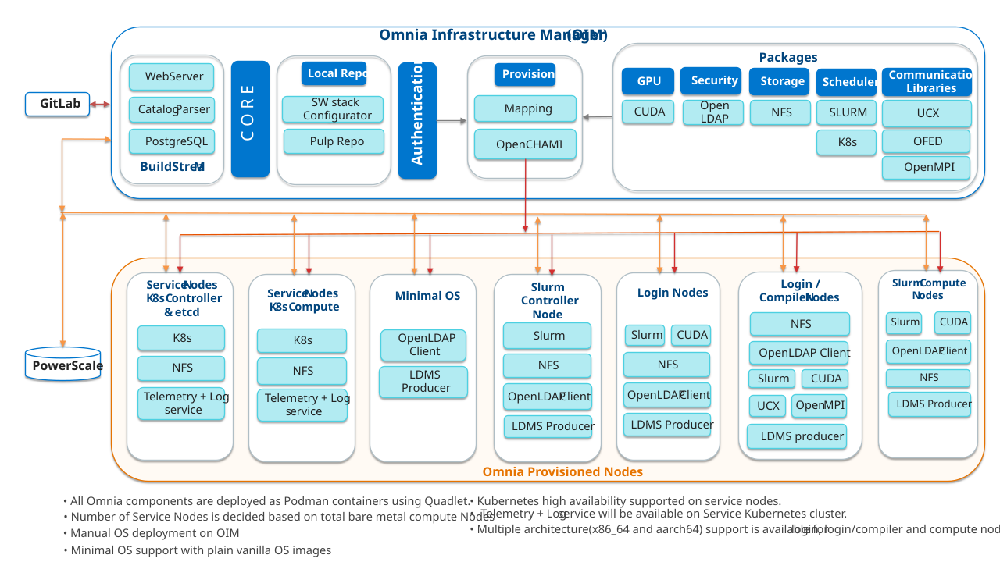

# Security Configuration Guide

## Preface
The security configuration guide of Omnia provides Dell customers an overview and understanding of the security features supported by Omnia. As part of an effort to improve its product lines, Dell periodically releases revisions of its software and hardware. The product release notes provide the most up-to-date information about product features. Contact your Dell technical support professional if a product does not function properly or does not function as described in this document. This document was accurate at publication time. To ensure that you are using the latest version of this document, go to [Omnia: Docs](../Overview/index.md)

## Legal Disclaimers

THE INFORMATION IN THIS PUBLICATION IS PROVIDED “AS-IS.” DELL MAKES NO REPRESENTATIONS OR WARRANTIES OF ANY KIND WITH RESPECT TO THE INFORMATION IN THIS PUBLICATION, AND SPECIFICALLY DISCLAIMS IMPLIED WARRANTIES OF MERCHANTABILITY OR FITNESS FOR A PARTICULAR PURPOSE. In no event shall Dell Technologies, its affiliates or suppliers, be liable for any damages whatsoever arising from or related to the information contained herein or actions that you decide to take based thereon, including any direct, indirect, incidental, consequential, loss of business profits or special damages, even if Dell Technologies, its affiliates or suppliers have been advised of the possibility of such damages. The Security Configuration Guide intends to be a reference. The guidance is provided based on a diverse set of installed systems and may not represent the actual risk/guidance to your local installation and individual environment. It is recommended that all users determine the applicability of this information to their individual environments and take appropriate actions. All aspects of this Security Configuration Guide are subject to change without notice and on a case-by-case basis. Your use of the information contained in this document or materials linked herein is at your own risk. Dell reserves the right to change or update this document in its sole discretion and without notice at any time.

## Scope of the Guide

This security configuration guide covers the security features supported by Omnia 2.2.0.0.

## Document References

In addition to this guide, more information on Omnia can be found using the below links:

- [Omnia: Read Me](https://github.com/dell/omnia#readme)
- [Omnia: Deployment Guide](../GetStarted/index.md)

## Reporting Security Vulnerabilities

Dell takes reports of potential security vulnerabilities in our products very seriously. If you discover a security vulnerability, you are encouraged to report it to Dell immediately. For the latest instructions on how to report a security issue to Dell, see the [Dell Vulnerability Response Policy](https://www.dell.com/support/contents/en-in/article/product-support/self-support-knowledgebase/security-antivirus/alerts-vulnerabilities/dell-vulnerability-response-policy) on the dell.com site.

Follow Dell Security on these sites:

- [Security@Dell](https://www.dell.com/support/security/en-us)
- [Support@Dell](https://www.dell.com/support/home/en-us)

To provide feedback on this solution, email us at [security@dell.com](mailto:security@dell.com).

If you have any feedback about Omnia documentation, please reach out at [omnia.readme@dell.com](mailto:omnia.readme@dell.com).

