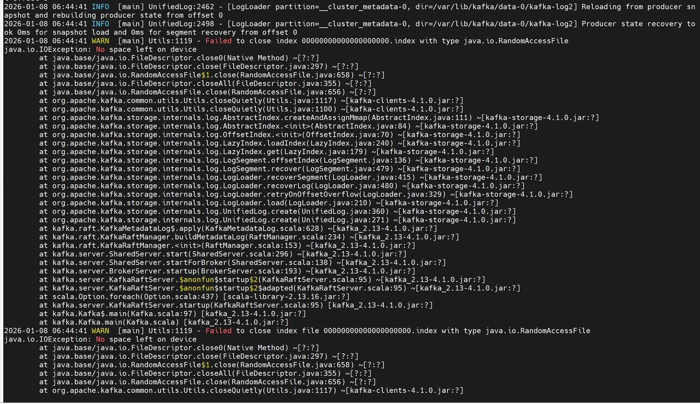

# Telemetry Issues

Issues related to the telemetry pipeline for example: Kafka, iDRAC telemetry, LDMS samplers, VictoriaMetrics (cluster mode), VictoriaLogs.

## Kafka Pods CrashLoopBackOff

???+ note "Symptom"

    Kafka pods enter `CrashLoopBackOff` state.

??? note "Cause"

    - No service kube nodes available.
    - Missing CSI driver.
    - Persistent volume full.

??? note "Resolution"

    1. Ensure service kube nodes are booted.
    2. Add PowerScale CSI driver (see [Deploy PowerScale CSI](../HowTo/orchestrator/deploy_powerscale_csi.md)).
    3. Increase Kafka volume and configure log retention.

## Kafka "No Space Left on Device"

???+ note "Symptom"

    - New telemetry data is not being collected or forwarded to storage
    - Telemetry dashboards show data gaps or stale metrics
    - One or more kafka-broker pods are in CrashLoopBackOff state with repeated restarts
    - Dependent pods such as idrac-telemetry show high restart counts or are unable to reach a ready state
    - Services that produce or consume Kafka messages report connection or write failures
    - Running `kubectl get pods -n telemetry` shows the affected broker and telemetry pods

    

    Inspecting the crashing Kafka broker logs reveals `java.io.IOException: No space left on device` errors:

    

??? note "Cause"

    Configured `persistence_size` for Kafka has reached capacity limit.

??? note "Resolution"

    The default `8Gi` persistent volume size is suitable for small clusters (typically fewer than 5 nodes). For larger clusters, increase `persistence_size` and configure Kafka retention settings `log_retention_hours` and `log_retention_bytes` so that old logs are deleted before the persistent volume reaches its limit.

    !!! tip "Emergency Cleanup Script"

        If Kafka brokers are experiencing disk space issues and require immediate cleanup, use the following automated script to identify and remove old log segments:

        ```bash title="File: kafka-pv-cleanup.sh"
        #!/bin/bash
        # ============================================================
        # KAFKA PV FULL — AUTOMATED EMERGENCY CLEANUP (OMNIA)
        # ============================================================
        set -e
        NAMESPACE="telemetry"
        BROKER_COUNT=3
        RETENTION_MS=3600000        # 1 hour temporary retention
        SEGMENT_AGE_DAYS=3          # Delete segments older than 3 days

        echo "============================================"
        echo " KAFKA PV EMERGENCY CLEANUP - AUTOMATED"
        echo "============================================"

        # -------------------------------------------------------
        # STEP 1: CHECK — Which brokers are full
        # -------------------------------------------------------
        echo ""
        echo ">>> STEP 1: Checking broker disk usage..."
        BROKERS_HEALTHY=true
        RESPONSIVE_BROKER=""
        for i in $(seq 0 $((BROKER_COUNT-1))); do
          echo "=== kafka-broker-$i ==="
          POD_STATUS=$(kubectl get pod -n $NAMESPACE kafka-broker$i -o jsonpath='{.status.phase}')
          READY=$(kubectl get pod -n $NAMESPACE kafka-broker$i -o jsonpath='{.status.conditions[?(@.type=="Ready")].status}')
          echo "  Pod Phase: $POD_STATUS"
          echo "  Ready: $READY"
          if kubectl exec -n $NAMESPACE kafka-broker$i -- echo "OK" 2>/dev/null; then
            echo "  Broker-$i: RESPONSIVE"
            [ -z "$RESPONSIVE_BROKER" ] && RESPONSIVE_BROKER=$i
          else
            echo "  Broker-$i: NOT RESPONSIVE (exec failed)"
            BROKERS_HEALTHY=false
          fi
        done

        # -------------------------------------------------------
        # DECISION: Brokers responsive → Exit (no action needed)
        #           Brokers crashing   → Path B (manual cleanup)
        # -------------------------------------------------------
        if [ "$BROKERS_HEALTHY" = true ]; then
          echo ""
          echo "All brokers are running and responsive."
          echo "This script is designed for emergency cleanup when brokers are crashlooping or PVs are full."
          echo "Since all brokers are healthy, no action is needed."
          echo "Exiting without making changes."
          exit 0
        fi
            echo ""
            echo "============================================"
            echo " PATH B: BROKERS CRASHLOOPING — MANUAL FIX"
            echo "============================================"

            # ----------------------------------------------------
            # STEP 2: Get PVC names
            # ----------------------------------------------------
            echo ""
            echo ">>> STEP 2: Detecting PVC names..."
            echo "  Listing all PVCs in $NAMESPACE namespace..."
            kubectl get pvc -n $NAMESPACE

            # Try to detect PVC prefix
            FIRST_PVC=$(kubectl get pvc -n $NAMESPACE -o jsonpath='{.items[0].metadata.name}' 2>/dev/null)
            if [ -z "$FIRST_PVC" ]; then
              echo "ERROR: No PVCs found in $NAMESPACE namespace"
              exit 1
            fi
            echo "First PVC: $FIRST_PVC"

            # Extract PVC prefix by removing the broker number suffix
            # Pattern: data-0-kafka-broker-0 -> data-0-kafka-broker
            PVC_PREFIX=$(echo "$FIRST_PVC" | sed 's/-[0-9]$//')
            echo "PVC prefix detected: $PVC_PREFIX"

            # Verify PVC names match expected pattern
            echo "Verifying PVC names match expected pattern..."
            for i in $(seq 0 $((BROKER_COUNT-1))); do
              EXPECTED_PVC="${PVC_PREFIX}-${i}"
              if kubectl get pvc -n $NAMESPACE "$EXPECTED_PVC" >/dev/null 2>&1; then
                echo "  $EXPECTED_PVC: FOUND"
              else
                echo "  $EXPECTED_PVC: NOT FOUND (will cause cleanup pod to fail)"
                echo "  Listing all PVCs again for reference:"
                kubectl get pvc -n $NAMESPACE
                echo "ERROR: PVC naming pattern doesn't match. Please check PVC names and update script."
                exit 1
              fi
            done

            # ----------------------------------------------------
            # STEP 2.5: Stop broker pods to release PVCs
            # ----------------------------------------------------
            echo ""
            echo ">>> STEP 2.5: Stopping broker pods to release PVCs..."

            # Check if Kafka is managed by StatefulSet
            if kubectl get statefulset -n $NAMESPACE kafka-broker >/dev/null 2>&1; then
              echo "  Kafka brokers managed by StatefulSet: kafka-broker"
              echo "  Scaling down to 0 replicas..."
              kubectl scale statefulset -n $NAMESPACE kafka-broker --replicas=0
              echo "  Waiting for pods to terminate..."
              kubectl wait -n $NAMESPACE --for=delete pod/kafka-broker-0 --timeout=120s --ignore-not-found || true
              kubectl wait -n $NAMESPACE --for=delete pod/kafka-broker-1 --timeout=120s --ignore-not-found || true
              kubectl wait -n $NAMESPACE --for=delete pod/kafka-broker-2 --timeout=120s --ignore-not-found || true
            else
              echo "  Kafka brokers not managed by StatefulSet, deleting pods directly..."
              for i in $(seq 0 $((BROKER_COUNT-1))); do
                echo "  Deleting kafka-broker-$i..."
                kubectl delete pod -n $NAMESPACE kafka-broker$i --ignore-not-found --force --grace-period=0
              done
              echo "  Waiting for broker pods to terminate..."
              for i in $(seq 0 $((BROKER_COUNT-1))); do
                kubectl wait -n $NAMESPACE --for=delete pod/kafka-broker$i --timeout=60s || true
              done
            fi

            # ----------------------------------------------------
            # STEP 2.6: Cleanup any existing cleanup pods
            # ----------------------------------------------------
            echo ""
            echo ">>> STEP 2.6: Removing any existing cleanup pods..."
            for i in $(seq 0 $((BROKER_COUNT-1))); do
              kubectl delete pod -n $NAMESPACE kafka-cleanup$i --ignore-not-found
            done
            echo "  Waiting for cleanup pods to be removed..."
            sleep 5

            # ----------------------------------------------------
            # STEP 3: Deploy cleanup pods
            # ----------------------------------------------------
            echo ""
            echo ">>> STEP 3: Deploying cleanup pods..."
            for i in $(seq 0 $((BROKER_COUNT-1))); do
              PVC_NAME="${PVC_PREFIX}-${i}"
              echo "  Creating cleanup pod for PVC: $PVC_NAME"
              kubectl run kafka-cleanup-$i -n $NAMESPACE \
                --image=busybox \
                --restart=Never \
                --overrides='{
                  "spec": {
                    "containers": [{
                      "name": "cleanup",
                      "image": "busybox",
                      "command": ["sh","-c","sleep 3600"],
                      "volumeMounts": [{
                        "name": "data",
                        "mountPath": "/data"
                      }]
                    }],
                    "volumes": [{
                      "name": "data",
                      "persistentVolumeClaim": {
                        "claimName": "'$PVC_NAME'"
                      }
                    }]
                  }
                }'
            done

            echo "  Waiting for cleanup pods..."
            for i in $(seq 0 $((BROKER_COUNT-1))); do
              echo "  Waiting for kafka-cleanup-$i..."
              if ! kubectl wait -n $NAMESPACE --for=condition=Ready pod/kafka-cleanup$i --timeout=120s; then
                echo "  ERROR: kafka-cleanup-$i failed to become Ready"
                echo "  Pod status:"
                kubectl get pod -n $NAMESPACE kafka-cleanup$i -o wide
                echo "  Pod events:"
                kubectl describe pod -n $NAMESPACE kafka-cleanup$i --tail=20
                exit 1
              fi
            done

            # ----------------------------------------------------
            # STEP 4: Show current usage + Clean old segments
            # ----------------------------------------------------
            echo ""
            echo ">>> STEP 4: Cleaning old segments (>${SEGMENT_AGE_DAYS} days)..."
            for i in $(seq 0 $((BROKER_COUNT-1))); do
              echo "=== kafka-broker-$i (BEFORE) ==="
              kubectl exec -n $NAMESPACE kafka-cleanup$i -- df -h /data

              # Detect actual data directory within PVC mount
              echo "  Detecting data directory within PVC..."
              PVC_DATA_DIR=$(kubectl exec -n $NAMESPACE kafka-cleanup$i -- \
                sh -c 'find /data -type d -name "*.log" 2>/dev/null | head -1 | xargs dirname 2>/dev/null || echo "/data"' 2>/dev/null)
              if [ "$PVC_DATA_DIR" = "/data" ]; then
                # Try common subdirectories
                for SUBDIR in "kafka-log0" "kraft-combined-logs" "data"; do
                  if kubectl exec -n $NAMESPACE kafka-cleanup$i -- sh -c "test -d /data/$SUBDIR && echo /data/$SUBDIR" 2>/dev/null | grep -q .; then
                    PVC_DATA_DIR="/data/$SUBDIR"
                    break
                  fi
                done
              fi
              echo "  Using data directory: $PVC_DATA_DIR"

              echo "  Cleaning..."
              DELETED=$(kubectl exec -n $NAMESPACE kafka-cleanup$i -- \
                sh -c 'count=0; find '"$PVC_DATA_DIR"' -name "*.log" -mtime +'"$SEGMENT_AGE_DAYS"' 2>/dev/null | while read f; do
                  base=$(echo "$f" | sed "s/\.log$//")
                  rm -f "${base}.log" "${base}.index" "${base}.timeindex" "${base}.snapshot"
                  count=$((count+1))
                  echo "$count"
                done | tail -1')
              echo "  Broker-$i: Deleted ${DELETED:-0} segments"
            done

            # ----------------------------------------------------
            # STEP 5: Verify space recovered
            # ----------------------------------------------------
            echo ""
            echo ">>> STEP 5: Verifying space recovered..."
            for i in $(seq 0 $((BROKER_COUNT-1))); do
              echo "=== kafka-broker-$i (AFTER) ==="
              kubectl exec -n $NAMESPACE kafka-cleanup$i -- df -h /data
            done

            # ----------------------------------------------------
            # STEP 6: Remove cleanup pods
            # ----------------------------------------------------
            echo ""
            echo ">>> STEP 6: Removing cleanup pods..."
            for i in $(seq 0 $((BROKER_COUNT-1))); do
              kubectl delete pod -n $NAMESPACE kafka-cleanup$i --ignore-not-found
            done

            # ----------------------------------------------------
            # STEP 7: Scale up StatefulSet to restore brokers
            # ----------------------------------------------------
            echo ""
            echo ">>> STEP 7: Scaling up StatefulSet to restore brokers..."
            if kubectl get statefulset -n $NAMESPACE kafka-broker >/dev/null 2>&1; then
              echo "  Scaling kafka-broker StatefulSet to $BROKER_COUNT replicas..."
              kubectl scale statefulset -n $NAMESPACE kafka-broker --replicas=$BROKER_COUNT
              echo "  Waiting for brokers to become ready..."
              for i in $(seq 0 $((BROKER_COUNT-1))); do
                kubectl wait -n $NAMESPACE --for=condition=Ready pod/kafka-broker$i --timeout=300s
                echo "  kafka-broker-$i is ready. Stabilizing..."
                sleep 60
              done
            else
              echo "  StatefulSet not found, brokers should auto-restart from Deployment"
              sleep 120
            fi

          echo ""
          echo "============================================"
          echo " CLEANUP COMPLETE"
          echo "============================================"
          echo ""
          echo ">>> Final disk usage:"
          for i in $(seq 0 $((BROKER_COUNT-1))); do
            echo "=== kafka-broker-$i ==="
            kubectl exec -n $NAMESPACE kafka-broker$i -- df -h /var/lib/kafka/data-0 2>/dev/null || echo "  Still recovering..."
          done
        ```

        **Script Usage**

        1. Save the script:

            ```bash title="Run on: OIM host"
            vi kafka-pv-cleanup.sh
            ```

        2. Make the script executable:

            ```bash title="Run on: OIM host"
            chmod +x kafka-pv-cleanup.sh
            ```

        3. Run the script:

            ```bash title="Run on: OIM host"
            ./kafka-pv-cleanup.sh
            ```

        !!! note

            This script automatically detects whether brokers are responsive or crashlooping and applies the appropriate cleanup strategy. Modify the `BROKER_COUNT`, `RETENTION_MS`, and `SEGMENT_AGE_DAYS` variables at the top of the script to match your environment requirements.

## LDMS Metrics Missing

???+ note "Symptom"

    LDMS metrics do not appear in the telemetry dashboard or are missing expected data points.

??? note "Cause"

    - LDMS aggregator pods are not running or experiencing errors.
    - LDMS store daemon service is inactive.
    - LDMS sampler service is not functioning correctly.

??? note "Resolution"

    The LDMS data pipeline consists of three stages. Diagnose each stage in the following order:

    Data Flow: Sampler (compute nodes, port 10001) → Aggregator pod (nersc-ldms-aggr-0) → Store pod (nersc-ldms-store-slurm-cluster-0) → Kafka ldms topic

    1. Verify LDMS sampler on compute nodes

        On each Slurm/compute node, check the sampler service:

        ```bash title="Run on: compute node"
        sudo systemctl status ldmsd.sampler.service
        ```

        If the service is inactive or failed, restart and enable it:

        ```bash title="Run on: compute node"
        sudo systemctl restart ldmsd.sampler.service
        sudo systemctl enable ldmsd.sampler.service
        ```

        Verify the sampler is producing metric sets locally:

        ```bash title="Run on: compute node"
        /opt/ovis-ldms/sbin/ldms_ls -x sock -h localhost -p 10001 -a ovis
        ```

        Expected output: a list of metric sets such as `<hostname>/meminfo`, `<hostname>/vmstat`, `<hostname>/loadavg`, `<hostname>/procstat2`, `<hostname>/procnetdev2`.

        To view detailed metric values:

        ```bash title="Run on: compute node"
        /opt/ovis-ldms/sbin/ldms_ls -x sock -h localhost -p 10001 -a ovis -l
        ```

        If no metric sets are listed, check the sampler configuration and service logs:

        ```bash title="Run on: compute node"
        cat /opt/ovis-ldms/etc/ldms/sampler.conf
        journalctl -u ldmsd.sampler.service --no-pager -n 50
        ```

    2. Verify LDMS aggregator pod

        Check the aggregator pod status:

        ```bash title="Run on: K8s control plane"
        kubectl get pods -n telemetry | grep ldms-aggr
        ```

        If the pod is not in Running state, inspect pod events:

        ```bash title="Run on: K8s control plane"
        kubectl describe pod -n telemetry nersc-ldms-aggr-0
        ```

        Check aggregator logs for connectivity errors:

        ```bash title="Run on: K8s control plane"
        kubectl logs -n telemetry nersc-ldms-aggr-0 --tail=50
        ```

        Verify the aggregator is receiving metric sets from all producers:

        ```bash title="Run on: K8s control plane"
        kubectl exec -n telemetry nersc-ldms-aggr-0 -- bash -c 'source /ldms_conf/ldms-env.nersc-ldms-aggr.slurm-cluster-0.sh && /ldms_bin/ldms_ls.bash'
        ```

        Expected output includes a JSON summary with TotalSets matching the number of metric schemas multiplied by the number of nodes (for example, 5 schemas × 2 nodes = 10 total sets).

        Check producer connection status to verify all nodes show CONNECTED:

        ```bash title="Run on: K8s control plane"
        kubectl exec -n telemetry nersc-ldms-aggr-0 -- bash -c 'source /ldms_conf/ldms-env.nersc-ldms-aggr.slurm-cluster-0.sh && /opt/ovis-ldms/bin/ldmsd_controller -a ${LDMSD_AUTH_PLUGIN} -A ${LDMSD_AUTH_OPTION} -x sock -h ${LDMSD_HOST} -p ${LDMSD_PORT} --cmd prdcr_status'
        ```

        If a producer shows DISCONNECTED, verify the sampler service is running on that compute node (step 1) and that port 10001 is reachable from the aggregator pod.

        To restart the aggregator pod:

        ```bash title="Run on: K8s control plane"
        kubectl delete pod -n telemetry nersc-ldms-aggr-0
        ```

        The StatefulSet controller will automatically recreate the pod.

    3. Verify LDMS store daemon pod

        Check the store pod status:

        ```bash title="Run on: K8s control plane"
        kubectl get pods -n telemetry | grep ldms-store
        ```

        Check store logs for Kafka connectivity or storage errors:

        ```bash title="Run on: K8s control plane"
        kubectl logs -n telemetry nersc-ldms-store-slurm-cluster-0 --tail=50
        ```

        Verify store daemon health and Kafka storage policy status:

        ```bash title="Run on: K8s control plane"
        kubectl exec -n telemetry nersc-ldms-store-slurm-cluster-0 -- bash -c 'source /ldms_conf/ldms-env.nersc-ldms-store-slurm-cluster-0.sh && /ldms_bin/ldms_stats.bash'
        ```

        In the output, confirm:

        - Daemon State: ready
        - strgp_status shows the kafka storage policy in RUNNING state
        - prdcr_stats shows connected_count equal to 1 (connected to aggregator)

        If the store pod is failing to write to Kafka, verify the Kafka mTLS certificates are mounted:

        ```bash title="Run on: K8s control plane"
        kubectl exec -n telemetry nersc-ldms-store-slurm-cluster-0 -- ls -la /ldms_certs/
        ```

        Expected files: ca.crt, user.crt, user.key.

        To restart the store pod:

        ```bash title="Run on: K8s control plane"
        kubectl delete pod -n telemetry nersc-ldms-store-slurm-cluster-0
        ```

    4. Verify Kafka topic is receiving LDMS messages

        Confirm the ldms Kafka topic exists:

        ```bash title="Run on: K8s control plane"
        kubectl exec -n telemetry kafka-broker-0 -- /opt/kafka/bin/kafka-topics.sh --describe --topic ldms --bootstrap-server kafka-kafka-bootstrap.telemetry.svc.cluster.local:9092
        ```

        If the ldms topic does not exist, the store daemon has not connected successfully — review step 3.

    !!! note

        After fixing any component, allow 1–2 minutes for the pipeline to stabilize before checking the telemetry dashboard for new metrics.

## iDRAC Telemetry — No Metrics Reaching VictoriaMetrics / Kafka

???+ note "Symptom"

    iDRAC metrics (power, thermal, fan, CPU) do not appear in VictoriaMetrics, or data is stale. The iDRAC telemetry receiver pods restart repeatedly or remain in `0/1 Ready` state. New nodes do not appear as telemetry sources after provisioning.

    Example errors in VictoriaPump / KafkaPump container logs:

    - `ERROR failed to subscribe to Redfish event service: 401 Unauthorized`
    - `ERROR redfish: event subscription rejected (SubscriptionLimitExceeded)`
    - `WARN activemq: connection refused tcp 127.0.0.1:61616`
    - `ERROR victoriapump: post to vmagent failed: dial tcp <vmagent-svc>:8429: connect: connection refused`

    !!! note

        The `401 Unauthorized` error may occur due to credential drift — when iDRAC credentials are changed on the iDRAC side after a successful deployment. Omnia stores credentials in mysqldb at insert-time and does not continuously re-validate them against the iDRAC appliance.

??? note "Cause"

    - Incorrect or expired iDRAC credentials in the vault (`idrac_username` / `idrac_password`), resulting in `401 Unauthorized` errors.
    - Redfish subscription limit reached on iDRAC (stale subscriptions from prior runs).
    - iDRAC firmware does not support Redfish Telemetry/EventService.
    - Pipeline component failure (ActiveMQ, KafkaPump, or VictoriaPump not ready).
    - Collection type misconfiguration (`telemetry_sources.idrac.collection_targets` does not include the expected sink).
    - Network or firewall blocking OIM from reaching iDRAC on port 443, or receiver from reaching vmagent for scraping `victoria-pump:2112/metrics` or Kafka on port 9093 (TLS).

??? note "Resolution"

    **Diagnostics:**

    ```bash title="Run on: K8s control plane"
    kubectl get pods -A | grep -Ei 'telemetry|idrac|victoria|kafka'
    ```

    Inspect iDRAC telemetry receiver pod (contains mysqldb, activemq, idrac-telemetry-receiver, kafka-pump, victoria-pump, plus initContainer cleanup-mysql-locks):

    ```bash title="Run on: K8s control plane"
    kubectl -n telemetry describe pod <idrac-telemetry-pod>
    kubectl -n telemetry logs <idrac-telemetry-pod> -c victoria-pump --tail=100
    kubectl -n telemetry logs <idrac-telemetry-pod> -c kafka-pump --tail=100
    ```

    Verify Redfish reachability and credentials:

    ```bash title="Run on: OIM host"
    curl -sk -u "$IDRAC_USER:$IDRAC_PASS" https://<idrac-ip>/redfish/v1/EventService | head
    ```

    List and delete stale Redfish subscriptions:

    ```bash title="Run on: OIM host"
    curl -sk -u "$IDRAC_USER:$IDRAC_PASS" https://<idrac-ip>/redfish/v1/EventService/Subscriptions
    ```

    Confirm metrics landed in VictoriaMetrics:

    ```bash title="Run on: K8s control plane"
    curl -s 'https://<vmselect-svc>:8481/select/0/prometheus/api/v1/query?query=up' | head
    ```

    **Resolution steps:**

    1. Correct `idrac_username` / `idrac_password` in `omnia_config_credentials.yml`, then run `ansible-playbook provision/provision.yml`, SSH to kube_vip and manually re-run `bash <k8s_client_mount_path>/telemetry/telemetry.sh`, then run `telemetry.yml`. Verify with the curl command above (expect 200).
    2. Delete orphaned Redfish subscriptions using `curl -X DELETE ...`, then allow the receiver to re-subscribe.
    3. Update iDRAC firmware to a version that supports Redfish EventService/Telemetry, then re-run telemetry.
    4. If ActiveMQ/KafkaPump/VictoriaPump is unhealthy, check container logs and restart the receiver pod (`kubectl delete pod <pod>`) after confirming the root cause.
    5. Set `telemetry_sources.idrac.collection_targets` to `["victoria_metrics"]`, `["kafka"]`, or `["victoria_metrics", "kafka"]` to match where you expect data, then run `ansible-playbook provision/provision.yml`, SSH to kube_vip and re-run `bash <k8s_client_mount_path>/telemetry/telemetry.sh`, then run `telemetry.yml`.
    6. Ensure OIM can reach iDRAC on port 443 and the receiver can reach vmagent for scraping `victoria-pump:2112/metrics` and Kafka on port 9093 (TLS).

    !!! note

        iDRAC telemetry is enabled by `telemetry_sources.idrac.metrics_enabled: true` and routed per `telemetry_sources.idrac.collection_targets` in `input/telemetry_config.yml`. The receiver (mysqldb + activemq + idrac-telemetry-receiver + kafka-pump conditional + victoria-pump conditional, plus initContainer cleanup-mysql-locks) is a generated StatefulSet — modify inputs and re-run rather than editing the pod. Manifests (VMCluster, VLCluster, Kafka, iDRAC StatefulSet) are generated by `provision.yml` into `telemetry/deployments/` on the NFS share, then applied by `telemetry.sh`, which cloud-init runs automatically only when a new control-plane node is provisioned. For an already-running cluster, after editing `telemetry_config.yml`, run `ansible-playbook provision/provision.yml`, SSH to kube_vip and manually re-run `bash <k8s_client_mount_path>/telemetry/telemetry.sh`, then run `telemetry.yml` only if the change involves iDRAC (credentials, collection_targets, BMC list).

## VictoriaMetrics (Cluster Mode) — Pods Down, PVC Full, or Queries Failing

???+ note "Symptom"

    One or more vmstorage, vminsert, or vmselect pods are in CrashLoopBackOff, Pending, or Evicted state. Recent samples are missing while older data is present (ingestion lag).

    Omnia deploys VictoriaMetrics in cluster mode with TLS: vmstorage (3 replicas), vminsert (2), vmselect (2), and vmagent (2), with replication factor 2.

    Example errors:

    vmstorage:

    - `panic: cannot open storage at "/storage": no space left on device`

    vminsert:

    - `cannot send data to vmstorage node "vmstorage-1:8400": connection timed out`

    vmselect:

    - `error during search: cannot fetch data from vmstorage nodes: not enough healthy storage nodes (got 1, need 2)`

    Pod events:

    - `0/3 nodes are available: 3 Insufficient memory.`
    - `Pod ephemeral local storage usage exceeds the total limit of containers`

??? note "Cause"

    - vmstorage PVC is full (retention or ingest volume exceeded the provisioned storage)
    - Insufficient healthy replicas (with replication factor 2, losing 2+ vmstorage pods prevents vmselect from satisfying reads)
    - Resource pressure (pods Pending or Evicted due to insufficient memory or node disk pressure)
    - TLS or certificate mismatch (expired or mismatched certificates between vminsert/vmselect and vmstorage break inter-component communication)
    - vmagent backlog (vmagent cannot reach vminsert, queues fill, and remote_write stalls)

??? note "Resolution"

    Check pod and PVC status:

    ```bash title="Run on: K8s control plane"
    kubectl -n telemetry get pods -l 'app.kubernetes.io/name in (vmstorage,vminsert,vmselect,vmagent)' -o wide
    kubectl -n telemetry get pvc | grep -i vmstorage
    kubectl -n telemetry describe pod <vmstorage-pod> | sed -n '/Events/,$p'
    ```

    Check disk usage inside a vmstorage pod:

    ```bash title="Run on: K8s control plane"
    kubectl -n telemetry exec <vmstorage-pod> -- df -h /storage
    ```

    Check cluster health logs:

    ```bash title="Run on: K8s control plane"
    kubectl -n telemetry logs <vminsert-pod> --tail=100
    kubectl -n telemetry logs <vmselect-pod> --tail=100
    ```

    Check vmagent remote_write health (look for failed batches or queue size):

    ```bash title="Run on: K8s control plane"
    kubectl -n telemetry logs <vmagent-pod> --tail=100 | grep -Ei 'remote_write|error|drop'
    ```

    **Resolution Steps**

    1. Expand the vmstorage PVC (if the StorageClass allows allowVolumeExpansion) or reduce retention. In Omnia, set retention and sizing through the telemetry input config, then run `ansible-playbook provision/provision.yml`, SSH to kube_vip and manually re-run `bash <k8s_client_mount_path>/telemetry/telemetry.sh`; do not manually edit the StatefulSet.

    2. Restore quorum by bringing failed vmstorage pods back (resolve node disk pressure or memory issues), confirming vmselect reports enough healthy nodes.

    3. Free node resources or adjust requests/limits via the input config; reschedule Evicted pods.

    4. Regenerate or rotate the telemetry certificates via the playbook so vminsert/vmselect ↔ vmstorage mTLS matches.

    5. Once vminsert is reachable, vmagent flushes its queue; verify lag closes via a recent-range query.

    Sizing guidance: provision vmstorage capacity from sources × active series/node × samples/series × retention. Under-provisioning the PVC is the most common cause of this issue — size for peak source count (iDRAC + LDMS + DCGM + PowerScale + UFM + VAST + OME), not initial node count.

    !!! note

        cluster mode, replica counts, replication factor, TLS, and retention are rendered from `input/telemetry_config.yml` and `input/service_k8s.json`. Modify inputs and re-run; pod edits are transient.

## VictoriaLogs (Cluster Mode) — Logs Missing or Unsearchable

???+ note "Symptom"

    Users cannot search or analyze historical syslog because LogsQL queries return no or stale results. Real-time log monitoring is broken, new events are lost. vlinsert, vlstorage, vlselect, or vlagent pods are unavailable. Slow response times, potential data loss during spikes.

    Example errors:

    - vlstorage: no space left on device
    - vlinsert: cannot proxy request to vlstorage
    - vlselect: some vlstorage nodes are unavailable
    - vlagent: remote write failed

??? note "Cause"

    - vlstorage PVC is full
    - One or more vlstorage pods are unavailable
    - vlagent cannot forward logs to vlinsert
    - Syslog sources are not forwarding logs to VLAgent
    - Incorrect DNS, firewall, or TLS configuration between VictoriaLogs components

??? note "Resolution"

    1. Check VictoriaLogs health

        ```bash title="Run on: K8s control plane"
        kubectl -n telemetry get pods | grep -E 'vlagent|vlinsert|vlstorage|vlselect'
        kubectl -n telemetry get pvc | grep vlstorage
        ```

    2. Recover a full vlstorage PVC

        Check disk usage on each vlstorage pod:

        ```bash title="Run on: K8s control plane"
        kubectl -n telemetry exec vlstorage-victoria-logs-cluster-0 -- df -h
        kubectl -n telemetry exec vlstorage-victoria-logs-cluster-1 -- df -h
        kubectl -n telemetry exec vlstorage-victoria-logs-cluster-2 -- df -h
        ```

        Increase storage in input/telemetry_storage_config.yml or reduce retention in input/telemetry_config.yml, then redeploy:

        ```bash title="Run on: OIM host"
        ansible-playbook provision/provision.yml
        ```

        ```bash title="Run on: K8s control plane"
        ssh <kube_control_plane>
        ./<k8s_client_mount_path>/telemetry/telemetry.sh
        ```

    3. Recover unavailable storage pods

        Diagnose pod issues:

        ```bash title="Run on: K8s control plane"
        kubectl -n telemetry describe pod vlstorage-victoria-logs-cluster-0
        kubectl -n telemetry describe pod vlstorage-victoria-logs-cluster-1
        kubectl -n telemetry describe pod vlstorage-victoria-logs-cluster-2
        ```

        Check node health:

        ```bash title="Run on: K8s control plane"
        kubectl get nodes
        kubectl describe node <node-name>
        ```

        Delete stuck pod (StatefulSet will recreate it):

        ```bash title="Run on: K8s control plane"
        kubectl -n telemetry delete pod <vlstorage pod>
        ```

        Watch recreation:

        ```bash title="Run on: K8s control plane"
        kubectl -n telemetry get pods -l app.kubernetes.io/component=vlstorage -w
        ```

    4. Verify VLAgent forwarding

        ```bash title="Run on: K8s control plane"
        NAMESPACE=telemetry

        echo -e "\n=== Test Connectivity ==="
        kubectl exec -n $NAMESPACE vlagent-vlagent-0 -- nc -vz vlinsert-victoria-logs-cluster 9481 2>&1

        echo -e "\n=== VLInsert Logs ==="
        VLINSERT_POD=$(kubectl get pods -n $NAMESPACE -o name | grep vlinsert | head -1)
        if [ -n "$VLINSERT_POD" ]; then
          kubectl logs -n $NAMESPACE $VLINSERT_POD --tail=20
        else
          echo "No vlinsert pods found"
        fi

        echo -e "\n=== VLStorage Disk Usage ==="
        kubectl exec -n $NAMESPACE vlstorage-victoria-logs-cluster-0 -- df -h /vlstorage-data

        echo -e "\n=== Query Recent Logs (HTTPS) ==="
        VLSELECT_IP=$(kubectl get svc -n $NAMESPACE vlselect-victoria-logs-cluster \
          -o jsonpath='{.status.loadBalancer.ingress[0].ip}')
        if [ -n "$VLSELECT_IP" ]; then
          echo "Querying via LoadBalancer: $VLSELECT_IP"
          curl -k "https://${VLSELECT_IP}:9471/select/logsql/query?query=_time:5m&limit=5"
        else
          echo "No LoadBalancer IP, using port-forward..."
        fi
        ```

    5. Ensure the device or service is configured to emit syslog to VLAgent

        Configure syslog forwarding for your specific device or service:

        - [PowerScale Syslog Forwarding](../HowTo/Telemetry/configure_powerscale.md)
        - [UFM Syslog Forwarding](../HowTo/Telemetry/configure_ufm.md)
        - [VAST Syslog Forwarding](../HowTo/Telemetry/configure_vast.md)

## Telemetry Failover Delay After Kubernetes Worker Node Failure

???+ note "Symptom"

    When a Kubernetes worker node fails, affected telemetry services take time to fail over to available worker nodes.

??? note "Resolution"

    No manual intervention is required. Wait for the telemetry services to recover and fail over automatically. Do not restart pods or nodes during this period, as it may extend recovery time.

## Telemetry Pods Enter CrashLoopBackOff After Worker Node Reboot

???+ note "Symptom"

    In Omnia deployments that use PowerScale as NFS-backed persistent storage without NFSv4 enabled, telemetry pods (Kafka and iDRAC/MySQL) may enter a CrashLoopBackOff state following an abrupt worker node reboot or network interruption.

??? note "Cause"

    During normal operation, Kafka and MySQL write lock files (`.lock`, `.pid`, `.sock`) to their persistent volumes to prevent concurrent access. When a pod terminates unexpectedly, these lock files are not released. Because PowerScale operates as an external, highly available NFSv3 server, it retains the lock state across client failures. When the pod restarts, it cannot acquire the existing locks and fails to initialize, resulting in a crash loop.

??? note "Resolution"

    Deploy Kubernetes and telemetry with PowerScale having NFSv4 enabled. Use the following scripts for immediate fix. These scripts check for the type of failure and apply the appropriate resolution automatically.

    !!! note "Usage instructions"

        1. Save each script to a file with the corresponding name (for example, `kafka_lock_cleanup.sh`, `idrac_lock_cleanup.sh`, `idrac_data_corruption_recovery.sh`).

        2. Make the scripts executable:

           ```bash title="Run on: omnia_core container or K8s control plane"
           chmod +x kafka_lock_cleanup.sh idrac_lock_cleanup.sh idrac_data_corruption_recovery.sh
           ```

        3. Run the scripts in the following order. If both Kafka and iDRAC scripts need to be executed, run the Kafka script first and wait for 1 minute before executing the iDRAC script.

           - For Kafka lock issues: `./kafka_lock_cleanup.sh`
           - For iDRAC lock issues: `./idrac_lock_cleanup.sh`
           - For iDRAC data corruption: `./idrac_data_corruption_recovery.sh`

    **Kafka Lock Cleanup Script**

    Save the following as `kafka_lock_cleanup.sh`:

    ```bash title="kafka_lock_cleanup.sh"
    #!/bin/bash
    set -euo pipefail
    NAMESPACE="telemetry"

    echo "=== Kafka Lock Cleanup ==="

    # Step 1: Get PVC names before deleting pods
    echo "[1] Collecting PVC names..."
    PVCS=$(kubectl get pods -n "$NAMESPACE" -l strimzi.io/kind=Kafka \
      -o jsonpath='{.items[*].spec.volumes[*].persistentVolumeClaim.claimName}')
    echo "PVCs found: $PVCS"

    # Step 2: Force delete all Kafka pods
    echo "[2] Force deleting Kafka pods..."
    kubectl delete pod -n "$NAMESPACE" -l strimzi.io/kind=Kafka --force --grace-period=0

    # Step 3: Clean lock files from each PVC
    for PVC in $PVCS; do
      echo "[3] Cleaning lock files from PVC: $PVC"
      kubectl run kafka-lock-cleanup --image=busybox:1.36 -n "$NAMESPACE" --restart=Never --overrides="
      {
        \"spec\": {
          \"containers\": [{
            \"name\": \"cleanup\",
            \"image\": \"busybox:1.36\",
            \"command\": [\"sh\", \"-c\", \"find /data -type f \\\\( -name '*.lock' -o -name '*.sock' -o -name '*.pid' \\\\) -print -delete; echo Done\"],
            \"volumeMounts\": [{\"name\": \"data\", \"mountPath\": \"/data\"}]
          }],
          \"volumes\": [{\"name\": \"data\", \"persistentVolumeClaim\": {\"claimName\": \"$PVC\"}}]
        }
      }"

      # Step 4: Wait for completion
      echo "[4] Waiting for cleanup pod..."
      kubectl wait --for=jsonpath='{.status.phase}'=Succeeded pod/kafka-lock-cleanup -n telemetry --timeout=120s
      kubectl logs kafka-lock-cleanup -n "$NAMESPACE"
      kubectl delete pod kafka-lock-cleanup -n "$NAMESPACE"
    done

    echo "[5] Verify: kubectl get pods -n $NAMESPACE -l strimzi.io/kind=Kafka"
    ```

    **iDRAC Lock Cleanup Script**

    Save the following as `idrac_lock_cleanup.sh`:

    ```bash title="idrac_lock_cleanup.sh"
    #!/bin/bash
    set -euo pipefail
    NAMESPACE="telemetry"

    echo "=== iDRAC Lock Cleanup ==="

    # Step 1: Check for corruption — abort if found
    echo "[1] Checking logs for data corruption..."
    for POD in $(kubectl get pods -n "$NAMESPACE" -l app=idrac-telemetry -o jsonpath='{.items[*].metadata.name}'); do
      LOGS=$(kubectl logs "$POD" -n "$NAMESPACE" --tail=50 2>/dev/null || echo "")

      # Check for corruption indicators
      if echo "$LOGS" | grep -qiE "trying to read page|corruption in the InnoDB tablespace|innodb_force_recovery"; then
        echo ""
        echo "============================================================"
        echo "ERROR: Data corruption detected in pod: $POD"
        echo ""
        echo "Errors found:"
        echo "$LOGS" | grep -iE "trying to read page|Unable to lock mysql.ibd|corruption|Assertion failure|innodb_force_recovery|Unable to read page" | head -5
        echo ""
        echo "Lock cleanup will NOT fix this issue."
        echo "Run: ./idrac_data_corruption_recovery.sh"
        echo "============================================================"
        exit 1
      fi
    done

    echo "No corruption detected. Proceeding with lock cleanup..."

    # Step 2: Get PVC names
    echo "[2] Collecting PVC names..."
    PVCS=$(kubectl get pods -n "$NAMESPACE" -l app=idrac-telemetry \
      -o jsonpath='{.items[*].spec.volumes[*].persistentVolumeClaim.claimName}')
    echo "PVCs found: $PVCS"

    # Step 3: Force delete all iDRAC pods
    echo "[3] Force deleting iDRAC pods..."
    kubectl delete pod -n "$NAMESPACE" -l app=idrac-telemetry --force --grace-period=0

    # Step 4: Clean lock files from each PVC
    for PVC in $PVCS; do
      echo "[4] Cleaning lock files from PVC: $PVC"
      kubectl run mysql-lock-cleanup --image=busybox:1.36 -n "$NAMESPACE" --restart=Never --overrides="
      {
        \"spec\": {
          \"containers\": [{
            \"name\": \"cleanup\",
            \"image\": \"busybox:1.36\",
            \"command\": [\"sh\", \"-c\", \"find /data -type f \\\\( -name '*.sock' -o -name '*.pid' -o -name '*.lock' -o -name 'ibdata1.lock' \\\\) -print -delete; echo Done\"],
            \"volumeMounts\": [{\"name\": \"data\", \"mountPath\": \"/data\"}]
          }],
          \"volumes\": [{\"name\": \"data\", \"persistentVolumeClaim\": {\"claimName\": \"$PVC\"}}]
        }
      }"

      echo "[5] Waiting for cleanup pod..."
      kubectl wait --for=jsonpath='{.status.phase}'=Succeeded pod/mysql-lock-cleanup -n "$NAMESPACE" --timeout=120s
      kubectl logs mysql-lock-cleanup -n "$NAMESPACE"
      kubectl delete pod mysql-lock-cleanup -n "$NAMESPACE"
    done

    echo "[6] Verify: kubectl get pods -n $NAMESPACE -l app=idrac-telemetry"
    ```

    **iDRAC Data Corruption Recovery Script**

    Save the following as `idrac_data_corruption_recovery.sh`:

    ```bash title="idrac_data_corruption_recovery.sh"
    #!/bin/bash
    set -euo pipefail
    NAMESPACE="telemetry"

    echo "=== iDRAC Data Corruption Recovery ==="
    echo "WARNING: This will DELETE all iDRAC PVCs and wipe stored data."
    read -rp "Type DELETE to confirm: " CONFIRM
    [[ "$CONFIRM" != "DELETE" ]] && echo "Aborted." && exit 0

    # Step 1: List PVCs
    echo "[1] Current iDRAC PVCs:"
    kubectl get pvc -n "$NAMESPACE" -l app=idrac-telemetry

    # Step 2: Force delete all pods FIRST (releases PVC binding)
    echo "[2] Force deleting iDRAC pods..."
    kubectl delete pod -n "$NAMESPACE" -l app=idrac-telemetry --force --grace-period=0

    # Step 3: Wait for pods to terminate
    echo "[3] Waiting for pods to terminate..."
    sleep 10

    # Step 4: Delete PVCs (now unbound)
    echo "[4] Deleting iDRAC PVCs..."
    kubectl delete pvc -n "$NAMESPACE" -l app=idrac-telemetry --wait=false

    # Step 5: Verify PVCs are terminating
    echo "[5] Checking PVC status..."
    sleep 5
    REMAINING=$(kubectl get pvc -n "$NAMESPACE" -l app=idrac-telemetry --no-headers 2>/dev/null | wc -l)

    if [[ "$REMAINING" -gt 0 ]]; then
      echo "PVCs still terminating. Removing finalizers..."
      for PVC in $(kubectl get pvc -n "$NAMESPACE" -l app=idrac-telemetry -o jsonpath='{.items[*].metadata.name}'); do
        kubectl patch pvc "$PVC" -n "$NAMESPACE" -p '{"metadata":{"finalizers":null}}'
        echo "Finalizer removed from: $PVC"
      done
      sleep 5
    fi

    # Step 6: Final verification
    echo "[6] Verifying cleanup..."
    kubectl get pvc -n "$NAMESPACE" -l app=idrac-telemetry 2>/dev/null || echo "All PVCs deleted."
    kubectl get pod -n "$NAMESPACE" -l app=idrac-telemetry 2>/dev/null || echo "All pods deleted."

    # Step 7: Re-deploy
    echo ""
    echo "[7] Re-deploy with: ansible-playbook telemetry/telemetry.yml"
    echo "    Use the SAME inputs as the previous deployment."
    ```


!!! info

    - [Setup Telemetry](../HowTo/Telemetry/setup_telemetry.md) -- Telemetry pipeline setup.
    - [Telemetry Setup](../HowTo/Telemetry/setup_telemetry.md) -- Telemetry sources and configuration.
    - [Log Management](../Operations/log_management.md) -- Log locations for telemetry services.


