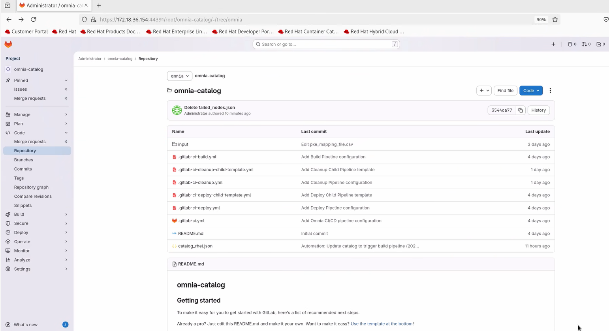

.. _how-to-buildstream-gitlab-deployment:

Step 4:  Deploy GitLab for BuildStreaM Integration: Automated Pipeline Execution and Build Monitoring
============================================================================================

GitLab serves as the automation engine for BuildStreaM, providing the pipeline execution framework that processes catalog definitions and orchestrates the build workflows. Deploy GitLab to enable automated pipeline execution, catalog management, image building, and cluster node discovery. This procedure covers GitLab installation, project setup, runner verification, and service validation.

Prerequisites
-------------

Before deploying GitLab for BuildStreaM:

* Ensure that Omnia BuildStreaM container, PostgreSQL container, and Playbook Watcher service are deployed on the OIM node (see :ref:`Prepare the Omnia Infrastructure Manager <prepare-oim-buildstream>`)
* The node where GitLab will be deployed must have Internet connectivity.
* A dedicated node is required for BuildStreaM GitLab deployment.
* The node must have sufficient system resources for BuildStreaM (minimum 4 GB RAM, 2 CPU cores, 20 GB free disk space)
* GitLab requires a minimum of 2 CPU cores. More cores may be needed for production workloads.
* OIM node must be accessible from the GitLab node.
* Ensure that BuildStream API server (BuildStream container) is reachable from the GitLab node.
* Ensure that appStream and Base OS repositories are configured and accessible from the GitLab node.
* Ensure that on the GitLab node, SELinux is disabled.

.. important::
   Omnia uses a dedicated GitLab instance for BuildStreaM. This procedure provisions a new GitLab instance specifically configured for BuildStreaM. Currently, existing GitLab setups configured for other purposes are not supported.

BuildStreaM Pipeline Architecture
-------------------------------------------

BuildStreaM introduces a three-pipeline CI/CD architecture that provides better separation of concerns and improved automation:

**Parent Pipeline Router**
   The parent pipeline (``.gitlab-ci.yml``) acts as a router that analyzes the catalog file and dynamically generates child pipelines based on the requested operation type. It determines which child pipeline to trigger based on the ``pipeline_type`` parameter in the catalog metadata.

**Dynamic Child Pipelines**
   The parent pipeline generates child pipelines dynamically for each image in the catalog:

   - **BUILD Pipeline** (``build-pipeline.yml``) - Processes catalog entries with ``pipeline_type: build``. Executes the build workflow through Prepare, Build, and Verify stages to create OS images.
   - **DEPLOY Pipeline** (``deploy-pipeline.yml``) - Processes catalog entries with ``pipeline_type: deploy``. Executes the deployment workflow through Prepare, Deploy, and Verify stages to distribute images to cluster nodes.
   - **CLEANUP Pipeline** (``cleanup-pipeline.yml``) - Processes catalog entries with ``pipeline_type: cleanup``. Executes the cleanup workflow to remove stale artifacts and free storage resources.

**OAuth Integration**
   BuildStreaM uses OAuth 2.0 authentication for GitLab pipeline access to the BuildStream API. The pipeline includes the following OAuth configuration steps:

   - Obtains JWT access token from the Omnia Auth service using client credentials
   - Includes the token in the ``Authorization: Bearer <token>`` header for all API calls
   - Supports token refresh for long-running pipeline operations
   - Validates token scopes (``buildstream:read``, ``buildstream:write``) before API access

This architecture enables:
   - Parallel execution of independent image builds
   - Pipeline type selection through catalog metadata
   - Secure API access with OAuth authentication
   - Better error isolation and recovery

Procedure
---------

1. Use SSH to connect to the ``omnia_core`` container.

   .. code-block:: bash

      ssh omnia_core

2. Navigate to ``/opt/omnia/input/project_default/gitlab_config.yml`` and update the ``gitlab_config.yml`` file. Use the :ref:`GitLab configuration table <buildstream-tables-gitlab-configuration>` for reference.
    
   .. code-block:: bash

      cat /opt/omnia/input/project_default/gitlab_config.yml

3. Navigate to the GitLab directory.

   .. code-block:: bash

      cd /omnia/gitlab

4. Run the ``gitlab.yml`` playbook:

   .. code-block:: bash

      ansible-playbook gitlab.yml

5. When it prompts you to enter the GitLab password, enter the password. Note the password as it is required to access the GitLab project and instance.

This ``gitlab.yml`` playbook performs the following tasks:

- Installs the GitLab instance on the host specified in the ``gitlab_config.yml`` file.
- In the GitLab instance, creates a project with the specified name, visibility, and default branch as configured in the ``gitlab_config.yml`` file.
- Installs GitLab runner as a Podman container.
- Generates a self-signed CA certificate for GitLab on the GitLab node at ``/root/gitlab-certs/ca.crt``
- Adds the project with the following files:
   - **README.MD** - Project documentation
   - **catalog_rhel.json** - Default catalog file
   - **.gitlab-ci.yml** - Parent pipeline router configuration file
   - **build-pipeline.yml** - Build child pipeline template ()
   - **deploy-pipeline.yml** - Deploy child pipeline template ()
   - **cleanup-pipeline.yml** - Cleanup child pipeline template ()

   
.. note::
   The installation may take 10-15 minutes to complete.

6. To avoid **Not Secure** warnings when accessing the GitLab instance, download and import the certificate generated in step 4 to the browser.

Verification
------------
After the installation of GitLab complete, verify the following:

1. Verify you can access the GitLab project URL.

   .. code-block:: text

      https://<gitlab_host>:<gitlab_https_port>/root/<gitlab_project_name>

 The project should contain:
  * ``README.MD`` — Project documentation with setup instructions and usage guidelines
  * ``catalog_rhel.json`` — Default catalog file containing build definitions for RHEL images
  * ``.gitlab-ci.yml`` — Parent pipeline router configuration file ()
  * ``build-pipeline.yml`` — Build child pipeline template ()
  * ``deploy-pipeline.yml`` — Deploy child pipeline template ()
  * ``cleanup-pipeline.yml`` — Cleanup child pipeline template ()

2. Verify runner status through GitLab web interface:

   1. Navigate to **Settings** → **CI/CD**.
   2. Expand **Runners** section.
   3. Verify the runner shows a **green** status indicator.
   4. Confirm runner is set to **Running Always** with **Podman Container**.

3. Verify OAuth configuration ( only):

   If you have enabled OAuth 2.0 authentication in the BuildStream configuration, verify the following:

   - Check that the ``omnia_auth`` service is running on the OIM node:

     .. code-block:: bash

        systemctl status omnia_auth.service

   - Verify OAuth client credentials are configured in the GitLab pipeline environment variables (``BS_OAUTH_CLIENT_ID``, ``BS_OAUTH_CLIENT_SECRET``).
   - Test OAuth token retrieval by running a test pipeline job that includes the OAuth authentication script.

Next Steps
----------

After completing GitLab deployment, update the catalog file to automatically trigger the pipeline. See :doc:`how-to-update-catalog-pipeline`.

.. note::
   BuildStreaM introduces a three-pipeline architecture (parent router + dynamic child pipelines) and OAuth 2.0 authentication. For detailed information on  pipeline architecture and configuration, see :doc:`buildstream-release2-pipelines` and :doc:`buildstream-release2-api-reference`.

