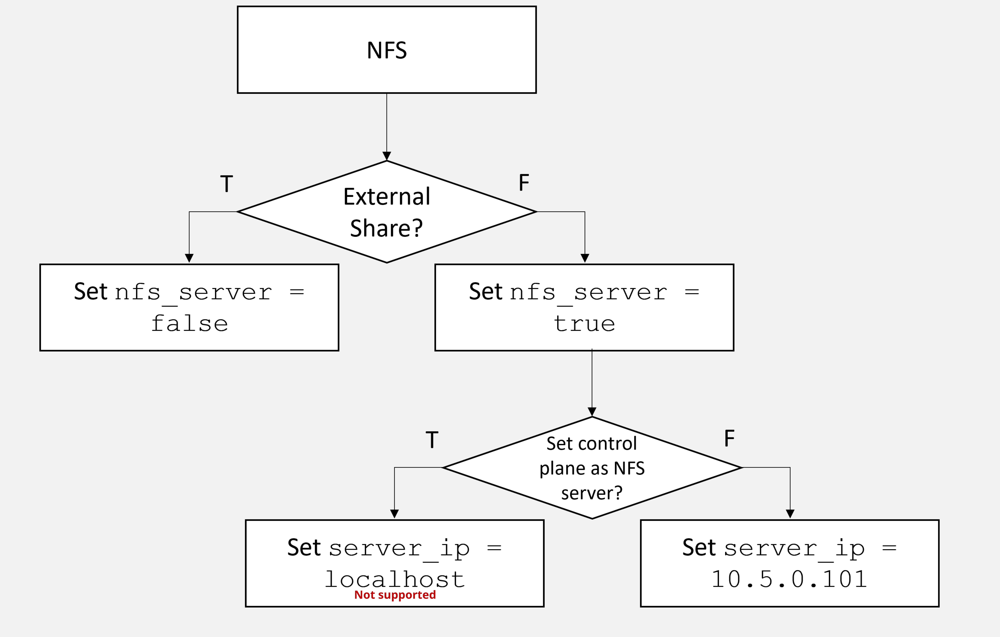

Configure NFS
=============

Set up Network File System (NFS) shared storage for your Omnia cluster. NFS
provides a common filesystem accessible by all compute and login nodes for
home directories, job data, and shared applications.

Overview
--------

Omnia supports two NFS deployment models:

#. **Internal NFS** (managed by Omnia) -- Omnia configures an NFS server on a
   designated node (typically the Slurm control node or a dedicated storage
   node) and auto-mounts it on all compute and login nodes.

#. **External NFS** -- You provide an existing NFS server (e.g., Dell
   PowerScale, NetApp, or a standalone NFS appliance), and Omnia configures
   the mount on all cluster nodes.

Both models use:

- **NFSv3** protocol (for broad compatibility with HPC workloads).
- **755 permissions** on shared directories.
- ``no_root_squash`` option for root-level access from compute nodes.

Prerequisites
-------------

- Cluster nodes are provisioned and reachable.
- For **internal NFS**: the designated NFS server node has sufficient local
  disk space for the shared data.
- For **external NFS**: the NFS server is configured and exporting the
  desired path, and the server IP is reachable from all cluster nodes.
- ``nfs-utils`` package is available in the local repositories.

Procedure
---------

Internal NFS (Omnia-Managed)
~~~~~~~~~~~~~~~~~~~~~~~~~~~~

#. **Configure NFS in omnia_config.yml**:

**Run on: omnia_core container**

.. code-block:: bash
      vi /opt/omnia/input/project_default/omnia_config.yml

   Set the NFS parameters:

**File: /opt/omnia/input/project_default/omnia_config.yml**

.. code-block:: yaml
      ---
      enable_omnia_nfs: true
      nfs_node_group: "slurm_control_node"
      omnia_nfs_path: "/home"
      omnia_nfs_opts: "rw,sync,no_root_squash,no_subtree_check"

#. **Run the omnia.yml playbook** to deploy NFS:

**Run on: omnia_core container**

.. code-block:: bash
      cd /omnia
      ansible-playbook omnia.yml --ask-vault-pass

   The playbook will:

  - Install ``nfs-utils`` on the NFS server node.
  - Create the shared directory with 755 permissions.
  - Configure ``/etc/exports`` with ``no_root_squash``.
  - Start and enable the ``nfs-server`` service.
  - Mount the NFS share on all compute and login nodes.
  - Add the mount to ``/etc/fstab`` for persistence across reboots.

External NFS
~~~~~~~~~~~~

#. **Configure external NFS in omnia_config.yml**:

**Run on: omnia_core container**

.. code-block:: bash
      vi /opt/omnia/input/project_default/omnia_config.yml

**File: /opt/omnia/input/project_default/omnia_config.yml**

.. code-block:: yaml
      ---
      enable_omnia_nfs: false
      external_nfs_server: "10.5.1.100"
      external_nfs_path: "/ifs/omnia/home"
      external_nfs_mount_point: "/home"
      external_nfs_opts: "rw,hard,intr,nfsvers=3"

#. **Run the omnia.yml playbook**:

**Run on: omnia_core container**

.. code-block:: bash
      cd /omnia
      ansible-playbook omnia.yml --ask-vault-pass

#. **(Alternative) Manual NFS mount** on a specific node:

**Run on: compute node**

.. code-block:: bash
      dnf install -y nfs-utils
      mkdir -p /home
      mount -t nfs -o rw,hard,intr,nfsvers=3 10.5.1.100:/ifs/omnia/home /home

   Add to ``/etc/fstab`` for persistence:

**Run on: compute node**

.. code-block:: bash
      echo "10.5.1.100:/ifs/omnia/home /home nfs rw,hard,intr,nfsvers=3 0 0" >> /etc/fstab

Verification
------------

#. **Verify the NFS server is exporting** (internal NFS):

**Run on: NFS server node**

.. code-block:: bash
      exportfs -v

   Expected output:

**Expected output on: NFS server node**

.. code-block:: text
      /home  <network>(rw,sync,wdelay,no_root_squash,no_subtree_check,...)

#. **Verify NFS is mounted on compute nodes**:

**Run on: omnia_core container**

.. code-block:: bash
      ansible slurm_node -m shell -a "df -h /home"

#. **Test read/write from a compute node**:

**Run on: compute node**

.. code-block:: bash
      echo "NFS test $(date)" > /home/nfs_test.txt
      cat /home/nfs_test.txt
      rm /home/nfs_test.txt

#. **Verify permissions**:

**Run on: NFS server node**

.. code-block:: bash
      ls -ld /home
      # Expected: drwxr-xr-x (755)

#. **Verify mount persists across reboot**:

**Run on: compute node**

.. code-block:: bash
      grep "/home" /etc/fstab

Next Steps
----------

- :doc:`Configure Powervault <configure_powervault>` -- Configure block storage for additional
  performance.
- :doc:`Setup Slurm <../Slurm/setup_slurm>` -- Slurm uses NFS for shared job scripts
  and results.
- :doc:`Use Apptainer <../Containers/use_apptainer>` -- Store SIF images on NFS for
  cluster-wide access.

Troubleshooting
---------------

**Mount fails with "access denied"**
   Verify the NFS export allows the client IP:

**Run on: NFS server node**

.. code-block:: bash
      exportfs -v
      cat /etc/exports

   Ensure the export includes the admin network range:

**File: /etc/exports on NFS server node**

.. code-block:: text
      /home 10.5.0.0/24(rw,sync,no_root_squash,no_subtree_check)

**"mount.nfs: Connection timed out"**
   Check firewall rules on the NFS server:

**Run on: NFS server node**

.. code-block:: bash
      firewall-cmd --add-service=nfs --permanent
      firewall-cmd --add-service=mountd --permanent
      firewall-cmd --add-service=rpc-bind --permanent
      firewall-cmd --reload

**Stale NFS handles after server restart**
   Remount on affected nodes:

**Run on: affected compute node**

.. code-block:: bash
      umount -l /home
      mount /home

**Performance is slow**
  - Use NFSv3 instead of NFSv4 for HPC workloads (NFSv3 has lower latency).
  - Increase the NFS read/write block size:

**File: /etc/fstab on compute node**

.. code-block:: text
        10.5.1.100:/ifs/omnia/home /home nfs rw,hard,intr,nfsvers=3,rsize=1048576,wsize=1048576 0 0

