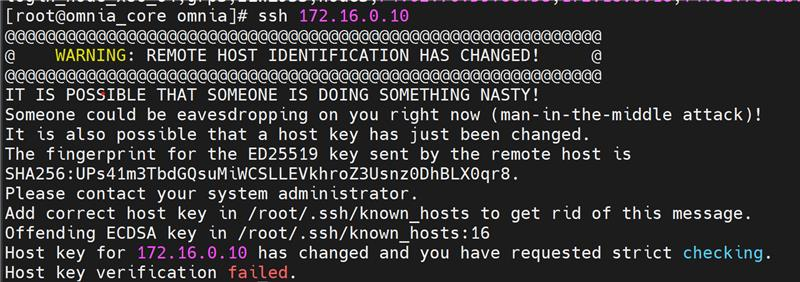

Provision
==========

⦾ **Why am I unable to do ssh to the booted nodes via omnia_core container?**

**Potential Causes**: This issue is due to SSH host key mismatch.

**Resolution**: User needs to manually run the below command inside omnia_core container: ::

        ssh-keygen -R  <node_admin_ip> 

This removes all SSH entries for that IP from your ``local ~/.ssh/known_hosts`` file.

⦾ **Why are the hostname and root password not configured on the nodes after boot?**

**Potential Causes**: Cloud-init is not properly loaded on the target servers during provisioning. For more information, see `Inconsistent cloud-init behavior with multiple node group configurations <https://github.com/OpenCHAMI/cloud-init/issues/89>`_.

**Resolution**: Wait for 5 minutes and retry provisioning the node. If the issue persists, redeploy the cluster after running the ``oim_cleanup.yml`` playbook.