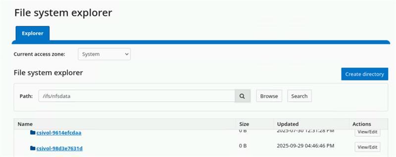

Deploy CSI drivers for Dell PowerScale storage solutions
===========================================================

Dell PowerScale is a flexible and secure scale-out NAS (network attached storage) solution designed to simplify storage requirements for AI and HPC workloads. To enable the PowerScale storage solution on the Kubernetes clusters, Omnia installs the Dell CSI PowerScale driver (version 2.15.0) on the nodes using helm charts. Once the PowerScale CSI driver is installed, the PowerScale nodes can be connected to the Kubernetes clusters for storage requirements.
To know more about the CSI PowerScale driver, `click here <https://dell.github.io/csm-docs/docs/getting-started/installation/kubernetes/powerscale/helm/>`_.

.. note:: Omnia doesn't configure any PowerScale device via OneFS (operating system for PowerScale). Omnia configures the deployed Kubernetes cluster to interact with the PowerScale storage.

PowerScale SmartConnect [Optional]
-------------------------------------

* To utilize the PowerScale SmartConnect hostname, it is necessary for the user to have an upstream DNS server that includes delegation mappings of hostname to PowerScale IP addresses. During the provisioning of cluster nodes, users can specify the IP of the upstream ``DNS`` server in the ``/opt/omnia/input/project_default/network_spec.yml`` file. This ensures that the Omnia cluster recognizes and is aware of the upstream DNS server, enabling the use of PowerScale SmartConnect hostname functionality. For example: ::

    ---
        Networks:
        - admin_network:
            oim_nic_name: <network name>
            netmask_bits: "24"
            primary_oim_admin_ip: "172.16.107.254"
            primary_oim_bmc_ip: ""
            dynamic_range: "172.16.107.201-172.16.107.250"
            dns: [<'upstream DNS server'>]          
    
    Example: dns: ["10.x.x.x", "11.x.x.x"]

* If you did not specify the upstream DNS server during the provisioning process and wish to utilize PowerScale SmartConnect afterwards, first add the upstream DNS server IP to the ``DNS`` entry in ``/opt/omnia/input/project_default/network_spec.yml``  and then run the ``discovery.yml`` playbook again.

Prerequisites
--------------

1. Ensure that the storage and data networks are configured correctly via DHCP. 

2. Upstream DNS resolution must be available from both the admin (PXE) and storage networks.

3. Verify that the PowerScale system is operational.

4. Download the ``secret.yaml`` file template from this `link <https://github.com/dell/csi-powerscale/blob/release/v2.15.0/samples/secret/secret.yaml>`_.

5. Update the following parameters in the ``secret.yaml`` file as per your cluster details and keep the rest as default values. For example:

    *	clusterName: <desired cluster name>
    *	endpoint: <endpoint_IP>
    .. note:: If PowerScale SmartConnect hostname is configured, user can provide the PowerScale hostname for ``endpoint``. Otherwise user can provide PowerScale IP address as well. Ensure that the Powerscale hostname is reachable from OIM.
    *	endpointPort: <endpoint_port>
    *	isDefault: true

   *Reference values from OneFS portal:*

   .. image:: ../../images/csi_powerscale_1.png

6. Download the ``values.yaml`` files template using the following command: ::

    wget https://raw.githubusercontent.com/dell/helm-charts/csi-isilon-2.15.0/charts/csi-isilon/values.yaml

7. Update the following parameters in the ``values.yaml`` file and keep the rest as default values. Refer the below sample values:

    * controllerCount: 1

    * replication:

        enabled: false

    * snapshot:

        enabled: true

    * resizer:

        enabled: false

    * healthMonitor:

        enabled: false

    * endpointPort:8080

    * skipCertificateValidation: true

    * isiAccessZone: System

    * isiPath: /ifs/data/csi

8. Ensure that ``get_config_credentials.yml`` playbook has been executed and the ``omnia_config_credentials`` file has been generated. Once that's done, add the values for ``csi_username`` and ``csi_password`` to that file.

9. Enable ``auth_basic`` for the PowerScale devices: Omnia authenticates and connects with PowerScale devices using basic authentication. To check and enable basic authentication from PowerScale's end, do the following:

    i. Establish an SSH connection with the PowerScale node.
    ii. Execute the following command: 
        ::
            cat /usr/local/apache2/conf/webui_httpd.conf | grep -A 20 "# Platform API"
    iii. Check the response and see if ``IsiAuthTypeBasic Off`` is displayed. If yes, it means that basic auth is not enabled from PowerScale. Use the following command to activate it:
         ::
            isi_gconfig -t web-config auth_basic=true

.. note:: In order to integrate PowerScale solution to the deployed Kubernetes cluster, Omnia requires the following fixed parameter values in ``values.yaml`` file:

    * controllerCount: 1
    * Replication: false
    * Snapshot: true
    * skipCertificateValidation: true

.. note:: Once the PowerScale CSI driver has been deployed, the parameters in the ``values.yaml`` can't be changed. If the user wants to modify the ``values.yaml`` file, they must first uninstall the PowerScale CSI driver from the steps mentioned in the Uninstallation section and then manually re-install the Powerscale with the following commands::

        1. kubectl create namespace isilon
 
        2. kubectl create secret generic isilon-creds -n isilon --from-file=config="/opt/omnia/csi-driver-powerscale/secret.yaml"
        
        3. kubectl apply -f /opt/omnia/csi-driver-powerscale/empty_isilon-certs.yaml
        
        4. cd csi-powerscale/external-snapshotter/

            kubectl apply -f client/config/crd/

            kubectl apply -f deploy/kubernetes/snapshot-controller/
        
        5. ./csi-install.sh --namespace isilon --values /opt/omnia/csi-driver-powerscale/values.yaml
        
        6. kubectl apply -f /opt/omnia/csi-driver-powerscale/ps_storage_class.yml
 

Steps
--------------------------------------------

1. Once ``secret.yaml`` and ``values.yaml`` are filled up with the necessary details, run the ``discovery.yml`` to configure the cluster with k8s and CSI in diskless mode.

2. Add the ``csi_driver_powerscale`` entry along with the driver version to the ``/opt/omnia/input/project_default/software_config.json`` file: ::

    {"name": "csi_driver_powerscale", "version":"v2.15.0", "arch": ["x86_64"]}

 .. note:: By default, the ``csi_driver_powerscale`` entry is not present in the ``software_config.json``.

3. Execute the ``local_repo.yml`` playbook to download the required artifacts to the OIM: ::

    cd local_repo
    ansible-playbook local_repo.yml

4. Add the filepath of the ``secret.yaml`` and ``values.yaml`` file to the ``csi_powerscale_driver_secret_file_path`` and ``csi_powerscale_driver_values_file_path`` variables respectively, present in the ``/opt/omnia/input/project_default/omnia_config.yml`` file.

5. Execute the ``discovery.yml`` playbook to install the PowerScale CSI driver on the ``service_k8s_clusters``. See `High Availability <../RHEL_new/HighAvailability/index.html>`_.  To check the prerequisites for ``discovery.yml``, see `Discovery <../RHEL_new/Provision/index.html>`_ and `Prerequisites <../RHEL_new/Provision/provisionprereqs.html>`_

  .. dropdown:: Service Kubernetes cluster

    ::

      cd discovery
      ansible-playbook discovery.yml

Expected Results
------------------

* After the successful execution of the ``discovery.yml`` playbook, the PowerScale CSI driver is deployed in the isilon namespace.
* Along with PowerScale driver installation a storage class named **ps01** is also created. The details of the storage class are as follows: ::

        apiVersion: storage.k8s.io/v1
        kind: StorageClass
        metadata :
            name: <storage class name>
        provisioner: csi-isilon.dellemc.com
        reclaimPolicy: Retain
        allowVolumeExpansion: true
        volumeBindingMode: Immediate
        parameters :
            clusterName: <powerscale cluster name > #optional
            AccessZone: System
            AzServiceIP: <PowerScale SmartConnect hostname or PowerScale IP> #optional
            Isipath: <isipath configured in powerscale > #sample: /ifs/data/csi/
            RootClientEnabled: "true"
            csi.storage.k8s.io/fstype: "nfs"
            

* If there are errors during CSI driver installation, uninstall the CSI driver first as per the steps mentioned in the Uninstallation section. Ensure that the prerequisites are met. Manually re-install the Powerscale with the following commands::

        1. kubectl create namespace isilon
 
        2. kubectl create secret generic isilon-creds -n isilon --from-file=config="/opt/omnia/csi-driver-powerscale/secret.yaml"
        
        3. kubectl apply -f /opt/omnia/csi-driver-powerscale/empty_isilon-certs.yaml
        4. cd csi-powerscale/external-snapshotter/
            kubectl apply -f client/config/crd/
            kubectl apply -f deploy/kubernetes/snapshot-controller/
        
        5. ./csi-install.sh --namespace isilon --values /opt/omnia/csi-driver-powerscale/values.yaml
        
        6. kubectl apply -f /opt/omnia/csi-driver-powerscale/ps_storage_class.yml

Post installation
-------------------

**[Optional] Create custom storage class**

If user wants to create a custom storage class, they can do so by following the sample storage class `template <https://github.com/dell/csi-powerscale/blob/main/samples/storageclass/isilon.yaml>`_.

*Sample storageclass template*: ::

    apiVersion: storage.k8s.io/v1
    kind: StorageClass
    metadata :
        name: <storage class name>
    provisioner: csi-isilon.dellemc.com
    reclaimPolicy: Retain
    allowVolumeExpansion: true
    volumeBindingMode: Immediate
    parameters :
        clusterName: <powerscale cluster name > #optional
        AccessZone: System
        AzServiceIP: <PowerScale SmartConnect hostname or PowerScale IP> #optional
        Isipath: <isipath configured in powerscale > #sample: /ifs/data/csi/
        RootClientEnabled: "true"
        csi.storage.k8s.io/fstype: "nfs"
    
    

.. note::

    * If PowerScale SmartConnect hostname is configured and the delegated host list is set up in the external DNS server, then the user can provide the PowerScale hostname for ``AzServiceIP``. Otherwise user can provide PowerScale IP address as well.
    * If there are any changes to the storage class parameters in a PowerScale cluster, the user must update the existing storage class or create a new one as needed.

**Apply storage class**

Use the following command to apply the storageclass: ::

    kubectl apply -f <storageclass name>

**Create Persistent Volume Claim (PVC)**

Once the storage class is created, the same can be used to create PVC.

*Sample deployment with PVC*: ::

    apiVersion: v1
    kind: PersistentVolumeClaim
    metadata:
        name: pvc-powerscale
    spec:
        accessModes:
            - ReadWriteMany
        resources:
            requests:
                storage: 1Gi
        storageClassName: ps01
    --- 
    apiVersion: apps/v1
    kind: Deployment
    metadata:
      name: deploy-busybox-01
    spec:
        strategy:
            type: Recreate
        replicas: 1
        selector:
          matchLabels:
           app: deploy-busybox-01
        template:
            metadata:
              labels:
                app: deploy-busybox-01
        spec:
            containers:
             - name: busybox
                image: docker.io/library/busybox:1.36
                command: ["sh", "-c"]
                args: ["while true; do touch /data/datafile; rm -f /data/datafile; done"]
                volumeMounts:
                 - name: data
                    mountPath: /data
        volumes:
            - name: data
               persistentVolumeClaim:
               claimName: pvc-powerscale
 
**Apply the deployment manifest along with PVC**

Use the following command to apply the manifest: ::

    kubectl apply -f <manifest_filepath>

*Expected Result*:

* Once the above manifest is applied, a PVC is created under name ``pvc-powerscale`` and is in ``Bound`` status. Use the ``kubectl get pvc -A`` command to bring up the PVC information. For example: ::

    root@node001:/opt/omnia/csi-driver-powerscale/csi-powerscale/dell-csi-helm-installer# kubectl get pvc -A
    NAMESPACE   NAME                STATUS   VOLUME           CAPACITY   ACCESS MODES   STORAGECLASS   VOLUMEATTRIBUTESCLASS   AGE
    default     pvc-powerscale      Bound    csivol-98d3e7631d       1Gi        RWX            ps01           <unset>                 27h

* User can also verify the same information from the OneFS portal. In the sample image below, it is mapped with the ``VOLUME`` entry from the above example: ``csivol-98d3e7631d``:

Uninstallation
----------------

To uninstall the PowerScale CSI driver manually, do the following:

1. Login to the ``service_kube_control_plane_first``.

2. Execute the following command to switch to the ``dell-csi-helm-installer`` directory: ::

    cd /opt/omnia/csi-driver-powerscale/csi-powerscale/dell-csi-helm-installer

3. Once you're inside the ``dell-csi-helm-installer`` directory, use the following command to trigger the ``csi-uninstall`` script: ::

    ./csi-uninstall.sh --namespace isilon

4. After running the previous command, the PowerScale driver is removed. But, the secret and the created PVC are not removed. If users want to remove them, they need to do it manually from the "isilon" namespace.

5. If users don't want to use PowerScale anymore, they can remove the following as well:

    a. Remove the PowerScale secret by executing the following commands one after the other:

         i. ``kubectl delete secret isilon-creds -n isilon``

         ii. ``kubectl delete secret isilon-certs-0 -n isilon``

    b. Remove any custom user deployment and PVC that was using PowerScale storage class.

    c. Remove the PowerScale storage class.

.. note:: In case OneFS portal credential changes, users need to perform following steps to update the changes to the ``secret.yaml`` manually:

    1. Update the ``secret.yaml`` file with the changed credentials.
    2. Login and copy the ``secret.yaml`` file to the ``kube_control_plane``.
    3. Delete the existing secret by executing the following command: ::

        kubectl delete secret isilon-creds -n isilon

    4. Create the new secret from the updated ``secret.yaml`` file by executing the following command: ::

        kubectl create secret generic isilon-creds -n isilon --from-file=config=<updated secret.yaml filepath>

6. Delete the snapshot controller deployment:

    :: 
           
            kubectl delete deployments snapshot-controller -n kube-system

