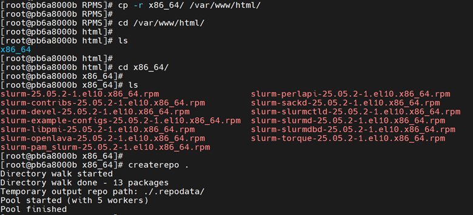
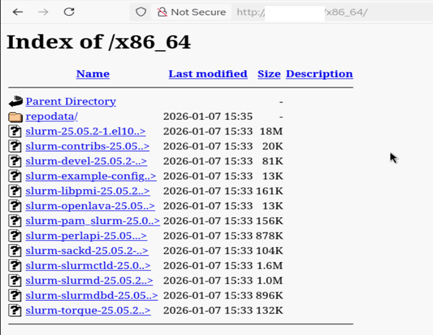

Host the RPMS on the Apache server
=========================================

**Prerequisites**

Make sure the server on which you want to host the repository is accessible from the OIM.

1. Update system packages. ::
    
        dnf update -y

2. Install Apache (https). ::

         dnf install -y httpd

3. Install createrepo. ::

        dnf install createrepo

4. Start and enable Apache. ::

        systemctl start httpd
        systemctl enable httpd

5. Verify the HTTP status. ::

        systemctl status httpd

The status should be Active.

6. Create a directory and copy the RPMs to ``/var/www/html/<new_directory_name>``, then navigate to that directory and run the command ``“createrepo .”,`` as shown in the image below.

If you want to host the repository in a custom port, do the following:

1. Open the file ``/etc/httpd/conf/httpd.conf``, find the 'Listen'  parameter in the file, and then update the required port. ::

        cat /etc/httpd/conf/httpd.conf      | grep Listen
        # Listen: Allows you to bind Apache to specific IP addresses and/or
        # Change this to Listen on a specific IP address, but note that if
        #Listen 12.34.56.78:80
        Listen 8080

Run the command: ::

        systemctl restart httpd
        systemctl status httpd

