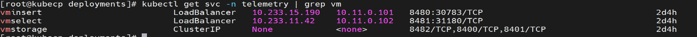

Collect telemetry data from external client nodes to Victoria DB (Cluster Mode)
===============================================================================

This section describes how to create a new metric in VictoriaMetrics and configure an external telemetry producer to stream metrics 
securely into the Service Kubernetes cluster using TLS.

This procedure assumes that VictoriaMetrics is deployed in **cluster mode** inside the ``telemetry`` namespace of the Service Kubernetes cluster.
For more details, see the `VictoriaMetrics Cluster Mode documentation <https://docs.victoriametrics.com/victoriametrics/cluster-victoriametrics/>`_.

Prerequisites
---------------

Ensure the following prerequisites are met:

* A Service Kubernetes cluster is running with VictoriaMetrics deployed in the ``telemetry`` namespace.
* External access to VictoriaMetrics is available through:
  
  * LoadBalancer port ``8480`` for ingesting (inserting) data.
  * LoadBalancer port ``8481`` for querying data.

Retrieve the Victoria Select and Insert LoadBalancer IP addresses
------------------------------------------------------------------

On the Service Kubernetes cluster, run the following command to retrieve the LoadBalancer IP addresses 
for the Victoria **select** and **insert** services::

   kubectl get svc -n telemetry | grep vm

Sample output:

Push sample metrics from Omnia core container in the OIM
---------------------------------------------------------------
1. Log in to Omnia core container and navigate to ``/opt/omnia/telemetry/victoria-certs/``::

    ssh omnia_core
    cd /opt/omnia/telemetry/victoria-certs/

2. Add the LoadBalancer insert and select IP addresses to ``/etc/hosts``::

    echo "10.xx.xx.xx vminsert.telemetry.svc.cluster.local" >> /etc/hosts
    echo "10.xx.xx.xx vmselect.telemetry.svc.cluster.local" >> /etc/hosts
  
3. Create a new test metric using the following command::
 
    curl --cacert ca.crt -X POST "https://vminsert.telemetry.svc.cluster.local:8480/insert/0/prometheus/api/v1/import/prometheus" \
    -H "Content-Type: text/plain" \
    -d "test_metric{source=\"external\"} 42"

.. note:: Use ``https://vminsert.telemetry.svc.cluster.local:8480//insert/0/prometheus/api/v1/write`` to push the metrics from external client, such as SmartFabric Manager (SFM). To know more about SFM, see the `VictoriaMetrics Cluster Mode documentation <https://www.dell.com/en-in/shop/ipovw/smartfabric-manager-for-sonic>`_.

4. Push the sample test metrics to Victoria DB using the following command::

    curl --cacert ca.crt -X POST   "https://vminsert.telemetry.svc.cluster.local:8480/insert/0/prometheus/api/v1/import/prometheus"   -H "Content-Type: text/plain"   -d 'cpu_usage{host="server1",job="new"} 75.5
    memory_usage{host="server1",job="new"} 1024
    disk_usage{host="server1",job="new"} 512
    network_rx{host="server1",interface="eth0"} 1000000
    network_tx{host="server1",interface="eth0"} 500000'

5. Use the following commands to query the inserted data from Victoria DB::

    curl --cacert ca.crt -s "https://vmselect.telemetry.svc.cluster.local:8481/select/0/prometheus/api/v1/query?query=new_metric"
    curl --cacert ca.crt -s "https://vmselect.telemetry.svc.cluster.local:8481/select/0/prometheus/api/v1/query_range?query=cpu_usage&start=$(date -d '1 hour ago' +%s)&end=$(date +%s)&step=600s"

