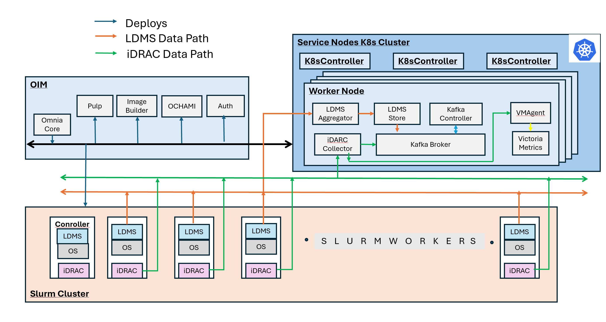

Step 8: Configure Telemetry Requirements
========================================

Omnia enables telemetry collection using both iDRAC Telemetry and LDMS
(Lightweight Distributed Metric Service) in HPC environments. This design ensures that
telemetry components are dynamically provisioned with stateless provisioning tool,
providing flexible deployment and simplified lifecycle management.

* **iDRAC Telemetry** provides out-of-band system metrics from Dell servers, including
  power, thermal, and hardware health information. The iDRAC Telemetry data can be collected
  and streamed to **Kafka** or **VictoriaMetrics**. When **VictoriaMetrics** is selected,
  **VictoriaLogs** is deployed alongside it for centralized log management.

* **LDMS Telemetry** collects in-band performance metrics such as CPU, memory,
  network, and I/O statistics from compute nodes. The LDMS Telemetry data can be collected
  and streamed to **Kafka**.

* **VictoriaLogs** provides centralized log management for the cluster, collecting logs from
  various sources including network devices, storage systems, and fabric managers. VictoriaLogs
  is deployed in cluster mode for high availability and scalability.

.. note::

   Ensure that the ``service_k8s`` entry is mentioned in the ``software_config.json`` file when ``idrac_telemetry_support`` is set to ``true`` in the ``telemetry_config.yml`` file.

Omnia Telemetry Architecture
-----------------------------

Omnia collects telemetry data from HPC cluster nodes using: **LDMS** for OS-level metrics, **iDRAC** for hardware telemetry, and **VictoriaLogs** for centralized log management.

The following diagram illustrates the telemetry services that can be deployed using Omnia and the data flow between the components.

  
Telemetry Components
---------------------

The following components are involved in the telemetry services deployed by Omnia:

**OIM (Omnia Infrastructure Manager)**

Central management node that deploys and configures all telemetry services across the cluster.

**Service Kubernetes Cluster**

Hosts telemetry collection and storage services:

- **LDMS Aggregator** – Receives metrics from Slurm compute node samplers.
- **LDMS Store** – Stores aggregated LDMS data
- **iDRAC Collector** – Collects hardware telemetry via Redfish API
- **Kafka Broker** – Streams telemetry data
- **VMAgent** – Forwards metrics to Victoria Metrics
- **Victoria Metrics** – Time-series database for metric storage
- **VictoriaLogs Cluster** – Distributed log storage system with vlstorage, vlinsert, vlselect components
- **VLAgent** – Platform-managed log collection agent that receives logs from external sources

**Slurm Cluster**

Each Slurm compute node runs:

- **LDMS Sampler** – Collects OS metrics (CPU, memory, network, and I/O)
- **iDRAC** – Provides hardware health data (temperature, power, and fans)

Telemetry Data Flows
---------------------

**LDMS Flow (OS Metrics)**

::

   Slurm Compute Nodes (LDMS Sampler) → LDMS Aggregator → LDMS Store → Kafka

**iDRAC Flow (Hardware Metrics)**

::

   iDRAC (BMC) → iDRAC Collector → Kafka
   iDRAC (BMC) → iDRAC Collector → VMAgent → Victoria Metrics

**VictoriaLogs Flow (Logs)**

::

   External Log Sources (syslog, HTTP) → VLAgent → vlinsert → vlstorage → vlselect

.. toctree::
    :maxdepth: 1

    service_cluster_telemetry
    ldms_telemetry
    deploy_victorialogs
    configure_victorialogs_sources
    query_victorialogs
    victorialogs_config
    troubleshoot_victorialogs
