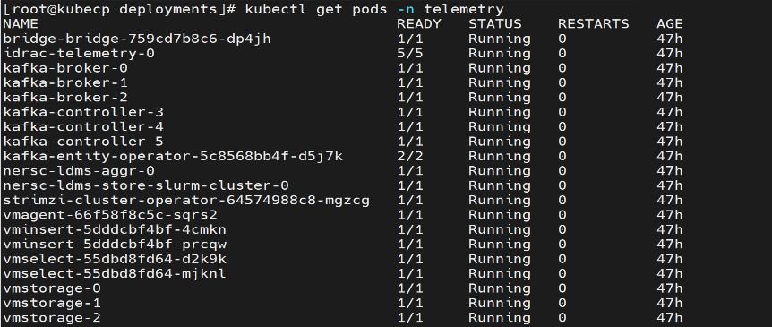
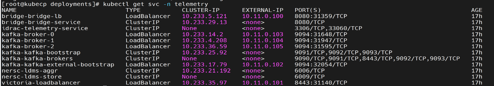
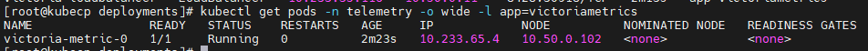
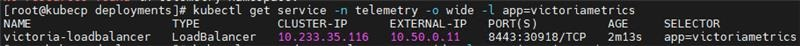
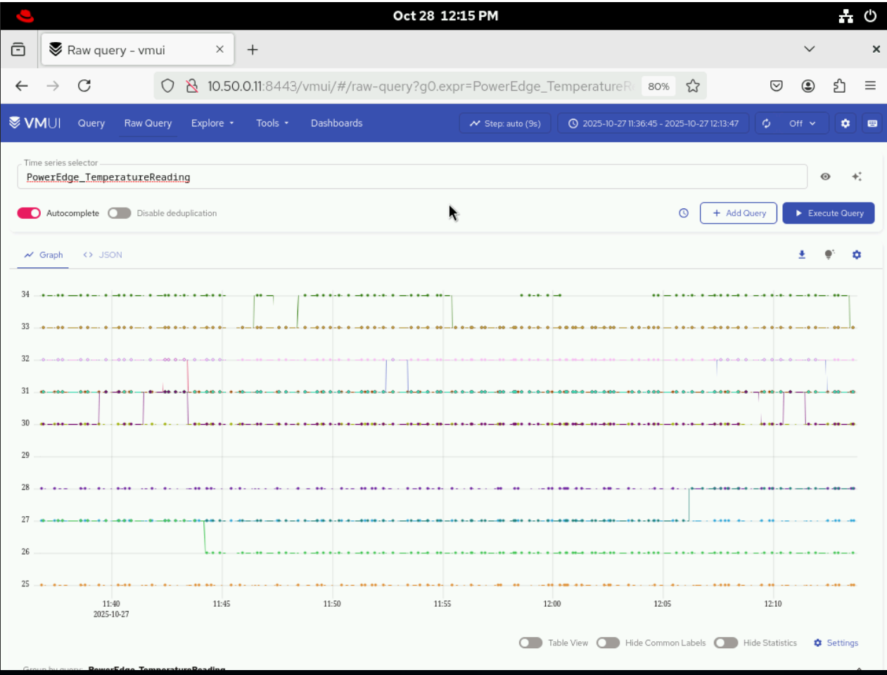
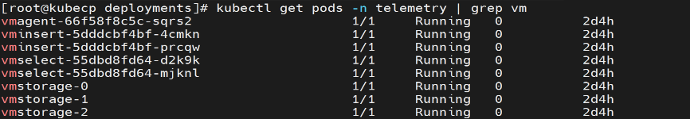
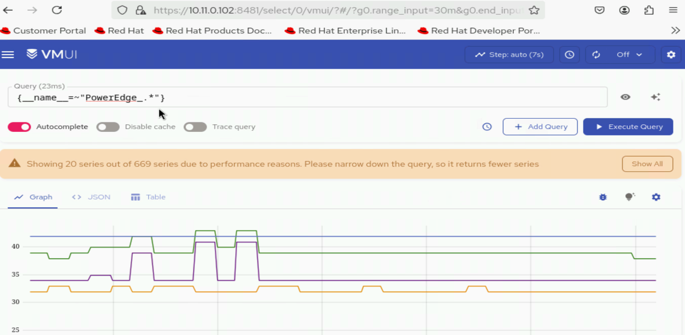

Step 16: Verify Telemetry Services Deployed on the Cluster
===========================================================

This section outlines the steps to validate telemetry services and their components, including checking pod status, 
verifying message flow, confirming TLS connectivity, and reviewing collected telemetry data.

Verify Telemetry-Related Pods Are Running
-------------------------------------------

To verify that the iDRAC Telemetry, Kafka, LDMS, and VictoriaMetrics pods are running, do the following::

1. Run the following command::

    kubectl get pods -n telemetry

2. Ensure that the following pods are in a running state in the output:

    * iDRAC Telemetry pods
    * Kafka broker, controller, and operator pods
    * LDMS aggregator and store pods
    * VictoriaMetrics and vmagent pods

The following is the sample output file:

Verify Kubernetes Telemetry Services Attached to Telemetry 
----------------------------------------------------------

To verify Kubernetes telemetry services attached to the iDRAC Telemetry, Kafka, LDMS, and VictoriaMetrics pods, do the following:

1. Run the following command::

    kubectl get svc -n telemetry

2. Ensure the following service entries exist:

    * iDRAC Telemetry service
    * Kafka broker, controller, and bridge services
    * LDMS aggregator and store services
    * VictoriaMetrics service

The following is the sample output file:

Verify iDRAC Telemetry Messages in Kafka
-------------------------------------------

To verify that iDRAC telemetry data is being successfully published to the ``idrac`` Kafka topic, do the following:

1. Create a Kafka consumer using the following command::

    curl -X POST http://<external load balancer IP of the bridge-bridge-lb service>>:8080/consumers/idrac-consumer-group \
    -H 'content-type: application/vnd.kafka.v2+json' \
    -d '{
            "name": "idrac-consumer-1",
            "format": "json",
            "auto.offset.reset": "earliest"
        }'

2. Subscribe the consumer to the telemetry topic using the following command::

    curl -X POST http://<external loadbalancer IP of the bridge-bridge-lb service>:8080/consumers/idrac-consumer-group/instances/idrac-consumer-1/subscription \
    -H 'content-type: application/vnd.kafka.v2+json' \
    -d '{"topics": ["idrac"]}'

3. Consume messages from the topic using the following command::

    while true; do curl -X GET http://<external loadbalancer IP of the bridge-bridge-lb service>:8080/consumers/idrac-consumer-group/instances/idrac-consumer-1/records \
    -H 'accept: application/vnd.kafka.json.v2+json' | jq '.' ;  sleep 2; done

If telemetry metrics are collected correctly, the output contains JSON-formatted iDRAC telemetry records.

Verify LDMS Messages in Kafka
-----------------------------

To verify that LDMS telemetry data is being successfully published to the ``ldms`` Kafka topic, do the following:

1. Create a Kafka consumer using the following command::

    curl -X POST http://<external loadbalancer IP of the bridge-bridge-lb service>:8080/consumers/ldms-consumer-group \
    -H 'content-type: application/vnd.kafka.v2+json' \
    -d '{
            "name": "ldms-consumer-1",
            "format": "json",
            "auto.offset.reset": "earliest",
            "enable.auto.commit": true
        }'

2. Subscribe the consumer to the LDMS topic using the following command::

    curl -X POST http://<external loadbalancer IP of the bridge-bridge-lb service>:8080/consumers/ldms-consumer-group/instances/ldms-consumer-1/subscription \
    -H 'content-type: application/vnd.kafka.v2+json' \ 
    -d '{"topics": ["ldms"]}'

3. Consume messages from the topic using the following command::

    while true; do curl -X GET http://<external loadbalancer IP of the bridge-bridge-lb service>:8080/consumers/ldms-consumer-group/instances/ldms-consumer-1/records \
    -H 'accept: application/vnd.kafka.json.v2+json' | jq '.' ;  sleep 2; done

If telemetry is flowing correctly, the output contains JSON-formatted LDMS telemetry records.

Verify Kafka TLS Connectivity
-----------------------------
To verify TLS connectivity for Kafka, run the Kafka TLS test job to verify that
certificates, truststores, keystores, and mTLS communication are functioning correctly::

    cd /<nfs client mount path of the service k8s cluster>/telemetry/deployments/test
    kubectl apply -f kafka.tls_test_job.yaml

After the job completes, check the logs to confirm that the TLS connection is successful::

    kubectl logs kafka-tls-test-xxx -n telemetry

Verify VictoriaMetrics TLS Connectivity
---------------------------------------

To verify TLS connectivity for VictoriaMetrics, run the VictoriaMetrics TLS test job to
verify that certificates and secure connectivity are functioning correctly::

    cd /<nfs client mount path of the service k8s cluster>/telemetry/deployments/test
    kubectl apply -f victoria-tls-test-job.yaml

After the job completes, check the logs to confirm that the TLS connection is successful::

    kubectl logs victoria-tls-test-xxx -n telemetry    

View Collected iDRAC Telemetry Data using VictoriaMetrics UI (VMUI) - Single Mode Deployment
----------------------------------------------------------------------------------------------

After applying the ``telemetry.yml`` configuration using the VictoriaMetrics deployment mode as ``single-node``, 
use the (VMUI) to validate that iDRAC telemetry data is being collected and stored 
successfully in a single-mode VictoriaMetrics deployment. For more details, see
`VictoriaMetrics Single Server documentation <https://docs.victoriametrics.com/victoriametrics/single-server-victoriametrics/>`_.

1. Run the following command to verify that the VictoriaMetrics pod is running::

    kubectl get pods -n telemetry -o wide -l app=victoriametrics

2. Run the following command to verify that the VictoriaMetrics service is running::

    kubectl get service -n telemetry -o wide -l app=victoriametrics

3. Note the **External IP** and **port number** of the VictoriaMetrics service. The external IP and port number will be used to access the VictoriaMetrics UI (VMUI).

4. Access the VMUI in a web browser using::

    http://<external victoria metrics loadbalancer IP>:8443/vmui

5. Filter and view telemetry metrics using queries in VMUI.
For example, the following query displays detailed temperature
readings for each hardware component::

    {name="PowerEdge_TemperatureReading", FQDD!=""}

View Collected iDRAC Telemetry Data using VictoriaMetrics UI (VMUI) - Cluster Mode Deployment
----------------------------------------------------------------------------------------------

After applying the ``telemetry.yml`` configuration using the VictoriaMetrics deployment mode as ``cluster``, 
use the (VMUI) to validate that iDRAC telemetry data is being collected and stored 
successfully in a cluster mode VictoriaMetrics deployment. For more details, see 
`VictoriaMetrics Cluster deployment documentation <https://docs.victoriametrics.com/victoriametrics/cluster-victoriametrics/>`_.

1. Run the following command to verify that the VictoriaMetrics pod is running::

    kubectl get pods -n telemetry -o wide | grep vm

2. Run the following command to verify that the VictoriaMetrics service is running::

    kubectl get service -n telemetry -o wide | grep vm

.. image:: ../../../images/victoria_metrics_service_cluster.png

3. Note the **External IP** and **port number** of the VictoriaMetrics service. The external IP and port number will be used to access the VictoriaMetrics UI (VMUI).

4. Access the VMUI in a web browser using::

    https://<external vmselect loadbalancer IP>:8481/select/0/vmui 

5. Filter and view telemetry metrics using queries in VMUI.
For example, the following query displays detailed PowerEdge metrics for each hardware component::

    {__name__=~"PowerEdge_.*"}

    

Accessing the MySQL Database
------------------------------------

After ``telemetry.yml`` has been executed for the service cluster, you can check the mysqldb database inside the ``mysqldb`` container. To view these logs, do the following:

    1. Use the following command to get the names of all the telemetry pods: ::
        
        kubectl get pods -n telemetry -l app=idrac-telemetry

    .. note:: The ``idrac-telemetry-0`` pod will always be responsible for collecting the telemetry data of the management nodes (``oim``, ``service_kube_control_plane_x86_64``, ``service_kube_node_x86_64``, ``login_node_x86_64``, etc.).

    2. Execute the following command: ::

        kubectl exec -it -n telemetry <iDRAC_telemetry_pod_name> -c mysqldb -- mysql -u <MYSQL_USER> -p

    3. When prompted, enter the mysql password to log in.

    4. To enter into the ``idrac_telemetry_db``, use the following command: ::

        use idrac_telemetrydb;

    5. To access the services table: ::
        
        Select * FROM services;