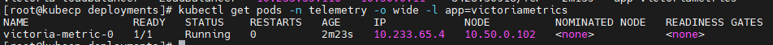
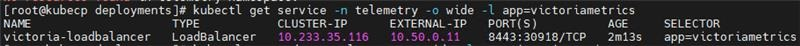
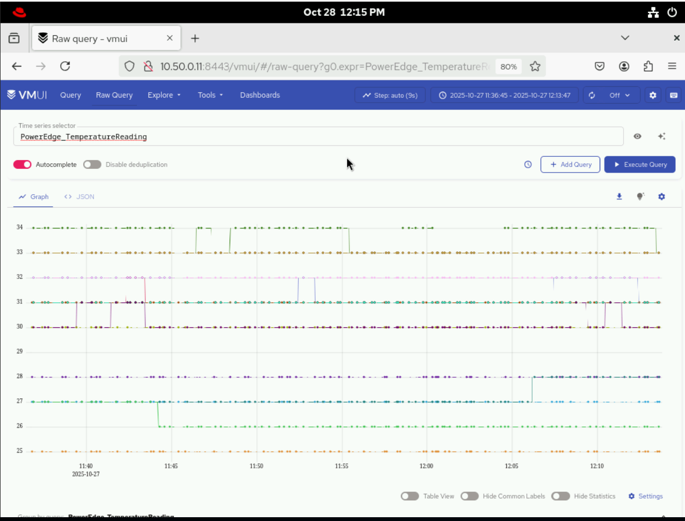
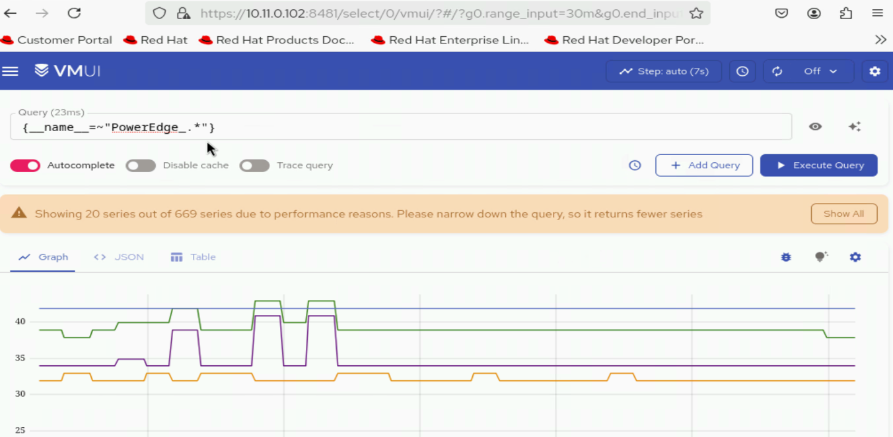

Verify iDRAC Telemetry
=======================

This section outlines the steps to validate iDRAC telemetry services and their components.

.. note:: For the list of iDRAC telemetry metrics collected by Kafka and VictoriaMetrics, see `iDRAC Telemetry Reference Tools <https://github.com/dell/iDRAC-Telemetry-Reference-Tools>`_.

Verify iDRAC Telemetry Messages in Kafka
-------------------------------------------

To verify that iDRAC telemetry data is being successfully published to the ``idrac`` Kafka topic, do the following:

1. Log in to the Service Kubernetes Control plane.

2. Create a Kafka consumer using the following command::

    KAFKA_LB_IP=<external load balancer IP of the bridge-bridge-lb service>
    curl -X POST http://$KAFKA_LB_IP:8080/consumers/idrac-consumer-group \
    -H 'content-type: application/vnd.kafka.v2+json' \
    -d '{
            "name": "idrac-consumer-1",
            "format": "json",
            "auto.offset.reset": "earliest"
        }'

3. Subscribe the consumer to the telemetry topic using the following command::

    curl -X POST http://$KAFKA_LB_IP:8080/consumers/idrac-consumer-group/instances/idrac-consumer-1/subscription \
    -H 'content-type: application/vnd.kafka.v2+json' \
    -d '{"topics": ["idrac"]}'

4. Consume messages from the topic using the following command::

    while true; do curl -X GET http://$KAFKA_LB_IP:8080/consumers/idrac-consumer-group/instances/idrac-consumer-1/records \
    -H 'accept: application/vnd.kafka.json.v2+json' | jq '.' ;  sleep 2; done

If telemetry metrics are collected correctly, the output contains JSON-formatted iDRAC telemetry records.

View Collected iDRAC Telemetry Data using VictoriaMetrics UI (VMUI) - Single Mode Deployment
----------------------------------------------------------------------------------------------

After applying the ``telemetry.yml`` configuration using the VictoriaMetrics deployment mode as ``single-node``,
use the (VMUI) to validate that iDRAC telemetry data is being collected and stored
successfully in a single-mode VictoriaMetrics deployment. For more details, see
`VictoriaMetrics Single Server documentation <https://docs.victoriametrics.com/victoriametrics/single-server-victoriametrics/>`_.

.. note:: Metric availability depends on the server hardware configuration and iDRAC capabilities. Only telemetry metrics that are exposed and streamed by iDRAC can be retrieved and viewed. Metrics that appear as "NA" (Not Available) in iDRAC are not included in telemetry data and therefore do not appear in telemetry queries or views.

1. Run the following command to verify that the VictoriaMetrics pod is running::

    kubectl get pods -n telemetry -o wide -l app=victoriametrics

2. Run the following command to verify that the VictoriaMetrics service is running::

    kubectl get service -n telemetry -o wide -l app=victoriametrics

3. Note the **External IP** and **port number** of the VictoriaMetrics service. The external IP and port number will be used to access the VictoriaMetrics UI (VMUI).

4. Access the VMUI in a web browser using::

    http://<external victoria metrics loadbalancer IP>:8443/vmui

5. Filter and view telemetry metrics using queries in VMUI.
For example, the following query displays detailed temperature
readings for each hardware component::

    {name="PowerEdge_TemperatureReading", FQDD!=""}

View Collected iDRAC Telemetry Data using VictoriaMetrics UI (VMUI) - Cluster Mode Deployment
----------------------------------------------------------------------------------------------

After applying the ``telemetry.yml`` configuration using the VictoriaMetrics deployment mode as ``cluster``,
use the (VMUI) to validate that iDRAC telemetry data is being collected and stored
successfully in a cluster mode VictoriaMetrics deployment. For more details, see
`VictoriaMetrics Cluster deployment documentation <https://docs.victoriametrics.com/victoriametrics/cluster-victoriametrics/>`_.

1. Run the following command to verify that the VictoriaMetrics pod is running::

    kubectl get pods -n telemetry -o wide | grep vm

.. image:: ../../../../images/victoria_metrics_pod_cluster_mode.png

2. Run the following command to verify that the VictoriaMetrics service is running::

    kubectl get service -n telemetry -o wide | grep vm

.. image:: ../../../../images/victoria_metrics_service_cluster.png

3. Note the **External IP** and **port number** of the VictoriaMetrics service. The external IP and port number will be used to access the VictoriaMetrics UI (VMUI).

4. Access the VMUI in a web browser using::

    https://<external vmselect loadbalancer IP>:8481/select/0/vmui

5. Filter and view telemetry metrics using queries in VMUI.
For example, the following query displays detailed PowerEdge metrics for each hardware component::

    {__name__=~"PowerEdge_.*"}

Accessing the MySQL Database
------------------------------------

After ``telemetry.yml`` has been executed for the service cluster, you can check the MySQL database inside the ``mysqldb`` container. To view these logs, do the following:

    1. Use the following command to get the names of all the telemetry pods: ::

        kubectl get pods -n telemetry -l app=idrac-telemetry

    .. note:: The ``idrac-telemetry-0`` pod will always be responsible for collecting the telemetry data of the management nodes (``oim``, ``service_kube_control_plane_x86_64``, ``service_kube_node_x86_64``, ``login_node_x86_64``, etc.).

    2. Execute the following command: ::

        kubectl exec -it -n telemetry <iDRAC_telemetry_pod_name> -c mysqldb -- mysql -u <MYSQL_USER> -p

    3. When prompted, enter the mysql password to log in.

    4. To enter into the ``idrac_telemetry_db``, use the following command: ::

        use idrac_telemetrydb;

    5. To access the services table: ::

        select * from services;
