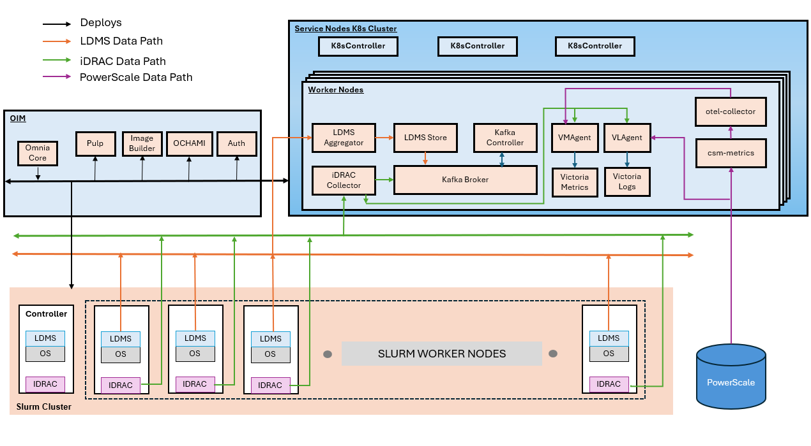

Telemetry Overview
===================

Omnia supports the following telemetry collection to monitor and manage your HPC infrastructure..

* **iDRAC Telemetry** provides out-of-band system metrics from Dell servers, including
  power, thermal, and hardware health information. The iDRAC Telemetry data can be collected
  and streamed to **Kafka** and **VictoriaMetrics**. The iDRAC logs can be collected and streamed to **VictoriaLogs**.

* **LDMS Telemetry** collects in-band performance metrics such as CPU, memory,
  network, and I/O statistics from compute nodes. The LDMS Telemetry data can be collected
  and streamed to **Kafka**.

* **PowerScale Telemetry** collects the PowerScale Telemetry data and logs and streamed to **VictoriaMetrics** and **VictoriaLogs**, respectively.

* **Vector Telemetry Pipeline** provides Kafka-to-Victoria ingestion using Vector for collecting, transforming, and routing telemetry data from LDMS and OpenManage Enterprise (OME) sources to VictoriaMetrics and VictoriaLogs.

.. note::

   To enable any telemetry and log collections (iDRAC telemetry, LDMS, PowerScale telemetry, or PowerScale logs), ensure that the ``service_k8s`` entry is mentioned in the ``software_config.json`` file and ``idrac_telemetry_support`` is set to ``true`` in the ``telemetry_config.yml`` file.

   To enable Vector telemetry bridges, configure the appropriate feature flags in ``telemetry_config.yml``: ``vector_ldms_support`` for LDMS metrics, ``vector_ome_support`` for OME telemetry.

Omnia Telemetry Architecture
-----------------------------

Omnia collects telemetry data from HPC cluster nodes using: **LDMS** for OS-level metrics and **iDRAC** for hardware telemetry.

The following diagram illustrates the telemetry services that can be deployed using Omnia and the data flow between the components.

  

Telemetry Components
---------------------

The following components are involved in the telmetry services deployed by Omnia:

**OIM (Omnia Infrastructure Manager)**

Central management node that deploys and configures all telemetry services across the cluster.

**Service Kubernetes Cluster**

Hosts telemetry collection and storage services:

- **LDMS Aggregator** – Receives metrics from slurm compute node samplers.
- **LDMS Store** – Stores aggregated LDMS data
- **iDRAC Collector** – Collects hardware telemetry via Redfish API
- **Kafka Broker** – Streams telemetry data
- **VMAgent** – Forwards metrics to Victoria Metrics
- **Victoria Metrics** – Time-series database for metric storage
- **VictoriaLogs Cluster** – Distributed log storage system with vlstorage, vlinsert, vlselect components
- **VLAgent** – Platform-managed log collection agent that receives logs from external sources
- **csm-metrics** – Collects PowerScale metrics
- **otel-collector** – Forwards metrics to Victoria Metrics and Victoria Logs
- **CSI Driver for Dell PowerScale:** – Driver required for communication between PowerScale and service Kubernetes nodes
- **Vector** – High-performance data pipeline tool for collecting, transforming, and routing logs and metrics
- **Vector-LDMS** – Kafka consumer for LDMS metrics, routes to VictoriaMetrics via vmagent-vector
- **Vector-OME** – Kafka consumer for OME telemetry, routes metrics to VictoriaMetrics and logs to VictoriaLogs
- **vmagent-vector** – Dedicated vmagent instance as a write-buffer between Vector pods and vminsert
- **vlagent-vector** – Dedicated VictoriaLogs forwarding agent for log/event data from Vector pods

**Slurm Cluster**

Each slurm compute node runs:

- **LDMS Sampler** – Collects OS metrics (CPU, memory, network, and I/O)
- **iDRAC** – Provides hardware health data (temperature, power, and fans)

iDRAC and LDMS Telemetry Data Flows
------------------------------------

**LDMS Flow (OS Metrics)**

::

   Slurm Compute Nodes (LDMS Sampler) → LDMS Aggregator → LDMS Store → Kafka

**iDRAC Flow (Hardware Metrics)**

::

   iDRAC (BMC) → iDRAC Collector → Kafka
   iDRAC (BMC) → iDRAC Collector → VMAgent → Victoria Metrics
   iDRAC (BMC) → iDRAC Collector → VLAgent → Victoria Logs

PowerScale Telemetry Data Flows
------------------------------------

::

   PowerScale Nodes → CSM Metrics PowerScale → OTEL Collector → vmagent(shared) → victoria_metric
   PowerScale Nodes forwards syslog →  vlagent → Victoria Logs

Vector Telemetry Data Flows
-----------------------------

::

   LDMS Store (store_avro_kafka) → Kafka 'ldms' topic → Vector-LDMS → vmagent-vector → vminsert → VictoriaMetrics
   OME → Kafka 'ome.*' topics → Vector-OME → vmagent-vector (metrics) → vminsert → VictoriaMetrics
   OME → Kafka 'ome.*' topics → Vector-OME → vlagent-vector (logs) → vlinsert → VictoriaLogs
