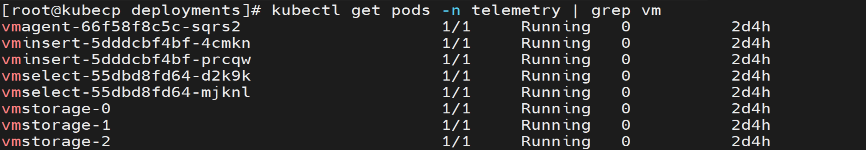
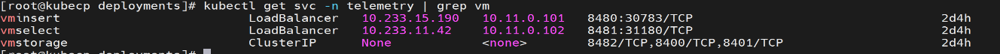
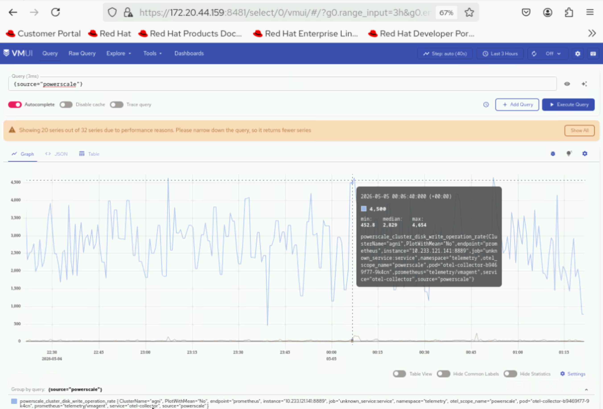

Verify PowerScale Telemetry
============================

This section outlines the steps to validate PowerScale telemetry services.

View Collected PowerScale Telemetry Data using VictoriaMetrics UI (VMUI) - Cluster Mode Deployment
----------------------------------------------------------------------------------------------

After applying the ``telemetry.yml`` configuration using the VictoriaMetrics deployment mode as ``cluster``,
use the (VMUI) to validate that PowerScale telemetry data is being collected and stored
successfully in a cluster mode VictoriaMetrics deployment. For more details, see
`VictoriaMetrics Cluster deployment documentation <https://docs.victoriametrics.com/victoriametrics/cluster-victoriametrics/>`_.

1. Run the following command to verify that the VictoriaMetrics pod is running::

    kubectl get pods -n telemetry -o wide | grep vm

2. Run the following command to verify that the VictoriaMetrics service is running::

    kubectl get service -n telemetry -o wide | grep vm

3. Note the **External IP** and **port number** of the VictoriaMetrics service. The external IP and port number will be used to access the VictoriaMetrics UI (VMUI).

4. Note the **External IP** and **port number** of the VictoriaMetrics service. The external IP and port number will be used to access the VictoriaMetrics UI (VMUI).

5. Run the following command to verify if OTEL collector is receiving telemetry data::

    kubectl logs -n telemetry -l app.kubernetes.io/name=otel-collector --all-containers --tail=50 | grep -i metric

.. image:: ../../../../images/otel_collector_pod_cluster.png

6. Access the VMUI in a web browser using::

    https://<external vmselect loadbalancer IP>:8481/select/0/vmui

7. Filter and view telemetry metrics using queries in VMUI.
For example, the following query displays detailed PowerScale metrics for each hardware component::

    {__name__=~"powerscale"}

