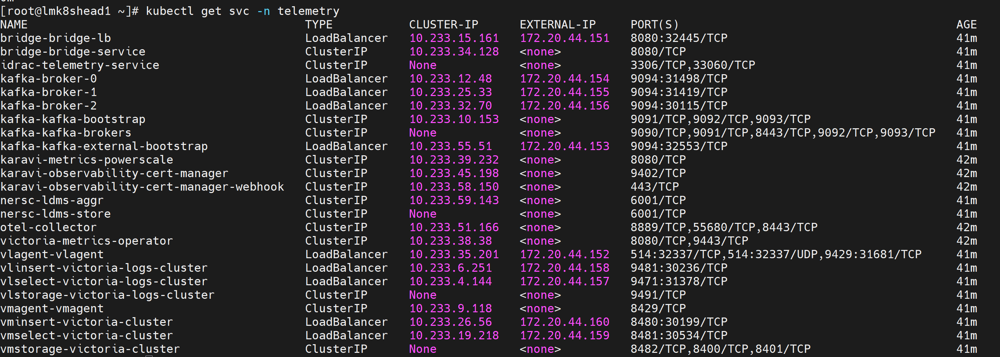

Verify Telemetry Infrastructure
================================

This section outlines the steps to validate telemetry infrastructure services and their components, including checking pod status, verifying services, and confirming TLS connectivity.

Verify Telemetry-Related Pods Are Running
-------------------------------------------

To verify that the iDRAC Telemetry, Kafka, LDMS, VictoriaMetrics, and VictoriaLogs pods are running, do the following:

1. Run the following command::

    kubectl get pods -n telemetry

2. Ensure that the following pods are in a running state in the output:

    * iDRAC Telemetry pods
    * Kafka broker, controller, and operator pods
    * LDMS aggregator and store pods
    * VictoriaMetrics and vmagent pods
    * VictoriaLogs pods
    * PowerScale Telemetry pods

The following is the sample output file:

.. image:: ../../../../images/verify_telemetry_pods.png

Verify Kubernetes Telemetry Services Attached to Telemetry
----------------------------------------------------------

To verify Kubernetes telemetry services attached to the iDRAC Telemetry, Kafka, LDMS, VictoriaMetrics, and VictoriaLogs pods, do the following:

1. Run the following command::

    kubectl get svc -n telemetry

2. Ensure the following service entries exist:

    * iDRAC Telemetry service
    * Kafka broker, controller (bootstrap), and bridge services
    * LDMS aggregator and store services
    * VictoriaMetrics service
    * VictoriaLogs service
    * PowerScale Telemetry service

The following is the sample output file:

Verify Kafka TLS Connectivity
-----------------------------

To verify TLS connectivity for Kafka, run the Kafka TLS test job to verify that
certificates, truststores, keystores, and mTLS communication are functioning correctly::

    cd /<nfs client mount path of the service k8s cluster>/telemetry/deployments/test
    kubectl apply -f kafka.tls_test_job.yaml

After the job completes, check the logs to confirm that the TLS connection is successful::

    kubectl logs kafka-tls-test-xxx -n telemetry

Verify VictoriaMetrics TLS Connectivity
---------------------------------------

To verify TLS connectivity for VictoriaMetrics, run the VictoriaMetrics TLS test job to
verify that certificates and secure connectivity are functioning correctly::

    cd /<nfs client mount path of the service k8s cluster>/telemetry/deployments/test
    kubectl apply -f victoria-tls-test-job.yaml

After the job completes, check the logs to confirm that the TLS connection is successful::

    kubectl logs victoria-tls-test-xxx -n telemetry

View Collected Logs using VictoriaLogs Query Interface
-----------------------------------------------------

After applying the ``telemetry.yml`` configuration with ``idrac_telemetry_collection_type`` set to ``victoria``,
you can access the VictoriaLogs query interface to validate that log data is being collected and stored
successfully.

1. Run the following command to verify that the VictoriaLogs vlselect pod is running::

    kubectl get pods -n telemetry -o wide | grep vlselect

2. Run the following command to verify that the VictoriaLogs vlselect service is running::

    kubectl get service -n telemetry -o wide | grep vlselect

3. Note the **External IP** and **port number** of the VictoriaLogs vlselect service. The external IP and port number will be used to access the VictoriaLogs query interface.

4. Access the VictoriaLogs query interface in a web browser using::

    https://<external vlselect loadbalancer IP>:9471/select/vmui

5. Filter and view logs using LogsQL queries in the query interface.
For example, the following query displays recent log entries::

    * | sort by time desc
