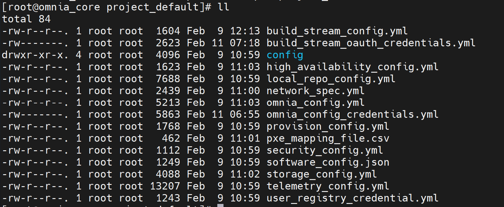

===========================================================================
Step 3: Provide Inputs to the Files in the ``project_default`` Directory
===========================================================================

Omnia is now deployed using a project-based approach. Once the ``omnia_core`` container is deployed, all the input files needed for the cluster will be available in the ``/opt/omnia/input/project_default`` directory on the NFS share.
Before moving on to the next step, which is running the ``prepare_oim.yml`` playbook, you must provide inputs for all the files in this directory.

Here's an example of the input files present in the ``project_default`` directory:

Input Templates for Deployment
===============================

You can use the provided input templates to simplify deployment. Choose the template that matches your cluster architecture and telemetry requirements:

* **x86_64 Slurm cluster with telemetry**: Use the templates available at: :file:`omnia/examples/input_template/bare_metal_slurm/x86_64/with_service_k8s`

* **x86_64 Slurm controller node with ARM-based Slurm nodes and telemetry**:  Use the templates available at: :file:`omnia/examples/input_template/bare_metal_slurm/aarch64/with_service_k8s`

* **x86_64 Slurm cluster without telemetry**: Use the templates available at: :file:`omnia/examples/input_template/bare_metal_slurm/x86_64/without_service_k8s`

* **x86_64 Slurm controller node with ARM-based Slurm nodes without telemetry**: Use the templates available at: :file:`omnia/examples/input_template/bare_metal_slurm/aarch64/without_service_k8s`

Default Values Assumed in these Templates (change if needed):
---------------------------------------------------------------

* Virtual address for Kubernetes cluster: ``172.16.0.1``
* OIM PXE NIC IP address: ``172.16.0.254``
* Mapping file path (provided in the same folder): ``./pxe_mapping_file.csv``
* External NFS share for all Omnia workflows:  
  IP address: ``172.16.0.253``, Path: ``/mnt/share/omnia``
* NFS share for HA on service Kubernetes cluster:  
  IP addresses: ``172.16.0.252``, Path: ``/mnt/share/omnia_k8s``

Additional values you must provide:
------------------------------------

* **Local repository configuration:**  
   * ``rhel_os_url_x86_64`` – BaseOS, AppStream, and CRB repository details for x86_64 node provisioning  
   * ``rhel_os_url_aarch64`` – BaseOS, AppStream, and CRB repository details for aarch64 node provisioning

.. note:: If the RHEL subscription on the OIM is not enabled, the ``rhel_os_url_x86_64`` and ``rhel_os_url_aarch64`` parameters are mandatory. 

* **Telemetry configuration (if enabled):**  
   * ``csi_powerscale_driver_secret_file_path`` – Powerscale driver secret file  
   * ``csi_powerscale_driver_values_file_path`` – Powerscale driver values file

Input Validator
=================

Once all the input files are filled, the input validator can be used to verify if the provided inputs are correct or not.
This helps reduce execution delays at runtime caused by wrong inputs. Use the following command to execute the input validator: ::

    cd input_validation
    ansible-playbook validate_config.yml