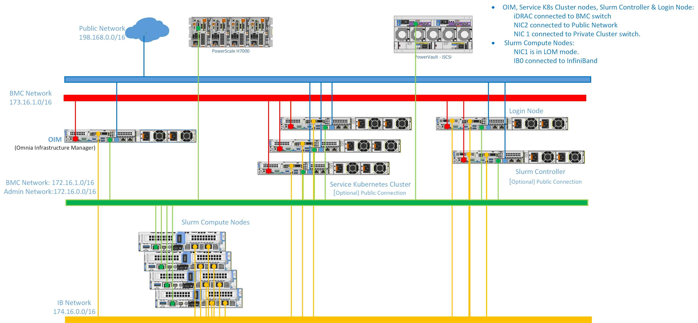

Network Topology: Hybrid Setup
=================================

.. note:: The following diagram is for representational purposes only.

In a **Hybrid Setup**, the OIM and special nodes such as the head and login node are connected to the public network, while the iDRAC and the compute nodes use a shared LOM network.

* **Public Network (Blue line)**: This indicates the external public network which is connected to the internet. NIC2 of the OIM, Service cluster nodes, Head node, Service Kubernetes node, and Login node [optional] is connected to the public network. Along with this, BMC NIC of the Head node is connected.

* **Admin Network and BMC network (Green line)**: This indicates the admin network and the BMC network utilized by Omnia to provision the cluster nodes and to control the cluster nodes using out-of-band management. NIC1 of all the nodes are connected to the private switch.

.. note:: Omnia supports classless IP addressing, which allows the Admin network, BMC network, Public network, and the Additional network to be assigned different subnets. 

**Recommended discovery mechanism**

* `Discovery Mechanism and Mapping File <../../OmniaInstallGuide/RHEL_new/Provision/discover_mechanism_mappingfile.html>`_.
