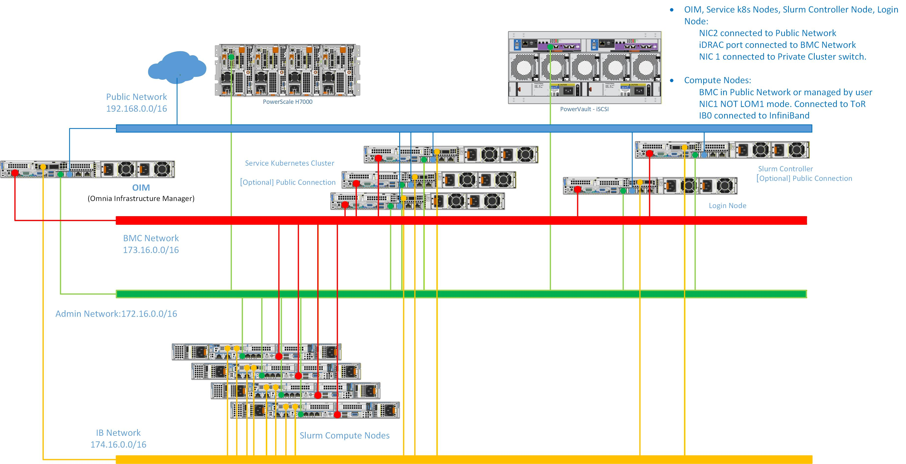

Network Topology: Dedicated Setup
====================================

.. note:: The following diagram is for representational purposes only.

In a **Dedicated Setup**, all the cluster nodes (Head, Compute, and Login [optional]) have dedicated iDRAC connections.

* **Public Network (Blue line)**: This indicates the external public network that is connected to the internet. NIC2 of the OIM, Service cluster nodes, Head node, Service Kubernetes node, and Login node [optional] are connected to the public network.

* **BMC Network (Red line)**: This indicates the private BMC (iDRAC) network used by the OIM to control the cluster nodes using out-of-band management.

* **Admin Network (Green line)**: This indicates the admin network used by Omnia to provision the cluster nodes. NIC1 of all the nodes are connected to the private switch.

.. note:: Omnia supports classless IP addressing, which allows the Admin network, BMC network, Public network, and the Additional network to be assigned different subnets.

**Recommended discovery mechanism**

* `Discovery Mechanism and Mapping File <../../OmniaInstallGuide/RHEL_new/Provision/discover_mechanism_mappingfile.html>`_.

