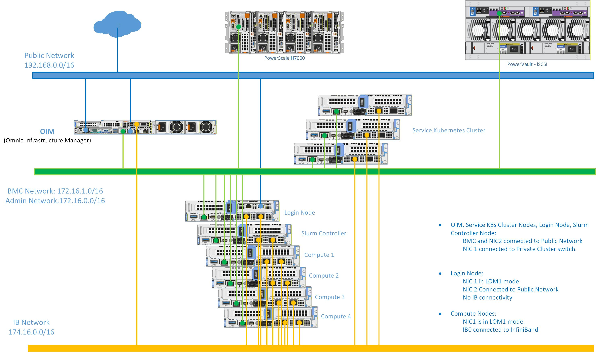

Network Topology: Shared LAN on Motherboard (LOM) Setup
=========================================================

.. note:: The following diagram is for representational purposes only.

In a **Shared LOM setup**, the Administration and BMC logical networks share the same ethernet segment and physical connection.

* **Public Network (Blue line)**: This indicates the external public network which is connected to the internet. NIC2 of the OIM, Service cluster nodes, Service Kubernetes node, and Login node [optional] is connected to the public network.

* **Admin Network and BMC network (Green line)**: This indicates the admin network and the BMC network utilized by Omnia to provision the cluster nodes and to control the cluster nodes using out-of-band management. NIC1 of all the nodes are connected to the private switch.

.. note:: Omnia supports classless IP addressing, which allows the Admin network, BMC network, Public network, and the Additional network to be assigned different subnets.
**Recommended Discovery Mechanism**

* `Discovery Mechanism and Mapping File <../../OmniaInstallGuide/RHEL_new/Provision/discover_mechanism_mappingfile.html>`_.

