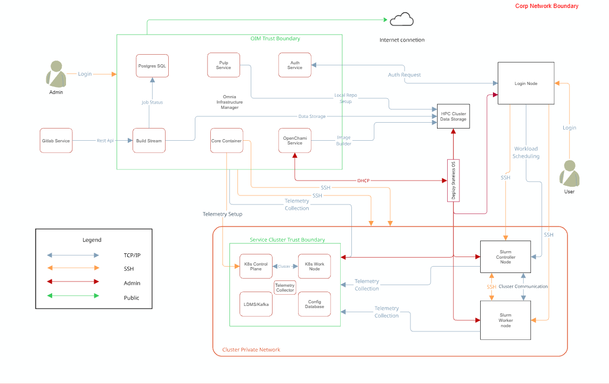

Security Model
==============

Omnia implements a layered security model that protects credentials at rest,
encrypts communication in transit, and centralizes identity management. This
page explains each security layer, the technologies involved, and the design
rationale behind Omnia's security architecture.

Security profiles
-----------------

Omnia requires root privileges during installation because it provisions the
operating system on bare metal servers.

Security Controls Map
---------------------

Omnia performs bare metal configuration to enable AI/HPC workloads. It uses
Ansible playbooks to perform installations and configurations. iDRAC is
supported for provisioning bare metal servers. Omnia enables provisioning of
clusters via PXE using a mapping file **(Mandatory)** to dictate IP
address/MAC mapping.

Omnia can be installed via CLI only. Slurm and Kubernetes are deployed and
configured on the cluster. OpenLDAP is installed for providing authentication.

To perform these configurations and installations, a secure SSH channel is
established between the management node and the following entities:

- ``slurm_control_node``
- ``slurm_node``
- ``login_node``
- ``service_kube_control_node``
- ``service_kube_node``

Security principles
-------------------

Omnia's security design follows four principles:

#. **Defense in depth** -- Multiple independent layers of protection ensure
   that a single compromise does not expose the entire cluster.
#. **Least privilege** -- Services and users receive only the permissions they
   need. Ansible uses ``become`` (sudo) selectively, and Podman containers run
   rootless by default.
#. **Secrets never in plain text** -- All credentials are encrypted at rest
   using AES-256, and sensitive values are never written to log files or
   terminal output.
#. **Centralized identity** -- A single authentication directory (OpenLDAP)
   provides consistent user and group identity across all cluster nodes.

Credential encryption with Ansible Vault
----------------------------------------

All sensitive data in Omnia---including passwords, API tokens, BMC credentials,
and LDAP bind passwords---is encrypted using **Ansible Vault** with
**AES-256** symmetric encryption.

How it works
~~~~~~~~~~~~

#. During initial setup, administrators run the **credential utility**
   (``credential_manager.py`` or the equivalent playbook) to generate and
   encrypt all required credentials.
#. The utility writes each credential to an Ansible Vault-encrypted YAML file.
   The vault password is either provided interactively or stored in a
   vault password file with restricted file permissions (``0600``).
#. When Omnia playbooks execute, Ansible decrypts vault files in memory.
   Decrypted secrets are never written to disk or included in Ansible's output
   logs.

**What is encrypted:**

- OIM administrative passwords
- BMC / iDRAC credentials
- LDAP bind password and admin password
- Kubernetes secrets and tokens
- Pulp administrative credentials
- Telemetry service credentials (Kafka, VictoriaMetrics, Grafana)
- Database passwords for internal services

Login security settings
~~~~~~~~~~~~~~~~~~~~~~~

The following credentials are provided during cluster configuration. Omnia
stores them in an encrypted Ansible Vault in
``input/omnia_config_credentials.yml``, hidden from external visibility and
access:

#. iDRAC/BMC (Username / Password)
#. Provisioning OS (Password)
#. slurmdb_password (Password)
#. DockerHub (Username / Password)
#. OpenLDAP (``openldap_db_username``, ``openldap_db_password``, ``openldap_config_username``, ``openldap_config_password``, ``openldap_monitor_password``)
#. Telemetry (``mysql_user``, ``mysql_password``, ``mysql_root_password``)
#. Minio S3 bucket (Password)
#. Pulp (Password)
#. CSI PowerScale credentials (Username / Password)
#. LDMS Sampler (Password)

.. note::

   AES-256 is a FIPS 140-2 compliant encryption algorithm. The vault password
   itself should be treated with the same care as a root password---store it in
   a secure location and limit access to authorized administrators.

Credential utility
~~~~~~~~~~~~~~~~~~

Omnia provides a dedicated credential management utility that simplifies the
lifecycle of encrypted credentials:

- **Generate** -- Creates strong random passwords for all services and encrypts
  them with Ansible Vault.
- **Rotate** -- Regenerates specific credentials and updates all dependent
  configuration files.
- **View** -- Decrypts and displays a credential (requires the vault password).
- **Rekey** -- Changes the vault encryption password without modifying the
  underlying credentials.

.. tip::

   Rotate credentials periodically, especially BMC and LDAP passwords. The
   credential utility makes this a single-command operation rather than a
   manual multi-file edit.

Centralized authentication with OpenLDAP
----------------------------------------

Omnia adheres to a subset of the specifications of **NIST 800-53** and
**NIST 800-171** guidelines on the OIM and login node.

Omnia does not have its own authentication mechanism because bare metal
installations and configurations take place using root privileges. Post the
execution of Omnia, third-party tools are responsible for authentication to
the respective tool.

Omnia deploys **OpenLDAP** as the central identity provider for the cluster.
Running as a Podman container on the designated ``auth_server`` node, OpenLDAP
stores user accounts, groups, SSH public keys, and POSIX attributes.

.. note::

   Omnia does not configure OpenLDAP users or groups.

SSSD integration
~~~~~~~~~~~~~~~~

Every managed node in the cluster runs **SSSD** (System Security Services
Daemon), which connects to the central OpenLDAP server. SSSD provides:

- **Authentication** -- Users log in with LDAP credentials on any node in the
  cluster. There is no need to create local accounts on each machine.
- **Credential caching** -- SSSD caches credentials locally so that users can
  still authenticate during brief LDAP outages.
- **Consistent UIDs and GIDs** -- LDAP ensures that user and group IDs are
  identical across all nodes, which is critical for NFS file ownership and
  Slurm job accounting.

Configuration
~~~~~~~~~~~~~

Authentication settings are managed through ``security_config.yml``, which
controls:

- LDAP server URI and base DN.
- TLS settings for LDAP connections (see below).
- Password policies (minimum length, complexity, expiration).
- User and group search bases.
- SSSD cache timeout and offline authentication behavior.

TLS certificate management
--------------------------

Omnia uses TLS (Transport Layer Security) to encrypt communication between
cluster services. Certificates are managed by two components:

step-ca -- Internal certificate authority
~~~~~~~~~~~~~~~~~~~~~~~~~~~~~~~~~~~~~~~~~

`step-ca <https://smallstep.com/docs/step-ca/>`_ is a lightweight,
open-source certificate authority (CA) that Omnia deploys on the OIM.
step-ca issues X.509 TLS certificates to cluster services automatically.

**Key capabilities:**

- **Automatic issuance** -- Services request certificates from step-ca using
  the ACME (Automatic Certificate Management Environment) protocol---the same
  protocol used by Let's Encrypt.
- **Short-lived certificates** -- step-ca issues certificates with short
  validity periods (default: 24 hours) and automatically renews them. This
  limits the window of exposure if a certificate's private key is compromised.
- **No manual management** -- Administrators do not need to manually generate,
  distribute, or renew certificates. step-ca and ACME handle the entire
  lifecycle.

ACME protocol
~~~~~~~~~~~~~

The **ACME protocol** enables services to automatically prove their identity
to the CA and receive a certificate without human intervention. Omnia configures
cluster services to act as ACME clients that:

#. Generate a private key locally.
#. Send a Certificate Signing Request (CSR) to step-ca.
#. Complete an ACME challenge to prove control of the requested identity.
#. Receive a signed certificate.
#. Renew the certificate automatically before expiration.

**Services protected by TLS include:**

- OpenCHAMI API endpoints (SMD, BSS)
- Pulp repository API and content serving
- Grafana web interface
- VictoriaMetrics ingestion and query endpoints
- Kafka broker-to-broker and client-to-broker communication
- OpenLDAP (LDAPS)

OAuth 2.0 and OIDC with Hydra
-----------------------------

`Ory Hydra <https://www.ory.sh/hydra/>`_ provides **OAuth 2.0** and
**OpenID Connect (OIDC)** services for token-based authentication and
authorization between cluster services.

**Why OAuth 2.0 / OIDC?**

Service-to-service communication in a modern cluster requires more than
username/password authentication. OAuth 2.0 provides:

- **Access tokens** -- Short-lived tokens that services present to authenticate
  API requests, avoiding the need to transmit credentials with every call.
- **Scopes** -- Fine-grained permission control. A monitoring service might
  receive a token that allows read access to metrics but not write access to
  configuration.
- **Token revocation** -- Compromised tokens can be revoked immediately without
  changing underlying credentials.

Hydra integrates with OpenLDAP as the identity backend, so users authenticate
with their LDAP credentials and receive OAuth tokens for accessing web-based
services.

Security configuration reference
--------------------------------

Omnia's security settings are controlled through the following configuration
files:

**Security configuration files**

.. list-table::
   :header-rows: 1
   :widths: auto

   * - File
     - Purpose
   * - ``security_config.yml``
     - Primary security configuration: LDAP settings, TLS preferences, password policies, SSSD behavior.
   * - ``credentials/*.yml``
     - Ansible Vault-encrypted credential files for each service.
   * - ``telemetry_config.yml``
     - TLS and authentication settings for telemetry services (Kafka, VictoriaMetrics, Grafana).
   * - ``network_spec.yml``
     - Network-level security settings including firewall rules and network segment isolation.

Security best practices
-----------------------

.. list-table::
   :header-rows: 1
   :widths: auto

   * - Practice
     - Details
   * - **Protect the vault password**
     - Store the Ansible Vault password in a file with ``0600`` permissions, accessible only to the Omnia administrator. Do not commit it to version control.
   * - **Isolate the BMC network**
     - Use the :doc:`Dedicated topology <network_topologies>` or VLANs to ensure that BMC/iDRAC traffic is not accessible from user-facing networks.
   * - **Rotate credentials**
     - Use the credential utility to rotate passwords periodically, especially after personnel changes.
   * - **Monitor certificate expiration**
     - Although step-ca auto-renews certificates, monitor the renewal process via Grafana dashboards or log alerts to catch failures early.
   * - **Limit OIM access**
     - The OIM has credentials for every node in the cluster. Restrict SSH access to the OIM to authorized administrators only.
   * - **Enable LDAPS**
     - Always use TLS-encrypted LDAP connections (LDAPS or StartTLS) to prevent credential interception on the network.

.. note::

   - :doc:`Components <components>` -- Architecture of OpenLDAP, step-ca, and Hydra.
   - :doc:`Architecture <architecture>` -- Where security services run in the cluster.
   - :doc:`Telemetry Architecture <telemetry_architecture>` -- How telemetry traffic is secured.

Authentication types and setup
------------------------------

Key-based authentication
~~~~~~~~~~~~~~~~~~~~~~~~

**Use of SSH authorized_keys**

A password-less channel is created between the management station and compute
nodes using SSH authorized keys. This is explained in the
`Security Controls Map <#security-controls-map>`_.

Authentication to external systems
----------------------------------

Third-party software installed by Omnia is responsible for supporting and
maintaining manufactured-unique or installation-unique secrets.

Network vulnerability scanning
------------------------------

Omnia performs network and application security scans on all modules of the
product. Omnia additionally performs **Blackduck** scans on the open-source
software installed by Omnia at runtime. However, Omnia is not responsible for
the third-party software installed using Omnia. Review all third-party
software before using Omnia to install it.

Ansible security
----------------

For the security guidelines of Ansible modules, see
`Developing Modules Best Practices: Module Security <https://docs.ansible.com/ansible/latest/dev_guide/developing_modules_best_practices.html#module-security>`_.

Ansible Vault enables encryption of variables and files to protect sensitive
content such as passwords or keys rather than leaving it visible as plaintext
in playbooks or roles. For more information, see
`Ansible Vault guidelines <https://docs.ansible.com/ansible/latest/vault_guide/index.html>`_.

Legal disclaimers
-----------------

THE INFORMATION IN THIS PUBLICATION IS PROVIDED "AS-IS." DELL MAKES NO
REPRESENTATIONS OR WARRANTIES OF ANY KIND WITH RESPECT TO THE INFORMATION IN
THIS PUBLICATION, AND SPECIFICALLY DISCLAIMS IMPLIED WARRANTIES OF
MERCHANTABILITY OR FITNESS FOR A PARTICULAR PURPOSE. In no event shall Dell
Technologies, its affiliates or suppliers, be liable for any damages whatsoever
arising from or related to the information contained herein or actions that you
decide to take based thereon, including any direct, indirect, incidental,
consequential, loss of business profits or special damages, even if Dell
Technologies, its affiliates or suppliers have been advised of the possibility
of such damages. The Security Configuration Guide intends to be a reference.
The guidance is provided based on a diverse set of installed systems and may not
represent the actual risk/guidance to your local installation and individual
environment. It is recommended that all users determine the applicability of
this information to their individual environments and take appropriate actions.
All aspects of this Security Configuration Guide are subject to change without
notice and on a case-by-case basis. Your use of the information contained in
this document or materials linked herein is at your own risk. Dell reserves the
right to change or update this document in its sole discretion and without
notice at any time.

Scope
-----

This document covers the security features supported by Omnia 2.0.

Document references
-------------------

In addition to this guide, more information on Omnia can be found using the
following links:

- `Omnia: Read Me <https://github.com/dell/omnia#readme>`_
- `Omnia: Deployment Guide <https://omnia.readthedocs.io/en/latest/OmniaInstallGuide/index.html>`_

Reporting security vulnerabilities
----------------------------------

Dell takes reports of potential security vulnerabilities in our products very
seriously. If you discover a security vulnerability, you are encouraged to
report it to Dell immediately. For the latest instructions on how to report a
security issue to Dell, see the
`Dell Vulnerability Response Policy <https://www.dell.com/support/contents/en-in/article/product-support/self-support-knowledgebase/security-antivirus/alerts-vulnerabilities/dell-vulnerability-response-policy>`_
on the Dell.com site.

Follow Dell Security on these sites:

- `Security@Dell <https://www.dell.com/support/security/en-us>`_
- `Support@Dell <https://www.dell.com/support/home/en-us>`_

To provide feedback on this solution, email us at `security@dell.com <mailto:security@dell.com>`_.
