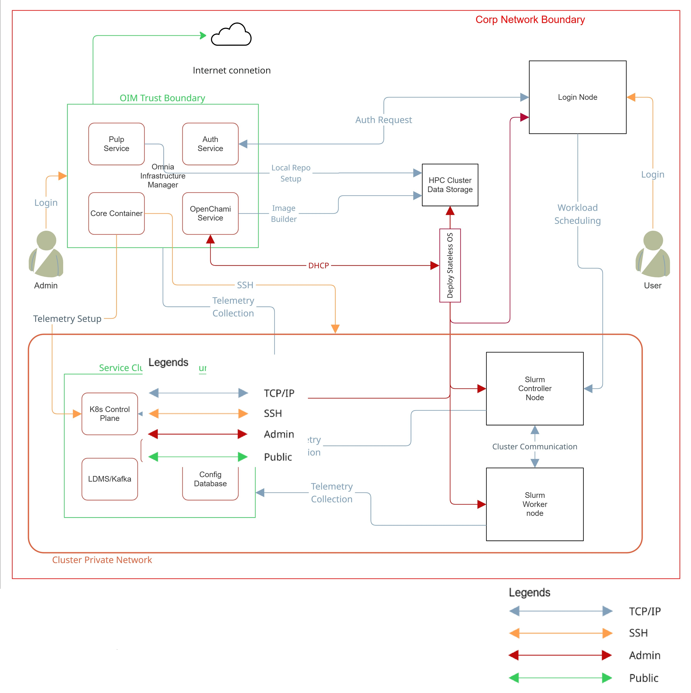

Product and Subsystem Security
===============================

Security controls map
----------------------

Omnia performs bare metal configuration to enable AI/HPC workloads. It uses Ansible playbooks to perform installations and configurations. iDRAC is supported for provisioning bare metal servers. Omnia enables provisioning 
of clusters via PXE using Mapping file **[Mandatory]** to dictate IP address/MAC mapping.

  
Omnia can be installed via CLI only. Slurm and Kubernetes are deployed and configured on the cluster. OpenLDAP is installed for providing authentication.

To perform these configurations and installations, a secure SSH channel is established between the management node and the following entities:

* ``slurm_control_node``

* ``slurm_node``

* ``login_node``

* ``service_kube_control_node``

* ``service_kube_node``

Authentication
---------------

Omnia adheres to a subset of the specifications of NIST 800-53 and NIST 800-171 guidelines on the OIM and login node.

Omnia does not have its own authentication mechanism because bare metal installations and configurations take place using root privileges. Post the execution of Omnia, third-party tools are responsible for authentication to the respective tool.

Cluster authentication tool
----------------------------

In order to enable authentication to the cluster, Omnia installs OpenLDAP: an open source tool providing integrated identity and authentication for Linux networked environments. As part of the HPC cluster, the login node is responsible for configuring users and managing a limited number of administrative tasks. Access to the manager/head node is restricted to cluster administrators only.

.. note::  Omnia does not configure OpenLDAP users or groups.

Authentication types and setup
------------------------------

Key-Based authentication
++++++++++++++++++++++++

**Use of SSH authorized_keys**

A password-less channel is created between the management station and compute nodes using SSH authorized keys. This is explained in the `Security Controls Map <#security-controls-map>`_.

Login security settings
------------------------

User needs to provide the following credentials during cluster configuration. Once these credentials are provided, Omnia stores them in an encrypted Ansible Vault in ``input/omnia_config_credentials.yml``. They are hidden from external visibility and access.

    1. iDRAC/BMC (Username/ Password)

    2. Provisioning OS (Password)

    3. slurmdb_password (Password)

    4. DockerHub (Username/Password)

    5. OpenLDAP (``openldap_db_username``, ``openldap_db_password``, ``openldap_config_username``, ``openldap_config_password``, ``openldap_monitor_password``)

    6. Telemetry (``mysql_user``, ``mysql_password``, ``mysql_root_password``)

    7. Minio s3 bucket (Password)

    8. Pulp (Password)

    9. CSI PowerScale credentials (Username/Password)

    10. LDMS Sampler (Password)

    
Authentication to external systems
==================================

Third party software installed by Omnia are responsible for supporting and maintaining manufactured-unique or installation-unique secrets.

  
Network security
================

Omnia configures the firewall as required by the third-party tools to enhance security by restricting inbound and outbound traffic to the TCP and UDP ports.

Network exposure
-----------------

Omnia uses port 22 for SSH connections, same as Ansible.

Firewall settings
------------------

Omnia configures the following ports for use by third-party tools installed by Omnia.

**Ports used by Podman container and services**

        +------------+----------+------------------------+
        | Port       | Protocol | Container Name/Service |
        +============+==========+========================+
        | 2222       | TCP      | omnia_core             |
        +------------+----------+------------------------+
        | 2225       | TCP      | pulp                   |
        +------------+----------+------------------------+
        | 5001       | TCP      | Omnia nerdctl registry |
        +------------+----------+------------------------+
        | 636, 389   | TCP      | omnia_auth             |
        +------------+----------+------------------------+

**Kubernetes ports requirements**

        +----------------+--------+-------------------------+-------------------------------+
        | Port           | Number | Layer 4                 | Protocol Purpose Type of Node |
        +================+========+=========================+===============================+
        |                | TCP    | Kubernetes API          | server Manager                |
        | 6443           |        |                         |                               |
        +----------------+--------+-------------------------+-------------------------------+
        |                | TCP    | etcd server             | client API Manager            |
        | 2379-2380      |        |                         |                               |
        +----------------+--------+-------------------------+-------------------------------+
        |                | TCP    | Kube-scheduler Manager  |                               |
        | 10251          |        |                         |                               |
        +----------------+--------+-------------------------+-------------------------------+
        |                | TCP    | Kube-controller manager | Manager                       |
        | 10252          |        |                         |                               |
        +----------------+--------+-------------------------+-------------------------------+
        |                | TCP    | Kubelet API             | Compute                       |
        | 10250          |        |                         |                               |
        +----------------+--------+-------------------------+-------------------------------+
        |                | TCP    | Nodeport services       | Compute                       |
        | 30000-32767    |        |                         |                               |
        +----------------+--------+-------------------------+-------------------------------+
        |                | TCP    | Calico services         | Manager/Compute               |
        | 5473           |        |                         |                               |
        +----------------+--------+-------------------------+-------------------------------+
        |                | TCP    | Calico services         | Manager/Compute               |
        | 179            |        |                         |                               |
        +----------------+--------+-------------------------+-------------------------------+
        |                | UDP    | Calico services         | Manager/Compute               |
        | 4789           |        |                         |                               |
        +----------------+--------+-------------------------+-------------------------------+
        |                | UDP    | Flannel services        | Manager/Compute               |
        | 8285           |        |                         |                               |
        +----------------+--------+-------------------------+-------------------------------+
        |                | UDP    | Flannel services        | Manager/Compute               |
        | 8472           |        |                         |                               |
        +----------------+--------+-------------------------+-------------------------------+

**Slurm port requirements**

        +------+---------+----------------+---------------+
        | Port | Number  | Layer 4        | Protocol Node |
        +======+=========+================+===============+
        | 6817 | TCP/UDP | Slurmctld Port | Manager       |
        +------+---------+----------------+---------------+
        | 6818 | TCP/UDP | Slurmd Port    | Compute       |
        +------+---------+----------------+---------------+
        | 6819 | TCP/UDP | Slurmdbd Port  | Manager       |
        +------+---------+----------------+---------------+

**OpenLDAP port requirements**

        +---------------+---------+----------------------+----------------------+
        | Port   Number | Layer 4 | Purpose              | Node                 |
        +===============+=========+======================+======================+
        | 80            | TCP     | HTTP/HTTPS           | Manager/ Login_Node  |
        +---------------+---------+----------------------+----------------------+
        | 443           | TCP     | HTTP/HTTPS           | Manager/ Login_Node  |
        +---------------+---------+----------------------+----------------------+
        | 389           | TCP     | LDAP/LDAPS           | Manager/ Login_Node  |
        +---------------+---------+----------------------+----------------------+
        | 636           | TCP     | LDAP/LDAPS           | Manager/ Login_Node  |
        +---------------+---------+----------------------+----------------------+

**Telemetry ports**

        +------------------+----------+-----------------------------------------------+
        | Port Number      | Protocol | Service                                       |
        +==================+==========+===============================================+
        | 8161             | TCP      | Activemq console                              |
        +------------------+----------+-----------------------------------------------+
        | 61613            | TCP      | Activemq message broker                       |
        +------------------+----------+-----------------------------------------------+
        | 3306, 33060      | TCP      | MySQL                                         |
        +------------------+----------+-----------------------------------------------+
        | 9092 - 9093      | TCP      | Kafka                                         |
        +------------------+----------+-----------------------------------------------+
        | 9094             | TCP      | Kafka LoadBalancer                            |
        +------------------+----------+-----------------------------------------------+
        | 8443             | TCP      | VictoriaMetrics service                       |
        +------------------+----------+-----------------------------------------------+
        | 8480             | TCP      | VictoriaMetrics LoadBalancer Insert service   |
        +------------------+----------+-----------------------------------------------+
        | 8481             | TCP      | VictoriaMetrics LoadBalancer Query service    |
        +------------------+----------+-----------------------------------------------+
        | 6001 - 6100      | TCP      | LDMS aggregator                               |
        +------------------+----------+-----------------------------------------------+
        | 6001 - 6100      | TCP      | LDMS store daemon port                        |
        +------------------+----------+-----------------------------------------------+
        | 10001 - 10100    | TCP      | LDMS sampler port                             |
        +------------------+----------+-----------------------------------------------+

  
**OpenCHAMI ports**

        +---------------+----------+--------------+
        | Port number   | Protocol | Service Name |
        +===============+==========+==============+
        | 9000, 9001    | tcp      | minio-server |
        +---------------+----------+--------------+
        | 5000          | tcp      | registry     |
        +---------------+----------+--------------+
        | 9000          | tcp      | step-ca      |
        +---------------+----------+--------------+
        | 5432          | tcp      | postgres     |
        +---------------+----------+--------------+
        | 27779         | tcp      | smd          |
        +---------------+----------+--------------+
        | 27778         | tcp      | bss          |
        +---------------+----------+--------------+
        | 80, 443       | tcp      | haproxy      |
        +---------------+----------+--------------+
        | 22            | udp      | ssh-udp      |
        +---------------+----------+--------------+
        | 67            | udp      | dhcp-udp     |
        +---------------+----------+--------------+
        | 68            | udp      | bootpc       |
        +---------------+----------+--------------+
        | 69            | udp      | tftp-udp     |
        +---------------+----------+--------------+
       
       

Data security
-------------

Omnia does not store data. The passwords Omnia accepts as input to configure the third party tools are validated and then encrypted using Ansible Vault. Run the following commands routinely on the OIM for the latest RHEL security updates.

::

    yum update --security

For more information on the passwords used by Omnia, see `Login Security Settings <#login-security-settings>`_.

Auditing and logging
--------------------

Omnia creates and stores log files related to containers at ``<nfs_share_path>/omnia/log/``. The events during the installation of Omnia are captured as logs. For different roles called by Omnia, separate log files are created as listed below:

+------------------------------------------------------------------------+---------------------------------------------+
| Location                                                               | Purpose                                     |
+========================================================================+=============================================+
| /opt/omnia/log/core/playbooks/discovery.log                            | Discovery logs                              |
+------------------------------------------------------------------------+---------------------------------------------+
| /opt/omnia/log/core/playbooks/local_repo.log                           | Local Repository logs                       |
+------------------------------------------------------------------------+---------------------------------------------+
| /opt/omnia/log/core/playbooks/prepare_oim.log                          | Prepare OIM Logs                            |
+------------------------------------------------------------------------+---------------------------------------------+
| /opt/omnia/log/core/playbooks/provision.log                            | Provision Logs                              |
+------------------------------------------------------------------------+---------------------------------------------+
| /opt/omnia/log/core/playbooks/scheduler.log                            | Scheduler Logs                              |
+------------------------------------------------------------------------+---------------------------------------------+
| /opt/omnia/log/core/playbooks/telemetry.log                            | Telemetry logs                              |
+------------------------------------------------------------------------+---------------------------------------------+
| /opt/omnia/log/core/playbooks/utils.log                                | Utility logs                                |
+------------------------------------------------------------------------+---------------------------------------------+
| /opt/omnia/log/core/playbooks/credential_utility.log                   | Credential utility logs                     |
+------------------------------------------------------------------------+---------------------------------------------+
| /opt/omnia/log/openchami/*log                                          | OpenCHAMI playbook logs                     |
+------------------------------------------------------------------------+---------------------------------------------+
| /opt/omnia/log/pulp/*log                                               | Pulp container logs                         |
+------------------------------------------------------------------------+---------------------------------------------+
| /opt/omnia/log/local_repo/*log                                         | Local repo logs                             |
+------------------------------------------------------------------------+---------------------------------------------+
| /opt/omnia/log/core/container/*log                                     | Core container logs                         |
+------------------------------------------------------------------------+---------------------------------------------+
| /opt/omnia/log/core/playbooks/validation_omnia_project_default.log     | Omnia input validation report logs          |
+------------------------------------------------------------------------+---------------------------------------------+
| /opt/omnia/log/core/playbooks/input_validation.log                     | Omnia input validation playbook logs        |
+------------------------------------------------------------------------+---------------------------------------------+

Additionally, an aggregate of the events taking place during storage, scheduler and network role installation called ``omnia.log`` is created in ``/var/log``.

There are separate logs generated by the third party tools installed by Omnia.

Logs
-----

A sample of the ``omnia.log`` is provided below:

::

    2021-02-15 15:17:36,877 p=2778 u=omnia n=ansible | [WARNING]: provided hosts
    list is empty, only localhost is available. Note that the implicit localhost does not
    match 'all'
    2021-02-15 15:17:37,396 p=2778 u=omnia n=ansible | PLAY [Executing omnia roles]
    ************************************************************************************
    2021-02-15 15:17:37,454 p=2778 u=omnia n=ansible | TASK [Gathering Facts]
    *****************************************************************************************
    *
    2021-02-15 15:17:38,856 p=2778 u=omnia n=ansible | ok: [localhost]
    2021-02-15 15:17:38,885 p=2778 u=omnia n=ansible | TASK [common : Mount Path]
    **************************************************************************************
    2021-02-15 15:17:38,969 p=2778 u=omnia n=ansible | ok: [localhost]

These logs are intended to enable debugging.

.. note:: The Omnia product recommends that product users apply masking rules on personal identifiable information (PII) in the logs before sending to external monitoring applications or sources.

Logging format
---------------

Every log message begins with a timestamp and also carries information on the invoking play and task.

The format is described in the following table.

+----------------------------------+----------------------------------+------------------------------------------+
| Field                            | Format                           | Sample Value                             |
+==================================+==================================+==========================================+
| Timestamp                        | yyyy-mm-dd h:m:s                 | 2/15/2021 15:17                          |
+----------------------------------+----------------------------------+------------------------------------------+
| Process Id                       | p=xxxx                           | p=2778                                   |
+----------------------------------+----------------------------------+------------------------------------------+
| User                             | u=xxxx                           | u=omnia                                  |
+----------------------------------+----------------------------------+------------------------------------------+
| Name of the process executing    | n=xxxx                           | n=ansible                                |
+----------------------------------+----------------------------------+------------------------------------------+
| The task being executed/ invoked | PLAY/TASK                        | PLAY [Executing omnia roles]   TASK      |
|                                  |                                  | [Gathering Facts]                        |
+----------------------------------+----------------------------------+------------------------------------------+
| Error                            | fatal: [hostname]: Error Message | fatal: [localhost]: FAILED! =>   {"msg": |
|                                  |                                  | "lookup_plugin.lines}                    |
+----------------------------------+----------------------------------+------------------------------------------+
| Warning                          | [WARNING]: warning message       | [WARNING]: provided hosts list is empty  |
+----------------------------------+----------------------------------+------------------------------------------+

Network vulnerability scanning
------------------------------

Omnia performs network and application security scans on all modules of the product. Omnia additionally performs Blackduck scans on the open source softwares, which are installed by Omnia at runtime. However, Omnia is not responsible for the third-party software installed using Omnia. Review all third party software before using Omnia to install it.