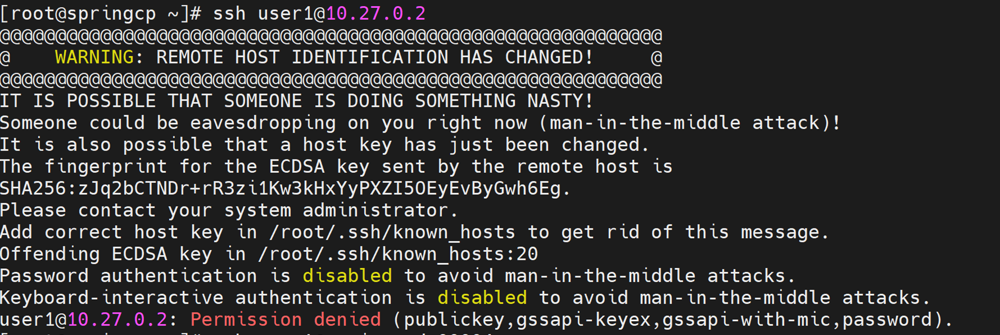

Provision
==========

⦾ **What to do if root user login fails when accessing a cluster node?**

**Potential Cause**: 
    * SSH key on the OIM may be outdated.
    * cloud-init might not be rendered.

**Resolution**:

   * Refresh the key using ``ssh-keygen -R <hostname/server IP>``.
   * Retry login.
   * If cloud-init is not be rendered, retry the cluster node reprovision.

⦾ **How is the gracefull shutdown of an Omnia cluster is achieved?**

**Potential Cause**: Manage OIM reboot/shutdown scenario.

**Resolution**: In the case of a planned shutdown, ensure that the OIM is shut down after the compute nodes. When powering back up, the OIM should be powered on and OpenCHAMI resumed before bringing up the compute nodes. In short, have the OIM as the first node up and the last node down.

For more information, `click here <https://github.com/xcat2/xcat-core/issues/7374>`_

⦾ **What to do if the Lifecycle Controller (LC) is not ready?**

**Resolution**:

* Verify that the LC is in a ready state for all servers using: ``racadm getremoteservicesstatus``
* PXE boot the target server.

⦾ **After executing discovery.yml playbook for Slurm cluster deployment, why do I get the following messages on the slurm node?**

**Potential Cause**: This issue occurs when cluster nodes are booted before the Slurm controller is fully up. Because ``slurmctld`` is not yet running when the Slurm nodes start, a connectoin cannot be established with the controller, resulting in “unable to contact” or “not responding” messages.

**Resolution**: 
1. ssh to the slurm controller node, run the following command::
    
    scontrol reconfigure
 
2. ssh to the slurm node and restart the slurmd service using following command::
    
    systemctl restart slurmd
 
Finally, verify the output of sinfo command to check if node has successfully joined the slurm cluster.