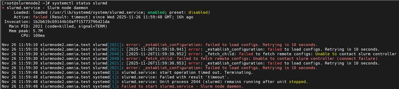

Slurm
==========
⦾ **After executing discovery.yml playbook for Slurm cluster deployment, why do I get the following messages on the slurm node?**

**Potential Cause**: This issue occurs when cluster nodes are booted before the Slurm controller is fully up. Because ``slurmctld`` is not yet running when the Slurm nodes start, a connection cannot be established with the controller, resulting in “unable to contact” or “not responding” messages.

**Resolution**: 

1. SSH to the Slurm controller node, run the following command::
    
    scontrol reconfigure
 
2. SSH to the Slurm node and restart the slurmd service using following command::
    
    systemctl restart slurmd
 
Finally, verify the output of sinfo command to check if node has successfully joined the slurm cluster.