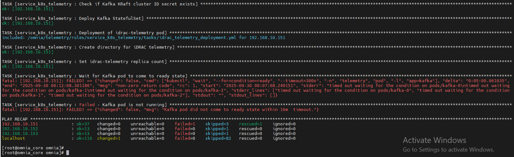
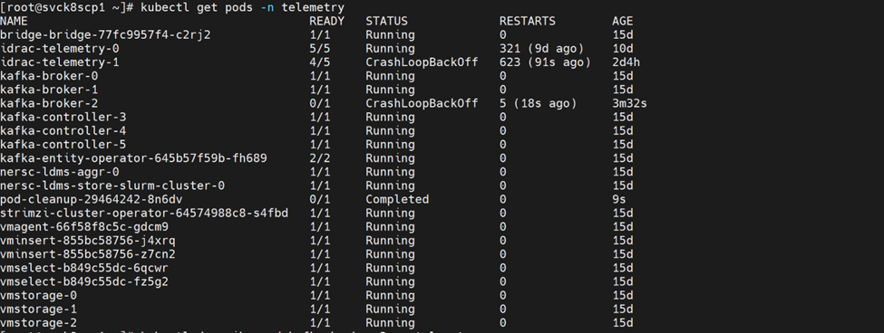

Telemetry
===================================

⦾ **Why is the telemetry playbook is failing at Kafka pod deployment?** 

**Potential Cause**: No kube nodes are available in the service cluster for pod deployments.

**Resolution**: If this issue occurs during telemetry execution, check if the service kube nodes are booted and added to the service ``kube_control_plane``.

⦾ **Why do telemetry pods enter a CrashLoopBackOff state when PowerScale is configured as an NFS server?**

**Potential Cause**:  The CSI-PowerScale driver is not installed on the Kubernetes cluster nodes because the CSI driver entry is not present in the ``software_config.json``file. When PowerScale is used without CSI-based integration, Kubernetes treats the storage as a manual NFS mount, which is not supported by Omnia for telemetry workloads.

**Resolution**: Ensure that the following CSI-PowerScale driver entry is present in the ``software_config.json`` file:: 
   
   {"name": "csi_driver_powerscale", "version": "v2.15.0", "arch": ["x86_64"]}

For more information on deploying the Dell CSI-PowerScale driver, see `Deploy CSI drivers for Dell PowerScale Storage Solutions <../../../OmniaInstallGuide/AdvancedConfigurations/PowerScale_CSI.html>`_

⦾ **Why do telemetry pods enter a ``CrashLoopBackOff`` state and fail to retrieve telemetry with the error ``No space left on device``?**

   

.. image:: ../../../images/faq_telemetry_error_crash_loop_2.png

**Potential Cause**: This issue occurs when the configured ``persistence_size`` for Kafka reaches its capacity limit.

**Resolution**: The default ``8Gi`` persistent volume size is suitable for small clusters (typically fewer than 5 nodes). For larger clusters, increase the ``persistence_size`` and configure Kafka retention settings ``log_retention_hours`` and ``log_retention_bytes`` so that old logs are deleted before the persistent volume reaches its limit. These settings should be based on your expected data volume and cluster size.

