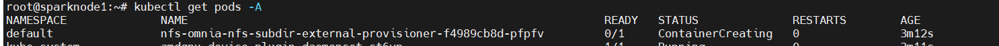
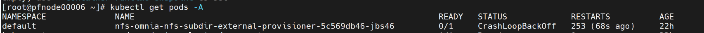
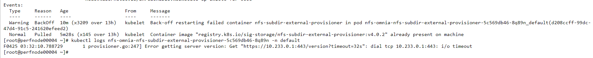
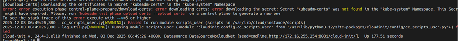

Kubernetes
===========

⦾ **Why do Kubernetes Pods show** ``ImagePullBackOff`` **or** ``ErrImagePull`` **errors in their status?**

**Potential Cause**: The errors occur when the Docker pull limit is exceeded.

**Resolution**:

    * Ensure that the ``docker_username`` and ``docker_password`` are provided in ``/opt/omnia/input/project_default/omnia_config_credentials.yml``.

    * For ``ErrImagePull`` and `ImagePullBackOff`` issue, ensure that local_repo.yml playbook is executed successfully without any failures for packages. Check the local_repo logs for more details. `Click here for more info. <https://kubernetes.io/docs/tasks/configure-pod-container/pull-image-private-registry>`_

.. note:: If the playbook is already executed and the pods are in **ImagePullBackOff** state, run ``kubeadm reset -f`` on all the nodes before re-executing the playbook with the Docker credentials.

⦾ **What to do if the nodes in a Kubernetes cluster reboot?**

**Resolution**: Wait for 15 minutes after the Kubernetes cluster reboots. To verify the status of the cluster nodes, run the following commands from the ``kube_control_plane``:

1. To get real-time kubernetes cluster status, run: ::
    
    kubectl get nodes

2. To check which the pods are in the **Running** state, run: ::
    
    kubectl get pods  all-namespaces 

3. To verify that both the kubernetes master and kubeDNS are in **Running** state, run: ::
    
    kubectl cluster-info 

⦾ **What to do when the Kubernetes services are not in** ``Running`` **state?**

**Resolution**:

1. Run ``kubectl get pods  all-namespaces`` to get the status of all the pods.

2. If the pod(s) are not in ``Running`` state, delete it using the command: ``kubectl delete pods <name of pod>``

⦾ **If the DNS servers are unresponsive, the Kubernetes pods stop communicating with the servers.**

**Potential Cause**: The host network is faulty causing DNS to be unresponsive.

**Resolution**:

1. In your Kubernetes cluster, run ``kubeadm reset -f`` on all the nodes.

2. On the management node, edit the ``omnia_config.yml`` file to change the Kubernetes Pod Network CIDR. The suggested IP range is 192.168.0.0/16. Ensure that the IP provided is not in use on your host network.

3. List ``k8s`` in ``input/software_config.json`` and re-run ``discovery.yml``.

⦾ **Why does the** ``TASK: Initialize Kubeadm`` fail with ``nnode.Registration.name: Invalid value: "<Host name>"`` **error?**

**Potential Cause**: The OIM does not support hostnames with an underscore in it, such as 'mgmt_station'.

**Resolution**: Ensure that the OIM hostname meets the below mentioned requirements:

    .. include:: ../../../Appendices/hostnamereqs.rst

⦾ **Why does the NFS-client provisioner go to a** ``ContainerCreating`` **or** ``CrashLoopBackOff`` **state?**

**Potential Cause**: This issue usually occurs when ``server_share_path`` given in ``storage_config.yml`` for ``k8s_share`` does not have an NFS server running.

**Resolution**:

    * Ensure that ``server_share_path`` mentioned in ``storage_config.yml`` for ``k8s_share: true`` has an active nfs_server running on it.

⦾ **If the Nfs-client provisioner is in** ``ContainerCreating`` **or** ``CrashLoopBackOff`` **state, why does the** ``kubectl describe <pod_name>`` **command show the following output?**

**Potential Cause**: This is a known issue. For more information, click `here. <https://github.com/helm/charts/issues/23743>`_

**Resolution**:

    1. Wait for some time for the pods to come up. **or**
    2. Do the following:

        * Run the following command to delete the pod: ::

            kubectl delete pod <pod_name> -n <namespace>

        * Post deletion, the pod will be restarted and it will come to running state.

⦾ **Kubernetes workloads are unable to resolve the PowerScale SmartConnect hostname (e.g., management.ps.com) from within the cluster.**

**Potential Cause**: The SmartConnect hostname is not resolvable by the Kubernetes cluster’s internal DNS (CoreDNS).
This typically happens when:
- CoreDNS is unaware of the external DNS zone used by PowerScale.
- The SmartConnect service IP or hostname is not defined in CoreDNS or the upstream DNS servers.

**Resolution**:
    Step 1 — Identify the SmartConnect Hostname and IP
    
        1. In the PowerScale UI, go to:
            Cluster Management → Network Configuration → Subnets → <Your Subnet Name>
        2. Note the following details:
            - SmartConnect Service Name: e.g., management.ps.com
            - SmartConnect IP Address: e.g., 10.x.x.x

    Step 2 — Update the CoreDNS ConfigMap

        1. On a control-plane node, edit the CoreDNS ConfigMap:
             kubectl -n kube-system edit configmap coredns

        2. Locate the Corefile: section and add a hosts block before the forward or proxy section.
        Example:

        ::  

                hosts {
                10.x.x.x management.ps.com
                fallthrough
                }
        Replace 10.x.x.x with your actual PowerScale DNS IP.
        You can find the DNS IP inside the file:
        ``/opt/omnia/input/project_default/network_spec.yml → under [dns] field.``

    Step 3 — Restart CoreDNS Pods

        Apply the changes by restarting CoreDNS:

        ::
            
              kubectl -n kube-system rollout restart deployment coredns

        Verify the CoreDNS pods are running:

           ::
                
                 kubectl -n kube-system get pods -l k8s-app=kube-dns

    Step 4 — Validate DNS Resolution

        Launch a temporary pod to test name resolution:

           ::    
            
                kubectl run -it dns-test --image=busybox --restart=Never -- sh

        Inside the pod shell, test DNS:
        
            ::

                nslookup management.ps.com

        Expected Output:
        Server:    10.x.x.x
        Address 1: management.ps.com

⦾ **Why does** ``kubeadm join --control-plane`` **is unsuccessful withthe following messages: 
* Failed to pull required certs
* Secret "kubeadm-certs" was not found in kube-system
* certificate key expired**

**Potential Cause**: During kubeadm init, encrypted control-plane certificates are uploaded to the cluster. These certificates require a certificate key, which expires after approximately two hours. If a control-plane node attempts to join after this window, it cannot download or decrypt certificates, resulting in join failure.

**Resolution**:

1. On any existing and healthy control-plane node (not the affected node), run the script located on the shared NFS mount: ::
      
        {{ k8s_client_mount_path }}/generate-control-plane-join.sh

``k8s_client_mount_path`` is the local directory on every Kubernetes node where the NFS share is mounted, allowing all nodes to access and use shared resources automatically.
This script uploads fresh control-plane certificates to the cluster and automatically generates a refreshed control-plane join command. It saves it to ``{{ k8s_client_mount_path }}/control-plane-join-command.sh``

2. On the control-plane node where the join previously failed reboot the node.
3. After reboot, the node automatically reads the refreshed join command from the shared NFS path and successfully adds itself to the cluster. No manual join command execution is required.

