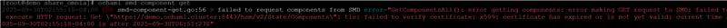
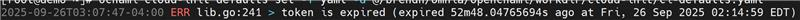

Provision
==========

⦾ **Why are some target servers not reachable after PXE booting them?**

**Potential Causes**:

1. The server hardware does not allow for auto rebooting

2. The process of PXE booting the node has stalled.

**Resolution**:

1. Login to the iDRAC console to check if the server is stuck in boot errors (F1 prompt message). If true, clear the hardware error or disable POST (PowerOn Self Test).

2. Hard-reboot the server to bring up the server and verify that the boot process runs smoothly. (If it gets stuck again, disable PXE and try provisioning the server via iDRAC.)

⦾ **Why does PXE boot fail with tftp timeout or service timeout errors?**

**Potential Causes**:

* Two or more servers in the same network.

* The target cluster node does not have a configured PXE device with an active NIC.

* Additional NIC connected might cause network issues.

**Resolution**:

* On the server, go to **BIOS Setup -> Network Settings -> PXE Device**. For each listed device (typically 4), configure an active NIC under ``PXE device settings``.

* Remove the Additional NIC and connect the NIC after the node is booted.

⦾ **Why does the** ``discovery.yml`` **playbook execution fail at task:** ``prepare_oim needs to be executed`` **?**

**Potential Cause**: The OpenCHAMI container is not up and running.

**Resolution**: Perform a cleanup using ``oim_cleanup.yml`` and re-run the ``prepare_oim.yml`` playbook to bring up the OpenCHAMI containers. After ``prepare_oim.yml`` playbook has been executed successfully, re-deploy the cluster using the steps mentioned in the `Omnia deployment guide <../../../OmniaInstallGuide/RHEL_new/index.html>`_.

⦾ **Why boot params are not set properly when functional groups are modified in mapping file?**

**Potential Causes**: Node Deletion is currently not supported by Omnia. There might be old boot param entries which are not automatically cleaned up by Omnia. This can cause conflict in boot params.

**Resolution**: Manually clean up the existing boot params before executing ``discovery.yml`` playbook.

⦾ **Why ochami smd commands fail with certificate error?**

**Potential Causes**: This issue is because of Openchami certificate expiration. After sometime, the certificate expires and loses the validity because of which ochami commands do not run.

**Resolution**: As part of ``discovery.yml`` execution, certificate updation is being taken care. However, if user still faces this issue, they can update the Openchami certificate manually by running the following command on OIM: ::
        
        sudo openchami-certificate-update update <OIM_hostname>. <Domain_Name>
        sudo systemctl restart openchami.target

⦾ **Why ochami commands fail with token error?**

**Potential Causes**: This issue is because of Access Token getting expired after sometime.

**Resolution**: Manually renew the access token by running below command on OIM: ::

        export <OIM_hostname>_ACCESS_TOKEN=$(sudo bash -lc 'gen_access_token')

⦾ **Why am I unable to do ssh to the booted nodes via omnia_core container?**

.. image:: ../../../provision_issue.jpg

**Potential Causes**: This issue is due to SSH host key mismatch issues.

**Resolution**: User needs to manually run the below command inside omnia_core container: ::

        ssh-keygen -R <node_admin_ip> 

    This removes all SSH entries for that IP from your ``local ~/.ssh/known_hosts`` file.