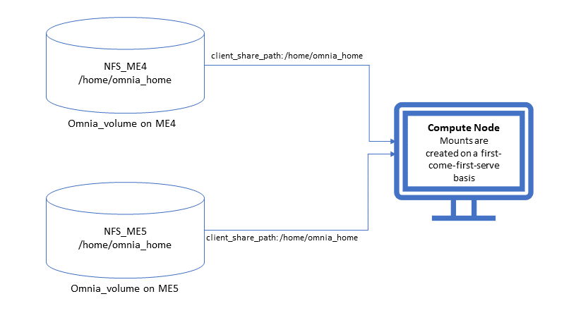

Storage
========

⦾ **Why does the** ``TASK: nfs_client: Mount NFS client`` **fail with the message:** ``No route to host`` **?**

**Potential Cause**: There's a mismatch in the NFS share path mentioned in ``/etc/exports`` and ``storage_config.yml`` under ``nfs_client_params``.

**Resolution**: Ensure that the input paths are a perfect match to avoid any errors.

⦾ **Why is my NFS mount not visible on the client?**

**Potential Cause**: The directory being used by the client as a mount point is already in use by a different NFS export.

**Resolution**: Verify that the directory being used as a mount point is empty by using ``cd <client share path> | ls`` or ``mount | grep <client share path>``. If empty, re-run the playbook.

⦾ **What to do if NFS clients are unable to access the share after an NFS server reboot?**

Reboot the NFS server (external to the cluster) to bring up the services again: ::

    systemctl disable nfs-server
    systemctl enable nfs-server
    systemctl restart nfs-server