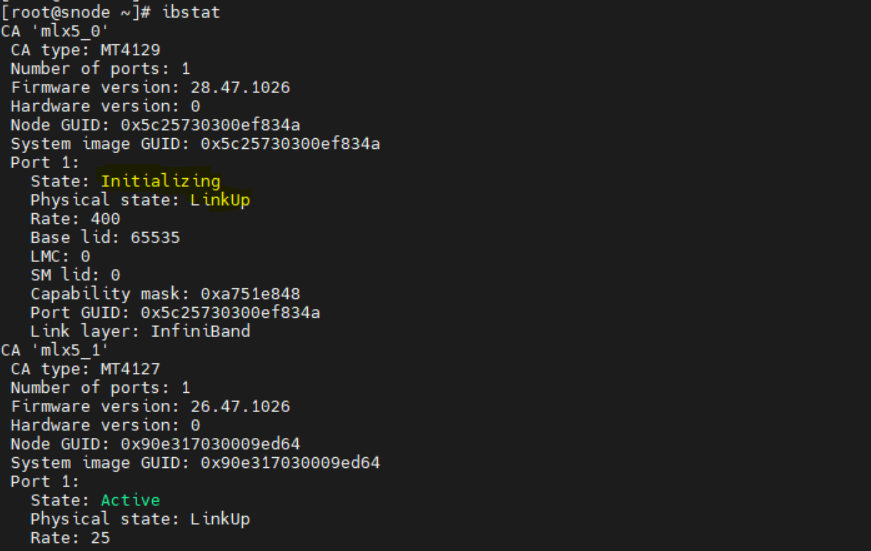

============================
Troubleshooting guide
============================

PXE Boot Hangs During Node Replacement
=====================================

When an existing node is replaced with a new node and ``discovery.yml`` is rerun, the new node may hang during PXE boot at ``nm-wait-online-initrd.service``.

**Cause**: An IP address conflict occurs when the new node is assigned an IP address that is still in use by the old node on the network.

**Resolution**: Before adding the new node, complete the following steps:

- Ensure the old node is powered off or disconnected from the network.
- Verify that the IP address is not in use by any other device.
- Rerun ``discovery.yml`` after confirming that no IP conflicts exist.

Checking and updating encrypted parameters
=============================================

1. Move to the file path where the parameters are saved (as an example, we will be using ``omnia_config_credentials.yml``): ::

        cd /opt/omnia/input/project_default/

2. To view the encrypted parameters: ::

        ansible-vault view omnia_config_credentials.yml --vault-password-file .omnia_config_credentials_key

3. To edit the encrypted parameters: ::

        ansible-vault edit omnia_config_credentials.yml --vault-password-file .omnia_config_credentials_key

Checking podman container status from the OIM
===============================================
   
   * Use this command to get a list of all running podman conatiners: ``podman ps``
   * Check the status of any specific podman containers: ``podman ps -f name=<container_name>``

Packages download issues during ``local_repo.yml`` playbook execution
=========================================================================

1. The ``local_repo.yml`` playbook generates and provides log files as part of its execution. For example, if the local repository is partially unsuccessful for nfs, analyze the issue using the following steps: 

.. image:: ../images/troubleshoot_local_repo.png

2. To view the overall download status of all software in the .csv format, run the following command:

::

        opt/omnia/log/local_repo/<arch>/software.csv

Example: :: 

        /opt/omnia/log/local_repo/x86_64/software.csv

.. image:: ../images/troubleshoot_local_repo_1.png

3. To view the overall download status of all packages and the log filenames for a specific software, run the following command:

::

        /opt/omnia/log/local_repo/<sw>_task_results.log

Example: For nfs: ::

         /opt/omnia/log/local_repo/x86_64/nfs_task_results.log

.. image:: ../images/troubleshoot_local_repo_2.png

4. To view the package level status, run the following command: 

::

         /opt/omnia/log/local_repo/x86_64/<sw>/status.csv

Example: ::

        /opt/omnia/log/local_repo/x86_64/nfs/status.csv

.. image:: ../images/troubleshoot_local_repo_3.png

5. To view the issues information and the reason for job being unsuccessful, see the ``package_status_<pid>.log`` file mentioned in the ``<sw>_task_result.log``.

Example: ::
        
        /opt/omnia/log/local_repo/x86_64/nfs/logs/package_status_41422.log

.. image:: ../images/troubleshoot_local_repo_4.png

Troubleshooting logs
=================================================================

For more information, see `Logs <../Logging/OIM_logs.html>`_.

Troubleshooting PowerScale isilon pods after node reboot
========================================================================================================================

Why is the PowerScale (Isilon) CSI controller pod in CrashLoopBackOff after a node reboot, and how can it be resolved?

.. image:: ../images/troubleshoot_powerscale_1.png

.. image:: ../images/troubleshoot_powerscale.jpg

**Resolution**: Do the following:

1. Inspect recent logs from the controller deployment: ::

        kubectl logs deploy/isilon-controller -n isilon --all-containers=true | tail -n 60

2. Restart the Isilon controller deployment: ::

        kubectl rollout restart deployment isilon-controller -n isilon

3. Restart the Isilon node daemonset: ::

        kubectl rollout restart daemonset isilon-node -n isilon

These actions ensure that any components affected by the reboot are recreated properly and resume normal operation.

Troubleshooting LDMS on the slurm nodes
=============================================

.. image:: ../images/troubleshoot_ldms_1.png

1. Check the ldms aggregator and ldms store logs. ::

        kubectl logs -n telemetry nersc-ldms-aggr-0
        kubectl logs -n telemetry nersc-ldms-store-slurm-cluster-0

2. SSH to the slurm node from where the LDMS metrics are not retrieved.
3. Run ``sudo systemctl status ldmsd.sampler.service`` and check ldmsd service is running on the slurm nodes.

.. image:: ../images/troubleshoot_ldms_2.png

4. If the ldmsd daemon is running, check whether supported plugins are loaded using the following command: ::

                /opt/ovis-ldms/sbin/ldms_ls -a ovis -A conf=/opt/ovis-ldms/etc/ldms/ldmsauth.conf -p 10001 -h localhost

.. image:: ../images/troubleshoot_ldms_3.png

5. If ldms plugins are loaded, check the metrics of each plugin using the following command: 

.. image:: ../images/troubleshoot_ldms_4.png

Get the ldsm_port from the file /opt/ovis-ldms/etc/ldms/ldmsd.sampler.env and run the following command: ::

        ldms_ls -l -a ovis -A conf=/opt/ovis-ldms/etc/ldms/ldmsauth.conf -p <ldms_port> -h localhost $(hostname)/<plugin_name>
        
Example: ::
                
                ldms_ls -l -a ovis -A conf=/opt/ovis-ldms/etc/ldms/ldmsauth.conf -p 10001 -h localhost $(hostname)/meminfo

.. image:: ../images/troubleshoot_ldms_5.png
        

Pulp Repository Sync and Publication Failures
===============================================

1. No Space Left on NFS Share (where Pulp is mounted).

**Observation**:  Pulp storage runs out of disk space during sync or publish. In this case , Pulp logs show the error "No space left on device." Check the available storage space on the NFS share.

**Resolution**:  Increase the size of the NFS share where Pulp is mounted to free up space.

2. Incorrect URL in ``local_repo_config.yml``.

**Observation**: The repository URLs in the ``local_repo_config.yml`` file may be incorrect . The URL must point to the repository root (where the repodata directory exists) and be reachable.

**Resolution**: Verify and update the URLs in the local_repo_config.yml file to ensure they are correct and accessible.

3. NFS storage configuration or performance

**Observation**: If Pulp is mounted on NFS, network delays can impact performance, potentially causing sync or publication issues.

**Resolution**: Reduce ``PULP_SYNC_CONCURRENCY`` and ``PULP_PUBLISH_CONCURRENCY`` to 1 in ``config.py``.

**Location**: ::

                vi  common/library/module_utils/local_repo/config.py
                PULP_SYNC_CONCURRENCY =  1
                PULP_PUBLISH_CONCURRENCY = 1

Re-run Failed Operations: After making the changes, re-run the Ansible playbook to retry the failed operations:
``ansible-playbook local_repo.yml``.

After job submission on the Slurm cluster, compute nodes intermittently enter the DRAINED state
=================================================================================================

When Slurm nodes go into a DRAINED state after job submission, one possible cause is a failure in an epilog script under ``/etc/slurm/epilog.d`` due to incorrect file permissions.

To resolve, ensure the epilog script is executable on all Slurm nodes.

For example: ::

        chmod 0755 /etc/slurm/epilog.d/logout_user.sh

After updating the permissions, reload the Slurm configuration: ::

        scontrol reconfigure

InfiniBand ports remain in initializing state on hosts
========================================================

In Omnia deployments using InfiniBand (IB) networking, compute or management hosts show InfiniBand ports stuck in the 
Initializing state after boot. Even though the physical link is up, InfiniBand communication between nodes does not work.
Running the following command on the host shows the port state as Initializing::
 
 ibstat

**Cause:**

The Open Subnet Manager (OpenSM) service is not running on the InfiniBand (IB) switch.
Subnet Manager is a fabric‑level service that should be running on the IB switch. If OpenSM is not enabled on the IB switch, the 
InfiniBand fabric cannot complete initialization, causing host ports to remain in the Initializing state.

**Resolution:**

1. Ensure that the Open Subnet Manager service is enabled and running on the InfiniBand switch.
2. After enabling OpenSM on the IB switch, do the following:

    * PXE boot all the IB NIC based nodes.
    * Run the following command on the host: ibstat
    * Verify that the InfiniBand ports state transition to: ``State: Active``

Slurm controller functional group is missing
=============================================

**Cause:**

PXE mapping file is missing ``slurm_control_node_*`` groups.

**Resolution:**

Update ``pxe_mapping.csv`` with proper controller groups.

``slurm.conf`` missing from backup
===================================

**Cause:**

Incomplete backup or corrupted backup directory.

**Resolution:**

Select a different backup or create new backup.

``slurmctld not active`` during rollback
=========================================

**Cause:**

Slurm controller service is not running.

**Resolution:**

Start slurmctld service manually, then retry rollback.

