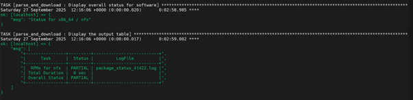
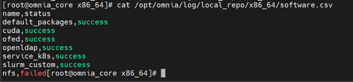
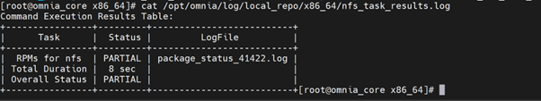
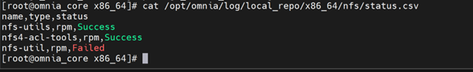
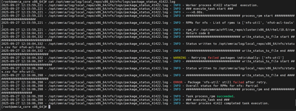
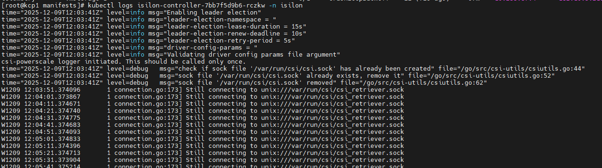
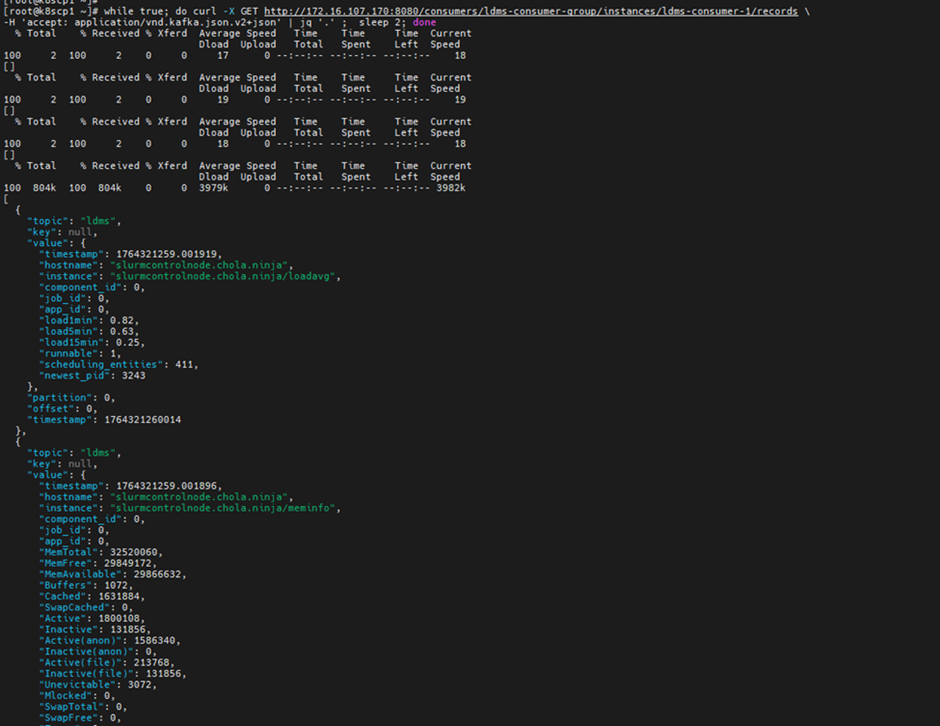
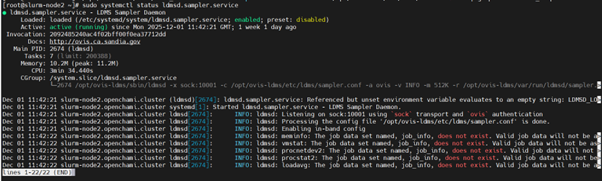

============================
Troubleshooting guide
============================

Checking and updating encrypted parameters
=============================================

1. Move to the file path where the parameters are saved (as an example, we will be using ``omnia_config_credentials.yml``): ::

        cd /opt/omnia/input/project_default/

2. To view the encrypted parameters: ::

        ansible-vault view omnia_config_credentials.yml --vault-password-file .omnia_config_credentials_key

3. To edit the encrypted parameters: ::

        ansible-vault edit omnia_config_credentials.yml --vault-password-file .omnia_config_credentials_key

Checking podman container status from the OIM
===============================================
   
   * Use this command to get a list of all running podman conatiners: ``podman ps``
   * Check the status of any specific podman conatiner: ``podman ps -f name=<container_name>``

Packages download issues during ``local_repo.yml`` playbook execution
=========================================================================

1. The ``local_repo.yml`` playbook generates and provides log files as part of its execution. For example, if the local repository is partially unsuccessful for nfs, analyze the issue using the following steps: 

2. To view the overall download status of all softwares in the .csv format, run the following command:

::

        opt/omnia/log/local_repo/<arch>/software.csv

Example: :: 

        /opt/omnia/log/local_repo/x86_64/software.csv

3. To view the overall download status of all packages and the log filenames for a specific software, run the following command:

::

        /opt/omnia/log/local_repo/<sw>_task_results.log

Example: For nfs: ::

         /opt/omnia/log/local_repo/x86_64/nfs_task_results.log

4. To view the package level status, run the following command: 

::

         /opt/omnia/log/local_repo/x86_64/<sw>/status.csv

Example: ::

        /opt/omnia/log/local_repo/x86_64/nfs/status.csv

5. To view the issues information and the reason for job being unsuccessful, see the ``package_status_<pid>.log`` file mentioned in the ``<sw>_task_result.log``.

Example: ::
        
        /opt/omnia/log/local_repo/x86_64/nfs/logs/package_status_41422.log

Troubleshooting logs
=================================================================

For more information, see `Logs <../Logging/OIM_logs.html>`_.

Troubleshooting CoreDNS pod in pending state
=================================================================

When you run the ``discovery.yml`` files, sometimes one of the CoreDNS pods remains in the pending state after the Kubernetes installation. This issue is caused by the dns-autoscaler adjusting the CoreDNS replica counts based on the total number of CPU cores across all the cluster nodes. In some environments, this scaling calculation can lead to an unsupported replica count, resulting in pending pods.

**Resolution**: Do the following:

1. Retrieve all the deployments using the following command:

::

        kubectl get deployments -A

2. Delete the dns-autoscaler deployment:

::

        kubectl delete deployment dns-autoscaler -n kube-system

3. Identify and edit the CoreDNS deployment name from the list of deployments retrieved in step 1:

::

        kubectl edit deployment <coredns-deployment-name> -n kube-system:

1. Locate the ‘replicas’ field in the editor and change the value to the number of kube controller nodes.
2. Save the changes. Kubernetes automatically restarts the CoreDNS deployment.

4. Wait a few minutes for the pods to restart and verify the CoreDNS status:

::

        kubectl get pods -A

Ensure that the CoreDNS pods are in the 'Running' state.

5. Ensure that you rerun the playbook.

Troubleshooting Powerscale isilon pods after node reboot
=================================================================

When the cluster is successfully deployed using the discovery YAML files and a node undergoes a warm reboot, the following issue might be obeserved. To resolve this, execute the following commands. These will restart the affected pods, allowing Kubernetes to recreate them in a healthy state.

**Resolution**: Do the following:

1. Inspect recent logs from the controller deployment: ::

        kubectl logs deploy/isilon-controller -n isilon --all-containers=true | tail -n 60

2. Restart the Isilon controller deployment: ::

        kubectl rollout restart deployment isilon-controller -n isilon

3. Restart the Isilon node daemonset: ::

        kubectl rollout restart daemonset isilon-node -n isilon

These actions ensure that any components affected by the warm reboot are recreated properly and resume normal operation.

Troubleshooting LDMS on the slurm nodes
=============================================

When the LDMS metrics is not avilable in the Kafka bus, do the following:

1. Ssh to the slurm node from where the LDMS metrics are not retrieved.
2. Run ``sudo systemctl status ldmsd.sampler.service`` and check ldmsd service is running on the slurm nodes.

3. If the ldmsd daemon is running, check whether supported plugins are loaded through the following command: ::

        /opt/ovis-ldms/sbin/ldms_ls -a ovis -A conf=/opt/ovis-ldms/etc/ldms/ldmsauth.conf -p 10001 -h localhost

        .. image:: ../images/troubleshoot_ldms_3.png

4. If ldms plugins are loaded, check each of plugin metrics through the following command: 

        .. image:: ../images/troubleshoot_ldms_4.png

        Get the ldsm_port from the file /opt/ovis-ldms/etc/ldms/ldmsd.sampler.env and run the following command: ::

                ldms_ls -l -a ovis -A conf=/opt/ovis-ldms/etc/ldms/ldmsauth.conf -p <ldms_port> -h localhost $(hostname)/<plugin_name>
        
        Example: ldms_ls -l -a ovis -A conf=/opt/ovis-ldms/etc/ldms/ldmsauth.conf -p 10001 -h localhost $(hostname)/meminfo

        .. image:: ../images/troubleshoot_ldms_5.png
        

