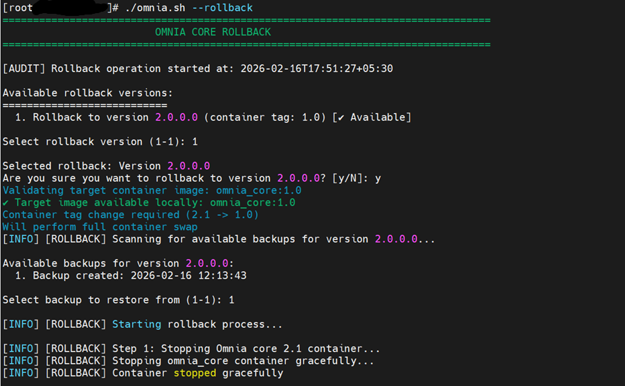
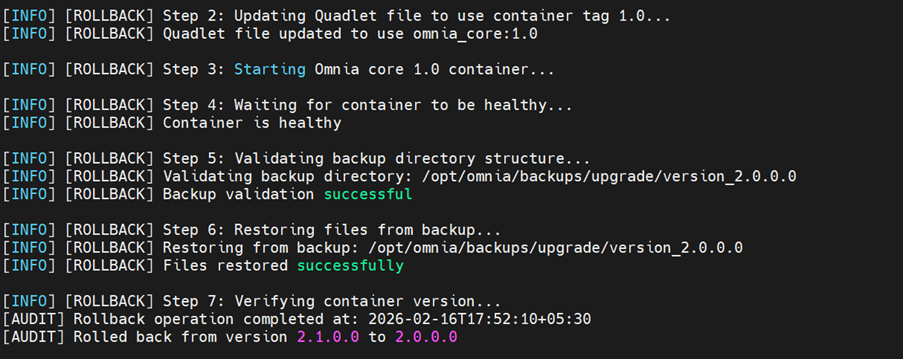
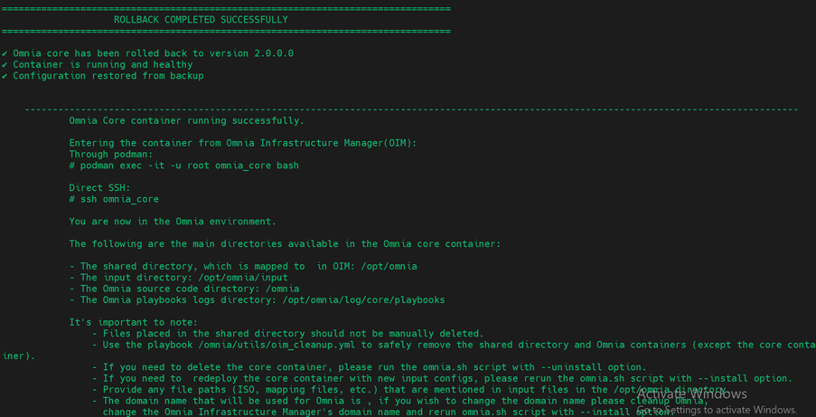

Rollback Omnia
===============

Rollback to the previous version
--------------------------------

To rollback to a previous version, run the following command: ::

    ./omnia.sh --rollback

Select the previous version and confirm to proceed. A message confirming the rollback is successful is displayed.

Post-Rollback Status
--------------------

The ``Omnia_core`` container runs with inputs and configurations restored from backup.

