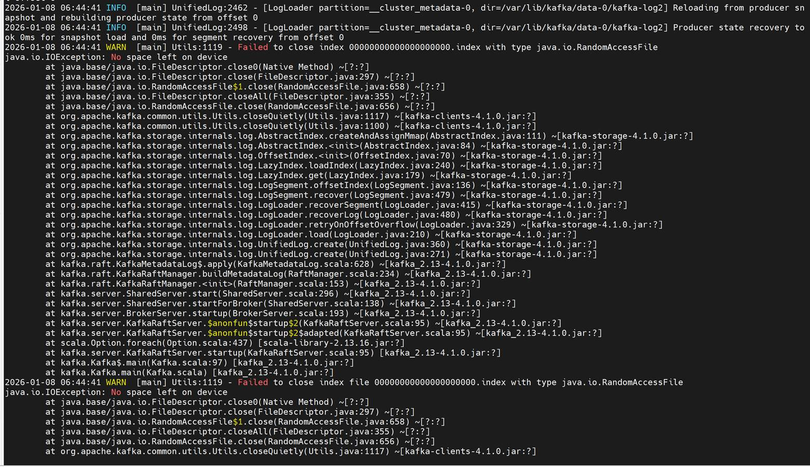
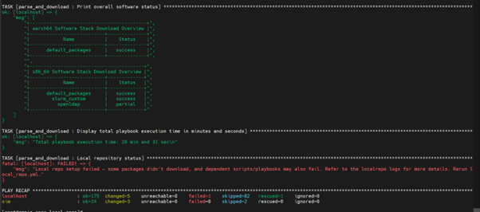
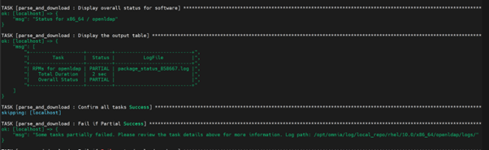
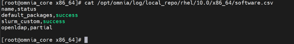
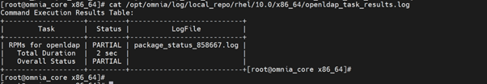
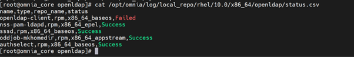
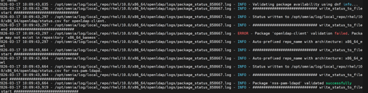
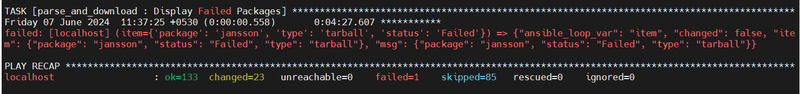
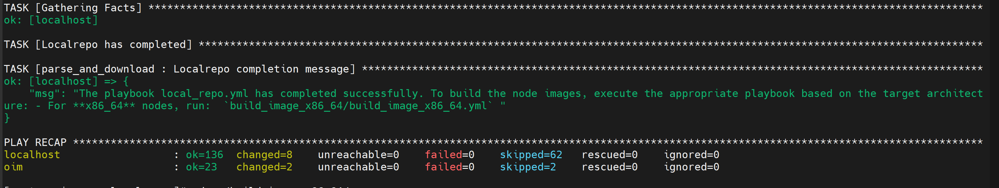

============================
Troubleshooting Guide
============================

A structured guide for diagnosing and resolving issues across Omnia deployment, provisioning, Kubernetes, Slurm, storage, authentication, and telemetry workflows.

.. contents::
   :depth: 2
   :local:

1. Core Container & OIM Issues
===============================

1.1 Omnia Core Container Fails to Deploy
---------------------------------------

**Symptoms**

- ``omnia.sh`` aborts early
- ``podman pull`` fails
- Container starts but cannot write to shared path

**Causes**

- Podman pull/auth issues
- Time synchronization failure
- Invalid OIM hostname
- NFS/SELinux permission issues

**Resolution**

Check container status: ::

        podman ps --format 'table {{.Names}}\t{{.Status}}'

Check logs: ::

        podman logs -n 200 omnia_core

Check time synchronization:

.. code-block:: bash

   timedatectl status
   chronyc tracking || chronyc sources -v

Validate OIM hostname (no dots, underscores, commas, uppercase, leading/trailing hyphens, or leading digits; FQDN ≤64 chars).

Validate NFS mount and SELinux labeling:

.. code-block:: bash

   podman run --rm -v /shared:/mnt:z registry.access.redhat.com/ubi10/ubi sh -lc 'touch /mnt/.rw'

Re-run ``omnia.sh``.

1.2 Prepare OIM Failures
------------------------

**Symptoms**

- Certificate or TLS failures
- Expected container not created
- Service is running but unreachable

**Resolution**

Verify container inventory:

.. code-block:: bash

   podman ps --format 'table {{.Names}}\t{{.Image}}\t{{.Status}}'

1.3 Common Container Debugging Tools
------------------------------------

Use the following commands to troubleshoot container issues across Omnia services.

* To view list of all Omnia containers, run the following command:

.. code-block:: bash

   podman ps -a

* To view container logs, run the following command:

.. code-block:: bash

   podman logs -n 200 <container>

* To test outbound connectivity from a container, run the following command:

.. code-block:: bash

   podman exec -it <container> sh -lc 'curl -I https://example.com'

1.4 Encrypted Parameters Management
----------------------------------

To view encrypted parameters: ::

        ansible-vault view omnia_config_credentials.yml --vault-password-file .omnia_config_credentials_key

To edit encrypted parameters: ::

        ansible-vault edit omnia_config_credentials.yml --vault-password-file .omnia_config_credentials_key

2. PXE Boot & Provisioning Issues
=================================

2.1 Node Hangs at nm-wait-online-initrd.service
-----------------------------------------------

**Cause**

IP address conflict with old node.

**Resolution**

- Ensure old node is powered off/disconnected
- Verify IP address is unused
- Re-run ``discovery.yml``

2.2 PXE Boot Timeout (TFTP/Service Timeout)
--------------------------------------------

**Causes**

- PXE NIC not configured
- Extra NIC interfering
- Multiple PXE servers

**Resolution**

- Configure BIOS → Network Settings → PXE Device
- Assign correct active NIC
- Remove/add NIC only after boot completion

2.3 Target Server Unreachable After PXE Boot
----------------------------------------------

**Causes**

- POST errors
- F1 hardware prompts
- Boot stalls

**Resolution**

- Log in to iDRAC
- Clear errors or disable POST
- Hard reboot
- Disable PXE temporarily if needed

2.4 Root Login Fails
--------------------

**Causes**

- Outdated SSH key
- cloud-init not rendered

**Resolution**

.. code-block:: bash

   ssh-keygen -R <hostname>

Retry login or reprovision the node.

3. Local Repository & Pulp Issues
=================================

3.1 local_repo.yml Download Failures
-------------------------------------

**Causes**

- Incorrect URLs in software JSON
- Docker pull limit
- Insufficient disk space

**Resolution**

- Correct URLs
- Provide valid Docker credentials
- Ensure adequate disk on Pulp NFS
- Re-run the playbook

3.2 Failure When Re-run Multiple Times
--------------------------------------

**Cause**

Pulp container resource saturation.

**Resolution**

Allow the system to idle ~1 hour before re-running.

3.3 Pulp Sync/Publish "No space left on device"
-----------------------------------------------

**Cause**

NFS mount full.

**Resolution**

Increase NFS size
Set concurrency to 1:

.. code-block:: bash

   PULP_SYNC_CONCURRENCY = 1
   PULP_PUBLISH_CONCURRENCY = 1

Re-run playbook

3.4 EPEL Repository Instability
-------------------------------

**Resolution**

- If no packages depend on EPEL → remove EPEL URL
- If required → wait for stability or host EPEL packages locally

3.5 Intermittent Local Repository sync failure due to non-persistent iptables rules on OIM
-------------------------------------------------------------------------------------------

**Cause**: The issue is caused by iptables rules on the OIM node not being persistent. After OIM startup, restrictive iptables policies block outbound internet access from containers.

**Resolution**:

As a workaround to unblock repository synchronization, run the following commands to relax iptables default policies on the OIM node:

.. code-block:: json

   iptables -P INPUT ACCEPT
   iptables -P FORWARD ACCEPT
   iptables -P OUTPUT ACCEPT

4. Kubernetes Cluster & Pod Issues
==================================

4.1 ImagePullBackOff / ErrImagePull
------------------------------------

**Causes**

- Docker rate limits
- Local repo missing images

**Resolution**

- Add credentials to ``omnia_config_credentials.yml``
- Ensure ``local_repo.yml`` succeeded

For more information, `click here <https://kubernetes.io/docs/tasks/configure-pod-container/pull-image-private-registry>`_

4.2 Pods Not in Running State
-----------------------------

**Resolution**

.. code-block:: bash

   kubectl get pods --all-namespaces
   kubectl delete pod <pod-name>

4.3 Cluster Nodes Reboot
-------------------------

**Resolution**

Wait 15 minutes
Verify:

.. code-block:: bash

   kubectl get nodes
   kubectl cluster-info

4.4 DNS Unresponsive / CoreDNS Issues
-------------------------------------

**Resolution**

Restart CoreDNS:

.. code-block:: bash

   kubectl rollout restart deployment coredns -n kube-system

4.5 PowerScale SmartConnect DNS Resolution Issues
-------------------------------------------------

**Cause**

CoreDNS unaware of external SmartConnect zone.

**Resolution**

Edit ConfigMap:

.. code-block:: bash

   kubectl -n kube-system edit configmap coredns

Add a hosts block: ::

        hosts {
        10.x.x.x management.ps.com
        fallthrough
        }

Restart CoreDNS.

4.6 Control-plane Join Fails Due to Certificate Key Expiry
---------------------------------------------------------

**Cause**

kubeadm certificate key expires (~2 hours).

**Resolution**

On a healthy control-plane:

.. code-block:: bash

   {{ k8s_client_mount_path }}/generate-control-plane-join.sh

Reboot the failed node.

5. Storage & NFS Issues
=======================

5.1 NFS-Client Provisioner CrashLoopBackOff
--------------------------------------------

**Cause**

NFS server not active at ``server_share_path``.

**Resolution**

Ensure NFS server is active and reachable.

5.2 PowerScale CSI Controller Issues
-------------------------------------

**Symptoms**

PowerScale (Isilon) CSI controller pod in CrashLoopBackOff after node reboot.

.. image:: images/troubleshoot_powerscale_1.png

.. image:: images/troubleshoot_powerscale.jpg

**Resolution**

1. Inspect recent logs from the controller deployment: ::

        kubectl logs deploy/isilon-controller -n isilon --all-containers=true | tail -n 60

2. Restart the Isilon controller deployment: ::

        kubectl rollout restart deployment isilon-controller -n isilon

3. Restart the Isilon node daemonset: ::

        kubectl rollout restart daemonset isilon-node -n isilon

5.3 Missing PowerScale CSI Driver
----------------------------------

**Cause**

Driver not listed in ``software_config.json``.

**Required Entry**

.. code-block:: json

   {
     "name": "csi_driver_powerscale",
     "version": "v2.15.0",
     "arch": ["x86_64"]
   }

For more information on deploying the Dell CSI-PowerScale driver, see `Deploy CSI drivers for Dell PowerScale Storage Solutions <../OmniaInstallGuide/AdvancedConfigurations/PowerScale_CSI.html>`_

6. Slurm Issues
===============

6.1 Nodes Entering DRAINED State
--------------------------------

**Cause**

Epilog script not executable.

**Resolution**

.. code-block:: bash

   chmod 0755 /etc/slurm/epilog.d/logout_user.sh
   scontrol reconfigure

6.2 Slurm Nodes Cannot Contact Controller
-----------------------------------------

**Cause**

Nodes booted before controller.

**Resolution**

.. code-block:: bash

   scontrol reconfigure
   systemctl restart slurmd

6.3 Missing Controller Groups / Missing slurm.conf
-----------------------------------------------------

**Resolution**

- Update ``pxe_mapping.csv`` with controller groups
- Choose different backup or create new one

6.4 LDMS Metrics Missing
-------------------------

**Checks**

.. code-block:: bash

   kubectl logs -n telemetry nersc-ldms-aggr-0
   kubectl logs -n telemetry nersc-ldms-store-slurm-cluster-0
   sudo systemctl status ldmsd.sampler.service
   /opt/ovis-ldms/sbin/ldms_ls ...

.. image:: images/troubleshoot_ldms_1.png

.. image:: images/troubleshoot_ldms_2.png

.. image:: images/troubleshoot_ldms_3.png

.. image:: images/troubleshoot_ldms_4.png

.. image:: images/troubleshoot_ldms_5.png

7. Telemetry Issues
===================

7.1 Kafka Pods CrashLoopBackOff
-------------------------------

**Causes**

- No service kube nodes
- Missing CSI driver
- PV full

**Resolution**

- Ensure service kube nodes are booted
- Add PowerScale CSI driver
- Increase Kafka volume and configure log retention

.. image:: images/telemetry.png

7.2 Kafka "No space left on device"
------------------------------------

**Symptoms**

.. image:: images/faq_telemetry_error_crash_loop.png

**Cause**

Configured ``persistence_size`` for Kafka reaches capacity limit.

**Resolution**

The default ``8Gi`` persistent volume size is suitable for small clusters (typically fewer than 5 nodes). For larger clusters, increase the ``persistence_size`` and configure Kafka retention settings ``log_retention_hours`` and ``log_retention_bytes`` so that old logs are deleted before the persistent volume reaches its limit.

8. Authentication Issues
========================

8.1 LDAP Login Fails After User Creation
----------------------------------------

**Cause**

Whitespace in LDIF.

**Resolution**

.. code-block:: bash

   cat -vet <filename>
   # remove whitespace

8.2 OpenLDAP Login Fails
------------------------

**Cause**

Stale SSH key.

**Resolution**

.. code-block:: bash

   ssh-keygen -R <hostname>

.. image:: images/UserLoginError.png

9. OpenCHAMI Issues
==================

9.1 Certificate Expiration
--------------------------

**Resolution**

.. code-block:: bash

   sudo openchami-certificate-update update <OIM_hostname>.<domain>
   sudo systemctl restart openchami.target

9.2 Token Expired
----------------

**Resolution**

.. code-block:: bash

   export <OIM_HOSTNAME>_ACCESS_TOKEN=$(sudo bash -lc 'gen_access_token')

9.3 discovery.yml Fails - prepare_oim Needs to be Executed
----------------------------------------------------------

**Cause**

The OpenCHAMI container is not up and running.

**Resolution**

Perform a cleanup using ``oim_cleanup.yml`` and re-run the ``prepare_oim.yml`` playbook to bring up the OpenCHAMI containers. After ``prepare_oim.yml`` playbook has been executed successfully, re-deploy the cluster using the steps mentioned in the `Omnia deployment guide <../OmniaInstallGuide/RHEL_new/index.html>`_.

10. General Issues
==================

10.1 Playbook Fails Due to HW/Network/Storage
----------------------------------------------

**Resolution**

Fix underlying issue → re-run playbook.

10.2 Graceful Shutdown of Omnia Cluster
----------------------------------------

**Procedure**

- Shutdown compute nodes first
- Shutdown OIM last
- On startup, power on OIM first → then compute nodes

10.3 Licensing Requirements
----------------------------

**Resolution**

While Omnia playbooks are licensed by Apache 2.0, Omnia deploys multiple software that are licensed separately by their respective developer communities. For a comprehensive list of software and their licenses, `click here <Overview/SupportMatrix/omniainstalledsoftware.html>`_.

10.4 Troubleshooting Logs
--------------------------

For more information, see `Logs <Logging/OIM_logs.html>`_.

10.5 Local Repository Package Download Issues
---------------------------------------------

1. The ``local_repo.yml`` playbook generates and provides log files as part of its execution. For example, if the local repository is partially unsuccessful for OpenLDAP, analyze the issue using the following steps: 

2. To view the overall download status of all software in the .csv format, run the following command:

::

        /opt/omnia/log/local_repo/<cluster_os>/<cluster_os_version>/<arch>/software.csv

Example: :: 

        /opt/omnia/log/local_repo/rhel/10.0/x86_64/software.csv

3. To view the overall download status of all packages and the log filenames for a specific software, run the following command:

::

        /opt/omnia/log/local_repo/rhel/10.0/x86_64/<sw>_task_results.log

Example: For nfs: ::

         /opt/omnia/log/local_repo/rhel/10.0/x86_64/openldap_task_results.log

4. To view the package level status, run the following command: 

::

         /opt/omnia/log/local_repo/<cluster_os>/<cluster_os_version>/<arch>/<sw>/status.csv

Example: ::

        /opt/omnia/log/local_repo/rhel/10.0/x86_64/openldap/status.csv

5. To view the issues information and the reason for job being unsuccessful, see the ``package_status_<pid>.log`` file mentioned in the ``<sw>_task_result.log``.

Example: ::
        
        /opt/omnia/log/local_repo/rhel/10.0/x86_64/openldap/logs/package_status_858667.log

**Why does the** ``local_repo.yml`` **playbook execution fail at** ``TASK [parse_and_download : Display Failed Packages]`` **?**

**Cause**: This issue is encountered if Omnia fails to download any software package while executing ``local_repo.yml`` playbook. Download failures can occur if:

    * The URL to download the software packages mentioned in the ``<cluster_os_type>/<cluster_os_version>/<software>.json`` is incorrect or the repository is unreachable.
    * The provided Docker credentials are incorrect or if you encounter a Docker pull limit issue. For more information, `click here <https://www.docker.com/increase-rate-limits/#:~:text=You%20have%20reached%20your%20pull%20rate%20limit.%20You,account%20to%20a%20Docker%20Pro%20or%20Team%20subscription.>`_.
    * If disk space is insufficient while downloading the package.

**Resolution**: Re-run the ``local_repo.yml`` playbook while ensuring the following:

    * URL to download the software packages mentioned in ``<arch>/<cluster_os_type>/<cluster_os_version>/<software>.json`` is correct, and the repository is reachable.
    * Docker credentials provided in ``input/omnia_config_credentials.yml`` are correct.
    * Sufficient disk space is available while downloading the package. For disk space considerations, see the `Omnia installation guide <../OmniaInstallGuide/RHEL_new/RHELSpace.html>`_.

If the ``local_repo.yml`` is executed successfully without any package download failures, a ``Successful`` message is displayed as shown below:

10.6 InfiniBand Issues
----------------------

**Symptoms**

InfiniBand ports stuck in Initializing state after boot.

.. image:: images/troubleshooting_ib.png

**Cause**

The Open Subnet Manager (OpenSM) service is not running on the InfiniBand (IB) switch.

**Resolution**

1. Ensure that the Open Subnet Manager service is enabled and running on the InfiniBand switch.
2. After enabling OpenSM on the IB switch, do the following:
   * PXE boot all the IB NIC based nodes.
   * Run the following command on the host: ``ibstat``
   * Verify that the InfiniBand ports state transition to: ``State: Active``

10.7 System Recovery Issues
---------------------------

**Omnia containers not coming up after OIM reboot**

**Cause**

The Admin NIC on the OIM may have its autoconnect settings disabled (``autoconnect=no``), which stops it from reconnecting automatically after a reboot.

**Resolution**

Ensure that the Admin NIC on the OIM is configured with ``autoconnect=yes`` so it automatically reconnects after reboot. If you changed this configuration, reboot your OIM once to nullify any cache-related or stale configuration issues.

**PostgreSQL container deployment fails after cleanup**

**Cause**

Database initialization issues when existing data is present.

**Resolution**

* To reuse the existing PostgreSQL database data available at ``postgres_data_dir``, re-run ``prepare_oim.yml`` using the same PostgreSQL database credentials that you used in the previous deployment.
* To delete the existing PostgreSQL database data and create a new one, run the following commands:

.. code-block:: bash

   ansible-playbook utils/oim_cleanup.yml -e postgres_backup=false

The playbook deletes the PostgreSQL data at ``postgres_data_dir`` and the associated data and log files. After cleanup completes, re-run ``prepare_oim.yml`` to deploy a new ``postgres_container_name`` container.

10.8 Connectivity Issues
-----------------------

**local_repo.yml fails with connectivity errors**

**Cause**

The OIM was unable to reach a required online resource due to a network glitch.

**Resolution**

Verify all connectivity and re-run the playbook.

**Software installation fails with checksum error**

**Cause**

A local repository for the software has not been configured by the ``local_repo.yml`` playbook.

**Resolution**

1. Re-run the ``local_repo.yml`` playbook with proper inputs to download the software package to the Pulp repository.
2. Once the local repository has been configured successfully, re-run the failed installation script.
