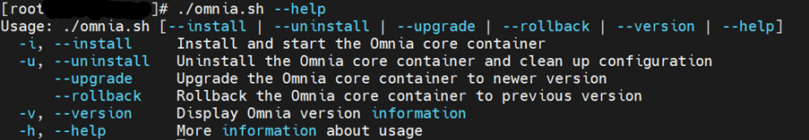
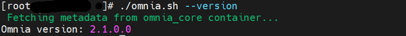
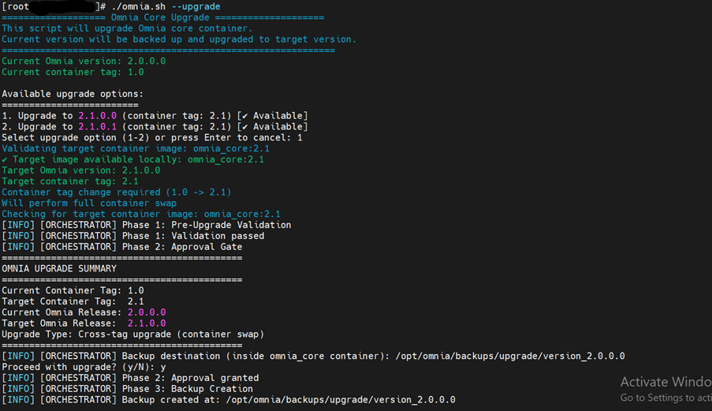
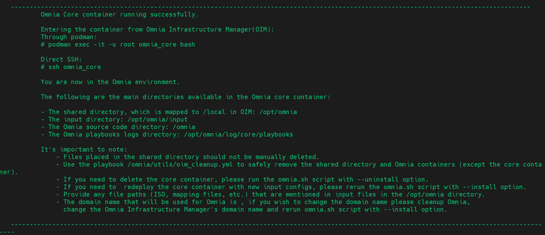
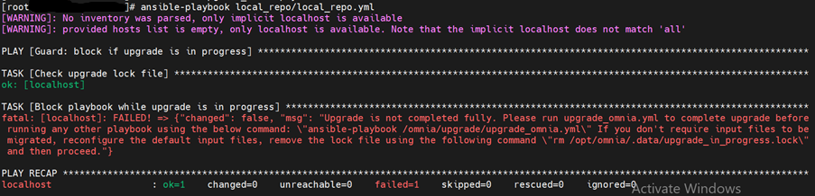
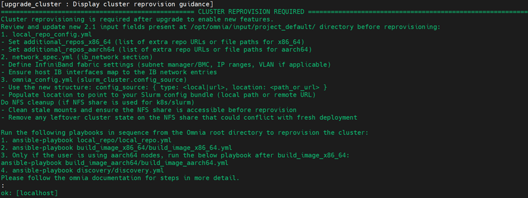
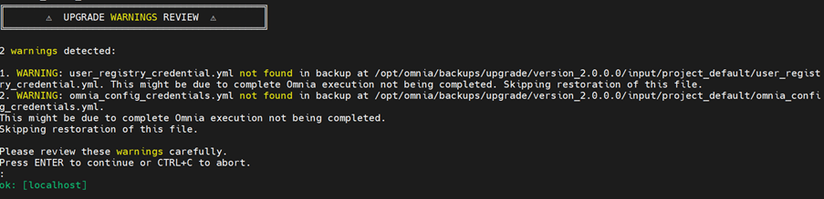

Upgrade Omnia
================
This section describes how to upgrade Omnia Core containers.

Upgrade omnia core container
----------------------------

Prerequisites
--------------

* Run the following command to retrieve the omnia.sh file for 2.1 version. ::

    wget https://raw.githubusercontent.com/dell/omnia/refs/heads/pub/q1_dev/omnia.sh

* Omnia 2.1 image must be available in the OIM. If the image is not available, run the following command to download the image. ::

    ./build_images.sh core core_tag=2.1 omnia_branch=pub/q1_dev

* Ensure that Omnia 2.0 core container is running.
* Go to the directory where the omnia.sh file for version 2.1 is located.

Omnia Configurations
--------------------

The following operations can be performed on the Omnia Core Containers: Install, uninstall, version, upgrade, and rollback.

For more information, see :ref:`View_Usage_Instructions_for_Omnia_Core_Container <view_omnia_core_container>`.

View Omnia Version
^^^^^^^^^^^^^^^^^^

To view the Omnia version, run the following command: ::
    
    ./omnia.sh --version

Upgrade
^^^^^^^^

1. To view the versions to upgrade, run the following command: ::
    
    ./omnia.sh --upgrade

2. Select the relevant version and enter yes to backup the current version files.

3. The location of the backup files is displayed. A backup is created in the directory in the NFS share path. After the upgrade is successful, a message is displayed. The backup files are available in the directory ``/opt/omnia/backups/upgrade/input``.

.. image:: images/upgrade_successful.png

The upgrade process runs inside the ``Omnia_core`` container.

After successful upgrade, run ``upgrade_omnia.yml`` to complete the process.

The backup files are available in the directory ``/opt/omnia/backups/upgrade/input``.

Running playbooks other than the ``upgrade_omnia.yml`` before ``./omnia.sh --upgrade`` generates an error with instructions.

Choose one of the following options when the error is displayed:

**Option 1: Migrate Input Files**

Run the ``upgrade_omnia.yml`` playbook. ::

    ansible-playbook /omnia/upgrade/upgrade_omnia.yml

The input files are migrated from 2.0 to 2.1 format.

The system displays guidance after successful migration completes.

If any configuration files are missing from the backup, a warning is generated before reprovisioning is started.

**Option 2: Skip Migration**

Remove the upgrade lock using the following command: ::

    rm /opt/omnia/.data/upgrade_in_progress.lock

After the lock is removed, manually reconfigure default input files of the upgraded version

Other playbooks are allowed to run normally.
