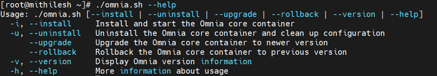
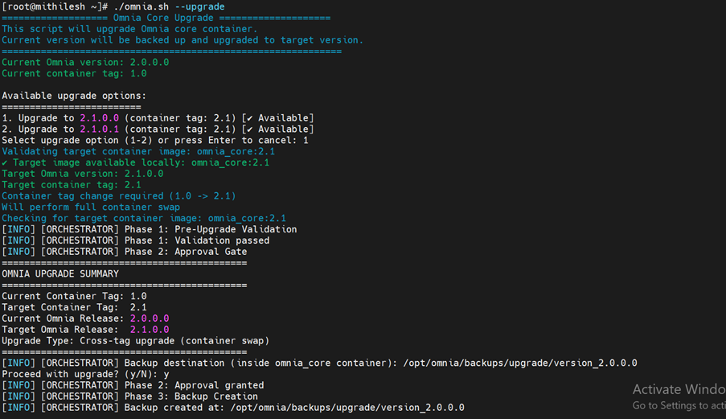
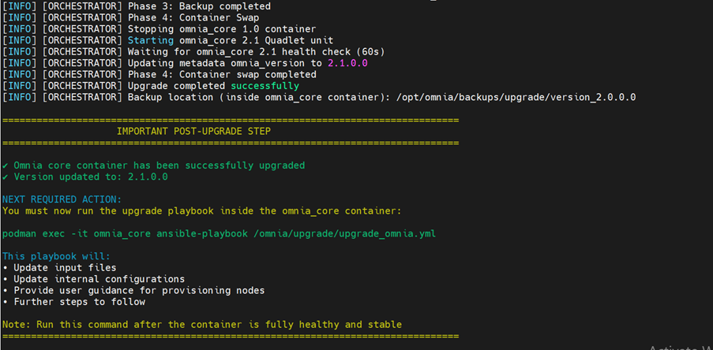

Upgrade Omnia Core Containers
================================
This section describes how to upgrade Omnia Core containers.

Prerequisites
--------------

* Run the following command to retrieve the omnia.sh file for 2.1 version. ::

    wget https://raw.githubusercontent.com/dell/omnia/refs/heads/pub/q1_dev/omnia.sh

* Omnia 2.1 image must be available in the OIM. If the image is not available, run the following command to download the image. ::

    ./build_images.sh core core_tag=2.1 omnia_branch=pub/q1_dev

* Ensure that Omnia 2.0 core container is running.
* Go to the same directory where the omnia.sh file for version 2.1 is located.

Omnia Configurations
-------------------

The following operations can be performed on the Omnia Core Containers: Version, upgrade, and rollback.
.. image:: images/omnia_configurations.png

Version
^^^^^^^^

To view the Omnia version, run the following command: ::
    
    ./omnia.sh --version

Upgrade
^^^^^^^

1. To view the upgrade options, run the following command: ::
    
    ./omnia.sh --upgrade

2. Select the relevant version.

3. To backup the current version files, enter yes. The location of the backup files is displayed. A backup is created in the directory in the NFS share path. After the upgrade is successful, a message is displayed. The backup files are available in the directory ``/opt/omnia/backups/upgrade/input``.

.. image:: images/upgrade_running_successfully.png

After successful upgrade, run upgrade_omnia.yml to complete the process.

Post-Upgrade Status
-------------------

Enter the omnia_core container after upgrade. Proceed to step 2.

Check backup files at ``/opt/omnia/backups/upgrade/input``.

Running other playbooks before step 2 triggers an error with instructions.

Post-Upgrade Options
--------------------

Choose one of two options:

**Option 1: Migrate Input Files**

Run the second upgrade step::

    ansible-playbook /omnia/upgrade/upgrade_omnia.yml

This migrates 2.0 input files to 2.1 format.

The system displays guidance after successful migration.

**Note**: Cluster reprovision guidance requires updates.

Missing config files trigger warnings before reprovisioning.

**Option 2: Skip Migration**

Manually reconfigure default input files, then remove the upgrade lock::

    rm /opt/omnia/.data/upgrade_in_progress.lock

This allows other playbooks to run normally.

Rollback
^^^^^^^^

Rollback to a previous version::

    ./omnia.sh --rollback

Select a version and confirm to proceed. The system displays rollback success and important information.

Post-Rollback Status
--------------------

Omnia 2.0 container runs with original inputs and configurations restored from backup.

