# BuildStream Release 2 - High Level Design

| | |
|---|---|
| **Template Version** | 2.46 |
| **Current Version** | 1.3 |
| **Date** | 05/02/2026 |
| **Capability ID** | 16427 |
| **Capability Name** | NERSC Automated Tools NRE Milestone 4 |
| **Author** | Rajeshkumar S |
| **Team** | Dell Omnia |
| **Document Type** | High Level Design (HLD) |
| **Reviewers** | Vatam, Venkateswara; N, Ravishankar |
| **Approved By** | N, Ravishankar |

---

## CONFIDENTIALITY NOTICE

**DELL CONFIDENTIAL - INTERNAL USE ONLY**

This document contains confidential and proprietary information of Dell Technologies. The information in this document is provided for informational purposes only and may not be disclosed, copied, distributed, or used without the express written consent of Dell Technologies. The contents of this document are intended solely for the use of Dell Technologies employees and authorized partners. Unauthorized use, disclosure, or distribution of this document or any information contained herein is strictly prohibited. This document shall be protected in accordance with Dell Technologies Information Classification and Protection standards.

Copyright (c) 2026 Dell Technologies. All Rights Reserved.

---

## Revision History

| Version | Date | Description | Author |
|---------|------|-------------|--------|
| 0.1 | 03/15/2026 | Initial draft - core architecture, API specs, and database schema | Dell Omnia Team |
| 0.2 | 03/25/2026 | Added sequence diagrams, state transitions, upgrade scenarios | Dell Omnia Team |
| 0.3 | 04/03/2026 | Updated per review feedback - added Resume & Retry logic, ListImages functional layers, deploy wrapper, PXE boot node diffs/disable, hybrid constraints | Dell Omnia Team |
| 0.4 | 04/03/2026 | Added constituent images support — new `images` DB table, updated ListImages API response to include per-role image details, updated ER diagram, upgrade scenario U1, and test cases | Dell Omnia Team |
| 0.5 | 04/06/2026 | Added software catalog extensibility (infrastructure/driver packages), Dell PowerScale storage backend support, prepare_oim modifications, and PowerScale spike requirement | Dell Omnia Team |
| 0.6 | 04/07/2026 | Added cross-references to Module Spec (API_Spec.md v2.0) and Component Spec (CSPEC-BS-C2-2026-001 Deploy Pipeline API). Updated References section. | Dell Omnia Team |
| 0.7 | 04/07/2026 | Added project code layout section (Section 4.1.3) aligned with existing codebase structure: `build_stream/` root, feature-scoped API modules, `orchestrator/` use cases, `core/` domain layer, centralized ORM models in `infra/db/models.py`, centralized repositories in `infra/db/repositories.py`. Updated DDD layer references to match module specs. | Dell Omnia Team |
| 0.8 | 04/09/2026 | Updated Deploy API behavior (Section 4.1.8) to reference the discovery/provision playbook split from pub/q2_dev merge (commit 5b30837): deploy_wrapper.yml orchestrates discovery.yml and provision.yml. |
| 0.9 | 04/15/2026 | Updated Section 3.2.3 (Deploy & Validate Pipeline Detailed Flow) to reflect implemented architecture: parent router dispatching via `trigger:include`, dynamic child pipeline via `trigger:include:artifact`, OAuth2 authentication, two-click image selection UX, validate stage as stub. | Dell Omnia Team |
| 1.0 | 04/21/2026 | Updated Section 3.2.3: added per-stage result display (deploy/restart/validate each query `GET /jobs/{id}` and print a formatted result block); rewrote summary stage as API-driven pass/fail — exits 1 (RESULT: FAILED) naming the failing stage, exits 0 (RESULT: PASSED) only when all stages complete. | Dell Omnia Team |
| 1.1 | 04/21/2026 | Expanded deploy stage ImageGroup precondition: deploy now accepts BUILT plus all intermediate/failed states (DEPLOYING, DEPLOYED, RESTARTING, RESTARTED, VALIDATING, FAILED) to support retry/redeploy after interrupted runs. PASSED and CLEANED blocked (require fresh build). Updated Section 3.2.3 sequence diagram and workflow step 13. | Dell Omnia Team |
| 1.2 | 04/23/2026 | Validated against actual GitLab CI/CD pipeline implementation (.gitlab-ci.yml, .gitlab-ci-build.yml, .gitlab-ci-deploy.yml, .gitlab-ci-deploy-child-template.yml). Confirmed alignment of pipeline architecture, stage sequences, workflow rules (PIPELINE_TYPE variable), OAuth2 authentication patterns, and API integration flows. Component specs updated to reflect actual implementation. | Dell Omnia Team |
| 1.3 | 05/02/2026 | Added capability ID 16427 (NERSC Automated Tools NRE Milestone 4). Updated pipeline UX improvements: build pipeline summary now filters to show only build-related stages (parse-catalog, generate-input-files, create-local-repository, build-image-x86_64, build-image-aarch64); deploy and cleanup pipelines now display actual image_group names (e.g., 'image-build19') instead of 'select_' prefix for better user experience. Added database schema migration 007 (VARCHAR(512) for image_name to support semicolon-delimited S3 paths). Documented Upload API (PUT /jobs/{id}/upload) with file allowlist and security validation. | Dell Omnia Team |

---

## Table of Contents

- [1. Glossary](#1-glossary)
- [2. Introduction](#2-introduction)
  - [2.1 Scope](#21-scope)
    - [2.1.1 In Scope](#211-in-scope)
    - [2.1.2 Out of Scope](#212-out-of-scope)
  - [2.2 References](#22-references)
- [3. Solution Architecture](#3-solution-architecture)
  - [3.1 Constraints and Assumptions](#31-constraints-and-assumptions)
    - [3.1.1 Constraints](#311-constraints)
    - [3.1.2 Assumptions](#312-assumptions)
  - [3.2 Control Flow](#32-control-flow)
    - [3.2.1 Overall High-Level Flow](#321-overall-high-level-flow)
    - [3.2.2 Build Pipeline Detailed Flow](#322-build-pipeline-detailed-flow)
    - [3.2.3 Deploy & Validate Pipeline Detailed Flow](#323-deploy--validate-pipeline-detailed-flow)
    - [3.2.4 CleanUp Flow](#324-cleanup-flow)
  - [3.3 Data Flow Diagram](#33-data-flow-diagram)
    - [3.3.1 ImageGroup State Machine](#331-imagegroup-state-machine)
    - [3.3.2 Job Lifecycle Across Pipelines](#332-job-lifecycle-across-pipelines)
  - [3.4 Actor/Action Matrix](#34-actoraction-matrix)
  - [3.5 Threat Model](#35-threat-model)
    - [3.5.1 Threat Identification and Mitigations](#351-threat-identification-and-mitigations)
- [4. High Level Design](#4-high-level-design)
  - [4.1 BuildStream Pipeline](#41-buildstream-pipeline)
    - [4.1.1 Component Description](#411-component-description)
    - [4.1.2 Constraints and Assumptions](#412-constraints-and-assumptions)
    - [4.1.3 Component Design](#413-component-design)
      - [4.1.3.1 Control Flow](#4131-control-flow)
      - [4.1.3.2 Data Flow](#4132-data-flow)
      - [4.1.3.3 Interfaces](#4133-interfaces)
      - [4.1.3.4 Configuration Processing](#4134-configuration-processing)
      - [4.1.3.5 Cross-Feature Interactions](#4135-cross-feature-interactions)
      - [4.1.3.6 Upgrade Scenarios](#4136-upgrade-scenarios)
    - [4.1.4 Security](#414-security)
    - [4.1.5 Resource Utilization](#415-resource-utilization)
    - [4.1.6 Open Source](#416-open-source)
    - [4.1.7 Component Test](#417-component-test)
    - [4.1.8 API Documentation](#418-api-documentation)
    - [4.1.9 Known Issues and Limitations](#419-known-issues-and-limitations)
    - [4.1.10 Unresolved Issues](#4110-unresolved-issues)

---

## 1. Glossary

| Term | Definition |
|------|-----------|
| **BuildStream** | The API and service layer orchestrating the Omnia playbooks for cluster building and deployment. |
| **OIM** | Omnia Infrastructure Manager - the control-plane node from which Omnia orchestrates Kubernetes cluster provisioning and telemetry deployment. |
| **Job ID** | A unique UUID v7 representing a single execution workflow that **spans both the Build and Deploy pipelines** — from catalog parsing through image build, deployment, restart, and validation. A Job ID is created once during the Build Pipeline and reused by the Deploy Pipeline. |
| **Image Group ID** | A unique identifier sourced directly from the catalog payload (replacement of the legacy `Image-key`). Maintains a **strict 1:1 mapping** with a Job ID. Validated for uniqueness during the `parseCatalog` stage. |
| **Image Group** | A logical grouping of built OS images identified by an Image Group ID. Contains images for various nodes/functional layers. Each Image Group is permanently associated with exactly one Job ID. |
| **Constituent Image** | An individual OS image within an Image Group, identified by a functional role name (e.g., `slurm_node`, `slurm_controller_node`, `kube_control_plane`, `kube_node`, `login_node`, `nfs_node`). Stored in the `images` table with a reference to its parent Image Group. |
| **NFS Artifact Store** | The shared filesystem location where generated configuration files, inventories, and states are stored per Job ID. |
| **PXE Mapping File** | `pxe_mapping_file.csv`, utilized during the deployment phase to map MAC addresses to specific node definitions and IP addresses. |
| **FastAPI** | A modern, high-performance Python web framework used for building the BuildStream REST API backend. |
| **PostgreSQL** | Relational database management system used by BuildStream for persistent state management. |
| **SQLAlchemy** | Python SQL toolkit and Object-Relational Mapper (ORM) used for database interactions. |
| **Alembic** | A lightweight database migration tool for usage with SQLAlchemy, used for atomic schema upgrades. |
| **Pydantic** | Python data validation library used for API request/response validation. |
| **DDD** | Domain Driven Design - software design approach used by BuildStream, where `ImageGroup` is implemented as an Entity with respective UseCases. |
| **GitLab CI/CD** | Continuous Integration/Continuous Deployment platform used to trigger Build and Deploy pipelines. |
| **Molecule** | Testing framework used for post-deployment validation of Ansible playbooks and cluster health. |

---

## 2. Introduction

This High Level Design (HLD) document describes the architecture, component design, data flows, security model, and operational characteristics of **BuildStream Release 2** within the Dell Omnia platform. This document details the implementation approach (HOW) for the Release 2 enhancements and aligns with Phase 3 of the Spec-Driven Development (SDD) methodology.

The core objectives to implement are:
1. Decouple the monolithic CI/CD pipeline into independent **Build** and **Deploy & Validate** pipelines.
2. Introduce a new Data Model with a **strict 1:1 mapping between Job ID and Image Group ID**, enabling the same Job ID to span both the Build and Deploy pipelines throughout its entire lifecycle.
3. Expose new APIs (`ListImages`, `Deploy`, `ReStart`, `Validate`, `CleanUp`) to support the deployment lifecycle.
4. Provide a generic **Upload** API for synchronizing configuration files and catalogs from GitLab to the BuildStream NFS backend.
5. Enforce **Image Group ID uniqueness** validation at the core domain layer during catalog parsing to prevent duplicate image groups across jobs.

### 2.1 Scope

#### 2.1.1 In Scope

The following items are within scope of this design document:

1. **Three-pipeline architecture:**
   - **Build Pipeline** (`.gitlab-ci-build.yml`): Triggered by catalog/config changes. Creates Job, implicitly uploads catalog and config files via the Upload API, executes stages from `parse_catalog` through `build_image`. Establishes the 1:1 Job ID ↔ Image Group ID mapping.
   - **Deploy Pipeline** (`.gitlab-ci-deploy.yml`): Triggered by PXE mapping changes. Selects existing Job ID via `ListImages` (presented as dynamic child pipelines showing role functional layers), implicitly uploads modified configs via the Upload API, executes `deploy`, `restart`, and `validate` stages.
   - **CleanUp Pipeline** (`.gitlab-ci-cleanup.yml`): Triggered manually. Selects existing Job ID via `ListImages`, executes the `cleanup` stage to remove artifacts and images.

2. **Cross-pipeline Job continuity** with a single Job ID spanning the entire lifecycle — Build through Deploy — using a `pipeline_phase` column to track ownership.

3. **Strict 1:1 Job ↔ ImageGroup mapping** enforced at the database level via UNIQUE constraint and validated at the domain layer during `parseCatalog`.

4. **New REST APIs:**
   - `PUT /api/v1/jobs/{job_id}/upload` — Generic file upload (catalog + configs)
   - `GET /api/v1/images` — List built Image Groups with Job ID mapping and constituent images (role + image name)
   - `POST /api/v1/jobs/{job_id}/stages/deploy` — Initiate deployment
   - `POST /api/v1/jobs/{job_id}/stages/restart` — PXE-based node restart with node diff handling and optional disable
   - `POST /api/v1/jobs/{job_id}/stages/validate` — Post-deployment validation via Molecule test framework
   - `DELETE /api/v1/jobs/{job_id}` — Hard delete with artifact and image cleanup (S3 + NFS)

15. **Automated cleanup cron job** running every 24 hours inside the BuildStream container to clean up Image Groups with `FAILED` (validation-failed) status.

16. **Image retention limit enforcement** — maximum 50 non-CLEANED Image Groups. Build pipeline aborted if limit reached.

5. **Resume & Retry capabilities** with single-record approach using `attempt_number` tracking, artifact versioning, and configurable stage guard logic.

6. **Database schema redesign:**
   - Modified `jobs` table with `pipeline_phase` column
   - New `image_groups` table with strict 1:1 FK constraint
   - New `images` table storing constituent images per Image Group, each identified by functional role (e.g., `slurm_node`, `slurm_controller_node`)
   - Extended `job_stages` table with `attempt_number`, `result_detail` JSONB, and UNIQUE constraint on `(job_id, stage_name)`

7. **ImageGroupID uniqueness validation** at the `parseCatalog` core domain layer to prevent duplicate image groups across jobs.

8. **Deploy wrapper playbook** orchestrating discovery and provisioning playbook execution.

9. **PXE boot node diffs** — handling for newly added nodes with explicit exclusion of already-booted nodes, plus optional PXE boot disable parameter.

10. **Alembic-managed database migrations** for upgrade from Release 1 to Release 2 with historical data preservation and backfill.

11. **CI/CD pipeline transition** from monolithic to event-driven three-pipeline model with parent pipeline router.

12. **Additional software catalog examples** in an `examples/` directory for infrastructure and driver packages, reflecting parallel Omnia product changes. Catalogs adhere to the existing catalog JSON schema (`Roles`, `FunctionalPackages`, `Infrastructure`, `InfrastructurePackages`, `Drivers`, `BaseOS`, `OSPackages`, `Miscellaneous`).

13. **Dell PowerScale storage backend support** as an alternative to NFS for the image repository. A time-boxed spike is required to determine the full scope of `prepare_oim` and backend changes. No direct changes to the BuildStream API — storage backend is transparent via mount point abstraction.

14. **`prepare_oim` playbook modifications** to support configurable storage backend selection (NFS or PowerScale) during initial OIM infrastructure setup.

#### 2.1.2 Out of Scope

The following items are explicitly out of scope:

| Item | Rationale |
|------|-----------|
| Hybrid deployments (VMs + physical nodes in a single run) | Not supported in current release; separate runs required |
| Pipeline concurrency (simultaneous Build and Deploy) | System assumes sequential operation where build completes before deploy begins |
| ~~Cron-based cleanup jobs~~ | **Moved to in-scope** — cron job every 24 hours for validation-failed images + explicit CleanUp Pipeline |
| ARM architecture support | Current release targets x86_64 only |
| Multi-cluster image deployment | Architecture supports single-cluster deployment per Image Group; future scalability consideration |
| Customer-facing behavior | Covered in the Functional Specification and BSpec documents |

### 2.2 References

| Source | Type | Title | Description |
|--------|------|-------|-------------|
| Dell Omnia | Internal | BuildStream Release 2 API Specification | Companion API specification with detailed request/response examples, authentication, and error handling |
| Dell Omnia | Internal | Module Spec — API_Spec.md v2.0 | Detailed REST API contracts including Pydantic schemas, database schema (jobs, image_groups, images, job_stages tables), state machine precondition matrix, and Deploy Pipeline DB write summary |
| Dell Omnia | Internal | Component Spec — CSPEC-BS-C2-2026-001 (Deploy Pipeline API) | Code-level component specification: internal DDD architecture (Router/Orchestrator/Core/Infrastructure layers), Molecule test framework integration, sequence diagrams for all Deploy Pipeline endpoints |
| Dell Omnia | Confluence | Omnia BuildStream Behaviour Specification (CY26 Q2) | Behaviour Specification (BSpec) covering end-to-end build and deploy behavior |
| Dell Omnia | Confluence | Product Requirements Document (PRD) Omnia 2.x | PDM requirements document defining product-level build and deployment features |
| Dell Omnia | External Docs | Omnia v2.1.0.0 Documentation | Current release documentation including installation guides, user guides, and API references |
| FastAPI | External Docs | FastAPI Documentation | Python web framework reference for asynchronous REST API development |
| SQLAlchemy | External Docs | SQLAlchemy Documentation | Python ORM reference for database interactions |
| Alembic | External Docs | Alembic Documentation | Database migration tool reference for schema upgrade management |
| GitLab | External Docs | GitLab CI/CD Documentation | CI/CD pipeline configuration reference for `.gitlab-ci.yml` |

---

## 3. Solution Architecture

The BuildStream Release 2 architecture decouples the monolithic CI/CD pipeline into two independent, event-driven pipelines — **Build** and **Deploy & Validate**. The Omnia container hosts the FastAPI-based BuildStream backend, which mediates between REST API consumers (GitLab Pipelines) and the asynchronous Ansible playbook execution queue (NFS/Redis), managing state and file assets. A single Job ID persists across both pipelines, with a strict 1:1 mapping to an Image Group ID.

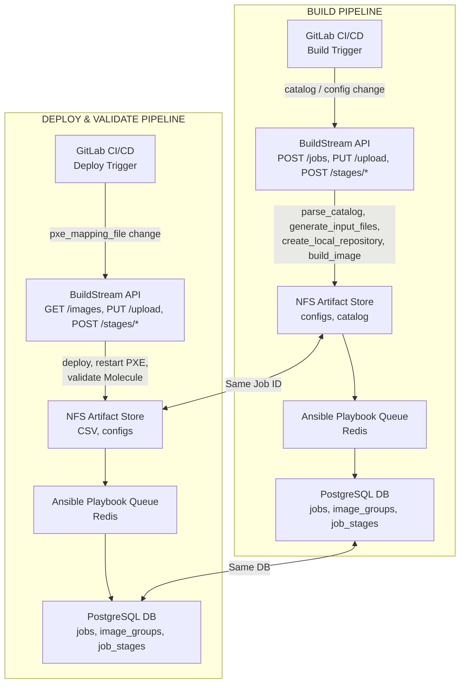

### 3.1 Constraints and Assumptions

#### 3.1.1 Constraints

| ID | Constraint | Impact |
|----|-----------|--------|
| C-01 | **NFS Synchronization**: Modified configuration files pushed from GitLab via the Upload API must overwrite the exact files in the NFS artifact directory before any playbook is executed. | Upload API must support partial updates — only uploaded files are overwritten; existing files not included in the request are left untouched. |
| C-02 | **Database Upgrades**: Existing database schemas require Alembic migrations to support the redesigned schema (modified `jobs` table, new `image_groups` table, extended `job_stages` table) without losing historical Job data. | Migration must be atomic and reproducible. Backfill logic required for historical data. |
| C-03 | **Cross-Pipeline Job Continuity**: A single Job ID created during the Build Pipeline must be reusable by the Deploy Pipeline. The Deploy Pipeline does not create new jobs; it selects an existing Job ID (via the `ListImages` API) whose Image Group is in `BUILT` status. | Job creation is exclusive to the Build Pipeline. Deploy Pipeline reuses existing Job IDs. |
| C-04 | **1:1 Job ↔ ImageGroup Invariant**: The database must enforce that each Job ID maps to exactly one Image Group ID and vice versa. | Enforced by a UNIQUE constraint on `image_groups.job_id`. Domain-level validation in `parseCatalog` provides additional protection. |
| C-05 | **Pipeline Concurrency Constraint**: Simultaneous invocation of the Build and Deploy pipelines for the same or different jobs is **not supported**. | The system assumes sequential operation where build completes before deploy begins. |
| C-06 | **Initial Setup**: As part of the initial GitLab configuration triggered by the gitlab playbook, all required configuration files (`local_repo_config.yml`, `network_spec.yml`, `provision_config.yml`, `pxe_mapping_file.csv`, `storage_config.yml`, `telemetry_config.yml`), the catalog (`catalog_rhel.json`), and pipeline definitions will be copied to the repository. | Repository must be pre-populated before any pipeline execution. |
| C-07 | **Hybrid Deployments**: Hybrid deployments involving both VMs and physical nodes in a single deployment run are **not supported**. | Separate deployment runs required for VMs and physical nodes. |
| C-08 | **Cleanup Management**: Both user-initiated cleanup (via CleanUp API and CleanUp Pipeline) and automated cron-based cleanup (every 24 hours for validation-failed images) are supported. Images are stored in S3 (`s3://boot-images`) and deleted via `s3cmd`. A retention limit of 50 non-CLEANED Image Groups is enforced. | Cleanup is both user-initiated and automated. |
| C-09 | **Storage Backend Abstraction**: Built images and artifacts may be stored on NFS or Dell PowerScale. BuildStream API layer accesses storage exclusively via the configured mount point path — no backend-specific code in the API. | `prepare_oim` must configure the appropriate storage mount; API code unchanged |
| C-10 | **PowerScale Spike Required**: Full scope of PowerScale support changes is not yet determined. A time-boxed spike is required before implementation begins. | PowerScale implementation tasks blocked until spike completion |

#### 3.1.2 Assumptions

| ID | Assumption | Validation |
|----|-----------|------------|
| A-01 | Network topology allows the GitLab Runner to communicate with the BuildStream API to upload files | Pre-deployment network connectivity check |
| A-02 | PostgreSQL database is available and accessible from the BuildStream API service | Database connection check at startup |
| A-03 | NFS Artifact Store is mounted and writable by the BuildStream API container | NFS mount verification at startup |
| A-04 | Redis queue is available for asynchronous Ansible playbook execution | Redis connectivity check at startup |
| A-05 | Ansible playbooks are available in the expected paths within the Omnia container | Path validation during stage execution |
| A-06 | GitLab CI/CD runners are configured and available for both Build and Deploy pipelines | GitLab runner registration verification |
| A-07 | Dell PowerScale appliance available and accessible from OIM host, if PowerScale storage backend is selected during `prepare_oim` configuration | Pre-deployment connectivity and mount verification |

### 3.2 Control Flow

#### 3.2.1 Overall High-Level Flow

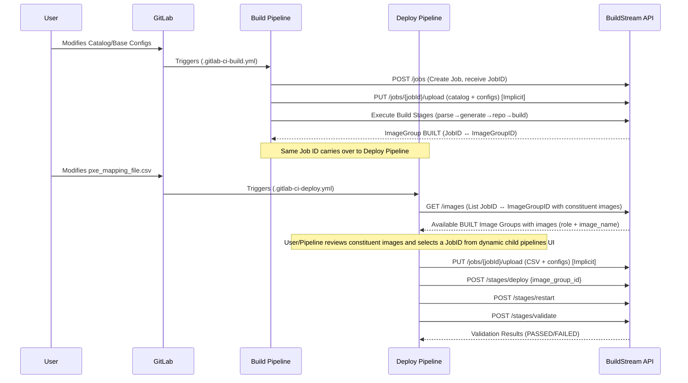

**Detailed Workflow:**
1. **User modifies Catalog/Base Configs**: The user pushes changes to `catalog_rhel.json` or core configuration files in the GitLab repository.
2. **GitLab triggers Build Pipeline**: GitLab detects the changes and triggers the Build Pipeline (`.gitlab-ci-build.yml`).
3. **Create Job**: The Build Pipeline calls `POST /jobs` to create a new Job. The API returns a **Job ID** (UUID v7) which will be used throughout the entire lifecycle — both Build and Deploy pipelines.
4. **Upload files**: The Build Pipeline implicitly calls `PUT /jobs/{jobId}/upload` with the catalog and configuration files during initialization before any playbooks run.
5. **Execute Build Stages**: The Build Pipeline sequentially triggers `parse-catalog`, `generate-input-files`, `create-local-repository`, and `build-image` stages. During `parse-catalog`, the **Image Group ID** extracted from the catalog is validated for uniqueness (see Section 4.1.3.4).
6. **ImageGroup BUILT**: Upon successful image build, a new `image_groups` record is created with the 1:1 mapping between the **Job ID** and the **Image Group ID**, with status `BUILT`.
7. **User modifies pxe_mapping_file.csv**: The user pushes changes to the PXE mapping file to define MAC-to-node mappings.
8. **GitLab triggers Deploy Pipeline**: GitLab detects the CSV change and triggers the Deploy Pipeline (`.gitlab-ci-deploy.yml`).
9. **ListImages (Selection)**: The Deploy Pipeline calls `GET /images` which returns the list of **Job ID ↔ Image Group ID** mappings with status `BUILT`, including the **constituent images** (role and image name) for each group. The user selects a target via dynamic child pipelines which explicitly show the constituent image roles. The selected **Job ID** is used for all subsequent API calls.
10. **Upload Deploy configs**: The Deploy Pipeline implicitly calls `PUT /jobs/{jobId}/upload` to push the updated CSV and any modified configs into the same Job ID's NFS directory during initialization.
11. **Deploy → ReStart → Validate**: The Deploy Pipeline sequentially calls `/stages/deploy`, `/stages/restart`, and `/stages/validate`, each updating the Image Group and Job status through the state machine.
12. **Validation Results**: The API returns the final results (`PASSED` or `FAILED`) to the Deploy Pipeline, with detailed results persisted in the `job_stages.result_detail` column.

#### 3.2.2 Build Pipeline Detailed Flow

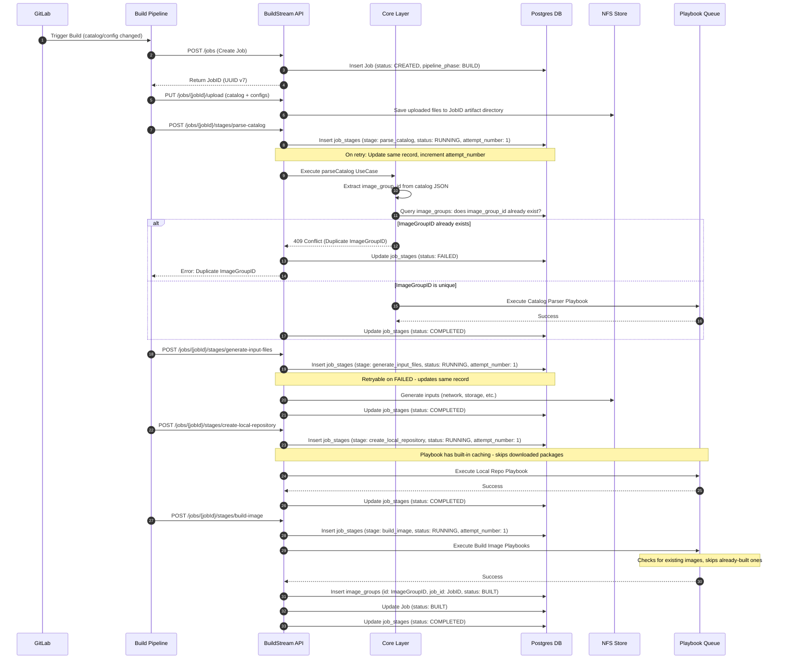

**Detailed Workflow:**
1. **Trigger Build**: GitLab triggers the Build Pipeline based on catalog or config file modifications.
2. **Create Job**: The Build Pipeline sends `POST /jobs`. The API inserts a new `jobs` record with `status: CREATED` and `pipeline_phase: BUILD`, and returns the **Job ID**.
3. **Return JobID**: The Job ID (UUID v7) is returned to the pipeline. This same ID will be reused by the Deploy Pipeline later.
4. **Upload Files**: The Build Pipeline sends `PUT /jobs/{jobId}/upload` with the catalog and configuration files.
5. **Save to NFS**: The API validates file names and saves them to the Job ID's NFS artifact directory.
6. **Parse Catalog**: The Build Pipeline triggers the `parse-catalog` stage.
7. **Stage Record Created**: The API inserts a `job_stages` record for `parse_catalog` with `status: RUNNING`.
8. **Core Layer Invoked**: The API delegates to the `parseCatalog` use case in the Core layer.
9. **Extract ImageGroupID**: The Core layer extracts the `image_group_id` from the catalog JSON payload.
10. **Uniqueness Check**: The Core layer queries `image_groups` to verify the Image Group ID does not already exist (see Section 4.1.3.4).
11. **Duplicate Handling (alt path)**: If the Image Group ID already exists, the stage fails with `409 Conflict` and the `job_stages` record is marked `FAILED`.
12. **Execute Parser**: If the Image Group ID is unique, the Catalog Parser playbook is queued and executed.
13. **Generate Inputs**: The Build Pipeline triggers `generate-input-files`. The API generates network, storage, and other input files and saves them to NFS.
14. **Create Local Repo**: The Build Pipeline triggers `create-local-repository`. The Local Repo playbook is queued and executed.
15. **Build Image**: The Build Pipeline triggers `build-image`. The Build Image playbooks are queued and executed.
16. **Create ImageGroup Record**: On success, the API inserts a new `image_groups` record with the **Image Group ID** (from catalog) as PK and the **Job ID** as FK, establishing the 1:1 mapping. Status is set to `BUILT`.
17. **Update Job Status**: The `jobs` record is updated to `status: BUILT`, signaling the Build Pipeline is complete and the job is eligible for deployment.

#### 3.2.3 Deploy & Validate Pipeline Detailed Flow

The Deploy Pipeline uses a **parent router → child pipeline → dynamic grandchild pipeline** architecture. The parent router (`.gitlab-ci.yml`) dispatches to `.gitlab-ci-deploy.yml` on `pxe_mapping_file.csv` changes. The deploy pipeline queries available image groups and generates a dynamic child pipeline using `trigger:include:artifact` for interactive image selection.

**Pipeline Architecture:**
```
Parent Router (.gitlab-ci.yml)
  └── Deploy Pipeline (.gitlab-ci-deploy.yml) — triggered by PXE mapping change
        ├── list_images stage — queries API, generates deploy_child.yml
        └── trigger_deploy — trigger:include:artifact → deploy_child.yml
              ├── select_<image_group> (manual) — operator selects image group
              ├── deploy (manual) — uploads configs, calls deploy API, polls,
              │                     then prints per-stage result via GET /jobs/{id}
              ├── restart (auto) — calls restart API, polls,
              │                    then prints per-stage result via GET /jobs/{id}
              ├── validate (auto/stub) — placeholder for Molecule tests;
              │                         prints stub result summary
              └── summary (always) — queries GET /jobs/{id}; prints stage table;
                                     exits 1 (RESULT: FAILED) if any stage
                                     FAILED/CANCELLED (names the failing stage);
                                     exits 0 (RESULT: PASSED) when all complete
```

```mermaid
sequenceDiagram
    autonumber
    participant GitLab
    participant Router as Parent Router
    participant Deploy as Deploy Pipeline
    participant Child as Dynamic Child Pipeline
    participant Operator
    participant API as BuildStream API
    participant DB as Postgres DB
    participant NFS as NFS Store
    participant PB as Playbook Queue

    GitLab->>Router: Push (pxe_mapping_file.csv changed)
    Router->>Deploy: trigger:include .gitlab-ci-deploy.yml

    Deploy->>API: POST /auth/token (OAuth2 client credentials)
    API-->>Deploy: access_token
    Deploy->>API: GET /images?status=BUILT&limit=50
    API->>DB: Query image_groups WHERE status = 'BUILT' JOIN images
    API-->>Deploy: List of {job_id, image_group_id, images[], status, created_at}
    Note over Deploy: Python script generates deploy_child.yml<br/>with one manual job per BUILT image group

    Deploy->>Child: trigger:include:artifact (deploy_child.yml)
    Note over Child,Operator: GitLab UI presents manual selection jobs

    Operator->>Child: Click select_<image_group> (1st click — writes JOB_ID + IMAGE_GROUP_ID)
    Operator->>Child: Click deploy job (2nd click — confirms deployment)

    Child->>API: PUT /jobs/{jobId}/upload (CSV + configs)
    API->>NFS: Overwrite files in JobID artifact directory

    Child->>API: POST /jobs/{jobId}/stages/deploy {image_group_id}
    API->>DB: Verify image_group_id matches JobID's ImageGroup
    API->>DB: Verify ImageGroup status in retryable set (BUILT/DEPLOYING/DEPLOYED/RESTARTING/RESTARTED/VALIDATING/FAILED)
    API->>DB: Update Job (pipeline_phase: DEPLOY, status: DEPLOYING)
    API->>DB: Update ImageGroup (status: DEPLOYING)
    API->>DB: Insert job_stages (stage: deploy, status: RUNNING, attempt_number: 1)
    Note over API,DB: Re-runnable after COMPLETED - updates same record, increments attempt_number
    API->>PB: Execute Discovery Playbook
    PB-->>API: Success
    API->>DB: Update ImageGroup (status: DEPLOYED)
    API->>DB: Update Job (status: DEPLOYED)
    API->>DB: Update job_stages (stage: deploy, status: COMPLETED)

    Child->>API: POST /jobs/{jobId}/stages/restart
    API->>DB: Verify ImageGroup status is DEPLOYED
    API->>DB: Update ImageGroup (status: RESTARTING)
    API->>DB: Update Job (status: RESTARTING)
    API->>DB: Insert job_stages (stage: pxe_boot, status: RUNNING, attempt_number: 1)
    Note over API,DB: Re-runnable after COMPLETED with new PXE mapping
    API->>PB: Execute utils/set_pxe_boot.yml
    PB-->>API: Success
    API->>DB: Update ImageGroup (status: RESTARTED)
    API->>DB: Update Job (status: RESTARTED)
    API->>DB: Update job_stages (stage: pxe_boot, status: COMPLETED)

    Child->>API: POST /jobs/{jobId}/stages/validate
    API->>DB: Verify ImageGroup status is RESTARTED
    API->>DB: Update ImageGroup (status: VALIDATING)
    API->>DB: Update Job (status: VALIDATING)
    API->>DB: Insert job_stages (stage: validate, status: RUNNING, attempt_number: 1)
    Note over API,DB: Re-runnable after COMPLETED or FAILED
    API->>PB: Execute Test Suites
    PB-->>API: Results (Pass/Fail)
    alt Tests Passed
        API->>DB: Update ImageGroup (status: PASSED)
        API->>DB: Update Job (status: PASSED)
        API->>DB: Update job_stages (status: COMPLETED, result_detail: {outcome: PASSED, ...})
    else Tests Failed
        API->>DB: Update ImageGroup (status: FAILED)
        API->>DB: Update Job (status: FAILED)
        API->>DB: Update job_stages (status: FAILED, result_detail: {outcome: FAILED, ...})
    end
    API-->>Child: Validation Results

    Note over Child: Each stage (deploy/restart/validate) prints<br/>a formatted result block via GET /jobs/{jobId}
    Child->>API: GET /jobs/{jobId} (summary stage)
    API-->>Child: Final stage states (deploy/restart/validate)
    Note over Child: summary evaluates states:<br/>FAILED if any FAILED/CANCELLED;<br/>PASSED if all COMPLETED
```

**Detailed Workflow:**
1. **Trigger via Parent Router**: GitLab detects `pxe_mapping_file.csv` change and the parent router (`.gitlab-ci.yml`) dispatches to `.gitlab-ci-deploy.yml` via `trigger:include`.
2. **Authenticate**: The deploy pipeline authenticates using stored OAuth2 client credentials (`BSM_CLIENT_ID`/`BSM_CLIENT_SECRET`) to obtain an access token.
3. **ListImages**: The Deploy Pipeline calls `GET /images?status=BUILT` to retrieve available Image Groups.
4. **Query DB**: The API queries `image_groups` for records with `status = BUILT`, joining the `images` table to retrieve the constituent images (role and image name) for each group.
5. **Return Mapping List**: The API returns a list of `{job_id, image_group_id, images[{role, image_name}], status, created_at}` objects — the **Job ID ↔ Image Group ID mapping** enriched with the constituent images for each group.
6. **Generate Dynamic Child Pipeline**: An embedded Python script generates `deploy_child.yml` — a complete GitLab CI/CD pipeline YAML with one manual selection job per BUILT image group, plus static deploy/restart/validate/summary stages.
7. **Launch Child Pipeline**: The `trigger_deploy` bridge job uses `trigger:include:artifact` to launch the generated child pipeline. This is a **GitLab-native** mechanism (no API calls to GitLab needed). The child pipeline inherits all project-level CI/CD variables.
8. **Image Selection (1st Click)**: The operator reviews the available image groups (presented as manual jobs in GitLab UI showing image group ID, Job ID, roles, and creation date) and clicks the desired one. This writes `JOB_ID` and `IMAGE_GROUP_ID` to a dotenv artifact.
9. **Confirm Deploy (2nd Click)**: The operator clicks the `deploy` job to confirm and start deployment. This two-click UX prevents accidental deployments. **No new job is created** — the selected Job ID from the Build Pipeline is reused.
10. **Upload Deploy Configs**: The deploy stage calls `PUT /jobs/{jobId}/upload` with the updated CSV and any modified configuration files.
11. **Overwrite NFS Files**: The API overwrites the corresponding files in the Job ID's NFS artifact directory.
12. **Deploy Stage**: The child pipeline sends `POST /jobs/{jobId}/stages/deploy` with the selected `image_group_id`, then polls `GET /jobs/{jobId}` until the deploy stage reaches a terminal state. On completion, a formatted result block is printed showing deploy stage state and job state.
13. **Validation Checks**: The API verifies (a) the `image_group_id` matches the Job's associated Image Group (1:1 constraint), and (b) the Image Group status is in the retryable set: `BUILT`, `DEPLOYING`, `DEPLOYED`, `RESTARTING`, `RESTARTED`, `VALIDATING`, or `FAILED`. This allows retrying a failed or interrupted deploy pipeline on the same Job ID without requiring a new build. `PASSED` and `CLEANED` are blocked — they require a fresh build cycle.
14. **Transition to DEPLOY Phase**: The API updates `jobs.pipeline_phase` to `DEPLOY` and sets both Job and Image Group status to `DEPLOYING`.
15. **Execute Discovery**: The Discovery playbook is queued. On success, status transitions to `DEPLOYED`.
16. **ReStart Stage**: The child pipeline sends `POST /jobs/{jobId}/stages/restart`, then polls for completion.
17. **Precondition Check**: The API verifies the Image Group status is `DEPLOYED`.
18. **Execute PXE Boot**: The API queues `utils/set_pxe_boot.yml`. Status transitions to `RESTARTING`, then `RESTARTED` on success.
19. **Validate Stage**: The child pipeline sends `POST /jobs/{jobId}/stages/validate`. **Note:** This is currently a stub — the Molecule test framework integration is planned for Sprint 3.
20. **Precondition Check**: The API verifies the Image Group status is `RESTARTED`.
21. **Execute Test Suites**: The test suite playbooks are queued and executed.
22. **Persist Results**: The validation outcome (pass/fail counts, failure details) is persisted in the `job_stages.result_detail` JSONB column.
23. **Final Status**: The Image Group and Job statuses are set to `PASSED` or `FAILED` based on test results.
24. **Per-Stage Result Display**: Each of the deploy, restart, and validate stages prints a formatted result block at completion, querying `GET /jobs/{jobId}` to retrieve and display the stage state and job state.
25. **Summary Stage**: Runs `when: always` regardless of prior stage outcomes. Queries `GET /jobs/{jobId}` to evaluate the final state of all three deploy pipeline stages. Exits 1 with `RESULT: FAILED` if any stage is FAILED or CANCELLED (identifying the failing stage by name). Exits 0 with `RESULT: PASSED` only when deploy and restart stages are COMPLETED and validate is COMPLETED or NOT_RUN (stub scenario).

#### 3.2.4 CleanUp Flow

##### 3.2.4.1 Manual CleanUp (API-Driven)

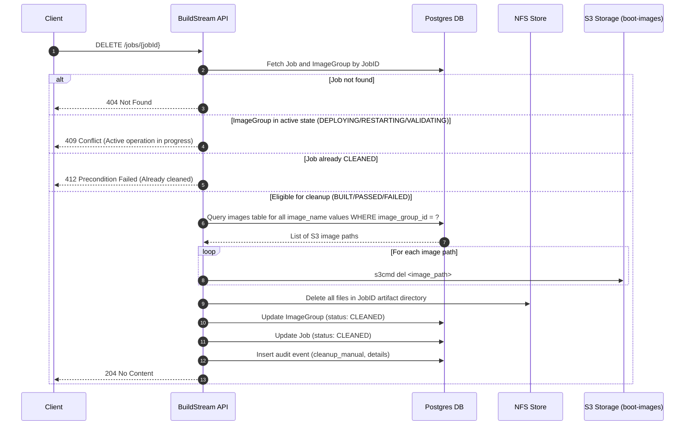

**Detailed Workflow:**
1. **Delete Request**: A client (pipeline, operator, or scheduled task) sends `DELETE /jobs/{jobId}`.
2. **Fetch Job & ImageGroup**: The API queries the `jobs` and `image_groups` tables using the Job ID (leveraging the 1:1 mapping). The `image_group_id` is resolved internally.
3. **Guard: Job Not Found**: If no matching Job ID exists, return `404 Not Found`.
4. **Guard: Active State**: If the Image Group is in an active (non-terminal) state (`DEPLOYING`, `RESTARTING`, `VALIDATING`), return `409 Conflict` to prevent cleanup during in-progress operations.
5. **Guard: Already Cleaned**: If the Job is already in `CLEANED` status, return `412 Precondition Failed`.
6. **Query Image Paths**: Query the `images` table to retrieve all `image_name` values (S3 paths) for the Image Group.
7. **Delete S3 Images**: For each image path, execute `s3cmd del <image_path>` within the BuildStream container to remove the image from S3 storage.
8. **Delete NFS Artifacts**: Remove all files in the Job ID's NFS artifact directory (configs, catalog JSON, inventories, generated inputs).
9. **Update Statuses**: Set both `image_groups.status` and `jobs.status` to `CLEANED`.
10. **Audit Trail**: Record an audit event with cleanup type (`cleanup_manual`), files removed, S3 objects deleted, and timestamp.
11. **Return Success**: Return `204 No Content` on success.

**Example S3 Image Path:**
```
s3://boot-images/slurm_node_x86_64/rhel-slurm_node_x86_64_d539a459-023e-4572-b0b8-ef9513b7e26e-image-build1/rhel10.0-rhel-slurm_node_x86_64_d539a459-023e-4572-b0b8-ef9513b7e26e-image-build1-10.0
```

The `image_name` column in the `images` table stores the full S3 path, which is used directly in the `s3cmd del` command.

##### 3.2.4.2 Automated CleanUp (Cron-Based)

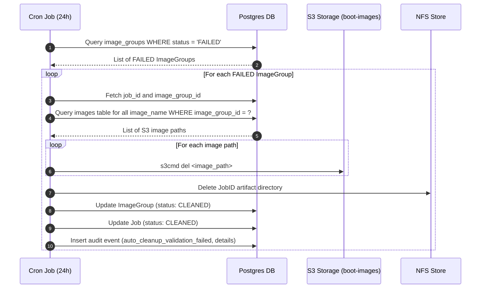

**Detailed Workflow:**
1. **Cron Trigger**: A cron job configured inside the BuildStream container fires every **24 hours** (interval configurable via environment variable `CLEANUP_INTERVAL_HOURS`, default: `24`).
2. **Query Failed Images**: The cron job queries `image_groups` for all records with `status = 'FAILED'`.
3. **For Each Failed Image Group**:
   a. Resolve the `job_id` and `image_group_id`.
   b. Query the `images` table to retrieve all `image_name` values (S3 paths) for the Image Group.
   c. For each image path, execute `s3cmd del <image_path>` to remove the image from S3.
   d. Remove NFS artifact files for the associated Job.
   e. Transition Image Group to `CLEANED` and Job to `CLEANED`.
   f. Record an audit event with reason `auto_cleanup_validation_failed`.
4. **Error Handling**: If cleanup fails for a specific Image Group, log the error and continue with the next one. Failed cleanups are retried on the next cron cycle.

##### 3.2.4.3 Image Retention Limit

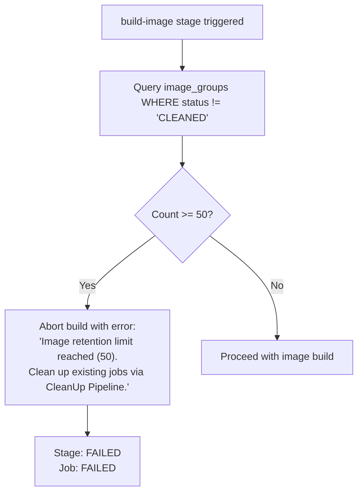

**Behavior:**
- Before the `build-image` stage begins execution, the system queries the count of non-CLEANED Image Groups.
- If the count equals or exceeds **50** (configurable via `IMAGE_RETENTION_LIMIT`, default: `50`), the build is aborted immediately.
- The `build_image` stage is marked `FAILED` with error code `RETENTION_LIMIT_EXCEEDED`.
- The CI/CD pipeline receives the failure and prompts the user to clean up via the CleanUp Pipeline.

### 3.3 Data Flow Diagram

#### 3.3.1 ImageGroup State Machine

The following state machine governs all valid transitions for an Image Group record. Transitions are triggered by specific API calls and are enforced by precondition checks at the API layer.

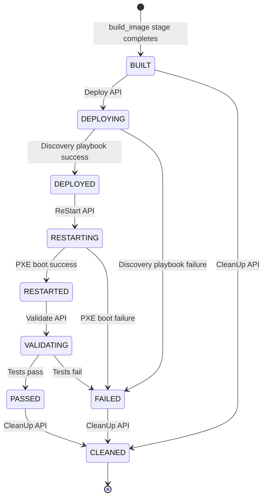

**State Descriptions:**

| State | Description | Triggered By |
| :--- | :--- | :--- |
| `BUILT` | Images successfully built. Eligible for deployment or cleanup. | `build-image` stage completion |
| `DEPLOYING` | Discovery playbook is executing. | `POST /stages/deploy` |
| `DEPLOYED` | Discovery playbook completed. Nodes configured. | Discovery playbook success |
| `RESTARTING` | PXE boot playbook is executing. Nodes rebooting. | `POST /stages/restart` |
| `RESTARTED` | Nodes have restarted successfully. Ready for validation. | PXE boot playbook success |
| `VALIDATING` | Post-deployment test suites are executing. | `POST /stages/validate` |
| `PASSED` | All validation tests passed. Terminal state (eligible for cleanup). | Test suite success |
| `FAILED` | A stage failed. Terminal state (eligible for cleanup). | Any playbook failure |
| `CLEANED` | All artifacts and images removed. Terminal state. | `DELETE /cleanup` |

**Job Status Enum:**

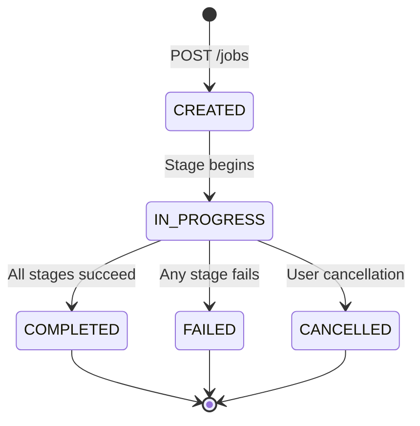

**Terminal states**: `COMPLETED`, `FAILED`, `CANCELLED`.

#### 3.3.2 Job Lifecycle Across Pipelines

This diagram illustrates how a single Job ID flows across the Build and Deploy pipelines, with the `pipeline_phase` column tracking the current phase.

```mermaid
flowchart LR
    subgraph BUILD_PIPELINE ["Build Pipeline (.gitlab-ci-build.yml)"]
        direction TB
        A["POST /jobs<br>Create Job"] --> B["PUT /upload<br>Upload catalog + configs"]
        B --> C["parse_catalog<br>Validate ImageGroupID uniqueness"]
        C --> D[generate_input_files]
        D --> E[create_local_repository]
        E --> F[build_image]
        F --> G["ImageGroup created<br>status: BUILT<br>JobID-ImageGroupID established"]
    end

    subgraph SELECTION ["Selection Phase"]
        direction TB
        H["GET /images<br>Retrieve JobID-ImageGroupID mapping"] --> I["User selects<br>JobID + ImageGroupID"]
    end

    subgraph DEPLOY_PIPELINE ["Deploy Pipeline (.gitlab-ci-deploy.yml)"]
        direction TB
        J["PUT /upload<br>Upload CSV + configs to same JobID"] --> K["POST /stages/deploy<br>pipeline_phase to DEPLOY"]
        K --> L["POST /stages/restart<br>PXE boot nodes"]
        L --> M["POST /stages/validate<br>Run test suites"]
        M --> N{Results}
        N -- Pass --> O[PASSED]
        N -- Fail --> P[FAILED]
    end

    subgraph CLEANUP ["Cleanup Phase (Optional)"]
        direction TB
        Q["DELETE /cleanup<br>Remove images + artifacts<br>Status to CLEANED"]
    end

    G --> H
    I --> J
    O --> Q
    P --> Q
```

**Key Points:**
* The **Job ID** is created once during the Build Pipeline and is never re-created. The Deploy Pipeline reuses the same Job ID.
* The **Image Group ID** is sourced from the catalog during `parse_catalog` and validated for uniqueness before any build work proceeds.
* The **`pipeline_phase`** column on the `jobs` table transitions from `BUILD` to `DEPLOY` when the first deploy stage is invoked, providing a clear audit trail of which pipeline is operating on the job.
* All stages from both pipelines are recorded in the **same `job_stages` table**, providing a complete history of the Job's execution across pipelines.
* The **CleanUp** phase is optional and can be triggered at any terminal state (`BUILT`, `PASSED`, `FAILED`).

### 3.4 Actor/Action Matrix

| Actor | Action | Authorization | Notes |
|-------|--------|---------------|-------|
| **User** | Commit `catalog_rhel.json` to GitLab | **Allowed** | Triggers Build Pipeline via `.gitlab-ci-build.yml` |
| **User** | Modify `pxe_mapping_file.csv` or configs in GitLab | **Allowed** | Triggers Deploy Pipeline via `.gitlab-ci-deploy.yml` |
| **Build Pipeline** | Create Job (obtain Job ID) | **Allowed** | `POST /jobs` — creates new Job with `pipeline_phase: BUILD` |
| **Build Pipeline** | Upload Configs & Catalog | **Allowed** | `PUT /jobs/{id}/upload` — validates file names against allowlist |
| **Build Pipeline** | Execute Build Stages | **Allowed** | `POST /stages/parse-catalog`, `generate-input-files`, `create-local-repository`, `build-image` |
| **Deploy Pipeline** | List Built Images (JobID ↔ ImageGroupID) | **Allowed** | `GET /images` — returns `BUILT` Image Groups with constituent images (role + image_name) |
| **Deploy Pipeline** | Select JobID + ImageGroupID | **Allowed** | Pipeline logic / User selection from ListImages response |
| **Deploy Pipeline** | Upload modified CSV & Configs | **Allowed** | `PUT /jobs/{id}/upload` — same Job ID from Build Pipeline |
| **Deploy Pipeline** | Trigger Deployment | **Allowed** | `POST /jobs/{id}/stages/deploy` — requires `BUILT` status |
| **Deploy Pipeline** | Restart Nodes (PXE) | **Allowed** | `POST /jobs/{id}/stages/restart` — handles node diffs, optional PXE disable |
| **Deploy Pipeline** | Run Validations | **Allowed** | `POST /jobs/{id}/stages/validate` — Molecule test framework |
| **Operator / Pipeline** | Clean Up Job Artifacts & Images | **Allowed** | `DELETE /jobs/{id}/cleanup` — requires terminal state |
| **Operator / Pipeline** | Retry Failed Stages | **Allowed** | Re-invoke stage API on `FAILED` status; `attempt_number` incremented |
| **Unauthorized User** | Upload restricted files (vault, keys, certs) | **Denied** | Upload API rejects files matching restricted naming patterns |
| **Unauthorized User** | Clean up active operations | **Denied** | CleanUp API returns `409 Conflict` for non-terminal states |

### 3.5 Threat Model

#### 3.5.1 Threat Identification and Mitigations

| Threat ID | Threat | Attack Vector | Likelihood | Impact | Mitigation | Residual Risk |
|-----------|--------|---------------|------------|--------|------------|---------------|
| T-01 | **Accidental Secret Uploads** | Vault or credential files uploaded via Upload API, exposing secrets in NFS artifact store | Medium | Critical | GitLab repositories configured to exclude vault and credential files; Upload API rejects files matching restricted naming patterns (e.g., `*vault*`, `*.key`, `*.pem`) | Low - defense in depth with both GitLab and API-level controls |
| T-02 | **Malicious Input in Configuration Uploads** | Path traversal (`../`, `..\\`, `%2e%2e/`) or command injection in uploaded files like `pxe_mapping_file.csv` | Medium | High | Upload API strictly validates for path traversal patterns, sanitizes file names, and structurally validates files before writing to NFS to prevent command injection in subsequent Ansible runs | Low - multiple validation layers |
| T-03 | **Arbitrary Image Deployment** | Attacker deploys an Image Group that does not match the Job's associated images, potentially deploying tampered OS images | Low | Critical | Deploy API enforces strict reference constraints: verifies both the 1:1 Job ID ↔ Image Group ID mapping and that the Image Group status is `BUILT` before allowing deployment; mismatched `image_group_id` values rejected with `409 Conflict` | Very Low - database-level constraints provide backstop |
| T-04 | **Unauthorized Resource Deletion via CleanUp** | Accidental or malicious cleanup of actively running deployments, causing service disruption | Medium | High | CleanUp API enforces state preconditions — cleanup only permitted when Image Group is in terminal state (`BUILT`, `PASSED`, `FAILED`); active operations (`DEPLOYING`, `RESTARTING`, `VALIDATING`) protected; Job ID existence validated before any destructive operations | Low - state machine enforces safe transitions |
| T-05 | **ImageGroupID Collision / Replay** | Accidental or malicious re-use of an existing Image Group ID to overwrite or corrupt a previously built image set | Low | High | `parseCatalog` core layer validates that Image Group ID does not already exist in `image_groups` table; database PK constraint on `image_groups.id` provides additional backstop; `409 Conflict` returned with existing Job ID reference | Very Low - domain + database level protection |

---

## 4. High Level Design

### 4.1 BuildStream Pipeline

#### 4.1.1 Component Description

The BuildStream Release 2 pipeline consists of a FastAPI-based backend service that orchestrates two independent CI/CD pipelines through REST APIs, managing state in PostgreSQL and artifacts on NFS.

| Component | Tier | Deployment | Description |
|-----------|------|------------|-------------|
| **BuildStream API** | Service | Omnia Container | FastAPI (Python) backend providing REST API endpoints for Build and Deploy pipeline stages. Handles request validation via Pydantic, state management via SQLAlchemy/PostgreSQL, and async playbook execution via Redis queue. |
| **PostgreSQL Database** | Storage | Omnia Container | Relational database storing `jobs`, `image_groups`, `images`, and `job_stages` tables. Enforces 1:1 Job ↔ ImageGroup mapping via UNIQUE constraints. Managed via Alembic migrations. |
| **NFS Artifact Store** | Storage | Shared Filesystem | Persistent storage for configuration files, catalogs, generated inputs, inventories, and states per Job ID. Shared between Build and Deploy pipelines. |
| **Ansible Playbook Queue** | Execution | Redis / Omnia Container | Asynchronous execution engine for Ansible playbooks. Stages are queued and polled for completion. Supports build playbooks (catalog parser, input generator, local repo, image builder) and deploy playbooks (discovery, PXE boot, molecule validation). |
| **GitLab CI/CD** | Trigger | External | Event-driven pipeline trigger. Build Pipeline (`.gitlab-ci-build.yml`) triggered by catalog/config changes. Deploy Pipeline (`.gitlab-ci-deploy.yml`) triggered by PXE mapping changes. Parent router (`.gitlab-ci.yml`) uses `rules:changes` for dispatch. |

**Technology Stack:**

| Technology | Purpose |
|-----------|---------|
| FastAPI (Python) | Asynchronous, high-performance REST APIs |
| PostgreSQL | Relational data management with SQLAlchemy ORM |
| Alembic | Atomic schema upgrades and database migrations |
| Pydantic | API request/response validation |
| Ansible Playbooks | Cluster building and deployment execution engine |
| NFS | Shared filesystem for configuration and inventory storage |
| Redis | Asynchronous playbook execution queue |

#### 4.1.2 Constraints and Assumptions

**Component-Level Constraints:**

| ID | Component | Constraint |
|----|-----------|-----------|
| CC-01 | BuildStream API | Single instance deployment; no horizontal scaling of the API layer |
| CC-02 | PostgreSQL | Single database instance; no replication in current release |
| CC-03 | NFS Artifact Store | Upload API enforces file name allowlist and size limits |
| CC-04 | Ansible Playbooks | Sequential stage execution per Job; no parallel stage execution within a single Job |
| CC-05 | GitLab CI/CD | Pipeline concurrency not supported; Build must complete before Deploy begins |
| CC-06 | Database Schema | Alembic migrations required for Release 1 to Release 2 upgrade; historical data preserved |

**Component-Level Assumptions:**

| ID | Component | Assumption |
|----|-----------|-----------|
| CA-01 | BuildStream API | FastAPI async capabilities are sufficient for expected concurrent request load |
| CA-02 | PostgreSQL | Database storage is sufficient for expected Job and stage record volume |
| CA-03 | NFS Artifact Store | NFS mount is reliable and provides sufficient I/O performance for file upload and playbook execution |
| CA-04 | Ansible Playbooks | Playbook execution time is within acceptable limits for CI/CD pipeline timeouts |
| CA-05 | GitLab CI/CD | GitLab Runners are available and configured for both Build and Deploy pipelines |
| CA-06 | Molecule | Molecule test framework provides sufficient benchmark tests to comprehensively validate cluster deployment, network configuration, and service health |

#### 4.1.3 Component Design

The BuildStream API application follows a layered DDD architecture (Approach A) with feature-scoped API modules, centralized ORM models, `dependency_injector` DI, and synchronous SQLAlchemy. The code layout aligns with the existing codebase conventions used across the project.

**Project Code Layout:**

```
build_stream/
├── api/                                   # API Layer — Feature-scoped routers
│   ├── router.py                          # Central router — includes all feature routers
│   ├── dependencies.py                    # Shared DI factories (DB session, common repos)
│   ├── exception_handlers.py              # Centralized domain → HTTP exception mapping
│   ├── logging_utils.py                   # Secure logging utility
│   ├── parse_catalog/                     # Parse-Catalog API module
│   │   ├── routes.py                      # POST /stages/parse-catalog
│   │   ├── schemas.py                     # Pydantic request/response schemas
│   │   └── dependencies.py               # DI wiring for parse-catalog use case
│   ├── build_image/                       # Build-Image API module
│   │   ├── routes.py                      # POST /stages/build-image
│   │   ├── schemas.py
│   │   └── dependencies.py
│   ├── images/                            # Images API module (Deploy Pipeline entry point)
│   │   ├── routes.py                      # GET /images
│   │   ├── schemas.py
│   │   └── dependencies.py
│   ├── deploy/                            # Deploy API module
│   │   ├── routes.py                      # POST /stages/deploy
│   │   ├── schemas.py
│   │   └── dependencies.py
│   ├── restart/                           # Restart API module
│   │   ├── routes.py                      # POST /stages/restart
│   │   ├── schemas.py
│   │   └── dependencies.py
│   └── validate/                          # Validate API module
│       ├── routes.py                      # POST /stages/validate
│       ├── schemas.py
│       └── dependencies.py
├── orchestrator/                          # Orchestrator Layer — Use cases
│   ├── catalog/
│   │   └── use_cases/
│   │       └── parse_catalog_use_case.py  # Parse-catalog orchestration
│   ├── build_image/
│   │   └── use_cases/
│   │       └── build_image_use_case.py    # Build-image orchestration
│   ├── images/
│   │   └── use_cases/
│   │       └── list_images_use_case.py    # Images query + response assembly
│   ├── deploy/
│   │   └── use_cases/
│   │       └── deploy_use_case.py         # Deploy orchestration: guard → transition → playbook
│   ├── restart/
│   │   └── use_cases/
│   │       └── restart_use_case.py        # Restart orchestration: PXE boot
│   ├── validate/
│   │   └── use_cases/
│   │       └── validate_use_case.py       # Validate orchestration: Molecule invocation
│   └── common/
│       └── result_poller.py               # NFS result queue poller, completion callbacks
├── core/                                  # Core Layer — Domain entities, interfaces, rules
│   ├── image_group/
│   │   ├── entities.py                    # ImageGroup, Image domain entities
│   │   ├── value_objects.py               # ImageGroupId, ImageGroupStatus, PipelinePhase
│   │   ├── repositories.py               # Repository interfaces (abstract)
│   │   ├── exceptions.py                  # Domain exceptions
│   │   └── state_machine.py              # Guard functions, allowed status transitions
│   └── jobs/
│       ├── value_objects.py               # JobId, StageType, StageName enums
│       └── use_cases/
│           └── job_stage_use_case.py      # Stage record management, attempt tracking
├── infra/                                 # Infrastructure Layer — External system adapters
│   ├── db/
│   │   ├── models.py                      # Centralized ORM models (all tables)
│   │   ├── repositories.py               # Centralized SQL repository implementations
│   │   └── alembic/
│   │       └── versions/                  # Alembic migration scripts
│   └── playbook/
│       ├── executor.py                    # Redis/NFS playbook queue integration
│       └── molecule_runner.py             # Molecule test framework invocation
└── container.py                           # DI container (dependency_injector)
```

**Layer Responsibilities:**

| Layer | Directory | Responsibility | Allowed Dependencies |
|-------|-----------|---------------|---------------------|
| **API (Router)** | `build_stream/api/<feature>/` | HTTP request parsing, Pydantic validation, response formatting, DI wiring | Use case (via dependency injection), Pydantic schemas |
| **Orchestrator (UseCase)** | `build_stream/orchestrator/<feature>/use_cases/` | Business logic orchestration: call domain guards, invoke playbooks, coordinate state transitions, assemble responses | Core domain + Infrastructure |
| **Core (Domain)** | `build_stream/core/<domain>/` | Domain entities, value objects, repository interfaces (abstract), state machine guards, domain exceptions | None (pure domain) |
| **Infrastructure** | `build_stream/infra/` | Database access (centralized ORM models + SQL repositories), playbook execution (NFS/Redis queue), Molecule runner | External systems only |
| **DI Container** | `build_stream/container.py` | Register repository providers, environment-based switching (prod/dev) | All layers (wiring only) |

**Key Design Decisions:**
1. **Feature-scoped API modules**: Each endpoint gets its own directory with collocated `routes.py`, `schemas.py`, and `dependencies.py` — keeps related code together.
2. **Centralized ORM models**: All SQLAlchemy models in a single `infra/db/models.py` — avoids circular imports and simplifies Alembic migrations.
3. **Centralized repositories**: All SQL repository implementations in `infra/db/repositories.py` — follows existing convention of sharing DB session management.
4. **Orchestrator ≠ Service**: The orchestrator layer contains use cases (not generic services). Each use case encapsulates a complete workflow: guards → transitions → playbook invocation.
5. **Core domain is pure**: The `core/` layer has no dependencies on infrastructure — domain entities and interfaces define contracts, infrastructure implements them.

##### 4.1.3.1 Control Flow

**Build Pipeline Stage Execution:**

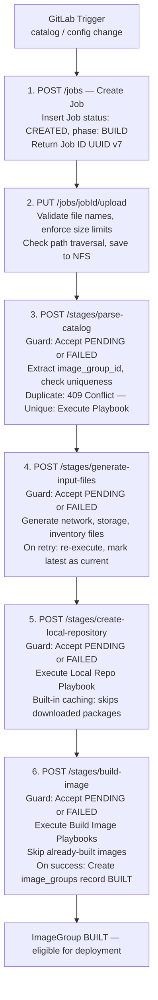

**Deploy Pipeline Stage Execution:**

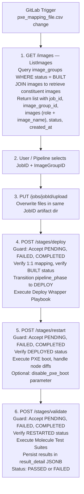

**Resume & Retry Stage Guard Logic:**

| Stage Category | Stages | Accept on PENDING | Accept on FAILED | Accept on COMPLETED | Behavior |
|----------------|--------|:-----------------:|:----------------:|:-------------------:|----------|
| **Build Pipeline** | `parse_catalog`, `generate_input_files`, `create_local_repository`, `build_image` | Yes | Yes (Resume) | **No** | Images are immutable once built; same `job_stages` record updated, `attempt_number` incremented |
| **Deploy Pipeline** | `deploy`, `pxe_boot`, `validate` | Yes | Yes (Resume) | **Yes** (Re-run) | Inputs can change (e.g., PXE mapping modified); same `job_stages` record updated, `attempt_number` incremented |

**Resumable Stages:**

| Stage Name | Resume Support | Re-run After Success | Behavior |
|------------|----------------|---------------------|----------|
| `parse_catalog` | **Yes** | No | Retry allowed - latest catalog artifact marked as current |
| `generate_input_files` | **Yes** | No | Retry allowed - latest generated files marked as current |
| `create_local_repository` | Yes | No | Automatic caching - playbook skips already-downloaded packages |
| `build_image` | **Yes** | No | Playbook checks for existing images and skips already-built images |
| `deploy` | Partial | **Yes** | Re-executable with new PXE mapping - playbook handles node discovery |
| `pxe_boot` | Partial | **Yes** | Re-executable with new PXE mapping - playbook reconfigures nodes |
| `validate` | No | **Yes** | Re-executable to validate new deployment - re-runs all tests |

**Resume Strategies:**

* **`create_local_repository`**: Built-in caching automatically skips successfully downloaded packages and retries only failed/pending packages.
* **`build_image`**: Enhanced to check for existing image files before building. Skips already-built images and only builds missing/failed images.
* **`parse_catalog` & `generate_input_files`**: On retry, re-execute and mark latest output as current. Subsequent stages reference the latest artifact version.
* **Deploy stages**: Re-executable after success because PXE mapping or configurations can change between runs. Playbooks handle idempotency naturally.

##### 4.1.3.2 Data Flow

**Data Transformation Chain (Build Pipeline):**

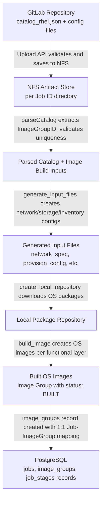

**Data Transformation Chain (Deploy Pipeline):**

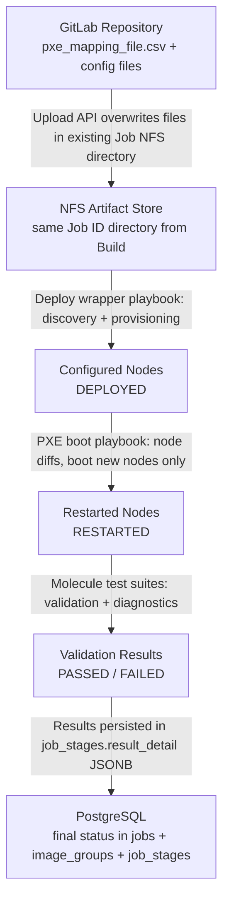

**Execution Tracking (Single Record Approach):**

Each stage has **one record** in `job_stages` table (unique per `job_id` + `stage_name`):
- `attempt_number` column tracks how many times the stage has been attempted
- `started_at` updated to latest attempt start time
- `last_attempt_at` preserves timestamp of most recent attempt
- On retry/re-run: `attempt_number` incremented, status transitions to `RUNNING`

**Artifact Versioning:**
- **Playbook logs**: `<stage_name>_<job_id>_attempt<N>.log`
- **Image build logs**: `<functional_group>_compute_image_attempt<N>.log`
- **Artifacts** (parse_catalog, generate_input_files):
  - Versioned: `parsed_catalog_attempt1.json`, `parsed_catalog_attempt2.json`
  - Latest symlink: `parsed_catalog_latest.json`
  - **Next stages reference the `_latest` artifact**

##### 4.1.3.3 Interfaces

**REST API Interfaces:**

| Endpoint | Method | Description | Request | Response |
|----------|--------|-------------|---------|----------|
| `/api/v1/jobs` | POST | Create a new Job | — | `201 Created` with Job ID (UUID v7) |
| `/api/v1/jobs/{job_id}/upload` | PUT | Upload configs and/or catalog | Multipart form data | `200 OK` with upload summary |
| `/api/v1/images` | GET | List available Image Groups with constituent images | Optional query params (pagination, status filter) | JSON list of `{job_id, image_group_id, images[{role, image_name}], status, created_at}` |
| `/api/v1/jobs/{job_id}/stages/parse-catalog` | POST | Execute catalog parsing stage | — | `202 Accepted` |
| `/api/v1/jobs/{job_id}/stages/generate-input-files` | POST | Execute input file generation | — | `202 Accepted` |
| `/api/v1/jobs/{job_id}/stages/create-local-repository` | POST | Execute local repo creation | — | `202 Accepted` |
| `/api/v1/jobs/{job_id}/stages/build-image` | POST | Execute image build | — | `202 Accepted` |
| `/api/v1/jobs/{job_id}/stages/deploy` | POST | Initiate deployment | `{"image_group_id": "<ID>"}` | `202 Accepted` |
| `/api/v1/jobs/{job_id}/stages/restart` | POST | Trigger PXE-based node restart | `{"disable_pxe_boot": false}` (optional) | `202 Accepted` |
| `/api/v1/jobs/{job_id}/stages/validate` | POST | Run post-deployment validation | Optional test suite config | `202 Accepted` |
| `/api/v1/jobs/{job_id}` | DELETE | Hard delete job with artifact and image cleanup (S3 + NFS) | — | `204 No Content` |

**Error Codes:**

| HTTP Status | Code | Usage |
|-------------|------|-------|
| `200 OK` | Success | Upload, CleanUp completion |
| `201 Created` | Success | Job creation |
| `202 Accepted` | Success | Async playbook stage triggers |
| `400 Bad Request` | Client Error | Invalid file name, size exceeded, path traversal detected |
| `404 Not Found` | Client Error | Job ID or Image Group ID does not exist |
| `409 Conflict` | Client Error | Duplicate Image Group ID; mismatched `image_group_id`; active operation during cleanup |
| `412 Precondition Failed` | Client Error | Out-of-order stage execution; Image Group not in required status; already cleaned |

**Internal Interfaces:**

| Source | Destination | Protocol | Description |
|--------|------------|----------|-------------|
| BuildStream API | PostgreSQL | TCP :5432 | Database read/write for jobs, image_groups, job_stages |
| BuildStream API | NFS Artifact Store | NFS mount | File read/write for configs, catalogs, generated inputs, built images |
| BuildStream API | Redis Queue | TCP :6379 | Ansible playbook execution queueing and status polling |
| GitLab Runner | BuildStream API | HTTP/HTTPS | REST API calls from CI/CD pipelines |

**Database Schema:**

**Table: `jobs` (Modified):**

| Column | Type | Constraints | Description |
| :--- | :--- | :--- | :--- |
| `id` | UUID (v7) | PK | The Job ID. Created once during the Build Pipeline, reused by the Deploy Pipeline. |
| `status` | Enum | NOT NULL | Overall job status: `CREATED`, `IN_PROGRESS`, `COMPLETED`, `FAILED`, `CANCELLED`. |
| `pipeline_phase` | Enum | NULLABLE | Tracks which pipeline currently owns the job. Values: `BUILD`, `DEPLOY`, or `NULL` for direct invocation. Default: `NULL`. Transitions to `DEPLOY` when the Deploy Pipeline invokes the first deploy stage for this Job ID. |
| `created_at` | Timestamp | NOT NULL | Job creation timestamp. |
| `updated_at` | Timestamp | NOT NULL | Last status change timestamp. |

**Table: `image_groups` (New):**

| Column | Type | Constraints | Description |
| :--- | :--- | :--- | :--- |
| `id` | String (128) | PK | The Image Group ID, sourced directly from the catalog. Replaces the legacy `Image-key`. |
| `job_id` | UUID | FK → `jobs.id`, **UNIQUE**, NOT NULL | Enforces the 1:1 mapping. Querying by `job_id` returns the Image Group; querying by `id` returns the associated Job. |
| `status` | Enum | NOT NULL | Lifecycle status: `BUILT`, `DEPLOYING`, `DEPLOYED`, `RESTARTING`, `RESTARTED`, `VALIDATING`, `PASSED`, `FAILED`, `CLEANED`. |
| `created_at` | Timestamp | NOT NULL | Record creation timestamp (set when image build completes). |
| `updated_at` | Timestamp | NOT NULL | Last status change timestamp. |

**Indexes:**
* `idx_image_groups_job_id` (UNIQUE) — Enforces 1:1 and enables fast Job ID → Image Group ID lookups.
* `idx_image_groups_status` — Supports filtering by status (e.g., `ListImages` queries for `BUILT`).

**Uniqueness Constraint:** The `id` (Image Group ID) is the primary key, which inherently prevents duplicate Image Group IDs from being inserted at the database level. This is the backstop for the domain-level validation described in Section 4.1.3.4.

**Table: `images` (New):**

|| Column | Type | Constraints | Description |
| :--- | :--- | :--- | :--- |
| `id` | UUID (v7) | PK | Unique image identifier. |
| `image_group_id` | String (128) | FK → `image_groups.id`, NOT NULL | Parent Image Group that this image belongs to. |
| `role` | String (128) | NOT NULL | Functional role name identifying this image within the group (e.g., `slurm_node`, `slurm_controller_node`, `kube_control_plane`, `kube_node`, `login_node`, `nfs_node`). Maps to the node role or functional layer that the image is built for. |
| `image_name` | String (256) | NOT NULL | Generated image file name on NFS (e.g., `slurm_node.img`). |
| `created_at` | Timestamp | NOT NULL | Record creation timestamp (set when image build completes for this role). |

**Indexes:**
* `idx_images_image_group_id` — Enables efficient lookup of all constituent images by Image Group.
* `idx_images_image_group_id_role` (UNIQUE) — Enforces one image per role within an Image Group; prevents duplicate role entries.

**Relationship to Image Group:** Each `image_groups` record has zero or more child `images` records. The `images` table captures the individual OS images that make up the Image Group, each identified by its functional `role` (e.g., `slurm_node`, `slurm_controller_node`, `kube_control_plane`). This enables end users to inspect the constituent images of an Image Group via the `ListImages` API, facilitating informed selection during the Deploy Pipeline.

**Table: `job_stages` (Extended):**

| Column | Type | Constraints | Description |
| :--- | :--- | :--- | :--- |
| `id` | UUID (v7) | PK | Stage ID (unique per job_id + stage_name). |
| `job_id` | UUID | FK → `jobs.id`, NOT NULL | Parent Job. |
| `stage_name` | Enum | NOT NULL | Stage identifier. **Build stages**: `parse_catalog`, `generate_input_files`, `create_local_repository`, `build_image`. **Deploy stages**: `deploy`, `pxe_boot`, `validate`. |
| `status` | Enum | NOT NULL | Execution status: `PENDING`, `RUNNING`, `COMPLETED`, `FAILED`. |
| `attempt_number` | Integer | NOT NULL, DEFAULT 1 | Number of execution attempts for this stage. Incremented on each retry/re-run. |
| `result_detail` | JSONB | NULLABLE | Stores structured output for stages that produce results. Primarily used by the `validate` stage to persist pass/fail outcomes and diagnostic details. Also stores input hash for Deploy stages. |
| `started_at` | Timestamp | NULLABLE | Latest attempt start time (updated on each retry/re-run). |
| `last_attempt_at` | Timestamp | NULLABLE | Timestamp of the most recent execution attempt. |
| `completed_at` | Timestamp | NULLABLE | Stage completion time (updated on each attempt). |
| `created_at` | Timestamp | NOT NULL | Record creation timestamp (never updated). |
| `updated_at` | Timestamp | NOT NULL | Last update timestamp. |

**Indexes:**
* `idx_job_stages_job_id_stage_name` (UNIQUE) — Enforces one record per job_id + stage_name combination and enables efficient lookup.
* `idx_job_stages_status` — Supports filtering by status for monitoring and retry logic.

**Entity Relationship Diagram:**

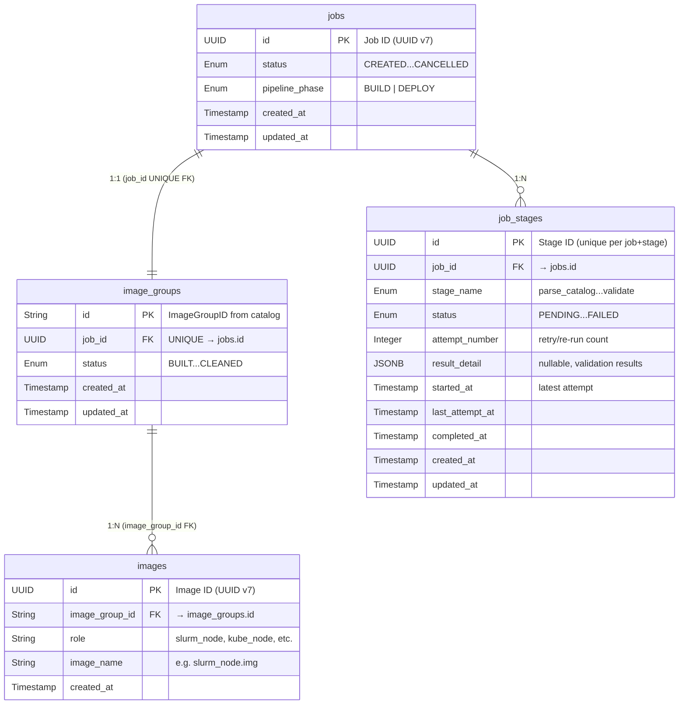

**Enum Definitions:**

| Enum | Values | Description |
|------|--------|-------------|
| Job Status | `CREATED`, `IN_PROGRESS`, `COMPLETED`, `FAILED`, `CANCELLED` | Job lifecycle states. Terminal: `COMPLETED`, `FAILED`, `CANCELLED`. |
| Image Group Status | `BUILT`, `DEPLOYING`, `DEPLOYED`, `RESTARTING`, `RESTARTED`, `VALIDATING`, `PASSED`, `FAILED`, `CLEANED` | Deployment lifecycle. Created in `BUILT` status after successful image build. |
| Stage Name | `parse_catalog`, `generate_input_files`, `create_local_repository`, `build_image`, `deploy`, `pxe_boot`, `validate` | Build stages + Deploy stages. |
| Stage Status | `PENDING`, `RUNNING`, `COMPLETED`, `FAILED` | Stage execution status. |
| Pipeline Phase | `BUILD`, `DEPLOY` | Tracks which pipeline owns the Job. |

##### 4.1.3.4 Configuration Processing

**ImageGroupID Uniqueness Validation (parseCatalog Core Layer):**

The Image Group ID is sourced from the catalog payload (replacing the legacy `Image-key` field). During the `parse_catalog` stage, the **core domain layer** must validate that the Image Group ID extracted from the catalog does not already exist in the `image_groups` table.

**Validation Flow:**
1. The `parse_catalog` use case extracts the `image_group_id` from the catalog JSON.
2. Before proceeding with any catalog parsing logic, the core layer queries the `image_groups` table for an existing record with the same `id`.
3. If a matching record **is found**, the stage **fails immediately** with a `409 Conflict` error:
   * Error message: `"Image Group ID '<id>' already exists and is associated with Job ID '<existing_job_id>'. Each catalog build must declare a unique Image Group ID."`
   * The `job_stages` record for `parse_catalog` is marked as `FAILED`.
4. If no matching record is found, catalog parsing proceeds normally.

**Rationale:** This validation prevents accidental re-use of an Image Group ID across different jobs, which would violate the 1:1 Job ↔ ImageGroup contract and could lead to deployment ambiguity.

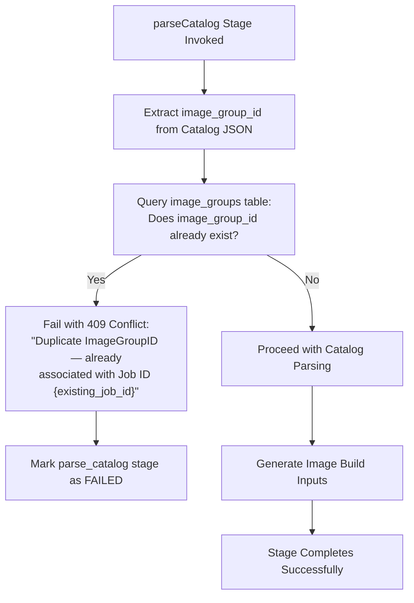

**Validation Result Schema** (stored in `result_detail` for the `validate` stage):
```json
{
  "outcome": "PASSED | FAILED",
  "total_tests": 42,
  "passed": 40,
  "failed": 2,
  "failure_details": [
    {
      "test_name": "network_connectivity_check",
      "message": "Node 10.0.0.5 unreachable on port 443"
    }
  ],
  "completed_at": "<ISO 8601 timestamp>"
}
```

**API Response on Retry/Re-run:**
```json
{
  "job_id": "018f3c4b-7b5b-7a9d-b6c4-9f3b4f9b2c10",
  "stage_name": "build_image",
  "id": "018f3c4b-8c1a-7d2b-9e3c-1a2b3c4d5e6f",
  "status": "accepted",
  "execution_type": "retry",
  "attempt_number": 2,
  "previous_status": "FAILED",
  "submitted_at": "2026-03-31T12:15:00Z",
  "correlation_id": "018f3c4b-2d9e-7d1a-8a2b-111111111111"
}
```

**Upload API Configuration:**

| Parameter | Validation | Description |
|-----------|------------|-------------|
| File name allowlist | `local_repo_config.yml`, `network_spec.yml`, `provision_config.yml`, `pxe_mapping_file.csv`, `storage_config.yml`, `telemetry_config.yml`, `catalog_rhel.json` | Only allowed file names accepted |
| File size limit | Configurable per file type | Maximum upload size enforced |
| Path traversal prevention | Reject `../`, `..\\`, `%2e%2e/` | File names sanitized before NFS write |
| Restricted naming patterns | Reject `*vault*`, `*.key`, `*.pem` | Prevent accidental secret uploads |

##### 4.1.3.5 Cross-Feature Interactions

| Interaction | Components | Description |
|-------------|-----------|-------------|
| **Cross-Pipeline Job Continuity** | Build Pipeline -> Deploy Pipeline | A single Job ID created during Build persists through Deploy. The Deploy Pipeline reuses the existing Job ID by selecting from `ListImages`. The `pipeline_phase` column transitions from `BUILD` to `DEPLOY`. |
| **1:1 Job ↔ ImageGroup Mapping** | jobs table <-> image_groups table | Enforced at the database level via UNIQUE constraint on `image_groups.job_id` and PK on `image_groups.id`. Domain-level validation in `parseCatalog` provides additional protection. |
| **Unified Stage Audit Trail** | Build stages + Deploy stages -> job_stages table | Both Build and Deploy pipeline stages are recorded in the **same `job_stages` table**, providing a single audit trail per Job ID. Stage name implicitly identifies the pipeline phase. |
| **NFS Artifact Sharing** | Build Pipeline -> Deploy Pipeline | The Upload API writes to the same Job ID's NFS artifact directory across both pipelines. Deploy Pipeline can overwrite configs uploaded during Build. |
| **GitLab Pipeline Routing** | `.gitlab-ci.yml` -> `.gitlab-ci-build.yml` / `.gitlab-ci-deploy.yml` | Parent pipeline router uses `rules:changes` to detect file modifications and trigger the appropriate child pipeline. |
| **Domain Driven Design** | ImageGroup Entity + UseCases | New logic conforms to DDD (Approach A) by implementing `ImageGroup` as an Entity with respective UseCases in the `orchestrator/` layer, domain contracts in the `core/` layer, and centralized persistence in `infra/db/`. Existing code patterns preserved. |
| **Constituent Image Tracking** | image_groups table -> images table -> ListImages API | The `images` table stores per-role constituent images for each Image Group. The `build_image` stage inserts `images` records for each functional role (e.g., `slurm_node`, `slurm_controller_node`). The `ListImages` API joins `images` to return the full composition, enabling informed deployment selection. |
| **Validation Result Persistence** | validate stage -> job_stages.result_detail | The `validate` stage stores its pass/fail outcome and detailed results directly in the `job_stages.result_detail` JSONB column, avoiding the need for a separate results table. |
| **Storage Backend Pluggability** | NFS / PowerScale -> Artifact Store -> BuildStream API | Built images and artifacts stored on NFS (default) or Dell PowerScale. The `prepare_oim` playbook configures the storage mount point. BuildStream API accesses storage via the mount path, making the backend transparent. No changes to BuildStream API code required. |
| **Software Catalog Extensibility** | `examples/` directory -> GitLab repository -> Upload API | Additional example catalogs with infrastructure and driver packages provided in `examples/` directory. These reflect parallel Omnia product changes for new software packages. All catalogs adhere to the existing catalog JSON schema. The active catalog uploaded via the Upload API remains `catalog_rhel.json`. |

##### 4.1.3.6 Upgrade Scenarios

Transitioning from BuildStream Release 1 to Release 2 requires careful orchestration of database schema migrations, state data transformations, and CI/CD pipeline reconfiguration. This upgrade must preserve historical job data while aligning with the new three-pipeline architecture, the 1:1 Job ID ↔ Image Group ID mapping, and the renamed APIs.

**Upgrade Scenario Summary:**

| Scenario | ID | From State | To State | Actions |
|----------|-----|-----------|----------|---------|
| Database schema migration | U1 | Release 1 schema | Release 2 schema | Alembic migrations for `jobs`, `job_stages`, `image_groups`, `images` tables |
| CI/CD pipeline transition | U2 | Monolithic `.gitlab-ci.yml` | Three-pipeline model | Replace with router + build + deploy + cleanup pipelines |
| API endpoint migration | U3 | Release 1 endpoints | Release 2 endpoints | Rename and add new endpoints |

---

**Scenario U1: Database Schema Migration**

| Aspect | Detail |
|--------|--------|
| **Trigger** | Omnia BuildStream container upgrade from Release 1 to Release 2 |
| **Preconditions** | GitLab Runner paused; active job queue drained |
| **Table: `jobs` Modifications** | 1. Add `pipeline_phase` column (Enum: `BUILD`, `DEPLOY`) with `DEFAULT 'BUILD'` and `NOT NULL`. Historical jobs backfilled with `BUILD`.<br>2. Expand `status` enum with new values (`BUILDING`, `BUILT`, `DEPLOYING`, `DEPLOYED`, `RESTARTING`, `RESTARTED`, `VALIDATING`, `PASSED`, `FAILED`, `CLEANED`). |
| **Table: `job_stages` Modifications** | 1. Rename legacy `validate-image-on-test` stage to `deploy`.<br>2. Expand `stage_name` enum (`deploy`, `pxe_boot`, `validate`).<br>3. Add `result_detail` (JSONB, NULLABLE).<br>4. Add `started_at` / `completed_at` columns if not present.<br>5. Add `attempt_number` (Integer, NOT NULL, DEFAULT 1). Historical records backfilled with `1`.<br>6. Add `last_attempt_at` (Timestamp, NULLABLE).<br>7. Add UNIQUE constraint on `(job_id, stage_name)`. |
| **New Table: `image_groups`** | Create with schema from Section 4.1.3.3. Add indexes `idx_image_groups_job_id` (UNIQUE) and `idx_image_groups_status`. Backfill `BUILT` records for historical jobs that completed `build_image` stage. Image Group ID derived from legacy `Image-key`. |
| **New Table: `images`** | Create with schema from Section 4.1.3.3. Add indexes `idx_images_image_group_id` and `idx_images_image_group_id_role` (UNIQUE). Backfill constituent image records for each backfilled `image_groups` record by deriving role names and image file names from the legacy build artifacts on NFS. |
| **Rollback** | Alembic downgrade to reverse migrations |

**Migration Sequence Diagram:**

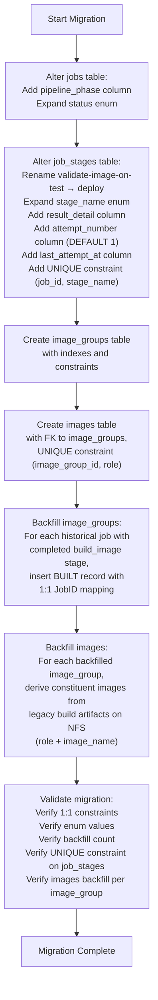

---

**Scenario U2: CI/CD Pipeline Transition**

| Aspect | Detail |
|--------|--------|
| **Trigger** | Release 2 deployment complete; database migration successful |
| **Entry Point Replacement** | Root `.gitlab-ci.yml` transformed into parent pipeline router using `rules:changes` to trigger appropriate child pipeline. |
| **Build Pipeline** | `.gitlab-ci-build.yml`: **Decomposed from the existing monolithic pipeline.** The existing Release 1 `.gitlab-ci.yml` already implements the build stages (`initialization` → `parse-catalog` → `generate-input-files` → `configure-local-repository` → `build-images` → `summary`) with full API call scripts, Job ID propagation, async polling, and error handling. The `deploy-and-validate` stage is removed, and the pipeline is renamed. DB changes for `image_groups` and `images` record creation are handled by the modified API layer. |
| **Deploy Pipeline** | `.gitlab-ci-deploy.yml`: **New pipeline, partially derived.** Triggered by changes to `pxe_mapping_file.csv`. The `deploy` stage is derived from the existing `deploy-and-validate` stage (which calls `POST /stages/validate-image-on-test` in Release 1, renamed to `POST /stages/deploy` in Release 2). New stages: `list-images`, `select-image`, `upload`, `restart`, `validate`. |
| **Upgrade Execution Sequence** | 1. Pause Runner<br>2. Container Upgrade (Release 2 code)<br>3. Database Migration (Alembic)<br>4. Push Pipeline Updates (router + build + deploy YAMLs)<br>5. Resume Runner |

---

**Scenario U3: API Endpoint Migration**

| Release 1 Endpoint | Release 2 Endpoint | Change |
| :--- | :--- | :--- |
| `PUT /api/v1/jobs/{id}/artifacts` | `PUT /api/v1/jobs/{id}/upload` | Renamed to Upload API |
| `POST /api/v1/jobs/{id}/stages/boot` | `POST /api/v1/jobs/{id}/stages/restart` | Renamed to ReStart API |
| `POST /api/v1/jobs/{id}/stages/validate-image-on-test` | `POST /api/v1/jobs/{id}/stages/deploy` | Renamed and decoupled |
| — | `GET /api/v1/images` | New: ListImages API |
| — | `POST /api/v1/jobs/{id}/stages/validate` | New: Validate API |
| — | `DELETE /api/v1/jobs/{id}/cleanup` | New: CleanUp API |

---

**Upgrade Validation Summary:**

| Scenario | Validation Check | Pass Criteria |
|----------|-----------------|---------------|
| U1 | Database schema matches Release 2 specification | All tables (`jobs`, `job_stages`, `image_groups`, `images`), columns, constraints, and indexes present; 1:1 constraints verified; backfill count matches expected; constituent images backfilled for each image_group |
| U2 | CI/CD pipelines trigger correctly | Build Pipeline triggers on catalog changes; Deploy Pipeline triggers on CSV changes; no cross-triggering |
| U3 | API endpoints respond correctly | Release 2 endpoints return expected responses; Release 1 endpoints deprecated |

#### 4.1.4 Security

**4.1.4.1 Input Validation and Sanitization**

| Segment | Protection | Implementation |
|---------|-----------|----------------|
| Upload API -> NFS | File name allowlist validation | Only permitted file names accepted; rejected files return `400 Bad Request` |
| Upload API -> NFS | Path traversal prevention | Reject `../`, `..\\`, `%2e%2e/` patterns in file names and paths |
| Upload API -> NFS | Restricted file pattern rejection | Reject files matching `*vault*`, `*.key`, `*.pem` patterns |
| Upload API -> NFS | File size enforcement | Configurable per-file size limits |
| Deploy API | 1:1 mapping verification | `image_group_id` in request must match Job's associated Image Group |
| All Stage APIs | State precondition checks | Stage guard logic enforces valid state transitions |
| CleanUp API | Terminal state enforcement | Cleanup only permitted on `BUILT`, `PASSED`, `FAILED` states |

**4.1.4.2 Data Integrity**

| Mechanism | Component | Description |
|-----------|-----------|-------------|
| UNIQUE constraint on `image_groups.job_id` | PostgreSQL | Enforces 1:1 Job ↔ ImageGroup at database level |
| PK constraint on `image_groups.id` | PostgreSQL | Prevents duplicate Image Group IDs |
| UNIQUE constraint on `(job_id, stage_name)` | PostgreSQL | Enforces single record per stage |
| Domain-level uniqueness check | parseCatalog UseCase | Validates ImageGroupID uniqueness before database insert |
| Pydantic validation | BuildStream API | Request/response schema validation for all API endpoints |
| State machine enforcement | BuildStream API | Precondition checks prevent out-of-order stage execution |

**4.1.4.3 Credential Management**

| Credential | Storage | Protection Measures |
|-----------|---------|---------------------|
| Database connection string | Environment variable / config | Not logged; restricted to BuildStream container |
| NFS mount credentials | System-level mount configuration | Not exposed via API |
| GitLab Runner tokens | GitLab configuration | Managed by GitLab; not stored in BuildStream |

#### 4.1.5 Resource Utilization

**Infrastructure Requirements:**

The APIs are documented via OpenAPI/Swagger standard (`/docs`) enabling other internal UI teams (e.g., Omnia UI) to consume the `ListImages`, `Deploy`, `ReStart`, `Validate`, `CleanUp`, and `Upload` endpoints natively.

**Per-Component Resource Allocation:**

| Component | Role | Storage | Description |
|-----------|------|---------|-------------|
| BuildStream API | REST API Service | Omnia Container | Handles all API requests, state management, and playbook orchestration |
| PostgreSQL | Database | Persistent Volume | Stores jobs, image_groups, and job_stages tables |
| NFS Artifact Store | File Storage | Shared Filesystem | Per-Job directory for configs, catalogs, generated inputs, built images |
| Redis | Queue | In-Memory | Ansible playbook execution queue and status polling |

**Performance Optimization:**

The split into two pipelines significantly reduces the runtime of a single CI job, preventing GitLab runner timeouts. Tracking Image Groups allows for future scalability where one successfully built Image Group can be deployed to multiple different clusters concurrently without rebuilding.

#### 4.1.6 Open Source

| Component | License | Source Repository | Version Management |
|-----------|---------|------------------|-------------------|
| FastAPI | MIT License | `github.com/tiangolo/fastapi` | Version pinned in `requirements.txt` |
| SQLAlchemy | MIT License | `github.com/sqlalchemy/sqlalchemy` | Version pinned in `requirements.txt` |
| Alembic | MIT License | `github.com/sqlalchemy/alembic` | Version pinned in `requirements.txt` |
| Pydantic | MIT License | `github.com/pydantic/pydantic` | Version pinned in `requirements.txt` |
| PostgreSQL | PostgreSQL License | `github.com/postgres/postgres` | Version specified in container image |
| Redis | BSD License | `github.com/redis/redis` | Version specified in container image |
| Ansible | GPL v3 | `github.com/ansible/ansible` | Version pinned in container image |

All open-source components use permissive licenses (MIT, BSD, PostgreSQL License) compatible with Dell's open-source usage policies, with the exception of Ansible (GPL v3) which is used as a tool and does not affect the licensing of the BuildStream codebase.

#### 4.1.7 Component Test

**Manual Test Cases:**

| Test ID | Test Case | Preconditions | Steps | Expected Result | Priority |
|---------|-----------|---------------|-------|----------------|----------|
| BS-001 | Create Job and receive Job ID | BuildStream API running | `POST /api/v1/jobs` | `201 Created` with UUID v7 Job ID; `jobs` record with `status: CREATED`, `pipeline_phase: BUILD` | P1 |
| BS-002 | Upload catalog and config files | Job created | `PUT /api/v1/jobs/{jobId}/upload` with valid files | `200 OK`; files present in NFS artifact directory | P1 |
| BS-003 | Upload rejected for restricted files | Job created | `PUT /upload` with `vault.yml` file | `400 Bad Request`; file not written to NFS | P1 |
| BS-004 | Upload rejected for path traversal | Job created | `PUT /upload` with file name `../../etc/passwd` | `400 Bad Request`; path traversal detected | P1 |
| BS-005 | Parse catalog with unique ImageGroupID | Job created, catalog uploaded | `POST /stages/parse-catalog` | `202 Accepted`; stage `COMPLETED`; ImageGroupID extracted | P1 |
| BS-006 | Parse catalog with duplicate ImageGroupID | Existing ImageGroup with same ID | `POST /stages/parse-catalog` | `409 Conflict`; stage `FAILED`; error message references existing Job ID | P1 |
| BS-007 | Full Build Pipeline execution | BuildStream API running, GitLab configured | Trigger Build Pipeline via catalog change | All 4 stages complete; `image_groups` record created with `BUILT` status; 1:1 mapping established; `images` records created for each constituent image with correct roles | P1 |
| BS-008 | ListImages returns BUILT groups with constituent images | At least one BUILT Image Group with constituent images | `GET /api/v1/images` | JSON response with `image_groups` array containing `job_id`, `image_group_id`, `images` array (each with `role` and `image_name`), `status`, `created_at` | P1 |
| BS-009 | Deploy with valid ImageGroupID | Image Group in BUILT status | `POST /stages/deploy` with matching `image_group_id` | `202 Accepted`; Image Group status transitions to `DEPLOYING` then `DEPLOYED` | P1 |
| BS-010 | Deploy with mismatched ImageGroupID | Image Group in BUILT status | `POST /stages/deploy` with wrong `image_group_id` | `409 Conflict`; no state change | P1 |
| BS-011 | Full Deploy Pipeline execution | BUILT Image Group, PXE mapping uploaded | Trigger Deploy Pipeline via CSV change | Deploy → Restart → Validate stages complete; final status `PASSED` or `FAILED` | P1 |
| BS-012 | CleanUp eligible Job | Image Group in PASSED state | `DELETE /cleanup` | `200 OK`; NFS artifacts removed; statuses set to `CLEANED` | P1 |
| BS-013 | CleanUp rejected for active operation | Image Group in DEPLOYING state | `DELETE /cleanup` | `409 Conflict`; no state change | P1 |
| BS-014 | Retry failed Build stage | Stage in FAILED status | Re-invoke stage API | `202 Accepted`; `attempt_number` incremented; stage re-executes | P1 |
| BS-015 | Re-run completed Deploy stage | Deploy stage COMPLETED, new PXE mapping uploaded | Re-invoke `POST /stages/deploy` | `202 Accepted`; `attempt_number` incremented; re-executes with new config | P1 |
| BS-016 | Validate stage persists results | Image Group in RESTARTED status | `POST /stages/validate` | `202 Accepted`; `result_detail` JSONB populated with test outcomes | P1 |
| BS-017 | Cross-pipeline Job continuity | Job created in Build Pipeline | Use same Job ID in Deploy Pipeline | Deploy Pipeline successfully reuses Build Pipeline Job ID; `pipeline_phase` transitions to `DEPLOY` | P1 |
| BS-018 | PXE boot with node diffs | Previously booted nodes + new nodes | `POST /stages/restart` | Only new nodes PXE booted; already-booted nodes excluded | P2 |
| BS-019 | PXE boot disabled | `disable_pxe_boot: true` parameter | `POST /stages/restart` with disable flag | PXE boot skipped; status transitions correctly | P2 |
| BS-020 | Database migration from Release 1 | Release 1 database with historical data | Run Alembic migrations | Schema updated; historical data preserved; image_groups backfilled; images backfilled with correct roles; UNIQUE constraints verified | P1 |
| BS-021 | Constituent images populated during build | Completed Build Pipeline | Query `images` table for the Image Group | `images` records exist with correct `role` (e.g., `slurm_node`, `slurm_controller_node`) and `image_name` for each built OS image; UNIQUE constraint on `(image_group_id, role)` enforced | P1 |
| BS-022 | ListImages constituent images aid selection | Multiple BUILT Image Groups with different roles | `GET /api/v1/images` | Each Image Group in response includes `images` array; user can differentiate groups by inspecting constituent image roles | P2 |

#### 4.1.8 API Documentation

**For detailed API documentation including request/response examples, authentication, and error handling, see the [BuildStream Release 2 API Specification](../module_spec/BuildStream/API_Spec.md) (Module Spec v2.0). For code-level component detail including internal DDD architecture, Pydantic schemas, and sequence diagrams, see the [Deploy Pipeline Component Spec](../component_spec/BuildStream/Component_2_DeployPipeline_API.md) (CSPEC-BS-C2-2026-001).**

The APIs conform strictly to REST principles, using standard HTTP methods (GET, POST, PUT, DELETE), predictable UUID identifiers, and standard HTTP status codes (`202 Accepted` for async playbook triggers, `412 Precondition Failed` for out-of-order stage execution, `409 Conflict` for duplicate Image Group IDs).

**Upload API:**

* **`PUT /api/v1/jobs/{job_id}/upload`** (Internal API)
  * *Purpose*: Generic upload endpoint for synchronizing configuration files and/or catalog from GitLab to the BuildStream NFS backend. Replaces the previous `PUT /artifacts` endpoint with a clearer intent.
  * *Input*: Multipart form data containing configuration files (e.g., `local_repo_config.yml`, `network_spec.yml`, `provision_config.yml`, `pxe_mapping_file.csv`, `storage_config.yml`, `telemetry_config.yml`) and/or the catalog (`catalog_rhel.json`).
  * *Behavior*: Validates file names against an allowlist and enforces size limits. Safely overwrites existing files in the specific Job ID's NFS artifact directory. Ensures path traversal prevention. Supports **partial updates** — only the uploaded files are overwritten; existing files not included in the request are left untouched.
  * *Response*: `200 OK` on success with a summary of uploaded files.
  * *Errors*:
    * `400 Bad Request` — Invalid file name, size exceeded, or path traversal detected.
    * `404 Not Found` — Job ID does not exist.

**ListImages API:**

* **`GET /api/v1/images`**
  * *Purpose*: Returns the list of available Image Groups with their associated Job IDs and constituent images, providing the **Job ID ↔ Image Group ID mapping** required for the Deploy Pipeline to select a target. Each Image Group includes its constituent images identified by functional role name, enabling informed selection.
  * *Input*: Optional query parameters for pagination and filtering by status.
  * *Output*: JSON list of objects containing the bidirectional mapping, constituent images (with role and image name), and the current status of each Image Group.
  * *Response Schema*:
    ```json
    {
      "image_groups": [
        {
          "job_id": "<UUID v7>",
          "image_group_id": "<ImageGroupID from catalog>",
          "images": [
            {
              "role": "slurm_node",
              "image_name": "slurm_node.img"
            },
            {
              "role": "slurm_controller_node",
              "image_name": "slurm_controller_node.img"
            }
          ],
          "status": "BUILT",
          "created_at": "<ISO 8601 timestamp>"
        }
      ]
    }
    ```
  * *Behavior*: Queries the `image_groups` table, joining the `images` table to retrieve constituent images, and returns entries where status is `BUILT` or higher. The Deploy Pipeline presents this list — including constituent image roles — to the user/operator for selection. Once a selection is made, the associated **Job ID** is used for all subsequent deploy stage API calls.

**Deploy API:**

* **`POST /api/v1/jobs/{job_id}/stages/deploy`**
  * *Purpose*: Initiates the deployment stage for a previously built Image Group. Renamed from the legacy `validate-image-on-test` stage.
  * *Input*: `{"image_group_id": "<ImageGroupID>"}`
  * *Preconditions*:
    * The `image_groups` record for the given Job ID must exist with status `BUILT`.
    * The `image_group_id` in the request body must match the Image Group ID associated with the Job ID (enforced by the 1:1 mapping).
  * *Behavior*: Transitions the Job's `pipeline_phase` to `DEPLOY`. Updates the Image Group status to `DEPLOYING`. Creates a `deploy` stage record in `job_stages`. A new wrapper playbook (`deploy_wrapper.yml`) is introduced to orchestrate the execution of the discovery playbook (`discovery/discovery.yml` — OME server discovery, PXE mapping generation) and provisioning playbook (`provision/provision.yml` — node provisioning, cluster configuration), which were split into independent playbooks in the pub/q2_dev branch. On success, updates Image Group status to `DEPLOYED`.
  * *Response*: `202 Accepted`.
  * *Errors*:
    * `404 Not Found` — Job ID or Image Group ID does not exist.
    * `409 Conflict` — Supplied `image_group_id` does not match the Job's associated Image Group.
    * `412 Precondition Failed` — Image Group is not in `BUILT` status.

**ReStart API:**

* **`POST /api/v1/jobs/{job_id}/stages/restart`** (Renamed from `boot`)
  * *Purpose*: Triggers PXE-based node restart for the deployed Image Group. The solution will handle node diffs for PXE booting, ensuring that PXE boot is triggered only for newly added nodes, while already booted nodes are explicitly excluded.
  * *Input*: `{"disable_pxe_boot": false}` (Optional parameter to disable PXE boot entirely).
  * *Preconditions*: The Image Group for the given Job ID must be in `DEPLOYED` status.
  * *Behavior*: Updates the Image Group status to `RESTARTING`. Creates a `pxe_boot` stage record in `job_stages`. Queues `utils/set_pxe_boot.yml`. Polls for completion. On success, updates Image Group status to `RESTARTED`.
  * *Response*: `202 Accepted`.
  * *Errors*:
    * `412 Precondition Failed` — Image Group is not in `DEPLOYED` status.

**Validate API:**

* **`POST /api/v1/jobs/{job_id}/stages/validate`**
  * *Purpose*: Runs post-deployment validation test suites and persists the results. This stage leverages the existing molecule test framework, which contains sufficient benchmark tests to comprehensively validate the cluster deployment, network configuration, and service health.
  * *Input*: Optional test suite configuration parameters (e.g., `{"test_suite": "full"}`).
  * *Preconditions*: The Image Group for the given Job ID must be in `RESTARTED` status.
  * *Behavior*: Updates the Image Group status to `VALIDATING`. Creates a `validate` stage record in `job_stages`. Queues the molecule validation playbook. Upon completion, the detailed test results are parsed and stored in the `job_stages.result_detail` JSONB column. Updates Image Group status to `PASSED` or `FAILED`.
  * *Response*: `202 Accepted`.
  * *Errors*:
    * `412 Precondition Failed` — Image Group is not in `RESTARTED` status.

**Delete Job API (Hard Delete with CleanUp):**

* **`DELETE /api/v1/jobs/{job_id}`**
  * *Purpose*: Performs hard deletion of a Job, removing all built images from S3 storage and cleaning up associated NFS artifacts. Accepts a `job_id` as input and internally resolves the `image_group_id` via the 1:1 mapping.
  * *Input*: None (Job ID is a path parameter).
  * *Preconditions*: The Job must exist. The Image Group must be in a terminal state (`PASSED`, `FAILED`) or `BUILT` (never deployed). Deletion is **not** permitted while stages are actively running (`DEPLOYING`, `RESTARTING`, `VALIDATING`).
  * *Behavior*:
    1. Validates the Job ID exists and the Image Group is in an eligible state.
    2. Resolves the `image_group_id` from the `image_groups` table using the Job ID.
    3. Queries the `images` table to retrieve all `image_name` values (S3 paths) for the Image Group.
    4. For each image path, executes `s3cmd del <image_path>` within the BuildStream container to delete the image from S3.
    5. Removes all files in the Job ID's NFS artifact directory (configs, catalog JSON, generated inputs, inventories).
    6. Updates the Image Group status to `CLEANED`.
    7. Marks the Job status as `CLEANED` in the `jobs` table.
    8. Records an audit event with cleanup details (S3 objects deleted, NFS files removed, timestamp).
  * *Response*: `204 No Content` on success.
  * *Errors*:
    * `404 Not Found` — Job ID does not exist.
    * `409 Conflict` — Image Group is in an active (non-terminal) state; cleanup is not allowed while operations are in progress.
    * `412 Precondition Failed` — Job has already been cleaned.
    * `500 Internal Server Error` — S3 or NFS cleanup operation failed (Image Group remains in previous state).
  
  > **Note:** This is a hard delete operation that removes all artifacts and images, not a soft delete (tombstone). The Job and Image Group records are preserved in the database with `CLEANED` status for audit trail.

#### 4.1.9 Known Issues and Limitations

**Failure Modes Table:**

| ID | Failure Scenario | Impact | Detection | Recovery | Severity |
|----|-----------------|--------|-----------|----------|----------|
| FM-01 | PostgreSQL database unreachable | All API requests fail; no state changes possible | API health check failure; HTTP 500 responses | Restart database; API auto-reconnects with retry logic | Critical |
| FM-02 | NFS Artifact Store unmounted/inaccessible | Upload API fails; playbook execution fails (missing configs) | Upload returns `500`; playbook logs file-not-found errors | Remount NFS; verify mount configuration | Critical |
| FM-03 | Redis queue unavailable | Stage execution cannot be queued; API returns `202` but playbook never starts | Stage remains in `RUNNING` indefinitely; no progress | Restart Redis; re-trigger failed stages | High |
| FM-04 | Ansible playbook failure (build stage) | Stage marked `FAILED`; subsequent stages blocked | `job_stages.status = FAILED`; playbook logs in NFS | Retry stage via API (resume & retry feature); fix underlying issue | High |
| FM-05 | Ansible playbook failure (deploy stage) | Image Group stuck in active state; deployment incomplete | `image_groups.status` remains in `DEPLOYING/RESTARTING/VALIDATING` | Retry stage via API; fix underlying issue | High |
| FM-06 | Duplicate ImageGroupID in catalog | `parseCatalog` stage fails with `409 Conflict` | Stage status `FAILED`; error message in API response | User must provide unique Image Group ID in catalog | Medium |
| FM-07 | Upload API path traversal attempt | File rejected; `400 Bad Request` returned | API logs validation failure | No recovery needed; malicious input blocked | Low |
| FM-08 | GitLab Runner unavailable | Pipelines cannot be triggered; no API calls made | GitLab CI/CD dashboard shows pending/stuck jobs | Restart GitLab Runner; verify runner registration | High |
| FM-09 | PXE boot failure for subset of nodes | Some nodes not restarted; partial deployment | `pxe_boot` stage `FAILED`; node-level logs in NFS | Retry restart stage; investigate individual node PXE configuration | High |
| FM-10 | Molecule validation timeout | `validate` stage `FAILED`; test results may be incomplete | Stage timeout; partial `result_detail` in JSONB | Re-run validate stage; investigate test environment | Medium |

#### 4.1.10 Unresolved Issues

| ID | Issue | Description | Impact | Proposed Resolution | Target |
|----|-------|-------------|--------|-------------------|--------|
| UR-01 | **Pipeline concurrency** | Simultaneous invocation of Build and Deploy pipelines is not supported. This limits throughput for teams managing multiple Image Groups. | Users must wait for one pipeline to complete before starting another | Evaluate database-level locking or queue-based serialization to support safe concurrent pipeline execution | Future release |
| UR-02 | **Multi-cluster image deployment** | A single BUILT Image Group can only be deployed to one cluster at a time. | Limits reuse of built images across multiple target clusters | Extend Deploy Pipeline to support targeting multiple clusters with the same Image Group | Future release |
| ~~UR-03~~ | ~~**Automated cleanup scheduling**~~ | **Resolved** — Cron-based cleanup of validation-failed images runs every 24 hours. Retention limit of 50 non-CLEANED Image Groups enforced at build time. | — | — | This release |

---

*END OF DOCUMENT*

*Document Owner: Dell Omnia Team*
*Team: Dell Omnia*
*Classification: Dell Confidential - Internal Use Only*
