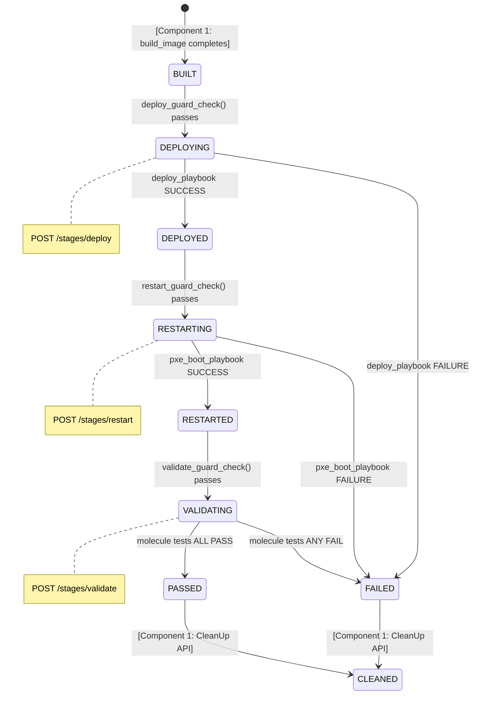
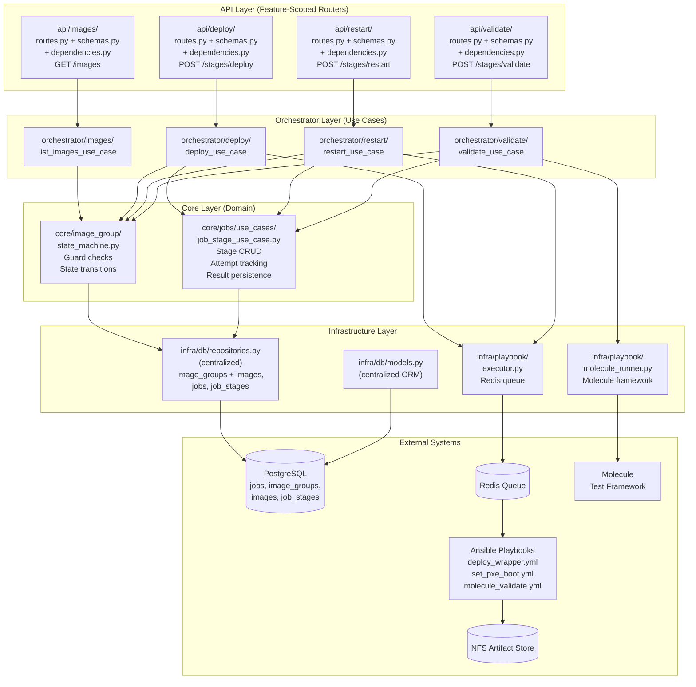
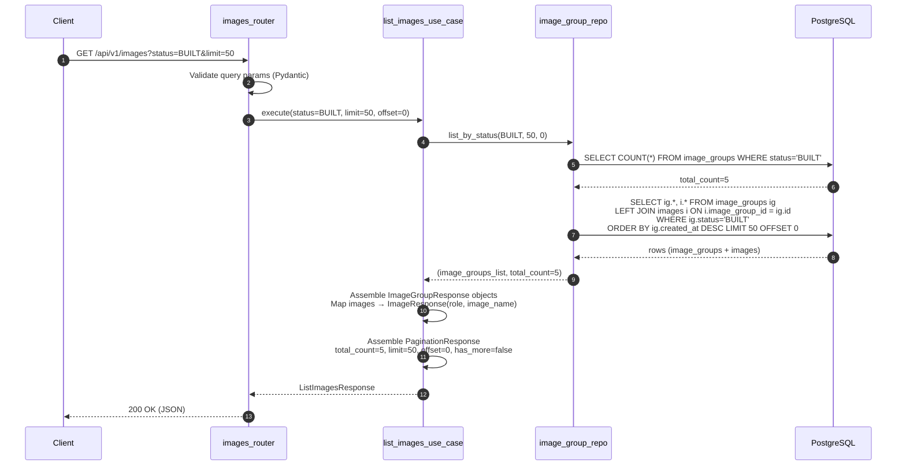
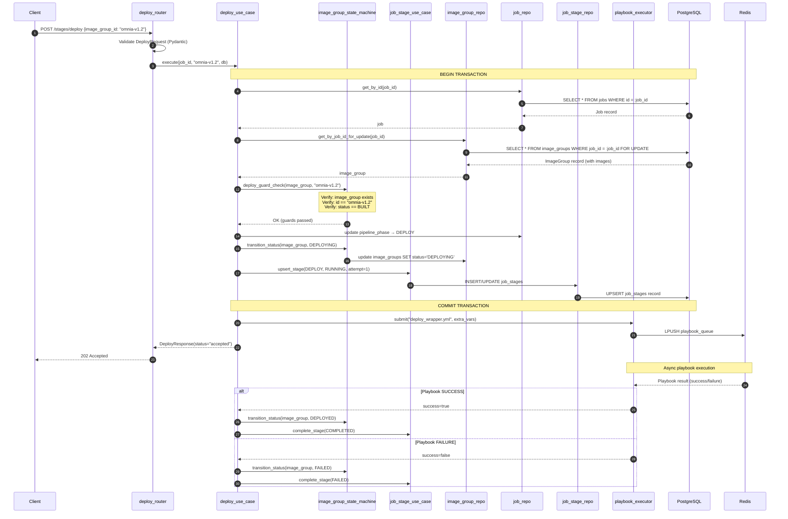
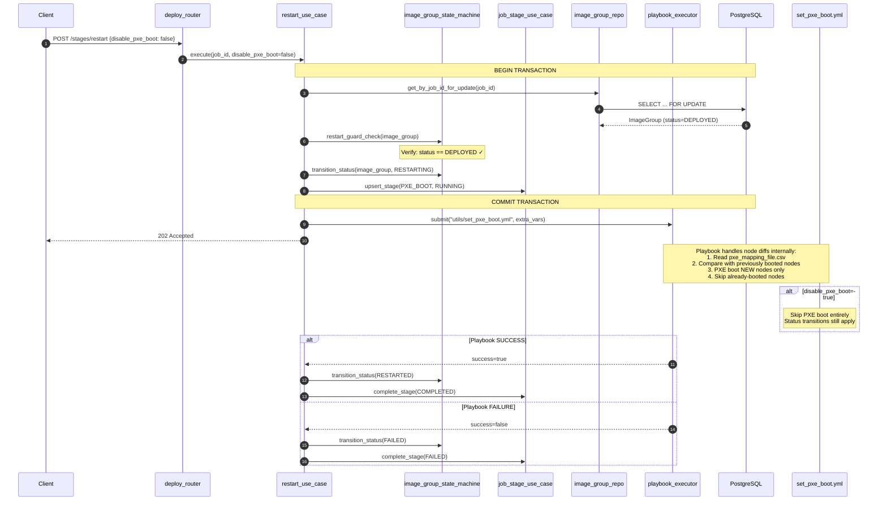
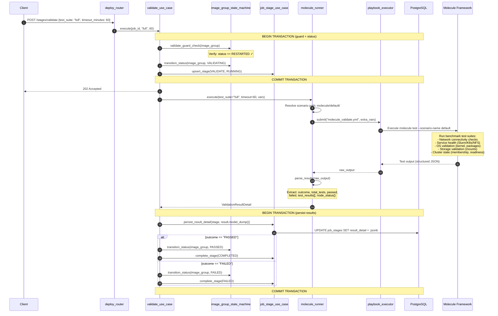
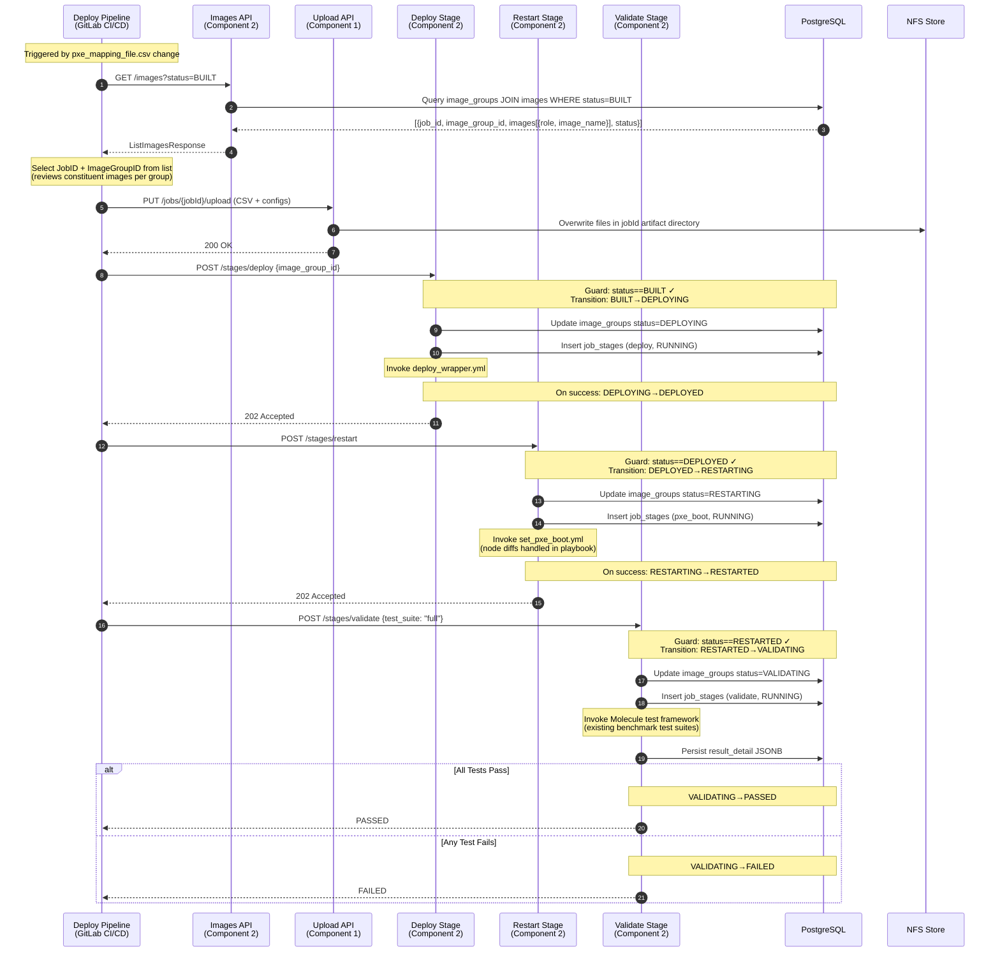

# Component Specification — Deploy Pipeline API (Component 2)

| | |
|---|---|
| **Document ID** | CSPEC-BS-C2-2026-001 |
| **Current Version** | 0.2 |
| **Date** | 04/07/2026 |
| **Author** | Rajeshkumar S |
| **Team** | Dell Omnia — BuildStream |
| **Document Type** | Component Specification |
| **SDD Phase** | 5a — Component Specification |
| **Parent HLD** | BuildStream_Engineering_Spec(HLD).md v0.7 |
| **Owner** | Rajesh (primary), Venu (review) |

---

**Dell Confidential - Internal Use Only**

Copyright 2026 Dell Inc. or its subsidiaries. All Rights Reserved.

---

## Revision History

| Version | Date | Description | Author(s) |
|---------|------|-------------|-----------|
| 0.1 | 04/07/2026 | Initial component spec — internal architecture, module interactions, data models, Pydantic schemas, sequence diagrams for all Deploy Pipeline APIs | Dell Omnia Team |
| 0.2 | 04/07/2026 | Aligned code layout with existing codebase structure per module specs: `build_stream/` root, feature-scoped API modules (`api/<feature>/routes.py + schemas.py + dependencies.py`), orchestrator use cases (`orchestrator/<feature>/use_cases/`), core domain layer (`core/<domain>/`), centralized ORM models (`infra/db/models.py`), centralized repositories (`infra/db/repositories.py`). Updated all file path references, module decomposition, dependency graph, DDD layer architecture, module interaction flows, architecture diagram, sequence diagrams, and error handling. | Dell Omnia Team |
| 0.3 | 04/09/2026 | Updated Deploy Wrapper Playbook Integration (Section 5.2.4) to reference the discovery/provision playbook split from pub/q2_dev merge (commit 5b30837). Discovery playbook (`discovery.yml`) and provisioning playbook (`provision.yml`) are now independent sub-playbooks orchestrated by `deploy_wrapper.yml`. Added playbook watcher whitelist update requirement. | Dell Omnia Team |

---

## Table of Contents

- [1 References](#1-references)
- [2 Scope](#2-scope)
- [3 Internal Architecture](#3-internal-architecture)
  - [3.1 Module Decomposition](#31-module-decomposition)
  - [3.2 Module Dependency Graph](#32-module-dependency-graph)
  - [3.3 DDD Layer Architecture](#33-ddd-layer-architecture)
- [4 Data Models & DB Changes](#4-data-models--db-changes)
  - [4.1 ORM Models (Reused from Component 1)](#41-orm-models-reused-from-component-1)
  - [4.2 Deploy-Lifecycle Status Transitions](#42-deploy-lifecycle-status-transitions)
  - [4.3 Pydantic Request/Response Schemas](#43-pydantic-requestresponse-schemas)
  - [4.4 DB Write Patterns per Endpoint](#44-db-write-patterns-per-endpoint)
- [5 Component Details](#5-component-details)
  - [5.1 GET /api/v1/images — Images API](#51-get-apiv1images--images-api)
  - [5.2 POST /api/v1/jobs/{job_id}/stages/deploy — Deploy API](#52-post-apiv1jobsjob_idstagesdeploy--deploy-api)
  - [5.3 POST /api/v1/jobs/{job_id}/stages/restart — ReStart API](#53-post-apiv1jobsjob_idstagesrestart--restart-api)
  - [5.4 POST /api/v1/jobs/{job_id}/stages/validate — Validate API](#54-post-apiv1jobsjob_idstagesvalidate--validate-api)
- [6 Component Architecture Diagram](#6-component-architecture-diagram)
- [7 Sequence Diagrams](#7-sequence-diagrams)
  - [7.1 Images API — Internal Flow](#71-images-api--internal-flow)
  - [7.2 Deploy Stage — Full Internal Flow](#72-deploy-stage--full-internal-flow)
  - [7.3 Restart Stage — PXE Boot Orchestration](#73-restart-stage--pxe-boot-orchestration)
  - [7.4 Validate Stage — Molecule Integration Flow](#74-validate-stage--molecule-integration-flow)
  - [7.5 End-to-End Deploy Pipeline — Module Interaction](#75-end-to-end-deploy-pipeline--module-interaction)
- [8 Inter-Component Contracts](#8-inter-component-contracts)
- [9 Error Handling Matrix](#9-error-handling-matrix)
- [10 Dependency Matrix](#10-dependency-matrix)
- [11 Traceability](#11-traceability)

---

## 1. References

| Source | ID | Description |
|--------|----|-------------|
| Engineering Spec (HLD) | BuildStream_Engineering_Spec(HLD).md v0.5 | Parent spec — defines architecture, DB schema, control flows, state machines |
| Implementation Plan | Implementation_Plan.md | Sprint plan, component decomposition, task ownership |
| API Specification | module_spec/BuildStream/API_Spec.md v2.0 | Detailed API request/response contracts, authentication, error codes |
| Functional Spec | BuildStream_Functional_Spec.md v1.1 | System behavior requirements, state machines, business rules |
| BSpec | BuildStream_BSpec.md | Customer-facing acceptance criteria |
| Codebase | Omnia BuildStream (`build_stream/`) | Implementation target |

---

## 2. Scope

This Component Specification decomposes **Component 2 — Deploy Pipeline API** from the Implementation Plan into code-level detail. For each endpoint, it provides:

- Internal module architecture (router → orchestrator use case → core domain → infrastructure repository)
- Pydantic request and response schemas with field-level validation rules
- ORM model interactions and reuse contracts with Component 1
- Database write patterns and transaction boundaries
- State machine precondition checks at the code level
- Sequence diagrams showing internal module interactions (not covered in the HLD)
- Error handling flows and HTTP status code mapping
- Molecule test framework integration details

**What this document covers that the HLD does not:**

| Aspect | HLD Coverage | This Document |
|--------|-------------|---------------|
| API contracts (request/response) | High-level endpoint descriptions | Full Pydantic schema definitions with validation rules |
| Internal module architecture | Not covered | Router → Orchestrator (UseCase) → Core (Domain) → Infrastructure layer breakdown |
| DB transaction boundaries | Schema only | Per-endpoint transaction patterns, isolation levels |
| ImageGroup state preconditions | State machine diagram | Code-level guard functions per endpoint |
| Molecule integration | "Invoke Molecule test playbook" | Playbook invocation pattern, result parsing, timeout handling |
| Module interaction sequences | System-level sequence diagrams | Internal layer-by-layer sequence diagrams |
| Pydantic schemas | API Spec covers I/O | Internal DTOs, domain models, validation rules |

**Out of scope for this component:**
- Resume & Retry guard logic for deploy stages (deferred).
- CleanUp API (moved to Component 1).
- Upload API (Component 1).
- Build stage endpoints (Component 1).

---

## 3. Internal Architecture

### 3.1 Module Decomposition

Component 2 is implemented across the following Python modules within the BuildStream FastAPI application, following the existing code layout structure (feature-scoped API modules, centralized ORM models, `dependency_injector` DI, synchronous SQLAlchemy):

| Module | Layer | File Path | Responsibility |
|--------|-------|-----------|----------------|
| `images_router` | API (Router) | `build_stream/api/images/routes.py` | HTTP routing for `GET /images`; query param parsing |
| `deploy_router` | API (Router) | `build_stream/api/deploy/routes.py` | HTTP routing for `POST /stages/deploy` endpoint |
| `restart_router` | API (Router) | `build_stream/api/restart/routes.py` | HTTP routing for `POST /stages/restart` endpoint |
| `validate_router` | API (Router) | `build_stream/api/validate/routes.py` | HTTP routing for `POST /stages/validate` endpoint |
| `images_schemas` | API (Schema) | `build_stream/api/images/schemas.py` | Pydantic schemas for Images API request/response |
| `deploy_schemas` | API (Schema) | `build_stream/api/deploy/schemas.py` | Pydantic schemas for Deploy API request/response |
| `restart_schemas` | API (Schema) | `build_stream/api/restart/schemas.py` | Pydantic schemas for Restart API request/response |
| `validate_schemas` | API (Schema) | `build_stream/api/validate/schemas.py` | Pydantic schemas for Validate API request/response |
| `images_dependencies` | API (DI) | `build_stream/api/images/dependencies.py` | DI wiring for Images use case |
| `deploy_dependencies` | API (DI) | `build_stream/api/deploy/dependencies.py` | DI wiring for Deploy use case |
| `restart_dependencies` | API (DI) | `build_stream/api/restart/dependencies.py` | DI wiring for Restart use case |
| `validate_dependencies` | API (DI) | `build_stream/api/validate/dependencies.py` | DI wiring for Validate use case |
| `list_images_use_case` | Orchestrator (UseCase) | `build_stream/orchestrator/images/use_cases/list_images_use_case.py` | Orchestrates Images query logic; pagination; response assembly |
| `deploy_use_case` | Orchestrator (UseCase) | `build_stream/orchestrator/deploy/use_cases/deploy_use_case.py` | Orchestrates deploy stage execution; state transitions; playbook invocation |
| `restart_use_case` | Orchestrator (UseCase) | `build_stream/orchestrator/restart/use_cases/restart_use_case.py` | Orchestrates restart stage execution; PXE boot playbook invocation |
| `validate_use_case` | Orchestrator (UseCase) | `build_stream/orchestrator/validate/use_cases/validate_use_case.py` | Orchestrates validate stage execution; Molecule invocation; result parsing |
| `image_group_state_machine` | Core (Domain) | `build_stream/core/image_group/state_machine.py` | State machine enforcement; precondition checks; status transitions |
| `job_stage_use_case` | Core (Domain) | `build_stream/core/jobs/use_cases/job_stage_use_case.py` | Stage record management; attempt tracking; result persistence |
| `image_group_repository` | Infrastructure | `build_stream/infra/db/repositories.py` | SQLAlchemy queries for `image_groups` and `images` tables (centralized) |
| `job_repository` | Infrastructure | `build_stream/infra/db/repositories.py` | SQLAlchemy queries for `jobs` table (centralized) |
| `job_stage_repository` | Infrastructure | `build_stream/infra/db/repositories.py` | SQLAlchemy queries for `job_stages` table (centralized) |
| `playbook_executor` | Infrastructure | `build_stream/infra/playbook/executor.py` | Redis queue integration; playbook submission and polling |
| `molecule_runner` | Infrastructure | `build_stream/infra/playbook/molecule_runner.py` | Molecule test framework invocation; result parsing |

### 3.2 Module Dependency Graph

```
┌─────────────────────────────────────────────────────────────────────┐
│                        API LAYER (Routers)                          │
│  Feature-scoped: routes.py + schemas.py + dependencies.py          │
│                                                                     │
│  api/images/        api/deploy/       api/restart/   api/validate/  │
│  routes.py          routes.py         routes.py      routes.py      │
│  schemas.py         schemas.py        schemas.py     schemas.py     │
│  dependencies.py    dependencies.py   dependencies.py dependencies.py│
│                                                                     │
├──────────┬──────────────┬──────────────┬───────────────┬────────────┤
│          │              │              │               │            │
│          ▼              ▼              ▼               ▼            │
│                  ORCHESTRATOR LAYER (Use Cases)                      │
│                                                                     │
│  orchestrator/     orchestrator/   orchestrator/   orchestrator/     │
│  images/           deploy/         restart/        validate/         │
│  use_cases/        use_cases/      use_cases/      use_cases/        │
│                                                                     │
├──────────┬──────────────┬──────────────┬──────────────┬─────────────┤
│          │              │              │              │             │
│          ▼              ▼              ▼              ▼             │
│                      CORE LAYER (Domain)                            │
│                                                                     │
│  core/image_group/state_machine.py   core/jobs/use_cases/           │
│  (state machine, guards)             job_stage_use_case.py          │
│                                      (attempt tracking, results)    │
│                                                                     │
├──────────┬──────────────┬──────────────┬──────────────┬─────────────┤
│          │              │              │              │             │
│          ▼              ▼              ▼              ▼             │
│                   INFRASTRUCTURE LAYER                               │
│                                                                     │
│  infra/db/         infra/db/      infra/db/         infra/playbook/ │
│  repositories.py   repositories.py repositories.py  executor.py     │
│  (image_groups +   (jobs)         (job_stages)      molecule_runner  │
│   images tables)                                    .py             │
│                                                                     │
│  infra/db/models.py — Centralized ORM models                        │
│                                                                     │
└─────────────────────────────────────────────────────────────────────┘
```

### 3.3 DDD Layer Architecture

The Deploy Pipeline API follows the existing BuildStream DDD conventions (Approach A: feature-scoped routes/schemas/dependencies, centralized ORM models, `dependency_injector` DI, synchronous SQLAlchemy):

| Layer | Responsibility | Allowed Dependencies |
|-------|---------------|---------------------|
| **API (Router)** | HTTP request parsing, Pydantic validation, response formatting, DI wiring via `dependencies.py` | Use case (via dependency injection), Pydantic schemas |
| **Orchestrator (UseCase)** | Orchestration: call domain guards, invoke playbooks, assemble responses, coordinate state transitions | Core domain + Infrastructure |
| **Core (Domain)** | Domain entities, value objects, repository interfaces (abstract), state machine guards, domain exceptions | None (pure domain) |
| **Infrastructure** | Database access (SQLAlchemy ORM models in centralized `infra/db/models.py`, SQL repositories in centralized `infra/db/repositories.py`), playbook execution (NFS queue / Redis), Molecule runner | External systems only |

**Key constraint:** Orchestrator use cases do NOT import infrastructure directly. They accept repository interfaces (dependency injection via FastAPI's `Depends` through `api/<feature>/dependencies.py`).

---

## 4. Data Models & DB Changes

### 4.1 ORM Models (Reused from Component 1)

Component 2 reuses the following ORM models created by Component 1 during the `parse-catalog` and `build-image` stages:

#### 4.1.1 ImageGroup ORM Model

```python
# build_stream/infra/db/models.py — ImageGroupModel (centralized ORM models)

class ImageGroupStatus(str, Enum):
    BUILT = "BUILT"
    DEPLOYING = "DEPLOYING"
    DEPLOYED = "DEPLOYED"
    RESTARTING = "RESTARTING"
    RESTARTED = "RESTARTED"
    VALIDATING = "VALIDATING"
    PASSED = "PASSED"
    FAILED = "FAILED"
    CLEANED = "CLEANED"

class ImageGroup(Base):
    __tablename__ = "image_groups"

    id = Column(String(128), primary_key=True)           # ImageGroupID from catalog
    job_id = Column(UUID, ForeignKey("jobs.id"),
                    unique=True, nullable=False)           # 1:1 UNIQUE FK
    status = Column(Enum(ImageGroupStatus), nullable=False,
                    default=ImageGroupStatus.BUILT)
    created_at = Column(DateTime, nullable=False,
                        server_default=func.now())
    updated_at = Column(DateTime, nullable=False,
                        server_default=func.now(),
                        onupdate=func.now())

    # Relationships
    job = relationship("Job", back_populates="image_group", uselist=False)
    images = relationship("Image", back_populates="image_group",
                          cascade="all, delete-orphan", lazy="selectin")
```

#### 4.1.2 Image ORM Model

```python
# build_stream/infra/db/models.py — ImageModel (centralized ORM models)

class Image(Base):
    __tablename__ = "images"

    id = Column(UUID, primary_key=True, default=uuid7)
    image_group_id = Column(String(128),
                            ForeignKey("image_groups.id"), nullable=False)
    role = Column(String(128), nullable=False)             # e.g., slurm_node
    image_name = Column(String(256), nullable=False)       # e.g., slurm_node.img
    created_at = Column(DateTime, nullable=False,
                        server_default=func.now())

    # Relationships
    image_group = relationship("ImageGroup", back_populates="images")

    # Constraints
    __table_args__ = (
        UniqueConstraint("image_group_id", "role",
                         name="uq_images_image_group_id_role"),
    )
```

#### 4.1.3 Job ORM Model (Modified Fields Relevant to Component 2)

```python
# build_stream/infra/db/models.py — JobModel (centralized ORM models, relevant fields only)

class PipelinePhase(str, Enum):
    BUILD = "BUILD"
    DEPLOY = "DEPLOY"

class Job(Base):
    __tablename__ = "jobs"

    id = Column(UUID, primary_key=True, default=uuid7)
    status = Column(Enum(JobStatus), nullable=False, default=JobStatus.CREATED)
    pipeline_phase = Column(Enum(PipelinePhase), nullable=True)  # NULL for direct
    created_at = Column(DateTime, nullable=False, server_default=func.now())
    updated_at = Column(DateTime, nullable=False, server_default=func.now(),
                        onupdate=func.now())

    # Relationships
    image_group = relationship("ImageGroup", back_populates="job", uselist=False)
    stages = relationship("JobStage", back_populates="job")
```

#### 4.1.4 JobStage ORM Model

```python
# build_stream/infra/db/models.py — JobStageModel (centralized ORM models)

class StageName(str, Enum):
    PARSE_CATALOG = "parse_catalog"
    GENERATE_INPUT_FILES = "generate_input_files"
    CREATE_LOCAL_REPOSITORY = "create_local_repository"
    BUILD_IMAGE = "build_image"
    DEPLOY = "deploy"
    PXE_BOOT = "pxe_boot"
    VALIDATE = "validate"

class StageStatus(str, Enum):
    PENDING = "PENDING"
    RUNNING = "RUNNING"
    COMPLETED = "COMPLETED"
    FAILED = "FAILED"

class JobStage(Base):
    __tablename__ = "job_stages"

    id = Column(UUID, primary_key=True, default=uuid7)
    job_id = Column(UUID, ForeignKey("jobs.id"), nullable=False)
    stage_name = Column(Enum(StageName), nullable=False)
    status = Column(Enum(StageStatus), nullable=False, default=StageStatus.PENDING)
    attempt_number = Column(Integer, nullable=False, default=1)
    result_detail = Column(JSONB, nullable=True)
    started_at = Column(DateTime, nullable=True)
    last_attempt_at = Column(DateTime, nullable=True)
    completed_at = Column(DateTime, nullable=True)
    created_at = Column(DateTime, nullable=False, server_default=func.now())
    updated_at = Column(DateTime, nullable=False, server_default=func.now(),
                        onupdate=func.now())

    # Relationships
    job = relationship("Job", back_populates="stages")

    # Constraints
    __table_args__ = (
        UniqueConstraint("job_id", "stage_name",
                         name="uq_job_stages_job_id_stage_name"),
    )
```

### 4.2 Deploy-Lifecycle Status Transitions

The following state machine governs `ImageGroup.status` transitions that Component 2 is responsible for. Each transition includes the precondition guard and the triggering endpoint.



#### Guard Functions (Domain Layer)

```python
# build_stream/core/image_group/state_machine.py

class ImageGroupUseCase:

    DEPLOY_PRECONDITIONS = {ImageGroupStatus.BUILT}
    RESTART_PRECONDITIONS = {ImageGroupStatus.DEPLOYED}
    VALIDATE_PRECONDITIONS = {ImageGroupStatus.RESTARTED}

    def deploy_guard_check(self, image_group: ImageGroup,
                           requested_image_group_id: str) -> None:
        """
        Validates preconditions for the deploy stage.
        Raises:
            ImageGroupNotFoundError  -> 404
            ImageGroupMismatchError  -> 409
            InvalidStateTransition   -> 412
        """
        if image_group is None:
            raise ImageGroupNotFoundError(job_id)
        if image_group.id != requested_image_group_id:
            raise ImageGroupMismatchError(
                supplied=requested_image_group_id,
                expected=image_group.id
            )
        if image_group.status not in self.DEPLOY_PRECONDITIONS:
            raise InvalidStateTransition(
                current=image_group.status,
                required=self.DEPLOY_PRECONDITIONS
            )

    def restart_guard_check(self, image_group: ImageGroup) -> None:
        """
        Validates preconditions for the restart stage.
        Raises:
            ImageGroupNotFoundError  -> 404
            InvalidStateTransition   -> 412
        """
        if image_group is None:
            raise ImageGroupNotFoundError(job_id)
        if image_group.status not in self.RESTART_PRECONDITIONS:
            raise InvalidStateTransition(
                current=image_group.status,
                required=self.RESTART_PRECONDITIONS
            )

    def validate_guard_check(self, image_group: ImageGroup) -> None:
        """
        Validates preconditions for the validate stage.
        Raises:
            ImageGroupNotFoundError  -> 404
            InvalidStateTransition   -> 412
        """
        if image_group is None:
            raise ImageGroupNotFoundError(job_id)
        if image_group.status not in self.VALIDATE_PRECONDITIONS:
            raise InvalidStateTransition(
                current=image_group.status,
                required=self.VALIDATE_PRECONDITIONS
            )

    def transition_status(self, image_group: ImageGroup,
                          new_status: ImageGroupStatus) -> None:
        """Transitions the ImageGroup to a new status and updates timestamp."""
        image_group.status = new_status
        image_group.updated_at = datetime.utcnow()
```

### 4.3 Pydantic Request/Response Schemas

#### 4.3.1 Images API Schemas

```python
# build_stream/api/images/schemas.py

class ImageResponse(BaseModel):
    """Single constituent image within an Image Group."""
    role: str = Field(
        ...,
        description="Functional role name (e.g., slurm_node, kube_control_plane)",
        examples=["slurm_node"]
    )
    image_name: str = Field(
        ...,
        description="Generated image file name on NFS",
        examples=["slurm_node.img"]
    )

    class Config:
        from_attributes = True


class ImageGroupResponse(BaseModel):
    """Single Image Group with its constituent images."""
    job_id: UUID = Field(
        ..., description="Associated Job ID (UUID v7)"
    )
    image_group_id: str = Field(
        ..., description="Image Group identifier from catalog"
    )
    images: list[ImageResponse] = Field(
        default_factory=list,
        description="Constituent images within this Image Group"
    )
    status: ImageGroupStatus = Field(
        ..., description="Current lifecycle status"
    )
    created_at: datetime = Field(
        ..., description="Image Group creation timestamp"
    )
    updated_at: datetime = Field(
        ..., description="Last status update timestamp"
    )

    class Config:
        from_attributes = True


class PaginationResponse(BaseModel):
    """Pagination metadata."""
    total_count: int = Field(..., ge=0)
    limit: int = Field(..., ge=1, le=1000)
    offset: int = Field(..., ge=0)
    has_more: bool


class ListImagesResponse(BaseModel):
    """Response for GET /api/v1/images."""
    image_groups: list[ImageGroupResponse]
    pagination: PaginationResponse


class ListImagesQueryParams(BaseModel):
    """Query parameters for GET /api/v1/images."""
    status: ImageGroupStatus | None = Field(
        default=ImageGroupStatus.BUILT,
        description="Filter by ImageGroup status"
    )
    limit: int = Field(default=100, ge=1, le=1000)
    offset: int = Field(default=0, ge=0)
```

#### 4.3.2 Deploy API Schemas

```python
# build_stream/api/deploy/schemas.py

class DeployRequest(BaseModel):
    """Request body for POST /stages/deploy."""
    image_group_id: str = Field(
        ...,
        min_length=1,
        max_length=128,
        description="Must match Job's associated ImageGroup"
    )


class DeployResponse(BaseModel):
    """Response for POST /stages/deploy."""
    job_id: UUID
    stage: str = "deploy"
    status: str = "accepted"
    submitted_at: datetime
    image_group_id: str
    correlation_id: UUID
    _links: dict = Field(default_factory=dict)
```

#### 4.3.3 Restart API Schemas

```python
# build_stream/api/restart/schemas.py

class RestartRequest(BaseModel):
    """Request body for POST /stages/restart."""
    disable_pxe_boot: bool = Field(
        default=False,
        description="Whether to disable PXE booting entirely"
    )


class RestartResponse(BaseModel):
    """Response for POST /stages/restart."""
    job_id: UUID
    stage: str = "restart"
    status: str = "accepted"
    submitted_at: datetime
    image_group_id: str
    correlation_id: UUID
    _links: dict = Field(default_factory=dict)
```

#### 4.3.4 Validate API Schemas

```python
# build_stream/api/validate/schemas.py

class ValidateRequest(BaseModel):
    """Request body for POST /stages/validate."""
    test_suite: str = Field(
        default="full",
        pattern="^(full|smoke|custom)$",
        description="Test suite type"
    )
    timeout_minutes: int = Field(
        default=60,
        ge=1,
        le=480,
        description="Maximum execution time in minutes"
    )


class TestResultDetail(BaseModel):
    """Individual test result entry."""
    test_name: str
    status: str   # "PASSED" | "FAILED" | "SKIPPED"
    duration_seconds: float | None = None
    details: str | None = None
    error: str | None = None
    node: str | None = None


class ValidationResultSummary(BaseModel):
    """Summary of validation execution."""
    total_tests: int = Field(..., ge=0)
    passed: int = Field(..., ge=0)
    failed: int = Field(..., ge=0)
    skipped: int = Field(default=0, ge=0)
    duration_seconds: float | None = None


class ValidationResultDetail(BaseModel):
    """
    Full validation result persisted in job_stages.result_detail JSONB.
    Schema conforms to HLD Section 4.1.3.4.
    """
    outcome: str = Field(
        ...,
        pattern="^(PASSED|FAILED)$",
        description="Overall validation outcome"
    )
    summary: ValidationResultSummary
    test_results: list[TestResultDetail] = Field(default_factory=list)
    node_status: dict[str, str] = Field(
        default_factory=dict,
        description="Per-node pass/fail status"
    )


class ValidateResponse(BaseModel):
    """Response for POST /stages/validate."""
    job_id: UUID
    stage: str = "validate"
    status: str = "accepted"
    submitted_at: datetime
    test_suite: str
    timeout_minutes: int
    correlation_id: UUID
    _links: dict = Field(default_factory=dict)
```

### 4.4 DB Write Patterns per Endpoint

| Endpoint | Tables Written | Transaction Pattern | Isolation |
|----------|---------------|-------------------|-----------|
| `GET /images` | None (read-only) | Single SELECT with JOIN | `READ COMMITTED` |
| `POST /stages/deploy` | `jobs`, `image_groups`, `job_stages` | Single transaction: guard check → status transitions → stage record insert | `READ COMMITTED` (SELECT FOR UPDATE on `image_groups`) |
| `POST /stages/restart` | `jobs`, `image_groups`, `job_stages` | Single transaction: guard check → status transitions → stage record insert | `READ COMMITTED` (SELECT FOR UPDATE on `image_groups`) |
| `POST /stages/validate` | `jobs`, `image_groups`, `job_stages` | Single transaction: guard check → status transitions → stage record insert; second transaction on playbook completion to persist `result_detail` | `READ COMMITTED` (SELECT FOR UPDATE on `image_groups`) |

#### Locking Strategy

All deploy stage endpoints use `SELECT ... FOR UPDATE` on the `image_groups` row to prevent concurrent modifications:

```python
# build_stream/infra/db/repositories.py — SqlImageGroupRepository

class ImageGroupRepository:

    async def get_by_job_id_for_update(
        self, db: AsyncSession, job_id: UUID
    ) -> ImageGroup | None:
        """
        Fetches the ImageGroup with a row-level lock.
        Prevents concurrent stage invocations from causing
        race conditions on status transitions.
        """
        stmt = (
            select(ImageGroup)
            .where(ImageGroup.job_id == job_id)
            .with_for_update()
            .options(selectinload(ImageGroup.images))
        )
        result = await db.execute(stmt)
        return result.scalar_one_or_none()
```

---

## 5. Component Details

### 5.1 GET /api/v1/images — Images API

**HLD Reference:** Section 3.2.3 (step 2-4), Section 4.1.8 (ListImages API)

#### 5.1.1 Responsibility

Provides the Job ID ↔ Image Group ID mapping with constituent images. This is the entry point for the deploy pipeline — it enables the pipeline or operator to select which built image group to deploy by inspecting the composition (roles) of each available group.

#### 5.1.2 Interface Contract

| Interface | Direction | Type | Description |
|-----------|-----------|------|-------------|
| `ListImagesQueryParams` | Input | Pydantic (query params) | `status`, `limit`, `offset` |
| `ListImagesResponse` | Output | Pydantic (JSON) | Array of `ImageGroupResponse` with pagination |
| `image_groups` + `images` tables | Read | SQLAlchemy JOIN | Data source |

#### 5.1.3 Module Interaction Flow

```
images_router.list_images(status, limit, offset)
    │
    ├── Validate query params via ListImagesQueryParams
    │
    ▼
list_images_use_case.execute(status, limit, offset)
    │
    ├── Call image_group_repo.list_by_status(status, limit, offset)
    │     │
    │     ├── Build query:
    │     │     SELECT ig.*, i.*
    │     │     FROM image_groups ig
    │     │     LEFT JOIN images i ON i.image_group_id = ig.id
    │     │     WHERE ig.status = :status
    │     │     ORDER BY ig.created_at DESC
    │     │     LIMIT :limit OFFSET :offset
    │     │
    │     └── Execute COUNT query for pagination:
    │           SELECT COUNT(*) FROM image_groups WHERE status = :status
    │
    ├── Assemble ImageGroupResponse objects:
    │     For each image_group:
    │       - Map ig.job_id, ig.id (as image_group_id), ig.status, ig.created_at
    │       - Map ig.images → list of ImageResponse(role, image_name)
    │
    ├── Assemble PaginationResponse:
    │     total_count, limit, offset, has_more = (offset + limit < total_count)
    │
    └── Return ListImagesResponse
```

#### 5.1.4 Repository Query

```python
# build_stream/infra/db/repositories.py — SqlImageGroupRepository.list_by_status()

class ImageGroupRepository:

    async def list_by_status(
        self, db: AsyncSession,
        status: ImageGroupStatus,
        limit: int,
        offset: int
    ) -> tuple[list[ImageGroup], int]:
        """
        Returns (image_groups_with_images, total_count).
        Images are eagerly loaded via selectinload.
        """
        # Count query
        count_stmt = (
            select(func.count())
            .select_from(ImageGroup)
            .where(ImageGroup.status == status)
        )
        total_count = (await db.execute(count_stmt)).scalar()

        # Data query with eager-loaded images
        data_stmt = (
            select(ImageGroup)
            .where(ImageGroup.status == status)
            .options(selectinload(ImageGroup.images))
            .order_by(ImageGroup.created_at.desc())
            .limit(limit)
            .offset(offset)
        )
        result = await db.execute(data_stmt)
        image_groups = result.scalars().unique().all()

        return image_groups, total_count
```

#### 5.1.5 Error Behavior

| Condition | HTTP Status | Error Code | Handler |
|-----------|-------------|------------|---------|
| Invalid `status` value | 400 | `INVALID_STATUS` | Pydantic validation |
| Invalid `limit`/`offset` | 400 | `VALIDATION_ERROR` | Pydantic validation |
| No results found | 200 | — | Returns empty `image_groups` array |
| DB connection failure | 500 | `INTERNAL_ERROR` | Global exception handler |

#### 5.1.6 Test Cases

BS-008, BS-022

---

### 5.2 POST /api/v1/jobs/{job_id}/stages/deploy — Deploy API

**HLD Reference:** Section 3.2.3 (steps 8-11), Section 4.1.3.1 (Deploy control flow), Section 4.1.8 (Deploy API)

#### 5.2.1 Responsibility

Initiates deployment for a built Image Group. Validates the 1:1 Job ↔ ImageGroup mapping, transitions state from `BUILT` → `DEPLOYING` → `DEPLOYED`, invokes the deploy wrapper playbook.

#### 5.2.2 Interface Contract

| Interface | Direction | Type | Description |
|-----------|-----------|------|-------------|
| `DeployRequest` | Input | Pydantic (JSON body) | `image_group_id` |
| `DeployResponse` | Output | Pydantic (JSON) | 202 Accepted with stage metadata |
| `image_groups` table | Read + Write | SQLAlchemy | Status transitions |
| `jobs` table | Write | SQLAlchemy | `pipeline_phase` → `DEPLOY` |
| `job_stages` table | Write | SQLAlchemy | Insert `deploy` stage record |
| Deploy wrapper playbook | Invocation | Redis queue | Ansible playbook execution |

#### 5.2.3 Module Interaction Flow

```
deploy_router.deploy_stage(job_id, body: DeployRequest, db, correlation_id)
    │
    ├── Parse & validate DeployRequest (Pydantic)
    │     - image_group_id: str, 1-128 chars, required
    │
    ▼
deploy_use_case.execute(job_id, image_group_id, db, correlation_id)
    │
    ├── BEGIN TRANSACTION
    │
    ├── [1] Fetch Job by job_id
    │     job = job_repo.get_by_id(db, job_id)
    │     if job is None → raise JobNotFoundError → 404
    │
    ├── [2] Fetch ImageGroup with row lock
    │     image_group = image_group_repo.get_by_job_id_for_update(db, job_id)
    │
    ├── [3] Execute guard check
    │     image_group_state_machine.deploy_guard_check(image_group, image_group_id)
    │       ├── image_group is None       → raise ImageGroupNotFoundError → 404
    │       ├── id mismatch               → raise ImageGroupMismatchError → 409
    │       └── status ≠ BUILT            → raise InvalidStateTransition  → 412
    │
    ├── [4] Transition pipeline_phase
    │     job.pipeline_phase = PipelinePhase.DEPLOY
    │
    ├── [5] Transition ImageGroup status
    │     image_group_state_machine.transition_status(image_group, DEPLOYING)
    │
    ├── [6] Create/update job_stages record
    │     job_stage_use_case.upsert_stage(
    │         job_id=job_id,
    │         stage_name=StageName.DEPLOY,
    │         status=StageStatus.RUNNING,
    │         attempt_number=1
    │     )
    │
    ├── COMMIT TRANSACTION
    │
    ├── [7] Submit deploy wrapper playbook to Redis queue
    │     playbook_executor.submit(
    │         playbook="deploy_wrapper.yml",
    │         extra_vars={
    │             "job_id": str(job_id),
    │             "image_group_id": image_group_id,
    │             "nfs_artifact_path": f"/mnt/build_stream/artifacts/{job_id}"
    │         }
    │     )
    │
    ├── [8] Poll for playbook completion (async)
    │     result = await playbook_executor.poll_until_complete(task_id)
    │
    ├── [9] On completion:
    │     BEGIN TRANSACTION
    │     if result.success:
    │         image_group_state_machine.transition_status(image_group, DEPLOYED)
    │         job_stage_use_case.complete_stage(stage, StageStatus.COMPLETED)
    │     else:
    │         image_group_state_machine.transition_status(image_group, FAILED)
    │         job_stage_use_case.complete_stage(stage, StageStatus.FAILED)
    │     COMMIT TRANSACTION
    │
    └── Return DeployResponse(status="accepted", ...)
```

#### 5.2.4 Deploy Wrapper Playbook Integration

The deploy stage invokes a wrapper playbook that orchestrates two sub-playbooks,
which were split into independent playbooks in the pub/q2_dev branch (commit 5b30837):

```
deploy_wrapper.yml
    │
    ├── [1] Discovery Playbook (discovery/discovery.yml)
    │     - Loads discovery_config.yml (ome_ip) and OME credentials
    │     - Collects server inventory from OME via ome_server_inventory module
    │     - Generates bmc_pxe_mapping_file.csv via generate_pxe_mapping module
    │     - Shared modules located in common/library/modules/
    │
    └── [2] Provisioning Playbook (provision/provision.yml)
          - Reads provision_config.yml, network_spec.yml from NFS artifacts
          - Reads pxe_mapping_file.csv for MAC-to-node mappings
          - Validates provision parameters
          - Builds cluster host lists and provisions nodes
          - Configures NFS, Kubernetes, Slurm, OpenLDAP, Telemetry, OpenCHAMI
```

**Note:** The `deploy_wrapper.yml` playbook creation is tracked under S2-7.
The OIM Playbook Watcher whitelist (`PLAYBOOK_NAME_TO_PATH` in
`playbook-watcher/playbook_watcher_service.py`) must be updated to include
`deploy_wrapper.yml` and `provision.yml`.

**Playbook Variables Passed:**

| Variable | Source | Description |
|----------|--------|-------------|
| `job_id` | API request path | Job identifier for NFS path resolution |
| `image_group_id` | API request body | Identifies which images to deploy |
| `nfs_artifact_path` | Computed | `/mnt/build_stream/artifacts/{job_id}` |
| `provision_config_path` | Computed | `{nfs_artifact_path}/provision_config.yml` |
| `network_spec_path` | Computed | `{nfs_artifact_path}/network_spec.yml` |
| `pxe_mapping_path` | Computed | `{nfs_artifact_path}/pxe_mapping_file.csv` |

#### 5.2.5 Error Behavior

| Condition | HTTP Status | Error Code | Domain Exception |
|-----------|-------------|------------|-----------------|
| Invalid `job_id` UUID format | 400 | `INVALID_JOB_ID` | Pydantic validation |
| Invalid `image_group_id` format | 400 | `INVALID_IMAGE_GROUP_ID` | Pydantic validation |
| Job not found | 404 | `JOB_NOT_FOUND` | `JobNotFoundError` |
| ImageGroup not found for Job | 404 | `JOB_NOT_FOUND` | `ImageGroupNotFoundError` |
| `image_group_id` mismatch | 409 | `IMAGEGROUP_MISMATCH` | `ImageGroupMismatchError` |
| Status ≠ BUILT | 412 | `PRECONDITION_FAILED` | `InvalidStateTransition` |
| Playbook execution failure | 500 | `DEPLOY_EXECUTION_ERROR` | `PlaybookExecutionError` |

#### 5.2.6 Dependencies

| Depends On | Component | Reason |
|-----------|-----------|--------|
| `ImageGroup` ORM model | C1 | Created during `parse-catalog` / `build-image` |
| `Image` ORM model | C1 | Created during `build-image` |
| `Job` ORM model | C1 | Created during `POST /jobs` |
| `job_stages` record tracking | C1 | Existing stage tracking infrastructure |
| Deploy wrapper playbook | C3 | Ansible playbook consumed by this endpoint |

#### 5.2.7 Test Cases

BS-009, BS-010, BS-011, BS-015, BS-017

---

### 5.3 POST /api/v1/jobs/{job_id}/stages/restart — ReStart API

**HLD Reference:** Section 3.2.3 (steps 12-14), Section 4.1.8 (ReStart API)

#### 5.3.1 Responsibility

Triggers PXE-based node restart for deployed nodes. Handles node diffs (boot only new nodes), supports optional PXE boot disable.

#### 5.3.2 Interface Contract

| Interface | Direction | Type | Description |
|-----------|-----------|------|-------------|
| `RestartRequest` | Input | Pydantic (JSON body) | `disable_pxe_boot` (optional) |
| `RestartResponse` | Output | Pydantic (JSON) | 202 Accepted |
| `jobs` table | Write | SQLAlchemy | `jobs.status` mirrors ImageGroup status |
| `image_groups` table | Read + Write | SQLAlchemy | Status: `DEPLOYED` → `RESTARTING` → `RESTARTED` |
| `job_stages` table | Write | SQLAlchemy | Insert `pxe_boot` stage record |
| PXE boot playbook | Invocation | Redis queue | `utils/set_pxe_boot.yml` |

#### 5.3.3 Module Interaction Flow

```
deploy_router.restart_stage(job_id, body: RestartRequest, db, correlation_id)
    │
    ├── Parse & validate RestartRequest (Pydantic)
    │     - disable_pxe_boot: bool, default=False
    │
    ▼
restart_use_case.execute(job_id, disable_pxe_boot, db, correlation_id)
    │
    ├── BEGIN TRANSACTION
    │
    ├── [1] Fetch Job by job_id
    │     job = job_repo.get_by_id(db, job_id)
    │     if job is None → raise JobNotFoundError → 404
    │
    ├── [2] Fetch ImageGroup with row lock
    │     image_group = image_group_repo.get_by_job_id_for_update(db, job_id)
    │
    ├── [3] Execute guard check
    │     image_group_state_machine.restart_guard_check(image_group)
    │       └── status ≠ DEPLOYED → raise InvalidStateTransition → 412
    │
    ├── [4] Transition ImageGroup status → RESTARTING
    │     image_group_state_machine.transition_status(image_group, RESTARTING)
    │
    ├── [5] Create/update job_stages record
    │     job_stage_use_case.upsert_stage(
    │         job_id=job_id,
    │         stage_name=StageName.PXE_BOOT,
    │         status=StageStatus.RUNNING,
    │         attempt_number=1
    │     )
    │
    ├── COMMIT TRANSACTION
    │
    ├── [6] Submit PXE boot playbook to Redis queue
    │     playbook_executor.submit(
    │         playbook="utils/set_pxe_boot.yml",
    │         extra_vars={
    │             "job_id": str(job_id),
    │             "disable_pxe_boot": disable_pxe_boot,
    │             "pxe_mapping_path": f"/mnt/build_stream/artifacts/{job_id}/pxe_mapping_file.csv"
    │         }
    │     )
    │     Note: Node diff handling (boot new nodes only, exclude already-booted)
    │           is handled within the playbook — the API does not implement diff logic.
    │
    ├── [7] Poll for playbook completion (async)
    │
    ├── [8] On completion:
    │     if result.success:
    │         image_group_state_machine.transition_status(image_group, RESTARTED)
    │         job_stage_use_case.complete_stage(stage, COMPLETED)
    │     else:
    │         image_group_state_machine.transition_status(image_group, FAILED)
    │         job_stage_use_case.complete_stage(stage, FAILED)
    │
    └── Return RestartResponse(status="accepted", ...)
```

#### 5.3.4 PXE Boot Playbook Integration

| Aspect | Detail |
|--------|--------|
| **Playbook** | `utils/set_pxe_boot.yml` |
| **Node diff handling** | Playbook internally compares current PXE mapping with previously booted nodes; only triggers PXE boot for new/changed entries. Already-booted nodes are explicitly excluded. |
| **`disable_pxe_boot` passthrough** | When `true`, the playbook skips PXE boot entirely but still transitions status correctly. |
| **Input files from NFS** | `pxe_mapping_file.csv` (uploaded via Upload API) |

#### 5.3.5 Error Behavior

| Condition | HTTP Status | Error Code | Domain Exception |
|-----------|-------------|------------|-----------------|
| Job not found | 404 | `JOB_NOT_FOUND` | `JobNotFoundError` |
| Status ≠ DEPLOYED | 412 | `PRECONDITION_FAILED` | `InvalidStateTransition` |
| Playbook execution failure | 500 | `RESTART_EXECUTION_ERROR` | `PlaybookExecutionError` |

#### 5.3.6 Test Cases

BS-011, BS-018, BS-019

---

### 5.4 POST /api/v1/jobs/{job_id}/stages/validate — Validate API

**HLD Reference:** Section 3.2.3 (steps 15-19), Section 4.1.3.4 (Validation Result Schema), Section 4.1.8 (Validate API)

#### 5.4.1 Responsibility

Runs post-deployment Molecule test suites against the deployed cluster and persists structured results in `job_stages.result_detail` JSONB. At the high level, this endpoint invokes the **Molecule framework of Test Suites which is already available** — containing sufficient benchmark tests to comprehensively validate cluster deployment, network configuration, and service health.

#### 5.4.2 Interface Contract

| Interface | Direction | Type | Description |
|-----------|-----------|------|-------------|
| `ValidateRequest` | Input | Pydantic (JSON body) | `test_suite`, `timeout_minutes` |
| `ValidateResponse` | Output (immediate) | Pydantic (JSON) | 202 Accepted |
| `ValidationResultDetail` | Output (persisted) | JSONB | Stored in `job_stages.result_detail` |
| `jobs` table | Write | SQLAlchemy | `jobs.status` mirrors ImageGroup status |
| `image_groups` table | Read + Write | SQLAlchemy | Status: `RESTARTED` → `VALIDATING` → `PASSED`/`FAILED` |
| `job_stages` table | Write | SQLAlchemy | Insert `validate` stage record + persist `result_detail` |
| Molecule test playbook | Invocation | Redis queue / subprocess | Molecule framework execution |

#### 5.4.3 Module Interaction Flow

```
deploy_router.validate_stage(job_id, body: ValidateRequest, db, correlation_id)
    │
    ├── Parse & validate ValidateRequest (Pydantic)
    │     - test_suite: "full" | "smoke" | "custom"
    │     - timeout_minutes: int, 1-480, default=60
    │
    ▼
validate_use_case.execute(job_id, test_suite, timeout_minutes, db, correlation_id)
    │
    ├── BEGIN TRANSACTION
    │
    ├── [1] Fetch Job + ImageGroup with row lock
    │     (same pattern as deploy/restart)
    │
    ├── [2] Execute guard check
    │     image_group_state_machine.validate_guard_check(image_group)
    │       └── status ≠ RESTARTED → raise InvalidStateTransition → 412
    │
    ├── [3] Transition ImageGroup status → VALIDATING
    │
    ├── [4] Create/update job_stages record for 'validate'
    │     stage = job_stage_use_case.upsert_stage(
    │         stage_name=StageName.VALIDATE,
    │         status=StageStatus.RUNNING
    │     )
    │
    ├── COMMIT TRANSACTION
    │
    ├── [5] Invoke Molecule test framework
    │     molecule_runner.execute(
    │         test_suite=test_suite,
    │         timeout_minutes=timeout_minutes,
    │         extra_vars={
    │             "job_id": str(job_id),
    │             "nfs_artifact_path": f"/mnt/build_stream/artifacts/{job_id}"
    │         }
    │     )
    │
    ├── [6] Parse Molecule output → ValidationResultDetail
    │     result = molecule_runner.parse_results(raw_output)
    │     → ValidationResultDetail(
    │         outcome="PASSED" | "FAILED",
    │         summary=ValidationResultSummary(
    │             total_tests=N, passed=P, failed=F, skipped=S,
    │             duration_seconds=D
    │         ),
    │         test_results=[TestResultDetail(...)],
    │         node_status={"node-01": "PASSED", "node-02": "FAILED"}
    │       )
    │
    ├── [7] Persist results and finalize
    │     BEGIN TRANSACTION
    │     stage.result_detail = result.model_dump()
    │     if result.outcome == "PASSED":
    │         image_group_state_machine.transition_status(image_group, PASSED)
    │         job_stage_use_case.complete_stage(stage, COMPLETED)
    │     else:
    │         image_group_state_machine.transition_status(image_group, FAILED)
    │         job_stage_use_case.complete_stage(stage, FAILED)
    │     COMMIT TRANSACTION
    │
    └── Return ValidateResponse(status="accepted", ...)
```

#### 5.4.4 Molecule Framework Integration

The Molecule framework integration follows this architecture:

```
┌──────────────────────────────────────────────────────┐
│                  validate_use_case                      │
│                                                        │
│  execute()                                             │
│    │                                                   │
│    ▼                                                   │
│  molecule_runner.execute(test_suite, timeout, vars)    │
│    │                                                   │
│    ├── [1] Resolve test suite path:                    │
│    │     "full"   → molecule/default/                  │
│    │     "smoke"  → molecule/smoke/                    │
│    │     "custom" → molecule/custom/                   │
│    │                                                   │
│    ├── [2] Submit to playbook_executor:                │
│    │     playbook: molecule_validate.yml               │
│    │     extra_vars:                                   │
│    │       molecule_scenario: <test_suite>             │
│    │       job_id: <job_id>                            │
│    │       timeout_seconds: <timeout_minutes * 60>     │
│    │                                                   │
│    ├── [3] Poll for completion (with timeout):         │
│    │     Max wait: timeout_minutes + 5min buffer       │
│    │                                                   │
│    ├── [4] Read playbook output:                       │
│    │     stdout_path = /mnt/build_stream/artifacts/    │
│    │       {job_id}/validate_attempt{N}.log            │
│    │                                                   │
│    └── [5] Parse results:                              │
│          molecule_runner.parse_results(raw_output)     │
│            │                                           │
│            ├── Extract JSON summary from Molecule      │
│            │   output (Molecule produces structured    │
│            │   test result output)                     │
│            │                                           │
│            ├── Map to ValidationResultDetail:          │
│            │   outcome: PASSED if all tests pass       │
│            │   summary: aggregate counts               │
│            │   test_results: per-test details          │
│            │   node_status: per-node aggregate         │
│            │                                           │
│            └── Return ValidationResultDetail           │
│                                                        │
└──────────────────────────────────────────────────────┘
```

**Molecule Invocation Details:**

| Aspect | Detail |
|--------|--------|
| **Framework** | Molecule (existing, already available as test suite infrastructure) |
| **Invocation method** | Via Ansible playbook (`molecule_validate.yml`) which wraps `molecule test` commands |
| **Test scenarios** | `full` — all benchmark tests; `smoke` — connectivity + basic service checks; `custom` — user-defined test subset |
| **Result output** | Molecule produces structured test output; `molecule_runner` parses this into `ValidationResultDetail` |
| **Timeout handling** | `timeout_minutes` passed as `timeout_seconds` to Ansible; poll loop has additional 5-minute buffer; on timeout, stage marked `FAILED` with partial results |
| **Result persistence** | Full `ValidationResultDetail` JSON stored in `job_stages.result_detail` JSONB column |

**Molecule Test Categories (benchmark tests already available):**

| Category | Tests Included | Example Checks |
|----------|---------------|----------------|
| **Network Connectivity** | Node reachability, port checks, inter-node communication | Ping nodes, SSH connectivity, service port accessibility |
| **Service Health** | Slurm, Kubernetes, NFS service verification | `slurmctld` running, `kubelet` healthy, NFS mounts active |
| **OS Validation** | Kernel version, package integrity, configuration drift | Correct kernel loaded, required packages installed |
| **Storage Validation** | Mount points, disk accessibility | NFS artifact store accessible, local storage mounted |
| **Cluster State** | Cluster membership, node readiness | All nodes registered, workload schedulable |

#### 5.4.5 Error Behavior

| Condition | HTTP Status | Error Code | Domain Exception |
|-----------|-------------|------------|-----------------|
| Invalid `test_suite` value | 400 | `INVALID_TEST_SUITE` | Pydantic validation |
| Job not found | 404 | `JOB_NOT_FOUND` | `JobNotFoundError` |
| Status ≠ RESTARTED | 412 | `PRECONDITION_FAILED` | `InvalidStateTransition` |
| Molecule execution timeout | 500 | `VALIDATION_EXECUTION_ERROR` | `PlaybookTimeoutError` |
| Molecule execution failure | 500 | `VALIDATION_EXECUTION_ERROR` | `PlaybookExecutionError` |
| Result parsing failure | 500 | `INTERNAL_ERROR` | `ResultParsingError` |

#### 5.4.6 Dependencies

| Depends On | Component | Reason |
|-----------|-----------|--------|
| Restart stage completed | C2 (this component) | ImageGroup must be in `RESTARTED` status |
| Molecule test framework | External (pre-existing) | Test suites already available in the Omnia container |
| `molecule_validate.yml` playbook | C3 | Ansible playbook wrapping Molecule invocation |

#### 5.4.7 Test Cases

BS-011, BS-016

---

## 6. Component Architecture Diagram

This diagram shows the internal architecture of Component 2 and how it interacts with shared infrastructure and Component 1's ORM models. Layer names and module paths align with the existing code layout (`build_stream/` root, feature-scoped API modules, centralized ORM models in `infra/db/models.py`, centralized repositories in `infra/db/repositories.py`).



---

## 7. Sequence Diagrams

### 7.1 Images API — Internal Flow



### 7.2 Deploy Stage — Full Internal Flow



### 7.3 Restart Stage — PXE Boot Orchestration



### 7.4 Validate Stage — Molecule Integration Flow



### 7.5 End-to-End Deploy Pipeline — Module Interaction

This diagram shows the full deploy pipeline flow through Component 2's modules, illustrating how the three stages chain together via ImageGroup status transitions:



---

## 8. Inter-Component Contracts

| Contract | Provider | Consumer | Mechanism | Description |
|----------|----------|----------|-----------|-------------|
| `ImageGroup` ORM model | Component 1 (C1) | Component 2 (C2) | Python import | C2 imports and reuses `ImageGroup` model created during `parse-catalog` + `build-image` |
| `Image` ORM model | C1 | C2 | Python import | C2 imports and reuses `Image` model; `ListImages` API joins `images` table |
| `Job` ORM model | C1 | C2 | Python import | C2 reads and updates `jobs.pipeline_phase` |
| `JobStage` ORM model | C1 | C2 | Python import | C2 inserts deploy-phase stage records using existing stage tracking infrastructure |
| Upload API endpoint | C1 | C2 (indirect) | REST API | Deploy Pipeline calls Upload API (C1) to upload PXE mapping + configs before deploy stages |
| CleanUp API endpoint | C1 | Deploy Pipeline | REST API | CleanUp is invoked after terminal deploy states (C1 owns CleanUp) |
| Deploy wrapper playbook | C3 | C2 | Ansible playbook | C2's deploy_use_case invokes the playbook configured by C3 |
| PXE boot playbook | C3 | C2 | Ansible playbook | C2's restart_use_case invokes `utils/set_pxe_boot.yml` configured by C3 |
| Molecule playbook | C3 | C2 | Ansible playbook | C2's validate_use_case invokes `molecule_validate.yml` configured by C3 |

---

## 9. Error Handling Matrix

All endpoints map domain exceptions to HTTP responses through a centralized exception handler:

```python
# build_stream/api/exception_handlers.py

EXCEPTION_TO_HTTP = {
    JobNotFoundError:          (404, "JOB_NOT_FOUND"),
    ImageGroupNotFoundError:   (404, "JOB_NOT_FOUND"),
    ImageGroupMismatchError:   (409, "IMAGEGROUP_MISMATCH"),
    InvalidStateTransition:    (412, "PRECONDITION_FAILED"),
    PlaybookExecutionError:    (500, "DEPLOY_EXECUTION_ERROR"),
    PlaybookTimeoutError:      (500, "VALIDATION_EXECUTION_ERROR"),
    ResultParsingError:        (500, "INTERNAL_ERROR"),
}
```

**Full Error Matrix:**

| Endpoint | Domain Exception | HTTP | Error Code | Error Message Pattern |
|----------|-----------------|------|------------|----------------------|
| All deploy stages | `JobNotFoundError` | 404 | `JOB_NOT_FOUND` | `"Job '{job_id}' not found"` |
| All deploy stages | `ImageGroupNotFoundError` | 404 | `JOB_NOT_FOUND` | `"No Image Group associated with Job '{job_id}'"` |
| POST /stages/deploy | `ImageGroupMismatchError` | 409 | `IMAGEGROUP_MISMATCH` | `"Supplied image_group_id '{supplied}' does not match expected '{expected}'"` |
| POST /stages/deploy | `InvalidStateTransition` | 412 | `PRECONDITION_FAILED` | `"ImageGroup status is '{current}', required: BUILT"` |
| POST /stages/restart | `InvalidStateTransition` | 412 | `PRECONDITION_FAILED` | `"ImageGroup status is '{current}', required: DEPLOYED"` |
| POST /stages/validate | `InvalidStateTransition` | 412 | `PRECONDITION_FAILED` | `"ImageGroup status is '{current}', required: RESTARTED"` |
| POST /stages/deploy | `PlaybookExecutionError` | 500 | `DEPLOY_EXECUTION_ERROR` | `"Deploy playbook execution failed"` |
| POST /stages/restart | `PlaybookExecutionError` | 500 | `RESTART_EXECUTION_ERROR` | `"PXE boot playbook execution failed"` |
| POST /stages/validate | `PlaybookTimeoutError` | 500 | `VALIDATION_EXECUTION_ERROR` | `"Molecule validation timed out after {N} minutes"` |
| POST /stages/validate | `PlaybookExecutionError` | 500 | `VALIDATION_EXECUTION_ERROR` | `"Molecule validation execution failed"` |

**Error Response Format (consistent across all endpoints):**

```json
{
  "error": {
    "code": "PRECONDITION_FAILED",
    "message": "ImageGroup status is 'BUILT', required: DEPLOYED",
    "details": {
      "job_id": "018f3c4b-7b5b-7a9d-b6c4-9f3b4f9b2c10",
      "current_status": "BUILT",
      "required_status": ["DEPLOYED"]
    },
    "correlation_id": "018f3c4b-2d9e-7d1a-8a2b-111111111111",
    "timestamp": "2026-04-07T10:30:00Z"
  }
}
```

---

## 10. Dependency Matrix

| ID | This Component Needs | From | Type | Criticality |
|----|---------------------|------|------|-------------|
| D-01 | `ImageGroup` + `Image` ORM models | Component 1 | Code import | Blocking — must exist before C2 APIs can query/update |
| D-02 | `Job` ORM model with `pipeline_phase` | Component 1 | Code import | Blocking — deploy stage updates this field |
| D-03 | `JobStage` ORM model with `attempt_number` | Component 1 | Code import | Blocking — stage record tracking |
| D-04 | Stage record tracking infrastructure | Component 1 | Code import | Blocking — upsert/complete patterns |
| D-05 | Deploy wrapper playbook | Component 3 | Ansible playbook | Blocking for integration; stub in Sprint 1 |
| D-06 | PXE boot playbook configuration | Component 3 | Ansible playbook | Blocking for integration; stub in Sprint 1 |
| D-07 | Molecule test playbook | Component 3 | Ansible playbook | Blocking for validation; stub until Sprint 3 |
| D-08 | PostgreSQL database | Infrastructure | Runtime | Critical |
| D-09 | Redis queue | Infrastructure | Runtime | Critical for async playbook execution |
| D-10 | NFS Artifact Store (mounted) | Infrastructure | Runtime | Critical for file access |
| D-11 | Molecule framework in Omnia container | Infrastructure | Runtime | Required for validate stage (Sprint 3) |
| D-12 | Discovery playbook split (external) | External pod teams | Ansible playbook | Non-blocking (fallback to monolithic playbook) |

---

## 11. Traceability

| Implementation Task | Component Spec Section | HLD Section | API Spec Section | Test Cases |
|--------------------|-----------------------|-------------|-----------------|------------|
| S1-5: GET /images | [5.1](#51-get-apiv1images--images-api) | 3.2.3, 4.1.8 | 4.3 ListImages API | BS-008, BS-022 |
| S1-6: POST /stages/deploy | [5.2](#52-post-apiv1jobsjob_idstagesdeploy--deploy-api) | 3.2.3, 4.1.3.1, 4.1.8 | 4.4 Deploy API | BS-009, BS-010, BS-011, BS-015, BS-017 |
| S1-7: POST /stages/restart | [5.3](#53-post-apiv1jobsjob_idstagesrestart--restart-api) | 3.2.3, 4.1.8 | 4.5 ReStart API | BS-011, BS-018, BS-019 |
| S1-8: POST /stages/validate (stub) | [5.4](#54-post-apiv1jobsjob_idstagesvalidate--validate-api) | 3.2.3, 4.1.3.4, 4.1.8 | 4.6 Validate API | BS-011, BS-016 |
| S2-6: Molecule spike | [5.4.4](#544-molecule-framework-integration) | 4.1.1 (CA-06) | 4.6 | BS-016 |
| S3-5: Molecule integration | [5.4.4](#544-molecule-framework-integration) | 4.1.8 | 4.6 | BS-016 |
| Data model extensions | [4.2](#42-deploy-lifecycle-status-transitions), [4.3](#43-pydantic-requestresponse-schemas) | 4.1.3.3 | 8. Data Models | — |
| Guard functions | [4.2](#42-deploy-lifecycle-status-transitions) | 3.3.1, 4.1.3.1 | — | BS-009, BS-010 |

---

*END OF DOCUMENT*

*Document Owner: Dell Omnia Team*
*Team: Dell Omnia — BuildStream*
*Classification: Dell Confidential - Internal Use Only*
