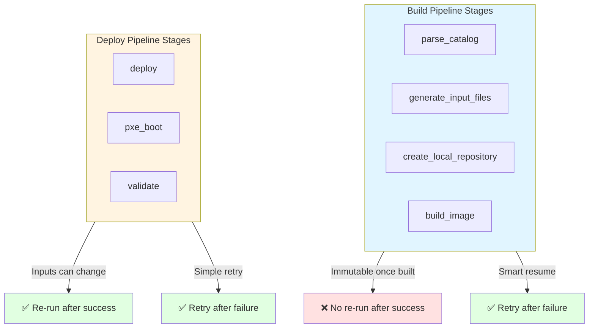
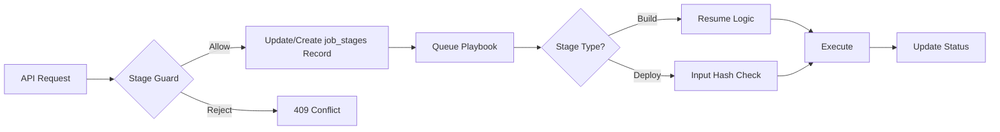
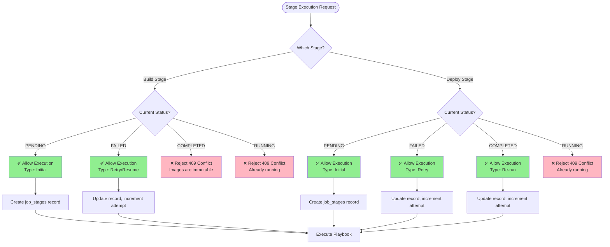
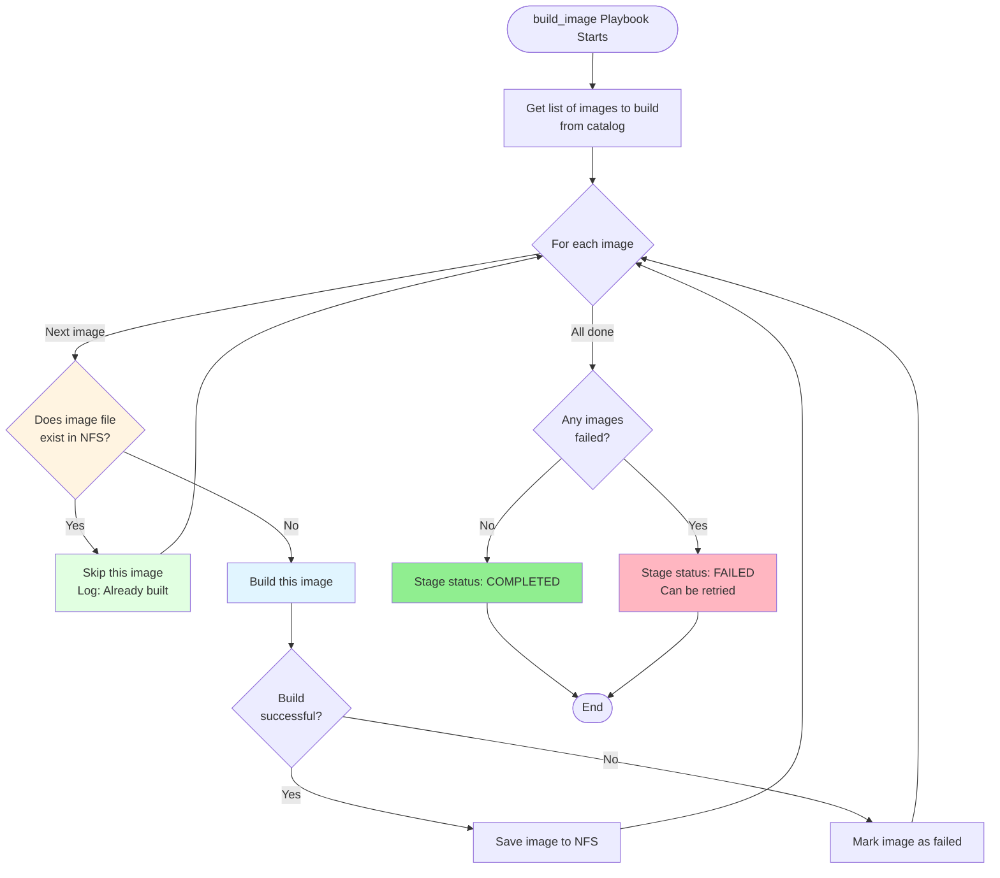
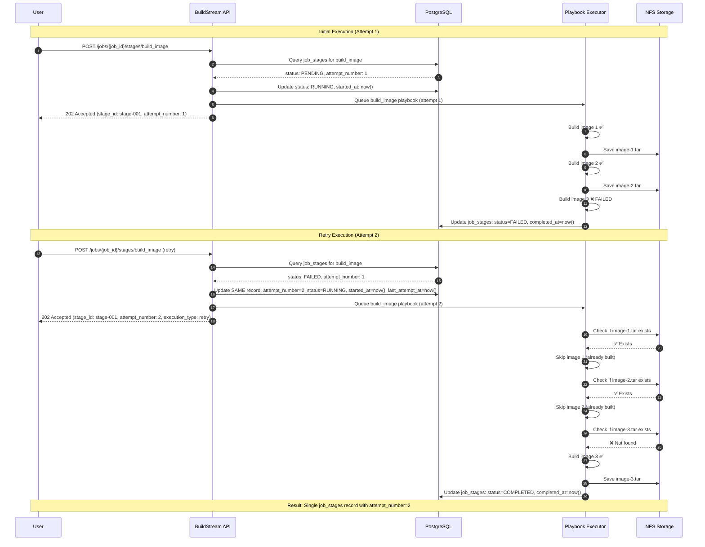
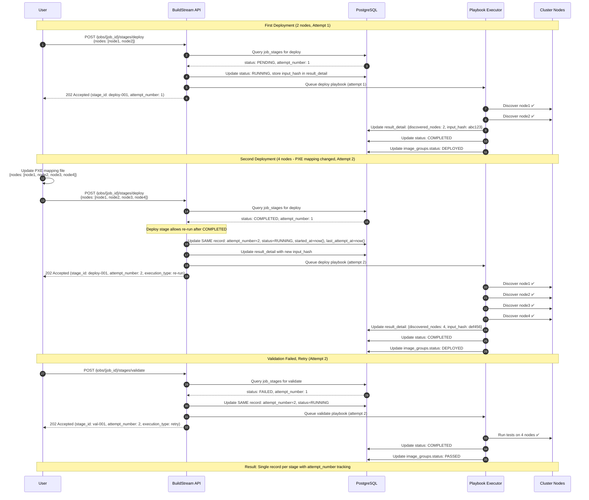
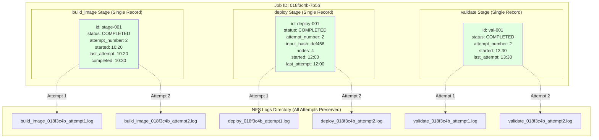

# Component Specification — BuildStream Resume & Retry (Component 4)

| | |
|---|---|
| **Document ID** | CSPEC-BS-C4-2026-001 |
| **Current Version** | 1.0 |
| **Date** | 04/20/2026 |
| **Author** | Venugopal Puttaraju |
| **Team** | Dell Omnia — BuildStream |
| **Document Type** | Component Specification |
| **SDD Phase** | 5a — Component Specification |
| **Parent HLD** | BuildStream_Engineering_Spec(HLD).md |
| **Owner** | Venugopal Puttaraju (primary) |

---

**Dell Confidential - Internal Use Only**

Copyright 2026 Dell Inc. or its subsidiaries. All Rights Reserved.

---

## Revision History

| Version | Date | Description | Author(s) |
|---------|------|-------------|-----------|
| 1.0 | 04/20/2026 | Initial component spec — Resume & Retry feature architecture, stage guard logic, execution patterns, data model changes, API specifications, playbook enhancements, test coverage | Venugopal Puttaraju |

---

## Table of Contents

1. [Component Overview](#1-component-overview)
2. [Architecture](#2-architecture)
3. [Component Behavior](#3-component-behavior)
4. [Data Model](#4-data-model)
5. [API Specifications](#5-api-specifications)
6. [Playbook Enhancements](#6-playbook-enhancements)
7. [Test Coverage](#7-test-coverage)
8. [Dependencies](#8-dependencies)

---

## 1. Component Overview

### 1.1 Purpose

The Resume & Retry component enables intelligent execution management for BuildStream Release 2, allowing failed stages to be retried and Deploy stages to be re-executed with changed inputs. This eliminates the need for complete job restarts and enables flexible deployment management.

### 1.2 Key Capabilities

| Capability | Build Stages | Deploy Stages |
|------------|--------------|---------------|
| **Retry after failure** | ✅ Yes (with smart resume) | ✅ Yes |
| **Re-run after success** | ❌ No (immutable) | ✅ Yes (inputs can change) |
| **Audit trail** | ✅ Complete history | ✅ Complete history |
| **Artifact preservation** | ✅ Skip existing images | ✅ Input hash tracking |

**Stage Execution Patterns:**



### 1.3 Stage Classification

**Build Pipeline Stages** (Immutable):
- `parse_catalog`
- `generate_input_files`
- `create_local_repository`
- `build_image`

**Deploy Pipeline Stages** (Mutable):
- `deploy`
- `pxe_boot`
- `validate`

---

## 2. Architecture

### 2.1 Component Diagram

```
┌─────────────────────────────────────────────────────────────┐
│                    BuildStream API Layer                     │
│  ┌────────────────────────────────────────────────────────┐ │
│  │         Stage Guard Logic (Retry/Re-run Rules)         │ │
│  └────────────────────────────────────────────────────────┘ │
└───────────────────────┬─────────────────────────────────────┘
                        │
        ┌───────────────┼───────────────┐
        │               │               │
        ▼               ▼               ▼
┌──────────────┐ ┌──────────────┐ ┌──────────────┐
│  PostgreSQL  │ │   Playbook   │ │ NFS Artifact │
│   Database   │ │   Executor   │ │    Store     │
│              │ │              │ │              │
│ job_stages   │ │ Resume Logic │ │ Image Files  │
│(single record)│ │ Input Hash   │ │ Logs         │
└──────────────┘ └──────────────┘ └──────────────┘
```

### 2.2 Execution Flow



---

## 3. Component Behavior

### 3.1 Stage Guard Decision Logic

**Build Stages:**
```
IF status == PENDING → Allow (Initial)
IF status == FAILED → Allow (Retry with resume)
IF status == COMPLETED → Reject (409 Conflict - Immutable)
IF status == RUNNING → Reject (409 Conflict - In progress)
```

**Deploy Stages:**
```
IF status == PENDING → Allow (Initial)
IF status == FAILED → Allow (Retry)
IF status == COMPLETED → Allow (Re-run with new inputs)
IF status == RUNNING → Reject (409 Conflict - In progress)
```

**Stage Guard Decision Tree:**



### 3.2 Build Image Resume Logic

The `build_image` playbook implements intelligent resume:

1. **Retrieve catalog** → List of images to build
2. **For each image:**
   - Check if image file exists in NFS
   - If exists → Skip (log: "Already built")
   - If not exists → Build image
3. **Save successful builds** to NFS
4. **Mark stage:**
   - COMPLETED if all images built
   - FAILED if any image failed (can retry)

**Build Image Resume Flowchart:**



**Example:**
| Image | Attempt 1 | Attempt 2 | Result |
|-------|-----------|-----------|--------|
| image-1 | ✅ Built | ⏭️ Skipped | Reused |
| image-2 | ✅ Built | ⏭️ Skipped | Reused |
| image-3 | ❌ Failed | ✅ Built | New |
| image-4 | ⏸️ Not started | ✅ Built | New |

**Time Savings**: 50% (2 of 4 images reused)

**Build Stage Retry Sequence:**



### 3.3 Deploy Stage Re-run Logic

Deploy stages track input changes via hash:

1. **Calculate input hash** from PXE mapping + configuration
2. **Store hash** in `result_detail` JSON field
3. **On re-run:**
   - Compare new hash with previous
   - Execute regardless (inputs may have changed)
   - Track new hash for audit

**Use Case**: Add nodes to cluster
- Initial: 2 nodes deployed
- Re-run: 4 nodes deployed (PXE mapping updated)
- Result: No rebuild required

**Deploy Stage Re-run Sequence:**



---

## 4. Data Model

### 4.1 Database Schema

**Table**: `job_stages` (Single record per stage)

| Column | Type | Description |
|--------|------|-------------|
| `id` | UUID | Unique stage ID (PK) |
| `job_id` | UUID | Parent job reference (FK) |
| `stage_name` | VARCHAR | Stage identifier |
| `status` | ENUM | PENDING, RUNNING, COMPLETED, FAILED |
| `attempt_number` | INTEGER | Current execution attempt count |
| `started_at` | TIMESTAMP | First execution start time |
| `last_attempt_at`| TIMESTAMP | Last execution attempt time |
| `completed_at` | TIMESTAMP | Execution end time |
| `result_detail` | JSONB | Input hash, metrics, errors |
| `created_at` | TIMESTAMP | Record creation time |

**Constraint**: UNIQUE `(job_id, stage_name)` ensures one record per stage

### 4.2 Execution History Example

**Audit Trail Visualization:**



**Key Points:**
- Each stage has **one record** in `job_stages` table
- `attempt_number` tracks how many times the stage was executed
- Logs are numbered by attempt and map to `attempt_number` in database
- Single record updated on retry/re-run, not new records created
- Complete audit trail preserved in attempt-numbered logs until job cleanup

```
job_stages for job_id = "018f3c4b-7b5b"
┌─────────┬──────────────┬───────────┬─────────┬──────────┐
│ id      │ stage_name   │ status    │ attempt │ started  │
├─────────┼──────────────┼───────────┼─────────┼──────────┤
│ stg-001 │ build_image  │ COMPLETED │ 2       │ 10:00    │
│ stg-002 │ deploy       │ COMPLETED │ 2       │ 11:00    │
└─────────┴──────────────┴───────────┴─────────┴──────────┘
```

### 4.3 Log File Naming

**Pattern**: `<stage_name>_<job_id>_attempt<attempt_number>.log`

**Examples**:
- `build_image_018f3c4b_attempt1.log` (Attempt 1)
- `build_image_018f3c4b_attempt2.log` (Attempt 2)
- `deploy_018f3c4b_attempt1.log` (Initial)
- `deploy_018f3c4b_attempt2.log` (Re-run)

### 4.4 Complete Lifecycle Example

**Job Lifecycle Timeline with Retries and Re-runs:**

```mermaid
gantt
    title Job Lifecycle with Retries and Re-runs
    dateFormat HH:mm
    axisFormat %H:%M
    
    section Build Pipeline
    parse_catalog (success)           :done, pc1, 09:00, 09:05
    generate_input_files (success)    :done, gif1, 09:05, 09:10
    create_local_repository (success) :done, clr1, 09:10, 09:30
    build_image (FAILED - 2/5 images) :crit, bi1, 09:30, 09:45
    build_image retry (COMPLETED)     :done, bi2, 10:00, 10:15
    
    section Deploy Pipeline - Run 1
    deploy (2 nodes - success)        :done, d1, 11:00, 11:10
    pxe_boot (2 nodes - success)      :done, pb1, 11:10, 11:20
    validate (FAILED)                 :crit, v1, 11:20, 11:30
    validate retry (success)          :done, v2, 11:35, 11:45
    
    section Deploy Pipeline - Run 2
    deploy (4 nodes - PXE changed)    :active, d2, 14:00, 14:15
    pxe_boot (4 nodes)                :active, pb2, 14:15, 14:30
    validate (4 nodes)                :active, v3, 14:30, 14:45
```



**Timeline Explanation:**

1. **09:00-09:30**: Build stages execute successfully
2. **09:30-09:45**: `build_image` fails (2 of 5 images built)
3. **10:00-10:15**: `build_image` retried, skips 2 existing images, builds remaining 3
4. **11:00-11:20**: First deployment to 2 nodes succeeds
5. **11:20-11:30**: Validation fails
6. **11:35-11:45**: Validation retried, succeeds
7. **14:00-14:45**: PXE mapping changed to 4 nodes, re-deploy entire pipeline

**Database State After Complete Lifecycle:**

```
job_stages table:
┌──────────┬─────────┬──────────────────────┬───────────┬────────┬──────────┬────────────┐
│ id       │ job_id  │ stage_name           │ status    │ attempt│ started  │ last_att   │
├──────────┼─────────┼──────────────────────┼───────────┼────────┼──────────┼────────────┤
│ stg-001  │ job-123 │ parse_catalog        │ COMPLETED │ 1      │ 09:00    │ 09:00      │
│ stg-002  │ job-123 │ generate_input_files │ COMPLETED │ 1      │ 09:05    │ 09:05      │
│ stg-003  │ job-123 │ create_local_repo    │ COMPLETED │ 1      │ 09:10    │ 09:10      │
│ stg-004  │ job-123 │ build_image          │ COMPLETED │ 2      │ 10:00    │ 10:00      │ ← Retried
│ stg-005  │ job-123 │ deploy               │ COMPLETED │ 2      │ 12:00    │ 14:00      │ ← Re-run
│ stg-006  │ job-123 │ pxe_boot             │ COMPLETED │ 2      │ 11:10    │ 14:15      │ ← Re-run
│ stg-007  │ job-123 │ validate             │ COMPLETED │ 3      │ 13:30    │ 14:30      │ ← Retry+Re-run
└──────────┴─────────┴──────────────────────┴───────────┴────────┴──────────┴────────────┘

Total stage records: 7 (one per stage)
Total attempts: 11 (sum of all attempt_number values)
Retries: build_image (1), validate (2)
Re-runs: deploy (1), pxe_boot (1), validate (2)

Logs preserved:
- build_image_job-123_attempt1.log, build_image_job-123_attempt2.log
- deploy_job-123_attempt1.log, deploy_job-123_attempt2.log
- validate_job-123_attempt1.log, validate_job-123_attempt2.log, validate_job-123_attempt3.log
```

---

## 5. API Specifications

### 5.1 Execute Stage Endpoint

**Endpoint**: `POST /api/v1/jobs/{job_id}/stages/{stage_name}`

**Request**: Same for initial, retry, and re-run
```json
{
  "job_id": "018f3c4b-7b5b-4c4e-9c4e-3b5b4c4e9c4e"
}
```

**Response** (202 Accepted):
```json
{
  "stage_id": "stage-001",
  "attempt_number": 2,
  "execution_type": "retry",
  "stage_name": "build_image",
  "status": "RUNNING",
  "started_at": "2026-03-31T10:20:00Z"
}
```

**Execution Types**:
- `initial` - First execution (status was PENDING)
- `retry` - After failure (status was FAILED)
- `re-run` - After success (status was COMPLETED, Deploy stages only)

**Error Responses**:
- `409 Conflict` - Stage already running or completed (Build stages)
- `404 Not Found` - Job or stage not found
- `400 Bad Request` - Invalid stage name

---

## 6. Playbook Enhancements

### 6.1 Build Image Playbook

**File**: `build_image_x86_64.yml` / `build_image_aarch64.yml`

**Resume Logic Implementation**:
```yaml
- name: Check if image already exists
  stat:
    path: "{{ nfs_path }}/{{ image_name }}.tar"
  register: image_exists

- name: Skip if image exists
  debug:
    msg: "Image {{ image_name }} already built, skipping"
  when: image_exists.stat.exists

- name: Build image
  command: buildah build -t {{ image_name }}
  when: not image_exists.stat.exists
```

### 6.2 Deploy Playbook

**File**: `deploy.yml`

**Input Hash Tracking**:
```yaml
- name: Calculate input hash
  set_fact:
    input_hash: "{{ (pxe_mapping | to_json) | hash('sha256') }}"

- name: Store input hash in result_detail
  uri:
    url: "{{ api_url }}/jobs/{{ job_id }}/stages/deploy"
    method: PATCH
    body_format: json
    body:
      result_detail:
        input_hash: "{{ input_hash }}"
        node_count: "{{ pxe_mapping | length }}"
```

---

## 7. Test Coverage

### 7.1 Critical Test Cases

| TC ID | Test Case Name | Stage Type | Focus Area |
|-------|----------------|------------|------------|
| TC-001 | Build Image Retry with Resume | Build | Resume logic, time savings |
| TC-002 | Deploy Stage Re-run After Success | Deploy | Input changes, node scaling |
| TC-003 | Build Stage Reject Re-run After Success | Build | Immutability enforcement |
| TC-004 | Validation Retry After Failure | Deploy | Retry after failure |
| TC-005 | Concurrent Execution Prevention | Both | Guard logic, 409 Conflict |
| TC-006 | Complete Audit Trail Verification | Both | Execution history, log tracking |

#### TC-001: Build Image Retry with Resume
**Preconditions**: 
- Job with 5 images to build
- First attempt built 2 images, failed on 3rd

**Steps**:
1. Execute `build_image` stage (initial)
2. Verify 2 images built, stage status = FAILED
3. Execute `build_image` stage (retry)
4. Verify only 3 remaining images built
5. Verify stage status = COMPLETED

**Expected**: 
- Total build time reduced by ~40%
- 2 images reused from first attempt
- 1 execution record in `job_stages` with attempt_number=2

---

#### TC-002: Deploy Stage Re-run After Success
**Preconditions**:
- Job with successful deploy to 2 nodes
- PXE mapping updated to 4 nodes

**Steps**:
1. Execute `deploy` stage (initial, 2 nodes)
2. Verify status = COMPLETED, 2 nodes discovered
3. Update PXE mapping to 4 nodes
4. Execute `deploy` stage (re-run)
5. Verify status = COMPLETED, 4 nodes discovered

**Expected**:
- Re-run allowed after COMPLETED status
- New input hash stored
- 1 execution record in `job_stages` with attempt_number=2
- No image rebuild required

---

#### TC-003: Build Stage Reject Re-run After Success
**Preconditions**:
- Job with successful `build_image` stage

**Steps**:
1. Execute `build_image` stage (initial)
2. Verify status = COMPLETED
3. Attempt to execute `build_image` stage again
4. Verify API returns 409 Conflict

**Expected**:
- Re-run rejected for Build stages
- Error message: "Build stages are immutable"

---

#### TC-004: Validation Retry After Failure
**Preconditions**:
- Job with failed `validate` stage

**Steps**:
1. Execute `validate` stage (initial)
2. Verify status = FAILED
3. Fix infrastructure issue
4. Execute `validate` stage (retry)
5. Verify status = COMPLETED

**Expected**:
- Retry allowed after FAILED status
- 1 execution record with attempt_number=2
- Both log files preserved

---

#### TC-005: Concurrent Execution Prevention
**Preconditions**:
- Job with `deploy` stage in RUNNING status

**Steps**:
1. Execute `deploy` stage (starts running)
2. Attempt to execute `deploy` stage again
3. Verify API returns 409 Conflict

**Expected**:
- Concurrent execution prevented
- Error message: "Stage already running"

---

#### TC-006: Complete Audit Trail Verification
**Preconditions**:
- Job with multiple retries and re-runs

**Steps**:
1. Execute `build_image` (initial, fails)
2. Execute `build_image` (retry, succeeds)
3. Execute `deploy` (initial, 2 nodes)
4. Execute `deploy` (re-run, 4 nodes)
5. Query execution history

**Expected**:
- 2 execution records in database (one for build_image, one for deploy)
- 4 log files with attempt numbers
- Database tracks attempt_number correctly
- Input hash differs in deploy record after re-run

---

### 7.2 Test Metrics

| Category | Test Cases | Priority |
|----------|-----------|----------|
| Build Stage Retry | 8 | High |
| Deploy Stage Re-run | 6 | High |
| Guard Logic | 5 | Critical |
| Audit Trail | 4 | Medium |
| Performance | 3 | Medium |
| **Total** | **26** | - |

---

## 8. Dependencies

### 8.1 Required Components

| Component | Version | Purpose |
|-----------|---------|---------|
| PostgreSQL | 14+ | Single-record execution tracking |
| NFS Storage | - | Artifact persistence |
| Ansible | 2.14+ | Playbook execution |
| BuildStream API | 2.0+ | Stage orchestration |

### 8.2 Configuration Requirements

**Database Migration**:
```sql
-- Add attempt tracking columns
ALTER TABLE job_stages ADD COLUMN attempt_number INTEGER DEFAULT 1;
ALTER TABLE job_stages ADD COLUMN last_attempt_at TIMESTAMP;

-- UNIQUE constraint on (job_id, stage_name) remains
```

**API Configuration**:
```yaml
stage_guards:
  build_stages:
    - parse_catalog
    - generate_input_files
    - create_local_repository
    - build_image
  deploy_stages:
    - deploy
    - pxe_boot
    - validate
```

---

## Document History

| Version | Date | Author | Changes |
|---------|------|--------|---------|
| 1.0 | 2026-04-20 | Venugopal Puttaraju | Initial component specification |

---

**End of Document**
