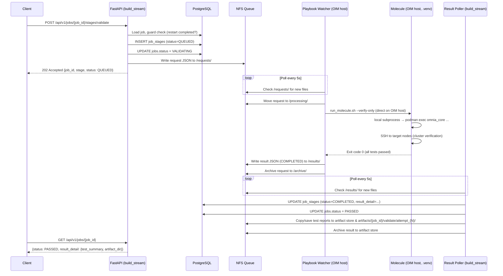
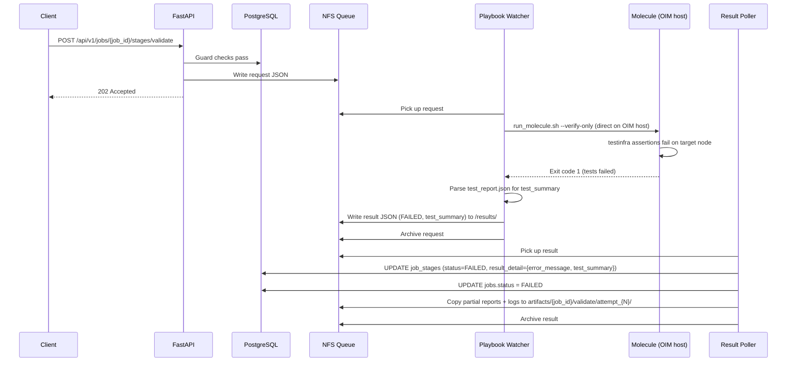
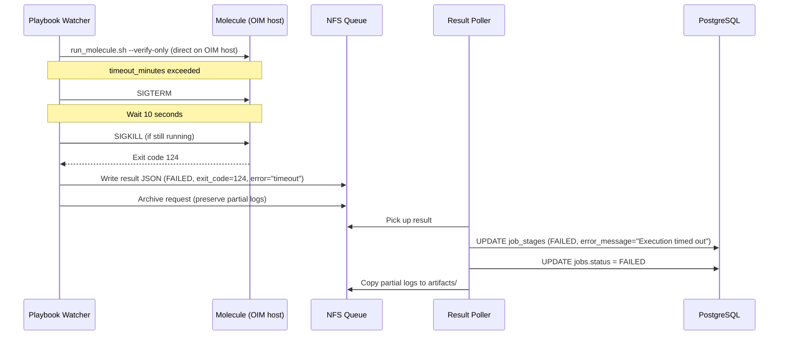
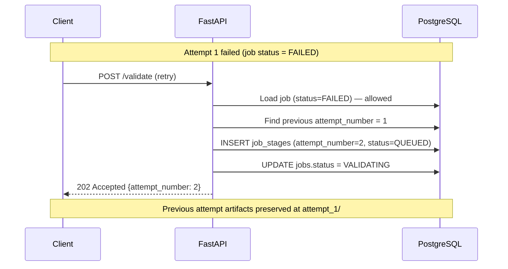

# Component 3 — Validate Stage Module Specification

## Document Information

| Attribute | Value |
|-----------|-------|
| **Document ID** | MSPEC-BS-C3-2026-001 |
| **Current Version** | 1.1 |
| **Date** | 04/23/2026 |
| **Author** | Venugopal Puttaraju |
| **Team** | Dell Omnia — BuildStream |
| **Document Type** | Module Specification |
| **SDD Phase** | 5a — Module Specification |
| **Parent HLD** | BuildStream_Engineering_Spec(HLD).md v0.7 |
| **Owner** | Venugopal Puttaraju (primary), TBD (review) |

---

**Dell Confidential — Internal Use Only**

Copyright 2026 Dell Inc. or its subsidiaries. All Rights Reserved.

---

## Revision History

| Version | Date | Description | Author(s) |
|---------|------|-------------|-----------|
| 1.1 | 04/23/2026 | **Architecture change — Molecule runs on OIM host, not inside container.** Removed Phase 1 (Dockerfile/pyproject.toml changes) entirely. Molecule, pytest-testinfra, and all automation dependencies are now installed on the OIM host via `setup_env.sh` during `prepare_oim`. The Playbook Watcher executes `run_molecule.sh` directly on the OIM host (not via `podman exec`). The automation framework uses **local execution mode** (`oim_server_ip` left empty) — all commands run via `subprocess` without SSH. Removed `OMNIA_FORCE_REMOTE` environment variable and container-SSH workaround. Resolved SPIKE-001 and SPIKE-002. | Venugopal Puttaraju |
| 1.0 | 04/20/2026 | Initial module specification — phase-structured design Molecule executes inside `omnia_build_stream` container (not `omnia_core`). Aligned with existing async patterns (build_image API, Playbook Watcher, Result Poller). Added Dockerfile changes, prepare_oim automation clone step, `omnia_test_config.yml` generation, Playbook Watcher modification for molecule commands, test cases. | Venugopal Puttaraju |

---

## Table of Contents

- [1. Executive Summary](#1-executive-summary)
- [2. References](#2-references)
- [3. Scope](#3-scope)
- [4. Architecture Overview](#4-architecture-overview)
- [5. Phase 1 — ~~Dockerfile & Container Image Changes~~ (Removed in v1.1)](#5-phase-1--removed-in-v11)
- [6. Phase 2 — prepare_oim: Automation Clone, Install & Config Setup](#6-phase-2--prepare_oim-automation-clone-install--config-setup)
- [7. Phase 3 — Validate API Endpoint & Async Queue Submission](#7-phase-3--validate-api-endpoint--async-queue-submission)
- [8. Phase 4 — Playbook Watcher: Molecule Execution](#8-phase-4--playbook-watcher-molecule-execution)
- [9. Phase 5 — Result Poller: Completion Detection & DB Update](#9-phase-5--result-poller-completion-detection--db-update)
- [10. Sequence Flows](#10-sequence-flows)
- [11. Error Handling & Failure Recovery](#11-error-handling--failure-recovery)
- [12. Modifications to Existing Components](#12-modifications-to-existing-components)
- [13. Security Considerations](#13-security-considerations)
- [14. Performance Requirements](#14-performance-requirements)
- [15. Test Cases](#15-test-cases)
- [16. Dependencies & Prerequisites](#16-dependencies--prerequisites)
- [17. Risks & Mitigations](#17-risks--mitigations)
- [18. Migration & Open Questions](#18-migration--open-questions)

---

## 1. Executive Summary

The Validate Stage is the final verification step in the Dell Omnia BuildStream pipeline. After the build-image, deploy, and restart stages complete, the validate stage executes Molecule-based infrastructure tests **directly on the OIM host** to verify cluster deployment, network connectivity, and service health on the provisioned target nodes.

This module specification decomposes **Component 3 — Validate** into four implementation phases:

| Phase | Focus | Key Deliverables |
|-------|-------|-----------------|
| ~~**Phase 1**~~ | ~~Dockerfile & Container Image~~ | _(Removed in v1.1 — Molecule runs on OIM host, not in container)_ |
| **Phase 2** | prepare_oim: Automation Clone, Install & Config | Clone automation repo, run `setup_env.sh` to install Molecule + deps, generate `omnia_test_config.yml` (local mode) |
| **Phase 3** | Validate API Endpoint & Async Queue | FastAPI `POST /jobs/{job_id}/stages/validate`, guard checks, NFS queue submission |
| **Phase 4** | Playbook Watcher: Molecule Execution | Extend Watcher for molecule commands (`run_molecule.sh` directly on OIM host) |
| **Phase 5** | Result Poller: Completion Detection | Process validate result JSON, update `job_stages`/`jobs` status |

**Key architectural decisions:**

- **Molecule runs directly on the OIM host** — All Molecule dependencies (pytest-testinfra, paramiko, etc.) are installed in a Python virtual environment on the OIM host via `setup_env.sh` during `prepare_oim`. No container image changes required.
- **Local execution mode** — The automation framework runs in **local mode** (`oim_server_ip` left empty in `omnia_test_config.yml`). All commands execute locally via `subprocess` — no SSH to the OIM itself. The automation still SSH-es to target nodes (compute, control plane) for cluster verification.
- **Playbook Watcher triggers Molecule directly** — The Watcher executes `/opt/omnia/automation/run_molecule.sh` on the OIM host (not via `podman exec`). The script activates the `.venv` and runs Molecule.
- **Aligned with existing async flow** — Same NFS queue pattern as build_image: API → `/requests/` → Playbook Watcher → `/results/` → Result Poller → DB.
- **No container changes** — No modifications to `omnia_build_stream` Dockerfile or `pyproject.toml`. No `OMNIA_FORCE_REMOTE` environment variable.
- **Delegated Molecule driver** — Nodes already provisioned; Molecule only runs `verify` steps.
- **Automation repo cloned and installed during prepare_oim** — Not baked into any container image.

---

## 2. References

| Source | ID / Path | Description |
|--------|-----------|-------------|
| Engineering Spec (HLD) | BuildStream_Engineering_Spec(HLD).md v0.7 | Architecture, DB schema, state machines |
| API Specification | Component_3_Validate_API.md | Validate API data models, sequence flows |
| BuildStream Dockerfile | `ContainerFile/omnia_build_stream/Dockerfile` | Fedora 42 base, FastAPI, uv-managed deps |
| BuildStream pyproject.toml | `ContainerFile/omnia_build_stream/pyproject.toml` | Current Python dependencies |
| Automation Framework | `github.com/dell/omnia-artifactory` branch `automation-v2.1.0.0` | Molecule scenarios, `automation_library/`, `run_molecule.sh` |
| Automation Config | `omnia_test_config.yml` | OIM IP, SSH creds, dataset path |
| Playbook Watcher | `playbook-watcher/playbook_watcher_service.py` | NFS queue consumer, command executor (molecule + ansible-playbook) |
| Result Poller | `orchestrator/common/result_poller.py` | NFS result consumer, DB updater |
| Existing Validate Routes | `api/validate/routes.py` | Existing endpoint scaffold |
| prepare_oim Role | `prepare_oim/roles/deploy_containers/build_stream/` | Container deployment, Quadlet template |

---

## 3. Scope

### In Scope

- ~~**Phase 1**: Dockerfile and `pyproject.toml` changes~~ _(Removed in v1.1)_
- **Phase 2**: prepare_oim additions — clone automation repo, run `setup_env.sh`, generate config (local mode)
- **Phase 3**: Validate API endpoint — NFS queue request submission
- **Phase 4**: Playbook Watcher modifications — molecule command support (direct execution on OIM host)
- **Phase 5**: Result Poller handling for validate results
- Modifications to existing components (Watcher, prepare_oim)
- Test cases for end-to-end validation

### Out of Scope

- Writing new Molecule test scenarios (already exist in automation repo)
- Resume & Retry guard logic (separate feature)
- CleanUp API, Upload API (Component 1)
- Deploy/Restart stage endpoints (Component 2)
- Container image changes (`omnia_build_stream` Dockerfile / `pyproject.toml`)

---

## 4. Architecture Overview

### 4.1 System Context

| Component | Container / Host | Port | Role in Validate |
|-----------|-----------------|------|-----------------|
| **BuildStream API** | `omnia_build_stream` | 5001 (HTTPS) | FastAPI REST API, Result Poller |
| **PostgreSQL** | `omnia_postgres` | 5432 | Job/stage metadata persistence |
| **Playbook Watcher** | OIM host (systemd) | — | Polls `/requests/`, executes `run_molecule.sh` on OIM host, writes `/results/` |
| **Molecule + automation_library** | OIM host (Python .venv) | — | Test framework installed via `setup_env.sh`, runs in local execution mode |
| **Target Nodes** | Physical/VM | 22 (SSH) | Cluster nodes verified via testinfra (SSH from OIM host) |

### 4.2 Technology Stack

| Layer | Technology | Version | Installed On | Notes |
|-------|-----------|---------|-------------|-------|
| API Framework | FastAPI | ≥0.115.6 | `omnia_build_stream` | Already in pyproject.toml |
| ORM | SQLAlchemy | ≥2.0.0 | `omnia_build_stream` | Already present |
| Database | PostgreSQL | 16 | `omnia_postgres` | Existing |
| **Test Framework** | **Molecule** | **25.12.0** | **OIM host (.venv)** | **Installed via setup_env.sh** |
| **Molecule Plugins** | **molecule-plugins** | **25.8.12** | **OIM host (.venv)** | **Installed via setup_env.sh** |
| Ansible | ansible-core | ≥2.16.0 | OIM host | Already present |
| **Test Runner** | **pytest-testinfra** | **10.2.2** | **OIM host (.venv)** | **Installed via setup_env.sh** |
| **SSH Library** | **paramiko** | **4.0.0** | **OIM host (.venv)** | **Installed via setup_env.sh** |
| **SSH Auth** | **sshpass** | **OS package** | **OIM host** | **Installed via setup_env.sh** |
| **Process Control** | **pexpect** | **4.9.0** | **OIM host (.venv)** | **Installed via setup_env.sh** |

### 4.3 Communication Flow

```
Client (GitLab CI / UI)
        │ POST /validate
        ▼
┌────────── omnia_build_stream container ──────────┐
│  FastAPI (:8010)         Result Poller (asyncio)  │
│  → guard checks          → polls /results/        │
│  → create stage (QUEUED) → updates DB             │
│  → write NFS request     → archives result        │
│  → return 202                                     │
└────────┬──────────────────────────▲───────────────┘
         │                         │
    NFS /requests/            NFS /results/
         │                         │
         ▼                         │
┌─────────────────────────────────┐│
│  Playbook Watcher (OIM host)    ││
│  1. Poll /requests/             ││
│  2. Move to /processing/        ││
│  3. run_molecule.sh --verify    ││
│     (directly on OIM host)      ││
│  4. Capture exit code + logs    ││
│  5. Write result JSON ──────────┘│
│  6. Archive request              │
└──────────┬───────────────────────┘
           │ local subprocess     │ SSH
           ▼                      ▼
    OIM Host (podman,         Target Nodes
     omnia_core container)    (cluster verification)
```

### 4.4 Existing Code Already Scaffolded

| File | Current State | Action Required |
|------|--------------|-----------------|
| `api/validate/routes.py` | `POST /{job_id}/stages/validate-image-on-test` scaffolded | **Rename route** to `/validate`, remove `image_key` from request |
| `api/validate/schemas.py` | `ValidateImageOnTestRequest` (requires `image_key`) | **Rename** to `ValidateRequest`, remove `image_key`, change `scenario_name` to `scenario_names` array, add `test_suite`, add `timeout_minutes` |
| `api/validate/dependencies.py` | DI wiring for use case | No changes |
| `orchestrator/validate/use_cases.py` | Use case with stage guard, queue submission | Build molecule-specific queue JSON |
| `core/jobs/value_objects.py` | `StageType.VALIDATE_IMAGE_ON_TEST` exists | **Rename** to `StageType.VALIDATE` |
| `orchestrator/common/result_poller.py` | Handles build-image callbacks | Add validate callbacks + artifact copy |
| `playbook-watcher/playbook_watcher_service.py` | `ansible-playbook` via whitelist | Add molecule execution path |

### 4.5 NFS Storage Layout

```
/opt/omnia/
├── playbook_queue/                    # NFS async queue (existing)
│   ├── requests/                      # API writes validate request JSON
│   ├── processing/                    # Watcher moves here during execution
│   ├── results/                       # Watcher writes result JSON
│   └── archive/                       # Completed files moved here
├── build_stream_root/artifacts/       # NFS artifact store (existing)
│   └── {job_id}/validate/attempt_{N}/
│       ├── molecule_output.log        # Full stdout/stderr
│       ├── test_report.json           # Machine-readable report
│       ├── test_report.html           # HTML report
│       └── junit.xml                  # JUnit XML for CI
├── automation/                        # NEW — cloned automation repo + installed deps
│   ├── .venv/                         # Python virtual environment (created by setup_env.sh)
│   ├── automation_library/            # Core test utilities
│   ├── molecule/                      # Molecule scenario directories
│   ├── run_molecule.sh                # Entry point script (activates .venv automatically)
│   ├── setup_env.sh                   # Installs Molecule + deps into .venv
│   ├── conftest.py                    # Pytest fixtures
│   └── omnia_test_config.yml          # Generated config (local mode: oim_server_ip empty)
└── input/project_default/             # Pre-existing input files
```

### 4.6 Database (Existing — No Schema Changes)

| Table | Usage in Validate |
|-------|-------------------|
| `jobs` | Status: `RESTARTED` → `VALIDATING` → `PASSED` or `FAILED` |
| `image_groups` | Mirrors job status transitions |
| `job_stages` | One row per attempt. `result_detail` JSONB stores test counts, log paths, errors |

---

## 5. Phase 1 — ~~Dockerfile & Container Image Changes~~ (Removed in v1.1)

> **v1.1 Architecture Change:** Phase 1 has been **removed entirely**. Molecule and all test dependencies are now installed directly on the OIM host via `setup_env.sh` during Phase 2 (`prepare_oim`), not inside the `omnia_build_stream` container. No Dockerfile or `pyproject.toml` changes are required. No `PYTHONPATH` or `OMNIA_FORCE_REMOTE` environment variables are needed. See Phase 2 (§6) for the replacement approach.

---

## 6. Phase 2 — prepare_oim: Automation Clone, Install & Config Setup

### 6.1 Description

During `prepare_oim`, a new Ansible task SHALL clone the automation repo (`automation-v2.1.0.0`) to `/opt/omnia/automation/` on the OIM host, run `setup_env.sh` to install Molecule and all test dependencies into a Python virtual environment (`.venv`), and generate `omnia_test_config.yml` configured for **local execution mode** (`oim_server_ip` left empty). This task runs once during OIM preparation, not per-job.

> **v1.1 Architecture Change:** In v1.0, Molecule was intended to run inside the `omnia_build_stream` container and `setup_env.sh` was explicitly NOT executed. In v1.1, Molecule runs **directly on the OIM host**, so `setup_env.sh` IS executed to create the `.venv` with all required dependencies. No container image changes are needed.

### 6.2 New Task: `configure_automation.yml`

**Location**: `prepare_oim/roles/deploy_containers/build_stream/tasks/configure_automation.yml`

Included from `main.yml` after container deployment and health check.

**Tasks:**

1. **Create directory** — `/opt/omnia/automation/` with mode `0755`
2. **Clone repo** — `https://github.com/dell/omnia-artifactory.git` branch `automation-v2.1.0.0` with 3 retries, 10s delay (matching existing git clone pattern in `prepare_oim_completion.yml`)
3. **Make scripts executable** — `chmod +x /opt/omnia/automation/run_molecule.sh /opt/omnia/automation/setup_env.sh`
4. **Run setup_env.sh** — `bash /opt/omnia/automation/setup_env.sh` — creates `.venv/` and installs Molecule, pytest-testinfra, paramiko, pexpect, molecule-plugins, and sshpass from `requirements.txt`
5. **Generate omnia_test_config.yml** — From Jinja2 template configured for local execution mode
6. **Verify readiness** — `/opt/omnia/automation/.venv/bin/python3 -c "from automation_library.core import load_omnia_test_config; load_omnia_test_config()"`

### 6.3 omnia_test_config.yml Generation

**Template**: `templates/omnia_test_config.yml.j2`

| Key | Source | Required | Description |
|-----|--------|----------|-------------|
| `oim_server_ip` | _(empty string)_ | No | **Left empty** — triggers local execution mode (no SSH to OIM) |
| `oim_ssh_user` | _(empty string)_ | No | Not needed in local mode |
| `oim_ssh_password` | _(empty string)_ | No | Not needed in local mode |
| `dataset_path` | `/opt/omnia/input/project_default` | Yes | Input files path |
| `nfs_share_path` | `/opt/omnia/build_stream_root/artifacts` | Yes | Artifact storage |

> **Local execution mode**: With `oim_server_ip` empty, the automation's `is_local_execution()` function returns `True`. All OIM commands (e.g., `podman exec omnia_core ...`) execute directly via `subprocess` on the OIM host where `podman` IS available. No SSH credentials are needed for the OIM itself. SSH is still used for target node verification (compute, control plane nodes) using key-based authentication from the `omnia_core` container.

### 6.4 Why Local Execution Mode Works

Since Molecule now runs **directly on the OIM host** (not inside a container):

1. The OIM host has `podman` installed — commands like `podman exec omnia_core ...` work via `subprocess`.
2. The automation's `is_local_execution()` detects empty `oim_server_ip` and routes all OIM commands through local `subprocess` instead of SSH.
3. No SSH password is needed for the OIM itself — eliminating credential management complexity.
4. Target node verification still uses SSH from within the `omnia_core` container (key-based auth established during deploy/restart stages).

This is a significant simplification over the v1.0 design, which required SSH from the container back to the OIM host.

### 6.5 Acceptance Criteria — Phase 2

- **AC-2.1**: `/opt/omnia/automation/` contains cloned repo with `automation_library/`, `molecule/`, `run_molecule.sh`
- **AC-2.2**: `/opt/omnia/automation/.venv/` exists and contains Molecule (`python3 -m molecule --version` ≥25.12.0)
- **AC-2.3**: `omnia_test_config.yml` has `oim_server_ip` set to empty string (local mode)
- **AC-2.4**: `load_omnia_test_config()` succeeds from within the `.venv`
- **AC-2.5**: Git clone retries 3 times on failure with clear error message
- **AC-2.6**: Re-running prepare_oim updates repo without error (idempotent)
- **AC-2.7**: `run_molecule.sh` activates `.venv` and runs Molecule successfully on the OIM host

---

## 7. Phase 3 — Validate API Endpoint & Async Queue Submission

### 7.1 Description

The existing `POST /api/v1/jobs/{job_id}/stages/validate` endpoint SHALL be completed to accept validate requests, perform guard checks, create a `job_stages` record, write NFS queue request JSON, and return `202 Accepted`.

### 7.2 API Contract

**Request** (extend `ValidateRequest`):

| Field | Type | Required | Default | Description |
|-------|------|----------|---------|-------------|
| `scenario_names` | array[string] | No | `["all"]` | Molecule scenarios to run (e.g., `["discovery"]`, `["slurm"]`, or `["all"]` for full run) |
| `test_suite` | string | No | `""` | Suite filter to apply (e.g., `"smoke"`, `"sanity"`, `"regression"`). Maps to Molecule markers. |
| `timeout_minutes` | integer | No | `120` | Max execution time |

**Response** (`202 Accepted`): `job_id`, `stage: "validate"`, `status: "QUEUED"`, `submitted_at`, `correlation_id`

**Errors** (already in routes.py): 404 JOB_NOT_FOUND, 409 STAGE_ALREADY_ACTIVE, 409 UPSTREAM_STAGE_NOT_COMPLETE, 422 validation, 500 INTERNAL_ERROR

### 7.3 Use Case Flow

1. Load job by ID → 404 if missing
2. Guard check → restart completed, no active validate stage
3. Create `job_stages` row: `stage_name="validate"`, `status="QUEUED"`, `attempt_number` incremented
4. Update job status → `VALIDATING`
5. Build NFS queue request JSON with `command_type: "molecule"`
6. Write to `/playbook_queue/requests/validate_{job_id}_{timestamp}.json`
7. Return 202

### 7.4 NFS Queue Request JSON

| Field | Description |
|-------|-------------|
| `request_id` | `validate_{job_id}_{timestamp}` |
| `job_id` | Job UUID |
| `stage_type` | `"validate"` |
| `command_type` | `"molecule"` (distinguishes from `"ansible-playbook"`) |
| `scenario_names` | Array of Molecule scenario names |
| `test_suite` | Optional suite filter (e.g. `"smoke"`, `"sanity"`) |
| `timeout_minutes` | Max execution time |
| `artifact_dir` | `/opt/omnia/build_stream_root/artifacts/{job_id}/validate/attempt_{N}/` |
| `config_path` | `/opt/omnia/automation/omnia_test_config.yml` |
| `correlation_id` | Request correlation ID |

### 7.5 Acceptance Criteria — Phase 3

- **AC-3.1**: Returns 202 with correct body for valid job in RESTARTED state
- **AC-3.2**: `job_stages` record created with status=QUEUED
- **AC-3.3**: Job status transitions to VALIDATING
- **AC-3.4**: NFS request JSON written to `/requests/` with correct structure
- **AC-3.5**: Duplicate call returns 409 STAGE_ALREADY_ACTIVE
- **AC-3.6**: Job without completed restart returns 409
- **AC-3.7**: `correlation_id` propagates to NFS JSON
- **AC-3.8**: `attempt_number` increments on retry
- **AC-3.9**: API accepts requests with `scenario_names` array, optional `test_suite`, and optional `timeout_minutes`

---

## 8. Phase 4 — Playbook Watcher: Molecule Execution

### 8.1 Description

The Playbook Watcher SHALL be extended to support `command_type: "molecule"` in request JSON. It executes `/opt/omnia/automation/run_molecule.sh` **directly on the OIM host** (not via `podman exec`), captures output, and writes result JSON. The `run_molecule.sh` script automatically activates the `.venv` created during Phase 2.

> **v1.1 Change:** In v1.0, the Watcher used `podman exec omnia_build_stream ...` to run Molecule inside the container. In v1.1, the Watcher runs `run_molecule.sh` directly on the OIM host since Molecule is installed there via `setup_env.sh`.

### 8.2 Execution Command

```
ANSIBLE_HOST_KEY_CHECKING=False \
MOLECULE_REPORT_DIR={artifact_dir} \
bash /opt/omnia/automation/run_molecule.sh \
  --scenario {scenario_name} --verify-only \
  [--suite {test_suite}] \
  --config /opt/omnia/automation/omnia_test_config.yml
```

### 8.3 Exit Codes

| Code | Meaning | Result Status |
|------|---------|--------------|
| 0 | All tests passed | `COMPLETED` |
| 1 | Tests failed | `FAILED` |
| 2 | Config error | `FAILED` |
| 124 | Timeout (killed) | `FAILED` (timeout) |

### 8.4 Result JSON (written to `/results/`)

| Field | Description |
|-------|-------------|
| `request_id` | Matches original request |
| `job_id` | Job UUID |
| `stage_type` | `"validate"` |
| `status` | `"COMPLETED"` or `"FAILED"` |
| `exit_code` | Process exit code |
| `duration_seconds` | Execution time |
| `test_summary` | `{total, passed, failed, skipped, errors}` from test_report.json |
| `error_message` | Error description if failed |
| `correlation_id` | Propagated from request |

### 8.5 Watcher Modifications

1. Read `command_type` from request JSON; branch on `"molecule"` vs `"ansible-playbook"`
2. Build direct shell command with env vars, scenario, and optional `--suite` parameter
3. Validate paths within `/opt/omnia/` only (prevent path traversal)
4. Execute via `subprocess.run()` with argument list (no shell — primary injection prevention)
5. Enforce `timeout_minutes`; SIGTERM → 10s → SIGKILL on timeout
6. Parse `test_report.json` if available for test_summary
7. Write result JSON to `/results/`

### 8.6 Acceptance Criteria — Phase 4

- **AC-4.1**: Watcher picks up validate request within 5 seconds
- **AC-4.2**: Correct `run_molecule.sh` command constructed (direct execution, not `podman exec`)
- **AC-4.3**: Molecule verify runs on OIM host in local execution mode (no SSH to OIM)
- **AC-4.4**: Test artifacts (JSON, HTML, log) written to correct artifact_dir
- **AC-4.5**: Result JSON status matches exit code (0→COMPLETED, else→FAILED)
- **AC-4.6**: test_summary contains accurate counts
- **AC-4.7**: Process killed on timeout with exit code 124
- **AC-4.8**: Rejects paths outside `/opt/omnia/` (path traversal prevention)
- **AC-4.9**: Existing ansible-playbook requests unaffected

---

## 9. Phase 5 — Result Poller: Completion Detection & DB Update

### 9.1 Description

The Result Poller SHALL handle `stage_type: "validate"` results. On completion, it updates `job_stages` and `jobs` tables, **copies test report artifacts to the job's artifact directory** (following the same pattern as `generate-input-files`), and archives the result file.

### 9.2 Processing Flow

1. Read result JSON from `/results/`
2. Find `job_stages` row for job_id with status QUEUED/RUNNING
3. Update `job_stages`: status → COMPLETED/FAILED, `result_detail` JSONB → test_summary + artifact paths
4. Update `jobs`: VALIDATING → PASSED (success) or FAILED (failure)
5. **Copy test reports to artifact store** at `{artifacts_base}/{job_id}/validate/attempt_{N}/`:
   - `test_report.json` — machine-readable results
   - `test_report.html` — human-readable report
   - `molecule_output.log` — full stdout/stderr
   - `junit.xml` — JUnit XML for CI integration (if produced)
6. Archive result JSON from `/results/` to `/archive/`

> **Artifact Store Pattern**: This follows the same approach as `_copy_configs_to_artifacts_input_dir()` in the `GenerateInputFilesUseCase` — artifacts are stored under `{artifacts_base}/{job_id}/` so the existing `GET /api/v1/jobs/{job_id}` status endpoint can reference them in `result_detail`.

### 9.3 `result_detail` JSONB Structure

The `result_detail` column in `job_stages` stores:

| Field | Type | Description |
|-------|------|-------------|
| `outcome` | string | `"PASSED"` or `"FAILED"` |
| `exit_code` | integer | Process exit code (0, 1, 2, 124) |
| `test_summary` | object | `{total, passed, failed, skipped, errors}` |
| `duration_seconds` | number | Total execution time |
| `artifact_dir` | string | Path to attempt artifacts |
| `report_path` | string | Path to `test_report.html` |
| `error_message` | string | Error description (if failed) |
| `correlation_id` | string | Request trace ID |

### 9.4 New Callbacks

| Callback | Trigger | DB Updates | Artifact Action |
|----------|---------|-----------|----------------|
| `_on_validate_success()` | exit_code=0 | stage→COMPLETED, job→PASSED | Copy reports to artifact store |
| `_on_validate_failure()` | exit_code≠0 | stage→FAILED, job→FAILED | Copy partial reports + logs to artifact store |

Both callbacks follow the existing pattern of `_on_build_image_success()` and `_on_build_image_failure()`.

### 9.5 Startup Recovery

- Process orphaned result files in `/results/` that were not processed before shutdown
- Fail stale QUEUED/RUNNING validate stages older than `timeout_minutes + 10` minutes
- Log recovery actions for audit trail

### 9.6 Acceptance Criteria — Phase 5

- **AC-5.1**: Poller detects validate result within 5 seconds
- **AC-5.2**: Successful result → stage COMPLETED, job PASSED, `result_detail` JSONB populated
- **AC-5.3**: Failed result → stage FAILED, job FAILED, `result_detail` includes `error_message`
- **AC-5.4**: Test reports copied to `{artifacts_base}/{job_id}/validate/attempt_{N}/` (matching generate-input-files pattern)
- **AC-5.5**: Result JSON archived from `/results/` to `/archive/`
- **AC-5.6**: Startup recovery processes orphaned result files
- **AC-5.7**: Stale stages (older than timeout + 10 min) failed on startup
- **AC-5.8**: Double-processing same result is idempotent (SELECT FOR UPDATE + status check)
- **AC-5.9**: `GET /api/v1/jobs/{job_id}` returns `result_detail` with artifact paths after completion

---

## 10. Sequence Flows

### 10.1 Happy Path



### 10.2 Failure Path



### 10.3 Timeout Path



### 10.4 Retry & Resume Behavior

**Retry after failure:**



**Retry after success (re-validation):**
- Job in PASSED state → POST `/validate` → allowed
- Creates new attempt (attempt_number + 1), job transitions PASSED → VALIDATING
- Useful for re-validation after cluster changes

**Duplicate call while running:**
- Job has active validate stage (QUEUED or RUNNING) → POST `/validate` → `409 STAGE_ALREADY_ACTIVE`
- No state change, no new attempt created

**Resume after server crash:**
1. FastAPI server restarts
2. Result Poller startup recovery:
   - Scans `/results/` for orphaned result files → processes them
   - Scans `job_stages` for stale QUEUED/RUNNING validate stages older than `timeout_minutes + 10 min` → marks FAILED with `error_message: "Stale stage detected on startup recovery"`
3. Playbook Watcher (separate systemd service) auto-restarts via systemd; if request was in `/processing/`, watcher reprocesses it
4. Client polls `GET /jobs/{job_id}` and sees FAILED → can retry with new POST

**Idempotency note:** The API is NOT idempotent — each call creates a new attempt. The Result Poller IS idempotent (uses SELECT FOR UPDATE + status guard). The Watcher uses atomic file moves to prevent double-processing.

---

## 11. Error Handling & Failure Recovery

| Category | Example | Recovery |
|----------|---------|----------|
| API Validation | Invalid job_id | 4xx response, no state change |
| Guard Violation | Job not RESTARTED | 409, no state change |
| NFS Write Failure | Disk full | 500, rollback stage creation |
| Molecule Config Error | Missing config yml | FAILED result, exit code 2 |
| SSH Failure | Target node unreachable | Molecule fails, exit code 1 |
| Timeout | Exceeds limit | SIGTERM/SIGKILL, FAILED result |
| Watcher Crash | Process dies | systemd auto-restart, reprocess orphans |
| Poller Crash | FastAPI restart | Startup recovery processes orphaned results |
| DB Connection Failure | PostgreSQL down | Retry 3x with exponential backoff |

**Idempotency**: API is NOT idempotent (creates new attempt each call). Result Poller IS idempotent (SELECT FOR UPDATE + status check). Watcher uses atomic file moves to prevent double-processing. See section 10.4 for full retry/resume behavior.

---

## 12. Modifications to Existing Components

### 12.1 Modified Files

| File | Change |
|------|--------|
| `roles/deploy_containers/build_stream/tasks/main.yml` | Include `configure_automation.yml` |
| `playbook-watcher/playbook_watcher_service.py` | Add molecule command_type handling (direct execution, not `podman exec`) |
| `orchestrator/common/result_poller.py` | Add validate callbacks + stage_type routing |
| `api/validate/schemas.py` | Add `scenario_names`, `test_suite`, `timeout_minutes` fields |
| `orchestrator/validate/use_cases.py` | Build molecule-specific queue JSON |

> **v1.1 Removed from modified list:** `ContainerFile/omnia_build_stream/Dockerfile`, `pyproject.toml`, and `templates/build_stream.j2` — no container image changes needed since Molecule runs on OIM host.

### 12.2 New Files

| File | Purpose |
|------|---------|
| `roles/deploy_containers/build_stream/tasks/configure_automation.yml` | Clone repo, run `setup_env.sh`, generate config (local mode) |
| `roles/deploy_containers/build_stream/templates/omnia_test_config.yml.j2` | Config template (local execution mode — empty `oim_server_ip`) |

### 12.3 Unchanged Files

| File | Reason |
|------|--------|
| `ContainerFile/omnia_build_stream/Dockerfile` | No container changes needed _(v1.1)_ |
| `ContainerFile/omnia_build_stream/pyproject.toml` | No container changes needed _(v1.1)_ |
| `templates/build_stream.j2` | No env var changes needed _(v1.1)_ |
| `api/validate/routes.py` | Existing error handling sufficient |
| `api/validate/dependencies.py` | DI wiring unchanged |
| `core/jobs/value_objects.py` | StageType already exists |

---

## 13. Security Considerations

- **No OIM SSH credentials in config**: In local execution mode, `omnia_test_config.yml` does not contain SSH passwords for the OIM. No credential management overhead for OIM access.
- **Command injection prevention**: Commands executed via `subprocess.run()` with argument lists (no shell=True). Paths validated to stay within `/opt/omnia/`. Scenario names are passed as arguments to `run_molecule.sh` (not interpolated into shell strings).
- **OIM host execution**: Molecule runs directly on the OIM host with the same privileges as the Playbook Watcher (root). No additional privilege escalation needed.
- **Path traversal prevention**: Watcher rejects requests where `config_path` or `artifact_dir` reference paths outside `/opt/omnia/`.

---

## 14. Performance Requirements

| Metric | Requirement |
|--------|-------------|
| API response time | 202 within 500ms |
| NFS queue pickup | Within 5s |
| Result detection | Within 5s |
| Molecule execution | Within `timeout_minutes` (default 120) |
| DB update latency | Within 10s of result file |
| Concurrent jobs | 1 validate at a time per OIM (Watcher serial) |

---

## 15. Test Cases

### 15.1 Phase 1 — ~~Container Image~~ (Removed in v1.1)

> Phase 1 test cases removed — no container image changes in v1.1 architecture. Molecule is installed on OIM host (see Phase 2 TCs).

### 15.2 Phase 2 — Automation Clone, Install & Config

| ID | Test Case | Priority |
|----|-----------|----------|
| TC-2.1 | `/opt/omnia/automation/` populated after prepare_oim | High |
| TC-2.2 | `.venv/` exists with Molecule (`python3 -m molecule --version` ≥25.12.0) | High |
| TC-2.3 | `omnia_test_config.yml` has `oim_server_ip` set to empty string (local mode) | High |
| TC-2.4 | `load_omnia_test_config()` succeeds from within `.venv` | High |
| TC-2.5 | Git clone retries 3x on failure | High |
| TC-2.6 | Re-run prepare_oim updates repo (idempotent) | Medium |
| TC-2.7 | `run_molecule.sh` activates `.venv` and runs Molecule on OIM host | High |
| TC-2.8 | Local execution mode: `is_local_execution()` returns True with empty `oim_server_ip` | High |

### 15.3 Phase 3 — Validate API

| ID | Test Case | Priority |
|----|-----------|----------|
| TC-3.1 | POST for RESTARTED job returns 202 | High |
| TC-3.2 | job_stages record created with QUEUED | High |
| TC-3.3 | NFS request JSON written with correct structure | High |
| TC-3.4 | Non-existent job_id returns 404 | High |
| TC-3.5 | Active validate stage returns 409 | High |
| TC-3.6 | Restart not completed returns 409 | High |
| TC-3.7 | correlation_id propagates to NFS JSON | Medium |
| TC-3.8 | attempt_number increments on retry | High |
| TC-3.9 | Job status transitions to VALIDATING | High |

### 15.4 Phase 4 — Playbook Watcher & Molecule

| ID | Test Case | Priority |
|----|-----------|----------|
| TC-4.1 | Watcher picks up validate request within 5s | High |
| TC-4.2 | Correct `run_molecule.sh` command constructed (direct execution on OIM host, not `podman exec`) | High |
| TC-4.3 | Molecule verify runs E2E on OIM host in local execution mode | Critical |
| TC-4.4 | Artifacts (JSON, HTML, log) in correct artifact_dir | High |
| TC-4.5 | COMPLETED result on exit 0, FAILED on exit 1 | High |
| TC-4.6 | test_summary has accurate counts from test_report.json | High |
| TC-4.7 | Process killed on timeout, exit 124 | High |
| TC-4.8 | Rejects paths outside `/opt/omnia/` (path traversal) | Critical |
| TC-4.9 | ansible-playbook requests unaffected by molecule additions | High |

### 15.5 Phase 5 — Result Poller

| ID | Test Case | Priority |
|----|-----------|----------|
| TC-5.1 | Poller detects validate result within 5s | High |
| TC-5.2 | Success → stage COMPLETED, job PASSED, result_detail JSONB populated | High |
| TC-5.3 | Failure → stage FAILED, job FAILED, result_detail includes error_message | High |
| TC-5.4 | Test reports copied to `artifacts/{job_id}/validate/attempt_{N}/` | High |
| TC-5.5 | Result JSON archived from `/results/` to `/archive/` | Medium |
| TC-5.6 | Startup recovery processes orphaned result files | High |
| TC-5.7 | Stale stages (older than timeout + 10 min) failed on startup | High |
| TC-5.8 | Double-processing is idempotent (no duplicate DB updates) | High |
| TC-5.9 | `GET /jobs/{job_id}` returns result_detail with artifact paths | High |

### 15.6 End-to-End

| ID | Test Case | Priority |
|----|-----------|----------|
| TC-E2E-1 | Full happy path: POST → Molecule passes → job PASSED | Critical |
| TC-E2E-2 | Full failure path: POST → Molecule fails → job FAILED with counts | Critical |
| TC-E2E-3 | Timeout path: POST → Molecule hangs → killed → FAILED | High |
| TC-E2E-4 | Retry: fail → POST again → attempt_2 → passes → PASSED | High |
| TC-E2E-5 | Concurrent requests for different jobs processed serially | Medium |

---

## 16. Dependencies & Prerequisites

### 16.1 Phase Dependencies

```
Phase 2 (prepare_oim) → Phase 3 (API) ─┬─→ Phase 5 (Poller)
                                         └─→ Phase 4 (Watcher) → Phase 5
```

> _(v1.1: Phase 1 removed from dependency chain — no container image changes needed.)_

Phases 3 and 4 can be developed in parallel. Phase 5 requires Phase 4 to produce result files.

### 16.2 Runtime Prerequisites

- `omnia_build_stream` and `omnia_postgres` containers running
- Playbook Watcher systemd service running
- NFS mounts at `/opt/omnia/playbook_queue/` and `/opt/omnia/build_stream_root/artifacts/`
- `/opt/omnia/automation/` populated with `.venv/` (Phase 2)
- SSH connectivity: OIM host → target nodes (key-based auth via `omnia_core`)
- Target nodes in RESTARTED state

---

## 17. Risks & Mitigations

| # | Risk | Impact | Mitigation |
|---|------|--------|------------|
| ~~R1~~ | ~~Molecule dep conflicts with FastAPI deps~~ | ~~High~~ | _(Resolved in v1.1 — Molecule installed on OIM host, not in container. No dependency conflict possible.)_ |
| R2 | SSH failures from OIM host to target nodes | High | Deploy/restart already proves SSH. Add pre-check in Molecule create step. |
| R3 | Molecule runs >120 min | Medium | Configurable timeout (max 480). |
| R4 | Watcher changes break build_image | Critical | TC-4.9 tests backward compat. Isolated by command_type. |
| ~~R5~~ | ~~Wrong OIM IP in config~~ | ~~High~~ | _(Resolved in v1.1 — `oim_server_ip` left empty for local mode. No IP to misconfigure.)_ |
| R6 | GitHub unreachable during clone | High | 3-retry logic. Fail prepare_oim with clear error. |
| ~~R7~~ | ~~Volume mount permission issues~~ | ~~Medium~~ | _(Resolved in v1.1 — Molecule runs on OIM host, not in container. No volume mount concerns.)_ |
| R8 _(v1.1)_ | `setup_env.sh` fails on OIM host (Python/pip issues) | Medium | Verify Python ≥3.9 available. setup_env.sh has built-in error handling. |
| R9 _(v1.1)_ | `.venv` disk space on OIM host | Low | Automation `.venv` is ~200MB. OIM hosts have ample disk. |

---

## 18. Migration & Open Questions

### 18.1 Migration

- ~~Phase 1 requires container image rebuild~~ _(Removed in v1.1 — no container changes)_
- Phase 2 requires re-running prepare_oim (or fresh deployment) — now includes `setup_env.sh` execution
- No database migrations needed — existing schema sufficient
- Existing build_image and deploy flows are NOT affected

### 18.2 Spike Items

| # | Spike | Impact | Status |
|---|-------|--------|--------|
| 1 | ~~Does `OMNIA_FORCE_REMOTE=true` require a code change in `automation_library/core/host.py`?~~ | ~~Phase 1/2~~ | **RESOLVED (v1.1)** — Molecule runs on OIM host in local execution mode. `OMNIA_FORCE_REMOTE` is no longer needed. The automation code supports dual execution modes natively via `is_local_execution()`. |
| 2 | ~~Do Molecule + FastAPI dependencies conflict when resolved together via `uv lock`?~~ | ~~Phase 1~~ | **RESOLVED (v1.1)** — Molecule is installed on the OIM host in its own `.venv`, completely isolated from the `omnia_build_stream` container's FastAPI dependencies. No conflict possible. |

---

*Document Owner: Venugopal Puttaraju*
*Classification: Dell Confidential — Internal Use Only*
